# Icarus Project Backlog

> Captured September 10, 2026. This document separates operational workstreams from tactical interface work, records settled product decisions, and scopes remaining design investigations without reopening those decisions.

## Status Legend

- **Build** — a system or capability that needs to be implemented.
- **Refine** — an existing system that needs material redesign or cleanup.
- **Tactical** — a bounded interface or behavior correction.
- **Investigate** — intent is known, but the present behavior, data model, or correct solution still needs inspection.
- **Decision** — a settled product or design choice that should be treated as an implementation constraint.

---

# 1. Operational Workstreams

## 1.1 External Files and Connector System

### Objective

Make **External Files** the ingestion boundary for connected, uploaded, and accepted research material, with a consistent path into the semantic overlay.

### Backlog

- [ ] **Build — Implement connectors inside the connector system.**
  - Connectors should live under or feed the **External Files** category.
  - They should pull externally hosted files into the Icarus external-file model.
  - The connector system should preserve enough source and origin metadata to explain where each file came from.

- [ ] **Build — Define the external-file ingestion lifecycle.**
  - Cover files introduced through connectors, direct upload, re-upload, and accepted research sources.
  - Define when a file is added to the semantic overlay.
  - Preserve the distinction between an available source and an accepted project file.

- [ ] **Build — Handle duplicate file names across different paths or origins.**
  - Multiple files may have the same name but different paths.
  - Identity cannot rely on display name alone.
  - The interface should still make the distinction understandable without allowing the path column to dominate the table.

- [ ] **Investigate — Clarify the metadata model for external files.**
  - Determine which metadata is user-authored, system-derived, connector-provided, or AI-generated.
  - Resolve the meaning and product value of:
    - quarantine metadata;
    - material profile;
    - generated description;
    - purpose;
    - tags;
    - semantic status;
    - origin/author;
    - added-by versus last-updated-by.

- [ ] **Investigate — Understand the purpose of Tags.**
  - Inspect the current implementation and intended product role.
  - Determine whether tags are meant for semantic retrieval, filtering, organization, display, or are only placeholders.
  - Do not redesign or expose them as retrieval-significant metadata until their purpose is understood.

- [ ] **Investigate — Understand the purpose of the Purpose field.**
  - Determine why the field exists, how it differs from Generated Description, and whether it is user-authored, connector-provided, system-derived, or AI-generated.
  - Evaluate generation cost only after its intended product purpose is clear.
  - If retained, place it directly beneath Generated Description.

---

## 1.2 Research, Findings, Sources, and the Semantic Overlay

### Objective

Turn research output into inspectable, user-controlled project knowledge rather than automatically importing every generated or retrieved item.

### Backlog

- [ ] **Build — Design and implement the Findings system.**
  - The finding representation is already settled by the existing representation specification and must not be redesigned here.
  - Design the surrounding system: lifecycle, inspection, acceptance, rejection/dismissal, activity/history, and semantic-overlay integration.
  - Findings produced during research must be individually inspectable.
  - Users must be able to accept a finding into the semantic overlay using the existing finding representation.

- [ ] **Build — Implement explicit source acceptance.**
  - Sources must be inspectable.
  - Sources must **not** automatically become external files.
  - A user must explicitly accept a source before it is materialized as an external file and added to the semantic overlay.

- [ ] **Build — Define acceptance states and transitions.**
  - At minimum, distinguish discovered, inspectable, accepted, and rejected/dismissed material.
  - Make the resulting state visible in research and external-file views.
  - Ensure acceptance is auditable through activity/history.

- [ ] **Refine — Overhaul the AI research chat tabs.**
  - Make the tabs cleaner, more professional, and enterprise-ready.
  - Redesign the turn-level context panel.
  - Make findings and sources first-class inspectable objects.
  - Align the research interface with the explicit acceptance workflow.

---

## 1.3 Copilot, AI Tasks, and Chat

### Objective

Create a clear AI interaction model in which conversational work and delegated task execution are separate but interoperable systems.

### Backlog

- [ ] **Build — Implement the Copilot system.**
  - Copilot should support the creation, supervision, and use of AI tasks.
  - AI tasks need a clear execution and project-resource contract.

- [ ] **Build — Implement AI Tasks as a distinct system.**
  - Maintain a strong separation between **chat** and **tasks**.
  - A task is delegated work with its own configuration, state, and output, not merely another chat mode.
  - Tool selection should be configured per task.

- [ ] **Refine — Overhaul general AI chat.**
  - Allow persona switching while a chat is active.
  - Allow mode switching while a chat is active.
  - Preserve the distinction between conversational turns and task execution.
  - Improve the overall professional and enterprise-ready presentation.

- [ ] **Build — Implement chat branching for collaborative use.**
  - When another user was the last person to edit or continue a chat, a new user continuing from that state should create a branch rather than silently append to the same conversational line.
  - Define how branch origin, ownership, and ancestry are displayed.

- [ ] **Decision — Remove persistent tool configuration from personas.**
  - Tools should be chosen per task and per chat.
  - Personas should carry behavioral configuration and scope, not a persistent tool bundle.
  - Replace “default tools” with a simpler **scope** or **default scope** concept.

---

## 1.4 Authentication, Top Bar, and Personal/Per-User Work

### Objective

Introduce identity and ownership while designing templates, personas, and related personal assets as part of one broader personal/per-user system rather than as isolated subsystems.

### Backlog

- [ ] **Build — Implement sign-in and authentication.**
  - Establish user identity for ownership, authorship, activity, presence, and personal resources.

- [ ] **Build — Implement the application top bar.**
  - Sign-in and account access.
  - User settings and options.
  - Project settings and options.
  - Clear separation between personal and project-level controls.

- [ ] **Build — Implement personal and project templates.**
  - Users should have a personal template set.
  - Projects should have a project template set.
  - Moving a template between the two scopes must always be a **copy**, never a shared mutable move.
  - Support copying personal templates into a project and copying project templates into the user’s personal set.

- [ ] **Build — Implement personal and project personas.**
  - Users should have a personal persona set.
  - Projects should have a project persona set.
  - Transfer between scopes must be a copy operation in either direction.

- [ ] **Design — Define templates and personas within the broader personal/per-user system.**
  - Do not design template and persona tables in isolation.
  - The broader personal/per-user architecture should define ownership, persistence, versioning, copied provenance, and the relationship between personal and project-scoped assets.
  - The copy-only transfer rule between personal and project scopes remains settled.

- [ ] **Build — Implement the spreadsheet template editor.**
  - At minimum, spreadsheet templates need a first-class editor.

- [ ] **Build — Implement Skills.**
  - Keep Skills in the product model rather than deleting them.
  - The full skill configuration and execution model can follow the core persona/task work.

- [ ] **Refine — Revisit template terminology and template UI.**
  - Consider whether “Templates” should be renamed globally.
  - Revisit the prompt-block terminology.
  - Redesign the template section beneath the selected prompt block, especially in the document editor.

---

## 1.5 Resource Sets and Context Scoping

### Objective

Create a reusable context/scoping system that can be applied consistently across chats, tasks, personas, and editor surfaces.

### Backlog

- [ ] **Build — Implement Resource Sets.**
  - A resource set should be a reusable collection of resources that can be attached as context.
  - Each resource inside a set should remain individually inspectable.

- [ ] **Build — Implement a reusable Resource Set context panel/view.**
  - The context view should be available broadly across Icarus rather than reimplemented per screen.
  - It should support inspecting and managing both individual resources and resource sets.

- [ ] **Build — Add resource scoping to personas.**
  - From a persona in the Agents Library, a user should be able to add an individual resource.
  - A user should also be able to add a resource set.
  - Every attached resource should be inspectable.

- [ ] **Decision — Keep persona configuration focused on scope.**
  - Remove the tools section from persona configuration.
  - Use **Scope** as the primary contextual configuration.
  - Configure tools at the point of chat/task execution instead.

---

## 1.6 Analysis, Graphs, Charts, and Structured Data

### Objective

Complete the analytical system around a canonical, portable analytic/chart object that can be edited in Analysis and reused throughout all native editors.

### Backlog

- [ ] **Build — Implement the Analysis graph tabs.**

- [ ] **Build — Implement the graph editor.**

- [ ] **Build — Implement the general chart/analytic type.**
  - The canonical chart object should be usable in Analysis.
  - It must also be embeddable in documents, presentations, and spreadsheets.
  - Reuse should not require rebuilding a chart separately in each editor.

- [ ] **Build — Make analytic objects portable across editors.**
  - A chart created in a spreadsheet should be copyable into a document or presentation.
  - The pasted instance should remain linked to the same underlying analytic object.
  - Changes to the shared chart should propagate wherever it is embedded.

- [ ] **Build — Implement automatic structured-data derivation.**
  - Extract structured data from unstructured or semi-structured text.
  - Support creating native tables from extracted information.
  - Prioritize quantitative-data extraction for spreadsheet workflows.
  - Make the extraction inspectable and correctable rather than silently authoritative.

---

## 1.7 Formulas and Native Editor Interoperability

### Objective

Make formulas and structured values behave consistently across documents, presentations, spreadsheets, and reusable content blocks.

### Backlog

- [ ] **Refine — Audit and complete the formula system.**
  - Ensure formulas work in documents.
  - Ensure formulas work in presentations/slide decks.
  - Ensure formulas work wherever shared analytic or structured content is embedded.
  - Review the built-in formula catalog and add the missing built-ins needed by the product.

- [ ] **Build — Fix Variables in editor context panels.**
  - Correct the Variables experience in the document editor context panel.
  - Correct the Variables experience in the presentation editor context panel.

---

## 1.8 Import, Export, Rich Paste, and Linked Copy/Paste

### Objective

Allow users to bring existing work into Icarus, preserve useful formatting, and move native Icarus objects between editors without flattening them.

### Backlog

- [ ] **Build — Implement the native import/export system.**
  - Import supported documents and files.
  - Convert them into Icarus native document, presentation, and spreadsheet representations.
  - Export native Icarus resources into appropriate external formats.

- [ ] **Build — Implement rich external paste.**
  - Accept formatted content copied from Markdown, Word, Google Docs, and similar sources.
  - Preserve as much meaningful structure and formatting as the clipboard representation permits.
  - Normalize imported structure into the Icarus native model.

- [ ] **Design — Determine external-copy behavior as part of the Copy System design.**
  - Copying external content into Icarus is required.
  - The Copy System design must determine which Icarus content can be copied back into external applications, through which clipboard formats, and at what fidelity.
  - Do not treat external copy as a separate product decision or promise full-fidelity bidirectional round-tripping before that system is designed and validated.

- [ ] **Build — Implement rich native copy/paste between Icarus editors.**
  - Preserve native block identity and semantics.
  - Support documents, presentations, spreadsheets, charts, tables, and other rich blocks.
  - Avoid flattening a native object into an image or plain text when both source and destination understand the object.

- [ ] **Build — Translate spreadsheet formula references during copy/paste.**
  - When cells or ranges containing formulas are copied to a new location, shift each relative (unanchored) row and column reference by the same offset as the pasted cell.
  - Preserve absolute (anchored) references, and shift only the relative axis in mixed references.
  - Apply the same rules when copying formula-bearing spreadsheet content between compatible spreadsheet surfaces.
  - Fix the current behavior where relative references keep their original coordinates after paste.

- [ ] **Build — Implement linked paste for shared objects.**
  - Copying a chart between native editors should create another linked view of the same underlying object by default.
  - Define whether users can optionally detach or duplicate the object later.
  - Ensure updates propagate consistently across all linked placements.

---

## 1.9 Keyboard Shortcuts and Desktop Behavior

### Objective

Remove the broader command system and provide efficient keyboard-driven operation directly through shortcuts, with a clear distinction between browser-safe behavior and desktop-client capabilities.

### Backlog

- [ ] **Build — Remove the broader command system.**
  - Delete the partial command abstraction rather than completing it.
  - Do not retain a command palette or parallel command architecture unless a future requirement explicitly reintroduces one.
  - Keyboard shortcuts should be implemented independently.

- [ ] **Build — Implement keyboard shortcuts.**
  - Define the essential control-key shortcuts across the product.
  - Prioritize the Electron/desktop client, where Icarus can safely own more keyboard combinations.
  - Provide browser-compatible fallbacks where the browser reserves a shortcut.

---

## 1.10 Presence, Collaboration, Activity, and History

### Objective

Make user participation and project change history visible, navigable, and consistent across the application.

### Backlog

- [ ] **Build — Implement a presence system.**
  - Profiles should visibly highlight when a user is present.
  - Presence should be available within each resource tab/editor.
  - Users should be able to tell who is currently viewing or editing a document, presentation, spreadsheet, or other resource.

- [ ] **Build — Make activity destinations navigable.**
  - Every meaningful **Where** value in Project Overview activity should point to a resource that can be opened.
  - The destination should generally be a document, file, chat, task, analytic object, or another inspectable project resource.

- [ ] **Investigate — Clarify ambiguous activity “What” values.**
  - Inspect existing activity types and labels.
  - Replace opaque or internally phrased event names with clear user-facing descriptions.

- [ ] **Refine — Standardize activity across Project Overview and Agents Library.**
  - The Agents Library/persona activity experience should use the same interaction and presentation model as Project Overview.

- [x] **Refine — Simplify the Project Overview history filter.**
  - Replace the current presentation with a simple dropdown.

- [ ] **Build — Make history entries inspectable and navigable.**
  - History items should be selectable activities.
  - Person names should open the relevant profile/person inspector.
  - File names should open the relevant file.
  - Show file names rather than paths as the primary linked target.

---

## 1.11 Codebase Wiki and Documentation Reset

### Objective

Replace the current documentation/reference structure with a visual, maintainable Markdown wiki tied directly to the codebase’s important structures.

### Backlog

- [ ] **Build — Remove the current documentation and reference pages.**
  - Delete the existing documentation/reference pages as part of the reset rather than maintaining two competing systems.

- [ ] **Build — Create a Markdown-based codebase wiki.**
  - Use Markdown as the source format.
  - Use Mermaid diagrams heavily where they improve architectural understanding.
  - Use embedded HTML where Markdown alone cannot communicate the structure clearly.

- [ ] **Build — Document every structurally important directory.**
  - Create a page for directories with a defined internal format, role, or expected child structure.
  - Explain ownership, allowed contents, naming, and the expected flow through the directory.

- [ ] **Build — Document key files individually.**
  - Important architectural, schema, execution, state, and configuration files should have dedicated wiki pages.
  - Link file pages to their directory and system-level pages.

- [ ] **Build — Establish wiki navigation and cross-linking.**
  - Provide system, directory, and key-file paths through the wiki.
  - Keep diagrams and pages close enough to implementation that future changes can be reflected without rewriting a monolithic document.

---

# 2. Tactical UX and Interface Backlog

## 2.1 Project Overview

- [ ] **Tactical — Make Activity “Where” clickable.**
  - Route users directly to the referenced resource.

- [ ] **Investigate — Review Activity “What” labels.**
  - Several current values are not self-explanatory.

- [x] **Tactical — Replace the History filter with a simple dropdown.**

---

## 2.2 External Files — Overview and Table

- [x] **Tactical — Rename the user-facing External category to External Files.**

- [x] **Tactical — Add an Author column and filter.**
  - Use the existing **Updated by** identity, meaning the person who last updated or re-uploaded the file.

- [x] **Tactical — Rework path presentation.**
  - Path may still be required to distinguish same-named files.
  - Keep it visually compressed with an ellipsis.
  - Show the full path in a tooltip.
  - Do not use path as the main linked label in history.

- [x] **Tactical — Expand the Size column enough to remain readable.**

- [x] **Tactical — Simplify relative update times.**
  - Use compact values such as `3 HR`.
  - The column heading can communicate “Last updated”; individual cells do not need to repeat “ago.”

- [x] **Tactical — Remove the “native project files live here” helper text.**
  - The wording is inaccurate for the External Files area and the helper text is unnecessary.

- [x] **Tactical — Make Table/Directory a standalone view toggle.**
  - Use one compact toggle to switch between Table view and Directory view.
  - Keep the toggle separate from the filter row.

---

## 2.3 External Files — Directory View

- [x] **Tactical — Remove the bottom explanation that directories are a view over file paths.**

- [ ] **Tactical — Stop restating the directory name underneath the directory section.**

- [x] **Preserve — Keep directory exploration inside the inspector panel.**
  - This interaction is working well and should not be lost during cleanup.

---

## 2.4 External Files — Context Panel and File Inspector

- [ ] **Investigate — Resolve or remove quarantine metadata.**
  - Its meaning is currently unclear in the external-library context/overview panel.

- [x] **Tactical — Remove the bottom “selection belongs to file inspector” block.**

- [x] **Tactical — Remove Rename from the right-hand file inspector.**
  - Rename already exists in the file section.

- [x] **Tactical — Move the file information section to the top.**

- [x] **Tactical — Move actions below the file information section.**
  - Present the actions as a two-by-two grid.

- [ ] **Investigate — Consider collapsible/dropdown sections.**
  - Evaluate this for both the file inspector and the context panel.

- [x] **Tactical — Remove unnecessary explanatory text at the bottom of History.**

- [x] **Tactical — Make History searchable.**

- [ ] **Tactical — Improve ambiguous metadata labels.**
  - Replace labels whose meaning is not apparent without internal product knowledge.

- [x] **Tactical — Simplify Semantic Status styling.**
  - The current pill is visually uneven.
  - Preferred direction: simpler bold status text, using green for a positive/ready state rather than a poorly aligned pill.

- [ ] **Investigate — Remove or redefine Material Profile.**
  - Do not display it until its user-facing meaning and value are clear.

- [ ] **Preserve — Keep Generated Description.**
  - It appears useful.

- [ ] **Investigate — Place Purpose beneath Generated Description if retained.**
  - First determine its source, cost, and distinction from the description.

- [ ] **Investigate — Resolve the role of Tags.**
  - Confirm whether they are editable, generated, retrieved against, filterable, or merely decorative.

- [ ] **Tactical — Remove the path inspector.**
  - Path remains compressed, secondary disambiguating metadata in the table and does not need its own inspector.

---

## 2.5 External Files — History

- [ ] **Build — Make history rows selectable as activity records.**

- [ ] **Tactical — Make person names clickable.**
  - Open the associated person/profile inspector.

- [ ] **Tactical — Show and link the file name.**
  - The file name, not the path, should be the primary resource link.

- [ ] **Tactical — Preserve enough path/origin context to disambiguate duplicate names.**
  - Keep that context secondary rather than making it the primary interaction target.

---

## 2.6 Agents Library, Personas, and Skills

- [ ] **Refine — Match Agents Library activity to Project Overview activity.**

- [ ] **Build — Make persona resources inspectable.**

- [ ] **Build — Allow an individual resource to be added to a persona’s scope.**

- [ ] **Build — Allow a Resource Set to be added to a persona’s scope.**

- [ ] **Decision — Remove Tools from persona configuration.**
  - Configure tools per chat or task.

- [x] **Tactical — Rename Default to Scope or Default Scope.**
  - Prefer the simplest label that accurately describes the attached context.

- [ ] **Build — Implement Skills rather than removing the section.**

---

## 2.7 Research Chat

- [ ] **Refine — Redesign the turn context panel.**

- [ ] **Build — Make Findings inspectable.**

- [ ] **Build — Make Sources inspectable.**

- [ ] **Build — Require explicit source acceptance before creating an external file.**

- [ ] **Refine — Align the entire chat view with the broader chat overhaul.**
  - Persona switching.
  - Mode switching.
  - Chat/task separation.
  - Enterprise-ready visual treatment.

---

## 2.8 Document and Presentation Editors

- [ ] **Refine — Fix Variables in the document editor context panel.**

- [ ] **Refine — Fix Variables in the presentation editor context panel.**

- [ ] **Refine — Rework the template section under the selected prompt block.**
  - The current document-editor treatment does not look right.

- [ ] **No change — Empty Comments state.**
  - The initial idea was to add a comment action directly to the empty context panel, but that change was reconsidered. Leave it as-is unless a later design decision reopens it.

---

## 2.9 Workspace Tab Bar

- [x] **Tactical — Keep the four permanent singleton tabs fixed while transient tabs scroll.**

- [x] **Tactical — Scroll transient tabs with ordinary wheel and horizontal trackpad input.**

---

# 3. Scoped Design Investigations

These are defined design and implementation investigations. They do not reopen the settled decisions recorded in this backlog.

## 3.1 External File Semantics

1. What exactly does **quarantine metadata** represent, and is it user-facing?
2. What is a **material profile**, and does it provide enough value to expose?
3. Is **purpose** generated independently from the description, user-authored, connector-provided, or derived?
4. Do **tags** power retrieval, filtering, organization, or nothing yet?
5. Does **author** mean document author, uploader, connector identity, original accepter, or last re-uploader?
6. Which file event counts as an update when a re-upload occurs?
7. Beyond the settled compressed path column and full-path tooltip, is any additional origin metadata needed to disambiguate same-name files?

## 3.2 Findings-System and Research-Acceptance Design

The finding representation is already settled by the existing representation specification. The remaining design work concerns system behavior around that representation.

1. How should the Findings system expose inspection, acceptance, rejection/dismissal, and status using the existing representation?
2. What lifecycle and event model moves an accepted finding into the semantic overlay?
3. What source metadata is retained when an accepted source becomes an external file?
4. Can a source be accepted without accepting the finding that referenced it, and vice versa?
5. How are rejected or superseded findings and sources recorded?

## 3.3 Chat, Tasks, Personas, and Tools

1. What is the minimal formal boundary between a chat and a task?
2. What state is inherited when a user branches another user’s chat?
3. Which persona and mode changes apply only to future turns versus the full chat?
4. How is per-chat/per-task tool selection stored?
5. Does a persona have only scope, or also a reusable default execution policy?
6. How do Skills relate to personas, chats, and tasks?

## 3.4 Copy System, Linked Native Objects, and Clipboard Behavior

1. What is the canonical identity model for a chart embedded in multiple resources?
2. Is native paste linked by default, with an explicit “duplicate/detach” option?
3. What happens when the source resource is deleted or access is revoked?
4. Which edits affect the shared analytic object versus only one embedding’s presentation?
5. Which browser and desktop clipboard formats can preserve acceptable structure from Word, Google Docs, and Markdown?
6. Which external export/paste paths can reliably retain Icarus formatting?

## 3.5 Broader Personal/Per-User System Design

Template and persona persistence must be designed inside the broader personal/per-user architecture, not as standalone table decisions. That broader design must define:

1. The common ownership and scoping model for personal and project assets.
2. Persistence and versioning patterns for templates, personas, and future per-user asset types.
3. How copy provenance is represented when an asset is copied between personal and project scopes.
4. How copied assets become independent immediately, including future updates and versions.
5. Which concerns belong in shared per-user tables versus asset-specific tables.

## 3.6 Structured Data Extraction

1. What output schema should text-to-table extraction produce?
2. How are units, dates, currencies, ranges, percentages, and confidence represented?
3. How does the user inspect the supporting text for each extracted value?
4. How are corrections preserved and distinguished from regenerated data?
5. When does extracted data become a native table versus a proposed table awaiting acceptance?

## 3.7 Keyboard Shortcuts

The command system is removed. Remaining design work is limited to the shortcut implementation:

1. Which shortcuts are desktop-only because browsers reserve them?
2. How are shortcut conflicts and platform differences handled?
3. Is shortcut customization required, and if so, where is it stored?

---

# 4. Dependency Map

This is a dependency map, not a priority ranking.

```mermaid
flowchart TD
    AUTH[Authentication and Identity] --> TOP[Top Bar and Settings]
    AUTH --> OWN[Personal/Per-User and Project Ownership]
    AUTH --> PRES[Presence and Authorship]
    AUTH --> ACT[Activity and History]

    EXT[External File Model] --> CONN[Connectors]
    EXT --> ACCEPT[Research Source Acceptance]
    EXT --> SEM[Semantic Overlay Ingestion]
    ACCEPT --> SEM
    FIND[Findings Model] --> ACCEPT

    TASK[Task Execution Contract] --> COP[Copilot]
    TASK --> CHATSEP[Chat and Task Separation]
    CHATSEP --> CHATUX[Chat Overhaul]
    AUTH --> BRANCH[Collaborative Chat Branching]
    CHATSEP --> BRANCH

    RES[Resource and Resource Set Model] --> PERSONA[Persona Scope]
    RES --> CHATCTX[Chat Context]
    RES --> TASKCTX[Task Context]

    ANALYTIC[Canonical Analytic Object] --> GRAPH[Graph Editor and Tabs]
    ANALYTIC --> EMBED[Document/Presentation/Spreadsheet Embedding]
    ANALYTIC --> LINKED[Linked Native Copy/Paste]

    NATIVE[Stable Native Editor Schemas] --> IMPORT[Import and Export]
    NATIVE --> RICH[Rich External Paste]
    NATIVE --> FORMULA[Cross-Editor Formulas]
    NATIVE --> LINKED

    STRUCT[Structured Data Extraction] --> TABLES[Native Tables]
    TABLES --> ANALYTIC

    CODE[Directory and Key-File Inventory] --> WIKI[Markdown Wiki Reset]
```

## Critical Couplings

- The **external-file model** must be stable enough to support connector ingestion and accepted research sources.
- The **Findings/Source acceptance model** must be explicit before research results are automatically added to the semantic overlay.
- The **canonical analytic object** must exist before chart embedding and linked copy/paste can be implemented cleanly.
- The **native editor schemas** must be stable before import/export and high-fidelity clipboard normalization can be reliable.
- **Authentication and identity** underpin personal/project ownership, presence, authorship, and collaborative branching.
- The **resource/resource-set model** should be shared by personas, chats, tasks, and context panels.
- The **chat/task execution contract** should be settled before polishing the chat UI around personas, modes, and tools.

---

# 5. Consolidated Epic Index

| Epic | Workstream | Type |
|---|---|---|
| ICARUS-EXT | External Files and Connectors | Build / Investigate |
| ICARUS-RSH | Research Findings and Source Acceptance | Build / Refine |
| ICARUS-AI | Copilot, AI Tasks, and Chat | Build / Refine |
| ICARUS-ID | Authentication, Top Bar, and Ownership | Build |
| ICARUS-ASSET | Personal/Per-User Templates, Personas, and Skills | Build / Design |
| ICARUS-SCOPE | Resources, Resource Sets, and Context | Build |
| ICARUS-ANL | Analysis, Graphs, Charts, and Structured Data | Build |
| ICARUS-EDIT | Formulas and Editor Context | Build / Refine |
| ICARUS-IO | Import, Export, Rich Paste, and Linked Copy/Paste | Build / Design |
| ICARUS-KEY | Keyboard Shortcuts and Desktop Behavior | Build / Design |
| ICARUS-COL | Presence, Activity, History, and Branching | Build / Refine |
| ICARUS-WIKI | Markdown Codebase Wiki | Build |
| ICARUS-UX-EXT | External Files UX Cleanup | Tactical / Investigate |
| ICARUS-UX-CHAT | Chat and Research UX Cleanup | Refine |
| ICARUS-UX-EDITOR | Document/Presentation Context Cleanup | Refine |

---

# 6. Settled Decisions and Scoped Investigations

## Settled Decisions

- External connectors feed the **External Files** system.
- Research sources require explicit user acceptance before becoming external files.
- The existing finding representation specification is authoritative; the Findings system must be designed around it rather than redefining it.
- Chat and AI tasks are separate systems.
- Tools are configured per chat/task rather than permanently attached to personas.
- Personal/project template and persona transfer is always a copy operation.
- Template and persona architecture belongs to the broader personal/per-user workstream rather than an isolated table-design exercise.
- The broader command system is removed; keyboard shortcuts are implemented directly.
- Path remains visible only as compressed, secondary metadata, with the full value available through a tooltip.
- Table view and Directory view are selected through a toggle in the same control row.
- Charts should be canonical, portable, and linked across native editors.
- The codebase documentation should become a Markdown wiki using Mermaid and HTML.
- Directory inspection inside the External Files inspector is a good interaction and should be preserved.

## Scoped Investigations

- Investigate the intended purpose, provenance, and product value of the **Purpose** field.
- Investigate the intended purpose of **Tags**, including whether they affect retrieval, filtering, organization, or display.
- Design the Findings system lifecycle and UX around the already-settled finding representation.
- Determine external-copy behavior within the broader Copy System design.
- Define template/persona persistence and provenance within the broader personal/per-user architecture.
- Resolve remaining external-file metadata semantics such as quarantine metadata, material profile, and author attribution.
