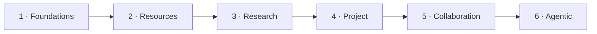

# Plan — Icarus Capability Build Groups & Order

> Mirrored from [Notion](https://app.notion.com/p/3adb6410e502811aae33cd3ba2f7a0c3).

## Authority
This page defines the logical implementation order for Icarus. Runtime layers and already implemented contracts remain authoritative in the pushed repository. A unit begins only after the **Required before implementation** items on its own reference page are available.
## Runtime Prerequisites
Before the grouped sequence, the runtime supplies:
- validated configuration and configuration-bound stores;
- Database and migration primitives;
- Logger and canonical digest utilities;
- RequestEnvelope, Job Registry, serial FIFO, concurrent FIFO, bounded worker pool, and Scheduler;
- Fastify transport and initialization factories;
- internal post-commit Job dispatch.
## Ordered Build Groups

### 1 · Foundations
<table fit-page-width="true" header-row="true">
<tr>
<td>Order</td>
<td>Unit</td>
<td>Required first</td>
<td>Completion boundary</td>
</tr>
<tr>
<td>1.1</td>
<td>Intelligence</td>
<td>Configuration and Logger</td>
<td>Provider-neutral inference, structured output, tools, embeddings, and purpose/strength/speed routing.</td>
</tr>
<tr>
<td>1.2</td>
<td>Context</td>
<td>Database, IDs, digest, and resource-reference contract</td>
<td>Named revisioned Contexts, recursive set resolution, exact manifests, persistence, endpoints, and Jobs.</td>
</tr>
<tr>
<td>1.3</td>
<td>Formula</td>
<td>Configuration limits and Logger</td>
<td>Exact value algebra, parser, evaluator, set queries, indexing/slicing, diagnostics, resolver contract, and wire codec.</td>
</tr>
<tr>
<td>1.4</td>
<td>Data</td>
<td>Formula types and resolver contract, Database, Context reference seam</td>
<td>Stable names plus typed tables, columns, rows, cells, variables, snapshots, resolver adapter, endpoints, and Jobs.</td>
</tr>
</table>
Data is the provisional combined home for the declaration catalog and Structured Data value model. Its internal module boundary keeps naming, table/value storage, and Formula resolution separable while one capability owns the public surface.
### 2 · Resources
<table fit-page-width="true" header-row="true">
<tr>
<td>Order</td>
<td>Unit</td>
<td>Required first</td>
<td>Completion boundary</td>
</tr>
<tr>
<td>2.1</td>
<td>Knowledge</td>
<td>Intelligence, Context, Database, Logger</td>
<td>Windowing, lattice generations, normal retrieval, then admissible-source filtering and region assembly.</td>
</tr>
<tr>
<td>2.2</td>
<td>Document</td>
<td>Formula/Data seam, scoped Knowledge, Context, Intelligence, Database</td>
<td>Content-first authored Documents, exact snapshots, retained Base/ChangeSet history, endpoints, and Jobs.</td>
</tr>
<tr>
<td>2.3</td>
<td>Slides</td>
<td>Document-native rich content, Formula/Data seam, media/file references, Database</td>
<td>Decks, Slides, Shapes, Notes, exact geometry, bindings, retained history, endpoints, and Jobs.</td>
</tr>
<tr>
<td>2.4</td>
<td>Spreadsheet</td>
<td>Formula/Data seam and Database</td>
<td>One sparse grid, stable axes/cells, formulas, spills, ranges, overlays, calculation, retained history, endpoints, and Jobs.</td>
</tr>
</table>
### 3 · Research
<table fit-page-width="true" header-row="true">
<tr>
<td>Order</td>
<td>Unit</td>
<td>Required first</td>
<td>Completion boundary</td>
</tr>
<tr>
<td>3.1</td>
<td>Analysis</td>
<td>Data, Formula, Context, Database, Intelligence for assisted authoring</td>
<td>Analysis specifications, variables, scenarios, executions, charts, immutable results, endpoints, and Jobs.</td>
</tr>
<tr>
<td>3.2</td>
<td>Evidence</td>
<td>Knowledge/source lineage contracts and Database</td>
<td>Source-grounded statements, quotations, citations, review history, exact lineage, endpoints, and Jobs.</td>
</tr>
<tr>
<td>3.3</td>
<td>Research</td>
<td>Analysis, Evidence, Context, scoped Knowledge, Intelligence, Web Retrieval</td>
<td>Question, Hypothesis, and Discovery runs from inline briefs, with candidate Evidence and reviewable answers.</td>
</tr>
</table>
Research accepts an inline inquiry. The later Questions capability supplies optional persistent ownership and linking without blocking the core Research runtime.
### 4 · Project
<table fit-page-width="true" header-row="true">
<tr>
<td>Order</td>
<td>Unit</td>
<td>Required first</td>
<td>Completion boundary</td>
</tr>
<tr>
<td>4.1</td>
<td>Project</td>
<td>Stable public identity and summary contracts from earlier groups</td>
<td>Project aggregate, resource catalog, typed target-address vocabulary, project summary, endpoints, and Jobs.</td>
</tr>
<tr>
<td>4.2</td>
<td>Workspace</td>
<td>Project plus read projections for permanent destinations and native Resources</td>
<td>Overview, Research, Analyze, open-resource tabs, durable view state, endpoints, and Jobs.</td>
</tr>
</table>
### 5 · Collaboration
Collaboration is a build-group label. Its four children are independent capabilities.
<table fit-page-width="true" header-row="true">
<tr>
<td>Order</td>
<td>Unit</td>
<td>Required first</td>
<td>Completion boundary</td>
</tr>
<tr>
<td>5.1</td>
<td>Activity</td>
<td>Project target summaries and committed-fact ports</td>
<td>Idempotent canonical facts and rebuildable project/target/actor feed projections.</td>
</tr>
<tr>
<td>5.2</td>
<td>Presence</td>
<td>Project target address, realtime transport, clock, TTL registry</td>
<td>Heartbeat, leave, list, expiry, and typed realtime messages.</td>
</tr>
<tr>
<td>5.3</td>
<td>Comments</td>
<td>Project target address plus stable anchor-resolution ports from available commentable targets</td>
<td>Durable threads, immutable comment revisions, anchor scans and settlement, endpoints, and Jobs.</td>
</tr>
<tr>
<td>5.4</td>
<td>Questions</td>
<td>Project target contract and optional Research, Activity, and Comments integration ports</td>
<td>Questions with owned Hypotheses, Assumptions, accepted Answer revisions, endpoints, and Jobs.</td>
</tr>
</table>
### 6 · Agentic
<table fit-page-width="true" header-row="true">
<tr>
<td>Order</td>
<td>Unit</td>
<td>Required first</td>
<td>Completion boundary</td>
</tr>
<tr>
<td>6.1</td>
<td>Persona</td>
<td>Library Kernel, Context exact-version reader, Database</td>
<td>Immutable behavior definitions, local copies, exact snapshots, default pointer, endpoints, and Jobs.</td>
</tr>
<tr>
<td>6.2</td>
<td>Agents</td>
<td>Persona, Intelligence, Context, Knowledge, and enabled target commands</td>
<td>Durable tasks, runs, exchange, tool calls, settlements, projections, endpoints, and Jobs.</td>
</tr>
<tr>
<td>6.3</td>
<td>Automation</td>
<td>Agents, Persona validation, Scheduler, Project target and committed-change ports</td>
<td>Schedule/change/condition rules, claims, Agent dispatch, durable runs, settlements, endpoints, and Jobs.</td>
</tr>
</table>
## Supporting Reference Placement
Sources, Media, Library Kernel, Templates, and Import / Export retain their current reference pages. Their final build-group placement remains to be assigned. When one appears in a capability's prerequisite list, that prerequisite is completed before the dependent capability begins.
## Per-Capability Implementation Loop
1. Confirm prerequisites and injected ports.
2. Freeze Types & Interfaces.
3. Construct Runtime Objects and initialization factory.
4. Implement pure Change Operations and invariant tests.
5. Implement capability-owned SQL migration, repository, transactions, idempotency, and store-contract tests.
6. Register Endpoints and capability-owned Job factories.
7. Verify serial/concurrent classification, response mode, and every internal continuation.
8. Integrate through RequestEnvelope → Registry → Scheduler → public capability port.
9. Delete and rebuild every derived projection in tests.
## Completion Gate
- [ ] The seven canonical page sections are complete and ordered.
- [ ] Canonical ownership and prerequisites are unambiguous.
- [ ] Public contracts are transport-neutral.
- [ ] Runtime configuration is bound during construction.
- [ ] Every table, constraint, and SQL index is specified and executable.
- [ ] Revisioned mutations use expected revision, digest-backed idempotency, and atomic compare-and-swap.
- [ ] Jobs list queue, response mode, emitted operations, called ports, and follow-on stages.
- [ ] Derived indexes are distinguishable from canonical and operational state.
- [ ] Tests cover invariants, conflict, replay, persistence, queueing, and settlement.
