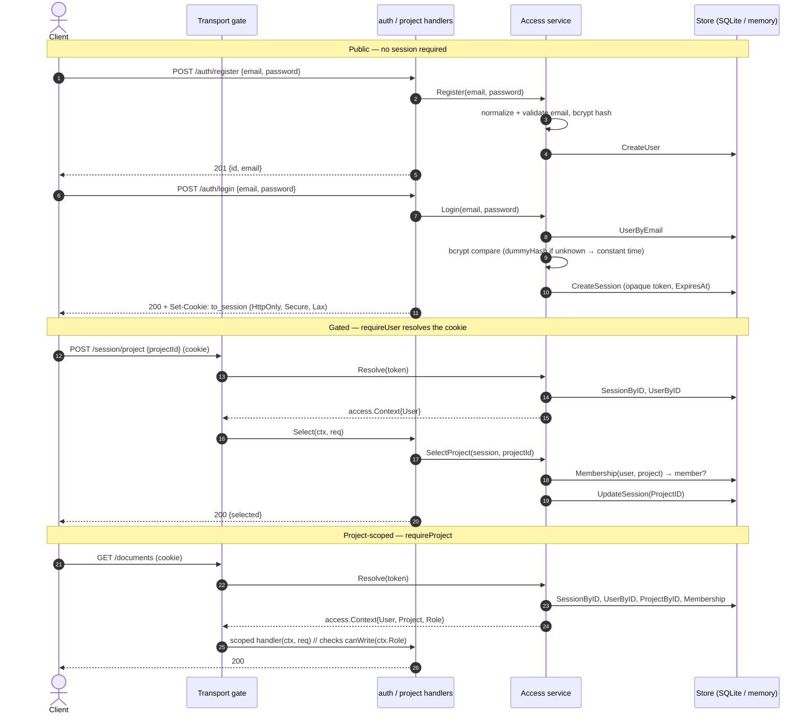
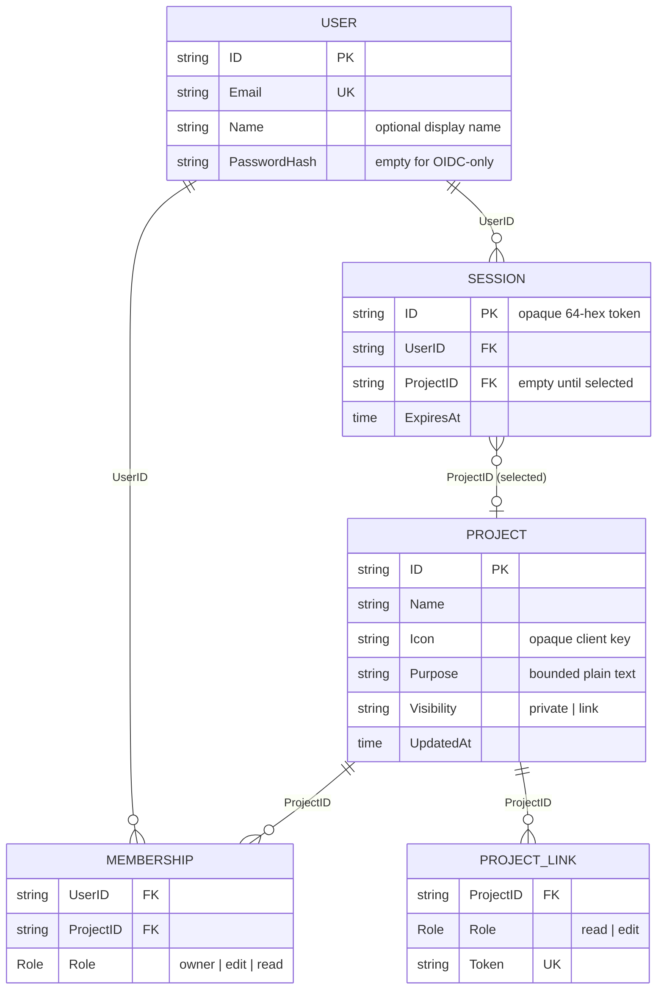

# ACCESS — identity, sessions, projects, and membership

ACCESS answers two questions for every request: *who is making it* and *what
project may they act within*. It is the foundation the rest of the backend sits
on — nothing beyond signing up and signing in is reachable without a resolved
user, and nothing that touches a project's resources is reachable without a
selected project the user is a member of.

The capability splits cleanly across two layers:

- **Domain and persistence contract** — [`core/capability/access`](../../../core/capability/access). The
  `Access` service holds all the identity, session, project, and membership
  logic, and defines the small store interfaces it depends on. It has no
  knowledge of HTTP.
- **Application handlers** — [`core/handlers/auth`](../../../core/handlers/auth/auth.go) and
  [`core/handlers/project`](../../../core/handlers/project/project.go). Thin
  endpoints that translate transport-neutral requests into `Access` calls and
  map the service's sentinel errors onto HTTP status codes.

The [transport](../transport.md) layer bridges the two: its gate turns the
session cookie into an `access.Context` and hands that to scoped handlers. See
the [architecture overview](../runtime-model.md) for where ACCESS sits among the
capabilities, and [persistence](../persistence.md) for the SQLite store that
backs it in production.

## Identity: users

A `User` ([access.go](../../../core/capability/access/access.go)) is one account
identified by a single email:

```go
type User struct {
	ID           string
	Email        string
	Name         string
	PasswordHash string
	CreatedAt    time.Time
}
```

`Name` is an optional display name (≤ 80 runes) the cockpit shows for avatar
initials and the account menu; it is empty until set, at register time or via
`SetUserName` (`PATCH /auth/me`). `PasswordHash` is empty for an account that has
only ever authenticated through OIDC; `HasPassword()` reports whether a password
is set. Password login only
works when a hash is present, and an OIDC-only account can add one later. OIDC
itself is not built yet — the code is shaped so its callback converges on the
same session-creation path (`startSession`) that password login uses.

### Registration

`Access.Register(email, password, name)` is the sign-up path. It:

1. Normalizes the email — `normalizeEmail` lowercases and trims it, so
   `  Alice@Example.com ` and `alice@example.com` are the same account.
2. Validates it — `validEmail` is deliberately minimal: a non-empty local part,
   an `@`, and a domain containing a dot. Failure returns `ErrInvalidEmail`.
3. Enforces a minimum password length of 8 characters, else `ErrWeakPassword`;
   trims the optional display name and bounds it at 80 runes, else
   `ErrInvalidDisplayName`.
4. Rejects a duplicate — a successful `UserByEmail` lookup means the email is
   taken (`ErrEmailTaken`); any error other than `ErrNotFound` propagates.
5. Hashes the password with `bcrypt.GenerateFromPassword(..., bcrypt.DefaultCost)`
   — the plaintext is never stored.
6. Assigns a random `ID` (`newID` → 16 random bytes, 32 hex chars) and a UTC
   `CreatedAt`, then persists via `CreateUser`.

Registration does **not** start a session — it returns the created `User`, and
the client then logs in. The [`auth.Register`](../../../core/handlers/auth/auth.go)
handler maps the outcomes: `ErrEmailTaken` → `409 Conflict`,
`ErrInvalidEmail`/`ErrWeakPassword`/`ErrInvalidDisplayName` → `400` (echoing the
error text), anything else → `500`, success → `201 Created` with
`{id, email, name}`.

### Login and account-enumeration safety

`Access.Login(email, password)` verifies credentials and, on success, calls
`startSession`. Its most important property is that **it never reveals whether an
account exists** — neither through the error it returns nor through how long it
takes.

```go
hash := dummyHash
if err == nil && u.HasPassword() {
	hash = []byte(u.PasswordHash)
}
match := bcrypt.CompareHashAndPassword(hash, []byte(password)) == nil
```

`Login` always runs a bcrypt comparison. When the email is unknown, or the
account has no password, it compares against `dummyHash` — a valid bcrypt hash
computed once at package load (`mustBcrypt`). bcrypt is deliberately slow;
skipping the comparison for an unknown email would make that path measurably
faster and leak, through response timing, which emails are registered. The dummy
hash equalizes the timing.

The error is equalized too. `Login` distinguishes three failures at the service
level:

| Situation | Service error |
|---|---|
| Unknown email | `ErrInvalidCredentials` |
| Wrong password | `ErrInvalidCredentials` |
| Account exists but has no password (OIDC-only) | `ErrNoPassword` |

Unknown-email and wrong-password already share `ErrInvalidCredentials`. The
[`auth.Login`](../../../core/handlers/auth/auth.go) handler then goes further and
collapses `ErrNoPassword` into the same response as well — every failure returns
`401` with the identical message `"invalid email or password"`. So a caller
cannot tell an unknown email from a wrong password *or* from an existing
OIDC-only account: no account enumeration through any of the three.

On success, `Login` returns a `Session` and the handler sets the session cookie
(below), with `MaxAge` derived from the session's remaining lifetime.

### Logout

`Access.Logout(sessionID)` deletes the session record. It is **idempotent** —
deleting a missing session is not an error — so a double logout or a logout of an
already-expired session both succeed. The [`auth.Logout`](../../../core/handlers/auth/auth.go)
handler additionally clears the cookie by re-setting it with an empty value and a
negative `MaxAge`.

## Sessions

A `Session` is the server-side record of a signed-in user:

```go
type Session struct {
	ID        string
	UserID    string
	ProjectID string   // empty until a project is selected
	CreatedAt time.Time
	ExpiresAt time.Time
}
```

### The opaque token

`startSession` mints the ID with `newToken` → **32 random bytes from
`crypto/rand`, hex-encoded to 64 characters**. It is *opaque*: it carries no
claims and is not a JWT. All session state (which user, which project, when it
expires) lives in the record on the server; the token is only the lookup key.
Revocation is therefore immediate and real — deleting the record invalidates the
token, with nothing signed to keep honoring after the fact.

`ExpiresAt` is `CreatedAt + sessionTTL`. The TTL comes from `Options.SessionTTL`
(defaulting to **7 days** inside `New` when unset); the composition root supplies
it from configuration, where the default is `24h` (see
[configuration](../configuration.md)).

### The `to_session` cookie

The token travels in a cookie named `to_session` (`access.SessionCookieName`,
the single constant both the handler and the gate reference). `sessionCookie`
in [auth.go](../../../core/handlers/auth/auth.go) sets its security attributes:

| Attribute | Value | Why |
|---|---|---|
| `HttpOnly` | `true` | Not readable by page scripts — blunts token theft via XSS. |
| `Secure` | `true` | HTTPS-only; the core always serves TLS. |
| `SameSite` | `Lax` | Rides top-level navigations (e.g. a future OIDC redirect back to us) while still blocking cross-site `POST` CSRF. |
| `Path` | `/` | Sent to every route. |
| `MaxAge` | seconds until `ExpiresAt` | Cookie expiry tracks session expiry; `-1` on logout deletes it. |

### Resolving a token into a Context

`Access.Resolve(sessionID)` is the inverse of login — it turns a token back into
the caller's identity:

1. Look the session up (`SessionByID`); an unknown ID returns `ErrNotFound`.
2. If `now` is past `ExpiresAt`, **delete the session** as a side effect and
   return `ErrNotFound` — expiry is enforced lazily, on read, and cleans up after
   itself.
3. Load the user (`UserByID`).
4. If the session has a selected `ProjectID`, populate the project and role — but
   only defensively:

```go
if p, err := a.stores.Projects.ProjectByID(s.ProjectID); err == nil {
	if m, err := a.stores.Memberships.Membership(u.ID, s.ProjectID); err == nil {
		ctx.Project = &p
		ctx.Role = m.Role
	}
}
```

A project that was deleted, or a membership that was revoked, simply leaves the
`Context` with no project selected rather than failing the request. Because this
check runs on **every** request, losing access to a project takes effect
immediately for a user who had it selected — mid-session, without waiting for the
session to expire.

### How the selected project rides on the session

Project selection is server-side state on the session record, not something the
cookie carries. `SelectProject` (below) writes `ProjectID` onto the session and
persists it; `Resolve` reads it back and re-validates it on each request. The
cookie only ever holds the opaque token.

## Projects and membership

### Entities

```go
type Role       string
const ( RoleOwner Role = "owner"; RoleEdit Role = "edit"; RoleRead Role = "read" )
type Visibility string
const ( VisibilityPrivate Visibility = "private"; VisibilityLink Visibility = "link" )

type Project       struct { ID, Name, Icon, Purpose string; Visibility Visibility; CreatedAt, UpdatedAt time.Time }
type Membership    struct { UserID, ProjectID string; Role Role }
type ProjectMember struct { UserID, Name, Email string; Role Role }
```

A `Project` is a workspace. Beyond its name it carries an opaque, client-owned
`Icon` key (a color or glyph the cockpit interprets; the backend stores it
uninterpreted, ≤ 64 runes), a `Visibility` mode (`private` by default, or `link`
for self-serve join — see [Visibility & share links](#visibility--role-carrying-share-links)),
and a `CreatedAt`/`UpdatedAt` pair — the stored `UpdatedAt` tracks profile
changes, while HTTP views compose it with Resource Activity for “last edited.”
A `Membership` is the
user↔project join that carries
the `Role` — it is the basis both for **isolation** (only members may select or
act on a project) and for **access level** (owner/edit/read). A
`ProjectMembership` pairs a `Project` with the requesting user's `Role` — the
shape a *project* listing returns; `ProjectMember` is the mirror for a *member*
listing (one member of one project, joined with their identity). All of this lives
in [project.go](../../../core/capability/access/project.go).

### Purpose and aggregate modification time

Every Project also carries `Purpose`, trimmed plain text bounded at 1,000
Unicode runes. Empty text clears it. Owners may update every Project profile
field; editors may update purpose only; readers may update none. Authorization
is evaluated over the whole partial patch, so an editor's mixed
`{purpose,name}` request fails without applying either field. Empty patches are
invalid, and normalized no-ops do not advance the profile timestamp.

The persisted `Project.UpdatedAt` is profile modification time. The Project HTTP
views report `max(profile UpdatedAt, latest Resource Activity time)`, which gives
the cockpit aggregate “last edited” semantics without coupling Access to
Resource owners or making them contend on the Project row. Membership and
session changes do not advance it; Document rebase does not either.

### Roles and what each permits

The `access` package assigns roles and enforces the owner-only project operations
itself — **deletion**, **update** (rename / icon / visibility), and **member
management** (add, remove, change role) — along with the ≥ 1-owner invariant (see
[Managing members](#managing-members)). The read/write distinction for a project's
*resources* is enforced one layer out, by the downstream handlers, through a
`canWrite` predicate that each defines identically:

```go
func canWrite(role access.Role) bool {
	return role == access.RoleOwner || role == access.RoleEdit
}
```

Putting the two together, the effective matrix is:

| Capability | read | edit | owner |
|---|:---:|:---:|:---:|
| See the project and list/read its resources | ✓ | ✓ | ✓ |
| See the member list | ✓ | ✓ | ✓ |
| Create / edit / delete resources (documents, knowledge, rebase) | | ✓ | ✓ |
| Rename the project / set its icon / set visibility | | | ✓ |
| Add / remove members, change roles | | | ✓ |
| Delete the project | | | ✓ |

A read-only member who attempts a write is rejected with `403` (e.g. `"read
access cannot create documents"` in [`handlers/document`](../../../core/handlers/document/document.go));
`canWrite` also gates knowledge mutations and the async document rebase in the
[transport](../transport.md) wiring. Deleting the project is refused for anyone
but an owner, inside the service.

### Creating a project

`Access.CreateProject(userID, name)` trims the name (empty → `ErrInvalidName`),
creates the `Project`, and — in the same call — makes the creator its owner:

```go
if err := a.stores.Memberships.AddMembership(
	Membership{UserID: userID, ProjectID: p.ID, Role: RoleOwner}); err != nil {
	return Project{}, err
}
```

So every project begins with exactly one member, its owner. The
[`project.Create`](../../../core/handlers/project/project.go) handler returns
`201` with the project and role `owner`.

### Listing, selecting, leaving, deleting

- **List** — `ProjectsForUser(userID)` returns every project the user is a member
  of, each with their role (and now each project's `icon`, `createdAt`,
  `updatedAt`). Handler: `GET /projects`.
- **Update** — `UpdateProject(userID, projectID,
  ProjectChanges{Name, Icon, Purpose, Visibility})` is a role-aware partial
  profile edit. Owners may change every field; editors may change `Purpose`
  only; readers may change none. Pointer fields distinguish omitted values from
  explicit clears, authorization covers the whole patch, empty patches fail,
  and normalized no-ops preserve `UpdatedAt`. Handler:
  `PATCH /projects/:projectID`.
- **Select** — `SelectProject(sessionID, projectID)` loads the session, checks
  the user is a member (non-member → `ErrForbidden`), writes `ProjectID` onto the
  session, and persists it with `UpdateSession`. This is the only way a project
  gets onto a session. Handler: `POST /session/project`; `GET /session/project`
  (`Current`) reports the current selection via `ctx.HasProject()`.
- **Leave** — `LeaveProject(userID, projectID)` requires an existing membership
  (else `ErrNotFound`) and removes it. Any member may leave — **except** the sole
  remaining owner, who gets `ErrLastOwner` (leaving would strand the project); they
  must hand off or delete first.
- **Delete** — `DeleteProject(userID, projectID)` is an owner-only path. It, and
  every other owner-gated operation, share one helper:

```go
func (a *Access) requireOwner(userID, projectID string) error {
	m, err := a.stores.Memberships.Membership(userID, projectID)
	if errors.Is(err, ErrNotFound) { return ErrForbidden }  // non-member
	else if err != nil { return err }
	if m.Role != RoleOwner { return ErrForbidden }          // member, not owner
	return nil
}
```

Both a non-member and a non-owner member get `ErrForbidden` (→ `403`), so an
owner-only operation never confirms a project's existence to someone who cannot
act on it. On success `DeleteProject` removes every membership and share link,
then the project itself.

### Managing members

Member management is owner-only (except the read) and lives entirely in the access
service, all sharing `requireOwner`:

- **List** — `ProjectMembers(actorID, projectID)` — **any member** may read the
  roster; a non-member gets `ErrForbidden`. Returns `[]ProjectMember` (identity +
  role) from `MembersForProject`. Handler: `GET /projects/:id/members`.
- **Add** — `AddProjectMember(actorID, projectID, email, role)` — owner-only,
  **add-existing-user**: it resolves `email` (normalized as at login) to an
  account (`ErrNotFound` → `404` if none), rejects a duplicate with
  `ErrAlreadyMember`, and an unknown role with `ErrInvalidRole`. No pending
  invites. Handler: `POST /projects/:id/members`.
- **Change role** — `SetMemberRole(actorID, projectID, targetID, role)` —
  owner-only; reuses the `AddMembership` upsert as the write. Promoting to `owner`
  is allowed (multiple owners are fine).
- **Remove** — `RemoveMember(actorID, projectID, targetID)` — owner-only.

**The ≥ 1-owner invariant.** `SetMemberRole`, `RemoveMember`, and `LeaveProject`
all guard against dropping the last owner: if the target/leaver is an owner and
`ownerCount == 1`, they return `ErrLastOwner` (→ `409`). A project can therefore
never reach zero owners and become unmanageable. `DeleteProject` is exempt — it
removes the whole project, so there is nothing left to strand.

### Visibility & role-carrying share links

A project's `Visibility` is `private` (members only, the default) or `link` (sharing
on). The owner sets it through the ordinary owner-only `UpdateProject` —
`ProjectChanges.Visibility` rides the same `PATCH /projects/:id` as rename and icon,
rejecting a value outside the two with `ErrInvalidVisibility` (→ `400`). Visibility is
the **master switch**: it grants no access itself; it enables or disables the project's
share links.

Sharing is done with **role-carrying links**. A `ProjectLink{ProjectID, Role, Token}`
is an unguessable capability URL bound to a role — `read` or `edit`, never `owner`.
There is at most one per `(project, role)`, kept behind the `ProjectLinkStore` port:

- **Owners mint / rotate / list / turn off** links via `CreateOrRotateProjectLink`,
  `ProjectLinks`, `DeleteProjectLink` — all `requireOwner`-gated, behind
  `GET/PUT/DELETE /projects/:id/links[/:role]`. `PUT` on a role rotates it (a fresh
  `newToken()`; the old one dies). An owner-role link is rejected with
  `ErrInvalidLinkRole` (→ `400`).
- **Anyone signed in joins by token** via `JoinByLink(userID, token)`, behind the
  top-level `POST /join/:token`. It grants the link's role, or **upgrades** an existing
  member to it — never below their current role (`roleRank` orders owner > edit >
  read), so a link can raise access but never strip it, and an owner is untouched.
- The join writes an ordinary `Membership` row — nothing downstream of the gate
  changes. An unknown token, or any token whose project is not `link`-visible (the
  master switch off), returns `ErrNotFound`: a link leaks nothing when it's off, and
  flipping `link → private` disables every link without deleting them or evicting
  members who already joined. `DeleteProject` cascades the links away with the project.

Not modeled: anonymous or ephemeral (non-member) access, per-link expiry, and
email-sent invitations. Those are larger, separate designs.

### Membership as the authority check

Every project-touching operation re-derives authority from the membership store
rather than trusting anything the client sent — `SelectProject`, `DeleteProject`,
`LeaveProject`, and `Resolve` each call `Membership(...)` (or `ProjectByID` +
`Membership`) fresh. There is no cached grant to go stale.

## The `access.Context` and `ScopedHandler` contract

`Resolve` produces a `Context` — the resolved access state for one request:

```go
type Context struct {
	Session Session
	User    User
	Project *Project   // nil unless a project is selected and still valid
	Role    Role       // the user's role in Project
}
```

Handlers that require a signed-in user implement `ScopedHandler`, which takes the
`Context` alongside the neutral request:

```go
type ScopedHandler func(Context, endpoint.Request) endpoint.Response
```

Public routes implement the plain `endpoint.Handler` (`func(Request) Response`)
instead — this is exactly the register/login split. Because the type system
distinguishes them, a route that needs a user *cannot* be written without
receiving a `Context`, and that `Context` only ever arrives from the gate, which
only produces it from a valid session. Downstream handlers read
`ctx.User.ID`, `ctx.Project`, and `ctx.Role` directly — for example
`project.Create` scopes the new project to `ctx.User.ID`, and every document
handler checks `canWrite(ctx.Role)` before mutating.

### How the gate produces it (see [transport](../transport.md))

The [transport gate](../../../core/transport/gate.go) is where the cookie becomes
a `Context`. In brief: `resolve` reads the `to_session` cookie and calls
`Access.Resolve`, mapping any error to "anonymous"; `requireUser` rejects an
anonymous request with `401` and otherwise stashes the `Context` for the scoped
handler; `requireProject` additionally requires `ctx.HasProject()`, answering
`409 "select a project first"` when no project is selected. The full adapter
mechanics live in [transport](../transport.md); this document does not repeat
them.

## The store interfaces: dependency inversion

`Access` depends only on five narrow interfaces, aggregated in `Stores`:

- `UserStore` — `CreateUser`, `UserByID`, `UserByEmail`, `UpdateUserName`
- `SessionStore` — `CreateSession`, `SessionByID`, `UpdateSession`, `DeleteSession`
- `ProjectStore` — `CreateProject`, `ProjectByID`, `DeleteProject`, `ProjectsForUser`, `UpdateProject`
- `MembershipStore` — `AddMembership`, `Membership`, `RemoveMembership`, `RemoveProjectMemberships`, `MembersForProject`
- `ProjectLinkStore` — put/rotate, token lookup, list/delete by Project and role, and remove all on Project deletion

The service is written entirely against these; it never imports a database
driver. Two implementations satisfy them:

- **Production** — a single durable SQLite `Store`
  (`core/platform/storage/sqlite`) implements all five. The composition root in
  [`core/wiring`](../../../core/wiring/wiring.go) opens it once and passes the
  same value into every slot:

  ```go
  acc := access.New(
      access.Stores{Users: store, Sessions: store, Projects: store, Memberships: store, Links: store},
      access.Options{SessionTTL: ttl},
  )
  ```

- **Tests** — `MemoryStore` ([memory.go](../../../core/capability/access/memory.go))
  is a mutex-guarded, map-backed implementation of all five interfaces in one
  value (users by ID, an email→ID index, sessions, projects, and memberships
  keyed by `userID\x00projectID`). `NewMemoryStore()` gives tests a real,
  concurrency-safe store with no database, exercising the identical `Access`
  logic that runs in production.

Because a single value can implement all five interfaces, the seam is about
*substitutability*, not splitting storage across backends — SQL slides in behind
the same contract the in-memory store already satisfies. See
[persistence](../persistence.md) for the SQLite schema and transactions.

## Diagrams

### Register → login → select project → gated request



### Entities and relationships



## HTTP surface

### Safe peer-profile projection

Within a selected Project, `GET /users/:userID` returns only `{id,name}` for a
current member. The Access service first checks the target's current membership
in that Project, and the transport gate has already checked the caller's. A
former, foreign, or missing user returns 404. This supports resolving Activity
actors without exposing email, password state, sessions, provider identities,
timestamps, or roles; those richer fields remain limited to their explicitly
authorized surfaces.

| Method & path | Handler | Gate | Notes |
|---|---|---|---|
| `POST /auth/register` | `auth.Register` | public | rate-limited per IP; optional `name` |
| `POST /auth/login` | `auth.Login` | public | rate-limited; sets `to_session` |
| `GET /auth/me` | `auth.Me` | `requireUser` | current user (`id, email, name`) |
| `PATCH /auth/me` | `auth.UpdateName` | `requireUser` | set display name (self) |
| `POST /auth/logout` | `auth.Logout` | `requireUser` | clears cookie; idempotent |
| `GET /projects` | `project.List` | `requireUser` | projects + roles + complete profile; aggregate `updatedAt` |
| `POST /projects` | `project.Create` | `requireUser` | creator becomes owner |
| `PATCH /projects/:projectID` | `project.Update` | `requireUser` | owner: all profile fields; edit: `purpose` only; atomic authorization |
| `DELETE /projects/:projectID` | `project.Delete` | `requireUser` | owner only |
| `POST /projects/:projectID/leave` | `project.Leave` | `requireUser` | any member; `409` for the sole owner |
| `GET /projects/:projectID/links` | `project.Links` | `requireUser` | owner; list active read/edit links |
| `PUT /projects/:projectID/links/:role` | `project.RotateLink` | `requireUser` | owner; create/rotate read or edit token |
| `DELETE /projects/:projectID/links/:role` | `project.DeleteLink` | `requireUser` | owner; disable one role link |
| `POST /join/:token` | `project.JoinByToken` | `requireUser` | join/upgrade by token; visibility is master switch |
| `GET /projects/:projectID/members` | `project.Members` | `requireUser` | any member; list identity + role |
| `POST /projects/:projectID/members` | `project.AddMember` | `requireUser` | owner; add existing user by email |
| `PATCH /projects/:projectID/members/:userID` | `project.SetMemberRole` | `requireUser` | owner; `409` drops last owner |
| `DELETE /projects/:projectID/members/:userID` | `project.RemoveMember` | `requireUser` | owner; `409` drops last owner |
| `POST /session/project` | `project.Select` | `requireUser` | member only; sets session's project |
| `GET /session/project` | `project.Current` | `requireUser` | current selection |
| `GET /users/:userID` | `user.Get` | `requireProject` | safe `{id,name}` for a current peer only |
| project-scoped routes (`/documents`, …) | downstream | `requireProject` | consume `ctx.Project` / `ctx.Role` |

The credential endpoints (`register`, `login`) sit behind a per-IP rate limiter
(5 req/s, burst 10) wired in [transport](../transport.md) to blunt online
brute-force and credential-stuffing.

## Related

- [Architecture overview](../runtime-model.md) — where ACCESS fits.
- [Transport](../transport.md) — the gate, adapters, and how the `Context` reaches handlers.
- [Persistence](../persistence.md) — the SQLite store behind the interfaces.
- [Configuration](../configuration.md) — session TTL, mode, storage DSN.
- [Documents](documents/README.md) — the first project-scoped capability that consumes `ctx.Project` and `ctx.Role`.
