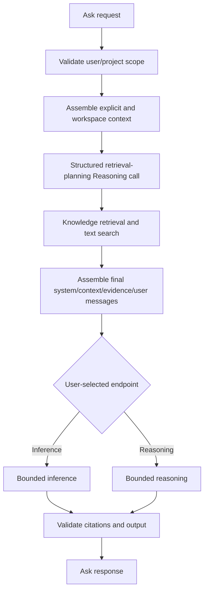

# Quarterback Ask

> **Status: the [agent](README.md) capability is built; Ask itself is library
> code, not yet routed.** This page records the accepted *design* of the Ask
> consumer. Since it was written, the agent capability, its HTTP handler, and a
> durable task store have all been built and wired — Plan and Action tasks are
> live at `/agent/*`. The `Ask` service is implemented and unit-tested but has no
> HTTP route. Where this design and the built code differ, the code wins; see
> [the agent overview](README.md) for the capability as it actually exists.

Ask is designed as the read-only contextual answer path for the Quarterback surface. It
does not create a Task, mutate a Resource, or grant the model an implicit tool
authority. It assembles bounded context, retrieves evidence, invokes the
selected Intelligence endpoint, and returns an answer with citations and
uncertainty.

## Initial contract

```text
AskRequest {
    project_id
    prompt
    answer_mode: inference | reasoning
    strength: low | medium | high
    active_scope?
    active_target?
    active_tab?
    selection?
    conversation_context?
    limits
}

AskResponse {
    answer
    citations[]
    uncertainty
    insufficient_evidence
    context_used[]
    context_omitted[]
    suggested_next_intent?
    usage
}
```

Workspace context is optional. Until Workspace exposes an active tab or
selection, those fields are absent and the service reports them as unavailable
rather than guessing. Every supplied resource reference is reauthorized and
version-checked before it enters model context.

> **As built, the contract differs from this sketch.** The implemented
> `AskRequest` keeps `project_id` out of the request body (it rides trusted
> scope), replaces `answer_mode`/`strength` with an Intelligence **cast**,
> replaces the specific workspace fields with a generic `context[]{label,
> content}`, and adds a `persona` selection. The `Response` drops
> `context_used`/`context_omitted`/`suggested_next_intent` and instead returns an
> `evidence[]` list. Treat the shape above as the original design intent, not the
> current API.

## Execution pipeline



The planning call is internal and never answers the user. It returns bounded
retrieval queries, text-search queries, source constraints, answer intent, and
whether clarification is needed. It cannot mutate state or invoke arbitrary
tools.

Retrieval is automatic for both final modes. Knowledge remains inference-free:
it embeds the bounded queries and returns cited regions. Text search is a
separate bounded read port. The planner and retrieval stages have independent
query, result, token, and round limits.

The assembled evidence is synthesized through Intelligence's bounded
reasoning-with-tools call, which receives the original prompt, not only a
rewritten retrieval query. (The original design, diagrammed above, let the caller
choose a one-shot Inference or Reasoning endpoint; the built service always runs
the tool loop, so the answer phase is a single reasoning path.)

## Message construction

The final Intelligence request keeps policy, context, evidence, and user input
structurally separate:

```text
system:   answer policy, citation rules, uncertainty/refusal rules, output contract
context:  project/scope, active target/tab/selection, Formula results, conversation
evidence: Knowledge regions and text-search results with source/version/citation IDs
user:     original Ask prompt verbatim
```

Retrieved or user-supplied content is never interpolated into the system
message. It is labeled as source material and treated as untrusted input. A
structured final response must cite only evidence IDs that were actually
provided to the call; the service rejects invented citations.

## Context ordering and limits

Context is additive and prioritized in this order:

1. the user’s original prompt;
2. explicitly supplied selection or quoted content;
3. active target, tab, and exact resource version;
4. project and scope metadata;
5. deterministic Formula results;
6. Knowledge and text-search evidence;
7. explicitly included conversation context.

The service records which entries were used, omitted, truncated, stale, or
unavailable. Scope and authorization are checked before budgeting or retrieval.
No context entry can widen the user’s authority.

## Insufficient evidence

The first implementation performs one bounded planning/retrieval pass. If the
evidence is insufficient, the response says so and carries `insufficient_evidence`
and uncertainty rather than fabricating an answer. A future tool-use extension
may permit one or more additional bounded retrieval rounds; that is not part of
the Ask-only contract.

Ask may return a suggested Action or Plan intent, but accepting that suggestion
is a separate explicit command. Ask never creates a Task automatically.

## Current boundary

This section is superseded. Intelligence still exposes one-shot Reason and Infer
over HTTP, but its bounded [tool-use loop](../intelligence/tool-use.md) is **no
longer unwired**: the [agent](README.md) capability drives it in production for
Plan and Action tasks, and the built `Ask` service runs the same loop with a
knowledge-search binding rather than the caller choosing a one-shot endpoint. Ask
is implemented as library code; the only remaining step is exposing it over HTTP.
For the capability as actually built, see [the agent overview](README.md).
