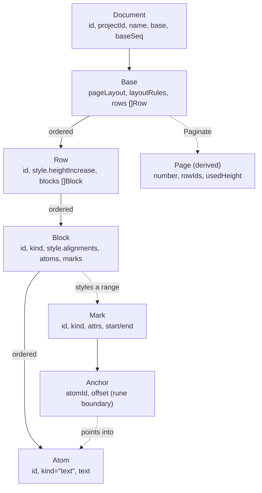

# The DOCUMENT capability

A **document** is a named piece of content that lives inside one project: a
title plus a structured body of rows, blocks, and inline text. Documents are the
primary authored surface of Taurus Omega — the thing a user writes into — and
they are also the primary feed into the [knowledge lattice](../knowledge/README.md),
which indexes their text for grounded retrieval.

The capability is split across three layers, in the pattern used throughout the
backend (see the [architecture overview](../../runtime-model.md)):

- **Domain / service** — [`core/capability/document/`](../../../../core/capability/document/):
  the content model, the change-set engine, the `Documents` service, and the
  `Store` interface it depends on. No HTTP, no SQL.
- **Handlers** — [`core/handlers/document/document.go`](../../../../core/handlers/document/document.go):
  the endpoint adapters that bind the service to the request/response types and
  enforce write access.
- **Transport & persistence** — [`core/transport/transport.go`](../../../../core/transport/transport.go)
  routes the operations and decides which run synchronously and which become
  background jobs; [`core/platform/storage/sqlite/sqlite.go`](../../../../core/platform/storage/sqlite/sqlite.go)
  implements the `Store`.

This document explains the capability as a whole — the content model, the
change-set editing engine, Resource/Activity integration, prompt resolution, and
re-basing. For a **type-by-type reference** of the current content model and its
extension points, see the companion pages:

- **[Data model](data-model.md)** — the full containment hierarchy, its
  invariants, and where a new type plugs in.
- **[Block types](block-types.md)** — a section per block kind (paragraph,
  headings, the implemented prompt subtype, and deferred list/code kinds).
- **[Atoms & marks](atoms-and-marks.md)** — a section per inline atom kind and
  per styling mark, plus anchors.
- **[Prompt blocks](prompt-blocks.md)** — the generated block kind: the
  resolution pipeline (plan → retrieve → synthesize), refresh/reload, evidence,
  and stable non-answers.

This document explains both the concept and the implementation. Every claim is
grounded in those files.

## Resource metadata and Activity

Documents are the first canonical owner behind the unified
[Resource catalog](../resources/README.md). The Resource identity is the exact
Document ID. A bounded summary query orders owner metadata by `updatedAt DESC,
id ASC`, and the composition adapter routes create, rename, and delete back to
this capability.

Every user-visible mutation commits a safe semantic
[Activity](../activity/README.md) fact with the canonical SQLite effect. Create,
change-set append, rename, and delete emit one fact; a normalized rename no-op
emits none. Change-set append advances `Document.UpdatedAt` at the same instant
as the change set. Rebase only folds representation state and deliberately
preserves that visible timestamp.

---

## The content model

A document's body is a strict containment tree. From outside in:

```
Document → Base → []Row → []Block → []Atom
                   │        └──────↘ []Mark → Anchor → (into an Atom)
                   └─ PageLayout + LayoutRules → derived []Page
```

All of these types are defined in
[`model.go`](../../../../core/capability/document/model.go).



### Atom — inline content

An `Atom` is the smallest unit of content: `{ID, Kind, Text}`. Every atom carries
display `Text`; `Kind` selects how that text is produced. Today the only atom
kind is `AtomKindText` (`"text"`) — literal text. The `Kind` field is the
deliberate seam for later formula and prompt atoms; nothing but text is accepted
now (`validAtomKind` in [`changeset.go`](../../../../core/capability/document/changeset.go)
allows only `""`, which defaults to text, or `"text"`).

### Anchor and Mark — inline formatting

Inline styling is stored out-of-band from the text, addressed by position rather
than by wrapping the text:

- An `Anchor` is `{AtomID, Offset}` — a UTF-8 **byte** offset into a specific
  atom's text that must land on a rune boundary.
- A `Mark` is `{ID, Kind, Attrs, Start, End}` and applies one style across the
  range from its `Start` anchor to its `End` anchor over a block's atoms.

The supported mark kinds are constants in `changeset.go`:
`bold`, `italic`, `underline`, `strike`, `code`, and `link` (which requires
`Attrs["href"]`). The `markKinds` set rejects anything else, so a renderer never
has to guess. A mark range is only valid if both anchors point at rune
boundaries inside existing atoms and `Start` comes strictly before `End`
(`validMarkRange` / `validAnchor` / `anchorLess`).

### Block — a structural unit of text

A `Block` is `{ID, Kind, Style, StyleRef, Inferred, Atoms, Marks, Data}`: an
ordered list of atoms plus marks, block-level alignment, an optional semantic
style reference, an optional typed subtype, and a flag distinguishing generated
content. `Style.HorizontalAlign` is `left|center|right`; `Style.VerticalAlign`
is `top|middle|bottom`. Missing values normalize to `left` and `top`.
`StyleRef`, when present, points at one `Base.StyleRegistry` definition and can
carry only the override keys that definition explicitly allows. Its **display
text is the concatenation of its atoms' text**, produced by `Block.DisplayText()`:

```go
func (b Block) DisplayText() string {
	var sb strings.Builder
	for _, a := range b.Atoms {
		sb.WriteString(a.Text)
	}
	return sb.String()
}
```

`DisplayText` is the single seam the [knowledge lattice](../knowledge/README.md)
consumes (see [Feeding knowledge](#feeding-knowledge) below).

**Block kinds** are the default markdown set — a paragraph and six heading
levels — plus the generated prompt block, all defined in `document.go`:

| Constant | Value |
| --- | --- |
| `BlockKindParagraph` | `paragraph` (the default when a block omits a kind) |
| `BlockKindHeading1..6` | `heading_1` … `heading_6` |
| `BlockKindPrompt` | `prompt` (requires `PromptData`; generated atoms are `Inferred`) |

Every one is text-bearing. Paragraphs/headings have no subtype; a prompt carries
the authored instruction and resolution metadata in `PromptData`. List and code
kinds are a later increment. The `blockKinds` set makes unknown kinds **fail
closed**, and validation also requires `Data` to match its kind.

### Row, Base, and Document

A `Row` (`{ID, Style, Blocks}`) is a horizontal group of blocks; a document's
body is a vertical list of rows. `Style.HeightIncrease` adds bounded space to
the row's configured baseline height.

`Base` is `{PageLayout, LayoutRules, StyleRegistry, Rows}`. `PageLayout` is the
document-wide width, height, and four margins. `LayoutRules` captures the
maximum font height, minimum padding above and below every row, and the maximum
permitted row-height increase. `StyleRegistry` is the document-owned catalog of
semantic style definitions plus block-kind defaults. All dimensions are integer
[`LayoutUnit`](../../../../core/capability/document/layout.go) values in
typographic points (1/72 inch).

`Base` is the **resolved content of a document**: the "base version" that change
sets are applied on top of. The `Document` itself is:

```go
type Document struct {
	ID, ProjectID, Name string
	Base                Base
	CreatedAt, UpdatedAt time.Time
	Revision            int64 // latest accepted content change-set Seq
	BaseSeq             int64 // internal watermark, json:"-"
}
```

`Revision` is the public logical content head: a new document starts at `0`, and
each accepted change set advances it exactly once to that change set's `Seq`.
`BaseSeq` is the highest change-set sequence already folded into `Base`. It is
an internal watermark — `json:"-"` keeps it out of the API representation.
Re-base advances `BaseSeq` toward `Revision` but never changes `Revision`,
because folding history is not a user-visible edit.

Every row, block, atom, and mark has a **stable ID**. `Documents.Create` calls
`assignIDs` / `normalizeBlock` to mint IDs (and default kinds) for anything the
caller left blank, because change ops address content by ID, never by position —
so an ID has to exist before an op can reference it.

### Layout and derived pages

Page geometry is canonical content, but page membership is not. `Paginate`
derives pages from a resolved Base by computing each row as:

```
row height = maxFontHeight + 2 × minRowPadding + heightIncrease
```

It accumulates complete rows in order within
`page.height - marginTop - marginBottom`; the next row starts a new page only
when adding it would exceed that usable height. An exact fit stays on the
current page, and an empty document yields one empty page for a renderer.

The layout rules are snapshotted into each new Base from configuration, so
changing service defaults cannot silently repaginate existing documents.
Legacy stored bases with absent layout fields are normalized on service reads.
The default is US Letter (`612 × 792` points), one-inch margins, a 24-point
maximum font, 4 points of padding on each side of a row, and a 144-point
height-increase cap. `Page` values contain one-based number, ordered row IDs,
and used height; they are a pure projection and are not persisted or appended
to the change log.

---

## Editing via submissions and change sets

A document is never mutated in place. A client sends a revision-bound,
idempotent **change submission**; accepting it appends one **change set**, an
ordered batch of typed operations. The current content is **its base plus every
change set applied in `Seq` order**. Operations apply to the whole Base, not
only its rows, so document-level layout revisions participate in the same
replay and inverse machinery.

### The submission envelope

```go
type ChangeSubmission struct {
	SubmissionID     string
	ExpectedRevision int64
	Operations       []ChangeOp
}
```

`SubmissionID` is an opaque idempotency key scoped to the Document and trusted
author. It is required, non-blank, free of control characters, and at most 128
UTF-8 bytes. `ExpectedRevision` is the exact non-negative Document revision the
author observed. The service fingerprints that authored revision and the
unnormalized operations before it assigns any missing content IDs.

An identical retry returns the originally accepted ChangeSet, including its
server-assigned content IDs, without advancing revision, visible time, or
Activity again. Reusing the scoped ID with a different fingerprint conflicts.
A new submission against a stale revision is admitted only if retained
ChangeSets reconstruct the authored base and semantic read/write footprints
prove every incoming operation disjoint from every intervening operation.
Disjoint splices on one Atom receive deterministic byte-offset and text-digest
transformation. Any overlap, ambiguity, or missing retained evidence returns
the bounded revision conflict. Undo and redo remain exact current-head
compensations and do not use semantic rebase.

### The ops

`OpType` (in [`changeset.go`](../../../../core/capability/document/changeset.go))
names one operation at the document-layout, style-registry, row, block, atom,
mark, or prompt-block level. There are twenty-eight, and
`applyOp` implements each:

| `OpType` | Value | Effect |
| --- | --- | --- |
| `OpInsertRow` | `insert_row` | Insert `Row` after `AfterRow` (`""` = at the start) |
| `OpDeleteRow` | `delete_row` | Remove the row `RowID` |
| `OpInsertBlock` | `insert_block` | Insert `Block` into `RowID` after `AfterBlock` (`""` = start) |
| `OpDeleteBlock` | `delete_block` | Remove the block `BlockID` |
| `OpSetBlock` | `set_block` | Set `BlockID`'s `Kind` (from `SetKind`) |
| `OpSetBlockAlignment` | `set_block_alignment` | Set either or both alignment fields on `BlockID` |
| `OpSetRowHeight` | `set_row_height` | Set `RowID`'s bounded extra height |
| `OpSetPageLayout` | `set_page_layout` | Replace document-wide page geometry |
| `OpPutStyleDefinition` | `put_style_definition` | Create or replace one semantic style definition |
| `OpDeleteStyleDefinition` | `delete_style_definition` | Remove one unused semantic style definition |
| `OpSetStyleDefault` | `set_style_default` | Set or clear one block-kind default style |
| `OpAssignBlockStyle` | `assign_block_style` | Replace one block's explicit semantic style reference |
| `OpSetBlockStyleOverrides` | `set_block_style_overrides` | Replace one block style ref's allowed overrides |
| `OpReplaceStyle` | `replace_style` | Rewrite one style's defaults and block usages to another style and delete the old definition |
| `OpInsertAtom` | `insert_atom` | Insert `Atom` into `BlockID` after `AfterAtom` (`""` = start) |
| `OpDeleteAtom` | `delete_atom` | Remove `AtomID` from `BlockID` |
| `OpSetAtomText` | `set_atom_text` | Set `AtomID`'s text within `BlockID` (from `SetText`) |
| `OpSpliceAtomText` | `splice_atom_text` | Replace one digest-guarded UTF-8 byte range in `AtomID` |
| `OpMoveRow` | `move_row` | Move an existing Row after a destination Row anchor |
| `OpMoveBlock` | `move_block` | Move an existing Block within or between Rows |
| `OpMoveAtom` | `move_atom` | Move an existing Atom within or between Blocks |
| `OpAddMark` | `add_mark` | Add `Mark` to `BlockID` |
| `OpRemoveMark` | `remove_mark` | Remove `MarkID` from `BlockID` |
| `OpUpdateMark` | `update_mark` | Replace one digest-guarded Mark in place |
| `OpSplitBlock` | `split_block` | Split the minimal single-atom text Block into an adjacent new Row |
| `OpJoinBlocks` | `join_blocks` | Join two adjacent minimal text Blocks into the left Block |
| `OpSetPrompt` | `set_prompt` | Replace a prompt block's instruction and clear its resolution timestamp |
| `OpResolveBlock` | `resolve_block` | Replace a prompt block's generated content and typed data |

A single `ChangeOp` struct carries all of these shapes; only the fields relevant
to its `Op` are set. **Every structural target is addressed by ID, never by
position** — anchors (`AfterRow`, `AfterBlock`, `AfterAtom`), targets (`RowID`,
`BlockID`, `AtomID`, `MarkID`, `StyleID`), payloads (`Row`, `Block`, `Atom`,
`Mark`, `StyleDefinition`, `BlockStyleRef`, `StyleOverrides`), and scalar
setters (`SetKind`, `SetText`, `HeightIncrease`, and the two alignments, where a
nil pointer means "leave unchanged"). Page layout is the sole document-wide
layout target and is replaced directly. Fine-grained operations additionally
carry exact prior-state fields: text and Mark digests, move source parents and
predecessors, splice byte ranges, and join counterparts. Addressing repeatable
content by ID is what lets ops replay in a canonical order and still land on the
right unit.

### Fine-grained editing preconditions

`splice_atom_text`, `split_block`, and `join_blocks` use lowercase SHA-256
digests of the exact current UTF-8 text bytes. Text offsets describe the
half-open byte range `[startOffset,endOffset)` and must land on rune boundaries;
an offset cannot split a multi-byte character. A splice transforms Mark anchors
on that Atom deterministically: anchors before the edit stay fixed, anchors
after it shift by the byte-length delta, and anchors inside the replaced range
snap to the replacement edges. Any range that cannot remain valid is removed,
while the private inverse restores the exact original Mark slice.

Moves retain the existing Row, Block, or Atom value and identity. They name the
exact current source parent and predecessor (`from*`) as a precondition, plus a
destination parent and predecessor. A stale parent or ordering fact conflicts
instead of silently moving newly rearranged state. An Atom move also conflicts
if it would leave a source or destination Mark pointing outside its Block.

`update_mark` replaces the named Mark at its existing slice position. Its
`expectedMarkHash` is SHA-256 over the current Mark's canonical JSON, so changing
the range, kind, or attributes invalidates an edit based on the old value.

The first split/join contract is intentionally narrow: both operate on
adjacent, authored, unmarked text Blocks with one Atom each, and each Row must
contain only that Block. Split carries an empty one-Block/one-Atom Row skeleton;
the service preserves caller IDs or assigns missing ones, keeps the prefix in
the original Atom, and writes the suffix into the new Atom. Join concatenates
into the left Atom and removes the right Row. Their stored inverses preserve the
original Row, Block, Atom, kind, and style identities exactly.

### Change sets and seq

A `ChangeSet` groups the ops of one author, applied as a unit:

```go
type ChangeSet struct {
	ID, DocumentID, AuthorID, AuthorName, SubmissionID string
	AuthoredRevision, PriorRevision, Seq               int64
	CreatedAt                                          time.Time
	Ops                                                []ChangeOp
	UndoOf, RedoOf                                     string
	Summary                                            ChangeSummary
	SubmissionHash                                     string     // omitted from JSON
	InverseOps                                         []ChangeOp // omitted from JSON
}
```

`Seq` is assigned **by the server** when the change set is appended, giving every
change set a total order per document. Ops are always resolved in `Seq` order,
so the resolved result is identical regardless of the order change sets happen to
be stored or retrieved in. Within a change set, ops apply in array order. The
change set's durable `ID` identifies that exact revision. `PriorRevision`
records the exact admitted head and is therefore `Seq-1`;
`AuthoredRevision` records the head the client observed. They differ only when
semantic proof admits a stale submission. `SubmissionID` links the accepted
revision to a retryable request, while its private
`SubmissionHash` detects mismatched reuse. `AuthorID` and the snapshotted
`AuthorName` come from trusted session context (or the system actor for
generated work); clients cannot choose another author. `Summary` is computed by
the server from the accepted operations and contains only bounded operation
kinds and affected stable IDs.

The bounded Activity projection deliberately does not duplicate the detailed
revision. Its `document.change_set` source points back to the change-set `ID`,
and its actor snapshot describes the same accepted effect in the project feed.
The change set remains the authoritative operation/author record. An undo
revision sets `UndoOf` to the authored target; a redo revision sets `RedoOf` to
the undo it compensates. Each receives its own ID and `edited` Activity fact.
`InverseOps` is computed and retained by the server but excluded from public
JSON.

### Resolving: base + change sets

`applyChangeSets(base, sets)` replays the ops of `Seq`-ordered change sets onto a
base and returns the resolved `Base`. It works on a **deep copy** (`cloneBase`),
so it never mutates the base it is handed — important because a store may hand
out rows that alias its stored copy. The result is deterministic for a given
`(base, ordered change sets)` pair.

This is exactly what a read does. `Documents.Get` loads the stored base, fetches
the pending change sets above the watermark with `ChangeSetsSince(id,
doc.BaseSeq)`, and returns `applyChangeSets(base, pending)`:

```go
pending, _ := d.store.ChangeSetsSince(id, doc.BaseSeq)
resolved, _ := applyChangeSets(doc.Base, pending)
doc.Base = resolved
```

So a caller always sees current content, whether or not the pending ops have
been folded into the stored base yet.

### Conflict handling

`applyOp` **preserves the author's intent**. An op whose anchor or target ID is
missing — or an insert that would duplicate an existing ID, a mark whose range
does not fit, or an R3 digest/parent/predecessor/range/adjacency precondition
that is stale — returns `ErrConflict` rather than being relocated or silently
dropped. The change no longer matches the document, so it is rejected.

Two distinct edits interact through proven admission, not implicit
last-writer-wins behavior. At the current head, operations validate directly.
For a stale ordinary submission, `rebaseStaleOperations` reconstructs the
authored state from the retained base and ordered ChangeSets, then compares
semantic read/write footprints against every later accepted operation.

Property facts are independent at their actual owner: horizontal and vertical
Block alignment can commute, while two writes to the same alignment axis or Row
height conflict. Structural deletion writes the complete descendant tree, and
ordering operations write their parent container, so destructive overlap and
competing reorderings fail. Coarse whole-text writes remain conservative.
Disjoint splices on the same Atom are the one specialized transform: later
byte offsets and expected text digests are updated, while overlapping ranges
and ambiguous insertion boundaries conflict. Splices on different Atoms
commute, including their independent Mark-anchor transformations.

Proof also fails when `ExpectedRevision` is older than `BaseSeq`, retained
ChangeSets have a gap, or a trial application no longer matches. The response
is the same bounded `document_revision_conflict` with the current/resync head.
The store still performs one compare-and-swap against the actual admission
head. If another writer wins that race, the service reloads and recomputes the
proof, up to a fixed bound; it never reuses a proof against a different head.
An operation invalid at its authored state continues to return `ErrConflict`.

Deletes and whole-text replacement keep marks honest:
`sanitizeBlockMarks` drops any range that no longer fits. Fine-grained splice
instead transforms anchors around the changed byte range and only drops a range
that cannot remain valid.

### The submission flow

`Documents.SubmitChanges` (in `document.go`) is how content is edited:

1. Validate the submission ID, non-negative expected revision, and operation
   shape. `validateOps` requires a non-empty set and every op to
   carry the fields and supported kinds it needs. Failures are
   `ErrInvalidSubmission` or `ErrInvalidChangeSet`.
2. Fingerprint the authored revision plus unnormalized operations, then load and
   project-scope the Document.
3. Look up the scoped submission ID before revision admission. An identical
   retained retry returns the original ChangeSet; mismatched reuse returns
   `document_submission_conflict`.
4. Clone the operations, then `assignOpIDs` to mint missing stable IDs and
   default kinds without mutating or changing the request fingerprint.
5. If the authored revision is current, resolve normally. If it is stale,
   reconstruct that retained authored base, classify semantic footprints, and
   transform only proven-disjoint operations. Insufficient history or overlap
   returns `document_revision_conflict`.
6. **Dry run and inverse**: resolve that exact Document, then
   `applyOpsWithInverse(resolved, ops)` against the actual admission head to
   confirm every op applies cleanly and compute exact compensation from its
   pre-edit state. If any op
   conflicts, the whole change set is rejected (`ErrConflict`) and nothing is
   written. Inverse operations are ordered backward, preserve stable identities,
   and restore the exact prior text, ordering, Mark value, and any Mark slice
   changed implicitly by text editing.
7. `store.AppendChangeSet` repeats idempotency lookup and revision CAS inside
   the atomic write boundary. On success it retains
   `AuthoredRevision = ExpectedRevision`, assigns `PriorRevision` to the actual
   admission head and `Seq = PriorRevision + 1`, advances visible time, and
   inserts the change set, private inverse, and linked `edited` Activity fact
   together. A concurrent identical retry returns the winner. A distinct CAS
   loser reloads and recomputes semantic proof against the new head, with a
   bounded conflict after the retry limit or whenever proof fails.
8. If the pending count has reached the threshold, enqueue a re-base
   (below).

The validation and conflict errors map to HTTP status codes in the handler
(below): invalid submission/change shape → 400; operation, revision, or
submission conflict → 409.

> `Documents.Create` runs the analogous check up front with `validateContent`,
> which **fails closed** on invalid page geometry, layout rules, row height,
> block alignment, block/atom/mark kind, subtype, or mark range
> (`ErrInvalidContent`). A document is never stored with state the change ops
> would later reject.

```mermaid
sequenceDiagram
  participant C as Client
  participant H as Handlers.AppendChanges
  participant S as Documents service
  participant St as Store
  participant Q as job.Enqueuer
  participant W as Worker · RebaseJob

  C->>H: POST /documents/:id/changes {submissionId, expectedRevision, operations}
  H->>S: SubmitChanges(projectID, id, authorID, submission)
  S->>St: DocumentByID + ChangeSetBySubmission
  alt identical retained retry
    St-->>S: original ChangeSet
    S-->>H: original ChangeSet (201)
  else reused ID with different fingerprint
    S-->>H: document_submission_conflict (409)
  end
  S->>St: ChangeSetsSince(id, baseSeq)
  alt ExpectedRevision is current
    S->>S: resolve current base + pending sets
  else authored revision is stale
    S->>S: reconstruct authored base + prove/transform semantic rebase
    Note over S: overlap or missing proof → bounded revision conflict (409)
  end
  S->>S: applyOpsWithInverse(actual admission head, admitted ops)
  Note over S: any conflict → ErrConflict (409), nothing written
  S->>St: AppendChangeSet(cs, admissionRevision, activityFact)
  alt identical submission won the race
    St-->>S: original ChangeSet; no second write
  else revision advanced after validation
    St-->>S: ErrRevisionConflict → reload and re-prove within bound
  else exact compare-and-swap succeeds
    St-->>S: AuthoredRevision + PriorRevision + Seq + visible time + Activity
  end
  S->>St: ChangeSetsSince(id, baseSeq) → count pending
  alt pending ≥ rebaseThreshold and enqueuer set
    S->>Q: Enqueue(JobTypeRebase, {projectId, documentId})
  end
  S-->>H: ChangeSet (201 Created)
  Note over W: later, off the request path
  W->>S: Rebase(projectID, documentID)
  S->>St: RebaseDocument(newBase, lastSeq)
  S->>St: PruneChangeSets(historyLimit)
```

---

## History, undo, and redo

Undo and redo are append-only compensations. Neither deletes, suppresses, nor
rewrites an earlier revision:

```http
POST /documents/:documentID/changes/:changeSetID/undo
POST /documents/:documentID/changes/:changeSetID/redo
```

`Documents.Undo` loads the retained target by document and ID, then requires:

1. the authenticated user is the target's `AuthorID`;
2. the target's `Seq` is the document's current `Revision`; and
3. the target is not itself an undo revision; and
4. the target has retained `InverseOps`.

If all four hold, the service appends those inverse operations as a new change
set by the same author, with `UndoOf` pointing to the target. The compensating
set receives its own durable ID and next `Seq`, advances the document revision,
and emits the ordinary bounded `edited` Activity fact.

`Documents.Redo` is explicit. Its target must be the current authored head, must
be an undo (`UndoOf` is non-empty), must not itself be a redo, and must retain an
inverse. Redo appends that inverse with `RedoOf` pointing to the undo revision.
A redo is an ordinary reversible state transition, so it may itself be undone.
Undoing an undo through the undo route is rejected: callers must use redo, which
keeps lineage and client intent unambiguous.

The current safety boundary intentionally permits only **current-head
compensation**. Refusing an older target guarantees one author's action cannot
overwrite a later collaborator's edit. It also gives redo simple invalidation:
once any new edit advances the head, the former undo is no longer eligible.
Author mismatch is `403`; a missing target is `404`; an older/ineligible head, a
migrated revision with no retained inverse, or an append race is `409`.
Selective inverse transformation across later revisions is a separate future
capability.

Re-basing does not break undo while the target remains retained: it changes only
the base watermark, not the logical revision or the change-set record.

### Inspecting History

```http
GET /documents/:documentID/history?limit=20&cursor=<opaque>
GET /documents/:documentID/history/:changeSetID
```

The list is newest-first by revision. `limit` defaults to 20 and must be from 1
through 100. When more retained summaries exist, `nextCursor` is a
document-bound opaque keyset cursor for the next older page; clients must return
it unchanged. The cursor is an ordering boundary, not authorization, and every
page reauthorizes the Document in the selected Project.

Each `HistoryEntry` contains revision, authored revision, prior/admission
revision, trusted author snapshot, creation time, optional submission and
undo/redo lineage, and a bounded `ChangeSummary`. A summary contains operation
count, unique operation kinds, and at most 32 row, block, atom, and mark IDs per
kind; IDs over 128 bytes are omitted. Either omission sets `truncated`.
Page-layout operations are marked `documentWide`. Arbitrary atom text, prompt
content, and inverse recipes never enter the summary.

`detailAvailable` says whether the full ChangeSet still exists.
`canUndo`/`canRedo` are calculated for the requesting viewer and are true only
for the eligible current authored head with a retained inverse. The get route
returns that retained public ChangeSet detail, still omitting private inverse
and submission-fingerprint fields; it returns 404 once detail has been pruned.

---

## Re-basing

Every read replays the pending change-set log on top of the base. Left
unchecked, that log grows without bound and reads get slower forever.
**Re-basing** folds the pending change sets into a fresh base and advances the
internal watermark, so reads stop replaying an ever-growing op log. It does not
change the public `Revision`. The change sets themselves are kept (up to a
limit) as authored history and the source of retained undo recipes.

### Automatic trigger

`DefaultRebaseThreshold` is `50`. `Options.RebaseThreshold` overrides it (values
below 1 fall back to the default). After a newly accepted submission,
`SubmitChanges` counts the pending change sets and, once the count reaches the
threshold, enqueues a re-base:

```go
if d.enqueuer != nil {
	if all, err := d.store.ChangeSetsSince(id, doc.BaseSeq); err == nil && len(all) >= d.rebaseThreshold {
		_, _ = d.enqueuer.Enqueue(context.Background(), JobTypeRebase, rebasePayload{...})
	}
}
```

Enqueue is **best effort**: the change set is already durably recorded, so if the
enqueue fails the next append re-triggers, and reads keep resolving pending
change sets in the meantime either way. If no `Enqueuer` was configured,
re-basing is simply skipped — reads still resolve, they just never fold.

### Dispatched as an async background job

Re-basing does not run in the request path. It is a job. The service exposes:

- `JobTypeRebase` = `"document.rebase"` and a `rebasePayload{ProjectID,
  DocumentID}` — the payload carries the project ID so the job stays scoped to
  its project.
- `Documents.RebaseJob(ctx, payload)` — a `job.Handler` that decodes the payload
  and calls `Rebase`. It is registered with the job registry at startup.

The transport maps the operation accordingly (see
[`dispatch.go`](../../../../core/transport/dispatch.go) and the
[transport doc](../../transport.md)): `documents.rebase` is marked
`dispatchDeferred`; prompt-block `documents.resolve` is the other asynchronous
Document operation. Ordinary CRUD/change-set operations are `dispatchConcurrent`. The
dev-only route

```
POST /dev/documents/:documentID/rebase
```

enqueues a `JobTypeRebase` job (authorized by `canWrite`) and returns **202 +
a job id** the caller polls at `GET /jobs/:jobID`. So a re-base is triggered two
ways — automatically at the threshold, or manually via that maintenance route —
and both go through the same job.

### The re-base itself

`Documents.Rebase` is scoped to a project and **idempotent** — with nothing
pending it is a no-op, so running it twice is harmless:

1. Load pending change sets (`ChangeSetsSince(id, doc.BaseSeq)`); return early if
   none.
2. `applyChangeSets(doc.Base, pending)` → the new base.
3. `store.RebaseDocument(id, newBase, pending[last].Seq)` — replace the base and
   advance `BaseSeq` to the last folded `Seq` without changing `Revision`.
4. If `HistoryLimit > 0`, `store.PruneChangeSets(id, historyLimit)`.

### History limit

`Options.HistoryLimit` caps retained **summary entries** per Document after a
re-base. `0` keeps all summaries and detailed ChangeSets. With a positive limit,
pruning retains all pending ChangeSets required to reconstruct current content
and the current-head detailed ChangeSet required for an immediately eligible
undo or redo, while removing older folded detail. The separate summary
projection retains only the newest `keep` entries.

Pruning also runs when a re-base job finds nothing pending. That makes a changed
retention setting converge after restart without requiring another edit.
Idempotency receipts are separate and remain available for exact retry safety;
they are not a public unbounded History surface.

---

## The `Store` interface

The service depends on an interface, not on a database — the dependency-inversion
seam that keeps the domain package free of SQL and lets tests run against memory.
`Store` (in `document.go`) is:

```go
type Store interface {
	CreateDocument(d Document, fact ActivityFact) error
	DocumentByID(id string) (Document, error)
	DocumentsByProject(projectID string) ([]Document, error)
	DocumentSummaries(projectID string, before *SummaryBoundary, limit int) ([]Summary, error)
	RenameDocument(id, name string, updatedAt time.Time, fact ActivityFact) error
	DeleteDocument(id string, fact ActivityFact) error

	AppendChangeSet(cs ChangeSet, expectedRevision int64, fact ActivityFact) (ChangeSet, error)
	ChangeSetByID(documentID, changeSetID string) (ChangeSet, error)
	ChangeSetBySubmission(documentID, authorID, submissionID string) (ChangeSet, error)
	ListChangeSetHistory(documentID string, beforeRevision int64, limit int) ([]HistoryEntry, error)
	ChangeSetsSince(documentID string, afterSeq int64) ([]ChangeSet, error)
	RebaseDocument(documentID string, base Base, baseSeq int64) error
	PruneChangeSets(documentID string, keep int) error
}
```

A key contract: **a document's base and a change set's operations and inverse
operations are opaque values the store serializes whole; it never interprets
rows, blocks, or ops.** Summary construction remains domain logic too. The
store only reads and writes blobs plus indexed metadata.

### In-memory store

[`memory.go`](../../../../core/capability/document/memory.go) provides `MemoryStore`,
a mutex-guarded map-backed implementation used in tests. `AppendChangeSet`
first deduplicates `(DocumentID, AuthorID, SubmissionID)` by private hash, then
checks `Document.Revision == expectedRevision`, assigns `PriorRevision` and the
matching next `Seq`, and advances revision, visible time, and Activity under the
same lock; create/rename/delete preserve their existing atomic behavior.
`DocumentSummaries` supplies bounded Resource pages; `ChangeSetsSince` filters
and sorts cloned values by `Seq`; `ChangeSetByID` returns a cloned retained
revision; `ChangeSetBySubmission` performs the scoped idempotency lookup; and
`ListChangeSetHistory` traverses independently retained immutable summaries.
With positive retention, `PruneChangeSets` keeps every pending change set plus
the current head, bounds summary History, and leaves immutable submission
receipts available. It is the reference behaviour the SQLite store mirrors.

### SQLite store

[`sqlite.go`](../../../../core/platform/storage/sqlite/sqlite.go) is the production
implementation (see the [persistence doc](../../persistence.md)). Four tables
back the capability:

```sql
CREATE TABLE documents (
  id, project_id, name,
  base TEXT NOT NULL,           -- the Base, marshalled as JSON
  base_seq INTEGER NOT NULL DEFAULT 0,
  revision INTEGER NOT NULL DEFAULT 0,
  created_at, updated_at
);
CREATE TABLE change_sets (
  id, document_id, author_id, author_name,
  submission_id TEXT NOT NULL DEFAULT '',
  submission_hash TEXT NOT NULL DEFAULT '',
  authored_revision INTEGER NOT NULL DEFAULT 0,
  prior_revision INTEGER NOT NULL DEFAULT 0,
  seq INTEGER NOT NULL,
  created_at,
  ops TEXT NOT NULL,            -- submitted []ChangeOp as JSON
  undo_of TEXT NOT NULL DEFAULT '',
  redo_of TEXT NOT NULL DEFAULT '',
  summary TEXT NOT NULL DEFAULT '{}',
  inverse_ops TEXT NOT NULL DEFAULT '[]'
);
CREATE INDEX idx_change_sets_doc_seq ON change_sets(document_id, seq);
CREATE UNIQUE INDEX idx_change_sets_doc_revision ON change_sets(document_id, seq);
CREATE UNIQUE INDEX idx_change_sets_doc_undo
  ON change_sets(document_id, undo_of) WHERE undo_of <> '';
CREATE UNIQUE INDEX idx_change_sets_doc_redo
  ON change_sets(document_id, redo_of) WHERE redo_of <> '';
CREATE UNIQUE INDEX idx_change_sets_doc_submission
  ON change_sets(document_id, author_id, submission_id)
  WHERE submission_id <> '';
CREATE TABLE document_submissions (
  document_id, author_id, submission_id,
  submission_hash TEXT NOT NULL,
  receipt TEXT NOT NULL,        -- accepted ChangeSet + private inverse as JSON
  PRIMARY KEY (document_id, author_id, submission_id)
);
CREATE TABLE document_history (
  change_set_id PRIMARY KEY, document_id, author_id, author_name,
  submission_id, authored_revision, prior_revision, seq, created_at,
  undo_of, redo_of,
  summary TEXT NOT NULL,
  UNIQUE (document_id, seq)
);
CREATE INDEX idx_document_history_doc_seq
  ON document_history(document_id, seq DESC);
```

The opaque-blob contract shows up directly: `CreateDocument` / `RebaseDocument`
`json.Marshal` the `Base` into the `base` column, and `AppendChangeSet` marshals
`Ops`, `Summary`, and `InverseOps` into their JSON columns. It stores the
content-free History projection and one immutable submission receipt in the
same append transaction. The receipt lets an identical retry return the
original response even after detailed ChangeSet pruning. Nothing interprets
these JSON payloads in SQL. Notable methods:

- **`AppendChangeSet`** runs in a transaction: first return an identical scoped
  submission or reject mismatched reuse, then update the document from
  the supplied admission revision to its successor only if the head still
  matches. It retains the client-observed `AuthoredRevision`, records the old
  head as `PriorRevision`, uses the new value as `Seq`, and inserts the change
  set, immutable History entry, receipt, and linked `edited` Activity fact. A
  CAS loser returns `ErrRevisionConflict`; the service decides whether a new
  semantic proof is possible.
- **`ChangeSetByID`** loads one revision within its document, including the
  private inverse needed by the undo service.
- **`ChangeSetBySubmission`** loads one retained idempotency receipt by
  Document, trusted author, and opaque submission ID.
- **`ListChangeSetHistory`** keyset-pages `document_history` newest-first and
  left-joins detailed ChangeSets to report current detail/inverse availability.
- **`ChangeSetsSince`** is `WHERE document_id = ? AND seq > ? ORDER BY seq` —
  served by the `idx_change_sets_doc_seq` index.
- **`DocumentSummaries`** pages metadata by `updated_at DESC, id ASC` without
  loading or resolving content; the Resource adapter consumes it.
- **Create / rename / delete** each commit the canonical effect and its bounded
  Activity fact in one transaction. Rename no-ops are filtered by the service.
- **`RebaseDocument`** is a single `UPDATE documents SET base = ?, base_seq = ?`
  — the base swap and internal watermark advance in one statement without
  changing public revision, user-visible time, or Activity.
- **`PruneChangeSets`** transactionally removes folded detail below the current
  head and bounds `document_history` to the newest `keep`; pending reconstruction
  rows and the head recipe are untouched. Immutable idempotency receipts remain
  until their owning Document is deleted.
- **`DeleteDocument`** removes History, submission receipts, change sets, and the
  canonical document, then retains the deleted target snapshot by inserting
  Activity before commit.

---

## Handlers and transport surface

[`core/handlers/document/document.go`](../../../../core/handlers/document/document.go)
adapts the service to endpoints. All routes run inside a resolved
[access `Context`](../access.md) that already has a project selected (the
transport's project gate guarantees it), and every operation is scoped to that
project. Mutations require write access — `canWrite` admits `RoleOwner` and
`RoleEdit`; a read-only member is refused with 403.

| Operation | Route | Handler | Notes |
| --- | --- | --- | --- |
| `documents.list` | `GET /documents` | `List` | returns `{documents: [...]}` |
| `documents.create` | `POST /documents` | `Create` | write; body `{name, rows, pageLayout?}`; layout rules come from server config; 201 |
| `documents.get` | `GET /documents/:documentID` | `Get` | returns the **resolved** document; 404 on miss |
| `documents.rename` | `PATCH /documents/:documentID` | `Rename` | write; body `{name}`; no-op aware |
| `documents.delete` | `DELETE /documents/:documentID` | `Delete` | write; 404 on miss |
| `documents.append_changes` | `POST /documents/:documentID/changes` | `AppendChanges` | write; body `{submissionId, expectedRevision, operations}`; identical retry returns original ChangeSet; 201 |
| `documents.history.list` | `GET /documents/:documentID/history?limit&cursor` | `History` | newest-first bounded summaries; default 20, max 100 |
| `documents.history.get` | `GET /documents/:documentID/history/:changeSetID` | `GetChangeSet` | retained public ChangeSet detail; inverse omitted |
| `documents.undo` | `POST /documents/:documentID/changes/:changeSetID/undo` | `Undo` | write; author + current head only; 201 |
| `documents.redo` | `POST /documents/:documentID/changes/:changeSetID/redo` | `Redo` | write; current authored undo head only; 201 |
| `documents.resolve` | `POST /documents/:documentID/blocks/:blockID/resolve` | — (async) | production route; body `{mode}`; enqueues `JobTypeResolve`, returns 202 + job id |
| `documents.rebase` | `POST /dev/documents/:documentID/rebase` | — (async) | dev-only; enqueues `JobTypeRebase`, returns 202 + job id |

The handlers translate domain errors to status codes: `ErrNotFound` → 404,
`ErrInvalidName` / `ErrInvalidContent` / `ErrInvalidSubmission` /
`ErrInvalidChangeSet` / invalid History limit or cursor → 400, `ErrConflict` /
bounded revision or submission admission conflicts / undo-redo eligibility,
head, or inverse conflicts → 409, undo-redo author mismatch → 403, anything else
→ 500. Admission-conflict bodies include stable `code`, `expectedRevision`,
`currentRevision`, and `resyncRevision`. History, CRUD, rename, append, undo, and
redo are synchronous; re-base and prompt resolution are async jobs.

---

## Feeding knowledge

Documents are the main content source for the [knowledge lattice](../knowledge/README.md).
The bridge is `flatten` in
[`core/handlers/knowledge/knowledge.go`](../../../../core/handlers/knowledge/knowledge.go),
which the lattice's `AddDocument` handler calls on a **resolved** document
(fetched via `Documents.Get`, so pending edits are already folded in):

```go
func flatten(d doc.Document) (string, []kb.BlockSpan) {
	var sb strings.Builder
	var blocks []kb.BlockSpan
	for _, r := range d.Base.Rows {
		for _, b := range r.Blocks {
			start := sb.Len()
			sb.WriteString(b.DisplayText())
			blocks = append(blocks, kb.BlockSpan{RowID: r.ID, BlockID: b.ID, Start: start, End: sb.Len()})
			sb.WriteByte('\n')
		}
	}
	return sb.String(), blocks
}
```

`flatten` renders the document to two things:

1. **Plain text** — each block's `DisplayText()` on its own line. This is what
   the lattice embeds and indexes.
2. **A block map** — a `[]kb.BlockSpan` recording, for each block, the byte range
   `[Start, End)` it occupies in that text along with its `RowID` and `BlockID`.

The block map is why the lattice can cite **real document addresses**: a
retrieved span maps back through the byte ranges to the exact rows and blocks it
came from, rather than being an opaque offset into a disposable string. The
document capability owns the content and its stable IDs; the lattice owns the
embeddings and windows — the `BlockSpan` is the contract between them. See the
[knowledge overview](../knowledge/README.md) for the retrieval side.

---

## See also

- [Architecture overview](../../runtime-model.md) — how capabilities compose.
- [Transport](../../transport.md) — sync vs. async dispatch and the job queue.
- [Persistence](../../persistence.md) — the SQLite store and concurrency model.
- [Access](../access.md) — the resolved `Context`, roles, and project scoping.
- [Knowledge](../knowledge/README.md) — the lattice that indexes flattened documents.
