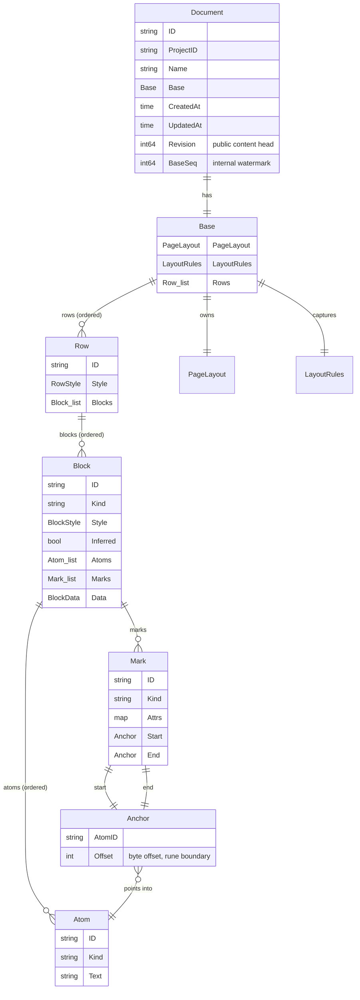

# Document data model

This is the complete data model of a document — every structural level, every
field, and the rules that keep it valid. It is the vocabulary the rest of the
document capability is written in, including the typed payload used by the
implemented prompt block, and the vocabulary any later extension must use. Read
this first, then the per-type references:

- **[Block types](block-types.md)** — a section per block kind.
- **[Atoms & marks](atoms-and-marks.md)** — a section per inline atom kind and
  per styling mark.

For how documents are *edited, resolved, and re-based* (change sets, `Seq`
ordering, the async re-base job), see the capability's
[architecture doc](README.md). This page is about the **shape** of the content;
that page is about its **lifecycle**.

Source: [`model.go`](../../../../core/capability/document/model.go) (the
content types), [`layout.go`](../../../../core/capability/document/layout.go)
(styles, layout, and derived pages), and
[`changeset.go`](../../../../core/capability/document/changeset.go) (the ops and
validation).

## The shape

A document's structural content is a strict containment hierarchy. Every
repeatable content unit has a stable `ID` and is never addressed by position;
the Base's single document-wide layout/rules values are addressed directly.

Read top-down: a **Document** owns a **Base**; the Base owns page geometry,
captured row metrics, a semantic style registry, and an ordered list of
**Rows**. A Row has bounded height style and an ordered list of **Blocks**. A
Block has local alignment style, an optional semantic style reference, ordered
**Atoms**, and **Marks** whose two Anchors point into those atoms.

## The levels

### Document

The top-level resource — a named piece of content inside a project.
[`model.go`](../../../../core/capability/document/model.go) `Document`:

| Field | Meaning |
|---|---|
| `ID` | server-assigned identity |
| `ProjectID` | the owning project; every service method is scoped by it, so a project can only ever reach its own documents |
| `Name` | display name (required, non-empty) |
| `Base` | the resolved content (below) |
| `CreatedAt` / `UpdatedAt` | timestamps |
| `Revision` | latest accepted content change-set sequence; public in the JSON API and unchanged by re-base |
| `BaseSeq` | **internal** watermark — the highest change-set `Seq` already folded into `Base`. Not part of the JSON API (`json:"-"`). |

`Revision` and `BaseSeq` are the two editing watermarks. `Revision` is the
logical head clients see; `BaseSeq` is how far storage has folded that history
into `Base`. A stored Base is content as of `BaseSeq`, and reads resolve newer
change sets through `Revision` on top of it (see [README](README.md)). Re-base
can advance `BaseSeq` without changing `Revision`. Undo also advances
`Revision`: it is a new compensating change set, not a rollback of this counter.

### Base

[`Base`](../../../../core/capability/document/model.go) is
`{ PageLayout, LayoutRules, StyleRegistry, Rows []Row }`. It is the complete
resolved, revisioned content unit:

| Field | Meaning |
|---|---|
| `PageLayout` | width, height, and top/right/bottom/left margins, in whole typographic points |
| `LayoutRules` | captured maximum font height, minimum padding on each side of a row, and maximum row-height increase |
| `StyleRegistry` | document-owned semantic style definitions plus block-kind defaults |
| `Rows` | canonical ordered document content |

Configuration supplies the layout/rule defaults for a newly created document.
The rules are copied into its Base so later configuration changes do not
silently repaginate existing content. Clients may provide `PageLayout` at
create; `LayoutRules` remain trusted server configuration.

### Row

[`Row`](../../../../core/capability/document/model.go) is
`{ ID, Style RowStyle, Blocks []Block }`
— a horizontal group of blocks. A document's content is the **vertical** list of
rows; blocks within a row are its horizontal members. Today most documents are
one block per row, but the row layer is what makes side-by-side block layout
(columns) possible without a model change. `Style.HeightIncrease` is extra
space above the baseline
`MaxFontHeight + 2 × MinRowPadding`; it must be between zero and the Base's
captured `MaxHeightIncrease`.

### Block

[`Block`](../../../../core/capability/document/model.go) is the workhorse
structural unit: `{ ID, Kind, Style BlockStyle, StyleRef *BlockStyleRef,
Inferred, Atoms []Atom, Marks []Mark, Data BlockData }`. `Kind` selects what
the block *is*; `Style` owns horizontal (`left|center|right`) and vertical
(`top|middle|bottom`) alignment; `StyleRef`, when present, points at one
semantic style definition in the owning Base and carries only that definition's
allowed override keys; `Atoms` are its inline content in order; `Marks` style
ranges across those atoms. `Data` is a typed kind-specific payload (`nil` for
paragraphs/headings, `PromptData` for a prompt block). `Inferred` marks
system-generated content so Knowledge ingestion can exclude it. Plain-text
rendering still uses `DisplayText()`—the concatenation of atom text. The valid
kinds are enumerated in [block types](block-types.md).

### Atom

[`Atom`](../../../../core/capability/document/model.go) is the smallest inline
unit: `{ ID, Kind, Text }`. Every atom carries display `Text`; `Kind` selects
how that text is *produced*. Today the only kind is literal `text`; the code
comment names **formula and prompt atom kinds** as the seam for a later
increment. Detailed in [atoms & marks](atoms-and-marks.md).

### Mark and Anchor

A [`Mark`](../../../../core/capability/document/model.go) applies inline
styling (bold, a link, …) to a range of a block's atoms: `{ ID, Kind, Attrs,
Start Anchor, End Anchor }`. An [`Anchor`](../../../../core/capability/document/model.go)
is `{ AtomID, Offset }` — a position *inside* an atom, as a UTF-8 byte offset
that must land on a rune boundary. Marks are addressed and validated against the
atoms they span; both are covered in [atoms & marks](atoms-and-marks.md).

### Derived Page

[`Page`](../../../../core/capability/document/layout.go) is not canonical
document state. `Paginate(Base)` deterministically derives
`{ Number, RowIDs, UsedHeight }` pages by packing complete row heights inside
the page's vertical margins. It never splits or stores a row, an exact fit stays
on the current page, numbering is one-based, and empty content still returns
one empty page.

## Two invariants that govern everything

### 1. Structural content is addressed by id, never by position

Every row, block, atom and mark has a stable `ID`. When a client supplies content
without ids, the service assigns them: `assignIDs` / `normalizeBlock` in
[`model.go`](../../../../core/capability/document/model.go) fill every
missing id and every missing kind (a block defaults to `paragraph`, an atom to
`text`) *before* the content is stored. This is what lets change-set ops
(`insert_block`, `splice_atom_text`, `update_mark`, …) target a unit by id and
be replayed in a canonical order and still land on the right thing. First-class
`move_row`, `move_block`, and `move_atom` retain those same IDs while changing
containment or order, rather than modeling rearrangement as identity-destroying
delete-plus-insert. See the [op catalog](README.md). A consequence for any new
type: **it must have an `ID` and slot into the id-assignment pass** so ops can
reference it.

The one exception is not positional content: `set_page_layout` replaces the
single page-geometry value owned directly by Base, so it needs no synthetic ID.

### 2. Fail closed on unknown kinds

The model refuses content it does not understand. Kinds are validated against
fixed registries — `blockKinds`, `markKinds`, and `validAtomKind` in
[`changeset.go`](../../../../core/capability/document/changeset.go) — at two
gates: `validateContent` (when a document is created) and `validateOps`
(when a change set is appended). An unknown block, atom, or mark kind is rejected
(`ErrInvalidContent` / `ErrInvalidChangeSet`), and marks are additionally
range-checked (`validMarkRange`: the range must fit existing atoms at rune
boundaries, ordered and non-empty; a `link` mark must carry `Attrs["href"]`). A
renderer therefore never has to guess: stored content only ever contains kinds
the model knows. Layout also fails closed: page content bounds must be positive,
the page must fit the largest permitted row, height increases must remain
within the captured cap, and alignments must be recognized. Block payloads also
fail closed: prompt blocks require `PromptData`, and kinds without a subtype
reject unexpected `Data`.

## Extending the model — where a new type plugs in

Because the model fails closed, adding a capability means **adding a kind and
teaching the registries about it** — nothing works until it is declared. The code
already marks two seams for growth:

- **New block kinds** — `blockKinds` in
  [`model.go`](../../../../core/capability/document/model.go) is the
  registry; the comment notes *list and code kinds come in a later increment*. A
  new block kind is a structural unit that occupies a position in a row.
- **New atom kinds** — `validAtomKind` in
  [`changeset.go`](../../../../core/capability/document/changeset.go) gates them;
  the `Atom` comment names *formula and prompt atom kinds* as the seam. A new
  atom kind is an inline unit inside a block's text flow, still carrying display
  `Text` (so `DisplayText` and knowledge ingestion keep working) but *producing*
  that text some other way.

To add either, the pattern is fixed: declare the kind constant, add it to its
registry, extend validation (and, for a kind that carries structured data, the
fields it needs and the ops that set them), and make sure the id-assignment pass
covers it. Retrieval, rendering, and the change-set machinery then handle it for
free, because they operate on the generic `Block`/`Atom` shapes.

### The implemented prompt-block subtype

Prompt generation uses the block-kind choice: `kind: "prompt"` occupies a row
like a paragraph or heading and carries `PromptData` in `Data`. That payload
holds the authored instruction plus resolution status, evidence/source
snapshots, prior instruction/output, token usage, and resolution time. Generated
display text remains ordinary atoms and the block is marked `Inferred`, so it is
editable and renderable while being excluded from source ingestion.

An inline prompt atom remains only a possible future extension. The implemented
shape and lifecycle are documented in [prompt blocks](prompt-blocks.md).
