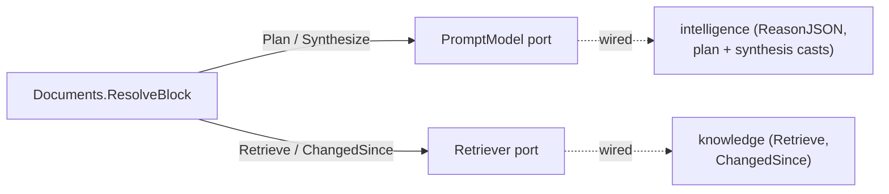
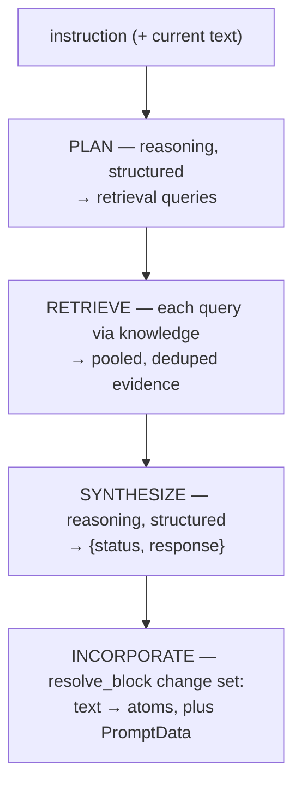
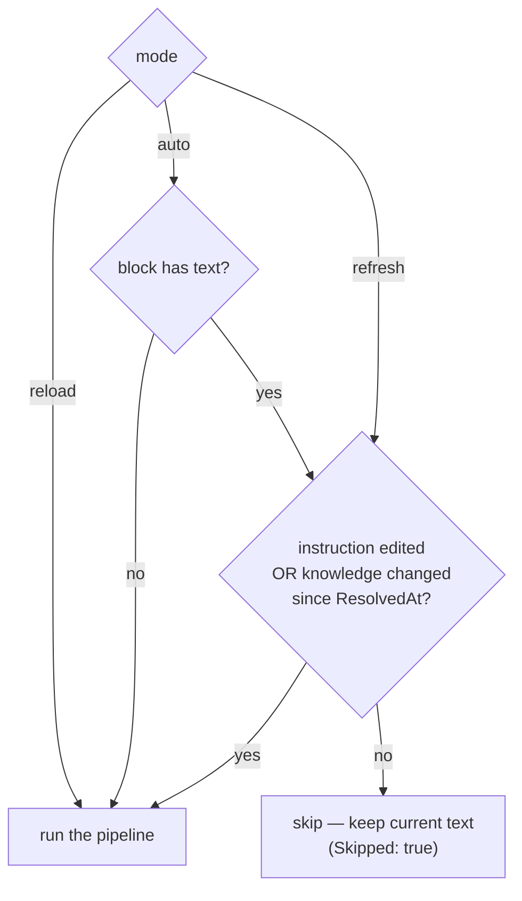

# Prompt blocks — grounded generation in a document

A **prompt block** is a document block whose text is *generated* rather than
authored: it answers a prompt from the project's own [knowledge](../knowledge/README.md),
grounded in retrieved evidence and produced through [intelligence](../intelligence.md).
It is the first block kind that is not just typed text, and the first payoff of a
working knowledge lattice — a document can contain a section that answers a
question from its sources, with the evidence attached and a stable non-answer
when the sources don't support one.

This page is the conceptual + implementation reference. The block's place in the
content model is in [block types](block-types.md#the-prompt-block) and the
[data model](data-model.md); the design rationale and increments are in record
[0011](../../../records/0011-prompt-block.md). Source:
[`prompt.go`](../../../../core/capability/document/prompt.go) (the pipeline and
ports), [`model.go`](../../../../core/capability/document/model.go)
(`PromptData`), and [`changeset.go`](../../../../core/capability/document/changeset.go)
(the ops).

## The block

A prompt block is an ordinary [`Block`](../../../../core/capability/document/model.go)
with `Kind: "prompt"`, carrying a typed `PromptData` subtype (the composition
model — see [data model](data-model.md#extending-the-model--where-a-new-type-plugs-in)):

| `PromptData` field | Role |
|---|---|
| `Instruction` | the authored prompt |
| `Status` | the last resolution's outcome: `ok` / `insufficient` / `contradiction` |
| `Evidence` | the supporting spans (`sourceId`, byte range, text) the answer was built from |
| `Sources` | the distinct origins drawn on (provenance) |
| `LastInstruction` | the instruction that produced `LastOutput` (fed back so a refresh can tell whether the *formatting* intent changed) |
| `LastOutput` | the model's previous answer (a formatting reference for stable refreshes — never a fact source) |
| `Usage` | what the last resolution cost (surfaced here because it runs in a job) |
| `ResolvedAt` | when it last resolved (zeroed by a prompt edit, to force a refresh) |

The **display text lives in the block's atoms** like any other block — so it
renders, is markable, and is directly editable. A prompt block is also
`Inferred`, so [`flatten`](../../../../core/handlers/knowledge/knowledge.go)
keeps its generated text out of the knowledge lattice (no self-ingestion loop).

## Where the work lives — two ports on `document`

Resolution is inference-bearing, but it does **not** need a new capability:
`document` defines two ports and lets the composition root supply the adapters,
exactly as `knowledge` depends on an `Embedder` it never imports. So `document`
imports neither `intelligence` nor `knowledge`.

- **`PromptModel`** — structured reasoning: `Plan` (prompt → queries) and
  `Synthesize` (prompt + evidence → answer), each a JSON-schema-constrained call.
- **`Retriever`** — `Retrieve` (grounded spans for a query) and `ChangedSince`
  (the cheap change signal the refresh gate uses).

[`wiring`](../../../../core/wiring/wiring.go) satisfies them with a
`documentPromptModel` over `intelligence.ReasonJSON` (under configured casts) and
a `documentRetriever` over the knowledge lattice.

## The pipeline

[`ResolveBlock`](../../../../core/capability/document/prompt.go) runs four steps
and folds the result back into the block:

1. **Plan** — a structured call under the plan cast turns the instruction into
   retrieval queries (capped at `max_queries`).
2. **Retrieve** — each query goes through the knowledge lattice; the regions are
   pooled and deduplicated into `Evidence`.
3. **Synthesize** — a structured call under the synthesis cast returns
   `{status, response}`. The token `Usage` of every call is summed.
4. **Incorporate** — the response becomes the block's atoms and its `PromptData`
   is set through a **system-authored `ChangeSubmission`** at the exact Document
   revision loaded before inference. Acceptance produces an ordinary
   `resolve_block` ChangeSet. If a human or another writer advances the
   Document while the model is running, incorporation fails with a revision
   conflict instead of overwriting that newer work.

`document` owns the prompt-engineering (the messages, the JSON schemas, and the
parsing); the ports are thin. The schemas set `additionalProperties: false`, as
strict structured-output modes require.

The **full prompt templates** for both steps — and how to tune them via
configuration — are in the [prompt resolution workflow](../../workflows/prompt-resolution.md).

## The synthesis contract — stable non-answers

Synthesis returns one of three statuses, and **fails closed**: an unknown or
missing status is treated as `insufficient`, so an ungrounded answer is never
presented as `ok`.

- **`ok`** — the evidence supports a clear answer; the response is it.
- **`insufficient`** — the evidence does not address the prompt. The block says
  so instead of guessing.
- **`contradiction`** — two or more *evidence items* disagree on the point. The
  block reports the conflict rather than picking one.

> **A live-test finding shaped this prompt.** The previous answer is fed into
> synthesis for wording/format stability, but a small model (gpt-4o-mini) at
> first treated that *previous response* as a competing fact — when a source
> changed from "300 meters" to "450 meters", it flagged a false `contradiction`
> between the previous answer and the new evidence. The synthesis prompt now
> scopes contradiction to **evidence-vs-evidence only** and labels the previous
> response an explicitly stale **formatting reference, not evidence**; the
> *previous prompt* is also fed in so the model can tell whether the formatting
> intent changed. A real evidence conflict still yields `contradiction`; a
> propagated source change now correctly yields the updated answer. The full
> prompts are in the [resolution workflow](../../workflows/prompt-resolution.md).

## Reload, refresh, and the gate

Resolution runs as a **background job** (`POST /documents/:id/blocks/:blockID/resolve`
→ `202` + a job id, like re-base), because the model calls are too slow to run
inline. The `mode` decides whether it runs at all:

- **reload** always re-resolves.
- **refresh** re-resolves only if something changed — a prompt edit (which zeroed
  `ResolvedAt`) or the project's knowledge changing since the last resolve,
  detected by [`knowledge.ChangedSince`](../knowledge/README.md) (project-granular;
  no retrieval, no model call). When nothing changed it is a no-op and the current
  text — including manual edits — stays.
- **auto** (the empty mode) is a reload the first time (no text yet), a refresh
  after.

Both reload and refresh feed the previous prompt and previous response into
synthesis as a formatting reference (never as evidence), so a re-generation stays
close in wording unless the answer genuinely changed.
Change **propagation** is the composition of these: edit a source → re-index it
(its `SyncedAt` advances) → refresh the block → `ChangedSince` fires → the block
re-resolves against the updated evidence.

## Configuration

The models are chosen by cast, under `documents.prompt` in
[configuration](../../configuration.md): `plan_cast` and `synthesis_cast` (both
resolved through the reasoning cast table, so synthesis can be reasoning or
inference by choosing the cast), plus `retrieval_top_k` and `max_queries`.
Retargeting the models is a config edit, not a code change.

## Scope boundary

Deliberately not built (record [0011](../../../records/0011-prompt-block.md)):
prompt *atoms* (the inline form — see
[atoms & marks](atoms-and-marks.md#atom-kinds)); cross-document prompts;
automatic re-indexing of a document into knowledge on change (today the source is
re-indexed explicitly, then the block refreshed); and any
generation/verify/promote machinery. The refresh gate is project-granular — it
re-resolves on any project knowledge change and does not detect a source
*removal* (a reload catches that).
