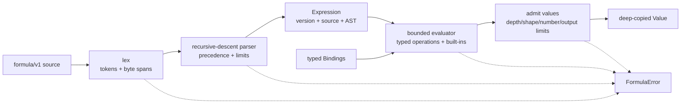

# Formula

Formula is Taurus Omega's deterministic expression capability. Its evaluation
kernel is a pure Go package: it parses `formula/v1` source, evaluates it against
typed bindings or a resolver, and returns an immutable typed value or a
structured error. The sibling `formula/names` package is the wired state layer:
it persists per-project scalars, tables, and functions in SQLite and exposes
name-management and evaluation routes over HTTP. Formula atoms in Documents are
not implemented.

The implementation lives in
[`core/capability/formula`](../../../../core/capability/formula/):

| Source | Responsibility |
|---|---|
| [`formula.go`](../../../../core/capability/formula/formula.go) | language version, structured errors, deterministic limits, and the immutable service |
| [`syntax.go`](../../../../core/capability/formula/syntax.go) | lexer, parser, public expression/AST types, precedence, and source spans |
| [`evaluate.go`](../../../../core/capability/formula/evaluate.go) | binding lookup, AST evaluation, arithmetic, field/index/slice access, and value admission |
| [`functions.go`](../../../../core/capability/formula/functions.go) | lazy `IF`, arithmetic and aggregate functions, table construction, and dimensions |
| [`value.go`](../../../../core/capability/formula/value.go) | exact numbers, typed values, shared table carrier, copying, equality, and JSON |

The companion pages divide the public model by concern:

- [Data model](data-model.md) — value kinds, exact numbers, table shapes,
  rectangular invariants, equality, and the wire form.
- [Querying](querying.md) — fields, one-based indexes, half-open slices, table
  construction, dot-curly projection/query syntax, and strict/optional promotion.
- [User-defined functions](functions.md) — the `function` value, `FUNCTION`/
  `LAMBDA` definitions, the postfix apply operator, lexical closures with late
  binding, and how application is bounded by the same step/depth limits.
- [Supported formulas](supported-formulas.md) — the complete `formula/v1`
  syntax, precedence, operators, functions, and aliases implemented today.
- [Name manager](name-manager.md) — the `names` package: a per-project
  namespace of stored scalars, tables, and functions built over the
  `Resolver` port, wired over HTTP and persisted in SQLite.

## Boundary and guarantees

A Formula evaluation is determined entirely by four inputs:

1. source, or an already parsed `Expression`;
2. immutable, request-scoped `Bindings`;
3. the expression's `LanguageVersion`;
4. the service's deterministic `Limits`.

The package performs no storage, network, model-provider, clock, random, or
cross-capability work. There is no ambient lookup: an identifier is either a
literal keyword, a built-in function call, or an exact key in the supplied
bindings. Binding names and field names are case-sensitive; built-in function
names and the `true`, `false`, and `null` keywords are ASCII case-insensitive.

`Service` contains only its effective limits and is safe for concurrent use.
Callers supply `Bindings` as immutable for the duration of a request; each
referenced value is admitted against the limits and copied before use, and the
returned value is another deep copy. The value model itself does not expose
mutable internal slices or numeric pointers.

## Parse and evaluation pipeline



### Parsing

`Parse` first enforces the source-byte limit, then lexes the complete input.
Every token and public AST node carries a half-open UTF-8 **byte** `Span`
`[start, end)`. The recursive-descent parser builds a JSON-friendly `Expression`
containing the original source, a root `Node`, and the fixed language version
`formula/v1`. It rejects trailing input rather than silently parsing a prefix.

Before returning, parsing validates the completed tree's actual node count and
depth. `EvaluateExpression` repeats structural validation—including source
length, spans, required children, node/depth limits, and language version—so a
deserialized or caller-built AST does not bypass parser limits.

The tree preserves groups, unary and binary operations, calls, list and record
literals, field access, indexes, slices, projections, condition queries, and
promotion as distinct node types. Operator precedence and the exact grammar are
in [Supported formulas](supported-formulas.md).

### Evaluation

`Evaluate` is the convenience path `Parse` followed by `EvaluateExpression`.
The latter rejects a missing tree and any language version other than
`formula/v1`; stored expressions therefore cannot silently acquire the
semantics of a newer language.

Evaluation walks the AST recursively and charges deterministic work units. It
never coerces between value kinds. Arithmetic requires exact numbers, logical
operators require logic values, field access requires a record or table, and
each built-in validates its own arity and types. `&&`, `||`, and `IF` evaluate
only the branch they need. Every other recognized, arity-valid built-in
evaluates all of its arguments before it runs. Function lookup and arity
validation always happen before argument evaluation.

Every literal, referenced binding, constructed collection, and call result is
admitted against the value limits when it is produced, even if an outer
operation later discards it. The final value is admitted again before crossing
the package boundary. Limits therefore cover intermediates as well as output.

Numbers use `math/big.Rat`, so decimal input and every implemented arithmetic
operation are exact. There is no binary floating-point stage: `0.1 + 0.2`
produces `0.3`, while a non-terminating result such as `1 / 3` is retained and
rendered as `1/3`. See [Data model](data-model.md#exact-numbers).

Lists, records, and tables share one rectangular carrier, making row and field
operations composable. For example:

```text
SUM(people.{score >= 88}.score)
```

filters a bound table with a postfix condition query, obtains its `score`
column as a list, and feeds that list to the aggregate. A query can be followed
by projection and strict or optional promotion, for example
`people.{id = wanted}.{name}!`. The query rules are fully specified in
[Querying](querying.md).

## Structured failures

Parser, evaluator, and public value-construction failures use `FormulaError`,
with a stable machine-readable `Kind`, a human-readable `Message`, and a source
`Span`. A limit failure also sets `Limit` to the counter that was exceeded.
Messages add context but are not a compatibility contract. The JSON codec uses
ordinary descriptive Go errors for malformed wire data rather than language
error kinds.

| Kind | Meaning |
|---|---|
| `parse_error` | malformed or incomplete source/AST |
| `unknown_identifier` | a name is absent from the supplied bindings |
| `unknown_function` | a call names no current built-in |
| `wrong_arity` | a built-in received the wrong number of arguments |
| `type_error` | an operator/function received unsupported value kinds |
| `divide_by_zero` | division, remainder, or a negative power of zero |
| `numeric_error` | a number payload is invalid |
| `invalid_index` | an index/bound has the wrong kind, is fractional, or is zero |
| `index_out_of_range` | a single-item index falls outside its collection |
| `unknown_field` | a record/table does not contain the requested field |
| `invalid_table` | fields or rows cannot form the required rectangular value |
| `cardinality_error` | postfix `!`/`?` received too many rows, or `!` received no row |
| `limit_exceeded` | a deterministic parser/evaluator/value bound was crossed |
| `unsupported_version` | an AST does not use `formula/v1` |

The tests assert both behavior and stable categories:
[`syntax_test.go`](../../../../core/capability/formula/syntax_test.go),
[`evaluate_test.go`](../../../../core/capability/formula/evaluate_test.go), and
[`value_test.go`](../../../../core/capability/formula/value_test.go).

## Deterministic limits

`NewService()` uses these production defaults. For each positive field,
`New(Options{Limits: ...})` uses the smaller of the requested value and the
default; zero or a negative value leaves the default in place. Callers can
tighten an evaluation but cannot raise or disable the production ceilings.

| Limit field | Default | What it bounds |
|---|---:|---|
| `MaxSourceBytes` | 16 KiB | source length before lexing |
| `MaxTokens` | 4,096 | emitted non-EOF tokens |
| `MaxNodes` | 4,096 | AST nodes |
| `MaxDepth` | 64 | parse, evaluation, and nested-value depth |
| `MaxSteps` | 100,000 | AST visits, materialization, and magnitude-weighted numeric work |
| `MaxFields` | 256 | fields in one admitted structured value |
| `MaxRows` | 10,000 | rows in one admitted structured value |
| `MaxCells` | 100,000 | cells in one admitted structured value |
| `MaxOutputBytes` | 1 MiB | conservative human-readable rendered-size bound for an admitted value |
| `MaxNumberBits` | 1,048,576 | bit length of the numerator and denominator of an admitted or produced exact number |
| `MaxPower` | 1,024 | absolute value of an exponent |
| `MaxRoundPlaces` | 100 | absolute value of `ROUND` places |

The counters make identical inputs fail at the same point. Wall-clock deadlines
are deliberately not part of Formula semantics.

## Current boundary

The evaluation kernel itself performs no HTTP, storage, project, catalog,
lineage, provider, or Knowledge work. `names` supplies a persisted namespace and
HTTP evaluation surface without changing that kernel boundary. The combined
capability still does **not** currently provide:

- formula atoms/blocks in Documents, stored expression cells, dependency
  tracking, recalculation, cached display values, or cross-document references;
- assignment or mutation *inside* the language (name/table writes happen through
  explicit manager endpoints);
- text concatenation or broader text functions;
- joins, grouping, sorting, computed projections, query planning, or secondary
  indexes over persisted data;
- date/time, duration, currency, error-as-a-value, or domain object kinds;
- versioning or an audit trail for stored names beyond `createdAt`/`updatedAt`.

Those remain future design choices. The older material under
[`docs/reference/`](../../../reference/README.md) can inform them, but it is not
the contract for this implementation.
