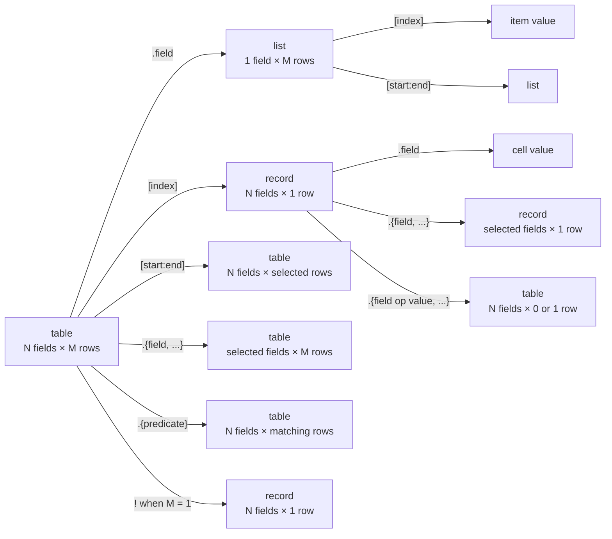

# Formula querying

Formula's current query model is deliberately bounded and in-memory. It can
navigate and transform list-, record-, and table-shaped values already present
in an expression or its bindings. It does not discover or load stored objects.

The implementation is split between postfix parsing in
[`syntax.go`](../../../../core/capability/formula/syntax.go), postfix evaluation
in [`evaluate.go`](../../../../core/capability/formula/evaluate.go), and table
construction/dimension functions in
[`functions.go`](../../../../core/capability/formula/functions.go).
End-to-end compositions are covered by
[`evaluate_test.go`](../../../../core/capability/formula/evaluate_test.go).

## Two axes: fields and rows



Field selection operates on columns; numeric indexing and slicing operate on
rows. Operations preserve the order already present in the target.

## Field access

Field access is the **dot form only**, an exact case-sensitive lookup:

```text
people.score
```

Field names are **identifiers** (a letter or underscore, then letters, digits, or
underscores). A name a dot cannot spell — one containing a space, say — is not a
legal field name *anywhere* (record literals, `TABLE`, projections, queries), and
constructing one through the Go value API fails too. Brackets never select a field:
`people["score"]` and `people[score]` are **not** field access (see
[indexing](#one-based-indexes)).

| Target | Result |
|---|---|
| record | the cell in its sole row |
| table | a list containing the field's cells in row order |
| list or scalar | `type_error` |

An absent field is `unknown_field`.

## One-based indexes

Numeric indexes apply to lists and tables. They must be exact non-zero integers
that fit in an `int64`.

- positive indexes are one-based: `1` is the first item/row;
- negative indexes count backward: `-1` is the last, `-2` the penultimate;
- `0`, a fractional number, an integer outside `int64`, or a non-number is
  `invalid_index` once the operation is a row/item index;
- a valid integer outside the collection is `index_out_of_range`.

Indexes are **positional only** — the index expression must evaluate to a number.
The expression may be a literal (`people[2]`), a binding (`people[position]`), or
any arithmetic (`people[n + 1]`) — no special syntax; parentheses are just ordinary
grouping (`people[(position)]` == `people[position]`). A text or other non-number
index is `invalid_index`. There is **no** field-by-name bracket form: `["score"]`
and `[score]` are gone; read a field with `.score`.

Indexing a list returns one item. Indexing a table returns one record with the
table's fields in their original order. A record is not indexable at all — use
`.field`; any `record[...]` is rejected.

| Formula | Result |
|---|---|
| `[10, 20, 30][1]` | `10` |
| `[10, 20, 30][-2]` | `20` |
| `people[-1].name` | the last row's `name` cell |

## Half-open slices

Slices apply to lists and table rows and return the same kind as their target.
They use an interval `[start, end)`: the translated start boundary is included,
and the translated end boundary is excluded.

For a collection of length `N`, each explicit bound is translated to a
zero-based boundary as follows:

| Bound | Boundary |
|---|---:|
| omitted start | `0` |
| omitted end | `N` |
| positive `k` | `k - 1` |
| negative `k` | `N + k` |

The translated boundary is clamped to `[0, N]`. Zero, a fraction, a non-number,
or an integer outside `int64` is `invalid_index`. Unlike a single index, a slice
bound outside the collection is clamped rather than reported out of range. If
the end lands before the start, the evaluator makes the end equal to the start,
producing an empty collection; slices never reverse rows.

For `items = [10, 20, 30, 40]`:

| Formula | Result | Explanation |
|---|---|---|
| `items[:]` | `[10, 20, 30, 40]` | full slice |
| `items[1:3]` | `[10, 20]` | boundaries `0:2` |
| `items[2:]` | `[20, 30, 40]` | boundary `1` through `N` |
| `items[:3]` | `[10, 20]` | end boundary `2` is excluded |
| `items[-2:]` | `[30, 40]` | start boundary `N-2` |
| `items[:-1]` | `[10, 20, 30]` | end boundary immediately before the last item |
| `items[4:2]` | `[]` | reverse interval collapses to empty |

The positive end convention follows the same one-based-to-boundary translation
as the start; consequently `items[1:3]` contains items 1 and 2, not item 3.

## Table construction

`TABLE` accepts either variadic records or one list whose items are records:

```text
TABLE({id: 1, name: "Ada"}, {name: "Bea", id: 2})
TABLE([{id: 1, name: "Ada"}, {id: 2, name: "Bea"}])
```

The first record establishes field order. Every later row must be a record with
exactly the same field set, although its declaration order may differ; values
are realigned to the first row's order. A non-record row is `type_error`, while
a different field set is `invalid_table`. `TABLE()` creates the empty `0 × 0`
table. Passing one empty list has the same result.

Construction enforces configured row, field, cell, and work limits.

## Dimensions with ROWS and COLUMNS

`ROWS(value)` and `COLUMNS(value)` each require exactly one argument and return
an exact integer from `Value.Shape()`:

| Formula | Result |
|---|---:|
| `ROWS(TABLE({x: 1}, {x: 2}))` | `2` |
| `COLUMNS({x: 1, y: 2})` | `2` |
| `ROWS([1, 2, 3])` | `3` |
| `ROWS(42)` | `1` |

They are shape inspection, not type assertions, so they accept scalars as well
as structured values.

## Dot-curly selection

The postfix form `target.{...}` is either a **projection** (a comma-separated list
of bare field names) or a **query** (a boolean predicate over field comparisons):

```text
people.{name, score}
people.{(score >= cutoff || vip = true) && active = true}
```

The parser disambiguates by lookahead: a leading `(` or `!`, or a field name
immediately followed by a comparison operator, starts a query; a leading field
name followed by `,` or `}` is a projection. Field names are identifiers.

### Projection

`target.{field, ...}` projects and reorders fields from a record or table:

```text
people.{name, score}
people.{id, name}
people[1].{name}
```

The result preserves the target kind: a record produces a record and a table
produces a table. Row order is unchanged; field order is exactly source order.
An absent field is `unknown_field`. The parser rejects duplicate fields with
`invalid_table`, and at least one field is required.

### Condition queries

`target.{predicate}` accepts a record or table and always returns a table. A record
is treated as a one-row input, so it produces a table with zero or one row. A table
result preserves the input's complete schema and the original order of every
matching row; an empty result retains the schema.

The predicate is a **boolean tree** over comparison leaves. Each leaf is
`field operator expression` with:

| Operator | Comparison |
|---|---|
| `=` | deep typed equality |
| `!=` | negated deep typed equality |
| `<` | exact numeric ordering |
| `<=` | exact numeric ordering |
| `>` | exact numeric ordering |
| `>=` | exact numeric ordering |

Equality works for every Formula kind and never coerces kinds. Ordering requires
numbers; if either ordering operand is `null` that leaf does not match, and any
other non-number operand is `type_error`. An absent field is `unknown_field`.

Leaves combine with boolean operators. Precedence, **loosest to tightest**:

| Operator | Meaning |
|---|---|
| `,` | AND (the outermost separator; keeps `.{a, b}` = `a AND b`) |
| `\|\|` | OR |
| `^` | XOR |
| `&&` | AND |
| `!` (prefix) | NOT |
| `( )` | grouping |

```text
people.{score >= 88 || score < 10}
people.{(score >= cutoff || vip = true) && active = true}
people.{!(archived = true), score > 0}
people.{(score >= 50) ^ (vip = true)}
```

**`^` has two roles by grammar tier.** At the predicate level it is XOR (between
boolean operands); inside a comparison's right-hand expression it is power (between
numbers): `score > base ^ 2` is power. Because a comparison's RHS is parsed below
the predicate operators, **XOR operands must be parenthesized** — write
`(a) ^ (b)`, not `a ^ b`.

Inside a query, an identifier is resolved **field-first (the SQL convention):** it
is the current row's field if a column of that name exists, and otherwise a binding.
This applies to both sides of a leaf, so you can compare two columns of the same row
as well as a column to a variable — **no sigil**:

```text
projects.{spent > budget}     both are columns  → field vs field, per row
projects.{score >= cutoff}    no cutoff column  → field vs binding
```

The left side of a leaf is a bare field name (normally a column; a binding only if
no such column exists). The right side is an `additive` expression whose identifiers
resolve the same field-first way. Two consequences of field-first:

- A binding whose name matches a column is **shadowed** by the column inside the
  query (the column wins) — the standard SQL precedence.
- Because a right-hand side may reference a column, it is evaluated **per row**, not
  once (still bounded — each comparison costs a step). An identifier that is neither
  a column nor a binding is `unknown_identifier`.

## Strict and optional promotion

Postfix `!` promotes a one-row table to a record, which makes an exact-one query
convenient to consume:

```text
people.{id = wanted}!.name
```

A table with zero or more than one row fails with `cardinality_error`. Applying
postfix `!` to a record returns an equivalent copied record, so promotion is
idempotent for record-shaped values. Other kinds produce `type_error`. This is
only an in-memory shape assertion; it performs no service lookup or expansion.

Prefix `!` is a separate logical-not operator. Grammar position disambiguates
`!active` from `people.{id = wanted}!`.

Postfix `?` is optional promotion: a one-row table becomes a record, an empty
table becomes `null`, and a table with multiple rows still returns
`cardinality_error`. On a record it is an identity operation. For example,
`people.{id = wanted}?` safely represents a missing row as `null`.

## Composition

Postfix access and built-ins return ordinary typed values, so calls compose:

```text
SUM(people.{score >= 88}.score)
people[1:3].{active = true}.{name, score}
TABLE({id: 1}, {id: 2}).{id != 1}[1]
people.{id = wanted}!.{name}
people.{id = wanted}?
```

Evaluation is eager and materializes each intermediate value in memory. The
configured limits bound work and result dimensions at each relevant step.

## Explicitly deferred query features

The evaluator performs no automatic scan of domain Resources and has no
secondary index, query planner, streaming/lazy table, sort, join, group, unique,
offset/limit function, aggregate-by-group, or computed projection. Persisted
tables can enter evaluation through the wired Formula
[name manager](name-manager.md), but they are materialized as ordinary immutable
values before this query language runs. Condition
queries support full boolean predicates — AND (`,`/`&&`), OR (`||`), XOR (`^`),
NOT (`!`), and parenthesized grouping — over `field <op> expr` leaves, with
field-first identifier resolution so field-to-field (per-row) comparisons work. The
comparison right-hand side is still limited to an `additive` expression (a bare
field is never an arbitrary row-scoped sub-query), and grouping/aggregation over
partitions is not modeled. Tables are immutable values; there are no
insert/update/delete formulas.
The former `SELECT(...)`
and `WHERE(...)` calls are not aliases for the postfix language and are
reported as `unknown_function`. Any richer persisted query runtime must define
those behaviors explicitly rather than treating the historical reference design
as already implemented.
