# Intelligence

The **intelligence** capability is the application's single boundary to model
providers. Everything the backend does with a language or embedding model —
reasoning, inference, embedding — flows through this one package. Its defining
rule: **callers never name a model.** They ask for a semantic *cast* — a tier
expressed as `(purpose, strength, speed, cost)` — and configuration maps each
cast, per endpoint kind, to a concrete `(provider, model)` pair. That keeps the
rest of the system free of provider names, model slugs, and credentials.

This document explains both the concept and the implementation, with emphasis on
casts and how configuration maps them to routes. It is a sibling of the
[architecture overview](../runtime-model.md), the [configuration](../configuration.md)
guide, the [transport](../transport.md) layer, and the
[knowledge](knowledge/README.md) capability, which is the first internal consumer
of intelligence.

Primary sources:

- [core/capability/intelligence/intelligence.go](../../../core/capability/intelligence/intelligence.go) — the service, casts, routes, and resolution.
- [core/capability/intelligence/provider.go](../../../core/capability/intelligence/provider.go) — the provider port and wire types.
- [core/integration/intelligence/openrouter/openrouter.go](../../../core/integration/intelligence/openrouter/openrouter.go) — the one concrete provider adapter.
- [core/handlers/intelligence/intelligence.go](../../../core/handlers/intelligence/intelligence.go) — the HTTP handlers and error→status mapping.
- [core/platform/config/config.go](../../../core/platform/config/config.go) — the config schema for providers and cast tables.
- [core/wiring/wiring.go](../../../core/wiring/wiring.go) — `buildIntelligence`, `castRoutes`, and the knowledge adapter.
- [etc/config.yaml](../../../etc/config.yaml) — the committed cast tables.

## The core idea: casts, not models

A **cast** is the semantic selector a caller passes instead of a model name. It
is a plain four-field struct — `intelligence.Cast{Purpose, Strength, Speed,
Cost}` in [intelligence.go](../../../core/capability/intelligence/intelligence.go).
The caller expresses *what kind of model it wants* along four axes; the service
resolves that to *which model it gets* by looking the cast up in a configured
table. The mapping — and only the mapping — decides the model, so retargeting
every caller from one model to another is a configuration edit, not a code
change.

### What each dimension means

- **Purpose** — what the model is specialized for. `"general"` (text) is the
  default and the only purpose used by reasoning and inference. Embeddings
  additionally support `"code"`, routed to a code-specialized embedding model.
  An empty purpose is treated as general (see `normalized()` below), leaving room
  for image and other purposes later without breaking existing callers.
- **Strength** — the desired capability tier: `"low"`, `"medium"`, or `"high"`.
- **Speed** — the desired latency/throughput tier: `"low"`, `"medium"`, or `"high"`.
- **Cost** — the budget tier: `"low"`, `"medium"`, or `"high"`.

A crucial implementation fact: **the code assigns no built-in meaning or ordering
to these values.** `route()` does a pure exact-match lookup on the four-tuple; it
never reasons that `high > medium`, never picks a "nearest" tier, and never
solves a trade-off. The semantics of strength/speed/cost live entirely in *how
the config author maps each combination to a model*. The comments in
[config.yaml](../../../etc/config.yaml) capture that curation intent — for
example, embedding `cost` is treated as a budget ceiling under which the
strongest affordable model is chosen — but that logic is human, baked into the
table rows, not enforced by the service.

Because resolution is exact-match with no fallback, every supported combination
must be listed. With three tiers on each of strength, speed, and cost, that is
`3 × 3 × 3 = 27` rows per purpose. Reasoning and inference list 27 rows each
(general only); embedding lists 54 (27 general + 27 code). A request whose cast
matches no row gets a clear "no model configured" error rather than a silent
default.

### The three endpoint kinds

`Kind` names an endpoint kind, and **each kind has its own cast table**, so the
strength/speed/cost trade-offs for, say, reasoning can differ from those for
embedding:

- `KindReasoning` (`"reasoning"`) — messages → text, for higher-effort work.
- `KindInference` (`"inference"`) — messages → text, for lighter/faster work.
- `KindEmbedding` (`"embedding"`) — a batch of strings → vectors.

Reasoning and inference are structurally identical (both turn `[]Message` into
text); they differ only in *intent* and in *which cast table they resolve
against*. That separation is what lets the same cast `general/high/low/low` point
at a reasoning-grade model in the reasoning table and a cheaper chat model in the
inference table.

## The service

`Intelligence` (in
[intelligence.go](../../../core/capability/intelligence/intelligence.go)) holds
two read-only maps and is safe for concurrent use after construction:

```go
type Intelligence struct {
    providers map[string]Provider          // name → backend
    routes    map[Kind]map[Cast]Route       // kind → (cast → route)
}
```

`New(Options)` builds it from a `providers` map and a `map[Kind][]Route`. It
indexes every route by its **normalized** cast for O(1) lookup, and it fails if
any route names a provider not present in `providers` — so a misconfiguration
surfaces at startup, not on the first request:

```go
if _, ok := in.providers[r.Provider]; !ok {
    return nil, fmt.Errorf("intelligence: %s cast %s references unknown provider %q", ...)
}
table[r.Cast.normalized()] = r
```

`Cast.normalized()` fills an empty `Purpose` with `"general"`. Both the index
build (above) and the lookup (`route()`) normalize, so an omitted purpose on
either the config side or the request side lands on `"general"` consistently.

### Route resolution

Every call resolves its cast through one function:

```go
func (in *Intelligence) route(kind Kind, cast Cast) (Route, error) {
    r, ok := in.routes[kind][cast.normalized()]
    if !ok {
        return Route{}, fmt.Errorf("%w: %s cast %s", ErrNoCast, kind, cast.normalized())
    }
    return r, nil
}
```

A `Route` is just `{Cast, Provider, Model}`. Resolution walks two map lookups:
first by `Kind` to get that kind's table, then by the normalized `Cast` to get
the row. There are two distinct failure modes, and they map to different HTTP
statuses (see [error mapping](#endpoints-and-error-mapping)):

- **Unconfigured cast** → `ErrNoCast` ("no model configured for cast"),
  wrapping the kind and cast in the message. This is a *client* error (400): the
  caller asked for a tier the operator did not configure.
- **Unconfigured provider** → `ErrProviderNotConfigured` ("intelligence provider
  not configured"), returned by the provider itself at call time when it has no
  credential. This is a *service* condition (503). Critically, a **blank API key
  still yields a usable-but-failing provider** — `openrouter.New("", ...)`
  constructs a real object that returns `ErrProviderNotConfigured` from every
  `Chat`/`Embed` — so the server starts cleanly without a key, and only actual
  model calls fail.

Note the third, earlier failure mode: a route that names a provider *entirely
absent* from the providers map is caught by `New()` and is fatal at startup
(`buildIntelligence` calls `log.Fatalf`). That is different from a configured
provider with a blank key, which is a runtime 503.

### The generate() path

Reasoning and inference — plain and structured — all funnel through one private
method, which is what makes the four public entry points behave identically apart
from their cast table and output shape:

```go
func (in *Intelligence) generate(ctx, kind, cast, msgs, schema) (Result, error) {
    r, err := in.route(kind, cast)              // resolve cast → provider+model
    ...
    resp, err := in.providers[r.Provider].Chat(ctx, ChatRequest{Model: r.Model, Messages: msgs, Schema: schema})
    ...
    if len(schema) == 0 {
        res.Text = resp.Content                  // plain call → text
        return res, nil
    }
    if !json.Valid([]byte(resp.Content)) {       // structured call → validated JSON
        return Result{}, fmt.Errorf("intelligence: %s provider returned invalid JSON ...", kind)
    }
    res.JSON = json.RawMessage(resp.Content)
    return res, nil
}
```

The presence of a schema is the *only* switch between free-text and structured
output. A structured call additionally validates that the provider actually
returned well-formed JSON; if not, it returns a generic error (which the handler
maps to 502, not to the cast/provider-specific statuses).

The five public methods are thin wrappers:

| Method | Kind | Schema passed to `generate` |
|---|---|---|
| `Reason` | reasoning | `nil` (free text) |
| `ReasonJSON` | reasoning | `ensureSchema(schema)` |
| `Infer` | inference | `nil` (free text) |
| `InferJSON` | inference | `ensureSchema(schema)` |
| `Embed` | embedding | — (own path, see below) |

`ensureSchema` guarantees the structured path always requests structured output:
a blank schema becomes the permissive `{"type":"object"}`, while a plain
`Reason`/`Infer` passes `nil` and never requests structured output.

### Embedding and vector-space identity

`Embed` has its own short path: resolve the cast against the embedding table,
call `Provider.Embed(EmbeddingRequest{Model, Inputs})`, and return an
`EmbedResult`:

```go
type EmbedResult struct {
    Vectors  [][]float64
    Provider string
    Model    string
    Usage    Usage
}
```

`EmbedResult` carries the resolved `Provider` and `Model` alongside the vectors —
the **vector-space identity** a caller needs to know which embeddings are
comparable. A cast is only a semantic alias, and configuration may re-route it to
a different model at any time; vectors produced under different models are not
comparable. Returning the resolved identity lets a consumer stamp it on stored
vectors and detect a route change later. This is exactly what
[knowledge](knowledge/README.md) does — see
[Consumed by knowledge](#consumed-by-knowledge).

## Endpoints and error mapping

The transport layer mounts three routes in the **gated** group (a valid session
is required), wired only when a service is present
([transport.go](../../../core/transport/transport.go)):

```go
gated.POST("/intelligence/reason", s.adaptScoped(intel.Reason))
gated.POST("/intelligence/infer",  s.adaptScoped(intel.Infer))
gated.POST("/intelligence/embed",  s.adaptScoped(intel.Embed))
```

The handlers in
[handlers/intelligence/intelligence.go](../../../core/handlers/intelligence/intelligence.go)
do request/response shaping only. A request body carries the cast as a nested
object plus the payload:

- **`/intelligence/reason`** and **`/intelligence/infer`** take
  `generateBody{cast, messages, schema}`. If `schema` is present the handler
  dispatches to the `…JSON` variant; otherwise to the plain one. The response is
  `{usage, text}` for a free-text call or `{usage, json}` for a structured one.
- **`/intelligence/embed`** takes `embedBody{cast, inputs}` and responds with
  `{vectors, usage}`.

Every service error is funnelled through `errFor`, which is the single place the
domain errors become HTTP statuses:

| Condition | Error | Status |
|---|---|---|
| Malformed request body | (bind failure) | `400` invalid JSON body |
| Cast not in the table | `ErrNoCast` | `400` (echoes `no model configured for cast …`) |
| Provider has no credential | `ErrProviderNotConfigured` | `503` provider not configured |
| Any other provider failure | (generic) | `502` provider call failed |

The 502 branch deliberately returns a generic message so upstream provider detail
is never echoed back to the client.

## Config mapping: from YAML to a route table

This is the heart of the capability. A cast in
[config.yaml](../../../etc/config.yaml) becomes an in-memory `Route` through a
short, explicit pipeline.

**1. The YAML.** Under `intelligence`, `providers` names each backend and
`casts.{reasoning,inference,embedding}` list the cast rows. One row:

```yaml
casts:
  reasoning:
    - { purpose: general, strength: high, speed: low, cost: high, provider: openrouter, model: "anthropic/claude-3.5-sonnet" }
```

**2. The config schema.** [config.go](../../../core/platform/config/config.go)
mirrors this one-to-one. `Intelligence{Providers map[string]Provider, Casts
Casts}`; `Casts{Reasoning, Inference, Embedding []Cast}`; and `config.Cast` holds
all six fields — the four cast dimensions plus `Provider` and `Model`. Each
`Provider` is `{APIKey, BaseURL}`.

**3. The secret lives only in the local overlay.** The committed manifest keeps
`api_key: ""`. `config.LocalPath` derives `etc/config.local.yaml` from
`etc/config.yaml`, and `loadConfig` overlays that gitignored file
(`/etc/config.local.yaml` is in `.gitignore`) on top of the committed one at
startup. So the real key is present at runtime but never checked in. See
[configuration](../configuration.md) for the overlay mechanics.

**4. Assembly in wiring.** `buildIntelligence`
([wiring.go](../../../core/wiring/wiring.go)) instantiates each configured
provider by name and converts each config cast list into intelligence routes:

```go
for name, p := range cfg.Intelligence.Providers {
    switch name {
    case "openrouter":
        providers[name] = openrouter.New(p.APIKey, p.BaseURL)
    default:
        log.Fatalf("intelligence: unknown provider %q", name)   // unrecognized name → fatal
    }
}
routes := map[intelligence.Kind][]intelligence.Route{
    intelligence.KindReasoning: castRoutes(cfg.Intelligence.Casts.Reasoning),
    intelligence.KindInference: castRoutes(cfg.Intelligence.Casts.Inference),
    intelligence.KindEmbedding: castRoutes(cfg.Intelligence.Casts.Embedding),
}
intel, err := intelligence.New(intelligence.Options{Providers: providers, Routes: routes})
```

`castRoutes` is the field-by-field translation from `config.Cast` to
`intelligence.Route`:

```go
routes[i] = intelligence.Route{
    Cast:     intelligence.Cast{Purpose: c.Purpose, Strength: c.Strength, Speed: c.Speed, Cost: c.Cost},
    Provider: c.Provider,
    Model:    c.Model,
}
```

**5. Indexing.** `intelligence.New` folds each `[]Route` into a `map[Cast]Route`
keyed by the normalized cast, ready for O(1) resolution.

```mermaid
flowchart LR
    Y["etc/config.yaml<br/>casts.reasoning / inference / embedding"] --> CC["config.Cast<br/>purpose·strength·speed·cost<br/>+ provider + model"]
    L["etc/config.local.yaml<br/>(gitignored) api_key"] -. overlay .-> P
    CC --> CR["castRoutes()<br/>wiring.go"]
    CR --> RT["intelligence.Route<br/>{Cast, Provider, Model}"]
    RT --> NEW["intelligence.New()"]
    P["providers map<br/>openrouter.New(key, baseURL)"] --> NEW
    NEW --> TAB["routes: map&#91;Kind&#93;map&#91;Cast&#93;Route<br/>indexed for O(1) lookup"]
```



At request time, resolution and dispatch run in the opposite direction:

```mermaid
flowchart TD
    REQ["POST /intelligence/{reason|infer|embed}<br/>body: cast + messages/inputs (+ schema)"] --> H["handler binds castBody → Cast"]
    H --> RES["route(kind, cast.normalized())"]
    RES -->|no matching row| E400["ErrNoCast → 400"]
    RES -->|hit| R["Route{provider, model}"]
    R --> DISP["providers&#91;provider&#93;.Chat / Embed<br/>(model, messages/inputs, schema)"]
    DISP -->|blank api_key| E503["ErrProviderNotConfigured → 503"]
    DISP -->|HTTP / other failure| E502["→ 502 Bad Gateway"]
    DISP -->|ok| OK["200: text | json | vectors, always + usage"]
```



## The provider port and dependency inversion

The capability depends on an interface, not on any provider. `Provider` (in
[provider.go](../../../core/capability/intelligence/provider.go)) is the boundary
to a single model backend:

```go
type Provider interface {
    Name() string
    Chat(ctx context.Context, req ChatRequest) (ChatResponse, error)
    Embed(ctx context.Context, req EmbeddingRequest) (EmbeddingResponse, error)
}
```

`Chat` backs reasoning and inference; `Embed` backs embedding. The request/response
types are **provider-neutral**: `ChatRequest{Model, Messages, Schema}`,
`ChatResponse{Content, Usage}`, `EmbeddingRequest{Model, Inputs}`,
`EmbeddingResponse{Vectors, Usage}`, plus `Message{Role, Content}` and the shared
`Usage`. Implementations must never include their credential in a returned error.

**No capability imports a provider directly.** The only place a concrete provider
is named is the `switch` in `buildIntelligence`; everything downstream sees the
interface. The single concrete implementation today is the **OpenRouter adapter**
([openrouter.go](../../../core/integration/intelligence/openrouter/openrouter.go)),
which speaks OpenRouter's OpenAI-compatible chat-completions and embeddings
endpoints. All provider mechanics stop there:

- `openrouter.New(apiKey, baseURL)` returns an `intelligence.Provider`; a blank
  `baseURL` falls back to `https://openrouter.ai/api/v1`, and a blank `apiKey`
  yields the usable-but-failing provider described above.
- `Chat` builds an OpenAI-style payload and, when a schema is present, adds
  `response_format: {type: "json_schema", json_schema: {name, strict: true,
  schema}}` to request structured output. It reads `choices[0].message.content`.
- `Embed` posts `{model, input}` and maps `data[].embedding` back to vectors in
  input order.
- `post` sets the bearer credential and OpenRouter's attribution headers, and
  turns any non-2xx response into a *sanitized* error via `openRouterError` — the
  key travels only in the request header, never in the body, so nothing here can
  leak it.

**Adding a new provider** is therefore a two-step change with no ripple into any
capability: implement the `Provider` interface in a new
`core/integration/intelligence/<name>` package, then add one `case` to the
`switch` in `buildIntelligence`. Casts and cast tables are unchanged; a cast row
simply names the new provider.

## Usage accounting

Every result carries the provider's token counts. `Usage{PromptTokens,
CompletionTokens, TotalTokens}` rides on `Result` and `EmbedResult`, and the
handlers include it in every response body. The OpenRouter adapter maps the API's
snake_case `usage` block onto this neutral type. Accounting *beyond* the raw
counts a provider reports — aggregation, retries, budgets — is intentionally out
of this first slice; the raw numbers are surfaced so callers (and tests, run
against real providers) can see cost immediately.

## Consumed by knowledge

The [knowledge](knowledge/README.md) capability is the first internal consumer of
intelligence, and it consumes it *through a port*, not by importing the service.
Knowledge defines its own `Embedder` interface
([knowledge.go](../../../core/capability/knowledge/knowledge.go)):

```go
type Embedder interface {
    Embed(ctx context.Context, texts []string) (Embedded, error)
}
```

The composition root supplies the adapter. `knowledgeEmbedder` in
[wiring.go](../../../core/wiring/wiring.go) wraps the intelligence service and
binds **one fixed cast** for all knowledge embedding:

```go
know := knowledge.New(store, knowledgeEmbedder{
    intel: intel,
    cast:  intelligence.Cast{Purpose: "general", Strength: "medium", Speed: "medium", Cost: "medium"},
}, ...)
```

Its ordinary `Embed` call reports the configured route, while `EmbedInSpace`
uses `intel.EmbedExact` to bind a provider/model chosen by the active Knowledge
generation. The adapter translates the result into Knowledge's own types,
including dimensions and usage/cost. Knowledge expands that vector identity
into its immutable `EmbeddingSpace` (normalization, vector format, schema, and
algorithm included). Configuration drift therefore makes ordinary ingestion
return `knowledge.embedding_space_change_required`, while queries continue to
target the exact provider/model retained by the active generation. The cast is a
semantic alias; the generation's embedding-space identity is the ground truth
about which vectors are comparable.

This adapter pattern is the template for every future consumer: define a
narrow port in the consuming capability, and let the composition root bind it to
an intelligence cast. The consuming capability never learns which model, which
provider, or which credential is behind the cast.
