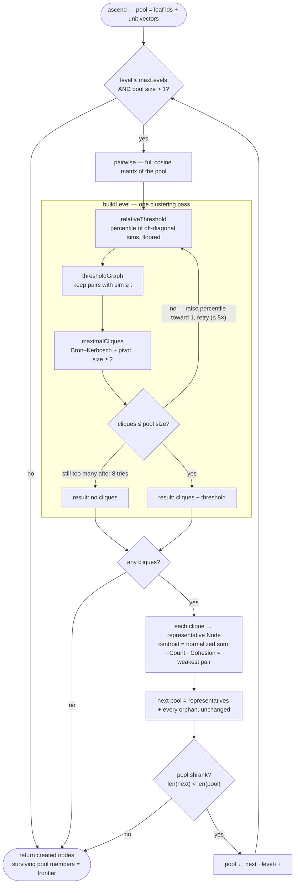
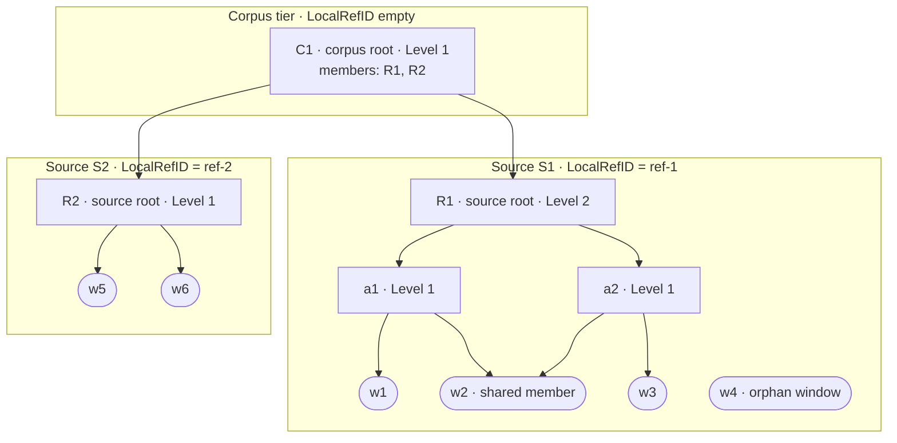

# Building the knowledge lattice — the KLR clustering algorithm

This document explains how the knowledge capability *builds* its retrieval
lattice: the KLR (Knowledge Lattice Resolution) clustering algorithm that turns a
flat pool of embedded text windows into a layered structure of clusters. It is
the algorithmic heart of the capability. Reading it, you should come away
understanding both *what* KLR is — a clique-based clustering rule — and *how* the
code implements it, function by function.

Almost all of the machinery lives in one pure, storage-free file,
[`lattice.go`](../../../../core/capability/knowledge/lattice.go), driven from
[`knowledge.go`](../../../../core/capability/knowledge/knowledge.go). Nothing here
touches a store, an embedder, or a network — it is deterministic functions over
slices, which is what makes the lattice reproducible and cheap to test. (For the
verbatim line-by-line companion, see
[`lattice.go.md`](../../../../core/capability/knowledge/lattice.go.md); this
document explains the algorithm, it does not reproduce the source.)

## Where this fits

- **Leaves** come from windowing and embedding: a source's text is split into
  overlapping windows and each is embedded into a unit vector. That is the input
  to construction. Embeddings are produced through a narrow `Embedder` port — see
  [intelligence](../intelligence.md).
- **Construction** (this document) clusters those windows into a lattice of
  `Node`s, per source and then across sources.
- **Retrieval** walks the finished lattice to answer queries — see
  [retrieval](retrieval.md).
- **Lifecycle** (add / re-sync / remove) is what *triggers* a rebuild and wires
  it to storage — see [lifecycle](lifecycle.md). For the capability at a glance,
  see the [knowledge overview](README.md).

The one-sentence rule, taken from the package doc on
[`knowledge.go`](../../../../core/capability/knowledge/knowledge.go): windows are
clustered *within* a source and then *across* the project's sources by the KLR
rule — **a cluster is a maximal set whose members are all pairwise similar above
a level-relative threshold, clusters may overlap, and artifacts that cluster
nowhere stay orphans and carry upward unchanged.** A source therefore ends as a
forest of roots and orphans (its *frontier*), never a forced single summary.

## Why cliques, not k-means

The construction was rewritten once, and understanding why pins down what KLR
*is*. The first knowledge slice (record
[0008](../../../../docs/records/0008-knowledge-lattice-and-dev-convention.md))
used a **k-means tree**: fixed branching, every window forced into its least-bad
bucket, every document collapsed to one root. Record
[0009](../../../../docs/records/0009-klr-lattice-correction.md) replaced it,
because a k-means tree answers a different question from the one KLR asks:

| Concern | k-means tree (0008) | KLR (0009, current) |
| --- | --- | --- |
| Cluster formation | every artifact assigned to one of *k* buckets | only genuinely cohesive groups cluster |
| Cohesion | nearest-centroid assignment | **every pair** in a cluster clears a threshold |
| Membership | exactly one parent per level | clusters **overlap**; multiple parents (a DAG) |
| Outliers | absorbed into a least-bad bucket | stay **orphans**, carry upward unchanged |
| Topology | balanced tree ending in one root | **forest** of roots and orphans |

K-means answers *"given that everything must belong to one of k buckets, which is
least bad?"* KLR answers *"does a sufficiently cohesive semantic grouping
actually exist here?"* A document about three unrelated subjects should not
acquire an artificial vector claiming they form one theme, and a unique concept
should survive to the top as itself rather than be averaged into noise. That is
why the lattice is a **forest, not a single root**, and a **DAG, not a tree** —
both fall directly out of the clique rule. The design intent behind KLR ("embeds
but never generates"; "nodes/links/representatives/orphans") is sketched in the
reference material at
[stage 06](../../../../docs/reference/implementation/06-knowledge-intelligence-resolution.md);
what follows describes the actual code.

## From text to leaves: windows and vectors

The clustering operates over *leaves* — windows with unit-vector embeddings —
produced by the helpers at the top of
[`lattice.go`](../../../../core/capability/knowledge/lattice.go).

**Windowing.** `windowSpans` splits a source's text into overlapping windows of
roughly `target` runes (default `defaultWindowTargetRunes = 4000`, ≈1000 tokens),
cutting only on sentence boundaries found by `sentenceSpans` (a sentence ends at a
terminator-plus-whitespace run, or at any newline). Windows accumulate whole
sentences up to the target, and each next window *re-opens* with the previous
window's trailing sentences up to an `overlap` budget (default `400` runes) so
local context — references, pronouns, qualifications — carries across each cut. A
single sentence longer than the target is hard-split on rune boundaries by
`splitOversized` as a fallback. Every cut lands on a rune boundary, so a
`[start, end)` range always slices back out of the original text. This step is
deterministic and detailed further in [lifecycle](lifecycle.md); for construction
the point is simply that it yields ordered, overlapping, embeddable chunks.

**Vectors.** Embeddings are stored **unit-normalized**, which is the key
simplification: cosine similarity collapses to a plain dot product.

- `normalize(v)` divides by the L2 norm (returning a copy unchanged if the norm
  is zero).
- `dot(a, b)` is the multiply-accumulate; since inputs are unit vectors,
  `dot == cosine`.
- `centroid(vecs)` returns `normalize(sum(vecs))` — the unit-normalized sum, which
  points the same direction as the normalized mean. This is the KLR cluster
  *representative*: one vector standing in for a whole clique.

## The KLR rule

Given a pool of unit vectors at one level, KLR forms clusters like this:

1. Compute the **full pairwise cosine matrix** of the pool (`pairwise`).
2. Draw a **relative threshold** from that level's own similarity distribution
   (`relativeThreshold`).
3. Keep every pair whose similarity clears the threshold — this is the
   **threshold graph** (`thresholdGraph`).
4. The clusters are the graph's **maximal cliques** of size ≥ 2
   (`maximalCliques`).

A **maximal clique** is a set of vertices where *every* pair is connected (a
clique) and which cannot be extended by another vertex (maximal). The "every
pair" requirement is what separates KLR from single-linkage clustering: a chain
`A~B~C` where `A` and `C` are *not* similar produces **two** clusters `{A,B}` and
`{B,C}`, never the merged `{A,B,C}` — because `A` and `C` never clear the
threshold together. Record 0009 calls this the chain-rejection property, and it
is pinned by a unit test.

Two consequences follow directly:

- **Cliques may overlap.** `B` above belongs to both `{A,B}` and `{B,C}`. A
  member can join several clusters, so above the leaves the structure is a
  **DAG** — one member, several parents — not a tree.
- **Some artifacts join no clique.** They are **orphans**. KLR does *not* force
  them into a least-bad cluster; they carry upward unchanged and can find peers
  at a higher level (or in another source), or survive to the top as themselves.

The ascent repeats the rule level by level and stops when **no clique forms** —
not when a single node remains. So a source ends as a **forest** of roots and
orphans: its *frontier*.

## One level, step by step

`buildLevel(sims, cfg) levelResult` runs one clustering pass over a similarity
matrix. Here is each step against the code.

**Pairwise matrix — `pairwise(vecs)`.** An `n×n` symmetric matrix; the diagonal
is `1`, and `sims[i][j] = dot(vecs[i], vecs[j])` for `i<j`.

**Relative threshold — `relativeThreshold(sims, percentile, floor)`.** It
gathers the off-diagonal upper triangle into a slice, sorts it ascending, and
picks `all[int(percentile * (len(all)-1))]`, never returning below `floor`.
Defaults are `percentile = 0.75` and `floor = 0.30`. The threshold is drawn from
the *distribution*, not fixed, because within-document similarities run higher
than cross-document ones — a flat constant would over-cluster one tier and
under-cluster the other. So each level calibrates its own bar.

**Threshold graph — `thresholdGraph(sims, t)`.** A boolean adjacency matrix:
`adj[i][j] = sims[i][j] >= t` for `i<j`, symmetric, no self-loops.

**Maximal cliques — `maximalCliques(adj)`.** Bron–Kerbosch with pivoting,
returning every maximal clique of size ≥ 2. Determinism is deliberate and total:

- iteration is in ascending vertex index;
- the pivot is the vertex of `P ∪ X` with the most neighbors in `P`, ties broken
  by first-encountered (lowest index, `P` before `X`) via a strict `>` in
  `neighborCount` comparison;
- each clique's members are `sort.Ints`-sorted, and the returned slice of cliques
  is sorted lexicographically (`lessInts`).

Same graph in, same cliques out, in the same order.

**Representative node.** Back in `ascend` (below), each clique becomes one `Node`:
`Centroid = centroid(memberVecs)` (normalized sum), `Count = len(clique)`, and
`Cohesion = cohesion(sims, clique)`. `cohesion` returns the **weakest** pairwise
similarity inside the clique — the strictest possible tightness summary: it says
"even the loosest pair in this cluster is at least this similar."

**The level guard.** Overlapping cliques can *outnumber* the pool on a dense
graph, which would make the pool grow instead of shrink. `buildLevel` guards this:

```go
for attempt := 0; attempt < 8; attempt++ {
    t := relativeThreshold(sims, p, cfg.floor)
    cliques := maximalCliques(thresholdGraph(sims, t))
    if len(cliques) <= n {
        return levelResult{cliques: cliques, threshold: t}
    }
    p += (1 - p) / 2 // push the percentile toward 1, raising the bar
}
return levelResult{} // gave up: no clusters this level → ascent ends safely
```

If cliques ever outnumber the pool, it raises the percentile (halving the gap to
1) and re-runs, up to 8 times. If it never satisfies, it returns *no* clusters,
which cleanly terminates the ascent.

## The ascent

`ascend` clusters a pool level by level until it can climb no further, returning
every `Node` it creates:

```go
func ascend(projectID, localRefID string, leafIDs []string, leafVecs [][]float64,
    cfg clusterConfig, now time.Time) []Node
```

The loop, condensed:

```go
for level := 1; level <= cfg.maxLevels && len(ids) > 1; level++ {
    sims := pairwise(vecs)
    res := buildLevel(sims, cfg)
    if len(res.cliques) == 0 {
        break // no clique formed — the forest is complete
    }
    // ... build one representative Node per clique, marking joined members ...
    // ... then carry every un-joined (orphan) member up unchanged ...
    if len(nextIDs) >= len(ids) {
        break // progress guard
    }
    ids, vecs = nextIDs, nextVecs
}
```

Walking the body:

- **Promote representatives.** For each clique, build its `Node`, append it to the
  returned `nodes`, and push its id and centroid into the next pool. Mark each
  clique member as `joined`.
- **Carry orphans.** Every pool member not marked `joined` is pushed into the next
  pool **unchanged** — same id, same vector. An orphan window keeps its own
  identity all the way up; a representative that failed to re-cluster becomes an
  orphan at the next level and eventually a root.
- **The progress guard.** Heavily overlapping cliques can reproduce a pool of the
  same size forever — the canonical case is a 4-cycle threshold graph
  `A~B~C~D~A`, whose maximal cliques are the four edges `{A,B} {B,C} {C,D} {D,A}`:
  four representatives from a pool of four, zero orphans, no shrinkage. Without
  shrinkage the ascent cannot converge, so if `len(nextIDs) >= len(ids)` it
  stops. Note the subtlety: the representatives built on that final level *are
  still returned* (they were already appended to `nodes`); the guard only halts
  further climbing. That last level's clustering stands as the frontier — it is
  not discarded.
- **Backstops.** `cfg.maxLevels` (default `32`) caps ascent depth, and the loop
  also ends naturally once the pool shrinks to a single member (`len(ids) > 1`
  fails).

Two termination conditions are worth distinguishing. The **level guard**
(inside `buildLevel`) fires when cliques *outnumber* the pool: it raises the
threshold, and if it gives up, that level yields no node at all. The **progress
guard** (inside `ascend`) fires when the pool *fails to shrink*: it keeps that
level's nodes but stops. Both prevent non-convergence; they act at different
points.

**Determinism.** Every clustering *decision* is deterministic — the sorted
threshold distribution, the fixed Bron–Kerbosch order, the sorted clique output,
the index-ordered pools. The same leaves in the same order always produce the
same lattice *shape* and the same membership groupings. The one source of
run-to-run variation is cosmetic: each `Node` gets a fresh random id from
`newID()` (`crypto/rand`), so two builds of identical input are structurally
identical but label their nodes differently. Randomness never touches *which*
artifacts cluster with which.



## Two tiers, one ascend

The same `ascend` builds **both** levels of the lattice; only its scope and input
differ. The `localRefID` argument stamps every node it creates.

**The per-source subtree.** When a source is added,
[`Add`](../../../../core/capability/knowledge/knowledge.go) windows and embeds it,
then calls `ascend(projectID, localRef, winIDs, vecs, ...)`. Every node is scoped
to that one source by its `LocalRefID`. The result is that source's forest —
roots and orphans.

**The cross-source corpus tier.** After the source subtree is stored, the corpus
tier is rebuilt by `buildCorpus`, which calls `ascend(projectID, "", ids, vecs,
...)` — an **empty `LocalRefID`** marks the corpus tier. Its input pool is the
**union of every source's frontier**: all source roots *plus* all
never-clustered orphan windows. This matters — an orphan that found no peers
inside its own document may find them in another. If fewer than two frontier
entries exist, or nothing clusters, there is simply no corpus tier and retrieval
enters at the source frontiers.

The corpus pool is assembled by `sourceFrontier(nodes, windows)`:

```go
// Members = everything referenced by a *source-tier* node (LocalRefID != "").
// Frontier = source-tier nodes that are no source-tier node's member,
//          + windows that are no source-tier node's member.
```

Crucially, `sourceFrontier` **ignores corpus-tier membership** — the frontier is
intrinsic to the source lattices, and the corpus tier is built *from* it, so it
must not depend on the corpus tier's own output. Note also that each `ascend`
call restarts `level` at 1, so `Level` is *per-tier*: a corpus root is `Level 1`
in the corpus tier even though its members are roots that reached `Level 2` in
their source subtrees.

The corpus tier is recomputed **wholesale on every add** — the corpus pool stays
small (roots and orphans, not every window), so this is the KLR default, not a
defect (record 0009). The rebuild runs inside the same write transaction that
replaces the source (`Store.ReplaceSource`), so a concurrent add always sees a
consistent frontier; that atomicity story belongs to [lifecycle](lifecycle.md).



Reading the diagram:

- **Overlap → DAG.** `w2` is a member of both `a1` and `a2` — two parents, because
  the two cliques overlapped. That is what makes the structure a DAG.
- **Orphan carried up.** `w4` clustered nowhere in `S1` and nowhere across sources
  either, so it has no parent at all. It stays an orphan on the very top.
- **Two tiers, one ascend.** `C1` (corpus, `LocalRefID` empty) clusters the two
  source roots `R1` and `R2`, which were themselves built by the identical
  algorithm one tier down.
- **Frontier vs. members.** `R1` and `R2` are `C1`'s members at the corpus tier,
  yet they remain on their *source* frontiers (because `sourceFrontier` ignores
  corpus membership). The artifacts that are **no node's member in either tier**
  — here `C1` and `w4` — form the derived *entry frontier* that retrieval starts
  from. Retrieval's use of it is covered in [retrieval](retrieval.md).

## The resulting data structure

Construction produces a **DAG of `Node`s over `Window`s**, connected by
membership edges. The relevant model types live in
[`knowledge.go`](../../../../core/capability/knowledge/knowledge.go):

- **`Window`** — a leaf: a `[Start, End)` byte range into a source's text plus its
  unit-normalized `Embedding`.
- **`Node`** — a cluster artifact, one maximal clique's representative:
  `Level`, `Centroid`, `Count`, `Cohesion`, and `MemberIDs`. A member id may name
  a `Window` or a lower `Node`, and — because cliques overlap — a member may
  appear under several parents. `LocalRefID` scopes a node to one source; empty
  marks the corpus tier. **Roots are not flagged.**
- **`FrontierEntry`** — one frontier member (a root node or an orphan window),
  carrying the `Vector` the corpus tier clusters by and an `IsWindow` flag.

The **frontier is derived, never stored**: source-tier nodes that are no
source-tier node's member, plus windows that are no source-tier node's member.
Deriving it rather than flagging roots keeps the model honest — there is exactly
one definition of "root," computed from the membership edges. Physically, record
0009 records the persistence shape: a slim `knowledge_nodes` table (`level`,
`member_count`, `cohesion`, `centroid`) beside a many-to-many
`knowledge_memberships(parent_id, member_id, ordinal)` table that carries the DAG
edges. The `Store` port (`EntryFrontier`, `NodesByID`, `WindowsByID`, …) exposes
just enough to walk it lazily; the clustering core in `lattice.go` stays
storage-agnostic and pure.

## Calibration knobs

The clustering tunables are `clusterConfig`, with `defaultClusterConfig()`:

| Field | Default | Meaning |
| --- | --- | --- |
| `percentile` | `0.75` | where in a level's off-diagonal similarity distribution the threshold sits |
| `floor` | `0.30` | the threshold never drops below this |
| `maxLevels` | `32` | hard backstop on ascent depth |

`New` maps the public `Options` onto this config: `ClusterPercentile` and
`ClusterFloor` override the first two when set (zero values keep the defaults);
`maxLevels` is fixed. The live `dev-test/knowledge` suite is where cluster quality
is actually judged — against real embeddings, per the
[working agreement](../../../../AGENTS.md) — because whether the lattice clusters
*well* is meaningless without a real embedder. Under the defaults, each short
document builds a 2–3 node forest and the cross-source corpus tier forms as
expected (record 0009, "Calibration").

## See also

- [Knowledge overview](README.md) — the capability at a glance.
- [Retrieval](retrieval.md) — how the finished lattice is walked to answer queries.
- [Lifecycle](lifecycle.md) — add, re-sync, remove, and the atomic corpus rebuild.
- [Intelligence](../intelligence.md) — the embedding port that produces the leaf vectors.
- [Record 0009 — KLR correction](../../../../docs/records/0009-klr-lattice-correction.md) — why cliques replaced k-means.
- Source: [`lattice.go`](../../../../core/capability/knowledge/lattice.go), [`knowledge.go`](../../../../core/capability/knowledge/knowledge.go) (and their `.go.md` companions).
