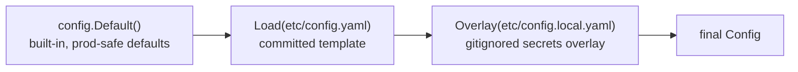

# Configuration

Every knob the running server exposes lives in one place: a YAML manifest,
modeled one-to-one by the [`config.Config`](../../core/platform/config/config.go)
struct. This document explains how the manifest is resolved, how secrets are kept
out of version control, and what every setting does. The committed template is
[`etc/config.yaml`](../../etc/config.yaml).

The guiding rule: **every setting has a built-in default**, so a partial — or
entirely absent — manifest still yields a complete, valid configuration. You only
write down what you want to change.

## How a config is resolved

Configuration is assembled in three layers, each overwriting only the keys it
sets, in [`wiring.loadConfig`](../../core/wiring/wiring.go) on top of the
functions in [`config.go`](../../core/platform/config/config.go):

1. **`Default()`** — the built-in defaults (see the table below). Prod-safe:
   `Mode` defaults to `prod`.
2. **`Load(path)`** — reads the manifest at `path` and unmarshals it *over* the
   defaults. The path comes from the `TAURUS_OMEGA_CONFIG` environment variable,
   falling back to `etc/config.yaml`. A missing file at the **default** path is
   not fatal (the built-in defaults are used); a missing file at an **explicitly
   requested** path, or any parse error, is fatal.
3. **`Overlay(localPath)`** — reads the sibling `*.local.*` file
   (`LocalPath("etc/config.yaml")` → `etc/config.local.yaml`) and unmarshals it
   over the loaded config. **This file is gitignored and is where secrets live.**
   A missing local file is fine — it just means no overrides.

Because each layer is a YAML unmarshal onto the same struct, unset keys keep the
value from the layer below. That's what makes a two-line local overlay — "same as
the template, but with my API key" — work.

## Secrets

The committed [`etc/config.yaml`](../../etc/config.yaml) keeps every secret
**blank** (notably `intelligence.providers.openrouter.api_key`). The real key
goes only in `etc/config.local.yaml`, which is gitignored and overlaid last. So
the template can be committed and shared without ever carrying a credential, and
a developer's key never leaves their machine. See
[intelligence](capabilities/intelligence.md) for how the key is used.

## Mode and TLS

`mode` selects the composition path and governs TLS, resolved in
[`wiring.resolveTLS`](../../core/wiring/wiring.go):

- **`dev`** — if no certificate is configured, the server generates a self-signed
  pair (via [`platform/devcert`](../../core/platform/devcert/devcert.go)) at
  `var/dev-cert.pem` / `var/dev-key.pem`. This is why local `curl` needs `-k`.
- **`prod`** — a real certificate (`server.tls.cert` and `server.tls.key`) is
  **required**; the server refuses to start without one. No self-signing.

The core always serves HTTPS in both modes.

## The settings

Every section of the manifest maps to a struct in `config.go`. Defaults come from
`config.Default()`.

| Section | Key | Meaning | Default |
|---|---|---|---|
| (root) | `mode` | `prod` or `dev` (composition path + TLS policy) | `prod` |
| `server` | `addr` | listen address `host:port` | `:8080` |
| `server.tls` | `cert` / `key` | certificate paths (required in prod; self-signed in dev if blank) | blank |
| `logging` | `requests` | capture each request/response as a structured log record | `true` |
| `logging` | `dir` | directory server logs are appended to (created if missing); blank sends them to standard error | blank (stderr) |
| `storage` | `dsn` | SQLite database file path (created if missing) | `var/taurus-omega.db` |
| `access` | `session_ttl` | how long a login stays valid (Go duration) | `24h` |
| `documents` | `rebase_threshold` | pending change sets that trigger an automatic re-base | `50` |
| `documents` | `history_limit` | summary entries retained after re-base; positive values prune folded detail below the current head while preserving reconstruction and current undo/redo state (`0` = keep all) | `0` |
| `documents` | `trash_retention` | how long a trashed document survives before `PurgeStale` removes it for good (Go duration) | `720h` (30 days) |
| `documents.layout` | `page_width` / `page_height` | default page geometry for newly created documents, in whole typographic points | `612` / `792` |
| `documents.layout` | `margin_top` / `margin_right` / `margin_bottom` / `margin_left` | default page margins for newly created documents | `72` each |
| `documents.layout` | `max_font_height` / `min_row_padding` | captured baseline row metrics (`font + 2 × padding`) | `24` / `4` |
| `documents.layout` | `char_width` | captured nominal character advance used to estimate row widths | `8` |
| `documents.prompt` | `plan_cast` / `synthesis_cast` | semantic casts `{purpose, strength, speed, cost}` for the plan and synthesis steps of prompt-block resolution, resolved through the **reasoning** cast table | `general` / `high` / `medium` / `medium` (both) |
| `documents.prompt` | `retrieval_top_k` / `max_queries` | retrieval bounds for one resolution: spans per query, and queries per plan | `5` / `4` |
| `documents.prompt` | `plan.{system,user}` / `synthesis.{system,user}` | Go `text/template` prompt overrides for the two steps; blank fields fall back to the built-in templates | blank (built-ins) |
| `jobs` | `workers` | concurrent background workers | `2` |
| `jobs` | `poll_interval` | wait before re-polling an empty queue (Go duration) | `1s` |
| `jobs` | `max_attempts` | retries before a job is marked failed | `5` |
| `intelligence` | `providers` | model backends by name (`api_key`, `base_url`) | none |
| `intelligence` | `casts.{reasoning,inference,embedding}` | cast→(provider, model) route tables | none |
| `knowledge.window` | `target_runes` / `overlap_runes` | sentence-window geometry (~4 runes ≈ 1 token) | `4000` / `400` |
| `knowledge.cluster` | `percentile` / `floor` | KLR level-relative threshold calibration | `0.75` / `0.30` |
| `knowledge.descent` | `enabled` / `beam` / `threshold` / `audit` | directed retrieval (off by default) + exact-scan audit | `false` / `3` / `0.35` / `true` |
| `knowledge.retrieval` | `char_budget` | cap on total returned region text (bytes) | `4000` |
| `agents` | `default_persona` | the deployment-owned **General** persona template materialized in each Project | built-in General |
| `agents` | `prompts` / `schemas` | deployment-frozen system prompts and output schemas per Quarterback mode (retrieval-plan, ask, plan, action) | built-in defaults |
| `agents.web` | `endpoint` / `api_key` / `max_results` | optional live-web search provider a chat turn may consult; an `https` URL answering `q`/`count` with `{"results":[{title,url,snippet}]}`. A blank `endpoint` disables the web source. | blank (disabled) |
| `agents.attachments` | `max_directory_files` | cap on how many files one directory-manifest chat attachment may carry (`0` = unbounded) | `256` |

A few settings are deliberately absent from the committed
[`etc/config.yaml`](../../etc/config.yaml) and exist only as built-in defaults
until a deployment needs them — `logging.dir`, `documents.trash_retention`, the
`documents.prompt` template overrides, and the whole `agents.web` block. Their
defaults are the safe posture (log to stderr, 30-day trash, built-in prompts, no
web source), so a manifest only names them to turn them on.

### Notes on the richer sections

- **`intelligence`** is the model boundary. `providers` is a map keyed by name
  (today `openrouter`), each with an `api_key` and optional `base_url`. `casts`
  holds three route tables — one per endpoint kind — where each entry maps a
  semantic cast `{purpose, strength, speed, cost}` to a concrete
  `{provider, model}`. A request names a *cast*, never a model; configuration
  resolves it. This mapping is the heart of
  [intelligence](capabilities/intelligence.md), which walks it in full.
- **`knowledge`** tunes the [retrieval lattice](capabilities/knowledge/README.md):
  window geometry ([lifecycle](capabilities/knowledge/lifecycle.md)), the KLR
  clustering threshold ([lattice](capabilities/knowledge/lattice.md)), and the
  directed-descent retrieval path plus its exact-scan audit
  ([retrieval](capabilities/knowledge/retrieval.md)). Descent ships **off** —
  the exact scan is the production path until descent is calibrated against the
  audit.
- **`documents`** tuning drives the [document](capabilities/documents/README.md)
  re-base, which is carried out asynchronously by the
  [jobs system](persistence.md). Its `layout` block is *captured* into each new
  document, so changing it never repaginates existing content. Its `prompt` block
  configures prompt-block resolution — the two casts (plan and synthesis, both
  resolved through the **reasoning** cast table), the retrieval bounds, and
  optional template overrides; the built-in templates are documented in
  [prompt resolution](workflows/prompt-resolution.md).
- **`agents`** configures the [agent](capabilities/agents/README.md) capability's
  deployment-frozen behavior: `default_persona` is the **General**
  [persona](capabilities/persona.md) template each Project materializes lazily,
  and `prompts`/`schemas` are the system instructions and structured-output schemas
  for retrieval planning and the Ask / Plan / Action modes. `web` is the optional
  live-web retrieval source a chat turn may consult (off unless an endpoint is
  set), and `attachments.max_directory_files` bounds a directory-manifest chat
  upload — per-file size is enforced by the file capability, not here. Agent tool
  limits and casts are fixed in wiring, not the manifest.

## How the config reaches the code

`wiring.Run` reads the assembled `Config` once at startup and hands each section
to the object that needs it — the `Storage.DSN` to the SQLite store, `Jobs.*` to
the worker pool, `Intelligence` to the provider/route builder, `Knowledge` to the
lattice service, and so on. Nothing re-reads the manifest at runtime; the
configuration is resolved once and injected. A dev-test suite can therefore point
the server at a throwaway manifest via `TAURUS_OMEGA_CONFIG` (see
[`dev-test/lib.sh`](../../dev-test/lib.sh)) to run an isolated instance.
