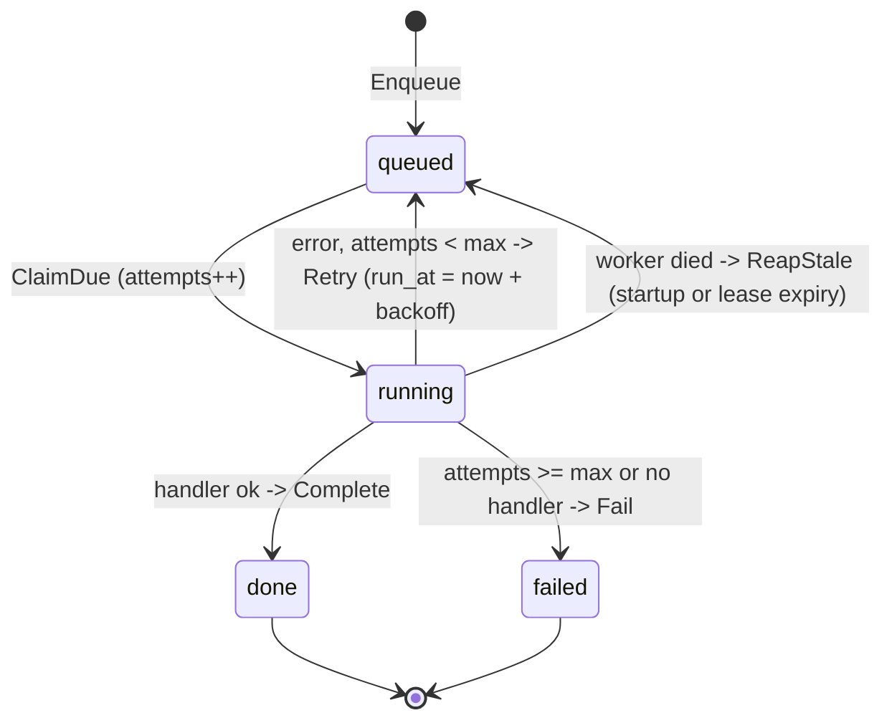
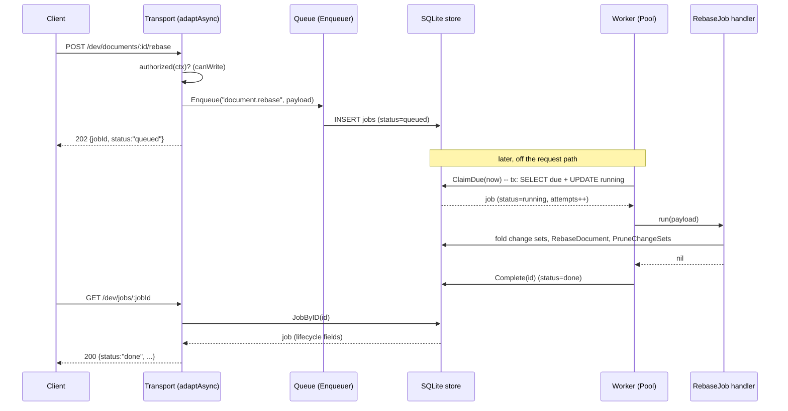

# Persistence and background jobs

One durable SQLite file backs every durable resource in the core — users, auth
sessions, projects, organizations, memberships, share links, documents (with
their anchors), change sets, Activity, comments, references, files, connectors,
contexts, resource attributes, workspaces, Formula names, the job queue, the
Knowledge lattice, project presence, personas, agent tasks, and agent chats. The
same file is where background work lives: a job is a row, and a pool of workers
drains it off the request path. This document explains both halves — the store
and the jobs system — grounded in the code that implements them.

The two source trees are [`core/platform/storage/sqlite/`](../../core/platform/storage/sqlite/)
(the single `Store`) and [`core/platform/job/`](../../core/platform/job/job.go)
(the queue, pool, and registry). See [runtime model](runtime-model.md) for how
these sit under the capability and transport layers, and
[transport](transport.md) for the request lifecycle that feeds the queue.

## One store, every interface

[`sqlite.Store`](../../core/platform/storage/sqlite/sqlite.go) wraps a single
`*sql.DB` and implements every persistence port in the codebase — 19 port
interfaces across 18 capability domains:

| Port | Backing package | Representative methods | File |
|------|-----------------|------------------------|------|
| `UserStore`, `SessionStore`, `ProjectStore`, `MembershipStore`, `ProjectLinkStore` | [`capability/access`](../../core/capability/access/access.go) | `CreateUser`, `SessionByID`, `ProjectsForUser`, `AddMembership`, `PutProjectLink` | `sqlite_access.go` |
| `activity.Store` | [`capability/activity`](../../core/capability/activity/activity.go) | `ListActivity`, `LatestActivityByProjects` | `sqlite_activity.go` |
| `agent.TaskStore` | [`capability/agent`](../../core/capability/agent/task.go) | `CreateTask`, `TaskByID`, `TasksByProject`, `BeginTaskRun`, `ReapStaleTasks` | `sqlite_agent.go` |
| `chat.ChatStore`, `chat.AttachmentStore` | [`capability/chat`](../../core/capability/chat/chat.go) | `CreateChat`, `AppendTurn`, `TurnsByChat`, `SetChatPersona`, `CreateChatAttachment` | `sqlite_chat.go` |
| `comment.Store` | [`capability/comment`](../../core/capability/comment/comment.go) | `CreateComment`, `CommentsByDocument`, `AddReply`, `RepliesByComment` | `sqlite_comment.go` |
| `connector.Store` | [`capability/connector`](../../core/capability/connector/connector.go) | `InsertConnector`, `ConnectorSummaries`, `SetConnectorSyncState` | `sqlite_connector.go` |
| `contexts.Store` | [`capability/contexts`](../../core/capability/contexts/contexts.go) | `InsertContext`, `ContextByID`, `ContextSummaries`, `UpdateContext` | `sqlite_context.go` |
| `document.Store` | [`capability/document`](../../core/capability/document/model.go) | `CreateDocument`, `DocumentSummaries`, `AppendChangeSet`, `RebaseDocument`, `PruneChangeSets` | `sqlite_document.go` |
| `file.Store` | [`capability/file`](../../core/capability/file/file.go) | `Put`, `Meta`, `Content`, `ByProject` | `sqlite_file.go` |
| `names.NameStore` | [`capability/formula/names`](../../core/capability/formula/names/names.go) | `PutName`, `UpdateName`, `Names`, `DeleteName` | `sqlite_formula_names.go` |
| `job.Store` | [`platform/job`](../../core/platform/job/job.go) | `Enqueue`, `ClaimDue`, `Complete`, `Retry`, `Fail`, `JobByID`, `ReapStale` | `sqlite_jobs.go` |
| `knowledge.Store` | [`capability/knowledge`](../../core/capability/knowledge/knowledge.go) | `ReplaceSource`, `DeleteSource`, `EntryFrontier`, `NodesByID` | `sqlite_knowledge.go` |
| `organization.Store` | [`capability/organization`](../../core/capability/organization/organization.go) | `CreateOrganization`, `AddOrgMembership`, `OrgMembershipsByUser` | `sqlite_organization.go` |
| `persona.Store` | [`capability/persona`](../../core/capability/persona/persona.go) | `CreatePersona`, `UpdatePersonaVersion`, `PersonasByProject`, `SetDefaultPersona` | `sqlite_persona.go` |
| `reference.Store` | [`capability/reference`](../../core/capability/reference/reference.go) | `ReplaceOutgoing`, `Outgoing`, `Incoming` | `sqlite_reference.go` |
| `resource.AttributeStore` | [`capability/resource`](../../core/capability/resource/attributes.go) | `ResourceAttributes`, `SetResourceAttributes`, `ResourceAttributesByProject` | `sqlite_resource.go` |
| `session.Store` | [`capability/session`](../../core/capability/session/session.go) | `UpsertProjectSession`, `ListProjectSessions`, `DeleteStaleProjectSessions` | `sqlite_sessions.go` |
| `workspace.Store` | [`capability/workspace`](../../core/capability/workspace/workspace.go) | `Workspace`, `SetWorkspace` | `sqlite_workspace.go` |

The composition root proves the "one store" claim: [`wiring.Run`](../../core/wiring/wiring.go)
calls `sqlite.Open(cfg.Storage.DSN)` exactly once and hands that same value to
every row above. Resource is the interesting case: it contributes only the
catalog *attribute* store (pinning and access scopes) — the catalog itself adds
no generic persistence, because its Document family adapter routes back to the
canonical Document owner. One connection pool, one file, so every durable
resource survives a restart together.

### One `Store`, twenty files

The package is **not** one monolithic `sqlite.go`. It is split into 20
per-capability files that all share the same `*Store` value and the same
connection:

```
sqlite.go              Open, pragmaDSN, the Store type, Close, time helpers
sqlite_migrate.go      migrate() — the whole declarative schema
sqlite_access.go       sqlite_activity.go   sqlite_agent.go     sqlite_chat.go
sqlite_comment.go      sqlite_connector.go  sqlite_context.go   sqlite_document.go
sqlite_file.go         sqlite_formula_names.go                  sqlite_jobs.go
sqlite_knowledge.go    sqlite_organization.go                   sqlite_persona.go
sqlite_reference.go    sqlite_resource.go   sqlite_sessions.go  sqlite_workspace.go
```

The split is purely **organizational** — it mirrors the capability boundaries in
`core/capability/` so each domain's storage is legible on its own — and changes
nothing semantically. There is still exactly one `Store`, one `*sql.DB`, one
pool, and one file; a method's home file is a readability decision, not a
boundary. So "the store" throughout this document means the whole package. (See
record [0112](../records/0112-sqlite-per-capability-split.md).)

### The pure-Go driver

The package imports `_ "modernc.org/sqlite"` — a SQLite implementation transpiled
to Go, **not** a cgo binding. The build stays plain `go build`: no C toolchain, no
`CGO_ENABLED=1`, and cross-compilation just works. The trade-off is that the driver
name registered with `database/sql` is `"sqlite"` (not `"sqlite3"`), which is why
`Open` calls `sql.Open("sqlite", ...)`.

### Open, and the pragma DSN

[`Open(dsn)`](../../core/platform/storage/sqlite/sqlite.go) creates the parent
directory if missing, opens the database through `pragmaDSN`, sizes the connection
pool, pings to force a real connection, then runs `migrate()`. The interesting work
is in `pragmaDSN`, which rewrites a plain path like `var/taurus-omega.db` into:

```
file:var/taurus-omega.db?_pragma=journal_mode(WAL)&_pragma=busy_timeout(5000)&_txlock=immediate
```

A DSN that is already a `file:` URI or an in-memory database (`:memory:`) is passed
through untouched, so tests can open shared in-memory stores without fighting the
rewrite.

Three settings, each load-bearing for concurrency:

- **`journal_mode(WAL)`** — write-ahead logging. Readers no longer block the
  writer and the writer no longer blocks readers; a reader sees a consistent
  snapshot while a write is in flight. This is what makes a connection pool worth
  having on SQLite.
- **`busy_timeout(5000)`** — when a connection wants the write lock and another
  holds it, wait up to 5s instead of failing immediately with `SQLITE_BUSY`. Under
  the single writer this turns contention into a short wait rather than an error.
- **`_txlock=immediate`** — `database/sql`'s `Begin()` issues `BEGIN IMMEDIATE`
  rather than the default `BEGIN DEFERRED`, taking the write lock at the *start* of
  the transaction. See [read-then-write transactions](#read-then-write-transactions-why-immediate-matters)
  below for why this specific choice prevents races that `busy_timeout` alone
  cannot.

### The connection pool

`Open` calls `db.SetMaxOpenConns(maxOpenConns)` with `maxOpenConns = 8`. With WAL,
up to eight reads run concurrently against the snapshot. Writes still serialize —
SQLite has exactly one writer — so the pool buys read concurrency, not write
concurrency. That asymmetry shapes the whole design: reads fan out, writes queue.

## Time stored as text: two layouts

Timestamps are stored as text, not integers, so the database file stays portable
and human-readable. Two layout constants govern the encoding:

- **`timeLayout = time.RFC3339Nano`** — the default for every timestamp column
  (`created_at`, `updated_at`, `added_at`, and so on). Compact and readable.
- **`sortableTimeLayout = "2006-01-02T15:04:05.000000000Z07:00"`** — a
  fixed-width fractional second, applied through the `sortableTime` helper.

The fixed-width form is used anywhere SQL compares or orders time text:
`jobs.run_at`, Document visible timestamps, and Activity occurrence times.
`RFC3339Nano` **trims trailing zeros** from the fractional second, so
`12:00:00.5` and `12:00:00.05` serialize to different-width strings whose
lexical order no longer matches chronological order. `sortableTime` pads every
value to nanosecond width so keyset pagination, due-job selection, and aggregate
timestamp reads preserve chronological order. `time.Parse(timeLayout, ...)`
accepts the fixed-width representation on read.

## The schema

[`migrate()`](../../core/platform/storage/sqlite/sqlite_migrate.go) is the entire schema:
a slice of `CREATE TABLE IF NOT EXISTS` / `CREATE INDEX IF NOT EXISTS` statements
executed in order, plus a small set of idempotent `ALTER TABLE ADD COLUMN`
statements for tables that predate a column. There is no migration framework and no
version table — the schema is declarative and additive. Walk it by domain.

### Access

```
users(id PK, email UNIQUE, password_hash, name DEFAULT '', created_at)
sessions(id PK, user_id → users, project_id DEFAULT '', created_at, expires_at)
projects(id PK, name, icon DEFAULT '', purpose DEFAULT '',
         visibility DEFAULT 'private', created_at, updated_at)
memberships(user_id → users, project_id → projects, role, PRIMARY KEY(user_id, project_id))
project_links(project_id → projects, role, token UNIQUE, PRIMARY KEY(project_id, role))
```

`memberships` is a join table with a composite primary key, so a user has at most
one role per project. `AddMembership` uses `INSERT OR REPLACE`, making a re-grant an
upsert. `sessions.project_id` is the currently selected project for a session
(empty until one is chosen). `project_links` stores at most one unguessable token
for each Project/role pair; only `read` and `edit` roles are admitted by the
Access service. `projects.updated_at` is profile time—the HTTP Project view
combines it with the latest Activity time rather than rewriting the Project row
for every Resource mutation.

### Documents and change sets

```
documents(id PK, project_id → projects, name, base, base_seq DEFAULT 0, revision DEFAULT 0, created_at, updated_at,
          lifecycle DEFAULT 'active', trashed_at DEFAULT '', creator_id DEFAULT '', creator_name DEFAULT '')
change_sets(id PK, document_id → documents, author_id → users,
            author_name DEFAULT '',
            submission_id DEFAULT '', submission_hash DEFAULT '',
            authored_revision DEFAULT 0, prior_revision DEFAULT 0,
            seq, created_at, ops,
            undo_of DEFAULT '', redo_of DEFAULT '',
            summary DEFAULT '{}', inverse_ops DEFAULT '[]')
document_submissions(document_id → documents, author_id, submission_id,
                     submission_hash, receipt,
                     PRIMARY KEY(document_id, author_id, submission_id))
document_history(change_set_id PK, document_id → documents, author_id,
                 author_name, submission_id DEFAULT '', authored_revision,
                 prior_revision, seq, created_at, undo_of DEFAULT '',
                 redo_of DEFAULT '', summary,
                 UNIQUE(document_id, seq))
INDEX idx_documents_project ON documents(project_id)
INDEX idx_change_sets_doc_seq ON change_sets(document_id, seq)
UNIQUE INDEX idx_change_sets_doc_revision ON change_sets(document_id, seq)
UNIQUE INDEX idx_change_sets_doc_undo ON change_sets(document_id, undo_of) WHERE undo_of <> ''
UNIQUE INDEX idx_change_sets_doc_redo ON change_sets(document_id, redo_of) WHERE redo_of <> ''
UNIQUE INDEX idx_change_sets_doc_submission
    ON change_sets(document_id, author_id, submission_id) WHERE submission_id <> ''
INDEX idx_document_history_doc_seq ON document_history(document_id, seq DESC)
```

A document's resolved content (`base`), submitted operations (`ops`), and
server-computed compensation (`inverse_ops`) are stored as JSON text — the store
serializes them whole with `encoding/json` and never interprets rows, blocks, or
ops. New operation shapes such as text splice, stable-ID movement, Mark update,
and split/join therefore require no relational schema migration and round-trip
with their private inverses through the same columns. `submission_id`,
`submission_hash`, `authored_revision`, and `prior_revision` bind an accepted
change set to the exact idempotent request, client-observed head, and actual
admission head. The latter two differ only after a proven semantic rebase. The
separate `document_submissions` receipt survives replay-history pruning,
allowing an identical retry to return the original ChangeSet while rejecting
the same document/author/key with a different payload. `undo_of` links an undo
to its target and `redo_of` links a redo to its target undo; their partial
unique indexes allow at most one direct compensation of each kind per target.
`author_name` snapshots trusted attribution. The server-computed `summary`
contains bounded, content-free operation kinds and affected IDs.

`document_history` copies immutable attribution, lineage, and summary metadata
so public History retention is independent of the detailed operation and
inverse rows used for reconstruction and current-head compensation. Its
descending sequence index serves newest-first keyset paging. `revision` is the
public logical head and matches the latest accepted change-set `seq`; `base_seq`
is the internal watermark already folded into `base`. Change sets above the
watermark are *pending* and get replayed on read; the folding of pending sets
into a new base is the re-base job described below. The ordinary
`(document_id, seq)` index serves ordered replay (`ChangeSetsSince`), and the
unique index enforces one change set at each document revision.
`idx_documents_project` backs the by-project scans on the hot read paths —
`DocumentsByProject` behind list, revision-hints, and the duplicate-name check —
which were previously full-table scans that grew with project size (record
[0109](../records/0109-rebase-watermark-guard-and-document-index.md)). See
[capabilities/documents](capabilities/documents/README.md) for the document model itself.

Document create, change-set append, rename, and delete are transactions that also
insert their semantic Activity fact. Append and rename advance the Document's
visible `updated_at`; append also advances `revision` atomically. Re-base changes
only `base`/`base_seq`, because folding representation state is not a
user-visible edit. Undo and redo use the same append transaction, so their new
revision, lineage, History summary, and Activity fact commit together.

**The re-base watermark is monotonic.** `RebaseDocument` is the one write to a
document head that is *not* gated by the revision CAS, and re-base jobs can run
on either worker with no dedup. So the update carries its own guard:

```sql
UPDATE documents SET base = ?, base_seq = ? WHERE id = ? AND base_seq < ?
```

`AND base_seq < ?` means the watermark can only move **forward**: a stale or
duplicate re-base (one whose `baseSeq` does not exceed the stored watermark)
matches zero rows and is a safe no-op. A correct re-base always folds pending
change sets whose seq exceeds the current watermark, so its `baseSeq` is strictly
greater and it still applies. Without the guard, a stale re-base could wind
`base_seq` backward and overwrite a newer base — and, racing `PruneChangeSets`
(which deletes change sets at or below `base_seq`), drop change sets the correct
base still needed. The `MemoryStore` double honours the same contract, and the
invariant is stated on the `document.Store` port rather than left as one store's
implementation detail. See record
[0109](../records/0109-rebase-watermark-guard-and-document-index.md).

`lifecycle` (`active` or `trashed`) with `trashed_at` implements soft delete: a
`DELETE` trashes the document, `restore` reactivates it, and `purge` removes it for
good. `creator_id`/`creator_name` snapshot who first authored the document and ride
along to a `duplicate`.

### Document anchors

```
document_anchors(id PK, document_id → documents, row_id, block_id, atom_id,
                 start_offset DEFAULT 0, end_offset DEFAULT 0,
                 state DEFAULT 'valid', created_at)
    INDEX idx_document_anchors_doc ON document_anchors(document_id)
```

An **anchor** is a stable, addressable reference into a document — a
`(row, block, atom, offset-range)` position with a `state` that tracks whether it
still resolves against current content. Anchors are created, listed, deleted, and
re-validated through the document routes; the per-document index serves listing and
bulk re-validation.

### Activity

```
activity_events(id PK, project_id → projects,
                actor_id, actor_name, action,
                target_id, target_kind, target_name,
                occurred_at, source_kind, source_id,
                UNIQUE(source_kind, source_id))
INDEX idx_activity_project_time
    ON activity_events(project_id, occurred_at DESC, id DESC)
```

Activity holds immutable, bounded actor/target snapshots for confirmed Resource
effects. There is no generic append API: the canonical Document transaction
writes the event. The unique source identity prevents one owner mutation from
being recorded twice, while the Project/time index serves newest-first keyset
paging and batched latest-event reads.

### Formula names

```
formula_names(project_id, name, type, value, schema, rows, source,
              created_at, updated_at,
              PRIMARY KEY(project_id, name))
```

The tagged entry fields store a Project's scalar, table, or function namespace.
`UpdateName` performs callback-based read/validate/write under one immediate
transaction, so concurrent constructive table changes cannot lose updates.
Formula evaluation reads one namespace snapshot; the pure evaluator itself
remains storage-free.

### Jobs

```
jobs(id PK, type, payload, status, attempts, max_attempts, last_error,
     run_at, created_at, updated_at)
INDEX idx_jobs_status_run_at ON jobs(status, run_at)
```

Every field of the `job.Job` struct maps to a column: the opaque JSON `payload`,
the lifecycle `status`, the `attempts` / `max_attempts` retry counters, the
`last_error` string, and the `run_at` due time (the only column encoded with
`sortableTime`). The `(status, run_at)` index is exactly the shape of the
`ClaimDue` query — filter by status, order by due time — so claiming the next job
is an index seek, not a scan.

### Knowledge

```
knowledge_embedding_spaces(identity PK, definition)
knowledge_generations(id PK, project_id, kind, space_identity, state, record)
knowledge_lattice_state(project_id, kind, active_generation_id,
                        previous_generation_id, revision, source_cursor, updated_at,
                        PRIMARY KEY(project_id, kind))
knowledge_source_changes(project_id, kind, cursor, generation_id, operation,
                         source_type, source_id, revision, content_hash, occurred_at,
                         PRIMARY KEY(project_id, kind, cursor))

knowledge_sources(generation_id, local_ref_id, project_id, source_type, source_id,
                  label, size_bytes, line_count, content_hash, blocks, identity,
                  added_at, synced_at, revision,
                  PRIMARY KEY(generation_id, local_ref_id),
                  UNIQUE(generation_id, project_id, source_type, source_id))
knowledge_windows(generation_id, id, local_ref_id, ordinal, win_start, win_end,
                  embedding_v2, text, blocks,
                  PRIMARY KEY(generation_id, id))
knowledge_nodes(generation_id, id, project_id, local_ref_id, level, member_count,
                cohesion, centroid_v2, created_at,
                PRIMARY KEY(generation_id, id))
knowledge_memberships(generation_id, parent_id, member_id, ordinal,
                      PRIMARY KEY(generation_id, parent_id, ordinal))
knowledge_corpus_state(generation_id, project_id, dirty_seq, built_seq,
                       PRIMARY KEY(generation_id, project_id))
knowledge_corpus_index(generation_id, project_id, level, threshold, k, basis,
                       centroids, PRIMARY KEY(generation_id, project_id, level))
knowledge_corpus_edges(generation_id, project_id, level, artifact_id, cell, edges,
                       PRIMARY KEY(generation_id, project_id, level, artifact_id))

knowledge_reembed_previews(id PK, project_id, kind, record)
knowledge_reembed_runs(id PK, project_id, kind, preview_id, target_generation_id,
                       idempotency_key, status, record,
                       UNIQUE(project_id, kind, idempotency_key))
knowledge_reembed_checkpoints(run_id, source_type, source_id, record,
                              PRIMARY KEY(run_id, source_type, source_id))
knowledge_generation_events(sequence INTEGER PK AUTOINCREMENT, id UNIQUE,
                            project_id, kind, generation_id, event_type, actor_id,
                            state_revision, occurred_at)
```

The lifecycle rows are the correctness authority. `knowledge_lattice_state`
contains the atomic active/previous pointer, CAS revision, and source cursor;
`knowledge_source_changes` retains add/update/remove events, including removal
tombstones. Embedding spaces and generation records are immutable definitions.
Preview/run/checkpoint JSON stores the frozen command, complete usage/cost
receipt, controls, progress, and validation. Generation events are written in
the same promotion/rollback transaction as the pointer change.

Every artifact key is generation-composite. A generation-pinned store view adds
`generation_id` to every query, so equal content-derived IDs in active, shadow,
and rollback generations cannot collide or cross-hydrate. Window and centroid
vectors use canonical float32 little-endian BLOBs; literal window text and block
references are retained for fail-closed evidence hydration.

The Ω-005 migration runs after legacy vector/text/metadata backfills, rebuilds
all seven artifact tables in one transaction, and certifies each legacy Project.
One homogeneous identity with valid vector width becomes deterministic
generation 1. Mixed/malformed projects are retained as `reembed_required`, are
not queryable through the active path, and remain available only as the source
base of an owner-authorized repair.

See [the Knowledge lifecycle](capabilities/knowledge/lifecycle.md) for state
transitions and recovery semantics.

### Session presence

```
project_sessions(project_id → projects, user_id → users, session_id,
                 user_name, user_email DEFAULT '',
                 current_document_id, caret_atom_id, caret_offset,
                 selection_start_atom_id, selection_start_offset,
                 selection_end_atom_id, selection_end_offset,
                 started_at, last_activity_at,
                 PRIMARY KEY(project_id, user_id))
    INDEX idx_project_sessions_last_activity
        ON project_sessions(project_id, last_activity_at)
```

One ephemeral **presence** row per user per project: their live document focus and
caret/selection, plus an identity snapshot (`user_name`, `user_email`). `Start` is
an upsert on the composite key; a background sweeper deletes rows idle past a stale
timeout, and the `last_activity_at` index serves both the sweep and the active-only
listing. See [capabilities/session](capabilities/session.md).

### Personas

```
personas(project_id → projects, id, name, description, current_version,
         created_by, created_at, updated_at, PRIMARY KEY(project_id, id))
    INDEX idx_personas_project_name ON personas(project_id, name, id)
persona_versions(project_id, persona_id, version, definition, created_by, created_at,
                 PRIMARY KEY(project_id, persona_id, version),
                 FOREIGN KEY(project_id, persona_id) → personas)
persona_defaults(project_id, user_id → users, persona_id, updated_at,
                 PRIMARY KEY(project_id, user_id),
                 FOREIGN KEY(project_id, persona_id) → personas)
```

A **persona** is a Project-local identity carrying a `current_version` pointer;
**`persona_versions`** holds the immutable `definition` (JSON) of each version, so
an edit appends a version rather than mutating one; **`persona_defaults`** records
each user's chosen default (written by upsert). See
[capabilities/persona](capabilities/persona.md).

### Agent tasks

```
agent_tasks(id PK, project_id → projects, requester_id DEFAULT '',
            requester_name DEFAULT '', persona_id DEFAULT '', state, content,
            heartbeat_at DEFAULT '', created_at, updated_at)
    INDEX idx_agent_tasks_project ON agent_tasks(project_id, created_at)
    INDEX idx_agent_tasks_persona_created ON agent_tasks(project_id, persona_id, created_at)
```

One row per durable Quarterback **task**. The whole task aggregate — persona
snapshot, plan revisions, and run history — is serialized into the `content` JSON;
`state`, `heartbeat_at`, and the two indexes support the worker's
claim / heartbeat / reaper cycle and the by-project and by-persona listings. See
[capabilities/agents](capabilities/agents/README.md).

### The rest of the schema

`migrate()` declares **35** tables in all. The domains above are the ones with
non-obvious mechanics; the remainder are straightforward project-scoped tables,
listed here so the inventory is complete:

| Domain | Tables | Shape |
|--------|--------|-------|
| Agent chats | `agent_chats`, `agent_chat_turns`, `agent_chat_attachments` | A chat (`mode`, optional `resource_id`/`persona_id`) with ordered turns (`role`, `body`, optional `task_id`) and attachments (`kind`, `file_id`, `relative_path`, `directory_upload_id` grouping one directory upload). Indexed by `(project_id, updated_at)`, `(project_id, resource_id)`, `chat_id`, and `(chat_id, created_at)`. |
| References | `resource_references` | The directed edge set `(project_id, from_kind, from_id) → (to_kind, to_id)` with a `kind` and optional `anchor`. Two indexes — one per direction — so outgoing links and backlinks are both index seeks. |
| Comments | `document_comments`, `comment_replies` | A thread pinned to `(document_id, anchor_id)` with `resolved` and author snapshots, plus its ordered replies. Indexed by `(project_id, document_id)` and `comment_id`. |
| Files | `files` | Project-scoped binary storage: metadata (`name`, `content_type`, `size`, uploader snapshot) beside the bytes in a `BLOB` column. Indexed by `(project_id, created_at)`. |
| Resource attributes | `resource_attributes` | Catalog attributes keyed `(project_id, kind, resource_id)`: the `pinned` flag and the serialized `access` scope. |
| Organizations | `organizations`, `org_memberships` | Orgs spanning projects, plus `(org_id, user_id) → role`, with a by-user index for the reverse lookup. |
| Workspaces | `workspaces` | One opaque `state` JSON blob per `(user_id, project_id)` — personal cockpit UI state, not project content. |
| Connectors | `connectors` | Keyed `(project_id, id)`: `subkind`, `path`, and the sync bookkeeping (`fingerprint`, `sync_seq`, `synced_at`). |
| Contexts | `contexts` | Keyed `(project_id, id)`: a named set as `includes_json` / `excludes_json`, resolved live against the catalog rather than materialized. |

### Additive column migrations

SQLite has no `ADD COLUMN IF NOT EXISTS`, so `migrate()` runs each `ALTER TABLE
ADD COLUMN` (for `sessions.project_id`; `documents.base_seq`/`.revision`/
`.lifecycle`/`.trashed_at`/`.creator_id`/`.creator_name`;
`change_sets.author_name`/`.submission_id`/`.submission_hash`/`.authored_revision`/
`.prior_revision`/`.undo_of`/`.redo_of`/`.summary`/`.inverse_ops`;
`document_history.authored_revision`;
`knowledge_sources.blocks`/`.identity`/`.revision`; `users.name`; Project
`icon`/`purpose`/`updated_at`/`visibility`; `project_sessions.user_email`; and
`agent_tasks.requester_name`/`.heartbeat_at`) and treats a `duplicate column name`
error as success. It backfills a historical change set's `prior_revision` from
`seq - 1`, reconstructs an existing Document revision from the larger of
`base_seq` and the newest retained change set, then backfills missing Project
timestamps and repairs historical Document visible times from retained change
sets, raising old Project profile timestamps where necessary without inventing
Activity events. That keeps startup re-runnable on fresh and existing databases.

## Canonical state vs. rebuildable projection

The knowledge tables split into two kinds of state, and `migrate()` treats them
differently:

- **Canonical** — `knowledge_sources` and `knowledge_windows`. The source text and,
  crucially, the window **embeddings** are expensive to reproduce (each embedding is
  a paid model call). This data is authoritative and must be preserved.
- **Rebuildable projection** — `knowledge_nodes` and `knowledge_memberships`. The
  lattice is the *result* of clustering the windows; it can be recomputed from the
  canonical frontier at any time.

The migration exploits this. Before creating tables, it probes the existing
`knowledge_nodes` for a pre-KLR column with
`SELECT COUNT(*) FROM pragma_table_info('knowledge_nodes') WHERE name = 'root'`; if
the old shape is present, it simply `DROP TABLE knowledge_nodes` rather than writing
a data migration to reshape it. The sources and windows — the costly canonical
state — are untouched, and the lattice rebuilds on the next add. Dropping derived
state is safe; dropping canonical state would not be. This is why `ReplaceSource`
and `DeleteSource` accept a `rebuildCorpus` callback and recompute nodes inside the
write transaction instead of migrating them.

## Read-then-write transactions (why `immediate` matters)

Several operations read a value and then write based on it, and they must not
race. Representative examples, all using `db.Begin()` (which is `BEGIN
IMMEDIATE` thanks to the DSN):

- **`AppendChangeSet`** first checks the immutable receipt scoped by Document,
  trusted author, and submission ID. An identical retry returns the original
  ChangeSet; mismatched reuse conflicts. A new request compares the current head
  with the service-selected admission revision, advances it exactly once, and
  inserts authored/admitted revision metadata, operations, summary, private
  inverse, optional undo/redo target, immutable History entry, receipt, and
  linked Activity fact in the same transaction. A CAS loser returns
  `ErrRevisionConflict` without inserting; ordinary submission admission may
  reload and recompute semantic proof, while undo and redo report head
  conflicts.
- **`ClaimDue`** selects the earliest queued, due job, then updates it to `running`
  and increments `attempts`. Two workers must never claim the same row.
- **`UpdateName`** loads a Formula entry, runs the manager's validation callback,
  and writes the result. Two concurrent column/row mutations must not overwrite
  one another.
- **Document create/append/rename/delete** write canonical state and its Activity
  fact together. If either side fails, neither effect may survive.
- **`ReplaceSource` / `DeleteSource`** delete a source's old lattice, insert the
  new snapshot/windows/nodes, then rebuild the project's corpus tier from the
  *complete* post-change frontier — all in one transaction, so no reader observes
  the half-updated lattice and each rebuild sees every previously committed add.

Why `BEGIN IMMEDIATE` specifically, and not just `busy_timeout`? With the default
`BEGIN DEFERRED`, a transaction takes only a shared read lock for its `SELECT` and
tries to *upgrade* to the write lock at its first write. If two such transactions
both hold the read lock and both try to upgrade, neither can proceed — a deadlock
that SQLite resolves by failing one immediately with `SQLITE_BUSY`, which
`busy_timeout` cannot wait out (waiting would never help). `BEGIN IMMEDIATE` takes
the write lock up front, so the second transaction blocks at `Begin()` — cleanly
governed by `busy_timeout` — until the first commits. The read-then-write critical
section serializes, and the stale read can't happen. Single-statement `Exec` calls
(most of the store) are autocommit and need none of this.

## The jobs system

[`platform/job`](../../core/platform/job/job.go) is a deliberately small, durable
background-jobs system: a queue, a handful of workers, and retry with backoff.
Jobs are independent and order-insensitive — there is no dependency graph and no
priority. Work that must answer a request synchronously does not belong here;
jobs currently run Document re-base and prompt-block resolution.

### A job is a durable row

`job.Job` carries an `ID`, a `Type` string, an opaque `Payload` (`json.RawMessage`
the type's handler decodes — the queue never interprets it), a `Status`, the
`Attempts` / `MaxAttempts` counters, `LastError`, and `RunAt` plus timestamps.
`Status` is one of four values:

- `StatusQueued` — waiting to run, or waiting to retry after a failure.
- `StatusRunning` — claimed by a worker and executing.
- `StatusDone` — completed successfully.
- `StatusFailed` — exhausted its attempts (or had no handler); terminal.

Because the job lives in the same SQLite file as everything else, an enqueued job
survives a crash or restart — a worker will pick it up when the process comes back.

### The enqueue side: Queue, Enqueuer, Registry

`Queue` (built by `NewQueue(store, maxAttempts)`) is the enqueue side. Its
`Enqueue(ctx, typ, payload)` marshals the payload to JSON, stamps `RunAt = now` (due
immediately), fills in `MaxAttempts`, and stores a `StatusQueued` job. It satisfies
the narrow `Enqueuer` interface —

```go
type Enqueuer interface {
    Enqueue(ctx context.Context, typ string, payload any) (Job, error)
}
```

— which is the only seam other packages depend on to schedule work. The document
service, for instance, holds an `Enqueuer` and knows nothing about SQLite or the
pool.

`Registry` maps a job type to its `Handler` (`func(ctx, payload) error`). It is
written once at startup and read concurrently by workers, so it is guarded by an
`sync.RWMutex`. `wiring.Run` registers both current handlers:

```go
registry.Register(document.JobTypeRebase, docs.RebaseJob)
registry.Register(document.JobTypeResolve, docs.ResolveJob)
```

### The worker pool

[`Pool`](../../core/platform/job/pool.go) runs a fixed set of workers over the store
and registry. `Start(ctx)` first performs **crash recovery**, then launches
`Workers` goroutines (default 2) each running the `work` loop, plus one `reap`
goroutine; `Wait()` blocks until they all exit after `ctx` is cancelled. Each
worker loops:

1. `ClaimDue(now)` — atomically lease the next due job (marks it `running`,
   increments `attempts`). If nothing is due, `sleep` for `PollInterval` (default
   1s) and loop. A claim error is logged and also backs off by one poll interval.
2. `run(ctx, job)` — look up the handler by type. No handler registered → `Fail`
   the job immediately (it can never make progress).
3. Invoke the handler through `runHandler`, which **recovers panics into errors** so
   one bad job cannot take down a worker.
4. On success → `Complete` (→ `done`). On error, decide between retry and failure.

### Crash recovery: `ReapStale` and the reaper

`ClaimDue` only ever selects `queued` rows, so a job left in `running` by a
process that died mid-run used to be stranded there forever. The `job.Store` port
closes that hole with `ReapStale(before time.Time) (int, error)` — return every
job running since before the given time to `queued`, due immediately, reporting
how many. **Attempts are preserved**, so a job that repeatedly kills its worker
still exhausts `max_attempts` and fails rather than looping forever. In SQLite it
is one statement:

```sql
UPDATE jobs SET status = 'queued', ... WHERE status = 'running' AND updated_at < ?
```

`updated_at` is the lease clock — `ClaimDue` stamps it when a worker takes the
job — so a job silent past the threshold is treated as orphaned. The pool uses it
in two places:

- **At startup**, `Start` calls `ReapStale(now)` *before* launching any worker.
  A single-instance cell has no job legitimately running before its own workers
  exist, so requeueing **all** running rows cleanly recovers a prior crash's
  orphans.
- **Periodically**, the `reap` goroutine calls `ReapStale(now - lease)` every
  `ReapInterval`. `Options.Lease` (default **15m**) must exceed the slowest job so
  a working job is never requeued out from under itself; `Options.ReapInterval`
  defaults to **1m**. The reaper joins the pool's `WaitGroup`, so `Wait()` covers
  it on shutdown.

`MemoryStore` implements the same semantics with an equivalent scan. See record
[0110](../records/0110-job-crash-recovery-and-reaper-lifecycle.md).

### Retry with exponential backoff

The retry decision lives in `Pool.run`:

```go
// j.Attempts already counts this run (ClaimDue incremented it).
if j.Attempts >= j.MaxAttempts {
    _ = p.store.Fail(j.ID, err.Error())   // terminal
    return
}
_ = p.store.Retry(j.ID, err.Error(), p.now().UTC().Add(p.backoff(j.Attempts)))
```

`Retry` returns the job to `queued` with a future `run_at`, so `ClaimDue` won't
pick it up until the backoff elapses, and records `last_error`. The delay is
exponential: `backoff(n) = baseBackoff * 2^(n-1)`, capped at `maxBackoff` — with the
defaults (`baseBackoff = 1s`, `maxBackoff = 5m`) the retry delays run 1s, 2s, 4s,
8s, … up to five minutes. Once `attempts` reaches `max_attempts`
(`DefaultMaxAttempts = 5`, configurable), the job is marked `failed` with its final
error and never runs again.



### The in-memory store (tests)

[`MemoryStore`](../../core/platform/job/memory.go) is a mutex-guarded map that
implements the same `job.Store` interface for tests. Its `ClaimDue` mirrors the
SQLite semantics exactly — pick the earliest-due queued job, mark it running,
increment attempts — so the pool behaves identically whether it drains a real
database or an in-memory map.

## Async HTTP dispatch, end to end

The jobs system is how the transport layer defers work off the request path. In
[`transport`](../../core/transport/dispatch.go), a hardcoded `operationMode` map is
the source of truth for how each document/resource operation is dispatched. It
classifies into **three** modes, not two — `dispatchConcurrent`,
`dispatchSerial`, and `dispatchDeferred`:

```go
var operationMode = map[string]executionMode{
    "documents.list":           dispatchConcurrent,
    "documents.history.list":   dispatchConcurrent,
    "documents.history.get":    dispatchConcurrent,
    ...
    "documents.append_changes": dispatchSerial,
    "documents.undo":           dispatchSerial,
    "documents.redo":           dispatchSerial,
    ...
    "documents.rebase":         dispatchDeferred,
    "documents.resolve":        dispatchDeferred,
}
```

Reads and mutations that carry a synchronous contract (a returned body, an
immediate `409`) are `dispatchConcurrent` and run on the request's own goroutine.
Document **writes** — append, undo, redo — are `dispatchSerial`: they also run
inline and answer synchronously, but behind a lock on an operation-chosen key from
`dispatch.KeyedMutex`. That lock is an in-process contention optimization only;
as the [CAS discussion above](#read-then-write-transactions-why-immediate-matters)
shows, the revision compare-and-swap in `AppendChangeSet` is the actual
correctness boundary and the only one that holds across processes and against a
job worker. Re-base maintenance and the model-backed prompt-resolution workflow
are `dispatchDeferred` — **the only two operations that become jobs**. When
`dispatchScoped` sees an async operation it calls `adaptAsync`, which authorizes
the request, builds the payload, enqueues a job through the `Enqueuer`, and
answers **`202 Accepted`** with the job id:

```go
return writeResponse(c, endpoint.Response{
    Status: http.StatusAccepted,
    Body:   map[string]any{"jobId": j.ID, "status": string(j.Status)},
})
```

The client then polls `GET /dev/jobs/:jobID`, served by
[`handlers/job`](../../core/handlers/job/job.go). That endpoint returns the job's
**lifecycle fields only** — `id`, `type`, `status`, `attempts`, `maxAttempts`,
`lastError`, and timestamps. The `Payload` and `RunAt` fields are tagged `json:"-"`
on `job.Job`, so the opaque payload (which may hold internal ids) is never exposed.

Polling needs an id, so the same handler also serves **`GET /dev/jobs`** — the
queue listed by status (`?status=failed`, bounded by `?limit=`, default 50, cap
200) with a summary of all four status counts, over the `JobsByStatus` and
`JobCounts` store methods. Both routes sit under `/dev` because jobs are
observability rather than a product surface: the `jobs` table carries no user or
project column, so a job has no owner to authorize against.

Document re-base reaches the queue two ways, both landing on the same
`document.JobTypeRebase` handler:

- **Automatically**, from `Documents.SubmitChanges`: once the pending change-set
  count crosses `RebaseThreshold`, it enqueues a re-base directly through its
  `Enqueuer` seam (best-effort — a failed enqueue just retriggers on the next
  append, and reads resolve pending sets meanwhile).
- **Explicitly**, via the dev endpoint `POST /dev/documents/:documentID/rebase`,
  which is the `dispatchDeferred` route above.

Either way, `docs.RebaseJob` decodes the payload and calls `Documents.Rebase`,
which folds pending change sets into a new base, advances `base_seq` without
changing logical `revision`, and—when a positive limit is configured—prunes old
detailed rows while retaining pending reconstruction rows and current-head
compensation detail, then independently bounds summary History. The write-heavy
work stays off the request path. The flow:



Prompt resolution reaches the queue through
`POST /documents/:documentID/blocks/:blockID/resolve`. Its async payload also
carries the block ID and `reload`/`refresh` mode; `docs.ResolveJob` runs the
plan → retrieve → synthesize → incorporate workflow and commits the generated
change set. Both job types expose the same polling contract.

See [transport](transport.md) for the full request lifecycle, the sync path, and
how `operationMode` is enforced against the route wiring.

## Composition and shutdown

[`wiring.Run`](../../core/wiring/wiring.go) assembles the whole thing in order:
open the store, build the `Queue` over it, build the `Documents` service with that
queue as its `Enqueuer`, create the `Registry`, register `RebaseJob` and
`ResolveJob`, then build and `Start` the `Pool` on a dedicated `jobCtx`.

Shutdown ordering matters and is deliberate. On a signal, `Run` first drains the
HTTP listener (`e.Shutdown`) so no new work is enqueued, **then** cancels `jobCtx`
and calls `pool.Wait()` to let any in-flight job — and the reaper, and the agent
task reaper, which now share `jobCtx` — finish before the deferred
`store.Close()` runs.

A job interrupted by a *hard* crash was already claimed as `running` in a durable
row. It is no longer stranded there: the next `Start` requeues every `running`
row before launching workers, and the reaper requeues anything running past the
lease within a live process. Because attempts are preserved across a reap, the
guarantee is **at-least-once** with a bounded number of tries — a handler that
must not double-apply still needs to be idempotent.

## Configuration

The relevant settings, from [`platform/config`](../../core/platform/config/config.go)
(details in [configuration](configuration.md)):

| Key | Field | Default | Effect |
|-----|-------|---------|--------|
| `storage.dsn` | `Storage.DSN` | `var/taurus-omega.db` | SQLite file path (created with its parent dir) |
| `jobs.workers` | `Jobs.Workers` | `2` | concurrent worker goroutines in the pool |
| `jobs.poll_interval` | `Jobs.PollInterval` | `1s` | wait before re-polling an empty queue |
| `jobs.max_attempts` | `Jobs.MaxAttempts` | `5` | tries before a job is marked `failed` |
| `documents.rebase_threshold` | `Documents.RebaseThreshold` | `50` | pending change sets that trigger a re-base job |
| `documents.history_limit` | `Documents.HistoryLimit` | `0` (keep all) | summary entries retained after re-base; a positive value also prunes folded detail below the current head while retaining pending reconstruction rows and the head undo/redo recipe |
| `documents.layout.page_width` / `.page_height` | `Documents.Layout.PageWidth` / `.PageHeight` | `612` / `792` | default page geometry captured by new documents |
| `documents.layout.margin_*` | `Documents.Layout.Margin*` | `72` each | default page margins captured by new documents |
| `documents.layout.max_font_height` / `.min_row_padding` | `Documents.Layout.MaxFontHeight` / `.MinRowPadding` | `24` / `4` | baseline row metrics captured by new documents |
| `documents.layout.char_width` | `Documents.Layout.CharWidth` | `8` | nominal character advance captured by new documents |
| `documents.trash_retention` | `Documents.TrashRetention` | `720h` | how long a trashed document survives before `PurgeStale` removes it |

## See also

- [runtime model](runtime-model.md) — the canonical as-built description; how
  persistence and jobs sit within the core
- [transport](transport.md) — request dispatch, the three execution modes, and
  status polling
- [configuration](configuration.md) — the full configuration schema
- [capabilities/documents](capabilities/documents/README.md) — the document + change-set model that re-base serves
- [capabilities/activity](capabilities/activity/README.md) — the semantic facts committed with Document mutations
- [capabilities/formula/name-manager](capabilities/formula/name-manager.md) — the persisted Formula namespace
- [capabilities/knowledge/](capabilities/knowledge/) — the retrieval lattice stored in the knowledge tables
