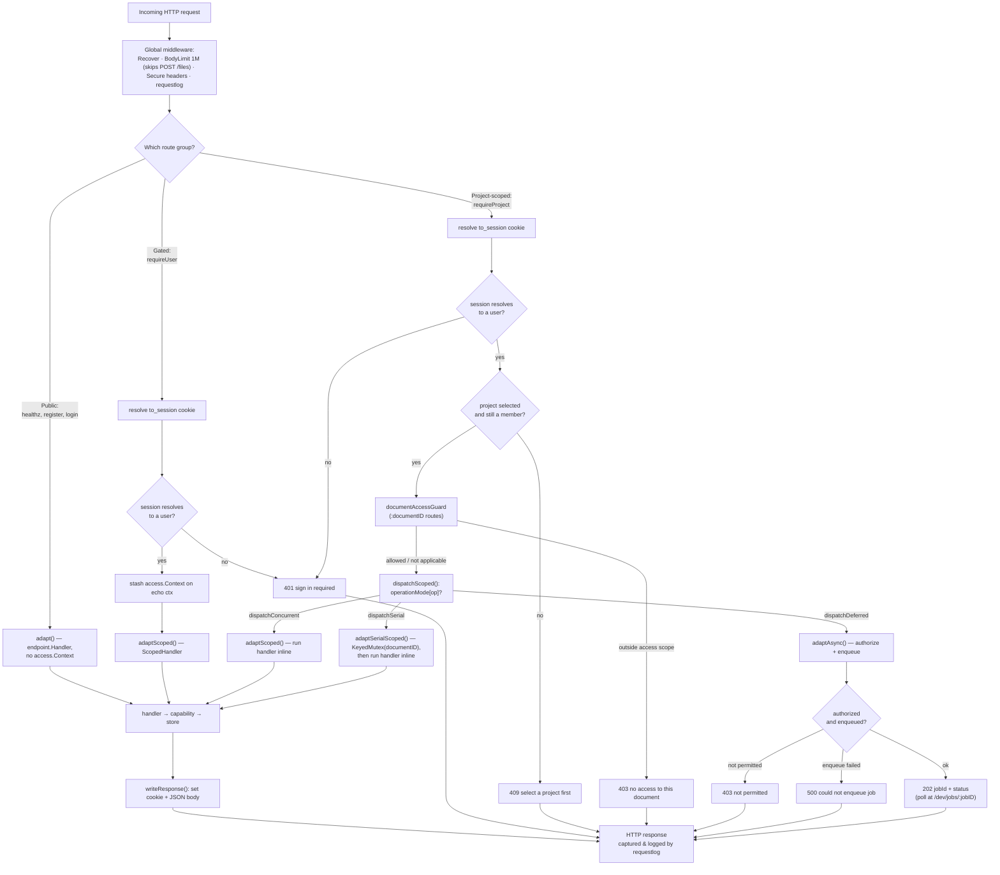

# HTTP transport layer

The transport layer is the boundary between the outside world and the Taurus
Omega core. It owns exactly one job: turn an HTTP request into a call on a
transport-agnostic application handler, and turn that handler's answer back into
an HTTP response — enforcing access along the way. It lives under
[`core/transport/`](../../core/transport/), built on the
[Echo](https://echo.labstack.com/) framework, and is deliberately thin: it
contains no business logic. Everything domain-specific lives in the handlers
([`core/handlers/`](../../core/handlers/)) and the capabilities
([`core/capability/`](../../core/capability/), see [access](capabilities/access.md)
and [documents](capabilities/documents/README.md)) behind them.

Three files carry the whole layer:

- [routes.go](../../core/transport/routes.go) — builds the Echo instance,
  installs middleware, and declares the route table.
- [dispatch.go](../../core/transport/dispatch.go) — owns the three-mode dispatch
  machinery (`operationMode`, `operationSerialKey`, `dispatchScoped`,
  `adaptScoped`, `adaptSerialScoped`, `adaptAsync`).
- [transport.go](../../core/transport/transport.go) — holds transport options,
  response writing, and the two per-request guards (`documentAccessGuard`,
  `sessionActivity`).
- [gate.go](../../core/transport/gate.go) — the access gate: `requireUser` and
  `requireProject` middleware, and the `resolve` helper that turns the session
  cookie into an [`access.Context`](../../core/capability/access/access.go).
- [requestlog/requestlog.go](../../core/transport/requestlog/requestlog.go) — the
  request/response logging middleware, with secret redaction.

The single entry point is `transport.New(Options)`, which returns a configured
`*echo.Echo`. The composition root in
[wiring.go](../../core/wiring/wiring.go) calls it with the resolved services and
then serves it over TLS; see [configuration](configuration.md) for how
`Options` (including `LogRequests`, from `cfg.Logging.Requests`) is populated.
Keeping construction (`New`) separate from serving lets tests exercise the full
routing and gating stack without opening a socket.

## The middleware pipeline

`New` installs four global middlewares with `e.Use`, in this order (Echo runs
them outermost-first):

1. **`middleware.Recover()`** — converts a panic in any handler into a `500`
   instead of crashing the process.
2. **`middleware.BodyLimitWithConfig`** — caps request bodies at the
   `maxBodySize` constant (`"1M"`). It is both a DoS guard and the reason the
   request logger can safely buffer a body without unbounded memory growth. It
   carries a **skipper**: `POST /files` is exempted from the global cap and
   instead gets its own route-level `middleware.BodyLimit(uploadMaxBodySize)`
   with `uploadMaxBodySize = "32M"`, because a base64 file upload legitimately
   exceeds 1M. The upload is still bounded — the exemption swaps one cap for a
   larger one, it never removes it.
3. **`middleware.SecureWithConfig`** — sets `X-Content-Type-Options: nosniff`,
   `X-Frame-Options: DENY`, and an HSTS max-age of one year (`hstsMaxAge =
   31536000`).
4. **`requestlog.Middleware`** — installed only when `opts.LogRequests` is true
   (see below).

After the global chain, each access tier adds its own middleware at the *group*
level (`requireUser` / `requireProject`), the project-scoped group adds two more
group-level guards (`documentAccessGuard` and `sessionActivity`, below), and
individual routes add their own (the credential rate limiter, the upload body
cap). The effective per-request chain is therefore:

```text
Recover → BodyLimit(1M, skipped for POST /files) → Secure headers → requestlog
  → [group gate] → [documentAccessGuard] → [sessionActivity] → [route middleware] → dispatch
```

### Two group-level guards on the project-scoped tier

Both are registered with `scoped.Use(...)` in `New`, and both exist in the
transport rather than in a capability because only the transport may read the
`access.Context` the gate resolved (a capability may not import another
capability).

- **`documentAccessGuard(resources)`** — registered when `opts.Resources` is
  supplied. On any scoped route carrying a `:documentID` path parameter, it calls
  `resources.CanAccessResource(callerID, projectID, resource.KindDocument, id)`
  and answers
  `403 {"error": "you do not have access to this document"}` when the caller
  falls outside the document's access scope. This is what stops a document
  restricted *within* a project from being opened, edited, or read by URL — the
  "direct path underneath" the catalog. A route with no `:documentID`, an
  unresolved context, or a resolver error falls through to `next` so the handler
  produces the real response (a missing document still answers `404`, not `403`).
- **`sessionActivity(sessions)`** — registered when `opts.Sessions` is supplied.
  It runs *after* the handler and, only for a `2xx` response to a
  `POST`/`PUT`/`PATCH`/`DELETE`, pushes a `session.Event{Kind: "request"}` onto
  the session capability's channel. That keeps an actively-editing user "present"
  without the client repolling the session endpoints.

## Request lifecycle at a glance

The diagram below traces a request from the socket to the response. The pieces
it names — the three tiers, the gate, the endpoint envelope, and the three
dispatch modes — are each detailed in the sections that follow.



## The three access tiers

The route table is partitioned into three tiers by how much identity a request
must carry. The tiers are expressed structurally, as Echo route groups, so the
enforcement is impossible to forget: a route's tier is decided by which group it
is registered on.

### Public — no user required

Registered directly on the root `e`, with no gate:

- `GET /healthz` — liveness.
- `POST /auth/register` — create an account.
- `POST /auth/login` — start a session.

These are exactly the actions reachable before a user exists. `register` and
`login` are how a user first appears; `healthz` is infrastructure. Nothing else
is public.

### Gated — a signed-in user required

`gated := e.Group("", s.requireUser)` — every route on this group passes through
the [`requireUser`](../../core/transport/gate.go) middleware first. `requireUser`
calls `resolve` (below); if no valid session is present it short-circuits with
`401 {"error": "sign in required"}` and the handler never runs. On success it
stashes the resolved `access.Context` on the Echo context under the `ctxKey`
constant (`"access.context"`) for the adapter to read.

This tier covers identity-scoped but not selected-project-scoped work:
`/auth/me`, `/auth/logout`, `/dev/jobs/:jobID`, project management, membership,
share links and selection (`/projects*`, `/join/:token`, `/session/project`),
batch identity resolution (`/projects/:projectID/identities/resolve`), `/echo`,
and — when their services are supplied — `/organizations/*`, `/intelligence/*`
and the Formula name-manager routes. Routes that carry `:projectID` in the path
(names, evaluate, identity resolution) authorize membership in *that* project
directly, so they do not depend on the session's current selection. A gated
handler receives the full `access.Context` but is free to use only the
authenticated identity.

### Project-scoped — a selected project required

`scoped := e.Group("", s.requireProject)` — these routes operate on the
resources of *a specific project*, so [`requireProject`](../../core/transport/gate.go)
demands more than a user. It resolves the session exactly as `requireUser` does,
then additionally checks `ctx.HasProject()`. A signed-in user who has not
selected a project (or whose selection has gone stale — see resolution below)
gets `409 {"error": "select a project first"}`. Only past that check does the
context — now carrying the `Project`, the user's `Role`, and the session — reach
the handler. This tier holds everything that operates on a selected project's
content: safe peer lookups, session **presence**, Activity, **notifications**,
the unified **Resource** catalog (including attributes, access scopes, and
"Create with AI"), **connectors**, **contexts**, **Documents** (CRUD, anchors,
changes, history, undo/redo, windowed row reads, export/import, templates),
document **collaboration/presence**, **references**/backlinks, anchored
**comments**, **files**, prompt resolution, **agent** tasks and **chats**,
**workspace** state, **personas**, document maintenance, and the dev-only
Knowledge routes.

### Resolving the session cookie into an `access.Context`

Both gates share one helper, `server.resolve`, which is the single place the
transport reads identity from the wire:

1. Read the cookie named `access.SessionCookieName` — the string constant
   **`to_session`** defined in [access.go](../../core/capability/access/access.go).
   A missing or empty cookie means an anonymous request: `resolve` returns
   `false`.
2. Hand the opaque cookie value to `access.Resolve`, which looks up the session,
   rejects (and deletes) an expired one, loads the user, and — only if the
   session's `ProjectID` still names a project the user is still a member of —
   populates `Project` and `Role`. A deleted project or a departed membership
   silently leaves the context with no project selected, which is precisely what
   makes `requireProject` answer `409` rather than leak a stale selection.

The transport never parses or trusts anything inside the cookie; the opaque
session id is the whole of the client's claim, and all interpretation happens in
the [access capability](capabilities/access.md).

## The endpoint envelope

Application handlers must not know they are being served over HTTP — that is what
keeps them testable and the transport swappable. The contract that buys this
lives in [endpoint.go](../../core/endpoint/endpoint.go) and is tiny:

- **`endpoint.Request`** carries three closures: `Bind(v any) error`,
  `Param(name string) string`, and `Query(name string) string`. A handler
  decodes its body through `Bind`, reads path parameters through `Param`, and
  reads query parameters such as pagination `limit`/`cursor` through `Query`,
  never touching `*http.Request`.
- **`endpoint.Response`** is a plain struct: a `Status int`, a `Body any`
  (serialized as JSON), and an optional `*Cookie`.
- **`endpoint.Handler`** — `func(Request) Response` — is the shape for public,
  context-free routes.
- **`access.ScopedHandler`** — `func(access.Context, Request) Response`, declared
  in [access.go](../../core/capability/access/access.go) — is the shape for any
  route behind a gate, adding the resolved context as the first argument.

Handlers return values; they never write to a `ResponseWriter`. A representative
public handler, `auth.Register` in [auth.go](../../core/handlers/auth/auth.go),
binds a `credentials` struct, calls the access service, and returns
`endpoint.Response{Status: http.StatusCreated, Body: userView(u)}` — or an
`errResp(...)` on failure. A representative scoped handler,
`knowledge.AddDocument` in [knowledge.go](../../core/handlers/knowledge/knowledge.go),
uses `ctx.Role` to authorize and `ctx.Project.ID` plus `req.Param("documentID")`
to locate its subject, then returns a response. Neither imports Echo.

### Bridging to Echo: `adapt` and `adaptScoped`

Two adapters convert those value-returning functions into
`echo.HandlerFunc`s:

- **`adapt(h endpoint.Handler)`** wraps a context-free handler. It builds the
  request and writes the response: `writeResponse(c, h(buildRequest(c)))`.
- **`adaptScoped(h access.ScopedHandler)`** wraps a gated handler. It reads the
  `access.Context` that the gate stashed under `ctxKey` and passes it in:
  `writeResponse(c, h(ctx, buildRequest(c)))`.

`buildRequest` is the entire seam: `endpoint.Request{Bind: c.Bind, Param:
c.Param, Query: c.QueryParam}` — it simply hands Echo's binder, path lookup, and
query lookup to the handler as closures. The same `adaptScoped` serves both the
gated and the project-scoped groups, because both stash an `access.Context`; the
difference between the tiers is only *which* gate ran and therefore how
populated that context is.

### Cookies: `SetCookie` and `writeResponse`

A handler that needs to set or clear a cookie fills in `Response.SetCookie`
rather than reaching for `http.SetCookie`. `endpoint.Cookie` is a
transport-neutral description — including a `SameSite` enum mirrored so the
application layer need not import `net/http`. `writeResponse` applies it before
writing the body: it defaults an empty `Path` to `/`, maps `endpoint.SameSite`
onto `http.SameSite` via `toSameSite`, and — importantly — forces the `Secure`
flag on whenever the connection is TLS (`sc.Secure || c.IsTLS()`), so production
gets secure cookies while plain-HTTP local dev and tests still work.

The session cookie flows entirely through this mechanism. `auth.Login` returns a
`sessionCookie(sess.ID, maxAge)` that is `HttpOnly`, `Secure`, `SameSite=Lax`,
scoped to `/`, with a max-age derived from the session's expiry; `auth.Logout`
returns `sessionCookie("", -1)`, whose negative max-age deletes it. The
transport treats these uniformly — it never special-cases auth.

## Three dispatch modes

Project-scoped operations do **not** split into a sync/async binary. There are
**three** handling modes, and the transport makes the choice explicit and
centralized rather than scattering it across handlers.

| Mode | Constant | Mechanism | Answers |
| --- | --- | --- | --- |
| **Concurrent** | `dispatchConcurrent` | `adaptScoped` runs the capability handler inline on the request's own goroutine. No pool, no lock — Go's goroutine-per-request *is* the concurrency. | synchronously |
| **Serial** | `dispatchSerial` | `adaptSerialScoped` first takes a per-key lock from `dispatch.KeyedMutex`, keyed by the function in `operationSerialKey` (today always the `:documentID` path parameter), then runs the handler inline and releases on return. | synchronously |
| **Deferred** | `dispatchDeferred` | `adaptAsync` authorizes, builds a payload, enqueues a durable job, and answers `202 Accepted` + a job id the client polls at `GET /dev/jobs/:jobID`. | `202`, result later |

Reads and mutations that carry a synchronous contract (a returned body, an
immediate `409` on conflict) are concurrent. Document *writes* are serial.
Re-base is maintenance and prompt resolution is a model/retrieval pipeline
deliberately kept off the request path, so both are deferred.

### The serial mode is a contention optimisation, not the correctness boundary

This is the point most easily misread. `dispatch.KeyedMutex` is a
reference-counted map of per-key mutexes (entries are dropped at zero refs, so a
long-lived process never leaks a mutex per document id it has ever seen).
Requests sharing a key run one at a time; different documents run in parallel.

That lock exists to reduce wasted conflict/rebase cycles on a hot document. It
is **in-process only** — it does not serialize a request against a job worker
mutating the same document, and it would not serialize two processes. The real
cross-process authority is the **revision compare-and-swap** in
`Store.AppendChangeSet` (see [persistence & jobs](persistence.md)). Removing the
serial lane would cost throughput on a contended document; it would not cost
correctness.

### The `operationMode` map is the source of truth

Each project-scoped route names an *operation* (a string like
`"documents.create"`), and the package-level `operationMode` map classifies
every operation into one of the three modes. An excerpt of the 137 entries — the
document and resource groups; the full map is grouped by capability in
`core/transport/dispatch.go`:

```go
var operationMode = map[string]executionMode{
    "documents.list":             dispatchConcurrent,
    "documents.create":           dispatchConcurrent,
    "documents.get":              dispatchConcurrent,
    "documents.rename":           dispatchConcurrent,
    "documents.delete":           dispatchConcurrent,
    "documents.restore":          dispatchConcurrent,
    "documents.purge":            dispatchConcurrent,
    "documents.duplicate":        dispatchConcurrent,
    "documents.diff":             dispatchConcurrent,
    "documents.create_anchor":    dispatchConcurrent,
    "documents.list_anchors":     dispatchConcurrent,
    "documents.delete_anchor":    dispatchConcurrent,
    "documents.validate_anchor":  dispatchConcurrent,
    "documents.append_changes":   dispatchSerial,
    "documents.descriptor":       dispatchConcurrent,
    "documents.row_manifest":     dispatchConcurrent,
    "documents.rows":             dispatchConcurrent,
    "documents.rows_locate":      dispatchConcurrent,
    "documents.export":           dispatchConcurrent,
    "documents.templates":        dispatchConcurrent,
    "documents.history.list":     dispatchConcurrent,
    "documents.history.get":      dispatchConcurrent,
    "documents.undo":             dispatchSerial,
    "documents.redo":             dispatchSerial,
    "documents.rebase":           dispatchDeferred,
    "documents.resolve":          dispatchDeferred,
    "resources.get":              dispatchConcurrent,
    "resources.list":             dispatchConcurrent,
    "resources.create":           dispatchConcurrent,
    "resources.rename":           dispatchConcurrent,
    "resources.delete":           dispatchConcurrent,
    "resources.patch_attributes": dispatchConcurrent,
    "resources.patch_access":     dispatchConcurrent,
}
```

A second, adjacent table supplies the lock key for every serial operation:

```go
var operationSerialKey = map[string]func(endpoint.Request) string{
    "documents.append_changes": serialKeyByParam("documentID"),
    "documents.undo":           serialKeyByParam("documentID"),
    "documents.redo":           serialKeyByParam("documentID"),
}
```

Routes are wired through `dispatchScoped(op, sync, async)`, which looks the
operation up and installs the matching adapter — `adaptScoped(sync)`,
`adaptSerialScoped(sync, key)`, or `adaptAsync(*async)`. Because the tables are
consulted at registration time and the wiring supplies *both* a sync handler and
an `asyncSpec` slot, they cannot silently disagree. `dispatchScoped` **panics
inside `New`** — at startup, before the server accepts a request — on any of four
inconsistencies:

- an operation **not classified in `operationMode` at all**;
- an operation installed on **more than one route**;
- an operation with a `operationSerialKey` entry that is *not* classified
  `dispatchSerial`;
- a `dispatchSerial` operation with **no** key function;
- a `dispatchSerial` or `dispatchConcurrent` operation wired without a handler;
- a `dispatchDeferred` operation wired without an `asyncSpec`.

A classification bug is a crash-on-boot, not a latent runtime surprise.

The table is a **census of the whole scoped surface**, not a partial index: all
137 access-scoped routes are installed through `dispatchScoped`, one operation
each, and the first two panics above are what keep it that way (closed as `JOB-2`
in [issues-and-gaps](issues-and-gaps.md), record 0117). Names are
`<capability>.<verb>` in snake_case. In practice the surface is overwhelmingly
concurrent: the three document writes are serial, `documents.rebase` and
`documents.resolve` are deferred, and everything else is `dispatchConcurrent`.

### How an async operation becomes a job

The two async operations each supply an `asyncSpec` describing how to turn the
request into a job. Re-base uses:

```go
&asyncSpec{
    jobType:    document.JobTypeRebase,           // "document.rebase"
    authorized: func(ctx access.Context) bool { return canWrite(ctx.Role) },
    payload: func(ctx access.Context, req endpoint.Request) any {
        return map[string]string{"projectId": ctx.Project.ID, "documentId": req.Param("documentID")}
    },
}
```

`adaptAsync` runs that spec: it first checks `authorized(ctx)` and returns
`403 {"error": "not permitted"}` if the caller may not write; otherwise it calls
`s.enqueuer.Enqueue(ctx, jobType, payload(...))`, returning
`500 {"error": "could not enqueue job"}` on failure or, on success,
`202 {"jobId": ..., "status": ...}`. The enqueuer is the job queue's narrow
`Enqueue` seam (see [persistence & jobs](persistence.md)); the transport knows
nothing about how the job later runs. The client takes the returned `jobId` and
polls `GET /dev/jobs/:jobID`, which returns the job's lifecycle fields (its opaque
payload is deliberately not exposed). Prompt resolution uses the same mechanism
with `document.JobTypeResolve` and a payload containing project, document,
block, and requested mode.

## The route table

Every route registered by `New`, in registration order. "Tier" is the enforcing
group. Every gated and project-scoped route goes through `dispatchScoped` and so
has a mode in `operationMode` — **concurrent** unless marked **serial** or
**deferred** below. Routes marked *(conditional)* are registered only when the
corresponding service is supplied in `Options`.

| Method | Path | Tier | Handler | Purpose |
| --- | --- | --- | --- | --- |
| GET | `/healthz` | public | `healthz.Handle` | Liveness — always `200 {"status":"ok"}`. |
| POST | `/auth/register` | public | `auth.Register` | Create a password account (rate-limited). |
| POST | `/auth/login` | public | `auth.Login` | Verify credentials, start a session, set the `to_session` cookie (rate-limited). |
| GET | `/auth/me` | gated | `auth.Me` | Report the signed-in user. |
| PATCH | `/auth/me` | gated | `auth.UpdateName` | Update the signed-in user's display name. |
| POST | `/auth/logout` | gated | `auth.Logout` | End the session and clear the cookie. |
| GET | `/dev/jobs/:jobID` | gated | `job.Get` | Poll a background job's status by id (dev: jobs are observability, not a product surface). |
| GET | `/dev/jobs` | gated | `job.List` | List the queue (`?status=`, `?limit=`) with a per-status summary. |
| GET | `/projects` | gated | `project.List` | List memberships with Project profile and aggregate update time. |
| POST | `/projects` | gated | `project.Create` | Create a project owned by the caller. |
| PATCH | `/projects/:projectID` | gated | `project.Update` | Update authorized profile fields (`purpose` is editor-writable; other fields owner-only). |
| DELETE | `/projects/:projectID` | gated | `project.Delete` | Delete a project (owner only). |
| POST | `/projects/:projectID/leave` | gated | `project.Leave` | Leave a project without deleting it. |
| GET | `/projects/:projectID/links` | gated | `project.Links` | List share links (owner only). |
| PUT | `/projects/:projectID/links/:role` | gated | `project.RotateLink` | Create/rotate a `read` or `edit` link (owner only). |
| DELETE | `/projects/:projectID/links/:role` | gated | `project.DeleteLink` | Disable a role link (owner only). |
| POST | `/join/:token` | gated | `project.JoinByToken` | Join or upgrade membership through an enabled share-link token. |
| GET | `/projects/:projectID/members` | gated | `project.Members` | List the member roster (any member). |
| POST | `/projects/:projectID/members` | gated | `project.AddMember` | Add an existing user (owner only). |
| PATCH | `/projects/:projectID/members/:userID` | gated | `project.SetMemberRole` | Change a role without dropping the last owner. |
| DELETE | `/projects/:projectID/members/:userID` | gated | `project.RemoveMember` | Remove a member without dropping the last owner. |
| POST | `/projects/:projectID/identities/resolve` | gated | `identity.Resolve` | Batch-resolve mixed user/persona references to public profile cards; deleted or inaccessible ones come back under `unavailable` rather than failing the request. |
| POST | `/session/project` | gated | `project.Select` | Select the session's active project. |
| GET | `/session/project` | gated | `project.Current` | Report the current selection. |
| POST | `/organizations` | gated *(conditional)* | `organization.Create` | Create an organization owned by the caller. |
| GET | `/organizations` | gated *(conditional)* | `organization.List` | The organizations the caller belongs to. |
| PATCH | `/organizations/:orgID` | gated *(conditional)* | `organization.Rename` | Rename an organization (owner/admin). |
| GET | `/organizations/:orgID/members` | gated *(conditional)* | `organization.Members` | List an organization's memberships (members only). |
| POST | `/organizations/:orgID/members` | gated *(conditional)* | `organization.AddMember` | Add a user (owner/admin; granting `owner` is owner-only). |
| PATCH | `/organizations/:orgID/members/:userID` | gated *(conditional)* | `organization.SetRole` | Change an org member's role. |
| DELETE | `/organizations/:orgID/members/:userID` | gated *(conditional)* | `organization.RemoveMember` | Remove a user from an organization. |
| POST | `/echo` | gated | `echo.Handle` | Return the posted JSON unchanged (a diagnostic). |
| POST | `/intelligence/reason` | gated *(conditional)* | `intelligence.Reason` | Reasoning by semantic cast. |
| POST | `/intelligence/infer` | gated *(conditional)* | `intelligence.Infer` | Inference by semantic cast. |
| POST | `/intelligence/embed` | gated *(conditional)* | `intelligence.Embed` | Embed inputs by semantic cast. |
| GET | `/projects/:projectID/names` | gated *(conditional)* | `name.List` | List Formula names after direct Project-membership authorization. |
| GET | `/projects/:projectID/names/:name` | gated *(conditional)* | `name.Get` | Read one stored Formula name. |
| DELETE | `/projects/:projectID/names/:name` | gated *(conditional)* | `name.Delete` | Delete one name (owner/edit). |
| PUT | `/projects/:projectID/names/:name/value` | gated *(conditional)* | `name.SetValue` | Set a scalar name (owner/edit). |
| POST | `/projects/:projectID/names/:name/table` | gated *(conditional)* | `name.CreateTable` | Create a new empty typed table (owner/edit). |
| PUT | `/projects/:projectID/names/:name/table` | gated *(conditional)* | `name.SetTable` | Replace a typed table wholesale (owner/edit). |
| PUT | `/projects/:projectID/names/:name/function` | gated *(conditional)* | `name.SetFunction` | Set a stored Formula function (owner/edit). |
| POST | `/projects/:projectID/names/:name/columns` | gated *(conditional)* | `name.AddColumn` | Atomically add a typed table column (owner/edit). |
| POST | `/projects/:projectID/names/:name/rows` | gated *(conditional)* | `name.AppendRows` | Atomically append typed rows (owner/edit). |
| POST | `/projects/:projectID/evaluate` | gated *(conditional)* | `name.Evaluate` | Evaluate source against the Project namespace. |
| POST | `/sessions` | project-scoped *(conditional)* | `session.Start` | Open or re-activate the caller's presence (upsert); returns the full `Session`. |
| DELETE | `/sessions/current` | project-scoped *(conditional)* | `session.Close` | End presence (hard delete). |
| PUT | `/sessions/current` | project-scoped *(conditional)* | `session.Update` | Move document focus and caret/selection. |
| GET | `/sessions` | project-scoped *(conditional)* | `session.List` | The project's active (non-stale) presence rows. |
| GET | `/users/:userID` | project-scoped | `user.Get` | A current selected-Project peer's safe profile `{id, kind, name, email?, role, description, createdAt}`; a former/foreign/missing user is 404. |
| GET | `/activity` | project-scoped *(conditional)* | `activity.List` | Page newest-first semantic Activity via `limit`/`cursor`. |
| GET | `/notifications` | project-scoped *(conditional)* | `notification.Drain` | Return **and clear** the caller's pending toasts — destructive by contract, so a toast is delivered exactly once. |
| GET | `/resources/:kind/:resourceID` | project-scoped · concurrent *(conditional)* | `resource.Get` | Resolve current canonical Resource metadata, after checking the caller passes the resource's access scope. |
| GET | `/resources` | project-scoped · concurrent *(conditional)* | `resource.List` | Page the unified Resource catalog. |
| POST | `/resources` | project-scoped · concurrent *(conditional)* | `resource.Create` | Create through the canonical family owner (write access). |
| PATCH | `/resources/:kind/:resourceID` | project-scoped · concurrent *(conditional)* | `resource.Rename` | Rename through the canonical family owner (write access). |
| DELETE | `/resources/:kind/:resourceID` | project-scoped · concurrent *(conditional)* | `resource.Delete` | Delete through the canonical family owner (write access). |
| PATCH | `/resources/:kind/:resourceID/attributes` | project-scoped · concurrent *(conditional)* | `resource.PatchAttributes` | Set catalog attributes — today the pin flag (write access). |
| PATCH | `/resources/:kind/:resourceID/access` | project-scoped · concurrent *(conditional)* | `resource.PatchAccess` | Replace a resource's access scope (owner only). The scope narrows visibility *within* the project's members; it never grants access to a non-member. |
| POST | `/resources/generate` | project-scoped *(conditional)* | `resource.Generate` | "Create with AI": create the resource through its family owner, then spawn an agent Action to populate it. Returns the resource plus the task id to poll. Documents only today. |
| POST | `/connectors` | project-scoped *(conditional)* | `connector.Create` | Create a connector of the given subkind (config follows). |
| GET | `/connectors/:connectorID` | project-scoped *(conditional)* | `connector.Get` | One connector's metadata + config. |
| PUT | `/connectors/:connectorID/config` | project-scoped *(conditional)* | `connector.Configure` | Set the connector's provider path. |
| POST | `/connectors/:connectorID/sync` | project-scoped *(conditional)* | `connector.Sync` | Force a re-sync of the provider's content into the lattice. |
| POST | `/contexts` | project-scoped *(conditional)* | `context.Create` | Create a named resource set `{includes, excludes}`. |
| GET | `/contexts` | project-scoped *(conditional)* | `context.List` | The project's contexts. |
| GET | `/contexts/:contextID` | project-scoped *(conditional)* | `context.Get` | One context's definition. |
| GET | `/contexts/:contextID/resolved` | project-scoped *(conditional)* | `context.Resolved` | Resolve the set live against the current catalog. |
| PATCH | `/contexts/:contextID` | project-scoped *(conditional)* | `context.Update` | Update a context's name or membership. |
| DELETE | `/contexts/:contextID` | project-scoped *(conditional)* | `context.Delete` | Delete a context. |
| GET | `/documents` | project-scoped · concurrent | `document.List` | List documents in the selected project. |
| POST | `/documents` | project-scoped · concurrent | `document.Create` | Create a document (write access). |
| GET | `/documents/:documentID` | project-scoped · concurrent | `document.Get` | Fetch one document. |
| PATCH | `/documents/:documentID` | project-scoped · concurrent | `document.Rename` | Rename a document (write access). |
| DELETE | `/documents/:documentID` | project-scoped · concurrent | `document.Delete` | Move a document to the trash (write access). |
| POST | `/documents/:documentID/restore` | project-scoped · concurrent | `document.Restore` | Restore a trashed document (write access). |
| DELETE | `/documents/:documentID/purge` | project-scoped · concurrent | `document.Purge` | Permanently delete a trashed document (write access). |
| POST | `/documents/:documentID/duplicate` | project-scoped · concurrent | `document.Duplicate` | Copy a document, including its content and creator attribution (write access). |
| GET | `/documents/:documentID/diff` | project-scoped · concurrent | `document.Diff` | Compare two revisions of a document. |
| POST | `/documents/:documentID/anchors` | project-scoped · concurrent | `document.CreateAnchor` | Create a stable content anchor (write access). |
| GET | `/documents/:documentID/anchors` | project-scoped · concurrent | `document.ListAnchors` | List a document's anchors and their validity state. |
| DELETE | `/documents/:documentID/anchors/:anchorID` | project-scoped · concurrent | `document.DeleteAnchor` | Remove an anchor (write access). |
| POST | `/documents/:documentID/anchors/:anchorID/validate` | project-scoped · concurrent | `document.ValidateAnchor` | Re-check an anchor against current content. |
| POST | `/documents/:documentID/changes` | project-scoped · **serial** | `document.AppendChanges` | Submit `{submissionId, expectedRevision, operations}` idempotently; current-head edits apply directly, while stale edits are admitted only after retained semantic proof and otherwise return a bounded revision conflict (write access). Serialized per document id. |
| GET | `/documents/:documentID/collaboration` | project-scoped *(conditional)* | `collaboration.Get` | The document's collaboration projection: last content change or rename (durable attribution from Activity) plus the bounded set of users currently viewing it. |
| PUT | `/documents/:documentID/presence` | project-scoped *(conditional)* | `collaboration.PutPresence` | Record the caller's presence heartbeat on a document (any member). |
| DELETE | `/documents/:documentID/presence` | project-scoped *(conditional)* | `collaboration.DeletePresence` | Clear the caller's presence on a document (idempotent). |
| GET | `/documents/:documentID/history` | project-scoped · concurrent | `document.History` | Newest-first bounded History summaries; accepts `limit` (default 20, max 100) and opaque `cursor`. |
| GET | `/documents/:documentID/history/:changeSetID` | project-scoped · concurrent | `document.GetChangeSet` | Return retained public ChangeSet detail; private inverse state remains omitted. |
| POST | `/documents/:documentID/changes/:changeSetID/undo` | project-scoped · **serial** | `document.Undo` | Append a compensation for the caller's current-head revision (write access). Serialized per document id. |
| POST | `/documents/:documentID/changes/:changeSetID/redo` | project-scoped · **serial** | `document.Redo` | Explicitly compensate the caller's current-head undo revision (write access). Serialized per document id. |
| GET | `/documents/revision-hints` | project-scoped | `document.RevisionHints` | Bulk current-revision hints for the project's documents. |
| GET | `/documents/templates` | project-scoped · concurrent | `document.Templates` | The project's documents marked as reusable templates. |
| GET | `/documents/:documentID/descriptor` | project-scoped · concurrent | `document.Descriptor` | The document's body-less shape — page geometry, style registry, row count, revision — for bounded large-document loading. |
| GET | `/documents/:documentID/row-manifest` | project-scoped · concurrent | `document.RowManifest` | Each row's height and cumulative offset, revision-stamped, so the client can lay out the scroll region without the body. |
| GET | `/documents/:documentID/rows` | project-scoped · concurrent | `document.Rows` | A window of full rows: `?from=<rowId\|index>&count=<n>`. |
| GET | `/documents/:documentID/rows/locate` | project-scoped · concurrent | `document.RowsLocate` | Map `?anchor=<atomId>` or `?index=<n>` to a row jump target. |
| GET | `/documents/:documentID/export` | project-scoped · concurrent | `document.Export` | Serialize a document to `?format` — Markdown today; pdf/docx are follow-ups. |
| POST | `/documents/import` | project-scoped *(conditional)* | `document.Import` | Create a document from a previously uploaded Markdown file (needs the file store). |
| GET | `/documents/:documentID/references` | project-scoped *(conditional)* | `reference.References` | The document's outgoing reference edges. |
| GET | `/documents/:documentID/backlinks` | project-scoped *(conditional)* | `reference.Backlinks` | The edges that point at this document. |
| GET | `/documents/:documentID/comments` | project-scoped *(conditional)* | `comment.List` | Anchor-bound comment threads on a document. |
| POST | `/documents/:documentID/comments` | project-scoped *(conditional)* | `comment.Create` | Open a thread pinned to a document anchor. |
| PATCH | `/comments/:commentID` | project-scoped *(conditional)* | `comment.Patch` | Edit a comment's body or resolved state (the service re-checks project ownership). |
| DELETE | `/comments/:commentID` | project-scoped *(conditional)* | `comment.Delete` | Delete a comment thread. |
| POST | `/comments/:commentID/replies` | project-scoped *(conditional)* | `comment.Reply` | Append a reply to a thread. |
| POST | `/files` | project-scoped *(conditional)* | `file.Upload` | Upload a base64 file. Carries its own **32M** body cap; the global 1M limit skips this route. |
| GET | `/files/:fileID` | project-scoped *(conditional)* | `file.Download` | Stream the raw bytes back, always as an `attachment` so an attacker-supplied content type can never render inline. |
| GET | `/files/:fileID/meta` | project-scoped *(conditional)* | `file.Meta` | The file's metadata without its bytes. |
| POST | `/documents/:documentID/blocks/:blockID/resolve` | project-scoped · **deferred** | `asyncSpec` → `document.JobTypeResolve` | Enqueue prompt resolution; `202` + job id (write access). |
| GET | `/agent/tasks` | project-scoped *(conditional)* | `agent.List` | List the project's agent tasks. |
| POST | `/agent/plans` | project-scoped *(conditional)* | `agent.CreatePlan` | Create a Plan-mode task; `201` + queued `Task`, executed on the job pool (write access). |
| POST | `/agent/actions` | project-scoped *(conditional)* | `agent.CreateAction` | Create an Action-mode task; `201` + queued `Task`, executed on the job pool (write access). |
| GET | `/agent/tasks/:taskID` | project-scoped *(conditional)* | `agent.Get` | Fetch one task — poll it for async results. |
| POST | `/agent/tasks/:taskID/plans/:planID/accept` | project-scoped *(conditional)* | `agent.AcceptPlan` | Mark a plan revision accepted (write access); does not execute anything. |
| POST | `/agent/chats` | project-scoped *(conditional)* | `chat.Create` | Open a project-scoped AI chat (write access). Body `{mode, title?, resourceId?}`. |
| GET | `/agent/chats` | project-scoped *(conditional)* | `chat.List` | The project's chats, newest-active first; `?resourceId=` filters to one resource. |
| GET | `/agent/chats/:chatID` | project-scoped *(conditional)* | `chat.Get` | One chat and its ordered turns. |
| POST | `/agent/chats/:chatID/turns` | project-scoped *(conditional)* | `chat.PostTurn` | Append a message and run the chat's mode (Ask inline, Plan/Action spawn a task); returns the user + agent turns and the summed model usage (write access). |
| PATCH | `/agent/chats/:chatID/persona` | project-scoped *(conditional)* | `chat.SetPersona` | Set — or clear, with an empty id — the persona this chat's turns run under. |
| POST | `/agent/chats/:chatID/attachments` | project-scoped *(conditional)* | `chat.AddAttachment` | Attach one file `{name, contentType, content}` or a directory manifest `{directory: [...]}` whose files share one upload id (bounded by `agents.attachments.max_directory_files`). Needs the file store. |
| GET | `/agent/chats/:chatID/attachments` | project-scoped *(conditional)* | `chat.ListAttachments` | A chat's attachments in creation order. |
| DELETE | `/agent/chats/:chatID/attachments/:attachmentID` | project-scoped *(conditional)* | `chat.DeleteAttachment` | Remove one attachment from a chat. |
| GET | `/workspace` | project-scoped *(conditional)* | `workspace.Get` | The caller's opaque per-project cockpit state, or `{"updatedAt": null}` if nothing is saved. |
| PUT | `/workspace` | project-scoped *(conditional)* | `workspace.Put` | Replace the caller's whole workspace state (any member — it is personal UI state, not project content). |
| GET | `/personas` | project-scoped *(conditional)* | `persona.List` | List current persona records (ensures General exists). |
| POST | `/personas` | project-scoped *(conditional)* | `persona.Create` | Create a persona at version 1 (write access). |
| GET | `/personas/default` | project-scoped *(conditional)* | `persona.Default` | The caller's default persona, or General. |
| PUT | `/personas/default` | project-scoped *(conditional)* | `persona.SetDefault` | Set the caller's own default persona (any member). |
| GET | `/personas/:personaID` | project-scoped *(conditional)* | `persona.Get` | A persona at its current version. |
| PUT | `/personas/:personaID` | project-scoped *(conditional)* | `persona.Update` | Replace name/description/definition → new version (write access). |
| DELETE | `/personas/:personaID` | project-scoped *(conditional)* | `persona.Delete` | Delete a custom persona (write access); General → `403`. |
| POST | `/personas/:personaID/revisions` | project-scoped *(conditional)* | `persona.Revise` | Append a new definition version (write access). |
| GET | `/personas/:personaID/versions` | project-scoped *(conditional)* | `persona.Versions` | The immutable version history. |
| GET | `/personas/:personaID/versions/:version` | project-scoped *(conditional)* | `persona.GetVersion` | One exact version. |
| GET | `/personas/:personaID/tasks` | project-scoped *(conditional)* | `persona.Tasks` | Agent tasks attributed to this persona. |
| POST | `/dev/documents/:documentID/rebase` | project-scoped · **deferred** | `asyncSpec` → `document.JobTypeRebase` | Enqueue a rebase job; `202` + job id (write access). |
| POST | `/dev/knowledge/documents/:documentID` | project-scoped *(conditional)* | `knowledge.AddDocument` | Add/re-sync a document into the retrieval lattice (write). |
| DELETE | `/dev/knowledge/documents/:documentID` | project-scoped *(conditional)* | `knowledge.RemoveDocument` | Remove a document from the lattice (write). |
| POST | `/dev/knowledge/retrieve` | project-scoped *(conditional)* | `knowledge.Retrieve` | Embed a query and return grounded spans. |

### The `/dev` prefix convention

A `/dev` path prefix marks operations that are **not part of the production
client surface** — maintenance and lattice tooling, not routes a normal client
calls. Document rebase is background maintenance a client would never trigger by
hand; the knowledge routes exist because lattice ingestion is normally driven by
resource changes, not called directly. The prefix keeps that distinction visible
in the route itself. `/dev` routes are still fully gated — they sit on the
project-scoped group like any other — so "dev" means *not-client-facing*, never
*unguarded*.

## Rate limiting the credential endpoints

`/auth/register` and `/auth/login` — and only those two — carry an extra
route-level middleware, `authLimiter`, to blunt online brute-force and
credential-stuffing attacks. It is Echo's in-memory rate limiter configured with
`Rate: 5` requests/second, `Burst: 10`, and `ExpiresIn: 3 * time.Minute`, keyed
per client IP (the limiter's default identifier). The limit is applied where the
risk is — the unauthenticated password paths — rather than globally, so ordinary
authenticated traffic is unaffected. It complements the access layer's own
timing defenses: `access.Login` runs a bcrypt comparison even for unknown
emails so response timing cannot reveal whether an account exists.

## Error and response shaping

Response shaping is uniform and lives in two places.

**Handlers own their outcomes.** Every handler returns an `endpoint.Response`
with an explicit status and a JSON body. Errors follow one shape across the
codebase — `{"error": "<message>"}` — produced by each package's small `errResp`
helper. Handlers map domain sentinel errors onto HTTP status codes themselves:
`auth.Register` turns `access.ErrEmailTaken` into `409` and `ErrWeakPassword`
into `400`; `document.AppendChanges` returns a ChangeSet with client-observed
`authoredRevision` and actual `priorRevision`, turns unproven stale admission,
CAS exhaustion, and reused-submission conflicts into a structured `409` with
stable `code` and expected/current/resync revisions, maps content conflicts to
`409`, and maps `doc.ErrNotFound` to `404`.
Document History rejects invalid limits/cursors with `400`; undo and redo map
wrong-author access to `403` and stale, ineligible, or unavailable compensation
to `409`. `knowledge`'s `embedErr` maps an unconfigured provider to `503` and a
vector-identity mismatch to `409`. Two shaping choices are security-driven and
worth calling out: `auth.Login` returns one identical `401` for unknown-email,
wrong-password, and password-less accounts alike (no account enumeration), and
the intelligence/knowledge handlers collapse upstream provider failures into a
generic `502` so provider detail is never echoed back.

**The transport owns serialization.** `writeResponse` is the single exit: it
applies any `SetCookie`, then calls `c.JSON(resp.Status, resp.Body)`. The gates
and `adaptAsync` write their own small JSON error bodies directly in the same
`{"error": ...}` shape (`401 sign in required`, `409 select a project first`,
`403 not permitted`, `500 could not enqueue job`). The `Recover` middleware is
the backstop, turning any unhandled panic into a `500`.

## Request/response logging

When `opts.LogRequests` is set, `requestlog.Middleware` captures each exchange as
a structured `Record`. It reads the request body and *restores* it (via a
`NopCloser` over the buffered bytes) so the handler can still bind it, and tees
the response body into a buffer through a `captureWriter` as it streams to the
client. It records method, URI, status, latency, and both bodies. Crucially, it
runs both bodies through `redactSecrets`, which walks the decoded JSON and
replaces the values of sensitive keys (`password`, `token`, `secret`,
`authorization`, `api_key`, `apikey`, matched case-insensitively) with
`"[REDACTED]"` — so the very `register`/`login` bodies that carry passwords never
reach the log. Completed records go to a `Sink`; the default `LogSink` writes one
JSON line per request, but the `Sink` seam is designed so those same records can
later be persisted as the working-context history other agents read.

## Where to look next

- [runtime model](runtime-model.md) — the canonical as-built description; how the
  transport fits the larger core.
- [configuration](configuration.md) — how `Options` (and `LogRequests`, TLS,
  addresses) are populated from config in [wiring.go](../../core/wiring/wiring.go).
- [persistence & jobs](persistence.md) — the queue behind `Enqueuer` and the
  jobs that async routes create.
- [access](capabilities/access.md) — sessions, users, projects, roles, and the
  `Resolve` logic the gate depends on.
- [documents](capabilities/documents/README.md) — the capability behind the
  project-scoped document and rebase routes.
