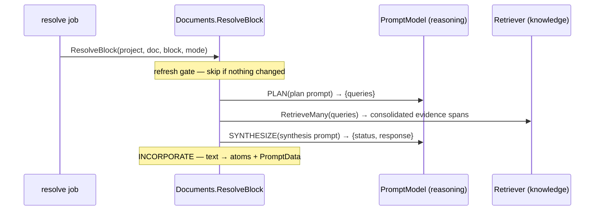

# Prompt resolution flow

Resolving a [prompt block](../capabilities/documents/prompt-blocks.md) turns an
authored instruction into grounded, generated text. This document is the
**operational reference for that flow, including the full prompts** the model is
given — because getting those prompts right is what makes the difference between
a faithful answer, a false contradiction, and a fabrication.

The prompts are **configurable**: each is a Go `text/template` with placeholders,
and any of them can be overridden under `documents.prompt` in
[configuration](../configuration.md) without a code change. The defaults shown
here are the built-in templates in
[`prompt.go`](../../../core/capability/document/prompt.go); a blank override falls
back to them.

## The flow



Two structured (JSON-schema-constrained) model calls bracket the retrieval: a
**plan** call turns the instruction into queries, and a **synthesis** call turns
the pooled evidence into the answer or a stable non-answer. Everything model- or
lattice-specific reaches the flow through the `PromptModel` and `Retriever`
ports; the prompt engineering below lives in `document`.

### Stage by stage

`Documents.ResolveBlock` runs five stages in order. Both model calls are
**structured** — the caller passes a JSON schema and receives JSON back — so the
flow parses fields, never free text.

1. **Refresh gate.** Reload always proceeds. Refresh first asks the `Retriever`
   whether the project's knowledge has `ChangedSince` the block's `ResolvedAt`;
   if nothing changed, resolution is **skipped** and the existing text stands. An
   instruction edit clears `ResolvedAt` (in the `set_prompt` op), so editing the
   prompt always forces a re-resolve. (Empty/`auto` mode is a reload the first
   time, a refresh thereafter.)
2. **Plan.** The instruction is rendered into the plan prompt and sent to
   `PromptModel.Plan` under `plan_cast`, constrained to `planSchema`. The output
   `queries` are trimmed and capped at `max_queries`.
3. **Retrieve.** All the planned queries go to the knowledge layer in **one call**
   (`RetrieveMany`), which pools them and **merges overlapping spans across the
   queries** into a single non-overlapping set: each query contributes its top-k
   windows, a span surfaced by several queries keeps its **highest relevance**, and
   adjacent or overlapping spans are consolidated into one widest region with union
   text sliced from the source. The document layer does no pooling of its own. Each
   span's retrieval relevance is recorded on the stored evidence (it ranks
   provenance — scored against the retrieval query, not the final synthesis — and
   no span is dropped for a low score).
4. **Synthesize.** The current instruction, the *previous* prompt and response
   (formatting reference only — see below), and the pooled evidence are rendered
   into the synthesis prompt and sent to `PromptModel.Synthesize` under
   `synthesis_cast`, constrained to `synthSchema`. Parsing **fails closed**: an
   unknown or missing `status` becomes `insufficient`.
5. **Incorporate.** The response text replaces the block's atoms; the block is
   marked `inferred`; and `PromptData` records `status`, the deduped `evidence`,
   the distinct `sources` (provenance), `lastInstruction`/`lastOutput` (for the
   next refresh's stability reference), `usage`, and `resolvedAt`. This is written
   as a single `resolve_block` change set authored by `system`.

Because the whole thing makes model calls, it runs off the request path as a
`document.resolve` **job**; the HTTP resolve endpoint returns `202` + a job id to
poll.

## The plan step

**Purpose:** turn the user's instruction into a small set of retrieval queries.
**Cast:** `documents.prompt.plan_cast` (reasoning). **Schema:**
`{ queries: string[] }` (strict).

**System template** — placeholder `{{.MaxQueries}}`:

```text
You plan retrieval to ground an answer to the user's prompt against a knowledge base.
Produce between 1 and {{.MaxQueries}} concise, keyword-rich search queries whose results will provide the evidence needed to answer.
Prefer distinct angles over near-duplicates. Respond only with JSON matching the schema.
```

**User template** — placeholder `{{.Instruction}}`:

```text
Prompt:
{{.Instruction}}
```

| Placeholder | Filled with |
|---|---|
| `{{.Instruction}}` | the prompt block's authored instruction |
| `{{.MaxQueries}}` | `documents.prompt.max_queries` |

**Structured output** — the call is constrained to this strict schema
(`additionalProperties: false`, every property required):

```json
{
  "type": "object",
  "properties": { "queries": { "type": "array", "items": { "type": "string" } } },
  "required": ["queries"],
  "additionalProperties": false
}
```

So the model returns JSON like:

```json
{ "queries": ["Eiffel Tower height meters", "Eiffel Tower dimensions"] }
```

`parseQueries` then trims blanks and caps the list at `max_queries`.

## The synthesis step

**Purpose:** answer the prompt from the retrieved evidence, or return a stable
non-answer. **Cast:** `documents.prompt.synthesis_cast`. **Schema:**
`{ status: "ok"|"insufficient"|"contradiction", response: string }` (strict).

This is the load-bearing prompt, and its wording is deliberate (see
[the finding](#why-the-synthesis-prompt-is-worded-this-way)).

All rules live in the **system** message; the **user** message carries only the
labelled data (current prompt, prior prompt/answer, and the raw evidence). Keeping
the instructions out of the user message is deliberate — see
[the finding](#why-the-synthesis-prompt-is-worded-this-way).

**System template:**

```text
You write the answer to CURRENT PROMPT using ONLY the EVIDENCE items. Follow every rule below.

FACTS
- Every fact in your answer must come from the EVIDENCE. Never use outside knowledge and never invent anything.

STATUS — choose exactly one, judged from the EVIDENCE ALONE (decide as if no PRIOR ANSWER were present):
- "ok": the EVIDENCE supports an answer to the prompt.
- "insufficient": the EVIDENCE does not address the prompt.
- "contradiction": two or more distinct EVIDENCE items disagree with each other on the exact point asked.
A contradiction can ONLY ever be a disagreement between EVIDENCE items. Nothing outside the EVIDENCE can create one. With only one EVIDENCE item on the point, "contradiction" is impossible — use "ok".

PRIOR ANSWER and PRIOR PROMPT (provided only for wording/format consistency):
- They are NOT evidence. Their facts are stale — ignore every fact in them.
- Treat the PRIOR ANSWER as an earlier draft: when the status is "ok", keep its wording and format and change ONLY the facts the EVIDENCE now states differently. If the PRIOR ANSWER differs from the EVIDENCE, the EVIDENCE wins — this is NOT a contradiction, the source simply changed.
- Reuse the PRIOR ANSWER's format only when CURRENT PROMPT asks for the same kind of output as PRIOR PROMPT; otherwise follow CURRENT PROMPT.
- Write your answer as if for the first time. NEVER mention the PRIOR ANSWER, never say a value "changed", "was previously", "used to be", or "now", and never compare the PRIOR ANSWER to the EVIDENCE in your response.

EXAMPLE of the most important rule:
- EVIDENCE: "The tower is 450 meters tall." PRIOR ANSWER: "The tower is 300 meters tall."
- Correct -> status "ok"; response states 450 meters (the EVIDENCE value), with no mention of 300 and no mention of any change.
- Wrong -> status "contradiction"; the PRIOR ANSWER is not EVIDENCE, so it can never create one.

When status is "insufficient" or "contradiction", still write a short response explaining why, referring only to the EVIDENCE. Respond only with JSON matching the schema.
```

**User template** — placeholders `{{.Instruction}}`, `{{.PreviousPrompt}}`,
`{{.PreviousResponse}}`, and `{{range .Evidence}}`:

```text
CURRENT PROMPT:
{{.Instruction}}

PRIOR PROMPT (wording/format sample only — not evidence):
{{.PreviousPrompt}}

PRIOR ANSWER (wording/format sample only — not evidence, facts may be stale):
{{.PreviousResponse}}

EVIDENCE:
{{range .Evidence}}- {{.Text}}
{{else}}(none)
{{end}}
```

| Placeholder | Filled with |
|---|---|
| `{{.Instruction}}` | the current authored instruction |
| `{{.PreviousPrompt}}` | `PromptData.LastInstruction` — the instruction that produced the previous response (`(none)` if never resolved) |
| `{{.PreviousResponse}}` | `PromptData.LastOutput` — the model's previous answer (`(none)` if never resolved) |

The carryover is scoped: `set_block_context` clears `LastInstruction` and
`LastOutput` along with `ResolvedAt`, because a prior answer synthesized under a
different retrieval scope is not a valid formatting draft for the new one —
feeding it leaks old-scope content into the new resolution. A `set_prompt` keeps
the carryover (same scope, new question), which is what the PRIOR PROMPT /
CURRENT PROMPT comparison exists for.
| `{{range .Evidence}}` | the pooled evidence spans, one raw-text bullet each (no ids — provenance is tracked on the block, not asked of the model) |

**Structured output** — the call is constrained to this strict schema, with
`status` a fixed enum:

```json
{
  "type": "object",
  "properties": {
    "status": { "type": "string", "enum": ["ok", "insufficient", "contradiction"] },
    "response": { "type": "string" }
  },
  "required": ["status", "response"],
  "additionalProperties": false
}
```

So the model returns JSON like:

```json
{ "status": "ok", "response": "The Eiffel Tower is 450 meters tall." }
```

`parseSynthesis` reads those two fields and **fails closed** — an unknown or
missing `status` becomes `insufficient`, so an ungrounded answer is never shown as
`ok`. Only `response` becomes the block's visible text; `status` drives how the
block is presented.

### The three outcomes

Synthesis returns exactly one status, and the parser **fails closed** — an
unknown or missing status becomes `insufficient`, so an ungrounded answer is
never presented as `ok`:

- **`ok`** — the evidence supports a clear answer.
- **`insufficient`** — the evidence does not address the prompt; the block says
  so instead of guessing.
- **`contradiction`** — two or more *evidence items* disagree; the block reports
  the conflict rather than picking one.

### Why the synthesis prompt is worded this way

The prior answer is fed in for **wording/formatting stability**, but that created
a trap. A live test changed a source ("300 meters" → "450 meters") and refreshed
the block; a small model (gpt-4o-mini) treated the *prior answer* (300) as a
competing fact and returned a false `contradiction` between it and the new
evidence (450), instead of the updated answer. Measured with a repeated
change-and-refresh loop, this misfired on **roughly half** of refreshes.

The wording above is what closes it, in three moves:

1. **Contradiction is evidence-vs-evidence only.** Status is judged *from the
   EVIDENCE alone, as if no prior answer were present* — and with a single
   evidence item on the point, `contradiction` is stated to be impossible.
2. **The prior answer is a draft to edit, not a source to compare.** On an `ok`
   result the model keeps its wording and changes only the facts the evidence now
   states differently; it must never mention the prior answer, say a value
   "changed", or compare the two in its output. (That narration — "the previous
   response said 300" — was the visible tell of the bug.)
3. **A worked example** of exactly this case (evidence 450 vs prior answer 300 →
   `ok`, not `contradiction`) — concrete examples land where abstract rules slip
   on a weak model.

Moving every rule into the **system** message (the user message is now just
labelled data) was part of the same fix. With this wording, a repeated
change-and-refresh loop propagated the change **16 out of 16 times with no false
contradiction** on gpt-4o-mini, while a genuine evidence-vs-evidence conflict
(450 vs 900) still correctly yields `contradiction` and an unaddressed prompt
still yields `insufficient` — all in [`dev-test/prompt`](../../../dev-test/prompt/run.sh),
which repeats the trap several times per run precisely because it is intermittent.
Production synthesis runs on a stronger model than this cheap test stand-in, so it
is at least as reliable.

## Configuring the prompts

Everything above is overridable under `documents.prompt` in
[`etc/config.yaml`](../../../etc/config.yaml):

```yaml
documents:
  prompt:
    plan_cast:      { purpose: general, strength: high, speed: medium, cost: medium }
    synthesis_cast: { purpose: general, strength: high, speed: medium, cost: medium }
    retrieval_top_k: 5
    max_queries: 4
    plan:      { system: "...", user: "..." }   # override; blank = the default above
    synthesis: { system: "...", user: "..." }
```

A blank field uses the built-in default; a template that fails to parse falls
back to the default too, so a bad override degrades safely rather than breaking
resolution. The casts (`plan_cast`, `synthesis_cast`) choose *which model* runs
each step, resolved through the reasoning cast table — see
[intelligence](../capabilities/intelligence.md).

## See also

- [Prompt blocks](../capabilities/documents/prompt-blocks.md) — the capability
  (block model, ports, refresh gate, evidence).
- [Configuration](../configuration.md) — the `documents.prompt` settings.
- Record [0011](../../records/0011-prompt-block.md) — the design and its
  increments.
