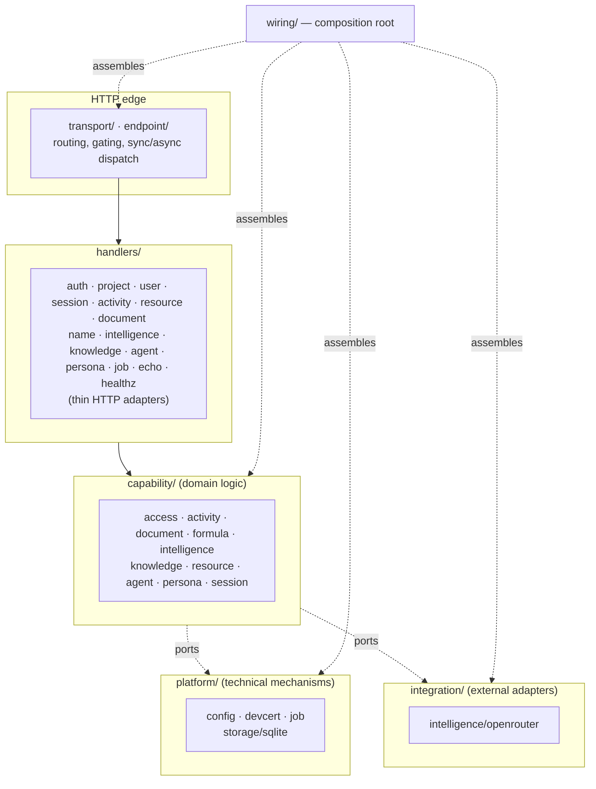
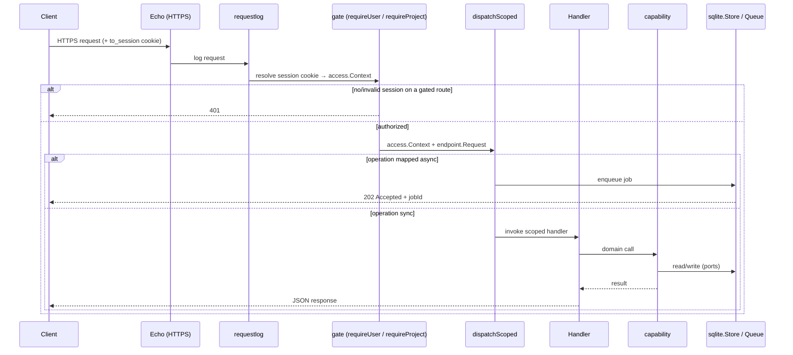

# Architecture overview

Taurus Omega is a Go backend **core**: an HTTPS API server for a knowledge-aware
workspace. This document is the map of how the running code is put together —
its layers, the rule that governs how they depend on each other, and the path a
request takes from the socket to a capability and back. It is grounded in the
code as it exists today; the deeper per-topic documents are linked throughout.

The whole server is one process. `main` is a thin shell over
[`wiring.Run`](../../core/wiring/wiring.go), which loads configuration, opens one
durable store, constructs the running services, and starts an HTTPS listener.
There is no microservice split, no message bus, and no external database —
storage is an embedded, pure-Go SQLite file.

## Layers

The `core/` tree is grouped by role. Each group has one job, and the groups form
a dependency stack: an outer layer may depend on the layer beneath it, never the
other way around.

- **`transport/` + `endpoint/`** — the HTTP boundary. `transport` owns the Echo
  router, the authentication/authorization gates, and the map that decides
  whether an operation runs synchronously or is deferred to a background job.
  `endpoint` defines a transport-agnostic `Request`/`Response` contract so
  handlers never touch Echo directly. See [transport](transport.md).
- **`handlers/`** — thin packages for HTTP-exposed capabilities and platform
  operations. A handler binds a route to a capability call: it reads the
  request, invokes the domain, and shapes the response. It holds no business
  logic. Formula's pure evaluator has no direct handler, but its `names` state
  layer is exposed through `handlers/name`.
- **`capability/`** — the domain. Ten top-level capability packages:
  [access](capabilities/access.md) (identity, the login session, projects,
  roles), [activity](capabilities/activity/README.md) (immutable semantic events),
  [document](capabilities/documents/README.md) (the editable content model),
  [formula](capabilities/formula/README.md) (a deterministic parser/evaluator
  over exact typed values plus the persisted `names` namespace),
  [intelligence](capabilities/intelligence.md) (the model-provider boundary),
  [knowledge](capabilities/knowledge/README.md) (the retrieval lattice),
  [resource](capabilities/resources/README.md) (the unified owner-routed
  catalog), [agent](capabilities/agents/README.md) (Quarterback plan/action
  tasks and the ask path), [persona](capabilities/persona.md) (versioned
  behavior profiles), and [session](capabilities/session.md) (ephemeral project
  presence).
  Capabilities **do not import one another** and depend on the outside world
  only through narrow **ports** (interfaces). Composition adapters in `wiring`
  connect cross-capability needs without reversing that dependency rule.
- **`platform/`** — cross-cutting technical mechanisms with no product policy:
  [`config`](configuration.md) (loading the manifest), `devcert` (self-signed
  TLS in dev), [`job`](persistence.md) (the durable queue + worker pool), and
  [`storage/sqlite`](persistence.md) (the one durable store).
- **`integration/`** — concrete adapters to external systems. Today only
  `intelligence/openrouter`, which implements the intelligence provider port
  against OpenRouter's API.
- **`wiring/`** — the composition root. The only package that knows every
  concrete type: it reads config, constructs the SQLite store, the wired
  capabilities, the provider adapters, and the transport, and owns process
  lifecycle (startup, signal handling, graceful shutdown). It also adapts
  Intelligence to Knowledge/Document ports, Documents to the Resource family
  contract, and constructs Formula's name manager over SQLite.

## The dependency rule

Ports and adapters is the organizing principle. A capability declares an
interface for what it needs — a `Store` to persist to, an `Embedder` to turn
text into vectors — and never names a concrete implementation. `wiring` supplies
the concrete type at startup.

Two consequences worth internalizing:

- **Capabilities are testable in isolation.** Capabilities with persistence
  ports ship an in-memory implementation of their store (`memory.go`) for unit
  tests; the pure Formula evaluator needs no test double, while its `names`
  package has an in-memory store. Domain logic is therefore exercised without a
  database or a network.
- **The domain never depends on infrastructure or on other domains.** The
  `knowledge` capability, for example, imports neither `intelligence` nor
  `sqlite`; it consumes an `Embedder` port that `wiring` satisfies with an
  adapter over the intelligence service, and a `Store` port that `wiring`
  satisfies with SQLite. This is what keeps the layers from tangling as the
  system grows.

One durable [`sqlite.Store`](../../core/platform/storage/sqlite/sqlite.go)
implements *every* persistence port — Access (including share links), Activity,
Documents, Formula names, jobs, Knowledge, personas, project presence, and agent
tasks — so a single file backs the whole system and every durable resource
survives a restart. Resource itself duplicates no storage; it routes to canonical
family owners.

## The path of a request

Every route is assembled in [`transport.New`](../../core/transport/transport.go).
A request flows through middleware, an access gate, a route group, and a
dispatcher that decides sync vs. async:

- **Access tiers.** Routes are grouped as *public* (no session), *gated* (any
  signed-in user), or *project-scoped* (a project must be selected in the
  session). The gate resolves the `to_session` cookie into an
  [`access.Context`](../../core/capability/access/access.go) carrying the user,
  selected project, and role. Details in [transport](transport.md) and
  [access](capabilities/access.md).
- **Sync vs. async.** A hardcoded operation→synctype map classifies each
  project-scoped operation. Synchronous operations run their handler inline;
  asynchronous ones (document re-base and prompt-block resolve) enqueue durable
  jobs and return `202` with a job id to poll. Agent Plan/Action tasks are
  job-backed too, but return `201` and are polled through `GET /agent/tasks/:id`.
  The queue and worker pool live in [`platform/job`](persistence.md).
- **The `/dev` convention.** Endpoints that aren't part of the eventual
  production client surface — maintenance and lattice tooling normally driven by
  internal flows — live under a `/dev` path prefix, so the surface makes the
  distinction obvious.

## Documentation practices you'll see in the tree

Two kinds of documentation travel with the code (see [`AGENTS.md`](../../AGENTS.md)):

- **Paired companion docs.** Every non-test `*.go` file under `core/` has a
  sibling `FILE.go.md` that reproduces the source *verbatim*, block by block,
  with prose. Those are the line-by-line reference; the documents under
  `docs/architecture/` (this set) are the conceptual layer above them.
- **Change records.** [`docs/records/`](../records/) is a numbered log of what
  changed and why — the reasoning behind each increment. The knowledge lattice,
  in particular, was built and then corrected over records 0008–0010, which the
  knowledge docs reference for rationale.

`docs/reference/` is a separate, older body of **aspirational** design material —
it describes the product being worked toward, not necessarily what exists today.
Where it conflicts with the code, the code (and this `docs/architecture/` set)
wins.

## Where to go next

- **[Configuration](configuration.md)** — how the manifest is loaded and every
  setting that shapes the running server.
- **[Transport](transport.md)** — the HTTP layer, gating, and sync/async dispatch.
- **[Persistence & jobs](persistence.md)** — the SQLite store, its schema, and the
  background-jobs system.
- **Capabilities** — [access](capabilities/access.md),
  [activity](capabilities/activity/README.md),
  [documents](capabilities/documents/README.md),
  [formula](capabilities/formula/README.md),
  [intelligence](capabilities/intelligence.md), the
  [knowledge lattice](capabilities/knowledge/README.md),
  [resources](capabilities/resources/README.md),
  [agents](capabilities/agents/README.md),
  [personas](capabilities/persona.md), and
  [sessions](capabilities/session.md).
- **[Backend guide](../backend-guide.md)** — the practical "run it and call it"
  companion for a front-end/harness.
