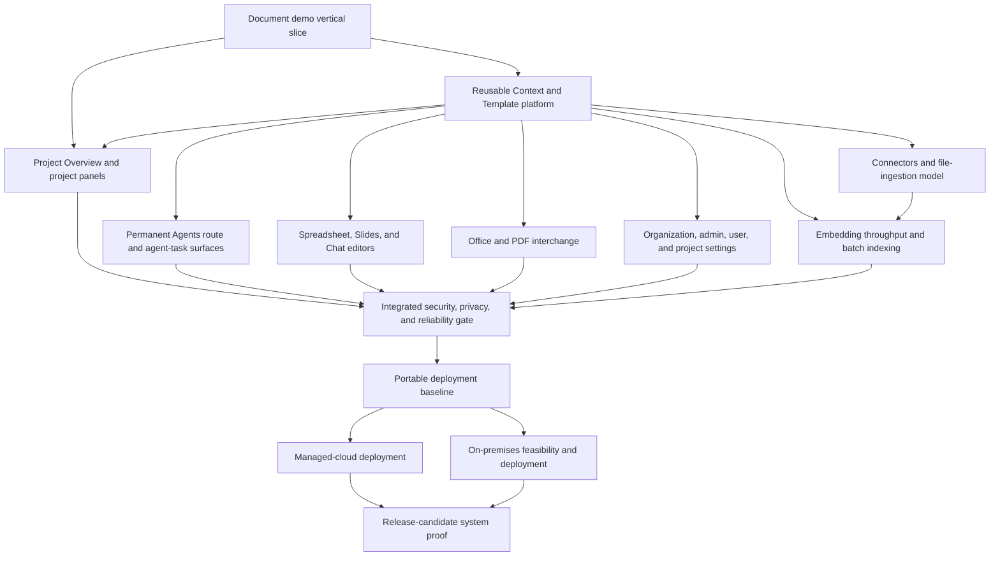

# Workstreams - Taurus Product Completion

> Source mirror. Preserve this page as planning evidence; use the agent-facing execution packet when one exists.

<callout icon="🧭" color="blue_bg">
	**Living Taurus product-completion workstream register.** This is a codebase-wide map of outcomes, dependencies, and proof—not a dated roadmap or a flat feature backlog. Taurus Yesod defines the intended product, Taurus Alpha implements the frontend, Taurus Omega implements the backend, and each workstream closes only with integrated proof across the relevant layers.
</callout>
# Workstream purpose
This register captures the major bodies of work implied by the current state of Taurus Alpha and Taurus Omega. Its near-term purpose is to make the complete Document experience demonstrable while removing immediate platform constraints such as brittle bulk embedding. Its broader purpose is to carry Taurus to a secure, interoperable, administrable, connector-enabled, deployable product across Project Overview, Agents, Documents, Spreadsheets, Slides, and Chat.
Workstream IDs are stable references, not dates or strict execution order. Work may overlap when contracts are stable. Dependencies show what must be true before an outcome can be claimed complete; they do not prevent early research, prototyping, or infrastructure work.
# Product-completion outcomes
- [ ] A polished Document demo works end to end across Alpha and Omega with real persistence, context, templates, provenance, editing, and recovery.
- [ ] Context is a first-class, scoped capability that users and organizations can inspect, share, govern, and reuse.
- [ ] Templates are a first-class, previewable, versioned capability available from New Tab and inside every supported editor.
- [ ] Spreadsheet, Slides, and Chat editors are complete enough for representative real work, not merely model demonstrations.
- [ ] Project Overview is a complete permanent project surface with a useful work area, project-specific Context lenses, and selection-driven Inspector states.
- [ ] Agents is a first-class permanent project route with durable inbox, Agent, Persona, Task/Run, approval, evidence, and recovery behavior.
- [ ] Office formats and PDF have explicit, tested import/export behavior and fidelity standards.
- [ ] Account, user, project, organization, and administrative settings are complete and authority-correct.
- [ ] Google Drive and Microsoft connectors work, with additional connectors prioritized from customer need and a clear upload-versus-connection model.
- [ ] Bulk ingestion and re-indexing use adaptive embedding batching so large corpora do not become brittle under provider rate limits or unnecessarily expensive synchronous traffic.
- [ ] The integrated Alpha/Omega system clears security, privacy, isolation, recovery, and data-lifecycle review.
- [ ] Taurus can be deployed repeatedly through a managed-cloud path and has a separately proven or explicitly bounded on-premises path.
- [ ] A release candidate can run the canonical demonstrations, onboard a bounded customer corpus, fail recoverably, and be operated without undocumented manual intervention.
# Dependency map

Project Overview and Agents may be developed alongside the Document slice once their shared shell and capability contracts are stable. Embedding reliability, security architecture, and deployment experiments likewise begin before formal completion dependencies. Arrows indicate what an outcome relies on, not a schedule.
# Workstream map
<table header-row="true">
<tr>
<td>ID</td>
<td>Workstream</td>
<td>Primary outcome</td>
<td>Key dependency</td>
</tr>
<tr>
<td>1</td>
<td>Document demo completion</td>
<td>One fully integrated, polished Document workflow demonstrates Taurus coherently.</td>
<td>Current Document runtime and editor foundation</td>
</tr>
<tr>
<td>2</td>
<td>Context and Template platform</td>
<td>Document-shaped work becomes reusable, scoped product capabilities.</td>
<td>Decisions proven in the Document slice</td>
</tr>
<tr>
<td>3</td>
<td>Remaining resource editors</td>
<td>Spreadsheet, Slides, and Chat reach end-to-end editor completeness.</td>
<td>Shared shell, Context, Templates, runtime contracts</td>
</tr>
<tr>
<td>4</td>
<td>Office and PDF interchange</td>
<td>Customers can enter and leave Taurus with known fidelity.</td>
<td>Stable resource models and translation boundaries</td>
</tr>
<tr>
<td>5</td>
<td>Organization and settings surfaces</td>
<td>Users and administrators can safely manage product scope and policy.</td>
<td>Identity, project, organization, and access contracts</td>
</tr>
<tr>
<td>6</td>
<td>Connectors and ingestion</td>
<td>Customer content can be uploaded or connected with clear authority and lifecycle.</td>
<td>Context scope, access, file, and indexing contracts</td>
</tr>
<tr>
<td>7</td>
<td>Embedding throughput, batching, and index publication</td>
<td>Large uploads and re-indexes complete economically and recoverably without overwhelming synchronous rate limits.</td>
<td>Context indexing and file/connector ingestion contracts</td>
</tr>
<tr>
<td>8</td>
<td>Security, privacy, and reliability gate</td>
<td>No known critical trust gap remains in the integrated product.</td>
<td>Representative completion of all data-bearing surfaces</td>
</tr>
<tr>
<td>9</td>
<td>Deployment engineering</td>
<td>Taurus deploys repeatably through managed and portable paths.</td>
<td>Trust gate plus resolved portability decisions</td>
</tr>
<tr>
<td>10</td>
<td>Release-candidate proof</td>
<td>The complete product can be demonstrated, onboarded, operated, recovered, and supported.</td>
<td>Required product workstreams plus trust and deployment gates</td>
</tr>
<tr>
<td>11</td>
<td>Project Overview and project-level panels</td>
<td>The permanent project landing surface supports orientation, navigation, project context, and selection-driven inspection.</td>
<td>Project shell plus Context, identity, resource, activity, and access contracts</td>
</tr>
<tr>
<td>12</td>
<td>Agents route and agent-task experience</td>
<td>Users can orient, supervise, approve, inspect, and recover agent work from one durable project route.</td>
<td>Agent, Persona, Project Agent, Task/Run, grants, approval, evidence, and routing contracts</td>
</tr>
</table>
# Workstream 1 — Complete the Document demo vertical slice
## Outcome
A viewer can use one polished Document workflow and understand the full Taurus thesis: project context is governed and reusable; templates preserve methods; direct and AI-assisted edits share one durable model; provenance and history are inspectable; and the frontend/backend behave as one product.
## 1.1 Context-management screen
- [ ] Create a dedicated Context screen for users and organization administrators.
- [ ] Distinguish personal/user, project, and organization scopes.
- [ ] Show what context exists, who can use it, where it came from, how fresh it is, how it is indexed, and which resources or workflows use it.
- [ ] Allow authorized sharing, unsharing, scope movement/copy, refresh, replacement, export, retention, and removal with consequence previews.
- [ ] Make inherited organizational/project context distinguishable from user-added context.
- [ ] Preserve source authority, permissions, trust labels, provenance, connector origin, and captured revision.
- [ ] Expose failures such as inaccessible source, revoked connector, stale index, failed parsing, or unsupported content without pretending the context is healthy.
- [ ] Ensure the Document editor can choose and inspect relevant context without duplicating Context-screen administration.
### Required product decisions
- The exact inheritance order among organization, project, user-project, and user-private context.
- Whether moving context changes authority or creates a new scoped copy/reference.
- Which scope may delete, retain, export, or override context.
- What is canonical content versus a provider-backed snapshot, parsed derivative, or knowledge index.
- How personal/private context is prevented from leaking into shared outputs, search, or agent tasks.
## 1.2 Template capability and Template screen
- [ ] Treat Template as a capability with its own stable asset identity, immutable/versioned revisions, visibility, permissions, provenance, preview, and instantiation contract.
- [ ] Create a Template screen for search, filtering, preview, ownership, version history, sharing, publication, deprecation, and deletion/retirement.
- [ ] Support user, project, and organization template scopes with explicit access and inheritance behavior.
- [ ] Make templates previewable from New Tab before a resource is created.
- [ ] Allow supported editors to save current work as a template and create a new resource from a reviewed template/version.
- [ ] Allocate fresh runtime IDs during instantiation while preserving source-template/version lineage.
- [ ] Strip instance-private and operational state such as comments, tasks, history, caches, credentials, private notes, sessions, and delivery grants unless an explicit safe contract says otherwise.
- [ ] Keep Template distinct from Favorite, ordinary ResourceKind, and a live instantiated resource.
## 1.3 Document-template semantics and mocks
### Working direction
The default Document template is the **entire Document**, represented as an ordered composition of reusable sections/content rather than an opaque screenshot or flattened page. A user may later select a meaningful subset and save it as a reusable template unit.
The decision should be tested through three explicit asset scopes:
<table header-row="true">
<tr>
<td>Candidate scope</td>
<td>Meaning</td>
<td>Initial role</td>
</tr>
<tr>
<td>Document template</td>
<td>The complete resource, including ordered sections, safe styles, prompt/formula bindings, and declared inputs.</td>
<td>Default and required first implementation</td>
</tr>
<tr>
<td>Section template</td>
<td>A coherent reusable section or group of blocks with its own declared inputs.</td>
<td>Preferred selected-content extension</td>
</tr>
<tr>
<td>Fragment template</td>
<td>An arbitrary selected block/range fragment.</td>
<td>Possible later capability; do not force before selection semantics are clear</td>
</tr>
</table>
- [ ] Define what a Document section means in the model and editor without confusing it with visual pagination.
- [ ] Define what formatting, prompt blocks, formulas, references, variables, styles, and metadata are retained.
- [ ] Define parameters/requirements and the preview shown before capture or instantiation.
- [ ] Create mocks for save-as-template, template preview, template insertion, section capture, conflict review, and Template Library attribution.
- [ ] Implement Document-editor template mocks against realistic state rather than isolated decorative screens.
- [ ] Prototype full-Document and selected-section capture before finalizing arbitrary-fragment behavior.
- [ ] Ensure template names identify assets/versions, not materialized Document sections or content nodes.
## 1.4 Fix the Document editor layout
- [ ] Restore a calm, coherent shell in which the page remains primary.
- [ ] Correct top bar, Context panel, work surface, Inspector, AI Quarterback, page surround, responsive collapse, resizing, and focus behavior.
- [ ] Ensure panel changes do not alter logical page width, selection, caret, undo state, or printable content.
- [ ] Complete paged/continuous behavior, page geometry, overflow, headers/footers, zoom, and selection affordances required by the demo.
- [ ] Verify Celestial and Night preserve the same topology, geometry, motion, and disclosure.
- [ ] Remove layout workarounds that prevent the editor from behaving consistently across realistic documents and screen sizes.
## 1.5 Complete Alpha/Omega Document integration
- [ ] Inventory every frontend behavior that still uses mocks, local-only truth, incompatible IDs, incomplete endpoints, or optimistic state that cannot reconcile.
- [ ] Inventory every Omega request required by the Document editor and close or explicitly defer it.
- [ ] Align resource identity, revision, ChangeSet, operation, selection/anchor, persistence, undo/redo, generated-content, Formula, File, context, evidence, comment, task, and activity contracts.
- [ ] Ensure human and AI edits use the same accepted mutation path.
- [ ] Prove reconnect, stale change, conflict, retry, late generated result, offline/recovery, and permission behavior.
- [ ] Add contract and end-to-end tests that launch Alpha against Omega rather than testing each side only in isolation.
## Document-demo exit proof
- [ ] Create/open a Document from blank and from a template.
- [ ] Attach or select governed context and show where it came from.
- [ ] Directly edit prose and formatting.
- [ ] Run prompt/formula-backed content and inspect exact provenance/evidence.
- [ ] Change a source or prompt and observe the correct bounded update.
- [ ] Save a complete Document and a selected section as template candidates.
- [ ] Recover from a stale/conflicting change and demonstrate History/undo.
- [ ] Export the resulting work in at least the first supported customer format.
- [ ] Rehearse the full sequence from a clean environment with no manual database or mock-state intervention.
# Workstream 2 — Generalize Context and Templates as platform capabilities
## Outcome
The Context and Template implementations proven through Documents are safe, reusable services and screens that every resource editor can consume without recreating scope, visibility, preview, or lineage rules.
- [ ] Publish capability-owned models, APIs, authorization actions, persistence, change/version semantics, search projections, and audit/activity events.
- [ ] Define organization/project/user scope and inheritance once.
- [ ] Define preview, capture, publish, version, instantiate, retire, restore, and delete/export semantics.
- [ ] Provide consumer-owned adapters for Document, Spreadsheet, Slides, and Chat.
- [ ] Support New Tab discovery and preview without instantiating or executing a template.
- [ ] Require explicit review before template workflows, prompts, formulas, or connectors execute.
- [ ] Add cross-scope and cross-tenant negative tests.
- [ ] Add migration/rollback behavior that preserves published assets and existing instances.
## Exit proof
A Document, Spreadsheet, Slide/Deck, and Chat Prompt can each expose the correct reusable asset behavior through the same scoped platform while retaining resource-specific models.
# Workstream 3 — Implement the remaining resource editors
## Outcome
Spreadsheet, Slides, and Chat are complete editors connected to their Omega capabilities, shared shell, Context lenses, Inspector lenses, templates/prompts, collaboration, history, and AI behavior.
## Spreadsheet
- [ ] Implement the sparse grid, stable axes/cells/ranges, literal/Formula/Prompt cells, named ranges, spills, rules, chart/image overlays, presentation, collaboration, history, and recovery.
- [ ] Implement whole-Spreadsheet Templates and insertion into an existing Spreadsheet under a reviewed collision/rebasing policy.
- [ ] Complete Spreadsheet Context and Inspector lenses.
- [ ] Prove large-grid virtualization, stable-ID selection, derived-result staleness, and bounded/durable bulk work.
## Slides
- [ ] Implement Deck, named sections, unnamed stable-ID Slides, VisualObjects, notes, text, tables, charts, images, equations, embeds, groups, templates, collaboration, history, and recovery.
- [ ] Implement named slide templates and named deck templates without turning template names into Slide names.
- [ ] Complete Slides Context and Inspector lenses.
- [ ] Prove reordering, section rehoming, fresh-ID template materialization, generated-content staleness, and export rendering.
## Chat
- [ ] Implement turn-tree topology, Ask/Plan/Action modes, Prompt/Response RichContent, context/attachments, citations/evidence, persona snapshots, task linkage, streaming, retries, history, and recovery.
- [ ] Implement reusable Prompt assets through the Template/Prompt Library boundary.
- [ ] Complete Chat Context and Inspector lenses.
- [ ] Prove branch selection, immutable historical snapshots, stale token rejection, cancellation, and Agent side-effect boundaries.
## Shared exit proof
- [ ] Each editor can create, edit, save, reopen, collaborate, recover, search, inspect context/provenance, use reusable assets, and export representative work.
- [ ] Alpha and Omega contract tests pass for every supported operation.
- [ ] No editor depends on local-only canonical state or a generic untyped property patch.
- [ ] The New Tab screen can preview and create every supported resource/template kind.
# Workstream 4 — Office and PDF import/export
## Outcome
Taurus interchange behavior is explicit, tested, and honest enough for customer adoption. Import fidelity and export fidelity are measured separately.
- [ ] Define Office targets: DOCX for Documents, XLSX for Spreadsheets, and PPTX for Slides.
- [ ] Define PDF export for printable resources and PDF import behavior.
- [ ] Separate **reference ingestion** from **editable conversion**:
	- reference ingestion makes the source available to Context/search/AI without promising editable fidelity;
	- editable conversion creates a Taurus resource and reports unsupported or degraded features.
- [ ] Define fidelity tiers and a loss report for structure, styling, formulas, charts, media, notes, comments, links, accessibility metadata, and unsupported content.
- [ ] Build representative and adversarial fixture corpora for each format.
- [ ] Test Taurus → Office/PDF export, Office → Taurus import, and selected round trips where meaningful.
- [ ] Preserve original files, source hashes, conversion versions, provenance, and deterministic retry.
- [ ] Route oversized or expensive conversions through durable, idempotent jobs.
- [ ] Ensure converted content enters canonical resource ChangeSets rather than bypassing validation.
## Exit proof
Representative customer documents, spreadsheets, and decks export usefully; imports either become credible editable resources or clearly remain reference sources with a complete conversion report.
# Workstream 5 — Organization, administration, user, and project settings
## Outcome
Every visible setting is owned by the correct domain, scoped correctly, authorized, auditable, and understandable to the user.
- [ ] Create/review the organization administration screen.
- [ ] Complete organization profile, members, roles, policies, project defaults, providers, connectors, security, retention, export, audit, and danger actions.
- [ ] Complete account/user profile, sign-in methods, sessions/devices, connected accounts, appearance/accessibility, notifications, and AI/privacy preferences.
- [ ] Complete project name/ownership, membership/sharing, context defaults, templates, connectors, Project Agent, AI/Memory policy, export/retention, and danger actions.
- [ ] Keep organization, project, user, and user-project scopes distinct.
- [ ] Show inherited/locked values, authority requirements, expected versions, consequence previews, and step-up authentication where required.
- [ ] Keep provider and connector secrets write-only and represented by safe SecretRefs.
- [ ] Add two-tenant, colliding-ID, stale-control, role/permission, session-revocation, secret-leakage, and audit tests.
## Exit proof
An ordinary user can manage personal settings; a project owner can manage a project; and an organization administrator can manage organization policy without hidden backend intervention or authority confusion.
# Workstream 6 — Connectors and the file-ingestion model
## Outcome
Users can deliberately upload, connect, snapshot, import, refresh, revoke, and remove content with a clear understanding of who owns the bytes and what Taurus retains.
## Initial connector set
1. Google Drive.
2. Microsoft SharePoint and OneDrive through a coherent Microsoft connector family.
3. Dropbox as a candidate follow-on connector, prioritized by customer need rather than assumed necessity.
4. Additional enterprise sources only after the connector contract is proven.
## Working ingestion model
Support both options:
- **Upload:** Taurus receives and manages a copy under Taurus File lifecycle, retention, export, and deletion rules.
- **Connection:** the provider remains source authority; Taurus stores scoped grants, stable references, permitted metadata, and clearly governed snapshots/derived indexes.
- **Import as editable resource:** an explicit conversion action creates a Taurus resource from an upload or connection and retains provenance to the source/version.
A provider connection must not be described as an upload, and an indexed snapshot must not be described as the live provider file.
## Required work
- [ ] Define connector account, grant, scope, resource reference, sync cursor, snapshot, error, revocation, and deletion models.
- [ ] Define OAuth/enterprise authorization, least-privilege scopes, token encryption/rotation, write-only secret handling, and administrator controls.
- [ ] Let users choose upload, connection, or editable import when the source and policy permit.
- [ ] Show source authority, last sync, freshness, permissions, indexing state, downstream use, and retained Taurus copies.
- [ ] Handle rename/move/delete, permission loss, provider outage, rate limits, partial sync, duplication, and reconnect.
- [ ] Ensure revocation stops future access and clearly explains retained user-authorized snapshots/indexes.
- [ ] Add connector-level export/delete/retention and audit behavior.
- [ ] Test cross-tenant isolation, token leakage, over-broad grants, stale permissions, webhook spoofing, and provider ID collision.
## Exit proof
A clean account can connect Google and Microsoft sources, select bounded content, use it as governed Context, revoke access, and verify exactly what Taurus can still retain or use.
# Workstream 7 — Embedding throughput, batching, and index publication
## Outcome
Mass upload, connector sync, and re-indexing no longer depend on an unbounded sequence of synchronous embedding calls. Taurus preprocesses a corpus quickly, chooses the appropriate execution route, survives provider throttling and partial failure, and publishes only a coherent index generation.
## Routing policy
“Batch” is two related mechanisms, not one:
<table header-row="true">
<tr>
<td>Route</td>
<td>Use when</td>
<td>Execution contract</td>
</tr>
<tr>
<td>Inline/synchronous</td>
<td>A small interactive operation must finish immediately.</td>
<td>One bounded request or a small number of requests.</td>
</tr>
<tr>
<td>Synchronous micro-batch</td>
<td>The provider accepts multiple embedding inputs per normal request and the work fits the interactive rate/cost budget.</td>
<td>Group multiple chunks per request, cap tokens/items, use bounded concurrency, and honor backoff/Retry-After.</td>
</tr>
<tr>
<td>Asynchronous provider batch</td>
<td>A large or non-interactive corpus exceeds the configured chunk/token/rate-budget threshold and the selected provider/model supports batch embeddings.</td>
<td>Submit a durable manifest, poll/reconcile results, retry failed items only, and accept delayed completion.</td>
</tr>
<tr>
<td>Durable throttled fallback</td>
<td>Provider batch is unavailable or policy forbids it.</td>
<td>Run bounded synchronous micro-batches from a resumable queue rather than flooding the provider.</td>
</tr>
</table>
The route threshold must be calculated **after** extraction/chunking from normalized chunk count, estimated tokens, provider/model capabilities, current rate budget/queue pressure, and user urgency. Raw file bytes alone are not a reliable threshold. Thresholds are configuration and telemetry inputs, not constants hidden in an upload handler.
```typescript
interface EmbeddingPlan {
  tenantId: ID;
  projectId: ID;
  sourceRevision: RevisionID;
  model: string;
  chunkerVersion: string;
  chunkCount: number;
  estimatedTokens: number;
  urgency: "interactive" | "background";
}

type EmbeddingRoute =
  | "inline"
  | "sync_micro_batch"
  | "provider_batch"
  | "durable_throttled";

function chooseEmbeddingRoute(
  plan: EmbeddingPlan,
  capabilities: ProviderCapabilities,
  budget: RateBudget,
  policy: EmbeddingPolicy,
): EmbeddingRoute;
```
## Preprocess and plan locally
- [ ] Extract, normalize, split, and validate all eligible text before provider submission.
- [ ] Give every chunk a deterministic ID derived from tenant/project scope, source revision, chunker version, and content hash.
- [ ] Deduplicate identical chunks and skip embeddings already present for the same normalized content, model, dimensions, and embedding-contract version.
- [ ] Estimate tokens and partition work beneath both per-request and per-provider-batch limits.
- [ ] Reject or quarantine malformed, empty, unsupported, or policy-disallowed content before it enters a provider job.
## Durable orchestration contract
- [ ] Create an `EmbeddingJob` and one or more `EmbeddingBatch` manifests containing scope, source revision, provider/model, route, chunker/contract versions, expected item/token counts, deterministic item IDs, state, attempts, timestamps, and cost attribution.
- [ ] Make submission idempotent so retries cannot create duplicate paid work or duplicate vectors.
- [ ] Represent provider capabilities explicitly: single-input, multi-input synchronous, asynchronous batch, maximum items/tokens/file size, cancellation, expiry, result format, and pricing class.
- [ ] Implement queued, prepared, submitted, running, reconciling, ready, partial, failed, cancelled, and expired states without inventing a precise ETA the provider does not guarantee.
- [ ] Preserve provider job/file references as safe operational metadata; never expose credentials, cross-tenant identifiers, or protected text in logs.
- [ ] Honor rate-limit responses and provider guidance for synchronous fallback with bounded concurrency, jittered backoff, retry budgets, and dead-letter/manual-retry paths.
## Reconciliation and index publication
- [ ] Map every result or error back through a unique deterministic item ID; never depend on response ordering.
- [ ] Validate result count, vector dimensions, model/contract version, tenant/project ownership, and source revision before persistence.
- [ ] Retry only retryable failed/missing items; surface permanent per-item failures with counts and reasons.
- [ ] Treat a changed/deleted source revision while a job is running as stale work: retain auditable job state but do not publish it as current.
- [ ] Write results to a candidate index generation and atomically publish according to explicit completeness policy. Keep the last-good generation readable until replacement succeeds.
- [ ] Define whether a partially complete generation may ever publish; default to **no** for ordinary resource/context replacement unless a reviewed product contract says otherwise.
- [ ] Make cancellation, expiry, restart, crash recovery, and provider-result re-download idempotent.
## Product and operational visibility
- [ ] Show uploaded/extracted/chunked/submitted/embedded/failed/indexed counts and an honest current state in Context and ingestion surfaces.
- [ ] Expose safe retry/cancel actions and actionable failures without requiring database intervention.
- [ ] Track tokens, chunks, requests, batches, latency, retries, rate-limit responses, duplicate skips, cost, and index-publication outcomes by provider/model and tenant-safe aggregation.
- [ ] Alert on stuck jobs, repeated throttling, rising failure/cost rates, reconciliation mismatches, and candidate generations that never publish.
## Required tests
- [ ] Large upload and mass connector-sync corpora.
- [ ] Threshold boundaries and provider/model capability fallback.
- [ ] Duplicate chunks and repeated idempotency keys.
- [ ] Rate limiting, timeouts, provider outage, malformed result files, and partial per-item failure.
- [ ] Cancellation, expiry, process crash/restart, and retry after submission uncertainty.
- [ ] Source revision changes/deletion while a job is running.
- [ ] Wrong model/dimensions, provider response reordering, colliding external IDs, and cross-tenant access attempts.
- [ ] Atomic publish, last-good-index continuity, and recovery from a failed candidate generation.
## Provider economics and limits
For OpenAI specifically, the asynchronous Batch API supports `/v1/embeddings`, offers a 50% discount relative to synchronous APIs, uses a separate higher rate-limit pool, and completes within a 24-hour window. This makes it appropriate for large non-interactive corpus indexing, but those terms are provider-specific and must be capability-checked rather than assumed for every embedding backend. See the [OpenAI Batch guide](https://developers.openai.com/api/docs/guides/batch) and [Batch API FAQ](https://help.openai.com/en/articles/9197833-batch-api-faq).
## Exit proof
A corpus large enough to reproduce the current rate-limit problem can be extracted, deduplicated, routed, embedded, reconciled, and atomically published from a clean environment. Forced throttling, partial failure, cancellation, restart, and a stale source revision recover without duplicate paid work, cross-tenant leakage, or loss of the last-good index.
# Workstream 8 — Integrated security, privacy, and reliability gate
## Outcome
The entire Alpha/Omega product has no known critical or high-severity data-handling defect, tenant-isolation failure, authorization bypass, secret exposure, unrecoverable durability gap, or undocumented external data flow.
This is a formal review and evidence gate, not a promise that defects are metaphysically impossible.
## Review domains
- Authentication, sessions, CSRF, device/session revocation, and step-up assurance.
- Authorization at organization, project, user, resource, child-entity, connector, template, context, task, and administrative boundaries.
- Agent identity and attribution, immutable Persona versions, tool/context grants, Project Agent assignment, task scope, approval requirements, revocation, and side-effect authorization.
- Tenant isolation with colliding IDs and adversarial scope inputs.
- Encryption in transit and at rest; key/secret lifecycle and rotation.
- Connector OAuth tokens, provider secrets, webhooks, sync jobs, snapshots, and revocation.
- Embedding manifests, provider batch files, chunk text, vector indexes, retries, stale-job rejection, atomic index publication, retention, and cross-tenant isolation.
- Upload/file parsing, malware/content handling, archive bombs, unsafe embeds, and conversion sandboxes.
- Prompt injection, untrusted sources, tool authorization, approval boundaries, and model-provider data egress.
- Logs, traces, metrics, analytics, crash reports, exports, caches, temp files, and backups for protected-data leakage.
- Retention, deletion, export, legal hold if applicable, account closure, and organization offboarding.
- ChangeSet integrity, stale-result rejection, idempotency, race safety, transaction boundaries, and recovery.
- Backup schedules, restore drills, point-in-time/revision recovery, and disaster procedures.
- Dependency/supply-chain review, vulnerability management, secure defaults, and deployment hardening.
- Privacy notice/data terms, provider no-training/retention posture, incident ownership, escalation, and customer-facing responsibility boundaries.
## Required evidence
- [ ] Current data-flow and trust-boundary diagrams.
- [ ] Threat model and abuse cases for every external/data-bearing boundary.
- [ ] Automated unit, contract, integration, race, fuzz/property, security, and end-to-end suites.
- [ ] Manual penetration-style review of highest-risk paths.
- [ ] Secret/protected-data scans over code, logs, artifacts, and representative runtime output.
- [ ] Backup creation plus tested restore into a clean environment.
- [ ] Data export and deletion tests across direct data, derived indexes, snapshots, backups, and provider references.
- [ ] Written residual-risk register with severity, owner, mitigation, and deployment blocker status.
## Exit rule
No critical/high issue remains open without a deliberate, documented deployment-blocking or risk-acceptance decision. Customer data is not used for a production trial until the applicable trust gate is closed.
# Workstream 9 — Deployment engineering
## Outcome
Taurus has one portable, repeatable operational baseline and two explicit deployment tracks: Taurus-operated managed cloud and customer/on-premises deployment.
## 9.1 Common portable baseline
- [ ] Define the deployable artifact/package, configuration model, service topology, network boundaries, storage, migrations, secrets, health checks, observability, backups, restore, upgrade, rollback, and support diagnostics.
- [ ] Separate environment configuration from code and avoid provider-specific assumptions inside capability logic.
- [ ] Produce reproducible local, CI, integration, staging, and production-like environments.
- [ ] Test clean install, upgrade, failed migration, rollback, restore, secret rotation, scale/restart, and disaster recovery.
- [ ] Define supported identity providers, connectors, egress requirements, object/file storage, model providers, and operational dependencies.
## 9.2 Managed-cloud track
- [ ] Compare AWS and Google Cloud using security, managed services, cost, portability, operational burden, region/data residency, and founder operability.
- [ ] Select a provider only after a small production-like deployment proves the operating model.
- [ ] Implement infrastructure as code, network/identity boundaries, managed secrets/keys, databases/storage, CI/CD promotion, staging, monitoring/alerting, backups, restore, scaling, and cost visibility.
- [ ] Deploy repeatedly from a clean environment and rehearse rollback/restore.
- [ ] Document customer-data regions, subprocessors/providers, incident response, and operating responsibility.
## 9.3 On-premises/dedicated track
- [ ] Define whether the supported promise is true on-premises, customer-cloud/dedicated, or a later option.
- [ ] Identify minimum infrastructure, supported operating environments, installation authority, identity integration, connector egress, model-provider egress, updates, licensing, telemetry, backups, restore, logs, support bundles, and air-gapped limitations.
- [ ] Create an install/upgrade/rollback package that does not require undocumented founder access.
- [ ] Test in a clean customer-like environment distinct from the managed-cloud environment.
- [ ] Publish a support matrix and responsibility boundary before offering the deployment mode.
## 9.4 Database portability decision
MySQL is current implementation context, not a permanent doctrine. Do not migrate merely because a different database is fashionable.
- [ ] Inventory every MySQL-specific schema, transaction, locking, migration, search/index, JSON, replication, backup, and operational assumption.
- [ ] Define selection criteria: correctness, migrations, transactions/concurrency, backup/restore, managed-cloud quality, on-prem availability, operator burden, observability, licensing, scale, and portability.
- [ ] Compare staying on MySQL with viable alternatives through representative workload and recovery tests.
- [ ] Decide before production deployment packaging hardens around one store.
- [ ] If migrating, build dual-format export/migration verification, rollback boundaries, and contract tests that prove identical capability behavior.
## Exit proof
A clean managed environment can be created, upgraded, monitored, backed up, restored, rolled back, and destroyed through documented automation. The on-premises/dedicated promise is either separately proven or explicitly deferred with a portability-preserving plan.
# Workstream 10 — Release-candidate system proof
## Outcome
The integrated product is ready for a bounded real customer trial and the founder can operate it without relying on hidden state or heroic intervention.
- [ ] Run the canonical Document demo from a clean account and corpus.
- [ ] Run representative Spreadsheet, Slides, and Chat workflows.
- [ ] Open empty and active projects through Project Overview; exercise its Context lenses, select representative project entities, and verify the corresponding Inspector states and authorized actions.
- [ ] Use the permanent Agents route from inbox to Agent/Persona to live and completed Task runs, including approval, evidence, reconnect, recovery, and deep-link refresh.
- [ ] Create resources from templates and save new reusable assets.
- [ ] Upload and connect context; revoke a connection; export/delete retained data as policy allows.
- [ ] Import/export representative Office and PDF artifacts with visible fidelity reports.
- [ ] Exercise organization/user/project administration and permission boundaries.
- [ ] Complete the security/privacy evidence gate.
- [ ] Deploy into a clean production-like environment and restore from backup.
- [ ] Verify onboarding, help/error paths, support diagnostics, cost/usage visibility, and incident escalation.
- [ ] Record demos, test transcripts, architecture/runtime versions, residual risks, and known limitations.
## Exit rule
A customer can test Taurus’s product thesis rather than serving as the debugging environment for unfinished editors, missing trust controls, or manual deployment.
# Workstream 11 — Complete Project Overview and its project-level panels
## Outcome
Project Overview is the permanent orientation surface for an open project. It gives a new or returning user an immediate, calm understanding of the project, exposes the most useful next actions, and makes project-scoped context and selectable entities inspectable without pretending the screen is a resource editor.
The existing <mention-page url="https://app.notion.com/p/395b6410e50281fe8bbfee3acdb2679f"/> is a design source, not a current implementation contract. Reconcile its durable product intent with the present Yesod model and current Alpha/Omega capabilities before implementation.
## Work surface and state model
- [ ] Make Project Overview the stable landing destination when a project opens and the safe return destination when no resource editor or other permanent route is active.
- [ ] Define explicit first-visit/empty, returning/active, loading, partially available, offline, insufficient-access, archived-project, and recoverable-error states.
- [ ] Keep the central surface focused on project orientation: project identity/description, useful creation or continuation actions, resource access, and recent collaborative activity appropriate to the current product.
- [ ] Distinguish startup guidance from the returning-user view so an empty project is useful without making a mature project feel like onboarding.
- [ ] Support solo and collaborative projects without assuming that comments, members, or recent work always exist.
- [ ] Make every row/card/activity item either selectable, directly actionable, or plainly informational; avoid decorative dashboard content with no product purpose.
- [ ] Preserve stable deep links, project switching, back/forward navigation, panel state, focus, and selection across refresh and reconnect where safe.
## Context panel completion
Complete a project-specific Context lens rail rather than reusing an editor rail without adaptation. At minimum, finalize the names, icons, ordering, tooltips, visibility rules, counts/badges, and empty/loading/error states for these concerns:
- [ ] **Project information:** identity, owner, dates, description/summary, status, resource/member counts, and other safe project facts.
- [ ] **Context and knowledge:** inherited and project-owned context, sources, freshness/indexing state, provenance, downstream use, and navigation to the full Context screen for administration.
- [ ] **Members and access:** members, effective access, sharing source, invitations or pending state, and navigation to the authoritative management surface.
- [ ] **Files and connected sources:** uploaded files, provider-backed connections, snapshots, sync/index state, and clear distinctions among upload, connection, and editable import.
- [ ] **History and activity:** project-wide activity with filters, actor/action/subject/time, and navigation to the affected resource or entity.
- [ ] Specify which lenses are always present, permission-gated, feature-gated, badge-bearing, or hidden when the underlying capability is unavailable.
- [ ] Keep administrative mutations in the owning capability/screen; the panel may expose safe shortcuts but must not duplicate or contradict Context, connector, membership, or settings authority.
## Selection and Inspector completion
The Project Overview selection model and Inspector states must be defined together. At minimum, support and test:
<table header-row="true">
<tr>
<td>Selection</td>
<td>Inspector responsibility</td>
</tr>
<tr>
<td>Nothing selected / project default</td>
<td>Project summary, current status, useful counts, recent activity, and authorized project-level shortcuts.</td>
</tr>
<tr>
<td>Resource</td>
<td>Identity, kind, timestamps, owner/access, status, provenance where relevant, open/rename/duplicate/archive/delete/share actions as authorized.</td>
</tr>
<tr>
<td>Member or access grant</td>
<td>Identity, effective role, sharing source, membership state, and authorized management/navigation actions.</td>
</tr>
<tr>
<td>Uploaded file or connected source</td>
<td>Source authority, format/provider, revision/sync state, indexing state, retention, downstream use, and safe open/refresh/download/remove actions.</td>
</tr>
<tr>
<td>Context or knowledge artifact</td>
<td>Kind, scope, freshness, source revisions, provenance, dependents, health, and navigation to the authoritative Context/knowledge surface.</td>
</tr>
<tr>
<td>Activity entry</td>
<td>Actor, action, subject, time, bounded payload summary, related revision/change, and safe jump-to-subject behavior.</td>
</tr>
</table>
- [ ] Define single-click, double-click, keyboard, touch, focus, selection clearing, deleted/revoked selection, and project-switch behavior.
- [ ] Define the Inspector lens/facet shown first for each selection and the honest disabled/empty behavior of irrelevant lenses without changing rail position unpredictably.
- [ ] Ensure Inspector actions use current versions and backend-authorized permitted actions; stale or revoked controls fail safely and reconcile.
- [ ] Keep resource editing inside its editor and project administration inside its owning screen. Inspector actions are bounded commands, not a parallel settings system.
## Alpha/Omega integration and proof
- [ ] Inventory every Project Overview mock, local-only projection, missing request, placeholder count, stale design assumption, and incomplete panel state.
- [ ] Define current Omega read models and commands for project summary, resources, membership/access, files/sources, context/index health, and activity.
- [ ] Use stable IDs, project scope, pagination, expected versions, authorization-shaped actions, and reconnect/resync behavior.
- [ ] Add component, accessibility, contract, integration, and browser tests for empty/active projects, two users, project switching, permissions, stale selections, provider/index failures, and narrow layouts.
- [ ] Verify that opening a selected resource, source, member-management surface, Context screen, or activity subject lands at the correct destination and preserves a sensible return path.
## Exit proof
From a clean account, a user can open an empty project, understand what to do, add or find work, and return to a useful Overview. In an active collaborative project, the user can inspect project context, members, sources, resources, and activity; every representative selection produces the correct Inspector state and permitted actions; refresh, reconnect, project switching, and revoked access recover without hidden local truth.
# Workstream 12 — Complete Agents as a permanent project route
## Outcome
Agents becomes a first-class project destination for orienting around delegated work: what needs attention, which Agent and Persona performed it, what Task/Run is doing, what changed, what evidence exists, what requires approval, and how failed or paused work can recover.
## Product decision: route, not stage
Agents is a permanent, non-closeable **project route**, not a transient workflow stage and not a resource tab. Its nested locations preserve deep-linkable navigation without manufacturing resource identity:
```typescript
type AgentsLocation =
  | { kind: "inbox"; filter?: InboxFilter }
  | { kind: "agent"; agentId: AgentID }
  | { kind: "persona"; agentId: AgentID; personaVersionId: PersonaVersionID }
  | { kind: "task"; taskId: TaskID; runId?: RunID };
```
The current working route family is `/projects/{projectID}/agents`, with nested inbox, Agent/Persona, and Task/Run locations. Organization-wide Agent administration or discovery may later receive a separate route; it must not blur project scope or silently broaden authority in this workstream.
The prior <mention-page url="https://app.notion.com/p/39bb6410e50281cbafd9f930ba1f5302"/> is implementation history and a source of acceptance ideas. Reconcile it with the current Taurus runtime rather than copying its repository paths or packet sequence.
## Domain and runtime completion
- [ ] Keep **Agent definition**, immutable **Persona version**, **Project Agent assignment**, **Task**, immutable/frozen **Plan revision**, **Run**, **Step/Attempt**, **Checkpoint**, **Approval**, **Tool receipt**, **ChangeGroup**, **Evidence/Verification**, and **Recommendation/Inbox item** distinct.
- [ ] Attribute every action to the correct human or Agent principal and retain the Persona/configuration, grants, context snapshot, model/provider policy, and plan revision that governed the action.
- [ ] Make project assignment explicit; an Agent or Project Agent receives no implicit resource, connector, context, tool, or administrative authority.
- [ ] Route all side effects through capability-owned authorization, version checks, approval policy, ChangeSets, audit/activity, and idempotent execution.
- [ ] Define durable Task/Run state, retry/cancellation/recovery boundaries, stale-result rejection, checkpoint behavior, and exactly what can resume after a process or connection failure.
- [ ] Ensure revoked grants, changed membership, archived resources, stale plans, and deleted context stop future work safely without rewriting historical truth.
## Route and surface completion
- [ ] Register Agents as a permanent project route in navigation, workspace state, URL serialization, safe return intent, project switching, browser back/forward, and refresh restoration.
- [ ] Complete the **Inbox** for approvals, required input, failures, pauses, assignments, completed outputs, and recommendations, with calm prioritization and server-shaped pagination/filtering.
- [ ] Complete **Agent detail** for identity, current Persona, immutable Persona history, status/retirement, project assignment, safe grants summary, recent Tasks, usage, and authorized management actions.
- [ ] Complete **Task/Run detail** for objective, understanding, limits, proof requirements, frozen scope, plan graph/revision, attempts, checkpoints, tool receipts, changes, evidence, verification, approvals, failures, cancellation, retry, recovery, and final outcome.
- [ ] Make live state reconstructable from durable Omega APIs. Realtime updates accelerate the view but never become its canonical truth.
- [ ] Reconcile missed/duplicated/out-of-order events, ignore stale project/view generations after navigation, and preserve the last coherent view while reconnecting.
## Context, selection, and Inspector behavior
- [ ] Define Agents-route Context lenses for relevant project context, Agent/Persona identity, task inputs/scope, resources/changes, evidence, and history without exposing private or unauthorized context.
- [ ] Define selectable entities and Inspector states for Agent, Persona version, inbox item, Task, Plan node, Run/Attempt, Approval, Tool receipt, ChangeGroup, Evidence item, and Verification result.
- [ ] For every selection, show identity/version/status/provenance first, then only the commands authorized in the current state.
- [ ] Make approvals show exact proposed action, affected scope, expected consequence, evidence, expiration/staleness, and whether approval is sufficient or step-up authentication is required.
- [ ] Keep secrets and protected bodies out of grants, tool receipts, logs, URLs, notifications, and Inspector summaries.
## Alpha/Omega contracts and operations
- [ ] Inventory existing Agent, Persona, Project Agent, Task, plan, execution, approval, change, evidence, and realtime code across Alpha and Omega; classify complete, mock, incompatible, missing, or obsolete behavior.
- [ ] Publish typed queries/commands and authorization-shaped permitted actions for every surface state; avoid generic property patches and component-local lifecycle state.
- [ ] Persist stable IDs, immutable versions, task/run lineage, idempotency keys, expected versions, actor attribution, audit records, and recovery metadata transactionally where required.
- [ ] Add observability for queue age, active/stuck runs, retries, approvals waiting, tool failures, model/provider usage and cost, verification outcomes, and recovery—without logging protected content.
- [ ] Define retention, export, deletion/anonymization, and project/org offboarding behavior for Agent configuration and historical execution records.
## Required proof
- [ ] Unit and contract tests for route serialization, state reducers, permitted actions, version conflicts, terminal/recovery states, and projection completeness.
- [ ] Integration tests with durable storage for Agent/Persona assignment, Task execution, approval, revocation, reconnect, retry, cancellation, verification, and history.
- [ ] Cross-project/cross-tenant, forged-ID, stale-control, hidden-grant, private-context, and unauthorized-side-effect negative tests.
- [ ] Browser tests for inbox → Agent/Persona → active Task/Run → approval → completion/review, including refresh at every nested location and project switching mid-run.
- [ ] Accessibility and performance proof for keyboard/screen reader/touch/zoom/reduced-motion behavior and large inbox/task histories.
## Exit proof
From a clean project, an authorized user can open the permanent Agents route, understand the inbox, inspect an Agent and immutable Persona, follow a live Task/Run from plan through attempts and changes, grant or deny an approval with exact consequences, inspect evidence and verification, and recover after disconnect or process restart. Refreshing a deep link reconstructs the same authoritative state, while revocation and cross-project access fail safely.
# Cross-workstream operating rules
## Yesod, Alpha, and Omega ownership
<table header-row="true">
<tr>
<td>Layer</td>
<td>Owns</td>
<td>Completion evidence</td>
</tr>
<tr>
<td>Taurus Yesod</td>
<td>Product decisions, models, interaction contracts, visual canon, open questions, and acceptance outcomes.</td>
<td>Reviewed pages with no contradictory unresolved contract.</td>
</tr>
<tr>
<td>Taurus Alpha</td>
<td>Frontend shell, screens, editors, selection, interaction, optimistic/local drafts, accessibility, and presentation.</td>
<td>Component/unit/browser/a11y tests plus integrated screenshots/recordings.</td>
</tr>
<tr>
<td>Taurus Omega</td>
<td>Capability truth, authorization, stable IDs, operations, revisions, persistence, jobs, connectors, security boundaries, and APIs.</td>
<td>Unit/contract/integration/race/security/recovery tests and migration evidence.</td>
</tr>
<tr>
<td>Integrated product</td>
<td>End-to-end behavior across real frontend/backend contracts and production-like infrastructure.</td>
<td>Clean-environment demos, E2E suites, failure drills, fidelity corpus, and deployment/restore proof.</td>
</tr>
</table>
## Definition of done for every workstream
- An outcome is observable, not merely represented by files or mocks.
- Product behavior, authority, failure states, accessibility, security, migration, rollback, and documentation agree.
- Tests run through the same contract used by the product.
- Known deviations and residual risks are explicit.
- A mock counts only as a named intermediate milestone, never as final proof.
- No external action or generated result bypasses the owning capability’s validation and audit path.
# Open decisions register
<table header-row="true">
<tr>
<td>Decision</td>
<td>Current working direction</td>
<td>Must be settled by</td>
</tr>
<tr>
<td>Document template granularity</td>
<td>Whole Document is default; sections are the preferred selected-content unit; arbitrary fragments remain optional.</td>
<td>Before Template capability v1 contract freezes</td>
</tr>
<tr>
<td>Context scope/inheritance</td>
<td>Explicit organization, project, user-project, and private-user scopes with visible inheritance and no silent sharing.</td>
<td>Before Context screen/API implementation</td>
</tr>
<tr>
<td>Upload versus connection</td>
<td>Support both; label Taurus-managed copies, provider-backed references, snapshots, and editable imports distinctly.</td>
<td>Before connector/file UX freezes</td>
</tr>
<tr>
<td>Connector order</td>
<td>Google Drive, then Microsoft SharePoint/OneDrive; Dropbox follows demonstrated need.</td>
<td>Before connector implementation sequencing</td>
</tr>
<tr>
<td>PDF import</td>
<td>Reference ingestion is required; editable conversion fidelity must be separately proven before it is promised.</td>
<td>Before interchange acceptance criteria freeze</td>
</tr>
<tr>
<td>Embedding route thresholds</td>
<td>Route after chunking using normalized chunk/token counts, urgency, provider/model capabilities, queue pressure, and rate budget; do not use raw file size alone.</td>
<td>Before bulk-ingestion batching ships</td>
</tr>
<tr>
<td>Managed cloud provider</td>
<td>AWS and Google Cloud remain candidates pending a small production-like proof.</td>
<td>Before managed infrastructure hardens</td>
</tr>
<tr>
<td>On-premises promise</td>
<td>Preserve portability now; promise only what a clean customer-like deployment proves.</td>
<td>Before customer contracting/deployment claims</td>
</tr>
<tr>
<td>Primary database</td>
<td>Keep MySQL until workload, recovery, operations, and portability evidence justify staying or migrating.</td>
<td>Before production deployment packaging hardens</td>
</tr>
</table>
# Near-term planning queue
1. In parallel with the Document slice, implement the embedding reliability slice: reproduce the current mass-upload limit, capture baseline throughput/cost, add durable job/manifest state, implement routing and provider capability checks, and prove throttling/partial-failure recovery plus atomic index publication.
2. Produce one Alpha/Omega Document-demo gap inventory with every mock, missing request, layout defect, and unproven failure path.
3. Draft the Context capability/scope contract and Context-screen specification.
4. Draft the Template capability contract, Document-template semantics, Template-screen specification, and Document/New-Tab mocks.
5. Execute the Document layout and integration work as one vertical slice with explicit frontend/backend acceptance tests.
6. Complete Project Overview as an integrated surface, including its work-area states, project-specific Context lenses, selection model, Inspector states, and Alpha/Omega contracts.
7. Promote Agents from an ambiguous stage into a permanent project route and complete its inbox, Agent/Persona, Task/Run, approvals, evidence, realtime recovery, and navigation contracts.
8. Rehearse the clean-environment Document demo, record gaps, and then generalize Context/Templates and advance the remaining editors, Project Overview, and Agents in parallel where contracts permit.
9. Start deployment portability and security threat-model spikes early, while reserving formal completion for the later gates.
# Related workstream and implementation sources
- <mention-page url="https://app.notion.com/p/392b6410e502815ca211fd498ba3d1ef"/>
- <mention-page url="https://app.notion.com/p/3a5b6410e50281d58042cde7c2b7e516"/>
- <mention-page url="https://app.notion.com/p/3a6b6410e50281728606cb2a2b2b75a5"/>
- <mention-page url="https://app.notion.com/p/39ab6410e502817b9773de5f8db9f66e"/>
- <mention-page url="https://app.notion.com/p/39bb6410e5028183b69ce6b96aa858af"/>
- <mention-page url="https://app.notion.com/p/39bb6410e5028125af32ce7240e5fd4b"/>
- <mention-page url="https://app.notion.com/p/3abb6410e5028179a844c0af77b21ffe"/>
- <mention-page url="https://app.notion.com/p/3abb6410e50281df8762c162e9a6eb13"/>
- <mention-page url="https://app.notion.com/p/3abb6410e50281258d89d5719fa851fc"/>
- <mention-page url="https://app.notion.com/p/3acb6410e502814584bad00b5c03397f"/>
- <mention-page url="https://app.notion.com/p/3acb6410e50281ae9244e2f9a57f579f"/>
- <mention-page url="https://app.notion.com/p/3acb6410e5028173a1d0c6266bbe87c9"/>
- <mention-page url="https://app.notion.com/p/3acb6410e50281e4b8cdce47084bc8af"/>
- <mention-page url="https://app.notion.com/p/3acb6410e50281a7a32dd1c2551a7851"/>
- <mention-page url="https://app.notion.com/p/3acb6410e502815d9ba5ebc9389ecf63"/>
- <mention-page url="https://app.notion.com/p/395b6410e50281fe8bbfee3acdb2679f"/>
- <mention-page url="https://app.notion.com/p/39bb6410e50281cbafd9f930ba1f5302"/>

