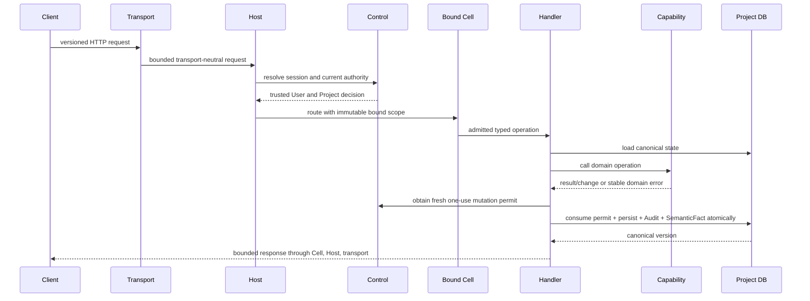

# Request routing and dispatch

## Public flow



Queries follow the same authority, scope, dispatch, and bounds, but do not
obtain a mutation permit or commit an effect.

## Operation identity

Every callable Product operation has a stable, versioned name such as:

```text
documents.create.v1
documents.get.v1
documents.submit_changes.v1
documents.resolve_prompt.v1
workbooks.set_cells.v1
projects.list.v1
```

An operation descriptor declares its input/output type, action requirement,
request class, maximum input/result size, time/cost budget, idempotency mode,
transaction behavior, durable-job eligibility, and nested-call policy.
Unknown names or versions fail before handler execution.

The request class and transaction behavior are fixed properties of that
versioned descriptor. They never vary by payload size, runtime estimate,
caller, load or deployment profile:

- A Query is bounded and read-only. It cannot create a Job, work receipt,
  artifact, idempotency record, `SemanticFact` or any other durable state.
- If a valid Query exceeds its interactive bound, it returns a stable family
  `*_async_required` `precondition_failed` result naming the exact durable
  request operation, before any side effect.
- The durable path is a separately registered idempotent Command. It freezes
  exact authorized inputs and versions and atomically admits the request, Job,
  receipt, idempotency result and Audit envelope. A separate Query reads its
  status and typed result metadata.
- A Product-query-only registry, including the registry exposed to Ask, cannot
  contain those durable request Commands and cannot auto-upgrade a Query.

## Typed registry

The registry is complete and immutable after Cell construction. Registration
checks duplicate names, versions, type identity, descriptors, and required
security metadata. Reflection may identify Go types during registration; it is
not used to serialize arbitrary runtime values or invoke unknown methods.

## Admission order

Admission performs cheap, security-relevant checks before scarce work:

1. protocol and body bounds at transport;
2. session resolution and current durable authority;
3. trusted Project selection and Cell scope match;
4. operation lookup/version/type validation;
5. entitlement and action gate;
6. idempotency request-shape validation;
7. deadline, work, cost, delegation, and queue budgets; and
8. scheduler capacity.

Project Product-effect authorization is checked again immediately before effect
by issuing and consuming the one-use permit. Control mutations instead lock and
re-evaluate their Control authority in the owning transaction. Early checks
improve rejection latency; they do not replace commit-time authority.

## Handler contract

A handler is operation-specific application code. It may:

- load only through a repository already bound to the Cell's Project;
- call one capability operation;
- adapt a capability-owned port through bounded nested invocation;
- choose a capability-specific concurrency protocol;
- pre-admit any effectful durable work in Control, then submit the exact Job and
  non-authoritative work receipt atomically with command intent;
- append required transaction-local Audit;
- append a registered bounded transaction-local `SemanticFact` for a declared
  user-visible effect;
- return canonical versions and bounded projections; and
- map internal failures to stable kernel categories.

It may not trust a request-supplied User, database, credential, placement,
entitlement, authority generation, or canonical version.

An effectful job handler reconstructs an exact active `DurableWorkAuthority` or
Task sponsorship and matching Project receipt before requesting its fresh
permit. A terminal finalizer is a separate closed handler path: it can invoke
only a schema-owned transition named by a precommitted finalization record and
cannot enter the ordinary operation registry or provider/tool adapters.

## Nested dispatch

Nested operations use an explicit `NestedInvoker`, not direct handler calls.
The nested execution descends the caller's budget and records the delegation
chain. It cannot widen scope or authority. Cycles, excessive depth, expired
deadlines, exhausted cost/work budgets, and forbidden action delegation fail
before the nested handler begins.

## Error categories

The kernel exposes transport-neutral stable categories:

- `invalid_argument`
- `unauthenticated`
- `forbidden`
- `not_found` (without unauthorized existence disclosure)
- `conflict`
- `stale_authority`
- `precondition_failed`
- `unsupported_version`
- `rate_limited`
- `overloaded`
- `deadline_exceeded`
- `canceled`
- `temporarily_unavailable`
- `integrity_failure`
- `internal`

Capability errors remain more precise inside a bounded, non-sensitive detail
object. Internal paths, SQL, provider payloads, credentials, stack traces, and
cross-tenant identifiers never reach the client.

## Idempotency

Commands declare whether they require a caller idempotency key. The server
binds a key to trusted actor, Project, operation version, and a canonical input
digest. Exact replay returns the recorded result. Same key with different input
is a conflict. In-progress, committed, failed-before-effect, and indeterminate
states are explicit. Project-local effects store idempotency beside the effect;
Control effects store it in Control.

## Headless parity

The CLI/lab transport maps the same versioned operations into kernel requests.
It cannot bypass authorization in production. Test/lab wiring may supply a
synthetic trusted principal, but the resulting Cell/handler/capability path is
otherwise the same and clearly labeled non-production.
