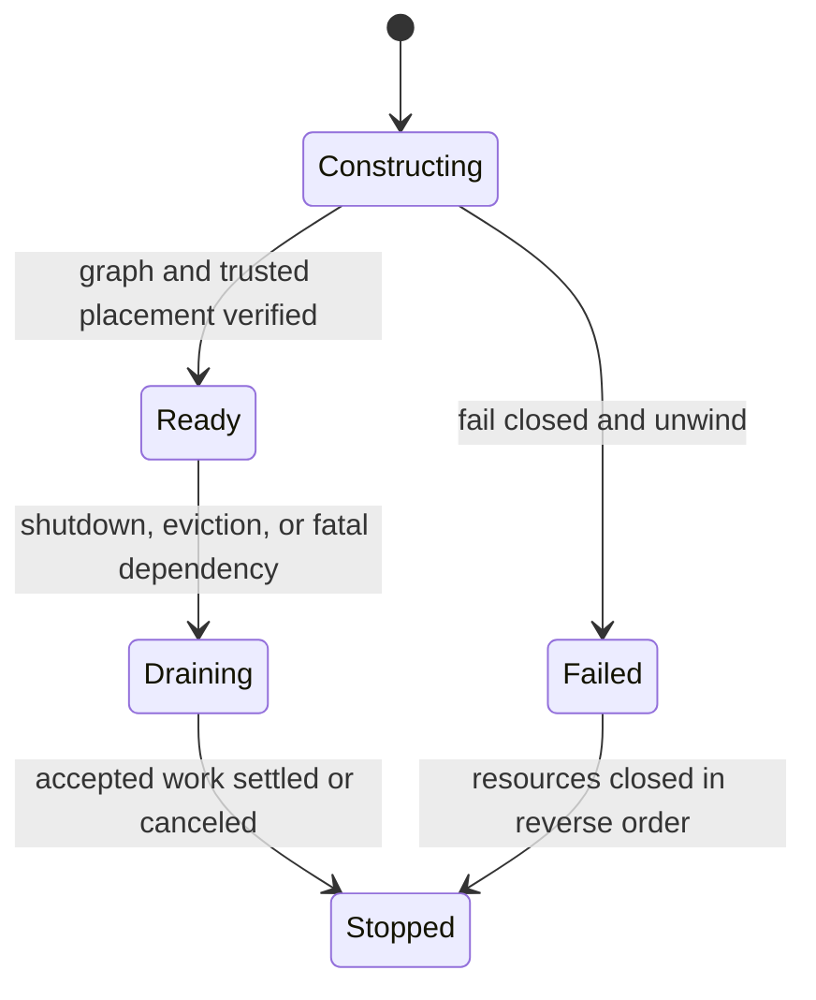

# Host and Cell runtime

## Host

The Host is the backend application runtime. It owns facilities whose scope is
wider than one User–Project interaction:

- public listeners and lifecycle;
- login/session bootstrap and Project discovery;
- trusted Project placement and bounded database handles;
- Cell construction, registry, capacity, drain, and disposal;
- host-wide admission limits;
- Project Product-job supervision;
- shared technical facilities such as configuration, secrets, logging,
  telemetry, clocks, provider factories, and object storage; and
- health, readiness, graceful shutdown, and fatal-error propagation.

The Host is not a generic service orchestrator. It constructs a known graph of
Go packages and exposes explicit bootstrap and Product operations.

The Product Host does not execute Control jobs or privileged infrastructure
work. A separate Control worker owns Control-domain jobs and revocation-fence
fanout. A separate operator runner owns provisioning, migrations, relocation,
backup, and restore. These roles are distinct wiring graphs and credentials,
even when development starts them from one local command.

## Cell identity

```go
// Illustrative only. Fields should prevent untrusted replacement.
type CellKey struct {
    userID    UserID
    projectID ProjectID
}

type CellInstanceID string
```

`CellKey` is an authority scope. `CellInstanceID` is disposable placement
identity. A Host can create multiple independent instances for one key, subject
to Host/User/scope limits.

A Cell never changes Project or User. Project selection creates or attaches to
a suitable instance; it is not a Cell operation. Sign-out invalidates durable
authority and makes subsequent Cell admission fail. Cell cancellation and
disposal are responsiveness and resource-management mechanisms, not the root of
security correctness.

## Cell contents

One Cell instance owns:

- immutable `CellKey` and `CellInstanceID`;
- current admission/access gate clients;
- immutable operation registry;
- bounded interactive scheduler and queue;
- operation handlers and nested invoker;
- instance-local bounded caches; and
- drain/cancel/dispose lifecycle.

It does not own a permanent database pool, one goroutine per capability, a
Project partition map, a global event loop, or canonical Resource state.

## Interactive scheduler

Interactive work is represented as explicit bounded jobs. A fixed worker pool
may use goroutines to execute admitted jobs concurrently. Bounds exist at Host,
Cell, operation, actor, and nested-work levels.

Required behavior:

- bounded queue and concurrency with stable overload errors;
- fair opportunity across Cells under Host-wide pressure;
- deadline/cancellation before and during execution;
- panic containment, redaction, and worker survival;
- every accepted job settles exactly once;
- bounded drain with explicit forced cancellation after deadline;
- no caller-controlled worker counts, priorities, or budgets; and
- no goroutine leak under rejection, cancellation, panic, or shutdown.

The scheduler does not make a capability asynchronous. It merely executes a
request concurrently. Durable work is a different class with durable state.

## Durable jobs

Long-running or restartable effects use explicit job records in the transaction
domain that owns the effect. For Project Product jobs, the Product Host claims
jobs under leases/fencing and reconstructs trusted Cell scope before invoking
the registered operation. A Cell's interactive queue is never the durable
record. Control-domain jobs are claimed only by the Control worker. Privileged
operator work is a separately authorized step, not a Product or Cell job.

Examples include large import/export, extraction, indexing, prompt resolution,
agent tasks, checkpoint/compaction, and archive/restore.

Every effectful non-Agent Project job has an exact Control-owned
`DurableWorkAuthority` admitted under the initiating User/session and paired
with a non-authoritative Project Job receipt. It binds Work/Job identity,
Project, allowed operations/targets, generations, budgets and expiry. Each
canonical job effect needs a fresh work-sourced permit; process identity, a
lease or a serialized job is never authority. Current-family sign-out preserves
accepted work, while User-wide/grant/policy/cancel/expiry revocation denies new
permits and fences older ones.

Every ordinary Project effect transaction writes an exact permit-consumption
proof beside its one-use consumption. After commit, trusted settlement re-reads
that row through `ProjectPermitSettlementTarget` using the read-only
`PermitSettlementCredentialRef` and idempotently calls
`control.mutation_permits.settle.v1`. Lost acknowledgement is recovered by the
same exact read; absent or conflicting proof stays nonterminal for reconciliation
or fencing. Settlement and fence credentials are separate roles and cannot be
substituted.

An exact Project `FinalizationRecord` may be created at admission for terminal
bookkeeping. Its target kind must be one of the closed versioned v1 registry:
durable Job, Task, Intelligence reservation/call generation, Agent disable,
Routine lifecycle, or Project Audit export lifecycle. Each kind has an exact
transition set and a non-interchangeable typed finalizer credential. Unknown
kinds, mismatched credential arms, or unlisted transitions fail closed. A
finalizer cannot obtain a permit, invoke a provider/tool, create or change a
Resource, enqueue work, widen authority, or resurrect authority.

Every Agent job reconstructs a sponsoring User and exact Project. The Cell key
remains `(SponsorUserID, ProjectID)`; Agent identity and delegation are
secondary actor context, never a substitute Cell authority. Control owns the
Agent authority principal/status/grants/generations, exact durable Task
sponsorship, and bounded standing Routine delegation. The Agents capability
owns Project-local Agent configuration/tool declarations, Task state, and only
non-authoritative sponsorship/delegation receipts.

Every protected effect permit has exactly one trusted authority-source arm:
current session family, active exact durable work, or exact Task sponsorship.
Interactive work uses the session arm. Durable Agent work uses sponsorship and
additionally requires the exact active Project Task and matching receipt.
Serialized Task, receipt, Persona, job, or request data cannot choose an arm or
mint authority.

Task startup is an idempotent saga, not a distributed transaction. Control
creates `TaskSponsorship{PendingProjectReceipt}` under a live session or active
standing delegation. A session-started Task uses an ordinary session-sourced
effect permit. Only an admitted no-session Routine trigger receives the
separately typed one-use `ReceiptBootstrapCredential`, usable only to create the
exact absent TaskID/initial digest plus matching receipt. It is not an ordinary
effect permit and does not add a fourth source. The Project transaction commits
Task, non-authoritative receipt, exact receipt proof, finalizer, Audit, the
single Task-created semantic fact and first job. A dedicated read-only
`ReceiptProofCredentialRef` re-reads the exact proof before Control activates
the sponsorship; lost acknowledgement repeats that read. Before activation no
ordinary sponsorship-sourced effect permit is available. An absent Project
receipt eventually expires/revokes the orphan; conflicting proof fails closed.

Interactive Agent work stops when its session family is revoked.
Current-session-family sign-out does not implicitly cancel an explicitly
accepted durable sponsorship. `Sign out everywhere` revokes every active
sponsorship sponsored by that User. User disable/removal, Project grant loss,
Agent/tool revocation, Task cancellation, sponsorship expiry/generation change,
or invalid sponsor denies new checks and permits and completes deny-first
Project fencing before being reported effective. The exact Task finalizer may
then move only that Task to `canceled`; it grants no effect authority. Expiry
is a fenced authority transition, not merely a worker-local clock test.

A Routine can execute without a browser only through a finite Control-owned
standing delegation that binds sponsor, Project, Routine version, Agent/tool
generations, trigger, allowed operations/targets/scope, per-run and cumulative
budgets, maximum runs, validity window, and revocation generation. Activation
uses `PendingProjectReceipt -> Active`; session-started Routine admission uses
an ordinary session permit, and exact receipt-proof re-read is required before
activation. A missing Project Routine receipt cannot mint work. Every accepted
trigger gets a fresh pending Task sponsorship and exact one-use
`ReceiptBootstrapCredential`, then follows the Task saga above. Project Routine
state holds only a receipt; editing it cannot widen authority.
Exhaustion, expiry, replacement, or revocation prevents new Tasks and fences
affected issued work. Standing delegation is not per-run approval for external,
destructive, security, irreversible or material-spend effects.

## Same-scope instances

Two browser tabs may receive separate Cells for the same User and Project. Both
operate against the same canonical Project Database under the capability's
concurrency contract. They share no mutable cache, queue, or in-memory Resource.

A future placement manager may maintain an index from `CellKey` to compatible
warm instances and choose reuse. That optimization must preserve:

- fresh durable authority checks;
- independent request/session attribution;
- per-request budgets and cancellation;
- no UI selection state inside the Cell;
- no cross-tab mutable browser assumptions; and
- correctness with reuse disabled.

## Lifecycle



Construction uses a resource stack. Failure unwinds exactly once in reverse
order. Production readiness means the configured graph, Control authority,
trusted placements, schema compatibility, secrets, and required dependencies
are usable—not merely that an HTTP listener opened.

## Required proofs

- Host/User/scope capacity limits fail closed.
- Host-wide execution does not permanently starve another Cell.
- Multiple same-scope instances remain isolated in memory and converge through
  canonical state.
- Same User/different Project and different User/same Project scopes cannot be
  substituted through payload, headers, cache keys, or repository handles.
- Panic, cancellation, deadline, overload, drain, and fatal runnable behavior
  are race-tested.
- Production wiring contains no synthetic authority, in-memory canonical store,
  or allow-all provider.
- Permit commit acknowledgement proves exact Project consumption, survives lost
  acknowledgement, rejects conflicting proof, and cannot use the fence role.
- Work, Task, Routine, standing-work and Agent-principal activation use only the
  exact receipt-proof role; Product/fence/finalizer role substitution fails.
- Every finalization kind/credential/transition pair is registry-tested, and
  unknown kinds plus cross-kind credentials fail closed.
