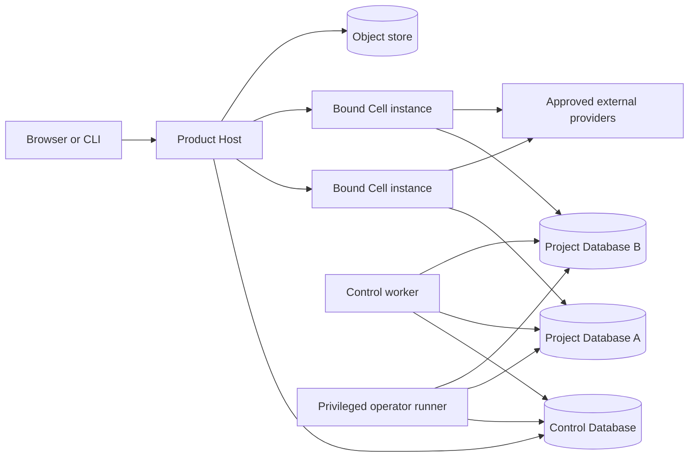
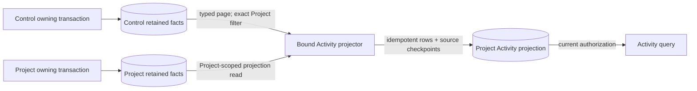

# System map

## Conceptual topology



The Product Host is the only role that serves Product traffic and may supervise
bounded Cell instances. A Control worker executes Control-owned jobs and
authority-fence fanout. A separately deployed operator runner performs narrowly
authorized provisioning, migrations, relocation, backup, and restore without a
Product listener or Cells. A Cell is not a process or a microservice: it is an
isolated runtime object whose immutable authority scope is exactly one User and
one Project.

## Layer responsibilities

| Layer | Owns | Must not own |
| --- | --- | --- |
| Transport | HTTP/CLI decoding, protocol bounds, cookies, origin/host controls, DTO mapping | domain decisions, SQL, capability implementation |
| Product Host | session bootstrap, project discovery/selection, typed Product placement, Cell lifecycle, outer capacity, Project Product-job supervision, exact-Project Activity projection, separately typed exact finalization, and typed Project-Audit administration | Resource editing semantics, fence-only credentials, Control jobs, DDL/operator work |
| Control | identity/federation/authenticators/recovery, sessions, User/Organization, Project ownership/grants/pins/share links, entitlements/billing/policy, placement, provisioning, effect permits and bounded durable-work/Task authority | Project content, per-Project workspace/favorites |
| Control worker | Control-owned jobs and authority-fence fanout using typed fence-only targets; atomic fence Project Audit | Product credentials/listeners, Cells, Resource content, DDL |
| Operator runner | provisioning/migration/relocation/backup/restore steps under short-lived privileged credentials | Product traffic, Cells, ordinary Resource access |
| Cell kernel | immutable scope, normalized request, gate, dispatch, bounded interactive scheduling, nested invocation | session login, Project switching, generic product behavior |
| Handlers | authorize, load, call capability, persist, submit jobs, append Audit, adapt providers, form response | defining domain semantics already owned by a capability |
| Capabilities | serializable domain types, invariants, commands/queries, pure transformations, consumer-owned ports | transport, authorization, SQL, logging, runtime lifecycle |
| Platform | config, secrets, database mechanics, object store, crypto, logging, telemetry, clocks, jobs, idempotency, migrations, UoW | product policy or generic Resource model |
| Wiring | construct concrete testing, lab, development, and production graphs | domain behavior |

## Runtime hierarchy

```text
Product Host process
├── Control clients and repositories
├── trusted Project placement/handle manager
├── Project Product-job supervisors
├── execute-only Project finalizer subgraphs for precommitted terminal records
├── exact-Project Audit query/export subgraphs under separate typed credentials
├── shared technical facilities
└── Cell registry
    ├── Cell instance: User A + Project X
    │   ├── access gate
    │   ├── operation registry
    │   ├── bounded interactive scheduler
    │   ├── handlers
    │   └── disposable instance-local caches
    └── Cell instance: User B + Project X
        └── independent runtime objects over the same canonical Project DB

Control worker process
├── Control-owned durable-job runner
├── authority-revocation/fence fanout
└── no Product listener, Cell registry, DDL, or Resource-content credential

Operator runner process
├── privileged provisioning/migration/relocation/backup/restore steps
├── separate short-lived operator credentials
└── no Product listener, Cell registry, or ordinary Product principal
```

Multiple browser tabs may receive separate same-scope Cells. A future Gateway
or placement policy may reuse a warm compatible Cell, but correctness and
identity never depend on reuse. Two Cells collaborate only by applying the
owning capability's concurrency contract to canonical durable state.

## Request classes

- **Bootstrap requests**: health, provider catalog, login, callback, session,
  User profile, Project discovery, Project creation/selection. Host/Control
  handles these before a Cell exists.
- **Interactive Project requests**: short bounded commands and queries routed
  through one bound Cell.
- **Durable Project work**: restartable jobs stored with their owning Project
  transaction and executed by a Product Host runner using reconstructed trusted
  scope and either an exact Control `DurableWorkAuthority` or an exact Agent
  Task sponsorship; Project-local receipts never create authority. Terminal
  bookkeeping after revocation uses an exact precommitted finalizer and cannot
  produce a new Product effect.
- **Durable Control work**: identity, lifecycle, and authority-fence jobs stored
  in Control and executed by the separately composed Control worker.
- **Operator work**: provisioning, migrations, backup, restore, relocation,
  database/account/key administration, and break-glass actions executed only
  by the operator runner under credentials unavailable to Product and Control
  runtimes.

## Cross-capability behavior

Capabilities do not discover or call sibling implementations. A consumer owns
the narrow port it needs. A handler adapter can satisfy that port by invoking a
registered operation through the Cell's bounded nested invocation contract.
This keeps the calling capability independently testable and ensures nested
work inherits scope, deadline, budget, delegation depth, authorization, and
observability.

Prompt resolution is the reference example: Documents owns a
`PromptResolutionProvider` contract expressed in Document vocabulary; wiring
supplies a handler adapter that coordinates Resolution, Knowledge, and
Intelligence operations. No provider client or sibling implementation enters
the Document model.

Activity is the cross-domain projection example. A Control transaction may
append a registered safe fact with one exact Project audience; Project
transactions append their own facts locally. A bounded Product Host projector
uses a Control credential bound to that Project to page only its safe Control
facts, while a Project projection role reads local facts. It commits Activity
rows and each source checkpoint idempotently in the Project Database. There is
no cross-database transaction or event runtime; page continuity/retention gaps
stop projection and trigger a generation rebuild from retained facts.



## Truth boundaries

- Control Database: identity and authorization truth.
- Project Database: one Project's canonical Resource and Project-local
  operational truth, including required Project Audit and its governed export
  records.
- Object store: immutable or versioned large artifacts referenced by durable
  metadata and verified by integrity information.
- Capability code: behavior truth, not stored data.
- Browser: replaceable interaction projection.
- Logs/telemetry/activity/search/realtime: operational or user projections;
  none may replace canonical state.
