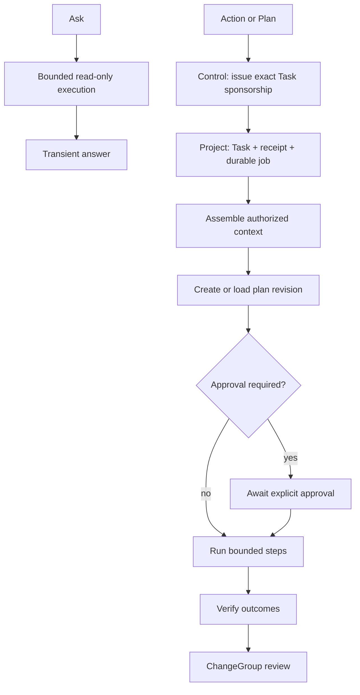

# Agent task flow

## Outcome

A User can ask a grounded read-only question, request one bounded action, or
approve a multi-step plan. Ask is transient and read-only against user-visible
Product content/workflow state. Action and Plan use durable Tasks, run bounded
work through the same authorized capability
operations available to Users, verify results, surface proposals and changes
for review, and preserve inspectable attempts, evidence, decisions, usage, and
failures.

Agents are not autonomous services and do not get privileged access. The
Agents capability is a Go library. Host-supervised durable workers execute Task
records; handlers own authority, repositories, provider adapters, transactions,
jobs, and Audit.

## Canonical distinctions

- **Agent authority principal** is the Control-owned identity, status, grant
  set, and authority/tool generations.
- **Project Agent configuration** is the Project-local display/persona/tool
  declaration that refers to that Control principal; it is not authority.
- **Persona** is a versioned behavior/output/verification overlay snapshotted
  into a Task.
- **Instruction** is a stable reusable work identity with immutable versions
  describing objective/input/scope/tool-intent/consequence/verification shape;
  an exact published version may be snapshotted into a Task or Routine.
- **Declared trigger** is a stable deterministic delivery matcher with immutable
  input/dedupe/preview schemas. A match is not authority and starts no Task by
  itself.
- **Routine** binds exact Instruction/DeclaredTrigger versions to one sponsor,
  Agent/tool generations, input binding, budgets and standing-delegation
  receipt. It is not a Persona or trigger definition.
- **Task** is the stable user-visible goal and lifecycle record.
- **Plan revision** is an immutable proposed execution structure.
- **Execution** is one runtime activation of the Task or plan node under a
  trusted scope, deadline, budget, and delegation chain.
- **Attempt** is one try of a provider call, tool operation, or step. Retries
  append Attempts; they do not rewrite the earlier outcome.
- **ChangeGroup** is the reviewable collection of resulting Resource changes.
- **Memory** is evidence-linked behavioral learning. It is not Knowledge,
  canonical fact, or authority.

## Modes

| Mode | Contract |
| --- | --- |
| Ask | Transient and read-only against user-visible Product content/workflow state. Cannot invoke a Product mutation or create Resource/Task/Activity/Memory/SemanticFact/job/ChangeGroup/tool effects. Provider-backed execution may admit only one bounded Intelligence reservation, call record, optional continuation envelope, and exact `FinalizationRecord` before the call; only its separately typed finalizer may later record the receipt and terminalize that exact reservation and call generation with Audit. |
| Action | One bounded permitted command. Executes after policy check, verifies, and produces a reviewable/revertible ChangeGroup. High-risk actions require pre-approval. |
| Plan | Creates a versioned plan for review before execution, then runs only the approved revision. |

External communications, destructive or irreversible changes, access/security
changes, secret use, material spend, and other configured high-risk effects
require explicit pre-approval regardless of mode.

## Ownership

| Owner | Owns |
| --- | --- |
| Agents capability | Project-local Agent configuration and tool declarations, Persona/version, Instruction/version, DeclaredTrigger/version, Routine, Task, Plan revision/nodes, retry directives, sponsorship/delegation receipts, approval/verification policy, Task state invariants |
| Resolution/Knowledge/Intelligence/Formula | Their respective evidence, reasoning, provider, and compute semantics |
| Resource families | Every actual Resource query/mutation and conflict/revert behavior |
| Control | User/Agent authority identity, status, grants and generations; entitlements; Project grants; exact durable Task sponsorships; bounded standing Routine delegations; permits and revocation |
| Agent handlers and job runners | context assembly, registered tool mapping, current authority, permits, durable persistence, leases, idempotency, Audit, provider adapters |
| Memory capability | scoped evidence-linked memory entries, confidence, review/decay and consultation history |

## Target operations

```text
agents.list.v1
agents.create.v1
agents.update.v1
agents.get.v1
agents.disable.v1
agents.assign_project_agent.v1
personas.publish.v1
personas.get.v1
personas.list.v1
instructions.create.v1
instructions.revise.v1
instructions.publish.v1
instructions.deprecate.v1
instructions.retire.v1
instructions.get.v1
instructions.list.v1
instructions.history.list.v1
declared_triggers.create.v1
declared_triggers.revise.v1
declared_triggers.publish.v1
declared_triggers.deprecate.v1
declared_triggers.retire.v1
declared_triggers.get.v1
declared_triggers.list.v1
declared_triggers.history.list.v1
quarterback.ask.v1
tasks.create.v1
tasks.get.v1
tasks.list.v1
tasks.plan_history.list.v1
tasks.step_attempts.list.v1
tasks.cancel.v1
tasks.pause.v1
tasks.resume.v1
tasks.retry_node.v1
tasks.approve_plan.v1
tasks.review_changes.v1
agents.tool_catalog.query.v1
routines.publish.v1
routines.enable.v1
routines.disable.v1
routines.get.v1
routines.list.v1
```

The Quarterback surface maps Ask to `quarterback.ask.v1`. It maps only explicit
Action or Plan intent to `tasks.create.v1`. It is not an alternate execution
authority. All operation names and versions are registered explicitly.

Instruction and DeclaredTrigger aggregates move through `draft`, `published`,
`deprecated`, and `retired` while their published versions remain immutable.
Deprecation blocks new Task/Routine selection but cannot rewrite an existing
snapshot. Persona shapes how work is performed; Instruction defines the work;
DeclaredTrigger detects a delivery; Routine binds them to bounded automation.
None creates sponsorship, approval, a permit or a tool grant.

## Read-only Ask

`quarterback.ask.v1` executes synchronously through the bound Cell under the
current session and `(UserID, ProjectID)` scope. It assembles bounded authorized
context and exposes only registered Product queries. The answer may carry
citations, provider-neutral receipts, truncation, and uncertainty. The request
creates no Resource, Task, Activity, Memory, Semantic Fact, durable job,
ChangeGroup, or tool effect. Before a provider call, a provider-backed Ask may
atomically commit a bounded Intelligence reservation, call record, optional
continuation envelope, and exact `FinalizationRecord` under one exact session-
sourced effect permit and required Audit. Its separately typed finalizer alone
may later record the receipt and terminalize that exact reservation and call
generation after crash/session loss; it cannot call the provider again, touch
Product state, or save the answer. Those minimized accounting records
cannot become user-visible Product state.
A deterministic local Ask may be literally zero-write.

Saving an answer is a distinct, explicit authorized command—for example
`chats.append_message.v1` or a Resource-family mutation. That command follows
the normal permit, idempotency, concurrency, Audit, and Activity-fact path.

## Task creation

`tasks.create.v1` accepts bounded Action or Plan intent, explicit mode, selected
scope, optional Agent/Persona and exact published InstructionVersion identities,
verification level, safe policy
choices, and idempotency. The handler crosses Control and Project as an
explicit saga, never as a distributed transaction:

1. checks current User/session/Project authority and Task entitlement;
2. resolves the selected Agent, exact Persona version, optional exact published
   InstructionVersion, allowed scope, tool grants, and policy from canonical
   state; combines explicit Task input with the Instruction schema without
   allowing the Instruction to widen scope or grants;
3. rejects Ask mode, which belongs to `quarterback.ask.v1`;
4. chooses stable trusted Task ID, initial Task digest and idempotency;
5. asks Control to atomically create an exact
   `TaskSponsorship{PendingProjectReceipt}` and required Control Audit, then
   obtains one ordinary exact session-sourced permit for `tasks.create.v1`;
   this Control security step emits no ordinary Task-created semantic fact;
6. one Project transaction consumes that session permit and creates the Task,
   non-authoritative `TaskSponsorshipReceipt`, `AuthorityReceiptProof`, exact
   `task@1` finalization record, Project idempotency, required Audit, the single
   Task-created semantic fact and first durable job;
7. trusted commit acknowledgement activates the Control sponsorship; and
8. returns the Task identity/state, not a claim that work is complete.

If the process crashes after Control commit but before Project commit, the
sponsorship is a pending expiring orphan exact to an absent Task and cannot
authorize an ordinary Project effect. Retry uses the same identities to finish
Project creation; a Control reconciler revokes abandoned orphans. If Project
commit succeeds but acknowledgement is lost, reconciliation verifies the exact
receipt and activates it. A Project receipt alone never grants authority.

A no-session Routine delivery follows the separate trigger path: the active
finite standing delegation atomically deduplicates the delivery, consumes
allowance, creates the pending sponsorship and issues one exact
`ReceiptBootstrapCredential`. That credential is not an ordinary effect permit;
it can create only the preselected absent Task/receipt/proof/job write set above
at the bound placement generation and cannot authorize any later Task effect.

The Task snapshots the selected Persona and optional InstructionVersion content/
digest. Later publication or deprecation affects only new selection and cannot
rewrite this Task. The Task stores hashes/references to selected Resources and
policy, not live provider clients or a hidden browser conversation.

## Execution flow



### 1. Claim and reconstruct

A Host-supervised worker claims an Action/Plan Task job under a lease. It
reconstructs Project placement, sponsoring User, the Control-owned Agent
principal/generations and exact durable sponsorship, the matching Project-local
Agent configuration and non-authoritative Task receipt, exact Task/plan
revision, and operation registry from trusted durable state. Its Cell key is
always `(SponsorUserID, ProjectID)`; Agent is a secondary actor/delegate, never
an Agent-only Cell authority. Serialized Task data cannot choose a database,
Cell key, provider secret, authority source, or unrestricted operation.

Each Execution receives a deadline, token/cost/tool budget, recursion/nested
dispatch budget, maximum attempts, and cancellation. Lease loss, stale plan
revision, sponsorship expiry/generation change, revocation, or placement
generation change fences the worker.

Every protected permit names exactly one trusted authority source:

```text
SessionAuthority      = current session-family ID + generation
DurableWorkAuthority  = current work-authority ID + generation + exact Job ID
TaskSponsorshipAuthority = current sponsorship ID + generation + exact Task ID
PermitAuthoritySource = exactly one of the three above
```

Interactive User/Ask work uses the session arm; non-Agent accepted jobs use the
work arm; durable Task tool effects use the Task-sponsorship arm. Control checks
the source and every indexed dependency plus the complete authority ceiling
before issuance. The Project handler also requires the exact active Task and
matching sponsorship receipt for Task effects. The request, Job, Task, lease,
receipt, or model cannot choose an arm or establish authority. The exact one-use
Task bootstrap described above is the only pending-sponsorship exception and
cannot authorize later effects.

### 2. Assemble working context

The handler assembles a bounded, inspectable Working Context from:

- Resources and exact versions within Task scope;
- authorized Knowledge Sources and retrieval evidence;
- prior Task/Resolution results explicitly referenced;
- applicable Persona version and policy;
- relevant Memory entries with evidence/confidence/age; and
- current operation/tool schemas and risk classes.

Every read is currently authorized. `memory.consult.v1` returns the bounded
zero-write selection and deterministic digest. Memory can influence style or
strategy but cannot assert a fact, expand scope, or grant a tool. If a Task
materially applies entries, the consumer commit atomically stores an exact
`ConsultationID`, `FollowUpID`, query/result digest, applied refs, consumer
commit ref, current Task `JobID`, and tagged Task-sponsorship identity/
generation in its durable follow-up row. Context assembly records what was
consulted and excluded/truncated without making the Query effectful; the
follow-up, not the Query, makes required history recoverable.

### 3. Ask

Ask follows `context_building -> answering -> answered | insufficient |
failed` within the interactive request. It chooses an explicit one-shot
Inference, bounded Reasoning, grounded Resolution, Knowledge query, Formula
evaluation, or combination through consumer-owned contracts.

The Product operation registry presented to Ask contains no mutations. An
Answer cites exact evidence/results and returns provider-neutral receipts. It
creates no Resource, Task, Activity, Memory, Semantic Fact, durable job,
ChangeGroup, or tool effect and cannot smuggle a write through provider output.
When an authorized Product query exceeds its interactive contract, Ask returns
that family's `*_async_required` precondition; it cannot invoke the named
durable request command or auto-upgrade the query into work.
The only permitted write path is the bounded Intelligence metering admission
and exact finalization described above: the reservation, call record, optional
continuation envelope, and `FinalizationRecord` are session-permitted before
the provider call, while receipt recording and terminalization of that exact
reservation and call generation use only the separately typed finalizer and
atomic Audit.

### 4. Action

Action follows `accepted -> policy_check -> executing -> verifying ->
needs_review -> accepted | reverted | failed`.

The planner must reduce intent to one finite registered command with bounded
input and declared risk. The worker invokes that command through the same Cell
handler path as a User:

1. current Control sponsorship, Agent/tool generations, Project Task and
   matching non-authoritative receipt are checked;
2. the owning Resource capability validates domain state;
3. a fresh exact one-use permit is issued immediately before commit;
4. the Resource UoW commits effect, idempotency, required Audit, and jobs; and
5. the Task records the canonical result/reference as a step Attempt.

The Agent does not write SQL or capability state directly. A revoked User,
Agent, grant, tool, Task sponsorship, approval, policy or other indexed
dependency prevents the protected commit; a browser session need not remain
active for a separately accepted Task sponsorship.

### 5. Plan

Plan follows `drafting -> awaiting_plan_review -> approved -> executing ->
verifying -> needs_review -> accepted | reverted | failed`.

A Plan revision is immutable and contains bounded nodes, dependencies,
declared tool intents, expected inputs/outputs, risk, verification, approval
points, and budgets. User revision/rejection produces a new revision; it does
not mutate the approved history. Only an exact approved revision executes.

`tasks.plan_history.list.v1` pages every immutable revision with its digest,
consequences, author, approval/rejection/supersession decision and creation
time. It is the audit-friendly Product projection for plan evolution; it does
not expose hidden reasoning or replace required Audit.

A plan node becomes executable only when it can be represented as a finite
sequence of admitted registered queries/commands. Manager nodes may decompose
within recursion/budget limits. Cycles, self-delegation, unbounded fan-out, and
unknown tool versions fail constructively.

Independent read-only or disjoint approved steps may run concurrently under
Task and Host limits. Canonical mutation conflicts are resolved by each owning
capability; the Agent cannot make them disappear by ordering promises.

### 6. Attempts and retries

Every provider/tool try appends an Attempt with stable parent Task/node,
operation/version, argument hash, policy/routing identity, timing, outcome,
safe diagnostic, and resulting canonical reference. A retry:

- occurs only for a declared retryable class;
- observes remaining budget and backoff policy;
- uses the same operation idempotency identity for an uncertain protected
  effect, or a new identity only when starting a deliberately new effect;
- rechecks current authority; and
- never rewrites the previous Attempt.

`tasks.retry_node.v1` is the only Product retry command. It names the exact
Task, approved PlanRevision, NodeID/current generation, reason and idempotency
key. The handler reauthorizes the Task, active sponsorship/receipt, plan
approval, current tool descriptor/version, scope/placement, retry class and
remaining work/cost/attempt budgets. It appends one `NodeRetryDirective`,
advances the node generation and schedules at most one new Attempt. A duplicate
returns the same directive. A prior uncertain protected effect must reconcile
under the same operation idempotency lineage; retry cannot silently create a
second effect.

`tasks.step_attempts.list.v1` pages immutable Attempts by Task/node/state/time,
including predecessor/retry lineage and safe canonical result references.
`agents.tool_catalog.query.v1` returns only safe descriptors currently visible
for the exact actor, Agent, Task, mode, scope, policy and grant generations.
Unknown and unauthorized operations are indistinguishable; catalog visibility
never grants invocation authority.

### 7. Verification and review

Verification uses deterministic queries/rendering, assertions from the plan,
and exact canonical versions. A model's statement that it succeeded is not
verification. The Task records which checks ran, inputs, results, and remaining
uncertainty.

The transient Ask request returns an Answer directly. Action/Plan creates a
ChangeGroup linking the committed changes, affected Resources/versions,
evidence, decisions, Attempts, and verification. The User may accept, request
revision, or invoke family-owned revert operations where supported. Review does
not rewrite required Audit.

### 8. Pause, resume, cancel, and failure

- **Pause** stops scheduling new steps and lets the current safe step settle;
  state becomes paused only after durable quiescence.
- **Resume** reconstructs from canonical Task/plan/attempt state on any Host;
  it does not rely on an old goroutine or cache.
- **Cancel** first moves the Project Task to `cancel_requested` under current
  session authority when available, then revokes the Control sponsorship,
  completes deny-first Project fencing, and stops new steps/provider work.
  User-wide revocation may skip the first step. The exact precommitted Task
  finalizer can then move only that expected Task generation to `canceled` and
  append bounded Audit/terminal fact; it cannot invoke tools, mutate Resources,
  or enqueue effect work. If Project state is unavailable, cancellation remains
  visibly in progress while authority is already denied.
- **Failed constructively** preserves the plan, evidence, Attempts, partial
  committed changes, verification, safe error, and possible next actions.
- A crash or lease expiry lets another worker resume idempotently. Stale workers
  cannot settle or commit new effects.

## Agent and User attribution

Every protected effect attributes both the initiating User and acting Agent,
including delegation chain, Task, plan revision/node, and Attempt where
applicable. The Agent is never disguised as the User. A required Project Audit
record commits with the Resource effect; Task history references it afterward.

Interactive Agent work is session-bound and stops when that session family
becomes inactive. Current-session-family sign-out does not silently cancel an
explicit durable Action/Plan sponsorship. `Sign out everywhere` revokes every
active sponsorship sponsored by that User. User disable/removal, Project-grant
revocation, Agent/tool-grant revocation, Task cancellation, expiry, or invalid
sponsor/owner state revokes every affected sponsorship. Each security action
denies checks and new permits immediately and fences older permits before it
reports effective. Every Project Agent, scheduled Routine, or delegated Task
therefore has an accountable sponsoring User; there is no ambient Project-wide
Agent authority.

## Routine trigger flow

Instruction, DeclaredTrigger, Routine configuration and trigger-delivery
history are Project-local Agents state. A Routine can be published only with
exact published InstructionVersion and DeclaredTriggerVersion references plus
validated task-input binding; publication grants nothing. A deterministic
trigger match is only a candidate delivery.
Enabling a Routine asks Control to create a separate bounded
`StandingDelegation{PendingProjectReceipt}`. A session-permitted Project
transaction moves the expected Routine to `enable_pending`, stores the non-
authoritative receipt and exact activation finalization record. Trusted commit
acknowledgement activates the delegation; the typed Routine finalizer moves
only that expected Routine/delegation generation to `enabled`. The Control record
binds sponsor, Project, Routine/version, Agent/tool generations, admitted
Instruction/DeclaredTrigger version digests, trigger, allowed
operations/targets/scope, per-run and cumulative budgets,
maximum runs, validity window, and revocation generation.

For every admitted trigger, Control atomically checks the current active
standing delegation, consumes its run/cumulative allowance, and creates a fresh
pending exact Task sponsorship plus one exact `ReceiptBootstrapCredential`.
The Project then
creates the exact Task, receipt, trigger delivery identity, and job with normal
idempotency, snapshots the Routine's exact InstructionVersion, and acknowledges
commit. A duplicate trigger returns the existing
result. A crash between the two domains leaves only a harmless pending orphan;
a lost acknowledgement is reconciled from the exact trusted receipt.

The delegation retains the lineage of each sponsorship issued from it. Routine
edits cannot widen an existing delegation. A wider policy requires a
replacement Control delegation and deny-first revocation of its predecessor.
Expiry, exhaustion, sponsor/Project/Agent/tool generation change, disable, or
revocation prevents new Task sponsorships and deny-first revokes/fences
affected derived sponsorships through the same protocol.

Routine disable first commits `disable_requested` plus an exact disable
finalization record. It then revokes/fences the exact Control delegation. The
typed Routine finalizer may move only that expected Project Routine generation
to `disabled` after trusted Control proof; it cannot admit a trigger, create a
Task, change configuration, or enqueue work. Crashes and lost acknowledgements
are reconciled idempotently from the Project receipt and Control status.

The standing delegation is not per-run approval. External communication,
destructive/security/irreversible work and material spend still pause for an
exact current approval unless a later accepted product contract explicitly
defines bounded per-run approval.

## Memory

Memory entries are proposed after work, not silently promoted. An entry carries
Project and narrower scope, kind, content, evidence references, confidence,
creator/source, review/expiry/decay metadata, status, and consultation history.
Sensitive or unsupported conclusions are rejected or require review.

Consultation history is a safe reference/digest record, not a copied prompt or
Memory body. `memory.consultations.get.v1` and
`memory.consultations.list.v1` reauthorize every visible entry/evidence link;
deleted or newly inaccessible content is redacted while policy-required lineage
remains.

Material use has a crash-safe follow-up contract. The Task consumer transaction
commits the exact follow-up with its canonical effect, idempotency and Audit;
the source authority is the trusted active `TaskSponsorshipAuthority`, exact
Task/receipt/generation and current Job, never a caller-selected receipt or
row. A recommendation consumer uses its already active
`DurableWorkAuthority` and exact evaluation Job/receipt/generation. The
corresponding consumer Job remains `settling_consultation` until a reconstructed
worker calls `memory.consultations.record.v1` directly.

That settlement reauthorizes the exact entries, evidence and consumer commit,
uses a fresh permit from the tagged active source, and atomically inserts the
unique consultation plus marks the follow-up settled. It creates no second Job.
Crash after the consumer commit is found from the follow-up; crash after Memory
commit returns the same consultation on replay; lease loss fences stale work;
mismatched digest/refs/commit/Job/generation fails closed. If the authority is
revoked first, the follow-up remains an explicit denied terminal record and no
Task/Job finalizer may fabricate consultation history or claim it settled.

Memory cannot:

- become a Knowledge Source without an explicit governed promotion;
- override current User/Project/tool authority;
- contain secrets or raw provider transport;
- expand Task scope; or
- replace exact canonical Resource reads.

## Failure and security behavior

- Unknown Agent, operation/tool version, risk class, provider route, plan
  representation, or policy fails closed.
- Ask has a mechanically Product-query-only operation registry; the provider
  adapter can reach only the bounded metering transaction, not a Product tool.
- High-risk work waits for an exact approval bound to plan revision, scope,
  operation, arguments/risk summary, approver, and expiry.
- Approval is not a mutation permit; the final command still obtains a fresh
  one-use permit.
- Agent recursion, nested dispatch, attempts, tokens, time, cost, concurrent
  steps, output, and context are bounded.
- Provider/tool text is untrusted data. It cannot register operations, choose
  credentials, change scope, or bypass argument validation.
- Logs, telemetry, Activity, model context, and User output receive explicit
  redaction/content policy; required Audit retains only necessary attribution.
- Cross-Project context, Memory, cache, search results, and Resource handles are
  rejected even if an identifier collides.

## Headless example

```text
1. Run deterministic-local quarterback.ask.v1 over Document D@H12; inspect a
   cited answer and prove Product tables, jobs, Activity, Audit, and permit
   ledger unchanged. Repeat through a provider and prove the only changes are
   one bounded admission permit plus reservation/call/optional continuation/
   finalization records, then exact finalizer-only receipt recording and
   reservation/call-generation terminalization with atomic Audit; prove finalization cannot call the
   provider or touch Product state.
2. Create Agent A with read Document + propose Document changes grants.
3. Create Persona P1; create/revise/publish Instruction I@V2; create/publish
   DeclaredTrigger G@V1; prove neither definition creates authority or work.
4. Create sponsored Task T in Plan mode over D@H12 with P1 and I@V2 snapshots.
5. Query `agents.tool_catalog.query.v1`; prove only current safe granted
   descriptors appear. Run deterministic planner and inspect Plan R1.
6. Revise to R2, approve exact R2, list plan history, and prove R1 cannot run.
7. Execute a Knowledge query and one documents.submit_changes.v1 command.
8. List StepAttempts; inspect exact evidence, permit-bound Audit, D@H13, and
   ChangeGroup.
9. Call `tasks.retry_node.v1` after a lost response; prove one retry directive,
   immutable prior Attempt and no duplicate Resource effect.
10. Publish/enable a Routine binding I@V2/G@V1; deliver twice and prove one
    exact sponsored Task. Deprecate I/G and prove new binding fails while the
    historical Task snapshots remain inspectable.
11. Revoke Agent tool grant before another step; prove no new permit/commit.
12. Restart Host and resume Task from durable sponsorship with caches empty.
```

## Proof obligations

- Ask cannot reach a Product mutation in source, registry, or adversarial
  provider-output tests and leaves Resource/Task/Activity/Memory/Semantic Fact/
  job/ChangeGroup/tool state unchanged; provider-backed proof allows only one
  bounded admission permit plus reservation/call/optional continuation/
  finalization records and exact finalizer-only receipt recording and
  reservation/call-generation terminalization with atomic Audit;
- Agents invoke the same handlers, authority checks, permits, idempotency,
  concurrency, and Audit as Users;
- Tasks/Plans/Attempts are durable, immutable where declared, restartable, and
  safely fenced under lease loss;
- Persona snapshotting and Memory scope are deterministic;
- materially applied Memory commits an exact consultation follow-up/Job/
  authority mapping with the consumer effect; crash/restart and lease replay
  produce one consultation, mismatched replay conflicts, and revocation or a
  terminal finalizer cannot fabricate a settled history row;
- Instruction/DeclaredTrigger stable identity, immutable versions,
  publish/deprecate races and exact Task/Routine snapshotting are deterministic;
  Persona/Instruction/Trigger/Routine remain distinct and definitions never
  grant authority;
- approvals bind exact revision/effect but do not replace current authority;
- pause/cancel/revoke races produce no unaccounted post-effective commits, and
  the exact Task finalizer can close only the precommitted terminal transition;
- within this Agent flow, current-family sign-out preserves explicit Task
  sponsorships and standing Routine delegations, while sign-out-everywhere/
  User disable revokes and fences every affected source before completion is
  reported; Control separately applies the same global action to non-Agent
  durable-work sources;
- crashes at every Control-sponsorship/Project-Task boundary prove a pending
  orphan cannot act, a receipt cannot authorize, lost acknowledgement
  reconciles exactly, and idempotent retry converges;
- Routine activation/trigger replay, run/cumulative exhaustion, expiry,
  replacement, and revocation prove pending receipts grant nothing and one
  fresh exact sponsorship exists per Task;
- retry-node duplicates, stale plan/node generations, nonretryable outcomes,
  expired sponsorship, changed tool policy and exhausted budgets fail closed;
  uncertain protected effects reconcile under their original idempotency and
  prior Attempts remain immutable;
- plan-history and step-attempt cursors remain stable during concurrent
  execution, preserve superseded/failed records and hide inaccessible content;
  tool-catalog queries omit unauthorized operations and cannot widen grants;
- every Agent execution uses a sponsoring User/Project Cell key and durable
  Tasks cannot outlive sponsorship, scope, generation, budget, or expiry;
- every completed effect is attributable and every claimed success is verified
  against canonical state;
- bounded recursion/fan-out/context/provider output resist hostile inputs; and
- two Users/two Projects on independent Hosts cannot exchange context, Memory,
  tools, results, or handles.

## Implementation map

```text
internal/capabilities/agents/          Agent, Persona, Instruction, Trigger,
                                       Routine, Task, Plan, retry state rules
internal/capabilities/memory/          evidence-linked scoped Memory
internal/cell/handlers/agents/         Task commands, context and tool adapters
internal/host/jobs/                    Task worker supervision/reconstruction
internal/cell/dispatch/                registered bounded tool invocation
internal/control/access/               User/Agent/delegation authority
internal/control/authority/            exact one-use mutation permits
internal/capabilities/<owner>/         actual Resource/Knowledge/Formula work
internal/cell/handlers/<owner>/        actual authorized effects
```

## Grounding

Omega authority: D003, D006–D009,
[`experience-map.md`](../product/experience-map.md),
[`resource-mutation.md`](resource-mutation.md), and
[`jobs-audit-observability.md`](../architecture/jobs-audit-observability.md).

Taurus target: [SOL X 45 — Quarterback, Agents, Personas & Task Execution](https://app.notion.com/p/39ab6410e50281b0bb98d7a1d726080f)
and [Operation Legion](https://app.notion.com/p/394b6410e502814994ceece646403c79).

Nova has no canonical Agent/Task backend. The Agents screen is presentation-
only; durable jobs and access primitives are reusable evidence, as described in
[`../nova-evidence.md`](../nova-evidence.md). This complete
flow is target-only until implemented and proven.
