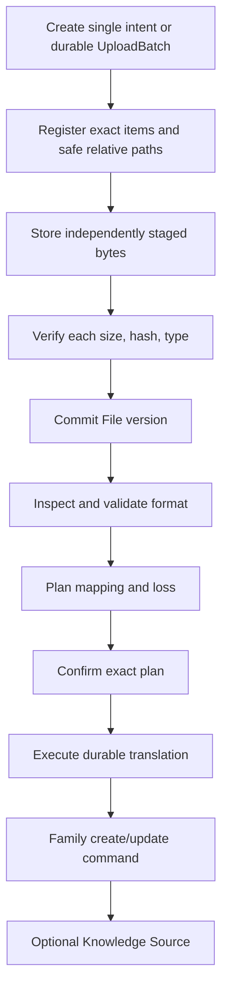
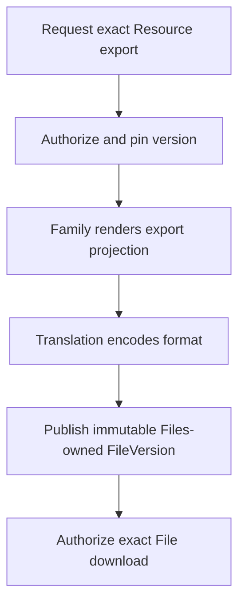

# Import and export flow

## Outcome

Users can bring bounded external content into a Project and produce reviewable
external artifacts from exact canonical Resource versions. Bytes, metadata,
extraction, translation, family semantics, provenance, authority, and delivery
remain distinct. Long conversions are durable jobs; no browser connection,
Cell affinity, global event stream, or provider object is canonical.

Import/export is not one generic Resource transformation. Files owns uploaded
objects and versions. Translation validates and converts formats. Each Resource
family owns how external material becomes or is rendered from its canonical
model.

This is a Product portability flow, not infrastructure recovery. A native
package or Project archive is inspected and restored only as an authorized
import through destination owners. Operator database/object backup and restore
reconstructs infrastructure state under separate credentials and is never
reachable from these Product operations.

## Ownership

| Owner | Owns |
| --- | --- |
| Files | File Resource/version metadata, object integrity, MIME/sniff results, upload state, preview/extraction references, quarantine and lifecycle |
| Object store platform | Bounded byte transfer, immutable/versioned objects, checksums, encryption and deletion mechanics without product policy |
| Translation | Format detection/validation, safe package handling, normalized intermediate translation values, diagnostics and provenance |
| Resource family | Canonical create/update command, semantic validation, render/export projection, family-specific loss policy; Documents, Workbooks, Decks and Boards additionally own Template behavior |
| Knowledge | Optional registration/ingestion of eligible exact File or Resource versions as Sources |
| Handlers/jobs | current authority, upload sessions, adapters, transactions, permits, idempotency, Audit, durable work, bounded delivery |

Connectors are separate provider adapters that produce File/Source captures
under the same contracts. Outlook Mail/Calendar, Drive, OneDrive/SharePoint,
Slack, and similar scopes require separate consent/token/audit/revocation
policy; identity login tokens are never reused.

A governed Memory export is also separate from Translation and Project Archive.
`memory.export.v1` owns the exact User/Project scope, policy-shaped Memory input
snapshot, manifest, durable job, and output receipt. Its publisher invokes the
verified generated-output arm of `files.add_version.v1`; Files owns the new File
and immutable FileVersion, object integrity, lifecycle, and delivery. Memory
stores no bytes, object reference, or delivery URL, and a caller downloads only
through the ordinary authorized `files.download.v1` path.

## Supported target families and formats

Format support is versioned and capability-advertised. A format is not claimed
until import/export semantics and loss reporting are tested.

| External form | Canonical target/source | Directional target |
| --- | --- | --- |
| Markdown, DOCX | Document | Import and export with structural/mark/provenance diagnostics |
| PDF, plain text | File/Source; Document only by explicit conversion | extraction/preview first; PDF export from exact render |
| CSV, XLSX | Workbook | worksheets, cells, tables, values, formulas/format loss policy |
| PPTX | Deck | Slides, layouts/elements/notes/themes with explicit fidelity report |
| Images/media | File; Board/Deck element by explicit command | metadata/preview first; OCR/media analysis is separately admitted |
| `.taurus.json` | One family-specific Resource package | versioned inspectable JSON package |
| `.tars` | Native Resource package | checksummed/versioned zip-safe package; trust-boundary crypto policy is Q007 |
| Project archive | Product portability workflow | separate manifest, authorized all-family data and object inventory with explicit exclusions; restore-as-import, never database recovery or a Resource shortcut |

Templates remain family-owned. “Import as template” calls a Document, Workbook,
Deck, or Board Template command after translation; Files and Chats do not own
Templates, and there is no generic Template capability.

## Import flow



## Durable-work admission shared by import and export

Every effectful durable phase has a stable workflow identity, stable `JobID`
and stable `WorkAuthorityID`; retries reuse them and a divergent input digest
conflicts. This applies to asynchronous inspection/planning, import execution,
export execution, Project Archive creation, and any File scan/rendition/
extraction job that can later publish canonical Project state.

Admission is concrete rather than an ambient worker grant:

1. under a current initiating session, Control creates an exact bounded
   `DurableWorkAuthority{PendingProjectReceipt}` for the preselected Work/Job,
   input versions, allowed operations/targets, budgets, dependency generations,
   and expiry;
2. one **session-permitted** Project transaction commits the exact workflow
   intent, Job, non-authoritative receipt, idempotency result, required Project
   Audit, declared fact, and—where terminal bookkeeping can outlive
   authority—the closed `durable_job@1` kind;
3. trusted idempotent acknowledgement of that exact receipt alone activates
   the Control authority;
4. if acknowledgement is lost, reconciliation verifies the exact receipt at
   the trusted Project placement; if the Project record is absent, the pending
   orphan expires/revokes and cannot act; and
5. every later canonical Project effect obtains a fresh one-use permit sourced
   by the exact **active** WorkAuthority and proves its matching Job/receipt,
   generation, operation/target ceiling, budget, and current dependencies.

Neither `PendingProjectReceipt` authority nor a Project receipt is an ordinary
permit source. No permit remains open while parsing, rendering, converting,
uploading bytes, scanning, or calling an external adapter. Current-family sign
out preserves explicitly accepted independent work. Sign out everywhere, User
disable/removal, Project-grant/policy/entitlement loss, cancellation, expiry or
explicit revocation denies new work-sourced permits and fences outstanding
ones before reporting effective.

The `durable_job@1` finalizer can only terminalize exact pre-admitted Job
bookkeeping under the closed registry; success requires the prebound proof of
an already settled ordinary effect. It cannot change Translation, File,
Resource, fidelity, lineage, or delivery state, parse/render again, invoke a
provider, enqueue work, widen scope, or resurrect authority. A canonical
destination, lineage link, or FileVersion always needs a fresh ordinary effect
permit before revocation, or remains nonterminal.

### 1. Begin upload

`files.create_upload.v1` accepts declared filename/type/size/checksum and intended
purpose, subject to strict bounds, entitlement/quota, current Project authority,
and allowed-format policy. It returns a short-lived upload session and bounded
object-store instructions. It does not create a usable canonical File version
or trust the declared MIME type.

The upload session is bound to exact User, Project, purpose, size, checksum
algorithm/value where provided, object key namespace, expiry, and one final
use. Request input cannot choose an arbitrary bucket/object path or overwrite a
canonical object.

Small uploads may proxy through the Host; large uploads may use narrowly signed
object-store transfer. Either path enforces byte limits and integrity. Partial
bytes are staged/quarantined and are not a Knowledge Source.

Multi-file/folder intake uses the exact durable Batch surface:

1. `files.upload_batches.create.v1` fixes Project, actor attribution, safe
   logical-root label, exact item/byte totals, policy/budget and idempotency.
2. `files.upload_batches.items.add.v1` registers stable ItemIDs in bounded
   pages, validates normalized relative-folder paths and issues independently
   constrained UploadIntents without exceeding the declared manifest.
3. The final declared item seals the manifest. Each item transfers concurrently
   within Host/Project limits and reports advisory client progress; canonical
   progress comes only from server-observed durable state.
4. `files.upload_batches.items.complete.v1` verifies one exact Item generation
   and explicitly admits only that item's required scan/extract/publication
   work. Ready siblings do not wait for a failed item.
5. `files.upload_batches.cancel.v1` fences uncommitted Item generations and
   preserves committed Files. `files.upload_batches.items.retry.v1` reuses one
   exact retryable ItemID/generation lineage instead of creating an anonymous
   duplicate.

`files.upload_batches.get.v1`, `files.upload_batches.list.v1`, and
`files.upload_batches.items.list.v1` reconstruct bounded aggregate/per-item
state after response loss, browser close or Host restart. Batch outcomes are
`succeeded`, `partial`, `failed`, or `cancelled`; partial success is canonical,
not an error hidden behind one batch status.

Relative paths are display/organization metadata only. They are Unicode
NFC-normalized `/`-separated relative paths; absolute/drive/UNC/URI/tilde prefixes,
backslashes, empty/`.`/`..` segments, controls/bidi overrides, depth/length
overflow and NFC-equal collisions within the Batch fail closed. The server never converts a
relative path into an object key or filesystem path.

### 2. Complete upload and publish the File version

`files.complete_upload.v1` verifies server-observed size/checksum, safe filename,
content sniff, declared-versus-observed type policy and package/path safety,
then advances the exact upload into configured scanning/finalization. Once the
exact staged object is verified `ready`, `files.add_version.v1` produces the
proposed immutable File version and current-version metadata transition.
For a Batch, `files.upload_batches.items.complete.v1` applies those same checks
to the exact Item generation; the Item outcome and Batch aggregate counters/
state commit with the ordinary File metadata transition, never through a
client-reported percentage or separate batch truth.

The handler obtains a fresh permit and atomically commits File Resource/version
metadata, integrity/object reference, idempotency, required Audit, and preview/
inspection jobs. The object may pre-exist as unreferenced staged data; a crash
before metadata commit leaves garbage eligible for bounded cleanup, not a
visible File. Cleanup is idempotent and never deletes a referenced object.

### 3. Inspect before conversion

`translation.inspect_import.v1` is a durable Command that reads one immutable
File version and persists only its bounded inspection Job/report state.
Translation detects
the actual format, validates package structure and parser limits, produces safe
metadata/preview and a conversion capability report, and records diagnostics.

Safety includes:

- zip-slip/symlink/path traversal and decompression-ratio limits;
- entry, page, sheet, slide, row, cell, block, relationship, nesting, image,
  formula, text, and total output bounds;
- external-link/macro/active-content policy;
- parser time/memory/cancellation limits;
- filename/metadata Unicode normalization and safe rendering; and
- no network fetches from embedded references unless a separate authorized
  connector action explicitly allows them.

Unknown or malformed formats fail closed while preserving the File version and
safe diagnostics. Parser libraries are adapters; their objects never enter
capability state.

### 4. Plan, confirm, and execute translation/import

`translation.plan_import.v1` names the exact File version, target family,
target operation/version, explicit options, fidelity policy, and idempotency.
It produces a typed mapping/loss/ambiguity/requirements plan. Material choices
pause at `translation.confirm_import.v1`, which binds confirmation to the exact
plan and consequence digest. `translation.execute_import.v1` then commits the
durable import intent/job through the pending→Project receipt→trusted
acknowledgement admission above. None of these operations holds a mutation
permit during parsing/conversion.

The worker reconstructs trusted scope and invokes Translation with bounded
bytes/streams. Translation emits a family-specific, plain serializable import
value plus:

- detected format/version and converter version;
- source File version and checksum;
- normalized structures/content;
- warnings, unsupported features, omissions, substitutions, and fidelity
  classification;
- extracted embedded assets as integrity-addressed staged references; and
- provenance mapping from source locations to translated identities.

Translation does not create or mutate a Document, Workbook, or Deck.

### 5. Family import command

For a new Resource, `translation.execute_import.v1` delegates its validated
staging value to the family's ordinary create operation:

```text
documents.create.v1
workbooks.create.v1
decks.create.v1
boards.create.v1
```

The family capability validates the translated value, applies family defaults,
assigns stable canonical identities, enforces invariants/limits, resolves
template/materialization choices, and returns the proposed initial aggregate or
ChangeSet. The handler rechecks current authority, obtains a fresh exact permit,
and commits the family's owned identity, metadata and canonical content,
provenance, idempotency, required Audit, and any narrowed indexing/render jobs
atomically in the Project Database. The Resource Catalog receives only its
declared projection after/from that family-owned commit; Translation owns no
shared family metadata write.

If the active WorkAuthority or one of its dependencies is revoked during
translation, no family mutation can commit.
The translated artifact may remain inspectable/retained under policy for retry,
but it is not a canonical Resource.

For an import into an existing Resource, Translation delegates to the family's
ordinary typed mutation operations—`documents.submit_changes.v1`, Workbook
axis/cell/object commands, or Deck/Board element commands. The family owns the
expected version/head, merge, replacement, and conflict semantics. Translation
never decides to overwrite newer canonical work, and no `*.import.v1` family
alias exists.

### 6. Optional Knowledge registration

After File or family state commits, an explicit durable job may register the
exact eligible version as a Knowledge Source. Extraction and eligibility are
family/File policy. Generated material is excluded by default unless explicitly
made canonical. Source registration is idempotent and its failure does not
silently roll back an already committed import; status exposes the retry.

## Export flow



### 1. Request and pin

`translation.plan_export.v1` accepts Resource identity, exact version/head or
an explicit “current” resolved by the handler, target format/version, options,
fidelity policy, and idempotency. The handler checks current authority and asks
the owning family to validate that the version is exportable.

It returns the exact compatibility/loss plan. When any loss, mode change, or
other consequence is material, `translation.confirm_export.v1` binds the
current actor's acknowledgement to that exact plan and consequence digest.
`translation.execute_export.v1` refuses a missing, stale, differently scoped,
or different-digest required confirmation. Once confirmed when required,
execution commits the durable export intent/job
through the pending→Project receipt→trusted acknowledgement admission, with
the exact canonical version, requested options, actor, policy, and required
Audit. Later Resource changes do not change that export's input. An export of
“current” records which version was current at plan/intent commit.

### 2. Family rendering

The worker reauthorizes reading the exact Resource version and asks the owning
family for a deterministic export projection. Examples:

- Documents render structured blocks/marks/prompt output/provenance into a
  versioned Document export value and Markdown/HTML/PDF layout inputs;
- Workbooks render worksheets, values/formulas, formats, tables, named items,
  and calculation state;
- Decks render ordered Slides, layouts/elements/notes/themes/assets.

The family decides whether normal, values/materialized, template, or other
export modes are valid. Formula evaluation and prompt result materialization
are explicit and version-pinned. The renderer can run headlessly and produces
no provider-specific object.

### 3. Encode and publish the output File version

Translation encodes the family projection with bounded deterministic options,
records converter/library versions, and returns bytes plus a fidelity report,
manifest, checksum, media type, and safe filename. The output publisher uses
Files ownership—ultimately `files.add_version.v1`—to create a verified immutable
FileVersion. Translation keeps the job, fidelity, manifest and source-lineage
records; it does not create a second canonical object/artifact authority.

Files metadata, Translation lineage/Audit and job settlement reconcile
idempotently across their explicit transaction boundary. If object upload
succeeds but FileVersion publication fails, bounded cleanup handles the
unreferenced object. If settlement succeeds but response is lost, the same
idempotency key returns the same FileVersion rather than rendering another one.
The `files.add_version.v1` publication consumes a fresh work-sourced permit for
the exact preselected absent File/FileVersion target; the Translation job or
staged object does not itself authorize publication.

### 4. Deliver

`files.download.v1` is the separate authorized query/action. It checks current
durable session, Project grant, exact FileVersion/export access, readiness,
retention, and safe content-disposition policy before issuing a short-lived
bounded stream or signed URL. Possession of an old URL is not permanent
authorization; expiry is short and File policy can prevent new delivery.

## Batch behavior

UploadBatch is Files-owned intake truth; a later multi-item Translation run is
a separate Translation-owned workflow that pins the ready FileVersions it
consumes. Neither silently becomes the other. Batch imports/exports similarly
consist of independent owner records under a bounded workflow summary. One
malformed or failed item does not stall unrelated items. Every batch exposes
per-item state, retryability, warnings, and resulting File/Resource/artifact
identities. Any all-or-nothing mode must be a family-specific explicit contract;
it is not emulated with cross-Project or object-store transactions.

UploadBatch state is durable and restartable. Adding the final declared item
seals its manifest. Each Item owns stable idempotency, staging, generation,
terminal outcome and resulting exact File/FileVersion. The Item effect and
aggregate progress/outcome update share one Project transaction. A Batch
settles `partial` when ready/duplicate outcomes coexist with failed/rejected/
cancelled outcomes. Retrying reuses the exact failed ItemID and records a new
generation; divergent path/digest/size/target replay conflicts.

Batch create/add/cancel/retry and item completion are current-session Project
mutations with fresh session-sourced permits. Transfer alone grants no Product
authority. Explicitly accepted background processing admits a separate exact
WorkAuthority/Project Job/receipt for each Item, never one ambient Batch
authority. Later item effects consume fresh work-sourced permits. Batch cancel
advances Item generations, fences older permits, requests exact Job/work
cancellation, and preserves committed Files.

There is no UploadBatch finalizer kind. An item job may use only the existing
closed `durable_job@1` record to terminalize its Job bookkeeping after
revocation; that finalizer cannot verify bytes, scan/translate, mutate Batch/
Item/File state, publish a version, or recalculate aggregate progress. The
ordinary permitted Item transition produces canonical outcome and convergence.

Static File-derived native output is the explicit result of a governed
Translation plan/run and the destination family's ordinary command. Standing
output belongs to an exact Resolution host on the destination; it names exact
FileVersion evidence and manages its own Output history. A connector may
publish later FileVersions, but neither connector nor Files mutates/rebinds the
native target directly. Files may show a read-only lineage/status projection,
not a second editable target model.

## Native packages and Product Project archives

`.taurus.json` and `.tars` are versioned documented interchange formats, not
raw database dumps or Go serialization. Every package has:

- format and family version;
- stable manifest and integrity checks;
- bounded relative paths and declared objects;
- canonical family value or versioned operation representation;
- provenance and optional embedded exact Sources under policy;
- feature/fidelity declaration; and
- explicit unsupported/newer-version failure.

Q007 remains open for signing/encryption and verification-key ownership before
packages cross trust boundaries. Until resolved, untrusted native packages do
not bypass ordinary validation.

A Project archive is a separate Product lifecycle/portability design because it
spans all families, safe Control references, authorized Project data, governed
objects, retention declarations and a selected destination identity. Import
uses the ordinary staged validation and destination-owner commands above; it
does not overwrite a database or resume the source Project identity. It must
not become a shortcut that imports grants, owners, permits, sessions,
placement, Audit identities, secrets, keys or database credentials from an
archive payload.

Operator backup/restore is a different recovery mechanism. It restores a
transactionally governed Control or Project Database and its object inventory,
key/placement/recovery metadata, and exact infrastructure identity under
short-lived operator authority and stated RPO/RTO. It is not a File, package,
Translation operation or Product route. Product principals cannot invoke it,
and an exported archive can never substitute for its backup set.

## Failure and security behavior

- Upload sessions are one-use, scoped, expiring, size-bounded, and cannot
  overwrite referenced objects.
- Batch relative paths are display-only normalized values; absolute/traversal/
  ambiguous/control/collision/depth/length cases fail closed and never derive
  storage keys or authority.
- Batch cancellation and partial failure preserve ready siblings; restart and
  exact retry recover durable Item/Job truth without trusting client progress.
- Declared extension/MIME is untrusted; observed content and policy decide.
- Untrusted parsers run with resource/network/file-system bounds appropriate to
  risk; active content is disabled or explicitly rejected.
- Raw file content, prompts, extracted text, and generated exports do not enter
  logs, telemetry, or errors except through explicit redacted policy.
- Provider/parser secrets, object-store credentials, signed URLs, and local
  paths never enter canonical Resource state or required Audit payloads.
- Every family mutation and export-metadata effect uses current authority,
  fresh permit, Project fence, idempotency, and required Audit.
- Retention/legal hold, inaccessible source versions, unknown converters, or
  unsupported native-package versions fail closed.
- Project archive import cannot restore authority or infrastructure identity;
  operator backup material cannot enter the Product package parser.
- Cancellation/lease loss stops or fences settlement; partial staged objects
  are cleaned without deleting canonical referenced objects.
- Pending work, lost acknowledgement, Project-receipt replay and orphan expiry
  never authorize a parser, destination commit or File publication.
- Current-family sign-out preserves accepted work; User-wide/grant/policy/
  entitlement/cancel/expiry revocation prevents every later canonical output.
- The closed `durable_job@1` finalizer closes only admitted Job bookkeeping and
  cannot change Translation/File/UploadBatch/Item capability state or create
  an output.

## Headless examples

```text
Folder intake
1. Create B for root FY2026, 3 Items and exact total bytes; add all paths.
2. Upload concurrently; complete two; force one retryable digest failure.
3. Close/restart Host; get/list reconstructs two ready and one failed, B partial.
4. Retry the failed ItemID generation exactly; prove no duplicate item/File.
5. Complete/scan it; B succeeds and paths never appear in object keys.
6. Cancel a second Batch after one ready sibling; prove File survives and B is partial.

Document import
1. Upload sample.docx with declared and observed checksum.
2. Finalize immutable File F@V1; inspect converter report.
3. Translate to DocumentImportV1 with warnings/provenance.
4. Run translation.execute_import.v1; prove pending WorkAuthority, exact Project
   Job/receipt, trusted activation, then a fresh work-sourced permit for the
   delegated documents.create.v1 commit, and obtain D@H1.
5. Render D as canonical JSON and Markdown; compare golden structure.
6. Restart Host and prove File, job, D, provenance, Audit, and idempotency.

Workbook/export
1. Select Workbook W@R9 and request XLSX materialized export.
2. Mutate W to R10 while the job runs.
3. Prove artifact manifest/input remains exactly W@R9.
4. Lose response and retry same idempotency key; receive same artifact.
5. Revoke access before download; prove no new delivery is authorized.
```

## Proof obligations

- golden import/export fixtures for every claimed format and feature class,
  including round-trip where semantically meaningful;
- hostile archive/package/parser corpus covering traversal, bombs, cycles,
  macros/external links, malformed relationships and resource exhaustion;
- exact size/hash/content-type and one-use upload behavior under races/restart;
- UploadBatch create/add/seal/complete/cancel/retry/get/list/items under partial
  success, response loss, Host restart, exact/mismatched replay and per-item
  generation races;
- hostile relative folder path corpus and proof that display path cannot select
  object/filesystem key, scope or authority;
- per-item WorkAuthority/Job/permit isolation, ready-sibling preservation,
  cancellation fencing and no new finalizer kind beyond `durable_job@1`;
- authority revocation during long conversion prevents later protected commit
  or delivery;
- artifact/File/import idempotency and orphan cleanup under every crash point;
- stable Work/Job identity, pending/receipt/ack/lost-ack/orphan reconciliation,
  and rejection of pending authority or bare receipt as a permit source;
- current-family sign-out survival plus denial/fencing under User-wide,
  grant/policy/entitlement/cancel/expiry revocation;
- `durable_job@1` confinement, including inability to change capability state,
  parse/render, publish output, enqueue work or widen authority;
- converters report unsupported/lost semantics rather than silently dropping
  them;
- canonical import is family-validated and conflict-safe;
- static and standing File-derived targets have one owning Translation/
  destination/Resolution truth, exact FileVersion lineage, and no Files/
  connector duplicate mutation authority;
- export pins an exact Resource version and is reproducible enough for its
  declared format/profile;
- Project archive restore-as-import creates only policy-admitted destination
  state and cannot import grants, sessions, permits, credentials, placement or
  Audit identity;
- operator database/object recovery is unreachable from Product routes and is
  proved separately from package/archive round trips;
- Project A principals cannot discover/read/write Project B objects or export
  artifacts, including at the object-store layer; and
- all flows run through CLI/integration tests without a browser.

## Implementation map

```text
internal/capabilities/resources/files/       File/version/upload/UploadBatch domain
internal/capabilities/translation/           safe format translation values
internal/capabilities/resources/documents/   Document import/export contracts
internal/capabilities/resources/workbooks/   Workbook import/export contracts
internal/capabilities/resources/decks/       Deck import/export contracts
internal/cell/handlers/files/                 upload/finalize/download envelope
internal/cell/handlers/<family>/              canonical family import/export
internal/host/jobs/                           translation/render workers
internal/platform/objectstore/                bounded integrity-checked bytes
internal/operator/backuprestore/              separate privileged DB/object recovery
```

The final path is shown only to make the boundary auditable; no Product
import/export handler may import it or call it.

## Grounding

Omega authority: D003, D005–D009, Q003, Q006, Q007,
[`resource-mutation.md`](resource-mutation.md), and
[`persistence-and-concurrency.md`](../architecture/persistence-and-concurrency.md).

Taurus target: [Operation Codex — File Translation, Import, and Export](https://app.notion.com/p/394b6410e50281b3bb8bc8dd2d22ae5e),
[Operation Manuscript](https://app.notion.com/p/395b6410e5028176a30de7f8d7fc25b8),
the [Taurus Construction database](https://app.notion.com/p/377b6410e50280228b00c11b957c5d43),
[SOL X 31 — Files, Sources, Corpora, Connectors & Upload Batches](https://app.notion.com/p/39ab6410e5028184ae70fe7b0083355a),
and [SOL X 41 — File Upload, Folder Intake, Preview & Import Screen](https://app.notion.com/p/39ab6410e5028132b831fd0378161f8b).

Nova contains object-store, Resource metadata, Knowledge extraction, and
Document Markdown-style behavior as primitives/legacy evidence, but no complete
Product-authorized Files/Translation/import/export journey. See
[`../nova-evidence.md`](../nova-evidence.md). The format
matrix above is target-only until each row has implementation and live proof.
