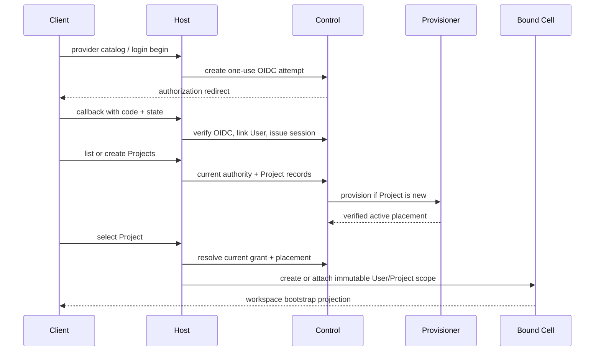

# Project entry flow

## Outcome

A person can authenticate with Google or Microsoft, resume a secure Taurus
session, discover only Projects they may access, create a Project when allowed,
and attach to a Cell immutably bound to that User and selected Project. Project
selection is a Host/Control operation; a Cell never switches Projects.

This is the controlling flow for sign-in, session bootstrap, Project discovery,
Project creation, placement, and Cell attachment. It is not a browser-only
flow: every step except provider interaction must be exercisable by CLI and
integration tests.

## Ownership

| Concern | Canonical owner |
| --- | --- |
| External identity verification and account link | Control identity |
| Login attempt and PKCE verifier | Control identity |
| Session family, CSRF, rotation, sign-out | Control sessions |
| User and exactly-one-Organization assignment | Control Users/Organizations |
| Project owner, home Organization, direct User grants, lifecycle | Control Projects/access |
| Project database allocation, schema verification, credentials, generation | Control provisioning/placement plus operator authority |
| Project workspace preferences | Workspace capability in the Project Database |
| Cell identity and lifetime | Host Cell registry/factory |
| Browser route and projection | Web client; never authority |

## Conceptual flow



The Host may create a fresh same-scope Cell even when another exists. Reuse is
an optimization only. The returned `CellInstanceID` is disposable; the trusted
`CellKey{UserID, ProjectID}` is immutable for the Cell's entire life.

## Target versioned operations

Public HTTP routes are transport mappings over these transport-neutral
operations. The [Control capability operation table](../capabilities/control-and-administration.md#canonical-versioned-control-operations)
is authoritative; this table is the ordered subset used by Project entry.
Exact route spelling is set by OpenAPI when implemented, and a generic HTTP
update/delete verb never substitutes for an operation-specific contract.

| Operation | Class | Effect/result |
| --- | --- | --- |
| `identity.providers.list.v1` | Bootstrap query | Returns admitted identity providers and safe display metadata; never secrets. |
| `identity.login.begin.v1` | Bootstrap command | Creates a one-use bounded OIDC attempt with state, nonce, browser binding, safe return, and PKCE. |
| `organizations.invites.accept.v1` | Bootstrap command | Validates an opaque invitation and binds it to a one-use browser/OIDC login attempt; it does not move an existing User. |
| `identity.login.complete.v1` | Bootstrap command | Consumes the attempt, verifies provider identity, atomically applies a bound first-User invitation before personal-Organization fallback, links/creates the User, and issues an opaque Taurus session. |
| `sessions.current.get.v1` | Bootstrap query | Resolves current session family and returns bounded User/Organization state. |
| `sessions.current.rotate.v1` | Bootstrap command | Rotates the current opaque credential under expected family/generation and replay rules. |
| `sessions.current.sign_out.v1` | Bootstrap command | Revokes the current family and fences its prior permits before success; independently admitted durable-work authorities, standing-work delegations, Task sponsorships, and standing Routine delegations remain. |
| `sessions.user.sign_out_everywhere.v1` | Bootstrap command | Revokes all User families, durable-work authorities/delegations, sponsored Tasks, and standing Routine delegations and fences prior permits before success. |
| `users.current.get.v1` | Bootstrap query | Returns the bounded current User profile, one Organization reference, lifecycle, and versions. |
| `organizations.current.get.v1` | Bootstrap query | Returns the current User's one Organization and safe effective administrative metadata. |
| `projects.list.v1` | Bootstrap query | Returns Projects for which the current User has an effective direct grant under bounded search/filter/group/sort/cursor input and deterministic private pin ordering. |
| `projects.create.v1` | Bootstrap command | Creates a sole-owner Project record and starts idempotent provisioning. |
| `projects.pins.set.v1` | Bootstrap command | Creates or moves the current User's private pin for one visible Project; it grants nothing. |
| `projects.pins.remove.v1` | Bootstrap command | Removes the expected private pin without changing Project access. |
| `projects.pins.reorder.v1` | Bootstrap command | Conditionally reorders the current User's still-visible pinned Projects. |
| `projects.profile.get.v1` | Bootstrap query | Returns exact Project name, description, profile version, owner, caller grant, and lifecycle for selection and Overview. |
| `projects.profile.update.v1` | Administration command | Owner/authorized manager updates name and description under the expected profile version. |
| `projects.status.get.v1` | Bootstrap query | Returns lifecycle and safe progress/failure information. |
| `projects.leave.v1` | Bootstrap command | Revokes/fences only the caller's non-owner direct grant; the sole owner cannot leave. |
| `projects.duplicate.request.v1` | Bootstrap durable command | Creates a new sole-owner destination and coordinates exact source export/destination import under separate authority; source truth is unchanged. |
| `projects.share_links.accept.v1` | Bootstrap command | Accepts an opaque signed-in invitation and materializes only the currently admitted bounded direct User grant. |
| `projects.select.v1` | Host command | Resolves current authority and trusted active placement, then attaches a bound Cell. |
| `workspace.initialize.v1` | Bound command | Idempotently creates the default permanent-destination snapshot when absent. |
| `workspace.get.v1` | Bound query | Returns permanent destinations, tabs, active view, panels, summaries, and canonical versions. |

Organization selection is intentionally absent. A User belongs to exactly one
Organization, returned as profile/administrative context. Cross-Organization
Project access comes from explicit User grants, not an “active Organization”
session switch.

## Login sequence

1. The Host returns a configured provider catalog. Initial production adapters
   are Google and Microsoft/Outlook identity using Authorization Code + PKCE.
   Outlook Mail/Calendar permissions are not requested.
2. Normal entry uses `identity.login.begin.v1`. An invitation link instead uses
   `organizations.invites.accept.v1`, which validates one opaque unconsumed
   invitation and binds its ID/digest to a browser-bound one-use login attempt;
   it does not assign an Organization yet. Both paths validate a relative
   Taurus return target and create high-entropy
   state/nonce/browser binding/PKCE material, stores only safe digests plus an
   encrypted verifier, and returns the provider authorization URL.
3. The callback consumes the attempt exactly once. It verifies browser binding,
   state, nonce, issuer, subject, tenant/provider policy, audience, authorized
   party where required, code exchange, and expiry through mature OIDC/OAuth
   libraries.
4. Identity linking uses the exact case-sensitive issuer and subject (or a
   provider's documented stable composite after validation). Email is profile
   data, never a linking key.
5. In the callback's single Control transaction, an exact valid bound invitation
   is locked and consumed with new User creation and assignment to its
   Organization. Only when no invitation is bound does personal-Organization
   fallback run. An already assigned User, expired/revoked invitation, identity
   collision, replay, or concurrent second callback fails without moving the
   User or consuming the invitation twice. The assignment is a Control
   invariant, not a session preference.
6. Control issues an opaque selector/secret session family. Provider tokens do
   not become Taurus credentials and are not retained as connector tokens.
7. The response sets secure deployment-appropriate cookie and CSRF state and
   redirects only to the validated local return target.

Development may wire a deterministic provider only in an explicitly non-
production profile. Production construction fails if a development provider,
memory store, unsafe callback, unresolved secret, or unverifiable provider
policy is present.

## Existing-session bootstrap

For every protected bootstrap request, the Host:

1. enforces request size, method, Host, origin, cookie, and CSRF rules;
2. resolves the opaque session against durable Control state;
3. checks idle/absolute expiry, family/replay revocation, User status, session
   and User authority generations, entitlement, and applicable action policy;
4. rotates the session when policy requires without changing User identity;
5. returns only bounded profile, Organization, Project summary, and capability
   metadata; and
6. never trusts a cached session decision as mutation authority.

A missing, expired, replayed, or revoked session yields the stable unauthenticated
result and clears browser credentials where safe. It does not disclose whether
an external account or Project exists.

## Project discovery and sharing

`projects.list.v1` evaluates direct User grants and lifecycle. It may return:

- Projects owned by the User;
- Projects shared directly with the User, including Projects whose home
  Organization differs from the User's Organization; and
- safe role/capability summaries needed to render the selection screen.

The query supports bounded text search; explicit lifecycle, caller-role and
ownership filters; allowlisted grouping and stable sorting; and an opaque page
cursor bound to the exact query digest. Private pins are read from Control,
filtered again by current visibility, and applied deterministically within the
selected grouping. Pin state is not a grant and cannot reveal a Project after
access is lost. The selection surface may expose exact actions for create,
pin/unpin/reorder, leave, duplicate, archive/restore and sharing only when the
current operation descriptor says they are available.

It must not return database names, cluster references, credentials, fences,
other Users' grants, or inaccessible Project existence. “Share with
Organization” is an administrative command that materializes an auditable
snapshot of direct grants; the list query still evaluates those User grants.

An administrative share link is an expiring opaque signed-in invitation, not
anonymous bearer access. Acceptance rechecks the current User, current link
generation/count/expiry, current creator/Project policy and optional
Organization restriction, then writes an explicit bounded direct User grant.
Revoking the link prevents later acceptance but does not silently revoke
already materialized grants. Plaintext link tokens do not enter logs, Audit or
stored state.

A non-owner can leave by revoking only their own direct grant and completing
the resulting authority fence. The sole owner must transfer ownership through
the future accepted Q002 ceremony or delete the Project; they cannot leave it
ownerless. Project duplication creates a new destination identity owned by the
requester and uses a durable status flow. Source export and destination import
are separately authorized Project transactions, so neither a generic database
copy nor a cross-Project transaction can bypass isolation.

## Project profile and Overview

Project discovery returns only bounded summaries. Selection and Workspace
Overview load the exact editable Control-owned profile through
`projects.profile.get.v1`. The canonical Project profile is `Name`,
`Description`, and `ProfileVersion`; owner/grant/lifecycle information is
returned as safe adjacent context but is not editable profile data.

Overview saves only through `projects.profile.update.v1` with the expected
`ProfileVersion`. The command returns the committed profile and new version or
an explicit conflict. It cannot change owner, grants, home Organization,
lifecycle, placement, or settings. Those consequences use their separately
named canonical operations and authority rules.

## Project creation and provisioning

`projects.create.v1` accepts bounded name, optional description, and allowed
policy choices, not database or placement input. In one Control transaction it:

1. checks current session, entitlement, create policy, Organization status,
   name bounds, and idempotency;
2. creates the Project with exactly one owner (the current User), one home
   Organization, immutable Project identity, initial profile version, and
   `Provisioning` lifecycle;
3. records required Control Audit, the bounded Project-created `SemanticFact`,
   and a durable provisioning job; and
4. returns the stable Project identity and lifecycle without claiming it is
   usable.

Provisioning is an idempotent operator-authorized state machine:

```text
Provisioning -> Migrating -> Verifying -> Active
       |             |           |
       +-----------> Failed <-----+
```

The worker allocates one logical Project Database, applies and verifies the
Project schema contract, and creates immutable Project identity and mutable
authority fences. It provisions and independently verifies separate least-
privilege principals and typed targets for ordinary Product access, authority-
fence execution, exact receipt proof, exact permit-settlement proof, and
closed-kind terminal finalization. Product, fence, receipt-proof and permit-
settlement targets use `ProductCredentialRef`, `FenceCredentialRef`,
`ReceiptProofCredentialRef` and `PermitSettlementCredentialRef` respectively.
`ProjectFinalizerTarget` is a sealed versioned union whose exact kind must match
one per-kind credential reference; an unknown kind or mismatched reference
fails closed.

Before activation, live positive and negative grant checks prove that each
principal can execute only its schema-owned routines: the Product principal
cannot invoke fence/receipt-proof/Control-settlement/finalizer routines (while
its owning effect UoW can atomically record consumption of the exact permit it
uses); receipt proof cannot mutate or grant authority; permit settlement cannot
consume a permit or perform the effect; and finalizers can execute only their
exact precommitted terminal/restrictive transition. TLS, Project identity,
placement generation and schema are also verified. Control then stores the
trusted typed placements and activates in a final Control transaction. Partial
state is unavailable to product traffic and safe to retry or retire. Project
creation is never a synchronous dual-write that can report success with
missing Project-local truth.

## Selection and Cell attachment

`projects.select.v1` is not a Project mutation. The Host:

1. re-resolves the current durable session and User grant;
2. requires Project lifecycle `Active`;
3. resolves `ProductProjectPlacement` solely from Control;
4. verifies placement generation, Project identity/schema/fence, and a bounded
   least-privilege handle;
5. mints a new disposable `CellInstanceID` or selects a compatible warm Cell;
6. constructs the Cell with an immutable trusted key and isolated scheduler,
   handlers, repository handles, and disposable caches; and
7. returns an attachment token/reference that cannot change the Cell key.

A route `ProjectID` selects which grant to evaluate; it never selects the
database directly. A Cell rejects any operation whose trusted routed scope does
not match its bound key. Project switching creates or attaches another Cell.
Selection resolves only `ProductProjectPlacement`; the Product Host cannot
resolve or substitute the fence, receipt-proof, permit-settlement, finalizer,
Project-Audit, or operator target.

## Workspace bootstrap

After attachment, the first bound query loads the per-User/per-Project
Workspace snapshot and safe summaries. Durable state may contain Overview,
Data, and Agents destinations; Resource tabs; an active permanent destination
or Resource; and panel preferences. New Tab, hover, selection, incomplete
launcher state, pending requests, live clients, and provider objects are
transient.

If no snapshot exists, the Workspace capability deterministically produces the
accepted default. It does not create or select Resources as a side effect of a
read.

## Failure and security behavior

- Unknown provider, issuer, tenant, audience, action, entitlement, placement,
  schema, operation version, or persisted representation fails closed.
- OIDC state/nonce/browser binding and PKCE attempts are one-use and bounded;
  secrets never appear in logs, URLs after callback, JSON, or Audit payloads.
- A User cannot be assigned to a second Organization.
- Project creation cannot yield zero or multiple owners.
- A non-owner cannot perform final deletion or silently change the owner.
- Project selection cannot use request-supplied database, credential, fence,
  region, or placement generation.
- Current-family sign-out reports success only after D007 fences permits sourced
  by that family; it does not silently cancel independently admitted durable-
  work authorities, standing-work delegations, Task sponsorships, or standing
  Routine delegations. Sign-out everywhere also revokes and fences all four
  kinds sponsored by the User. Cell cancellation is
  cleanup, not the security guarantee.
- Late browser responses are generation-fenced by session and selected Project
  so Project A data cannot enter Project B's projection.
- Error responses reveal no inaccessible User, Organization, Project,
  provider-account, or infrastructure existence.

## Headless proof obligations

At minimum, deterministic and live tests must prove:

1. Google and Microsoft protocol adapters against deterministic discovery,
   JWKS, code exchange, nonce, audience, tenant, and key-rotation fixtures.
2. Exact issuer/subject linking and no email linking.
3. One-use login attempts, encrypted verifier restart/multi-instance behavior,
   safe returns, invite binding/expiry/revoke/replay/concurrent callback,
   invited-Organization-before-personal fallback, assigned-User refusal, and
   hostile callback cases.
4. Session rotation, predecessor replay, idle/absolute expiry, current sign-out,
   sign-out everywhere, and no protected commit after effective revocation.
5. One User/one Organization and one Project/one owner invariants under races.
6. direct cross-Organization User grants and no implicit Organization grant.
7. stable bounded discovery search/filter/group/sort/cursors, private pin
   concurrency/visibility pruning, signed-in share-link accept/revoke/expiry/
   count races, owner leave refusal, and source-preserving Project duplication.
8. Project provisioning restart at every state transition plus live positive/
   negative grants for the separate Product, fence, receipt-proof, permit-
   settlement and each installed closed-kind finalizer principal.
9. request-supplied placement/credential/fence attacks and typed-target/
   finalizer-kind substitution fail, including across independent Hosts with
   caches disabled.
10. same User/different Project and different User/same Project Cell isolation.
11. Workspace first-open, restart, optimistic conflict, transient-state
    exclusion, and stale-response generation fencing.

## File map for implementation

```text
internal/host/bootstrap/              login/session/Project entry orchestration
internal/host/routing/                pre-Cell and attached request routing
internal/host/cells/                  Cell construction, registry, supervision
internal/control/identity/            OIDC account and attempt domain
internal/control/sessions/            session families and revocation
internal/control/users/               User and one-Organization invariant
internal/control/organizations/       Organization administration
internal/control/projects/            ownership, grants, lifecycle
internal/control/projects/pins/       pre-Cell private Project pin sets
internal/control/projects/sharelinks/ signed-in bounded invitation authority
internal/control/projects/copy/       durable isolated Project duplication
internal/control/access/              current durable action decisions
internal/control/placement/           trusted Project placement
internal/control/provisioning/        durable provisioning state machine
internal/control/authority/           one-use permits and revocation fences
internal/capabilities/workspace/      per-User/per-Project view model
internal/wiring/{testing,development,production}/
api/openapi/                          versioned public contract
```

## Grounding

Omega authority: [`control-and-project-boundary.md`](../architecture/control-and-project-boundary.md),
[`system-map.md`](../architecture/system-map.md), D002, D004, D005, D007,
D011, and [`glossary.md`](../glossary.md).

Taurus target: [Operation Keystone](https://app.notion.com/p/394b6410e5028183af47f2bd097fadb4),
[SOL X 14 — Project Selection](https://app.notion.com/p/39ab6410e5028114883af87b51fccc3b),
[SOL X 20 — Organizations, Identity & Sessions](https://app.notion.com/p/39ab6410e50281b0b809d2cce095584d),
[SOL X 21 — Access, Projects & Sharing](https://app.notion.com/p/39ab6410e502814babc4e727a3437c9b),
and [SOL X 00](https://app.notion.com/p/39ab6410e5028158b555c9a34752e292),
with Omega relationship and runtime decisions taking precedence.

Nova evidence: durable identity/session/Project/Workspace composition in
[`internal/app/productworkspace/durable.go`](https://github.com/gccurtis/merkabah/blob/3df790b2ac736f644e577ae4e6f4e899e6e85b6d/taurus-nova/internal/app/productworkspace/durable.go),
the live MySQL journey in
[`durable_composition_integration_test.go`](https://github.com/gccurtis/merkabah/blob/3df790b2ac736f644e577ae4e6f4e899e6e85b6d/taurus-nova/test/integration/durable_composition_integration_test.go),
and the limitations recorded in [`../nova-evidence.md`](../nova-evidence.md).
