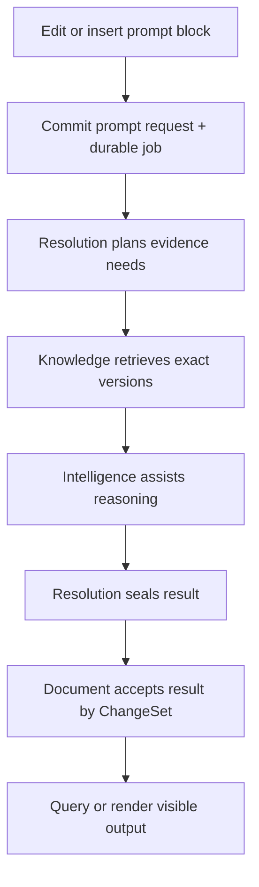

# Prompt resolution flow

## Outcome

A Document prompt block turns a User's prompt into inspectable, grounded,
refreshable output without making the browser, model provider, or stale
generated text authoritative. The flow records exact evidence, policy,
reasoning decisions, provider-neutral results, visible output, User edits,
history, provenance, and staleness as distinct concepts.

Prompt blocks are owned by Documents. Retrieval is owned by Knowledge.
Planning/reasoning/result sealing is owned by Resolution. Model and embedding
calls are owned by Intelligence. Handlers connect them through explicit
consumer-owned contracts and durable jobs; there is no event runtime.

## Ownership boundaries

| Owner | Owns | Explicitly does not own |
| --- | --- | --- |
| Documents | Prompt block identity/location, prompt source, visible output, accepted generated output reference, display history, User edits, block status/staleness, Document ChangeSets | retrieval algorithms, model clients, provider routing, Resolution evidence/result internals |
| Knowledge | eligible exact-version Sources, windows/indexes, retrieval, sufficiency, grounded regions, artifacts, dependencies and staleness | conclusions, provider reasoning, Document presentation |
| Resolution | intent, plan revisions, evidence requirements, decisions, reasoning state, sealed result, receipts, pause/resume/failure | Document mutation, source truth, provider SDKs, User authorization |
| Intelligence | provider-neutral casts, routing epoch, provider adapters, serviceability, normalized responses, usage/receipts, budgets | Resource truth, Knowledge facts, prompt-block presentation |
| Handler/job runner | current authority, repository loading, contracts/adapters, idempotency, permits, transactions, jobs, Audit, failure mapping | domain invariants owned above |

## Core domain records

The names are directional; capability construction pages own final Go shapes.

```go
// Documents-owned
type PromptBlock struct {
    BlockID              BlockID
    Prompt               DisplayContent
    Status               PromptStatus
    ActiveRequestID      *PromptRequestID
    AcceptedResultID     *ResolutionResultID
    GeneratedDisplay     *DisplayContent
    VisibleDisplay       DisplayContent
    VisibleEditedByUser  bool
    DisplayRevision      uint64
    History              []PromptDisplayHistory
    Staleness            Staleness
}

// Resolution-owned
type ResolutionRun struct {
    ID, PromptRequestID  string
    Intent               ResolutionIntent
    PlanRevisionID       string
    Evidence             []EvidenceRef
    Decisions            []DecisionRef
    State                ResolutionState
    ResultID             *string
    PolicyRevision       string
    RoutingEpoch         string
    Version              uint64
}
```

`PromptBlock.Prompt`, `GeneratedDisplay`, and `VisibleDisplay` are different.
User editing visible output never changes the prompt or sealed Resolution
result. Marks apply to visible display content, not hidden prompt/control data.

A `ResolutionResult` is immutable once sealed. It contains normalized generated
material, exact evidence/source versions, decisions, relevant reasoning trace
or summary, provider receipts, usage, policy/routing identities, timestamps,
and safe failure/quality metadata. Raw provider clients, credentials, request
objects, and unbounded provider payloads never enter it.

## Document consumer contract

Documents declares what it needs in Document vocabulary:

```go
type PromptResolutionProvider interface {
    Start(ctx context.Context, req PromptResolutionRequest) (ResolutionRef, error)
    Inspect(ctx context.Context, ref ResolutionRef) (PromptResolutionView, error)
}
```

The Documents package does not import Resolution, Knowledge, or Intelligence
implementations. In deterministic capability tests, a fake provider returns
fixed results. In Product wiring, the handler adapter maps this contract to
registered Resolution operations and durable jobs. Long work does not run
inside an interactive Cell worker or hold a Project transaction/permit.

## End-to-end flow



### 1. Insert or edit the prompt block

`documents.submit_changes.v1` creates or edits a prompt block through the normal
Document mutation flow. The capability enforces stable block identity, valid
display structure, bounds, extraction policy, and head preconditions.

Editing prompt source:

- preserves the last visible output as historical/stale material;
- clears any claim that the old result satisfies the new prompt;
- increments the Document head and prompt display/control revision;
- sets status to draft or dirty according to the accepted state model; and
- does not start inference as an invisible side effect unless the command
  explicitly requested resolution.

Generated prompt output is excluded from Knowledge ingestion by default unless
a User explicitly marks it canonical under policy. Otherwise the system could
ground future answers in its own unreviewed output.

### 2. Request resolution

`documents.resolve_prompt.v1` accepts `DocumentID`, `PromptBlockID`, expected
Document head/display revision, resolution policy choice, and idempotency key.
The Document handler:

1. checks current request authority and loads the canonical Document;
2. calls Documents to validate the block and construct a bounded
   `PromptResolutionRequest` with stable `PromptRequestID`, `ResolutionRunID`,
   `WorkAuthorityID`, and `JobID` values;
3. while the initiating session is current, asks Control to create an exact
   `DurableWorkAuthority{PendingProjectReceipt}` bounded to those identities,
   the Document/block/request, the allowed Resolution/Knowledge/Intelligence/
   Document effects, budgets, dependency generations, and expiry;
4. obtains a fresh **session-sourced** one-use permit and, in one Project UoW,
   commits the Document ChangeSet that records `queued`/active request identity,
   exact Resolution job, non-authoritative work receipt, idempotency, required
   Project Audit, the declared queued fact, and the registered
   `durable_job@1` finalization record;
5. after commit, sends a trusted idempotent acknowledgement for that exact
   Project receipt, which alone moves the Control work authority to `Active`;
   and
6. returns the canonical Document head plus stable job/request references.

This commit is the durable handoff. A crash after success cannot lose the work,
and a retry cannot enqueue it twice. The queue record contains stable references
and hashes, not an entire browser/editor snapshot.

The pending Control record is not an ordinary permit source. If the Project
commit is absent, the orphan expires/revokes without being able to run. If the
Project commit succeeded and only acknowledgement was lost, reconciliation
reads the exact receipt through the trusted Project placement and activates
the same work authority; it never creates a replacement Job or guesses from a
caller payload.

### 3. Reconstruct and plan

A Host-supervised worker claims the exact `JobID` by lease and reconstructs the
trusted User, Project, operation, current placement, matching Project receipt,
and **active** `DurableWorkAuthority{WorkAuthorityID, WorkGeneration, JobID}`
from durable state. It never trusts serialized database credentials, a
caller-supplied Cell key, the pending authority, or the receipt by itself.

Every later canonical Project effect—Resolution checkpoint, Knowledge
acquisition/index publication, Intelligence call admission, sealed Result,
Document acceptance, and declared follow-up Job—obtains a fresh exact permit
sourced by that active work authority. The handler validates the matching
Job/receipt, expected generation, operation/target ceiling, remaining budget,
and current User/grant/policy/entitlement dependencies in the effect's own
Project transaction. No permit is held across retrieval, embedding, inference,
or other external work.

Signing out the initiating browser's current session family does not cancel
this explicitly admitted independent work. Sign out everywhere, User disable
or removal, Project-grant/policy/entitlement loss, work cancellation, expiry,
or explicit revoke denies new work-sourced permits and fences any issued ones
before reporting effective.

Resolution creates or resumes an idempotent `ResolutionRun`. It interprets the
bounded prompt intent, selected scope, policy, required output form, evidence
requirements, approval points, and budget into a versioned plan. It may report
insufficient specification before any model call. Plan revisions are immutable;
resume continues an exact revision or deliberately creates another.

### 4. Retrieve exact evidence

Resolution invokes Knowledge through a narrow port/registered query. Knowledge:

1. authorizes the selected corpus/Source scope under the bound Project;
2. resolves exact eligible Source versions and extraction policy;
3. executes retrieval using its current published index identity;
4. optionally compares or audits against exact scan according to policy;
5. evaluates sufficiency and contradiction signals without inference;
6. returns grounded regions, source/artifact/version identities, scores and a
   bounded retrieval audit; or
7. returns `insufficient` rather than fabricating context.

The Knowledge lattice is replaceable. The sealed evidence references canonical
Source versions and retrieval identity, not a mutable lattice node as truth.

### 5. Reason and generate

When evidence and policy allow, Resolution calls Intelligence with a
provider-neutral cast and bounded request. Intelligence selects an admitted
route at a published routing epoch, checks provider/model serviceability and
policy, applies time/token/cost/tool bounds, and returns normalized output plus
a minimized receipt.

Resolution, not Intelligence, owns:

- evidence-to-claim mapping;
- detected contradictions and insufficiency;
- explicit decisions and alternatives;
- plan continuation, pause, or approval requirement;
- verification/retry strategy; and
- the final provider-neutral result.

Provider failure preserves the run, evidence, decisions, and safe diagnostic
state. A retry is a new Attempt under the same run/step, not a rewrite of the
prior receipt. Routing changes do not hot-switch an in-flight attempt.

### 6. Seal the Resolution result

Resolution validates output form and required citations/evidence, records all
decisions and receipts, and seals an immutable `ResolutionResult`. This is its
own idempotent Project mutation with the exact active work authority, a fresh
work-sourced permit, required Audit, and no Document effect. If Document
acceptance later fails, the sealed result remains a safe unattached result that
can be retried or inspected; it is never mistaken for visible Document state.

### 7. Accept into the Document

The worker invokes `documents.submit_changes.v1` with a typed
`accept_prompt_result` ChangeSet carrying the stable request, result, block,
and expected prompt/display identities. The Document handler:

1. rechecks the exact active work authority and its dependencies; if revoked,
   no new permit is issued;
2. loads the latest Document and exact sealed Resolution result;
3. calls Documents to verify the block still refers to that request and the
   prompt has not materially changed;
4. applies the accepted result as a Document ChangeSet, updating generated
   display, source refs, history, status, result identity, and provenance;
5. follows ordinary-versus-force adoption rules for a User-edited visible
   display;
6. obtains and atomically consumes a new work-sourced one-use permit with
   Document state, idempotency, required Audit, and any narrowed follow-up
   jobs/receipts; and
7. returns the canonical Document head/result.

No permit is held during retrieval or model inference. If access is revoked
while a provider call is running, the provider attempt can be safely recorded,
but the Document mutation cannot commit after revocation is effective.

`durable_job@1` is the only finalization kind needed for the Resolution Job.
Its separately typed finalizer may terminalize only that exact admitted Job
bookkeeping under the closed registry; it cannot change Resolution run,
Evidence, Result, dependency, pointer, or Document state. Any such capability
effect still requires a fresh ordinary work-sourced permit before revocation,
or remains nonterminal. Provider accounting uses the separately registered
`intelligence_reservation_call@1` for its exact pre-admitted call/reservation.
Neither finalizer may invoke or retry a provider, seal a Result, accept
Document output, create a Source, enqueue new effect work, widen authority, or
resurrect the run.

## Refresh and force refresh

`documents.resolve_prompt.v1` with `mode=refresh` creates a new request linked
to the previous result and current exact Sources. It does not overwrite
history. Ordinary refresh:

- keeps stale visible output during work and failure;
- preserves a User-edited display when the newly generated material is not a
  material change under Document policy; and
- records the new generated result and source versions independently.

`documents.resolve_prompt.v1` with `mode=force_refresh` is explicit User intent
to start the replacement path; the Resolution side uses
`resolution.force_refresh.v1` for the exact candidate. Adoption still commits
through `documents.submit_changes.v1` after success and is subject to the same
authority, evidence, version, and permit rules. “Force” never means bypassing
Knowledge, authorization, policy, Audit, or conflict checks.

## Source change and staleness

When a canonical Source changes or is removed, the live-session owner handler
preselects one Resolution `DependencyChangeID`, reconciliation generation,
`WorkAuthorityID` and `JobID` and creates the pending Control work authority.
The same Project transaction that commits the exact owner mutation invokes the
bounded internal admission operation
`resolution.dependency_changes.reconcile.v1` and stores the Resolution intent,
single Job, non-authoritative receipt, idempotency, required Audit/fact and
finalization record. There is no intermediate owner follow-up Job.

After trusted acknowledgement activates that exact work authority, its worker
rereads the immutable owner change and pages affected dependencies directly.
Each `resolution.dependency_changes.apply_page.v1` commit uses a fresh permit
from the same active WorkAuthority/Job/receipt/generation and conditionally
records bounded hard/soft dirty causes. The worker never calls a durable
request operation or admits replacement work. Documents receives no undefined
mark-dirty command: it keeps the last accepted Output and derives visible
staleness from the mount's current Resolution projection.

Correctness can also be computed by comparing stored dependencies with current
Source versions on query. Notifications and realtime invalidations merely make
the UI learn sooner. No universal ordered event stream is required.

Dirtying a prompt block:

- never erases last accepted/visible output;
- identifies which dependencies changed or disappeared;
- never silently re-runs inference if policy requires User approval;
- is idempotent; and
- does not make a stale result canonical Knowledge.

`resolution.dependency_changes.status.get.v1` exposes bounded reconciliation
progress. Duplicate delivery returns the same change identity; crash recovery
continues from the committed cursor; stale index/generation pages cannot alter a
newer Resolvable. A failed owner transaction leaves no Project Job/intent and
the pending Control orphan expires; commit-before-acknowledgement recovery
activates only the exact receipt. Exact owner-command replay returns the same
DependencyChange/Work/Job identities.

## Status model

Resolution runs use the exact canonical capability enum:

```text
queued -> planning -> retrieving -> sealing -> checking_contradictions
       -> reasoning -> validating -> awaiting_resolution | awaiting_review
       -> settling -> succeeded

terminal alternatives: failed | canceled | superseded
```

Resolution-run state and the derived Document prompt-display enum (`current`,
`dirty`, `resolving`, `failed_with_last_good`, `needs_resolution`, or
`unresolved`) are related but never interchangeable. A run may be `failed`
while the Document still shows a stale prior Output. A Result may be sealed but
not settled because the prompt changed.

## Failure behavior

- No grounding or insufficient evidence produces an inspectable insufficient
  result, not a confident fabricated answer.
- A changed prompt/block/head causes superseded/conflict, not application of an
  old result to new text.
- Deleted/inaccessible Sources are not returned from caches or sealed under a
  new run.
- Provider timeout/outage is retryable only within declared budgets and never
  erases a prior visible display.
- Receipt, error, logs, Audit, and telemetry redact prompts/content according to
  policy and never contain provider secrets.
- Lease loss fences the stale worker. A later worker resumes from durable state;
  duplicate acceptance is prevented by idempotency and request/result identity.
- A pending work authority cannot claim or mutate the Job; a missing receipt
  expires as an orphan, and a lost acknowledgement activates only after exact
  trusted receipt verification.
- Current-family sign-out preserves the accepted run, while User-wide,
  grant/policy/entitlement, cancellation, expiry, or explicit revocation denies
  and fences every later canonical effect.
- Unknown evidence/result representation, routing epoch, operation version, or
  required Audit fails closed.

## Headless example

```text
1. Create Document D and prompt block B at head H1.
2. Ingest exact Sources S1@V3 and S2@V8 into Knowledge.
3. Call documents.resolve_prompt.v1(D,B,H1,I1); record stable work/job IDs,
   pending Control authority, exact Project receipt, and trusted activation.
4. Run durable workers deterministically with fake Knowledge/Intelligence,
   obtaining a fresh work-sourced permit for each canonical effect.
5. Inspect Resolution R: plan, evidence S1@V3/S2@V8, decisions, receipt, result.
6. Query Document: head H3, accepted result R, visible generated output.
7. Edit visible output; prove Resolution R remains immutable.
8. Update S1 to V4; run staleness job; prove old display remains but is dirty.
9. Ordinary refresh; prove User display preservation policy and bounded history.
10. Force refresh; prove new generated display is explicitly adopted.
11. Render canonical Document as Markdown/JSON without a browser.
```

## Proof obligations

- deterministic Documents tests use a fake `PromptResolutionProvider` with no
  infrastructure or sibling implementation import;
- Knowledge retrieval is exact-versioned, authorized, inference-free, and can
  refuse insufficient context;
- Resolution results are immutable and separately inspectable from visible
  output;
- every Document or Resolution mutation follows the permit/UoW/Audit contract;
- revocation during a long provider call prevents later protected commit;
- pending/receipt/acknowledgement, lost-ack reconciliation and orphan-expiry
  tests prove no pending authority or receipt can issue an ordinary permit;
- current-family sign-out permits the explicitly admitted run to finish, while
  User-wide/grant/policy/entitlement/cancel/expiry revocation denies/fences it;
- closed `durable_job@1` and `intelligence_reservation_call@1` finalizers settle
  only their pre-admitted Job/accounting records and cannot change capability
  state, create output, or retry provider work;
- prompt edits, result acceptance, refresh, source changes, and lease races are
  idempotent and conflict-safe;
- source-change fault injection proves the owner effect and exactly one
  Resolution reconciliation intent/Job/receipt commit together, the worker
  pages directly, and no job-to-durable-command-to-job chain can occur;
- stale/failed runs preserve prior visible content and history;
- generated output is excluded from Knowledge by default;
- provider clients/secrets/raw payloads do not enter Resource state; and
- the full journey runs with deterministic fakes and with admitted live
  providers under explicit non-certification/prod evidence labels.

## Implementation map

```text
internal/capabilities/resources/documents/   prompt block, ChangeSets, display/history
internal/capabilities/resolution/            plan, run, decisions, sealed result
internal/capabilities/knowledge/             Sources, retrieval, sufficiency, staleness
internal/capabilities/intelligence/          provider-neutral model/embedding contracts
internal/cell/handlers/documents/            prompt request and result acceptance
internal/cell/handlers/resolution/           run state and durable work
internal/cell/handlers/knowledge/             authorized retrieval adapters
internal/cell/handlers/intelligence/          provider adapters, policy, receipts
internal/host/jobs/                           trusted job reconstruction/supervision
```

## Grounding

Omega authority: D003, D006–D009,
[`capability-model.md`](../architecture/capability-model.md),
[`resource-mutation.md`](resource-mutation.md), and
[`jobs-audit-observability.md`](../architecture/jobs-audit-observability.md).

Taurus target: [Operation Vellum](https://app.notion.com/p/394b6410e502819c9cf1e59c10fba631),
[Operation Manuscript](https://app.notion.com/p/395b6410e5028176a30de7f8d7fc25b8),
[Operation Lattice](https://app.notion.com/p/394b6410e50281c88ab9e42ba2d140ce),
and [SOL X 00](https://app.notion.com/p/39ab6410e5028158b555c9a34752e292).

Nova working legacy evidence: prompt lifecycle in
[`internal/document/promptblock`](https://github.com/gccurtis/merkabah/tree/3df790b2ac736f644e577ae4e6f4e899e6e85b6d/taurus-nova/internal/document/promptblock),
Knowledge retrieval and dirtying in
[`internal/knowledge`](https://github.com/gccurtis/merkabah/tree/3df790b2ac736f644e577ae4e6f4e899e6e85b6d/taurus-nova/internal/knowledge),
and provider adapters in
[`internal/intelligence`](https://github.com/gccurtis/merkabah/tree/3df790b2ac736f644e577ae4e6f4e899e6e85b6d/taurus-nova/internal/intelligence).
The complete governed durable flow is target-only.
