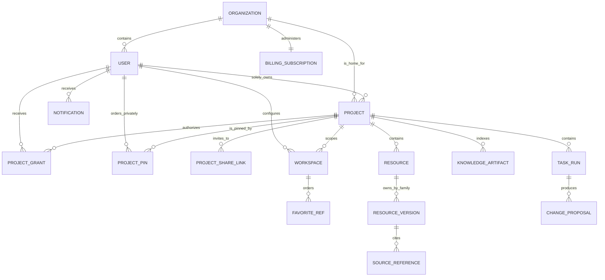

# Product domain model

## Ownership graph

The diagram shows identity and reference relationships, not a proposal for one
relational schema. Canonical family models remain separate.

## Control identities

### Organization

The administrative home for Users and Projects. It owns policy defaults,
entitlements, provider/connector policy, security posture, retention, billing,
and administrative Audit. A User has exactly one Organization.

### User

A Taurus person linked to one or more exact external identities but belonging
to one Organization. The User owns profile and account preferences, session
families, private Notes/Memory scopes, and may own or receive grants to
Projects.

### Project

The collaboration, authorization, canonical content, database placement, and
Cell scope boundary. It has one home Organization and one sole User owner. It
can authorize specific Users from any permitted Organization.

### Project grant

A current durable permission relationship between one User and one Project.
It carries explicit role/actions and authority generation. It is not identity,
Organization membership, entitlement, or sole ownership.

### Project pin and share link

A Project pin is a private pre-Cell ordering preference over a currently
visible Project. A share link is expiring signed-in invitation authority whose
acceptance materializes a bounded direct User grant. Neither is itself Project
access. Plaintext share tokens are not canonical state.

### Subscription and usage

An Organization subscription is reconciled commercial state. Finite usage
reservations and immutable normalized ledger entries account for exact
provider-backed intents. They may shape entitlements/budgets but cannot grant
Project access or act as mutation authority.

## Runtime identities

### Session family and session

Opaque Taurus browser credentials rooted in a verified external sign-in.
Family lineage supports rotation/replay and current-family sign-out without
silently canceling independently admitted durable-work authorities, standing-
work delegations, Task sponsorships, or standing Routine delegations. User-wide
sign-out revokes and fences all four kinds sponsored by that User.
Authenticators and one-use step-up/recovery ceremonies are separate Control
state: WebAuthn/passkeys are preferred, TOTP/recovery are fallbacks, and
enterprise OIDC/SAML remains standards-based external identity proof.

### Cell key and instance

`CellKey(UserID, ProjectID)` is immutable trusted authority scope.
`CellInstanceID` identifies one disposable in-memory execution instance. The
same key may have several instances without creating several canonical truths.

### Operation, execution, and permit

An Operation is a versioned callable contract. An Execution is one admitted
attempt with actor/delegation, deadline, budget, trace, and bound Cell key. A
mutation Permit is fresh, exact, one-use commit authority validated in the
Project transaction; it is not a session or reusable capability token.

## Project content

### Resource identity

Family-owned stable identity and metadata used to name, open, archive, search,
and reference that Resource. A cross-family Project catalog may project a
bounded summary, but it cannot mint identity, own lifecycle/title, or define
the family's version/conflict semantics.

### Resource family

- **Document**: structured blocks/atoms/marks, semantic styles, typed image/
  embed/chart/metric/table blocks, prompt-output revisions, references,
  templates, and base/ChangeSet/head history. Collaboration owns comments.
- **Workbook**: worksheets, cells/ranges, tables, names, formulas, formats,
  bindings, calculations, and revisions.
- **Deck**: slides, layouts, elements, themes, notes, references, and render
  versions.
- **Board**: freeform canvas/dashboard views, objects, connectors, embeds,
  layers, frames, and viewport-independent state.
- **Chat**: threads/messages, participant/agent attribution, attachments,
  grounded responses, static/standing SavedOutputs with immutable presentation
  history, promoted outputs, and governed edit/delete/redact lifecycle.
- **File**: immutable content versions, durable multi-file/folder UploadBatch
  intake, metadata, processing/extraction state, download policy, and source
  relationships.

### Source and artifact

A Source is an authorized exact-version content reference. A Knowledge Artifact
is a normalized, immutable Project-scoped representation derived from a Source
or canonical Resource version, with lineage and integrity. Neither a mutable
URL nor a provider citation is sufficient.

### Knowledge lattice and corpus

The Knowledge lattice organizes artifacts for retrieval. A Corpus is an
explicit authorized set/definition of sources/artifacts used by retrieval. The
lattice is Project knowledge state, not agent Memory.

### Resolution

A durable reasoning workflow containing request intent, plan, retrieval,
Evidence, contradictions, decisions, provider calls, Result, status, and
pause/resume state. The owning Resource incorporates an editable Output; the
Resolution Result remains immutable evidence of what was produced.

### Formula and data

Formula is a pure typed expression system. Named formulas/tables and structured
data objects are Project state with stable schemas/identifiers, versions,
lineage, and provenance. Formula cannot call Knowledge, models, networks, or
mutate Resources.

### Agent, Instruction, Persona, trigger, Routine, Task, and proposal

An Agent is a bounded principal/configuration with explicit grants and budgets.
An Instruction is an immutable versioned operating directive; a Persona is a
versioned interaction perspective and grants no authority. A DeclaredTrigger
describes admitted activation input; a Routine binds a published trigger to a
finite standing delegation. A Task is a durable plan/run state machine with
queryable plan versions, step attempts and explicit retry-node records. Agent
effects use ordinary Product operations and may produce proposals/ChangeGroups
requiring review.

## Context and projections

- **Workspace:** durable per-User/per-Project view/tabs/panel state plus a
  separate private ordered Resource/Data favorite set.
- **Activity:** authorized human-readable projection of semantic committed
  facts.
- **Working Context:** short-lived bounded current objective/focus/open loops.
- **Memory:** governed evidence-linked preference/procedure/heuristic; never
  authorization or factual Evidence.
- **Search/Data Catalog:** rebuildable access-shaped projections over canonical
  owners.
- **Change control:** owner-routed history/diff/inverse coordination,
  Proposals, ChangeGroups, review decisions and undo attempts; never a universal
  canonical change log.
- **Notifications:** recipient-scoped attention/delivery records derived from
  committed safe facts; read/dismiss/snooze never changes source truth or
  authority.
- **Audit:** transaction-local immutable security attribution, not a product
  activity feed.
- **Telemetry/logs:** operational signals, not product truth.

## Global invariants

1. IDs are typed and scope cannot be substituted through payload fields.
2. Every canonical value has one named owner.
3. Resource family payloads and version semantics do not collapse into generic
   Resource metadata.
4. Exact source/version lineage is preserved across derived results.
5. Provider objects, secrets, and runtime handles never enter canonical state.
6. A User-facing projection cannot grant access or replace canonical state.
7. Cross-resource groups expose partial progress/compensation; they do not
   pretend to be distributed transactions.
8. Delete/archive/retention semantics are explicit per owner and cannot break
   required Audit, recovery, or surviving references silently.
