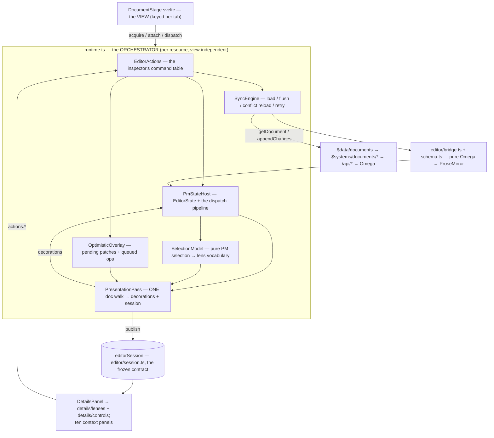

# Architecture — the document editor

How a document goes from Omega's canonical model onto the page, and how a keystroke
goes back. This is the conceptual map; the named files' `.md` companions hold the
line-by-line detail, and the seams below
records the deliberate boundary seams.

**Reading path:** this doc → the companions of the modules it names → the discrepancy
entry. The block/typography half of the model has its own entry,
[document-block-and-style-model.md](document-block-and-style-model.md).

## 1. The idea

Omega owns the canonical document: a named **base** of `rows → blocks → atoms
(+ marks)`, mutated only by appending **change sets** — ordered groups of atomic,
**id-addressed** ops (`insert_row`, `set_atom_text`, `set_block_subkind`, …). The
browser is never the source of truth.

The editor is therefore an interaction surface over that model (per
[reference/document-editor.md](../support/reference/document-editor.md)): ProseMirror
renders and captures intent locally, and a thin, pure translation layer converts
between the two worlds. Nothing edits "the document" directly — everything becomes ops.

One product decision shapes every surface below: **editing must feel like a text
editor.** The block model *is* the data model and stays — rows, blocks, atoms and their
ids are what the runtime, the ops and the sync loop speak — but the editing surface
carries no block-manipulation chrome: no gutter handles, no drag affordances, no
per-block toolbars. You get one continuous flow of text and a caret; blocks are the
machinery underneath, not something the user arranges.

## 2. The layer model

All document code lives under `src/lib/features/stages/document/` — the stage (a view),
the runtime and the `model/` collaborators it composes, the ProseMirror machinery
(`editor/`), and the panels the document contributes to the shell (`panels/`). Domain
types and HTTP clients live one level out in `src/lib/systems/documents/`, reached under
the repo's one import convention: `$data/documents` is the system's single facade, and
`$systems/documents/<submodule>` is the precise import when a caller wants exactly one
module. There are no other document facades.



**The stage is only a view.** `DocumentStage.svelte` mounts the `EditorView`, draws the
three-zone document bar (double-click rename, centered relative edit stamp with the real
last-editor name and the save label, Markdown export, open-user avatars with profile
hover cards) and one continuous paper sheet, and joins/leaves the presence session. It
holds no document state: it attaches to the runtime on mount and detaches on unmount,
leaving the runtime alive and syncing.

**The runtime is a thin orchestrator.** `runtime.ts` is ~543 lines and owns no
mechanism of its own. It constructs the collaborators in `model/`, runs the one
presentation pass, projects the `EditorSession` the panels render from, publishes the
surface contribution, and exposes `state`/`dispatch` for the view. Everything else is a
named collaborator: `model/pm-state.ts` (the `EditorState` and the transaction
pipeline), `model/selection.ts` (the pure translation to the inspector's vocabulary),
`model/overlay.ts` (optimistic patches plus the direct-op queue), `model/sync.ts`
(server truth and the whole change pipeline), `model/presentation.ts` (the single doc
walk), `model/actions.ts` (the two dozen commands the inspector calls), plus
`model/panels.ts` (the rail section list) and `model/search.ts` (find/replace as a pure
read).

What keeps that composition honest is that each collaborator reaches back through a
**declared, compiler-checked interface** the runtime implements — `PmHost` (4 members),
`IndentHost` (2), `SyncHost` (9), `ActionsHost` (9). A collaborator cannot quietly grow
a dependency on the runtime; it has to widen an interface, in public.

```text
src/lib/features/stages/document/
  DocumentStage.svelte      the view: EditorView, document bar, one continuous paper
  runtime.ts                the orchestrator: composes model/*, runs the presentation
                            pass, projects the session, publishes the panel sections
  model/                    ── RUNTIME BEHAVIOUR ──
    pm-state.ts  selection.ts  overlay.ts  sync.ts
    presentation.ts  actions.ts  panels.ts  search.ts
  editor/                   ── INTERACTION FUNCTIONS + ProseMirror plumbing ──
    session.ts              THE CONTRACT: EditorSession, SelectionInfo, EditorActions
    bridge.ts  schema.ts  list-commands.ts
    presentation-plugin.ts  selection-highlight.ts
  panels/
    DetailsPanel.svelte     42 lines: empty state, layout-gate notice, lens dispatch
    details/lenses/         NoneLens, RunLens, NewTextLens, NewBlockLens, BlockLens
    details/controls/       thirteen controls, each owning the state it uses
    details/lens-helpers.ts the pure bits the lenses share
    shared/                 CanonicalLayoutNotice.svelte — the layout-gate notice
    InfoPanel … HistoryPanel        the ten context panels

src/lib/systems/documents/  ── TYPES / CONTRACTS / DOMAIN ──
  types.ts  api.ts  block-kinds.ts  styles.ts  layout.ts  sanitize.ts
  io.ts  comments.ts  references.ts  collaboration.ts  ai-tasks.ts  index.ts
```

Tabs (`data/workspace.ts`) reference resources by **`resourceId`**, and the resource
registry (`$systems/resources/registry`) keys runtimes off that reference — the client
runtime model
([plans/2026-07-21-client-runtime-model.md](../archive/plans/2026-07-21-client-runtime-model.md)).
`runtime.ts` registers the `document` factory with it at import time and
`acquireDocument()` is the convenience wrapper; the registry's workspace watcher
disposes a runtime when its tab closes or the project changes. Because the runtime
outlives the view, tab switches keep content, selection, undo history and background
syncing — and a script or agent can drive a document through
`acquireDocument(...).actions` with no UI at all. Wiring around it: `WorkSurface.svelte`
routes a `resource` tab whose kind is `document` to the stage;
`routes/projects/[id]/+page.svelte` selects the project on the session at entry, because
every document API is project-scoped.

**The panels are connected without coupling.** `editor/session.ts` is the seam: the
runtime publishes an `editorSession` (doc metadata, counts, per-row heights, outline,
the style/typography maps, prompt data, the live selection in the inspector's
vocabulary, and the `EditorActions` panels may invoke); the panels read it. The document
contributes its complete left-rail vocabulary — **Info, Search, Outline, Layout,
Templates, References, Name Manager, Comments, AI Tasks, History** — from
`model/panels.ts`, so project-level context does not follow the user into document
editing, and one **Details** section on the inspector rail. `DetailsPanel.svelte` is a
42-line dispatcher: the empty state, the canonical-layout notice, and a switch onto the
lens for the current selection. **Lens** is this project's word for a per-selection
inspector view; each lens under `details/lenses/` takes exactly its narrowed
`SelectionInfo` variant and composes controls from `details/controls/`, every control
owning its own state.

The stage publishes those sections through the surface store
(`src/lib/features/shared/surface.ts`): document context replaces the shell's
project-context fallback, while inspector contributions merge with its permanent
sections. The panels never import ProseMirror; the shell never imports the document
feature (its one stage import point is `WorkSurface`, the sanctioned stage router). The
contract is
[plans/2026-07-21-panel-system-design.md](../archive/plans/2026-07-21-panel-system-design.md).

**The dependency rule** (what keeps it modular): the stage imports the runtime and
presentation components; the runtime imports `model/*`, the bridge and the schema;
`model/*` imports the bridge, the session types and `$data/documents`, never the stage
and never a panel; `bridge.ts` imports only `schema.ts` and the *types* from the
documents system; `schema.ts` imports `prosemirror-model` and the sanitizers; the
systems layer imports only `data/api.ts`. Nothing imports upward, the bridge and the
selection/presentation models perform no I/O and touch no DOM, and the API layer knows
nothing about ProseMirror. You can unit-test `diffDoc`, `deriveSelection` or the overlay
with plain objects, or replace transport behind `SyncEngine`, without changing the stage
— which is exactly what the unit tests beside those modules do.

## 3. Concept → implementation map

| Concept (Omega) | Typed in | Rendered by | Written back by | Where you see it |
| --- | --- | --- | --- | --- |
| Document (name, base) | `Doc` — `systems/documents/types.ts`; `Resource` — `data/resources.ts` | `omegaToPmDoc` — `bridge.ts` | content via change sets; name via `renameResource` | Editable title in the document bar + relative edit/save status |
| Row (horizontal group) | `Row`, `Track`, `RowStyle` | flattened into one vertical node list; kept as each node's `rowId` attr | Enter/paste → `insert_row`; deliberate columns → `insert_block` (`addColumn`) | Line spacing (a row min-height) and side-by-side column widths |
| Block — the 7 kinds | `Block`, `BlockKind`, `blockKinds` — `block-kinds.ts` | `blockNode` → `paragraph` / `heading` / `code_block` / `divider` / `list` / `block_leaf` — `schema.ts` | `insert_row` / `insert_block` / `delete_block` / `set_block` from `diffDoc` | The blocks on the page; the Insert-element menu |
| Text sub-kind (`body`, `heading_1..6`) | `TextSubKind`, `textSubKinds` | a `heading` node with a `level`, else the paragraph's `subKind` attr | `set_block_subkind` from `diffDoc` | The "Text type" select; the Outline panel |
| Atom (inline text unit) | `Atom` | concatenated in `inlineContent` | `set_atom_text` (+ consolidation) from `diffDoc` | The text itself |
| Mark (bold…link, font/fg/bg; byte-offset anchors) | `DocMark`, `MarkKind`, `Anchor` | `byteToChar` → PM marks, rendered by the `schema.ts` mark set | rewrite-whole reconciliation in `diffDoc` (`remove_mark`/`add_mark`, `charToAnchor`) | Selected Text / Next Text: bold…link **plus** inline font, size, text and fill colour |
| Semantic style registry | `StyleDefinition`, `BlockStyleRef`, `StyleRegistry` — `styles.ts` | `effectiveTypography` → `typographyCss`, in the presentation pass | `put_style_definition` / `set_style_default` / `assign_block_style`, queued as overlay extras | Internal — the definition *behind* a block type, never a raw token picker |
| Custom typography (real fonts) | `CustomTypography` | `customTypographyCss` — a block decoration; the document default on the editor host | `set_block_custom_typography`, `set_default_typography` | Font family/size/colour in Details; "Document defaults" in Layout |
| Block layout | `BlockStyle` (align, indent), `LayoutRules` | decorations from the presentation pass | `set_block_alignment` / `set_block_indent` / `set_block_line_height`, via the overlay | Alignment, indent and line-spacing controls (gated on canonical layout) |
| Change op / change set | `ChangeOp`, `ChangeSet` | — | overlay extras + `diffDoc` output → `appendChanges` | "Saving… / Saved" |
| Identity (stable ids) | ids on every unit | `blockId`/`rowId` node attrs | `newUnitId` + `applyFixups` | — (the invisible thread) |
| Project scoping | — | — | `withProject` around load, flush and reload | Why documents "just work" per project |

## 4. The flows

**Open** — `WorkSurface` routes a real Resource-catalog tab whose kind is `document` to
`DocumentStage`, keyed by tab. The stage calls `acquireDocument(...)`; the registry
returns the existing runtime or builds one. `SyncEngine.load()` calls
`getDocument(resourceId)` through `withProject` (which recovers from a stale session
cell by selecting the project and retrying once), adopts the document as server truth,
runs `omegaToPmDoc`, and publishes the editor state. Only a legacy persisted tab with no
resource id falls back to `listDocuments()` + name matching (and create-if-missing). The
stage attaches an `EditorView` and presents the result as **one continuous paper**: a
single sheet whose width and margins come from the document's canonical page layout —
read-only server truth used as a frame, never as a page fitter — floating on the darker
canvas, growing with its content. Prompt blocks get an indicator in the right gutter,
measured by `updateGutter` and drawn *outside* the paper; the paper itself carries no
inspection chrome, and clicking it simply focuses the editor.

**Type** — ProseMirror handles the keystroke. The plugin stack is history, the
presentation decorations, the blurred-selection highlight, and then keymaps in order:
undo/redo plus Mod-B/I/U; the list commands (`enterList` splits an item or exits the
list, `indentList` re-nests on Tab/Shift-Tab); Backspace at the start of an indented
block, which sheds one indent level instead of merging upward; and finally the base
keymap. Every transaction flows through `PmStateHost.dispatch`, whose order is
load-bearing: release a pinned inspection when the caret moved on its own, apply the
transaction, recompute presentation **before** pushing state (so painted decorations
always match the document that produced them), push, republish the session, and only
then — for a real user edit, not one tagged `taurus:sync` — mark "Unsaved changes" and
debounce 700 ms → `flush()`.

**Sync** — `flush()` sends the overlay's queued **extras** ahead of the differ's ops, and
that order is load-bearing: a style definition must exist before the op that references
it, and a block op must land before content edits that could re-key the block. Then
`diffDoc(snapshot, view.state.doc)` runs: blocks are matched by `blockId` attr; a null
**or duplicated** id (Enter copies attrs to the new half) means a new top-level block →
`insert_row` carrying that block with **client-generated ids**. This keeps
Enter-created content in a new row and reserves multi-block rows for deliberate columns.
Missing content becomes `delete_block`, or `delete_row` when its final block disappears
(emitted first, so later anchors are valid); text deltas → `set_atom_text` under the
single-atom write model; a changed `kind` attr → `set_block` and a changed text sub-kind
→ `set_block_subkind`; a list's items round-trip as one whole-payload `set_block_data`.
The differ also returns `nextRows` (the predicted post-op snapshot — exact, because we
supplied every id) and `fixups` (attrs to stamp on new nodes, applied history-exempt
under the `taurus:sync` meta flag). Alpha submits `{submissionId, expectedRevision,
operations}` against the loaded Omega revision, through `withProject`. On success the
overlay settles exactly the ops it sent, `overlay.applyTo(nextRows)` folds its remaining
patches in, the snapshot **becomes** that, the runtime advances to the returned
sequence, and the presentation pass repaints; no refetch.

**Conflict** — Omega answers 409 for two different conditions: a genuine revision
conflict, and its `requireProject` gate when the session's project cell is stale. Both
the append and the reload go through `withProject`, so a 409 that survives
select-and-retry is the real one: `reload()` fetches server truth, rebuilds the view,
and re-places the caret by `blockId` + clamped offset. Any other failure instead gives
"Couldn't save — retrying" and a 4s retry; `inflight`/`queued` serialize appends;
page-hide and unmount force a final flush.

## 5. Invariants — the things that must stay true

1. **Ids are client-generated on insert** (`newUnitId`) — this is what lets the local
   snapshot stay authoritative without refetching. Break this and every save needs a
   round-trip re-read.
2. **All bookkeeping transactions carry `taurus:sync` meta** (and skip history) so the
   dispatch handler never mistakes them for edits — otherwise fix-ups and decorations
   would re-trigger flushes and pollute undo.
3. **Deletes before inserts; inserts in document order** — each `insert_row` anchors
   on a row id guaranteed to exist when its op applies.
4. **Kind and sub-kind changes are always deliberate**: typing never touches a node's
   `kind` or `subKind` attr, so the differ may emit `set_block`/`set_block_subkind` for
   any difference it sees. The only writers are the inspector's Text-type select
   (`setTextType`), the Insert-element menu (`insertElement`), and `setBlockKind`.
5. **Presentation is derived and editor-neutral**: one pass over the document produces
   every row height, alignment, column width and typography fragment, and it lands as
   ProseMirror **decorations** — never as document nodes, never as Omega ops. The same
   `rowHeightsPx` map feeds both the paint and the published session, so the inspector
   can never disagree with the page. There is no pagination: one continuous editor, one
   continuous sheet, and the canonical page layout is a frame the client only reads.
6. **Change sets are atomic** — Omega applies all ops or rejects with 409; the runtime
   treats a real 409 as "reload truth", never as partial success.
7. **Marks rewrite whole, removals first** — a changed block's marks are fully removed
   and re-added from the PM node's truth, and the `remove_mark` ops precede the atom
   ops. The server sanitizes marks on text changes, and removing an already-sanitized
   mark 409s the set (verified live: the wrong order really conflicts).
8. **The overlay layers over the snapshot; it never writes into it.** Optimistic
   alignment, indent, line spacing and typography live in `OptimisticOverlay`, readers
   resolve `overlay ?? snapshot`, and `applyTo` folds them into a freshly differed
   snapshot explicitly. This used to work by accident — the differ spread the very
   `Block` object an action had mutated — and any defensive copy would have silently
   reverted the edit.

## 6. Extension map — "I want to… → touch"

| Change | Touch | Leave alone |
| --- | --- | --- |
| Add another inline typography mark | the mark set in `schema.ts`, `pmMarkFor`/`omegaMarkKind` in `bridge.ts`, `TypographyState` in `editor/session.ts`, `actions.setInlineStyle`, `details/controls/TypographyControls.svelte` | the sync loop; the block-layout controls |
| A new inspector control | a component under `panels/details/controls/`, the lens that renders it, and an action in `model/actions.ts` (+ its `EditorActions` entry) | `bridge.ts`/`schema.ts`, unless it needs a new op |
| A new lens (a new kind of selection) | `SelectionInfo` in `editor/session.ts`, `deriveSelection` in `model/selection.ts`, a component under `panels/details/lenses/`, the dispatch in `DetailsPanel.svelte` | the runtime and the sync loop |
| A new block kind when Omega adds one | `BlockKind` in `systems/documents/types.ts`, its row in `block-kinds.ts`, a node in `schema.ts`, `blockNode`/`nodeKind` in `bridge.ts`, the block CSS in `DocumentStage.svelte` | the sync loop |
| Image blocks beyond round-tripping | `blockKinds.image.offered`, a real node in `schema.ts` replacing the `block_leaf` placeholder, and the files/upload path | the differ's leaf handling |
| Real reference types beyond links | `inspectorReferenceOptions` in `features/shared/inspector-options.ts` and `systems/documents/references.ts` | the mark set |
| Push-based presence instead of polling | `systems/documents/collaboration.ts`; see the [backend request](../backend-requests/live-collaboration-presence.md) | editor bridge/schema |
| Different save cadence or an offline queue | `model/sync.ts` (`scheduleFlush`/`flush`, the retry timer) | the stage and the pure translation layer |
| Editing page geometry from Alpha | a new action emitting `set_page_layout`, plus `model/sync.ts` | the paper frame in `DocumentStage` (it reads the layout already) |
| Retire the legacy title fallback after old tabs age out | the persisted-tab migration in `data/workspace.ts` and `SyncEngine.load()` | bridge, schema |
| Drag reorder | it has to clear the feel bar first (§1); then `diffDoc` needs move detection instead of delete + insert | the API layer |
| Very large documents | a deliberate virtualization project — the old windowing scaffolding was deleted, not shelved | everything until then |

## 7. Known seams (v1)

Deliberate, and listed here.
The document's context and inspector surfaces are **real**: References, Name Manager,
Comments, AI Tasks and History are Omega clients (`systems/documents/references.ts`,
`comments.ts`, `ai-tasks.ts`, `api.ts`'s history/undo/redo, and the project names API);
last-editor attribution and the open-user list come from the document's change history
and a polled `GET /sessions` through `systems/documents/collaboration.ts`, with
identities resolved through the identity directory; Info, Outline and the counts are
derived from live editor state, and Search/Replace is a real local editor operation.
Block kind and text type, the character marks, inline font/size/colour, indent, lists,
alignment and line spacing are all real ops. What remains clearly badged is narrow:
the non-link reference types in the inspector's reference control.

The rest of the seams are translations and accepted ceilings. Legacy tabs without ids
may still bind by name. Single-atom writes consolidate rich multi-atom blocks on edit;
rows are flattened; moves are not detected; a real conflict means reload rather than
merge. Layout ops are gated on `clientCapabilities.canonicalLayout` — when a document
lacks it, alignment, indent and line spacing stay a local preview and the panels say so
(`CanonicalLayoutNotice`), and the document is never marked dirty for them. Reads are
whole-document by choice: pagination and row windowing were removed outright rather than
kept as scaffolding, so the whole document lives in the DOM and `diffDoc` is O(n) per
flush — a documented ceiling (P-2 in the
[issues catalog](../archive/plans/2026-07-27-document-subsystem-issues.md)), not a
silent one.

Finally, the client defends the values it renders rather than trusting the server to:
`systems/documents/sanitize.ts` allowlists link schemes and validates CSS colours, font
families and lengths at the schema boundary *and* at the write boundary, because Omega
scheme-checks no hrefs and only length-bounds font names; a CSP in `svelte.config.js` is
the backstop for everything except inline styles, which the editor needs. The
server-side half is filed as
[backend-requests/document-mark-payload-validation.md](../backend-requests/document-mark-payload-validation.md).
