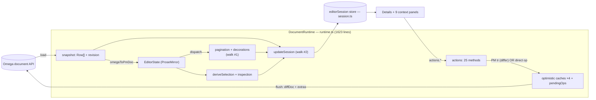
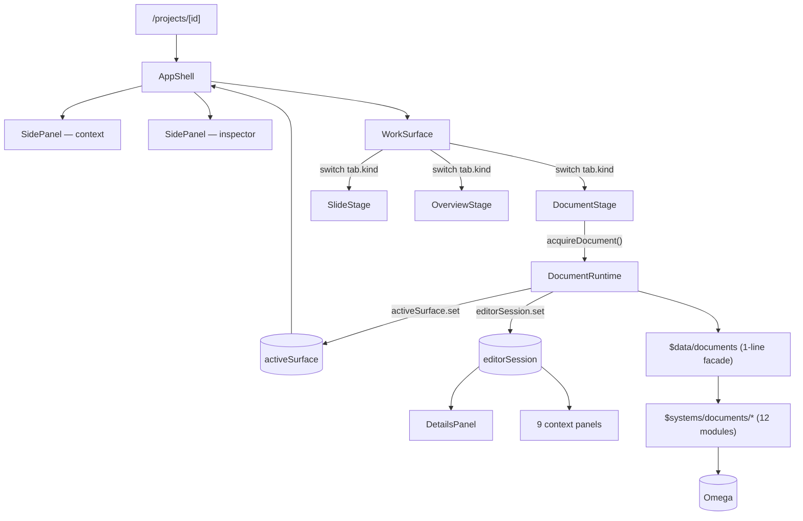
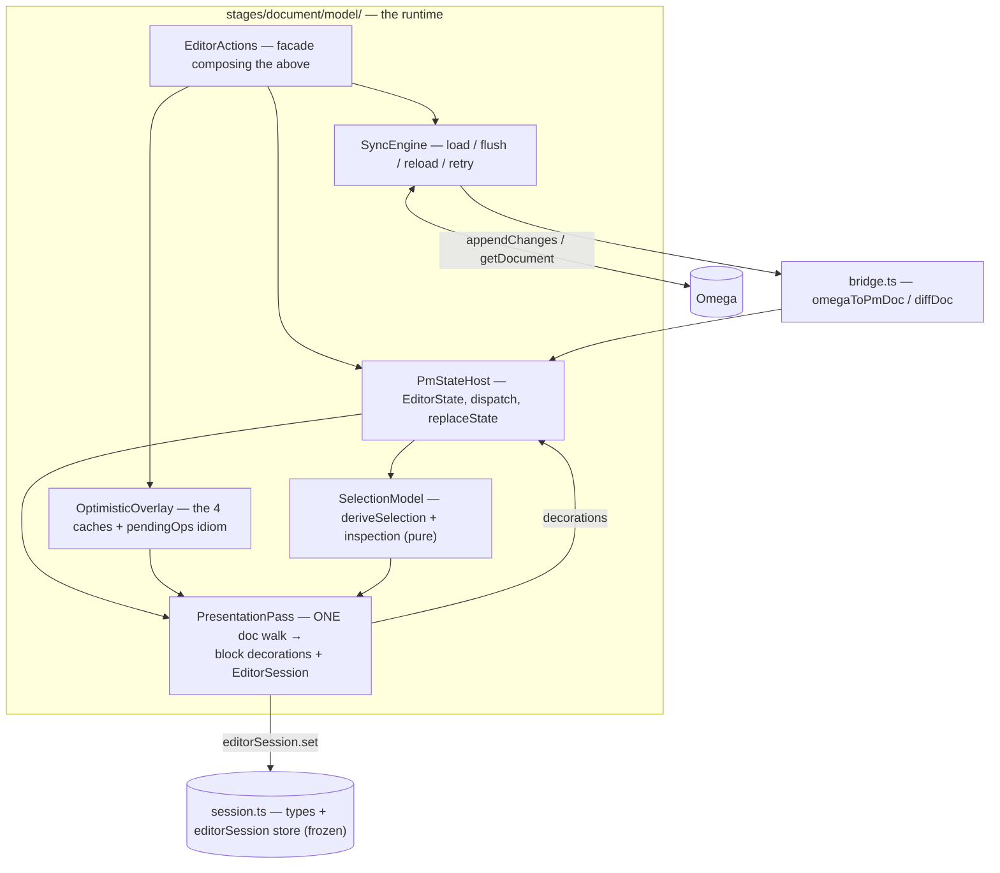

# Document subsystem — architecture map & reorg plan (2026-07-27)

**Status:** ✅ **COMPLETE (2026-07-27). All workstreams shipped — A, B, C, §7 security, E
(real Share, `8a0d087`), and D (shell + layering cleanup: D4–D6, L1–L6, A3, A4, PC1 —
records `2026-07-27-workstream-d-*.md`).** Every catalog row is closed. This document remains
the architecture reference for the shipped runtime model. Decisions in §8 are settled.
**Companion catalog:** [`2026-07-27-document-subsystem-issues.md`](2026-07-27-document-subsystem-issues.md)
— every gap/bug/issue enumerated with location, severity, and fix. This doc is the *plan*; that
doc is the *catalog*.
**Reconciles:** [`2026-07-21-panel-system-design.md`](2026-07-21-panel-system-design.md),
[`2026-07-24-runtime-architecture.md`](2026-07-24-runtime-architecture.md) (the latter proposes a
registry-dispatch that never shipped — see §8.3).

## 0. Why

Changes here feel slow, and that's a real signal — with three causes:

1. **The companion tax** — fixed separately: companions are now prose + a staleness gate.
2. **Monoliths** — `runtime.ts` (**1623**), `DetailsPanel.svelte` (**910**),
   `QuarterbackPanel.svelte` (**623**) each mix many concerns.
3. **Machinery we don't use** — a full page-**pagination** engine (+ deferred windowing
   scaffolding) runs on every keystroke for a product that renders one continuous flow.

The target is a **coherent runtime model** (a thin orchestrator composing named collaborators), a
**code layout that mirrors it**, **pagination removed**, and the inspector **broken into per-lens
components**. Guiding principle: the runtime model must be right first — *if it isn't, everything
downstream slowly falls apart* — then code layout reflects it, with a clean split between
**runtime behavior**, the **types/contracts** it occupies, and the **interaction functions** that
move data between its pieces.

This is not a toy design. Optimistic edits + a whole-document differ + two stable store contracts
(`surface.ts`, `session.ts`) is a real, production-shaped model. But it needs **decomposition**,
**pagination removed**, and **security + scale hardening** (§7) to actually last and scale.

---

## 1. Current runtime model



**Two full-document walks per transaction** (`refreshPagination` builds decorations; `updateSession`
builds the session) and a **whole-document `diffDoc` per flush** — all O(document). Two write paths
converge on `flush()`: the differ path (dispatch a PM transaction, diff computes ops) and the
direct path (mutate a cache, hand-build a `ChangeOp` "extra" sent ahead of the diff).

## 2. Current architecture

The shell is a clean **surface-contribution** system: one generic `SidePanel` rendered twice
(context/inspector); the active stage publishes its rail sections via an `activeSurface` store.



`surface.ts` and `session.ts` are tidy contracts and stay **frozen** through the reorg, so panels
and shell never move in lockstep with the runtime.

---

## 3. Problems (consolidated, cited — full list in the issues catalog)

**Architecture** — `runtime.ts` is a god-object (imports 9 Svelte panels at `82-91` just to
register them); the 25-action object touches every field; two full-document walks per transaction;
one repeated optimistic-cache idiom at ~9 sites.

**Unused machinery** — the whole `pagination/*` stack + `DocumentRowRepository` windowing methods
(never called) + `ensurePageRange` (return discarded). We don't paginate.

**Inspector** — `DetailsPanel` (910) = 7 lenses + 13 controls + 13 state vars in one file.

**Shell** — `AppShell` mixes 4 concerns; `ResourcesPanel` (generic) hardcodes document
import/export; `QuarterbackPanel` (623) bundles 5 concerns with no sub-components; `QuarterbackDock`
has dead `currentDoc` wiring.

**Layering** — `data/document-*` facades that don't narrow (and one dead: `document-context`; one
duplicate: `document-layout` ≡ `documents`); inconsistent import paths.

**Correctness (bugs)** — Line spacing for *Selected Text* likely does nothing (`inspectedBlocks`
has no `run` branch → `inspectedRowKeys` empty → `setRowHeight([])`); the optimistic caches rely on
`findRowsBlock` returning a **live** `Block` reference that actions mutate in place (a silent
invariant a future clone would break).

**Security** (new — the mapping never looked here; see §7).

**Plan-vs-code drift** — `runtime-architecture.md` proposes a registry-dispatch that never shipped.

---

## 4. Target runtime model (pagination removed)

`DocumentRuntime` stays the public handle but becomes a thin **orchestrator composing named
collaborators**, each with a small surface. `session.ts` stays the contract. Pagination is gone;
the presentation decorations it used to compute (row height / alignment / width / typography) move
into **one** pass shared with the session projector — collapsing the two doc-walks into one.



**Extraction order (low → high risk):** `SelectionModel` (already ~pure) → `OptimisticOverlay` →
`SyncEngine` → `PresentationPass` (merges the two walks) → `EditorActions` **last**. Note: the
`PaginationEngine` box from the earlier draft is **deleted, not extracted** — see §6.B.

---

## 5. Target code organization (mirrors the model)

```
src/lib/features/stages/document/
  DocumentStage.svelte           # view: mounts ProseMirror, wires runtime ↔ EditorView (no page sheets)
  runtime.ts                     # thin orchestrator composing model/*
  model/                         # ── RUNTIME BEHAVIOR ──
    pm-state.ts  selection.ts  overlay.ts  sync.ts  presentation.ts  actions.ts
  editor/                        # ── INTERACTION FUNCTIONS + PM plumbing ──
    session.ts                   #   THE CONTRACT (types + editorSession store) — frozen
    bridge.ts  schema.ts  list-commands.ts  presentation-plugin.ts  selection-highlight.ts
  panels/
    DetailsPanel.svelte          # orchestrator (~60 lines): empty-state + 7-way dispatch
    details/                     # ← NEW (Stage 1)
      lens-helpers.ts
      lenses/  NoneLens … RowLens (7)
      controls/ Facts, ColorPopover, TypographyControls, TextTypeSelect, TextTypeAndSpacing,
                RowHeightControl, IndentControl, AlignmentControls, AddCommentControl,
                AddColumnControls, InsertElementControl, PromptControls, ListControls
    shared/ CanonicalLayoutNotice.svelte   # deduped from DetailsPanel + LayoutPanel
    InfoPanel … HistoryPanel     # 9 context panels (unchanged)
  # DELETED: pagination/  (geometry, paginate, page-index, viewport, pagination-policy, row-repository)
  #          editor/pagination-plugin.ts  → replaced by a slim editor/presentation-plugin.ts

src/lib/systems/documents/       # ── TYPES / CONTRACTS / DOMAIN ──
  types.ts api.ts block-kinds.ts inspector.ts styles.ts io.ts comments.ts references.ts
  ai-tasks.ts index.ts
  # layout.ts trimmed to the row-height math line spacing still needs; page-geometry removed
```

**The three-way split, concretely:** `model/*` = behavior; `session.ts` + `systems/documents/types.ts`
= contracts (what the runtime *is/occupies*); `bridge.ts` + `model/actions.ts` + `model/selection.ts`
= interaction functions (translate/move data). Panels stay store-backed; a lens's only prop is its
narrowed `selection` slice.

---

## 6. Workstreams (each ships + gates on its own; only A is the first PR)

**A — DetailsPanel → `details/`. ✅ SHIPPED 2026-07-27** (`34be0de`, `c640dd6`, `e3788a6`).
`DetailsPanel.svelte` is **42 lines** (target was ~60): empty state + canonical-layout notice +
a 7-way dispatch. Seven lenses under `details/lenses/`, thirteen controls under
`details/controls/`, pure bits in `details/lens-helpers.ts`, and the canonical-layout notice
deduped into `panels/shared/` (each panel keeps its own wording). Every control owns the state it
uses; every lens names its own row/block targets. Bug **B1** was fixed first, in its own commit —
it needed one *additive* field on `SelectionInfo['run']` (`rowIds`), because a run is the only
mode carrying no `InspectedBlock`s and therefore no way to name a row. All new files have prose
companions. Verified: `pnpm check` 0/0, 284 unit tests, `e2e/document-inspector.spec.ts` 5/5
against real Omega (including a new B1 regression test).

**B — Remove pagination. ✅ SHIPPED 2026-07-27** (`908b8bc`). Everything listed was deleted:
`pagination/*` (all six modules), `ensurePageRange`/`requestedRowWindow`, the
page-break/`PagePlan`/`pageMetrics` state, the page sheets and scroll windowing in
`DocumentStage` (the paper is now one continuous sheet carrying the sheet visuals itself), the
"Pages" metric, the `LayoutPanel` geometry controls (the panel is now default-typography only),
and the stale `document-pagination` e2e spec. Block presentation lives in the slim
`editor/presentation-plugin.ts`, fed by the single pass (`refreshPresentation`) whose retained
`rowHeightsPx` map also feeds `updateSession` — the two doc-walks are one, and the session can
never disagree with the paint. Row-height math (`layoutPoint`/`standardRowHeight`/
`canonicalRowHeight`) moved to `systems/documents/layout.ts`, trimmed per §5. *The open decision
was resolved as recommended:* line spacing **keeps persisting** via `set_block_line_height`.
A consequence made explicit: with `setPageLayout` deleted, page geometry is **read-only server
truth** (`canonicalPageLayout` stays in the session as the paper frame; other clients'
`set_page_layout` ops still flow in). Verified against real Omega — the run-line-spacing
regression test exercises the new plugin end to end.

**C — Runtime decomposition. ✅ SHIPPED (2026-07-27)** — `5a16c74`, `70d5a13`, `9e6b198`, `f602f45`,
`82e019b`, `15803a9`, `0809879`.
Extracted in the §4 order behind frozen `session.ts`: **`SelectionModel`** (pure; 11 tests pinning
all seven lenses), **`OptimisticOverlay`** (9 tests), **`PresentationPass`**, plus `model/panels.ts`
taking the rail list out of the sync class. The overlay extraction did what this workstream
required of it: the live-`Block`-reference invariant is gone — the overlay owns the patches, the
snapshot is never written, and `overlay.applyTo(nextRows)` folds them in explicitly at the one
place the differ would otherwise drop them (**B2** closed). **B3**'s extras-before-diff ordering is
now stated at the flush site, and the seven-fold repeated commit sequence from §3 is named
(`commitOverlayEdit`). `runtime.ts` 1569 → 1310.

**`SyncEngine` also shipped** (`82e019b`): `model/sync.ts` owns `docId`/`revision`/`snapshot`/
`meta`/`pageLayout`/`layoutRules`/`styleRegistry`/`defaultTypography`/`supportsCanonicalLayout`
plus load, debounced flush, conflict reload, retry, and the inflight/queued serialization. It
never touches an `EditorState` — it reaches the editor through a 9-member `SyncHost` the runtime
implements, so the compiler checks the boundary. `runtime.ts` 1569 → **1190**.

**`PmStateHost` and `EditorActions` also shipped** (`15803a9`, `0809879`), in that order, and the
order was the finding. Measured coupling of the actions object: **31 members before C**, **24 after
`SyncEngine`** (eight scattered server-truth fields became one `this.sync`), **20 after
`PmStateHost`** (`state`/`dispatch`/`hooks` — 68 uses — became one `this.pm`). At that point three
members carried 113 of 152 references, so pulling the remaining pure reads out (`findText` →
`model/search.ts`, `blockPositionOf` → `model/selection.ts`, `convertBlockAt` module-level) left a
**9-member `ActionsHost`** — the same size as `SyncHost`. That is a seam; a 31-member interface
would have been a relocation.

The 532-line action body was moved **mechanically and verified byte-identical** by re-deriving it
from the pre-move file and diffing: no action logic changed, only references rebound.

**Workstream C is complete and catalog A1 is closed.** `runtime.ts` **1623 → 577**: it composes the
collaborators, runs the ONE presentation pass, projects the `EditorSession`, and implements four
compiler-checked seams — `PmHost` (4), `IndentHost` (2), `SyncHost` (9), `ActionsHost` (9). The
model layer beneath it is eight files and 32 tests. Records:
`docs/records/2026-07-27-pm-state-host.md`, `…-editor-actions-extraction.md`.

**D — Shell + layering cleanup.** Extract `AppShell`'s fallback/merge/repair into a module; move
document import/export out of `ResourcesPanel` behind a kind-agnostic seam; decompose
`QuarterbackPanel` into sub-components; drop `currentDoc` dead wiring. Delete `data/document-context`
+ `data/document-layout`; import `$data/documents` (or `$systems/documents/*`) directly and
consistently. Update `runtime-architecture.md` to match the shipped `tab.kind` switch (we are **not**
building registry-dispatch — §8.3).

**E — Real Share (un-mock the top-bar Share dialog).** Not a reorg item; filed here because it is
the last shell mock and D is the shell workstream.

The finding that created it: `ShareDialog.svelte` is a **41-line mock** that copies
`/join/mock-share-token` and changes no access — while **every piece it needs is already real and
already used**. `ProjectSettingsDialog` calls `fetchLinks` / `rotateLink` / `disableLink`,
`updateProject({visibility})`, and `fetchMembers` / `addMember` / `setMemberRole` /
`removeMember`; `joinByToken` backs a passing `/join/:token` e2e. **No backend work is required** —
this is purely a client gap, which is why it is a workstream and not a backend request.

Scope:

1. Extract the sharing UI from `ProjectSettingsDialog` into a shared component
   (`features/projects/ProjectSharing.svelte`) — visibility switch, read/edit links with
   copy/rotate/turn-off, and member invite/role/remove.
2. `ShareDialog` renders that component instead of the placeholder; the `MockBadge` goes.
3. `ProjectSettingsDialog` renders the same component, so the two can never drift.
4. Owner-only affordances stay owner-only; a non-owner sees the links read-only.

Gate: `pnpm check`, unit tests, companions, and an e2e that opens the top-bar Share dialog and
mints a real link (extending `share-links.spec.ts`, which already covers the join half).

**Every problem in §3 is owned by a workstream:** god-object→C, two-walks→B, optimistic-idiom→C,
scaffolding→B, ResourcesPanel leak→D, QuarterbackPanel→D, run-mode bug→A, security→§7 (folded into
the workstream that touches each surface), plan-drift→D.

---

## 7. Production-readiness — scale & security (the harder pass)

**Scale.** Every edit is O(document): a whole-doc `diffDoc` per flush + (today) two doc-walks per
transaction. Removing pagination collapses the walks to one and removes the whole `pagination/*`
cost, but the diff and the one presentation walk remain O(n), and — with windowing removed — the
**entire document stays in the DOM** (no virtualization path). This is an accepted ceiling: fine for
normal documents, a known limit for very large ones. Documented trade-off, not a silent one. If we
ever need huge docs, virtualization comes back as a deliberate project, not resurrected scaffolding.

**Security.** The mapping never covered this; the pass found:
- **Primary defense is server-side.** `bridge.ts:562` notes *Omega sanitizes marks*. The client has
  **no defense-in-depth**.
- **Link `href` is unrestricted** (`schema.ts:168` renders `<a href={mark.attrs.href}>` verbatim) —
  a `javascript:`/`data:` URL that slips server sanitization is stored XSS. **Fix:** allowlist schemes
  (http/https/mailto/relative) at the schema boundary and in `setLink`.
- **Inline typography is injected raw into `style`** — `font-family`/`font-size` (`schema.ts:176-180`),
  `fg`/`bg` (`183-190`), and custom typography in `styles.ts` — a CSS-injection surface (UI spoofing,
  `url()` beacons; not script exec). The code even comments "safe CSS color value" as an **unenforced**
  assumption. **Fix:** validate/escape values at the render boundary (color/length/family patterns).
- **No Content-Security-Policy** anywhere — no backstop if sanitization has a gap. **Fix:** add a CSP.
- **Also verify:** the byte↔char anchor math in `bridge.ts` (corruption, not a breach) and that the
  server's mark sanitization actually covers href schemes + CSS values.

Security fixes are cheap and localized (schema `toDOM` + `setLink` + a CSP header) — fold them into
whichever workstream touches that surface; none block Stage 1.

---

## 8. Decisions (settled)

1. **`model/` subdirectory** for the runtime split. ✅
2. **Delete the redundant/dead `data/document-*` facades**; import `$data/documents` (or the specific
   `$systems/documents/*` module) directly and consistently. ✅
3. **Do not build registry-dispatch.** The current `tab.kind` switch is enough; the registry keeps
   earning its keep for runtime **lifecycle** (acquire/dispose) only. Reconcile by **updating
   `runtime-architecture.md`** to match shipped reality. ✅
4. **Remove pagination entirely** (workstream B), keeping only block-presentation decorations and the
   minimal row-height math line spacing needs. This also removes one of the two doc-walks. ✅
5. **First PR = workstream A (DetailsPanel decomposition) only.** ✅
