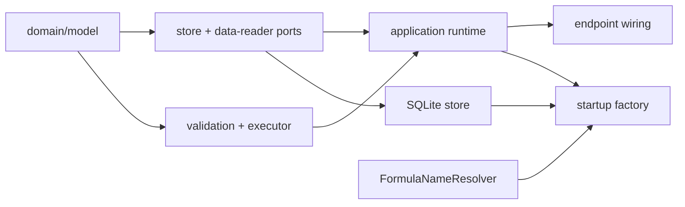

# Analytic Output — file architecture

## Minimal layout

```text
apps/backend/
  src/
    3-capabilities/analytic-output/
      domain/
        model.ts
        errors.ts
        validation.ts
        executor.ts
      application/
        analyticOutputRuntime.ts
      ports/
        analyticDataReader.ts
        analyticOutputStore.ts
      persistence/
        sqliteAnalyticOutputStore.ts
      docs/
        README.md
        concepts.md
        types.md
        runtime.md
        flows.md
        invariants.md
      index.ts

    1-init/create/analytic-output.ts
    4-job-wiring/analytic-output/registerAnalyticOutputEndpoints.ts

  test/capabilities/analytic-output.test.ts
```

This uses the current layered capability convention without splitting the small
design into unnecessary modules.

## Responsibilities

| File | Responsibility |
| --- | --- |
| `domain/model.ts` | `AnalyticOutput`, inputs, joins, fields, filters, sorts, graph kind, requests, and transient result types |
| `domain/errors.ts` | validation, not-found, stale-revision, data, and dependency errors |
| `domain/validation.ts` | structural definition validation and Formula-limit checks |
| `domain/executor.ts` | pure normalization, joins, filters, aggregation, sorting, limit, and result construction |
| `ports/analyticDataReader.ts` | resolve all requested binding IDs from one project snapshot |
| `ports/analyticOutputStore.ts` | insert, get, list, revision update, and soft delete |
| `persistence/sqliteAnalyticOutputStore.ts` | the one-table SQLite implementation and schema initialization |
| `application/analyticOutputRuntime.ts` | six runtime methods, data-reader/executor coordination, IDs, clock, and logs |
| `registerAnalyticOutputEndpoints.ts` | six exact routes, small request decoders, queues, and error mapping |

The SQLite schema stays in the concrete store. Request decoding stays in the
single endpoint registrar. There is no separate canonical-digest module, wire
schema package, schema migration subsystem, materialization service, or job
payload family.

## Dependency direction



The capability may import Formula wire/rational types and helpers. It does not
import `#structured-data`; project data reaches it only through
`AnalyticDataReader`. The executor imports no store, reader, logger, clock, or
job type.

## Resolver adapter

The startup factory adapts the existing `FormulaNameResolver`:

```ts
const reader: AnalyticDataReader = {
  async readAll(bindingIds) {
    const snapshot = await formulaResolver.buildSnapshot();
    const byId = new Map(
      [...snapshot.bindings.values()].map(binding => [
        binding.reference.bindingId,
        binding
      ])
    );

    const values = new Map<string, FormulaWireValue>();
    for (const bindingId of new Set(bindingIds)) {
      const binding = byId.get(bindingId);
      if (!binding) {
        // getIssue(bindingId) distinguishes unresolved from unknown data.
        throw new AnalyticDataError(bindingId);
      }
      if (!isWireSerializable(binding.value)) {
        throw new AnalyticDataError(bindingId);
      }
      values.set(bindingId, toWire(binding.value));
    }
    return values;
  }
};
```

One call builds one snapshot for all inputs. A scan/index by binding ID is
necessary because the current resolver map is keyed by normalized display
name. Saved display names are never used as a fallback.

## Construction and startup

`1-init/create/analytic-output.ts` opens the normal fixed capability database:

```text
./data/analytic-output.db
```

It constructs the store, resolver adapter, and runtime with `config.userId` and
the relevant existing Formula limits. No new backend configuration section is
introduced.

`startBackend.ts` constructs the runtime after the Formula resolver, adds one
`analyticOutputReady` startup field, and registers the six endpoints. It does
not register Analytic Output with Knowledge or the resource registry and does
not register startup recovery or internal jobs.

## Imports

Add the ordinary root and wildcard aliases to both
`apps/backend/package.json#imports` and `apps/backend/tsconfig.json`:

```text
#analytic-output
#analytic-output/*
```

They use the same `development`, `types`, and compiled `default` conditions as
the other current capability aliases.

## Tests

One capability-level test file is enough initially. It uses `node:test`, a
temporary SQLite path, deterministic IDs/clock, a fake `AnalyticDataReader`,
and `CapturingLogger`.

It covers:

- create, read, list, wholesale update, stale revision, and soft delete;
- structural validation of input IDs, ordered joins, field references, filter
  values, and sort placement IDs;
- one input, an inner join, a left join, and a chained join;
- filters before aggregation and sorts/limit after aggregation;
- exact sum and average, null behavior, and graph shelf validation;
- one resolver read for every input in a data call;
- `outputRevision` when an update occurs during a run;
- all six endpoint mappings and error statuses; and
- expected log counts without raw authored or result data.

The existing HTTP smoke script should add one short flow: declare two small
Structured Data tables, save an output that joins them, call
`POST /analytic-outputs/data`, assert the returned fields/rows and graph kind,
then delete the output. Existing HTTP/job/resolver/runtime logs provide timing
statistics; no analytic statistics subsystem is needed.

## Capability docs

Implementation creates the standard in-tree docs set:

- `README.md` — purpose, boundary, code map, and reading order;
- `concepts.md` — Tableau-like inputs, ordered joins, shelves, and a Mermaid
  flow;
- `types.md` — every persisted and transient type;
- `runtime.md` — the six runtime methods and supporting functions;
- `flows.md` — endpoints, jobs, reader, executor order, errors, and logs; and
- `invariants.md` — the small guarantees and explicit first-version omissions.

Those docs should describe the implemented code, not reintroduce result
history, rendering, or publication concepts.
