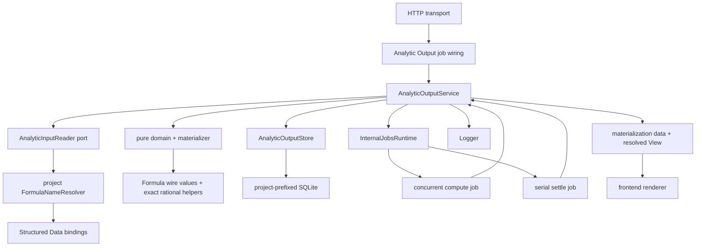

# Analytic Output — file architecture and integration

## Placement

Analytic Output is a regular capability. Its domain, application service,
ports, SQLite adapter, wire decoding, and capability documentation live behind
one removable directory boundary.

```text
apps/backend/src/
  3-capabilities/
    analytic-output/
      domain/
        model.ts
        operations.ts
        reducer.ts
        inverses.ts
        canonical.ts
        validation.ts
        materialization.ts
        errors.ts
      application/
        analyticOutputService.ts
        createService.ts
        materializationService.ts
        recovery.ts
      ports/
        analyticOutputStore.ts
        analyticInputReader.ts
        analyticExecutor.ts
      persistence/
        sqliteSchema.ts
        sqliteMappers.ts
        sqliteAnalyticOutputStore.ts
      projections/
        resultWindow.ts
        staleState.ts
      wire/
        commandSchemas.ts
        querySchemas.ts
        operationSchemas.ts
        valueSchemas.ts
      docs/
        README.md
        concepts.md
        types.md
        runtime.md
        flows.md
        invariants.md
      index.ts

  1-init/create/
    analytic-input-reader.ts
    analytic-output.ts

  4-job-wiring/analytic-output/
    analyticOutputJobPayloads.ts
    createAnalyticOutputJobs.ts
    registerAnalyticOutputEndpoints.ts
    registerAnalyticOutputInternalJobs.ts
```

The scratch packet is the implementation design. After implementation, the
six capability-local `docs/` files describe current code behavior in the same
format as Formula, Structured Data, Knowledge, Document, and Slides.

## Module responsibilities

### Domain

| File | Responsibility |
|---|---|
| `model.ts` | Head, snapshot, definition, input refs, placements, filters, sorts, Views, result schema, attempts, candidates, materializations, limits, ChangeSets, and activity facts. |
| `operations.ts` | Closed authored operation union, touched-identity vocabulary, and structural operation helpers. |
| `reducer.ts` | Pure operation application over one snapshot; no I/O, clock, IDs, Formula resolver, or store calls. |
| `inverses.ts` | Exact inverse creation and compensation helpers. |
| `canonical.ts` | Deterministic canonical bytes and SHA-256 digests for snapshots, requests, candidates, and materializations. Preserves Formula wire rational strings. |
| `validation.ts` | Structural snapshot/operation validation, identity uniqueness, channel cardinality, closed unions, bounds, and View option validation. |
| `materialization.ts` | Pure input normalization, path traversal, filters, exact grouping/aggregation, stable sorting, result limiting, View compatibility, and resolved View construction. |
| `errors.ts` | Typed domain/application errors and bounded materialization diagnostics. |

`materialization.ts` is backend computation, not rendering. Its output is exact
tabular data plus a semantic resolved View. It imports Formula value/wire and
rational helpers where needed; it never imports a charting, Canvas, SVG, image,
browser, or export library.

### Application

| File | Responsibility |
|---|---|
| `analyticOutputService.ts` | Public command/query dispatch, idempotency, snapshot replay, stale rebase, compensation, attempt freeze, and result reads. |
| `createService.ts` | Validated revision-zero snapshot, Base, identity ledger, receipt, and activity fact creation. |
| `materializationService.ts` | Compute/settle stage behavior over durable attempts and candidates; no transport knowledge. |
| `recovery.ts` | Scan recoverable states and emit deterministic internal intents after startup. |

Application code receives already-decoded command/query DTOs. It does not
inspect Fastify request objects or cast arbitrary JSON to domain unions.

### Ports

| File | Responsibility |
|---|---|
| `analyticOutputStore.ts` | Transactional head/history/attempt/result contract. |
| `analyticInputReader.ts` | Freeze one stable current project Formula binding into exact wire bytes and an input manifest. |
| `analyticExecutor.ts` | Materialize one frozen definition/input under injected limits and return exact result data plus a resolved View. |

The domain depends on interfaces, not on the SQLite adapter, Structured Data
service, Formula name resolver implementation, or scheduler.

### Persistence

| File | Responsibility |
|---|---|
| `sqliteSchema.ts` | Project-prefixed schema creation, indexes, pragmas, and migration version. |
| `sqliteMappers.ts` | Strict canonical encode/decode for every stored union; count/digest revalidation. |
| `sqliteAnalyticOutputStore.ts` | Store-port implementation and the atomic transaction protocols in `store.md`. |

### Wire

Wire modules perform exact-key validation, reject unknown discriminators and
fields, enforce request byte/count limits, and return closed domain DTOs.
Shared parsing helpers may be extracted only when their semantics are genuinely
identical to Document/Slides/Spreadsheet; Analytic Output does not import
another capability's wire decoder.

### Projections

`resultWindow.ts` returns bounded immutable materialization row windows without
converting Formula numbers. `staleState.ts` compares the head definition
revision/digest to the latest materialization and reports current/stale/missing
for UI projection. Neither writes canonical state.

## Dependency graph



There is no direct `StructuredData` object in the capability constructor. The
composition-layer input reader is the only live-data seam. This matches the
Spreadsheet design: project data reaches consumers through stable Formula
bindings rather than a second name-resolution path.

## Input-reader adapter

The current `FormulaResolverSnapshot.bindings` map is keyed by normalized
display name, while the stable identity is
`binding.reference.bindingId`. The adapter must search by stable ID and must not
fall back to a display-name lookup.

```ts
export function createAnalyticInputReader(
  resolver: FormulaNameResolver,
  logger: Logger,
): AnalyticInputReader {
  return {
    async freeze(input) {
      const snapshot = await resolver.buildSnapshot();
      const binding = [...snapshot.bindings.values()].find(
        candidate => candidate.reference.bindingId === input.bindingId,
      );

      if (!binding) throw new AnalyticBindingNotFoundError(input.bindingId);
      if (!isWireSerializable(binding.value)) {
        throw new AnalyticNonSerializableInputError(input.bindingId);
      }

      const value = toWire(binding.value);
      return {
        manifest: {
          bindingId: binding.reference.bindingId,
          displayName: binding.displayName,
          ownerRevision: binding.ownerRevision,
          valueDigest: binding.valueDigest,
          resolverSnapshotDigest: snapshot.snapshotDigest,
          valueKind: value.kind,
        },
        value,
        byteLength: canonicalByteLength(value),
      };
    },
  };
}
```

The implementation above is illustrative about composition and identity; the
wire value and returned manifest still pass strict canonical validation. Logs
contain binding ID, value kind, owner revision, byte count, and duration—not
the value or display name.

## Executor implementation seam

The default executor is deterministic in-process TypeScript:

```ts
interface AnalyticExecutionResult {
  resultData: AnalyticResultData;
  resolvedView: ResolvedAnalyticView;
  executorVersion: string;
}

export interface AnalyticExecutor {
  readonly version: string;
  materialize(input: {
    definition: AnalyticOutputDefinition;
    frozenInput: FrozenAnalyticInput;
    limits: AnalyticOutputLimits;
  }): Promise<AnalyticExecutionResult>;
}
```

The pure materialization kernel can be tested synchronously. The port remains
asynchronous so an implementation can later delegate large workloads to a
worker-thread pool without changing the service, store, or job vocabulary.
Regardless of implementation, the executor version is included in candidate
and result digests.

The executor may use Formula's canonical rational comparison/arithmetic
helpers. It does not use JavaScript `number` for exact analytic values. It does
not call Platform Intelligence, Python, web retrieval, Knowledge, or Research.

## Runtime construction

Construction follows the repository's numbered layers.

```ts
interface CreateAnalyticOutputDependencies {
  config: BackendConfig["analyticOutput"];
  projectId: string;
  userId: string;
  logger: Logger;
  formulaNameResolver: FormulaNameResolver;
  internalJobs: InternalJobsRuntime<AnalyticOutputInternalJobIntent>;
}

interface AnalyticOutputRuntime {
  service: AnalyticOutputService;
  store: AnalyticOutputStore;
  recover(): Promise<void>;
  close(): void;
}
```

`createAnalyticOutput` performs:

1. create/open `./data/analytic-outputs.db` and apply the project-prefixed
   schema;
2. create the strict SQLite store adapter;
3. create `AnalyticInputReader` over the already-constructed project Formula
   resolver;
4. create the default exact executor with configured limits/version;
5. create the application service with store, input reader, executor, internal
   jobs, Logger, clock, ID source, and actor attribution from configured user
   ID;
6. return a runtime whose `recover()` dispatches durable incomplete stages.

The application startup order is therefore:

```text
configuration + logger + scheduler/internal jobs
  -> Structured Data
  -> FormulaNameResolver over Structured Data
  -> Analytic Output store/input reader/executor/service
  -> register Analytic Output endpoint and internal jobs
  -> run recovery dispatch
  -> start transport
```

Recovery begins only after internal job factories are registered. Database
construction does not enqueue work.

## Configuration

```yaml
analyticOutput:
  databasePath: ./data/analytic-outputs.db
  executorVersion: analytic-output/executor-1
  maxTitleBytes: 512
  maxPlacements: 64
  maxFilters: 64
  maxFilterSetValues: 1000
  maxSorts: 16
  maxFieldPathDepth: 16
  maxFrozenInputBytes: 33554432
  maxInputRows: 250000
  maxResultRows: 100000
  maxResultCells: 1000000
  maxResultBytes: 33554432
  maxRetainedBases: 3
  maxRetainedChangeSets: 10000
  maxRetainedTerminalAttempts: 1000
  maxRetainedMaterializations: 1000
```

These are bounded starting defaults, not semantic constants. Configuration
loading validates positive safe integers, coherent row/cell/byte limits, and a
non-empty executor version before the database opens.

Successful materialization retention remains conservative until external
reference reachability exists, as described in [Store](store.md).

## Job wiring

`registerAnalyticOutputEndpoints.ts` registers two mappings:

```ts
registry.register(
  { method: "POST", path: "/analytic-outputs/command" },
  createAnalyticOutputCommandJob(service),
);

registry.register(
  { method: "POST", path: "/analytic-outputs/query" },
  createAnalyticOutputQueryJob(service),
);
```

The command factory decodes the closed command envelope and returns a serial,
inline job. The query factory returns a concurrent, inline job. Materialization
request completion means the exact attempt is durable and its compute intent
has been admitted or is recoverable; it does not wait for computation.

`registerAnalyticOutputInternalJobs.ts` maps:

```ts
"analytic-output.materialization.compute" -> concurrent
"analytic-output.materialization.settle"  -> serial
"analytic-output.compact"                 -> serial
```

Internal job payloads contain only IDs and deterministic idempotency keys. The
exact definition and data remain in SQLite, not in the in-memory queue.

## Public capability surface

`index.ts` exports only the types and factories needed by composition/wiring:

```ts
export type {
  AnalyticOutputService,
  AnalyticOutputCommandRequest,
  AnalyticOutputCommandResult,
  AnalyticOutputQueryRequest,
  AnalyticOutputQueryResult,
  AnalyticOutputInternalJobIntent,
  AnalyticMaterialization,
  AnalyticOutputRef,
};

export {
  createAnalyticOutputService,
  createSqliteAnalyticOutputStore,
  createDefaultAnalyticExecutor,
};
```

An external capability uses an immutable result reference:

```ts
interface AnalyticOutputRef {
  outputId: AnalyticOutputId;
  materializationId: AnalyticMaterializationId;
  materializationDigest: string;
}

interface AnalyticMaterializationReader {
  getExact(ref: AnalyticOutputRef): Promise<AnalyticMaterialization | null>;
}
```

This narrow read port is the future seam for Document, Slides, Spreadsheet,
Research, or Findings. Those capabilities store exact references and own their
own refresh/adoption workflows. They do not receive the mutable Analytic Output
service.

## Import aliases and package runtime resolution

The backend TypeScript config and `apps/backend/package.json` runtime imports
must add matching exact and wildcard aliases:

```text
#analytic-output
#analytic-output/*
```

Source/development and compiled/runtime conditions must resolve the same module
boundary. A build-and-boot test should load the compiled server and assert the
two public endpoint mappings, preventing a TypeScript-only alias from passing
typecheck while failing under Node.

## Logging

The capability emits structured events with `requestId`, `jobId` when
available, output/attempt/materialization IDs, queue stage, status, counts, and
duration. It does not log titles, Data display names, filter operands, frozen
input, result rows, or arbitrary diagnostics from external sources.

Suggested events:

```text
analytic-output.created
analytic-output.changed
analytic-output.compensated
analytic-output.materialization.requested
analytic-output.materialization.compute.started
analytic-output.materialization.compute.completed
analytic-output.materialization.compute.failed
analytic-output.materialization.settled
analytic-output.materialization.stale
analytic-output.recovery.dispatched
analytic-output.compacted
```

Materialization completion records input kind/bytes, filtered row count,
result row/cell/byte counts, executor version, queue wait, and duration. Exact
values remain private payload data.

## Testing layout

```text
apps/backend/test/capabilities/
  analytic-output-domain.test.ts
  analytic-output-materialization.test.ts
  analytic-output-persistence.test.ts
  analytic-output-service.test.ts
  analytic-output-wire.test.ts
  analytic-output-jobs.test.ts
  analytic-output-recovery.test.ts
  analytic-output-formula-integration.test.ts
```

Required test families:

- reducer/inverse round trips for every operation;
- identity non-reuse and exact compensation reactivation;
- canonical digest stability across property insertion order;
- current Formula resolver integration by stable binding ID, including rename
  and name reuse by a different ID;
- scalar/list/record/table normalization and nested record paths;
- exact rational filter, aggregate, sort, encode/decode behavior;
- every Filter and View discriminator plus malformed wire payload rejection;
- deterministic grouping, null behavior, stable ties, and result bounds;
- Base/ChangeSet replay, stale disjoint rebase, compaction, and corruption
  detection;
- freeze/compute/settle restart recovery and stage idempotency;
- two materializations completing out of order;
- stale-definition materialization retained without pointer advancement;
- compiled production boot and endpoint inventory.

Tests use isolated temporary databases and injected clocks/IDs. They do not
write databases or logs into the repository.

## Integration and removal boundary

The capability is removable by deleting:

```text
3-capabilities/analytic-output/
4-job-wiring/analytic-output/
1-init/create/analytic-output.ts
1-init/create/analytic-input-reader.ts
```

and its small construction/registration/config/alias blocks. Structured Data,
Formula, the scheduler, Document, Slides, Spreadsheet, Research, and Findings
remain independently constructible. No existing capability stores a mandatory
backlink to Analytic Output.

## Implementation order

1. Domain types, closed wire decoders, validation, canonical encoding, pure
   reducer, exact inverses, and tests.
2. SQLite schema/store, Base plus ChangeSet replay, command receipts, identity
   ledger, activity outbox, and persistence tests.
3. Input-reader adapter over current FormulaNameResolver and exact normalization
   tests for every Formula wire kind.
4. Pure filter/group/aggregate/sort/View-resolution executor and bounds tests.
5. Application command/query service, materialization freeze, internal jobs,
   settlement, and restart recovery.
6. Startup/config/aliases/endpoint wiring plus compiled boot and full
   integration tests.
7. Frontend consumption of `AnalyticResultData + ResolvedAnalyticView` through
   the public query path; frontend rendering remains outside backend code.
