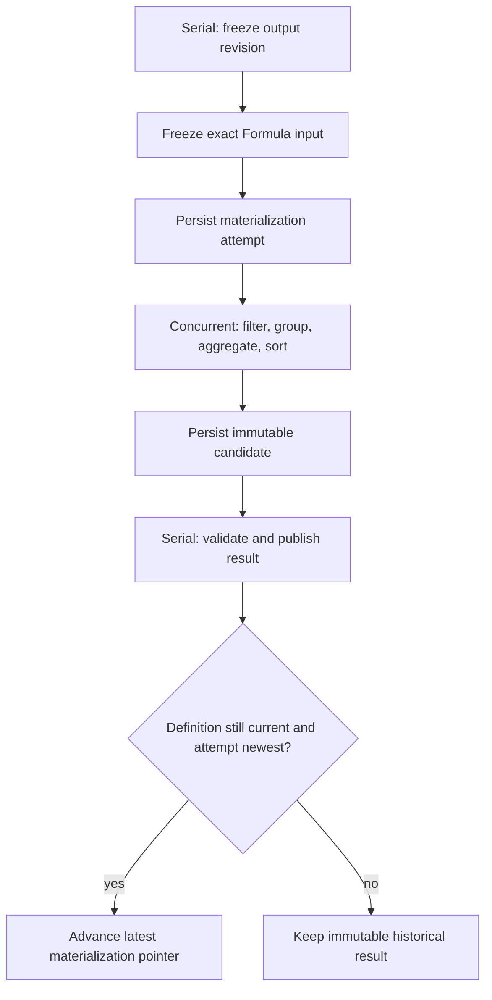

# Analytic Output capability — design summary

## Purpose

Analytic Output is a regular project-scoped capability under
`3-capabilities/analytic-output/`. It owns saved, revisioned definitions that
turn one project Formula binding into one table, metric, or chart-ready output.
Each definition records the selected fields, Tableau-like Rows and Columns
shelves, filters, sort order, auxiliary visual encodings, and one semantic View.
Materialization freezes the exact input value and produces immutable data plus
a resolved View for the frontend to render.

The capability is named **Analytic Output**, rather than Analysis, because its
backend responsibility is deliberately concrete: it describes and materializes
an output. It does not own an open-ended analysis process, a notebook, a
scenario engine, hypothesis testing, or a dashboard. The product screen may
still be called **Analyze**.

```text
Project Formula binding
  -> exact frozen Formula value
  -> fields on Rows / Columns / visual encodings
  -> filters
  -> grouping and exact aggregation
  -> ordered sorts and optional row limit
  -> immutable result data + resolved semantic View
  -> frontend chart/table rendering
```

## The unit of ownership

One `AnalyticOutput` owns exactly one authored definition and exactly one View.
Several charts or tables are several Analytic Outputs. Page, dashboard, and
workspace arrangement remains outside the capability; this avoids creating a
second layout system beside Workspace, Documents, Slides, and Spreadsheets.

```text
AnalyticOutputSnapshot
  |- title + lifecycle + revision
  `- AnalyticOutputDefinition
       |- input: one stable project Formula binding
       |- layout
       |    |- rows[]
       |    |- columns[]
       |    `- encodings: color / size / label / detail / tooltip
       |- filters[]
       |- sorts[]
       |- limit?
       `- view: table | metric | bar | line | area | scatter | pie

AnalyticMaterialization
  |- exact input manifest
  |- exact Formula wire data used for computation
  |- result field schema + result rows
  |- resolved View with explicit data-channel bindings
  `- definition, input, executor, and result digests
```

The authored definition does not copy Structured Data values. The immutable
materialization does contain the exact transformed result data required by a
frontend or another capability. This is the seam between a live definition and
a reproducible output.

## Why Rows and Columns are canonical

Rows and Columns are the sole authored positional shelves. The model does not
also persist separate X-axis and Y-axis assignments, because those would become
two authorities for the same placement. The selected View resolves the shelves
to explicit render channels during materialization:

- for a vertical bar, line, or area View, Columns normally becomes X and Rows
  becomes Y;
- a horizontal bar View reverses the visual orientation without moving the
  authored shelf items;
- a scatter View requires compatible numeric placements on both shelves;
- a table View interprets the shelves as row and column groupings;
- metric and pie Views impose their own bounded placement rules.

The materialized `ResolvedAnalyticView` carries explicit X/Y/category/value
bindings so the frontend never has to reconstruct these rules.

## Data and Formula boundary

Analytic Output reaches project data through a narrow `AnalyticInputReader`.
The reader is implemented in composition code over the current project
`FormulaNameResolver`:

1. build one immutable `FormulaResolverSnapshot`;
2. find the binding whose `reference.bindingId` matches the definition;
3. reject functions and values that cannot cross Formula's wire boundary;
4. return the exact value together with binding ID, owner revision, value
   digest, and resolver snapshot digest.

This is aligned with the current repository. Structured Data owns declarations
and supplies the project Formula bindings; Formula owns the recursive value
algebra and exact rational numbers. Analytic Output has no direct Structured
Data store dependency and never resolves an input by display name after the
binding has been selected.

The current Structured Data runtime does not provide historical value reads.
Consequently, the serial materialization freeze persists the exact
`FormulaWireValue`, not only a revision number. Concurrent computation then
uses those frozen bytes even if project data changes before it runs.

Table, record, list, and scalar values are normalized into one tabular input:

- a table keeps its fields and rows;
- a record becomes one row;
- a list becomes one `value` field;
- a scalar becomes one `value` field and one row.

Nested record fields may be addressed by a stable path of field names. Current
Structured Data fields do not have stable column IDs, so a definition cannot
claim that they do. Schema renames or incompatible type changes produce typed
materialization diagnostics until the definition is updated.

## Authored definition versus materialized result

Authored and computed state remain distinct:

```text
Base + ChangeSet tail
  = exact authored AnalyticOutputSnapshot at revision N

snapshot N
  + frozen Formula binding/value manifest
  + analytic executor version and limits
  = immutable AnalyticMaterialization
```

Changing the title, shelves, filters, sorts, or View appends one ChangeSet.
Materialization does not append an authored ChangeSet. It creates an immutable
result and may advance the output head's operational
`latestMaterializationId` pointer when the frozen definition is still current.
A materialization for an older definition remains valid history but cannot
replace the current pointer.

## Materialization order

The executor has one deterministic order:

1. normalize the frozen input to a table;
2. resolve every referenced field path and infer its runtime kinds;
3. apply filters to input rows;
4. project every field placement used by Rows, Columns, or encodings;
5. when any placement aggregates, group by every non-aggregated placement and
   compute aggregated placements using Formula's exact values;
6. apply the ordered sort list;
7. apply the optional result row limit;
8. validate the selected View against the resolved field kinds;
9. emit exact result rows and a resolved semantic View.

Filters therefore operate before aggregation; sorts and limits operate on the
result. The order is part of the executor version and never varies by frontend.

## Runtime flow

Materialization follows the repository's settled serial/concurrent/serial
pattern. Each stage persists its output before dispatching the next intent.



The concurrent queue is a scheduling and capacity boundary. The executor is an
injected port so a later worker-thread implementation can move CPU-heavy work
off the Node event loop without changing the capability model or jobs.

## View and rendering boundary

The View is authored semantic presentation state. It may specify chart kind,
orientation, stacking, axes, labels, legend behavior, and channel assignments.
The resolved View references fields in the immutable result data.

The capability does not own pixels, SVG, Canvas, browser layout, a charting
library, image generation, thumbnails, responsive sizing, or render caches.
The frontend receives exact data and a validated resolved View and renders it.
Exact rational numbers remain exact on the wire; conversion to a chart
library's floating-point number is a frontend presentation decision.

## Capability boundaries

| Concern | Authority |
|---|---|
| Output identity, authored definition, revisions, history, attempts, immutable materializations, and latest-result pointer | Analytic Output |
| Named tables, records, lists, variables, and their values | Structured Data |
| Binding identities, exact value algebra, rational arithmetic, and wire values | Formula plus the project Formula resolver |
| Actual chart/table rendering and responsive interaction | Frontend |
| Placement inside a Document, Slide, Spreadsheet, or workspace surface | The destination capability or Workspace |
| Research loops, questions, hypotheses, and accepted source-grounded claims | Research, Questions, Hypotheses, and Findings |
| Prompt-generated text and its retrieval provenance | Derived Outputs |

Research may read a completed materialization by ID and digest as optional
derived input. Research's bounded computation seam—not Analytic Output—owns
its transformations and statistical tests. A resulting claim can cite the
immutable materialization when proposed to Findings. Analytic Output itself
does not mutate Research, Questions, Hypotheses, or Findings.

## Documents in this design set

- [Canonical model](canonical-model.md) defines the aggregate, shelves,
  filters, sorts, Views, attempts, exact input manifests, and materializations.
- [Operations](operations.md) defines reversible authored operations, command
  and query envelopes, endpoints, internal jobs, rebase rules, and settlement.
- [Store](store.md) defines the project-scoped SQLite model, Base plus ChangeSet
  history, frozen inputs, candidates, immutable results, stage receipts, and
  compaction.
- [File architecture](file-architecture.md) defines module ownership,
  composition, ports, dependencies, logging, and removal boundaries.

## Governing decisions

1. One Analytic Output owns one View. It is not a dashboard or collection of
   cards.
2. Rows and Columns are the only canonical positional shelves; X and Y are
   resolved materialization channels.
3. One output reads one stable project Formula binding. Cross-source joins and
   derived tables belong in Structured Data/Formula before visualization.
4. A materialization persists exact result data and is immutable. It is not a
   render cache.
5. Display names and field labels are presentation hints. Binding ID and exact
   input manifest are the identity/provenance authority.
6. Materialization never mutates Structured Data.
7. View validation is typed and backend-owned; rendering is frontend-owned.
8. A completed result for an old definition is retained but cannot become the
   current result.
9. Computed result publication does not create an authored revision.
10. Dashboard composition, Python, scenarios, notebooks, and research workflow
    remain outside this capability.

## Open questions

These choices materially affect implementation. The recommendation after each
question is the default used throughout this packet.

1. **Should an output read more than one project binding?** Recommend one. A
   Structured Data variable can already resolve to a table derived from other
   declarations, while multi-source joins would turn this capability into a
   second data-modeling runtime.
2. **Should Rows/Columns or X/Y be canonical?** Recommend Rows/Columns, with
   explicit X/Y bindings only in the immutable resolved View. This matches the
   builder vocabulary and prevents dual authority.
3. **Which Views are required first?** Recommend table, metric, bar, line,
   area, scatter, and pie. Histogram, heatmap, box plot, map, and faceting can
   extend the closed View union once their data contracts are explicit.
4. **Should Analytic Output own local calculated fields?** Recommend no for the
   initial representation. Promote reusable calculations into Structured Data.
   Adding row-local Formula expressions later requires a stable local-binding
   admission contract rather than an opaque source string.
5. **Should embedded outputs follow the live head automatically?** Recommend
   no. Destination resources should store an immutable materialization ID and
   digest, then adopt a newer materialization through their own explicit
   refresh workflow.
6. **How much materialized data should be retained?** Recommend configuration
   limits for frozen-input bytes, result rows, result cells, and retained
   terminal attempts/materializations. Compaction may remove old authored
   ChangeSets, but referenced immutable materializations must remain reachable.
7. **Should custom colors and formatting be canonical?** Recommend retaining
   only semantic View options initially—orientation, stack, axes, legend, and
   labels. A later typed palette contract can be added without introducing
   renderer-specific JSON.
