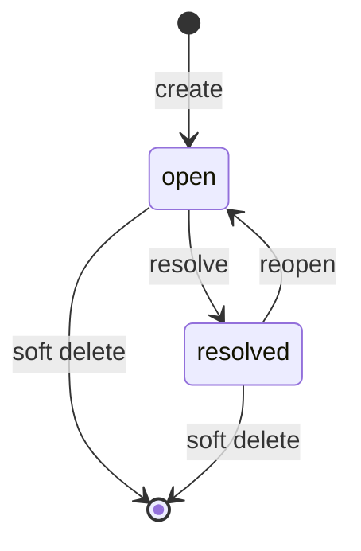

# Comments

## Intent

Comments is a small, regular, project-scoped kind that stores durable,
user-authored annotations against project resources. A Comment contains plain
text, a target resource, an optional resource-owned location hint, its current
open/resolved state, and attribution.

The first version intentionally stays narrow:

- flat comments, rather than discussion threads or replies;
- one current plain-text body, rather than Rich Text or body revisions;
- opaque, best-effort sub-targets, rather than a shared anchor-resolution
  system; and
- one-way publication of accepted comment changes to Activity.

Comments owns neither target content nor target lifecycle. It is built with
the configured project ID only; no user ID participates in table partitioning.
Actor identity is attribution on accepted changes, not a storage scope.

This document is the current Comments design. The older
[`docs/capabilities/comments.md`](../docs/capabilities/comments.md) describes
the deliberately deferred threaded/revisioned/anchor-scanning system and must
not be used as the implementation contract for this version.

## Boundaries

### Comments owns

- one Comment's identity, current body, parsed mention handles, target,
  resolution state, attribution, timestamps, and soft deletion;
- exact replay receipts for accepted public commands;
- a source-local Activity outbox, written atomically with each accepted
  comment mutation; and
- target-scoped, cursor-paginated comment reads.

### Comments does not own

- a resource's existence, content, revision history, permissions, or deletion;
- interpretation, transformation, reattachment, or freshness of a sub-target;
- threaded discussions, comment-body revisions, or undo/redo;
- Rich Text, Knowledge admission, or notification delivery; or
- user-directory lookup. A V1 mention is a normalized handle, not proof that
  a current user exists.

`subTarget` is therefore a presentation hint. For example, a Document client
may supply a text-range descriptor and a Slide client may supply an element
ID. On read, the owning resource/UI may resolve that hint, display it as stale,
or fall back to the resource-level comment. Comments itself never rewrites it.

V1 validates only that a target is structurally well formed. It deliberately
allows a resource to have become missing or deleted after a Comment was
created. A later resource-summary/anchor port can add existence validation or
resource-owned anchor resolution without making Comments import Document,
Slides, or another resource kind.

## Repository placement and construction

Comments follows the current regular-capability layout rather than the legacy
flat layout used by some older capabilities:

```text
apps/backend/src/
  1-init/create/comments.ts
  3-capabilities/comments/
    application/commentService.ts
    domain/errors.ts
    domain/model.ts
    domain/validation.ts
    persistence/sqliteCommentStore.ts
    persistence/sqliteSchema.ts
    ports/activityPublisher.ts
    ports/commentStore.ts
    wire/commandSchemas.ts
    wire/querySchemas.ts
    docs/
      README.md
      concepts.md
      flows.md
      invariants.md
      runtime.md
      types.md
    index.ts
  4-job-wiring/comments/
    registerCommentEndpoints.ts
```

Startup constructs Activity first, then creates Comments with a narrow
`CommentActivityPublisher` adapter. The Comments package depends only on its
publisher port, never on Activity's runtime or SQLite adapter. Startup
registers the endpoint mapping and calls `comments.publishPendingActivity()`
before accepting HTTP traffic.

Context is not a Comments runtime prerequisite. Its generic `ContextEntry`
atom may later reference `{ id, kind: "comment" }`, but that does not require
Comments to construct, import, or call Context.

## Core model

```ts
type IsoTimestamp = string;
type CommentState = "open" | "resolved";
type CommentOrigin = "user" | "agent" | "automation" | "system";

type JsonValue =
  | null
  | boolean
  | number
  | string
  | readonly JsonValue[]
  | { readonly [key: string]: JsonValue };

interface CommentTarget {
  /** A non-empty canonical resource label, such as "document", "slides",
   * or "general::file::text". */
  readonly resourceKind: string;
  readonly resourceId: string;

  /** A bounded, canonical JSON hint interpreted only by the resource owner. */
  readonly subTarget?: JsonValue;
}

interface Comment {
  readonly id: string;
  readonly body: string;

  /** Server-parsed, normalized @handle values. These are not user IDs in V1. */
  readonly mentions: readonly string[];
  readonly target: CommentTarget;
  readonly state: CommentState;

  readonly createdBy: string;
  readonly updatedBy: string;
  readonly createdAt: IsoTimestamp;
  readonly updatedAt: IsoTimestamp;
  readonly deletedAt?: IsoTimestamp;
}

interface CommentAttribution {
  readonly actorId: string;
  readonly origin: CommentOrigin;
}
```

IDs use the repository's normal `randomUUID()` convention. A Comment has no
revision and no arbitrary `kind` field: the resource kind is `"comment"` when
the Comment itself is referenced, while `target.resourceKind` identifies the
resource it annotates.

An omitted `subTarget` means a resource-level comment. `null` is not used as a
second spelling for that case. The service accepts JSON values only, sorts
object keys for persistence/digest purposes, and rejects unsupported values,
cycles, non-finite numbers, or values over the configured size limit.

## Admission limits and mention parsing

V1 has bounded plain-text input:

| Value | Default limit |
| --- | --- |
| Comment body | 16 KiB UTF-8 after trimming |
| Resource kind / ID / actor ID | 4,096 UTF-8 bytes each |
| Serialized sub-target | 16 KiB UTF-8 |
| Distinct mentions | 64 |
| Mention handle | 64 ASCII characters |
| Target-list page | default 50, maximum 200 |

The server, not the frontend, is authoritative for mention parsing. It detects
standalone `@handle` tokens whose handles contain ASCII letters, numbers,
periods, underscores, or dashes; it does not treat the `@` in an email address
as a mention. Handles are normalized for case-insensitive de-duplication and
stored as raw handles. There is no V1 lookup by mentioned user and no claim
that a handle is an authenticated principal.

If notifications or a “mentions for me” query become a product requirement, a
future user-directory adapter must resolve handles to principal IDs at write
time. At that point, add a normalized `comment_mentions` table/index; querying
the JSON array is intentionally not an advertised V1 operation.

## Commands, queries, and trusted attribution

The public surface uses two static paths, matching the current exact-path Job
registry. It does not use `:id` route templates.

```ts
type CommentCommand =
  | {
      type: "comment.create";
      requestId: string;
      body: string;
      target: CommentTarget;
    }
  | {
      type: "comment.update";
      requestId: string;
      commentId: string;
      body: string;
    }
  | {
      type: "comment.resolve";
      requestId: string;
      commentId: string;
    }
  | {
      type: "comment.reopen";
      requestId: string;
      commentId: string;
    }
  | {
      type: "comment.delete";
      requestId: string;
      commentId: string;
    };

type CommentQuery =
  | { type: "comment.get"; commentId: string }
  | {
      type: "comment.listByTarget";
      target: Pick<CommentTarget, "resourceKind" | "resourceId">;
      state?: CommentState;
      cursor?: string;
      limit?: number;
    };

interface CommentCommandResult {
  readonly type:
    | "comment.created"
    | "comment.updated"
    | "comment.resolved"
    | "comment.reopened"
    | "comment.deleted";
  readonly comment?: Comment;
}

interface CommentsCapability {
  command(command: CommentCommand): Promise<CommentCommandResult>;
  query(query: CommentQuery): Promise<Comment | null | CommentPage>;
  publishPendingActivity(limit?: number): Promise<number>;
}

interface CommentPage {
  readonly items: readonly Comment[];
  readonly nextCursor?: string;
}
```

The Comments service receives trusted `CommentAttribution` from composition.
No public command admits `createdBy`, `updatedBy`, `actorId`, or `origin`.
Every accepted mutation—including resolve, reopen, and delete—sets `updatedBy`
and `updatedAt` from that trusted attribution. A future authenticated transport
can supply the same narrow attribution value without making any public payload
authoritative.

Commands are serial and queries are concurrent. Serial command admission gives
one deterministic accepted order for Comment state changes, receipts, and
outbox entries without introducing a Comment revision/CAS model. The SQLite
transaction remains the correctness boundary: mutation statements must also
exclude `deleted_at IS NOT NULL`, so a deleted Comment cannot be modified by a
racing or stale command.

An exact replay of a command request ID returns its stored result. Reusing a
request ID with a different canonical command returns an idempotency mismatch.
A new command against a soft-deleted Comment returns not found. An exact replay
of the accepted delete still returns its original stored delete result.

## Endpoints

| Method | Path | Job | Queue | Purpose |
| --- | --- | --- | --- | --- |
| `POST` | `/comments/command` | `comments.command.v1` | serial / inline | Decode and apply one `CommentCommand`. |
| `POST` | `/comments/query` | `comments.query.v1` | concurrent / inline | Decode and run one `CommentQuery`. |

The command/query decoders use strict object keys, validate all bounds, and
never accept caller-controlled attribution. They map malformed input to 400,
missing or soft-deleted Comments to 404, and an idempotency mismatch to 409.
Unexpected errors are logged without comment-body or sub-target content.

## Persistence

Comments uses `./data/comments.db` with table names prefixed by the first 16
hex characters of SHA-256(project ID). SQLite enables WAL, foreign keys,
a five-second busy timeout, and NORMAL synchronous mode. The capability has a
small three-table durable boundary—not a thread/revision history system.

```sql
CREATE TABLE IF NOT EXISTS cmt_${prefix}_comments (
  id              TEXT PRIMARY KEY,
  body            TEXT NOT NULL,
  mentions_json   BLOB NOT NULL,
  resource_kind   TEXT NOT NULL,
  resource_id     TEXT NOT NULL,
  sub_target_json BLOB,
  state           TEXT NOT NULL CHECK (state IN ('open', 'resolved')),
  created_by      TEXT NOT NULL,
  updated_by      TEXT NOT NULL,
  created_at      TEXT NOT NULL,
  updated_at      TEXT NOT NULL,
  deleted_at      TEXT
);

CREATE TABLE IF NOT EXISTS cmt_${prefix}_command_receipts (
  request_id      TEXT PRIMARY KEY,
  request_digest  TEXT NOT NULL,
  result_json     BLOB NOT NULL,
  created_at      TEXT NOT NULL
);

CREATE TABLE IF NOT EXISTS cmt_${prefix}_activity_outbox (
  transaction_id  TEXT PRIMARY KEY,
  source_request_id TEXT NOT NULL UNIQUE,
  operation       TEXT NOT NULL
    CHECK (operation IN ('created', 'updated', 'resolved', 'reopened', 'deleted')),
  comment_id      TEXT NOT NULL,
  resource_kind   TEXT NOT NULL,
  resource_id     TEXT NOT NULL,
  state           TEXT NOT NULL CHECK (state IN ('open', 'resolved')),
  mention_count   INTEGER NOT NULL CHECK (mention_count >= 0),
  actor_id        TEXT NOT NULL,
  origin          TEXT NOT NULL
    CHECK (origin IN ('user', 'agent', 'automation', 'system')),
  occurred_at     TEXT NOT NULL,
  published_at    TEXT
);

CREATE INDEX IF NOT EXISTS cmt_${prefix}_comments_target
  ON cmt_${prefix}_comments(resource_kind, resource_id, state, created_at, id)
  WHERE deleted_at IS NULL;

CREATE INDEX IF NOT EXISTS cmt_${prefix}_activity_unpublished
  ON cmt_${prefix}_activity_outbox(occurred_at, transaction_id)
  WHERE published_at IS NULL;
```

Every state-changing Comment mutation, its request receipt, and its Activity
outbox row commit together. A no-op resolve/reopen still receives a receipt but
does not create an Activity row. The outbox copies the target, resulting state,
and mention count needed for safe Activity publication; a publisher never reads
mutable Comment state to reconstruct an older event. There is no foreign key
from Comments to the annotated resource: resource kinds own independent
databases and lifecycle.

## Activity publication

After a Comment transaction commits, its publisher converts the outbox row to
an Activity transaction:

```ts
{
  id: transactionId,
  kind: "comment",
  resourceId: commentId,
  operation: "created" | "updated" | "resolved" | "reopened" | "deleted",
  actorId,
  origin,
  occurredAt,
  metadata: {
    target: { resourceKind, resourceId },
    state,
    mentionCount
  }
}
```

It never copies the Comment body, raw mention handles, or sub-target into
Activity metadata. The publisher marks the outbox row published only after
Activity accepts the stable transaction ID. A delivery failure leaves the
accepted Comment intact and the source row unpublished; post-commit delivery
and startup recovery can safely retry the same transaction ID.

Comments exposes only a narrow `CommentActivityPublisher` port. Composition
maps it to Activity, exactly as Document does, so neither capability receives a
reference to the other’s service or database.

## Lifecycle and invariants



1. Body, target kind, target ID, request ID, and trusted actor ID are trimmed,
   non-empty, and within their configured bounds.
2. A target’s optional sub-target is canonical, bounded JSON and is never
   interpreted or rewritten by Comments.
3. `createdBy` and `createdAt` never change. Every accepted mutation updates
   `updatedBy` and `updatedAt`.
4. `resolve` and `reopen` are idempotent. A command against an already-matching
   state records its own replay receipt but leaves the Comment unchanged and
   does not create a new Activity transaction.
5. Soft-deleted Comments are absent from ordinary get/list results and reject
   all new mutations.
6. Target listing is ascending `(createdAt, id)` and cursor-stable.
7. Request replay is digest-backed. It neither changes the Comment nor creates
   another Activity transaction.
8. Every state-changing accepted mutation has exactly one self-contained source
   Activity transaction. Source state remains authoritative if Activity
   publication is delayed or retried.
9. Comments has no Comment revision, thread, body-revision, target-existence,
   or anchor-freshness invariant in V1.

## Deferred work

- **Threads and replies.** Add these only if the product needs conversations,
  shared resolution, or reply ordering. A `threadId` migration changes more
  than storage: it also changes the meaning of resolve/reopen and target-list
  presentation.
- **Resource-owned anchors.** A resource adapter may later validate targets,
  transform exact text anchors, or offer explicit reattachment. Comments keeps
  the opaque stored reference and remains independent of that work.
- **Mention identity and notifications.** Introduce a user-directory/identity
  port and normalized mention rows before notifications or “mentioned me”
  queries exist. Activity is an immutable history ledger, not a notification
  delivery system.
- **Rich comment bodies.** This requires a deliberate Rich Text integration;
  V1 plain text is not a placeholder for unvalidated markup.
- **Undo/redo and body history.** Add only with a defined user-facing restore
  model. Current bodies are intentionally last-write-wins in accepted serial
  command order.

## Implementation order

1. Create the domain model, strict decoders, bounded mention parser, store
   port, and project-bound SQLite schema.
2. Implement atomic create/mutate/receipt/outbox commits and cursor target
   queries, with focused persistence and replay tests.
3. Add the narrow Activity publisher port, initialization adapter, post-commit
   publication, and startup outbox recovery.
4. Register the two static endpoints and add endpoint tests proving that public
   payloads cannot select attribution and that retry is idempotent.
5. Add the six capability docs from executable code, then consider resource
   target adapters, threads, or notifications only when their product need is
   concrete.
