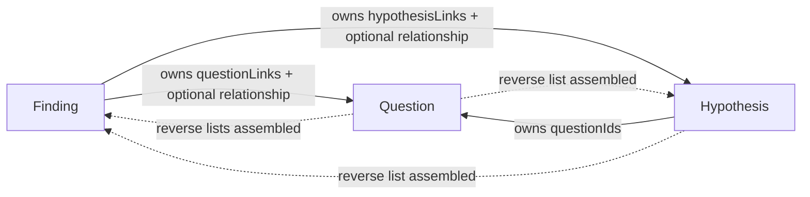
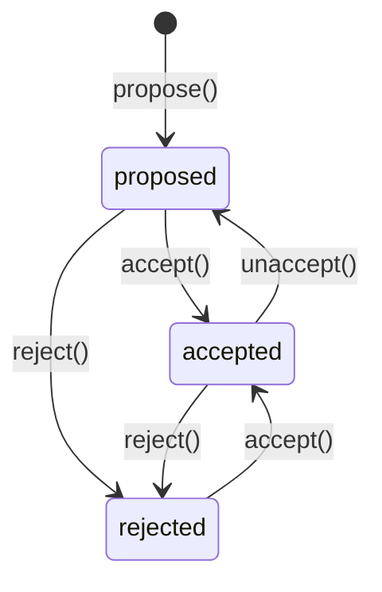

# Findings Capability — Design

## Summary

Findings is a **regular capability** (`3-capabilities/findings/`) that owns
curated, reference-grounded claims. A Finding is a persistent resource that
records what was observed, what it refers to, and what conclusion or implication
was drawn. It bridges the gap between raw retrieval (Knowledge lattice windows)
and synthesized outputs (Derived Outputs) by giving the user — or an agent — a
durable place to capture an extracted fact, observation, or inference that
deserves to stand alone.

Findings are **project-scoped** — the store is constructed with the project ID
and table names derive from it. There is no user-scoped findings store.

### What it is

- A **claim** expressed as free text — the user's or model's statement of what
  was found.
- **Reference grounding**: one or more `FindingReference` values that identify
  exactly what resource or external link the claim concerns, with optional
  character/line spans and commentary.
- A **lifecycle**: `proposed` → `accepted` (or `rejected`). Findings can move
  back from `accepted` to `proposed` if the claim needs reworking.
- **Knowledge lattice admission on acceptance**: when `accepted`, the claim
  text is added to the Knowledge lattice as a record with `label: "finding"`,
  making it retrievable alongside indexed project material. Claim-digest
  revisioning makes repeated acceptance idempotent.
- **Tags** for classification, and optional links to **questions** and
  **hypotheses** that this finding bears on.

### What it is not

- It is **not** raw evidence from a Derived Output run. Evidence attached to a
  Derived Output revision is ephemeral provenance for that specific generation.
  Findings are persistent, curated, and independently managed.
- It is **not** a replacement for a referenced resource or external link. That
  reference remains the authority; a Finding is an extracted interpretation.
- It is **not** a chat or conversational artifact. Findings are durable project
  objects.
- It does **not** have its own attachment mechanism. If a finding needs an
  attached file (e.g., a screenshot), upload it as a General File and
  reference the file ID in the finding's `references`.

### Relationship to Evidence

The Derived Outputs design distinguishes "evidence" (generation-time provenance)
from "findings" (persistent extracted claims). A Finding can be promoted from
evidence — a user can select a piece of evidence from a Derived Output revision,
write a claim that captures what it means, and create a Finding that stands on
its own. The Finding may reference the same spans as the original
evidence, but it carries the user's own language and judgment.

### Prerequisites

| Prerequisite | Finding dependency |
|---|---|
| Platform — Knowledge | `knowledge.add()` for lattice admission on acceptance; `knowledge.remove()` on status change or deletion. |
| Platform — Intelligence | Not a direct dependency; findings are human-authored (or agent-authored via Reasoning). |
| Capability — Context | `ContextEntry` is the grouping mechanism. Findings are referenced as `{ id, kind: "finding" }`. |
| Runtime config, Logger | Standard factory injection. |

### Build position

Research group, alongside Evidence and Research. Findings is a prerequisite for
Research (which consumes findings as inputs to question-answering and hypothesis
testing). It depends on Knowledge (Foundations group) and Context (Foundations
group).

---

## Where it lives

```
apps/backend/src/
  3-capabilities/
    findings/
      types.ts           # All domain types, errors
      store.ts           # FindingStore interface
      sqlite-store.ts    # SQLite implementation
      findings.ts        # FindingService factory + impl
      index.ts           # Barrel export

  4-job-wiring/
    findings/
      registerFindingsEndpoints.ts
```

Follows the **simple flat structure** pattern (same as Context, Structured Data).

---

## Core types

### Finding

```ts
type FindingStatus = "proposed" | "accepted" | "rejected";

type FindingRelationship =
  | "supports"
  | "refutes"
  | "qualifies"
  | "contextualizes";

interface FindingQuestionLink {
  readonly questionId: string;
  /** Omit when the Finding is relevant but unclassified. */
  readonly relationship?: FindingRelationship;
}

interface FindingHypothesisLink {
  readonly hypothesisId: string;
  /** Omit when the Finding is relevant but unclassified. */
  readonly relationship?: FindingRelationship;
}

interface Finding {
  /** Random 16-byte hex UUID. Stable identity — never changes. */
  readonly id: string;

  /** The extracted fact, observation, or implication. */
  readonly claim: string;

  /** One or more lightweight references. */
  readonly references: readonly FindingReference[];

  /** Why this Finding matters, including caveats that apply to the whole claim. */
  readonly commentary?: string;

  readonly status: FindingStatus;
  readonly tags: readonly string[];

  /** Relationships owned and persisted by Findings. */
  readonly questionLinks: readonly FindingQuestionLink[];
  readonly hypothesisLinks: readonly FindingHypothesisLink[];

  /** Internal Knowledge source ID, present only while accepted. */
  readonly knowledgeSourceId?: string;

  readonly createdBy: string;
  readonly updatedBy: string;
  readonly createdAt: string;
  readonly updatedAt: string;
  readonly deletedAt?: string;
}
```

No `kind` field is stored on a Finding. In `ContextEntry` usage it is
referenced as `{ id, kind: "finding" }`; `"finding"` is a Context kind, not a
Finding property.

Findings are mutable records and do not add a domain revision or a custom
conflict protocol. Authored changes use the project's serial queue and
deterministic last-write-wins order.

### FindingReference

There is no generic `Source` domain object. A reference records the locator
already owned by a resource capability or an ordinary webpage URL:

```ts
type FindingReference =
  | {
      readonly kind: "resource";
      readonly resourceKind: string;
      readonly resourceId: string;
      /** Optional subresource locator, such as a slide or connector item. */
      readonly locator?: string;
      /**
       * Exact owner revision value observed by the Finding. It is required
       * when resourceKind belongs to an owner that exposes revisions.
       */
      readonly resourceRevision?: number | string;
      readonly span?: FindingReferenceSpan;
      readonly note?: string;
      readonly needsReview?: boolean;
    }
  | {
      readonly kind: "url";
      readonly href: string;
      /** When this page was retrieved or observed. */
      readonly observedAt: string;
      readonly span?: FindingReferenceSpan;
      readonly note?: string;
      readonly needsReview?: boolean;
    };

type FindingReferenceSpan =
  | { kind: "characters"; start: number; end: number }
  | { kind: "lines"; startLine: number; endLine: number };

const findingNeedsReview = (finding: Finding): boolean =>
  finding.references.some((reference) => reference.needsReview === true);
```

The field names reuse the repository's Rich Text and resource-descriptor
conventions. Revision values are not converted to a new format:

- General Files expose a numeric resource revision; their content-addressed
  `resourceId` also pins the uploaded bytes.
- Connector resources currently expose the Connector's numeric revision in
  the runtime manifest. A precise connector-item integration may instead use
  the provider's string `revisionToken`; the union already accepts either.
- Documents and Decks expose numeric revisions when referenced through their
  owning capabilities.
- Known revisioned resource kinds must record the revision used. Only a
  resource whose owner exposes no revision may omit `resourceRevision`.
- A webpage has no controlled revision. `observedAt` records when it was seen
  and does not imply that later external changes can be detected.

`span` and `note` are optional. Character spans use UTF-16 code units and line
spans are 1-based, matching Derived Outputs evidence.

### Review and staleness

Each reference may be marked `needsReview: true`. The service provides small
operations to mark and clear that flag. Clearing it means a caller has
validated the reference against the current material; it does not alter the
claim or lifecycle status.

The overall answer to “might this Finding be stale?” is always the derived
`findingNeedsReview(finding)` function. There is no Finding-level stale field,
review-state enum, review timestamp, or automatic change-detection subsystem.
An owning capability may call the mark operation when it already knows a
referenced resource changed, but that optional hook is not required for the
Findings capability to work.

### Relationship meaning and ownership

The optional relationship has exactly four meanings:

- `supports`: the Finding favors the Question or Hypothesis;
- `refutes`: the Finding weighs against it;
- `qualifies`: the Finding narrows, conditions, or limits it; and
- `contextualizes`: the Finding supplies background or explains why it is
  worth considering without supporting or refuting it.

Findings persists both link arrays and is their only mutable authority.
Questions and Hypotheses expose reverse Finding references by querying
Findings; they do not persist synchronized copies. The relationship is always
read from the Finding toward its target. A reverse `supports` reference still
means “the Finding supports the target.”

Hypotheses separately owns `questionIds`; Questions derives its reverse
Hypothesis list from that capability. No link entity, inverse enum, or generic
relationship graph is introduced.



---

## Store interface

```ts
interface FindingStore {
  /** Look up a single finding by ID. Returns undefined if not found or soft-deleted. */
  get(id: string): Finding | undefined;

  /** List non-deleted findings, ordered by updatedAt descending. */
  list(filter?: {
    status?: FindingStatus;
    questionId?: string;
    hypothesisId?: string;
  }): Finding[];

  /**
   * Atomically insert a new finding. Fails if ID already exists.
   */
  insert(finding: Finding): void;

  /**
   * Atomically update an existing finding. Last write wins — no optimistic
   * concurrency.
   */
  update(finding: Finding): void;

  /** Soft-delete a finding. Sets deletedAt. */
  softDelete(id: string, deletedAt: string): void;
}
```

Synchronous interface (SQLite via `better-sqlite3`), matching the Context and
Structured Data patterns.

---

## Service layer

```ts
interface FindingService {
  /**
   * Propose a new finding. The finding is created with status "proposed".
   * Returns the created Finding.
   */
  propose(request: ProposeFindingRequest): Promise<Finding>;

  /**
   * Accept a finding. Transitions status to "accepted" and admits the claim
   * text into Knowledge with label "finding". The claim digest is passed as
   * the Knowledge revision, so repeated accepts converge on one record.
   * Returns the updated Finding with knowledgeSourceId populated.
   *
   * Works from any status. If already accepted, this is idempotent (no
   * duplicate lattice admission).
   */
  accept(id: string): Promise<Finding>;

  /**
   * Move an accepted finding back to proposed. Removes the claim from the
   * Knowledge lattice. The finding can then be edited and re-accepted.
   */
  unaccept(id: string): Promise<Finding>;

  /** Reject a finding. Transitions status to "rejected". Works from any status. */
  reject(id: string): Promise<Finding>;

  /**
   * Update a finding's claim, references, commentary, tags, Question links,
   * or Hypothesis links. Works regardless of status.
   *
   * Updates are serialized. If an accepted claim changes, its stable Knowledge
   * record is refreshed with the new claim digest.
   */
  update(id: string, request: UpdateFindingRequest): Promise<Finding>;

  /** Set one reference's review flag without changing claim or status. */
  markReferenceForReview(id: string, referenceIndex: number): Promise<Finding>;

  /** Clear one reference's review flag after validation. */
  clearReferenceReview(id: string, referenceIndex: number): Promise<Finding>;

  /** List findings by status or relationship target. */
  list(filter?: {
    status?: FindingStatus;
    questionId?: string;
    hypothesisId?: string;
  }): Promise<Finding[]>;

  /** Reverse views used by Question and Hypothesis runtime assemblers. */
  listForQuestion(questionId: string): Promise<readonly {
    finding: Finding;
    relationship?: FindingRelationship;
  }[]>;
  listForHypothesis(hypothesisId: string): Promise<readonly {
    finding: Finding;
    relationship?: FindingRelationship;
  }[]>;

  /** Get a single finding by ID. */
  get(id: string): Promise<Finding | null>;

  /** Soft-delete a finding. Removes from knowledge lattice if accepted. */
  delete(id: string): Promise<void>;
}

interface ProposeFindingRequest {
  readonly claim: string;
  readonly references: readonly FindingReference[];
  readonly commentary?: string;
  readonly tags?: readonly string[];
  readonly questionLinks?: readonly FindingQuestionLink[];
  readonly hypothesisLinks?: readonly FindingHypothesisLink[];
}

interface UpdateFindingRequest {
  readonly claim?: string;
  readonly references?: readonly FindingReference[];
  readonly commentary?: string;
  readonly tags?: readonly string[];
  readonly questionLinks?: readonly FindingQuestionLink[];
  readonly hypothesisLinks?: readonly FindingHypothesisLink[];
}
```

### Factory

```ts
function createFindingService(
  store: FindingStore,
  knowledge: Knowledge,
  logger: Logger
): FindingService;
```

`markReferenceForReview` and `clearReferenceReview` address the reference by
its index in the current Finding aggregate. They run on the serial queue,
reject an out-of-range index, and change only `needsReview`. This avoids adding
a reference ID or review-history entity merely to toggle one flag.

`listForQuestion` and `listForHypothesis` query the Finding-owned arrays and
return the same optional relationship value. They are read projections, not a
second relationship store.

---

## Lattice integration

When a Finding is **accepted**:

1. The service constructs a stable internal Knowledge source ID:
   `finding:{findingId}` — stable and scoped by finding identity.
2. The claim text is admitted to the Knowledge lattice:
   ```
   knowledge.add({
     sourceId: "finding:{findingId}",
     label: "finding",
     revision: sha256(finding.claim),
     text: finding.claim
   })
   ```
3. The Finding record is updated with
   `knowledgeSourceId = "finding:{findingId}"`.

`accept()` is concurrent and deliberately idempotent. The stable Knowledge
source ID and claim digest allow `Knowledge.add()` to skip already-admitted
content. The implementation should document that repeated accepts are safe;
they may race for work but must converge on the same record and status. If a
serial edit changes the claim before acceptance is committed, acceptance
re-reads and retries with the current claim digest rather than marking the new
claim accepted with an older indexed record.

When a Finding is **unaccepted** or **deleted**:

1. If `knowledgeSourceId` is present, `knowledge.remove(knowledgeSourceId)` is
   called to delete the indexed claim, its windows, and its lattice nodes.
2. The Finding record is updated accordingly.

When an accepted Finding is **updated** and the claim text changes:

1. The serial update calls `knowledge.add()` with the same source ID and the
   new claim digest as its revision.
2. Knowledge replaces the indexed claim when the digest changed and skips it
   when it did not.
3. `knowledgeSourceId` remains stable because it is keyed to Finding identity,
   not claim content.

`knowledgeSourceId` is the existing internal Knowledge API term. It is not a
first-class Source object and is never used as a `FindingReference`; callers
ground Findings through resource identities or URLs.

### Why add accepted findings to the lattice

Accepted findings represent extracted facts — they are project knowledge. By
admitting them to the lattice, they become:

- Retrievable in future Knowledge queries alongside indexed project material.
- Scopable via Context entries (a Context containing a finding will scope
  retrieval to that finding's text).
- Available as inputs to Derived Output generation and Research runs.

This is what the product definition means by "Admitted evidence enters
knowledge lattice." The finding's claim text becomes a Knowledge record with
`label: "finding"`, distinguishing it from other indexed material in retrieval
regions.

---

## Grouping via Context

Findings do not carry their own grouping mechanism. Instead, they are grouped
using the existing **Context** capability:

```ts
// A context entry pointing to a finding:
const entry: ContextEntry = { id: "abc123", kind: "finding" };

// Group findings together:
const group = await context.declare("Key findings on revenue", [
  { id: "finding-1", kind: "finding" },
  { id: "finding-2", kind: "finding" },
  { id: "finding-3", kind: "finding" },
]);
```

Benefits of this approach:
- No new grouping abstraction. Context already supports naming, revision,
  soft-delete, and hierarchical resolution.
- Contexts containing findings can themselves scope Knowledge retrieval.
- User and project scoping are inherited from Context.

### Context kind registration

The `kind: "finding"` string must be registered in the Context resolver so it
can resolve to an internal Knowledge source ID. The resolution path:

```
ContextEntry { id: "abc123", kind: "finding" }
  → FindingStore.get("abc123")
  → Finding.knowledgeSourceId ("finding:abc123")
  → Knowledge sourceId (internal admissible ID for scope filtering)
```

This requires the Context `KnowledgeResourceResolver` (injected into Knowledge)
to understand how to map `kind: "finding"` to its lattice source ID. This is a
trivial addition to the resolver: it queries the Finding store for the
`knowledgeSourceId`.

---

## Endpoints

Following the standard job-wiring pattern:

### `POST /findings/propose`

```
Method:  POST
Path:    /findings/propose
Body:    ProposeFindingRequest
Queue:   concurrent
Mode:    inline
```

Creates a finding with status `"proposed"`.

### `POST /findings/accept`

```
Method:  POST
Path:    /findings/accept
Body:    { id: string }
Queue:   concurrent
Mode:    inline
```

Transitions to `"accepted"` and idempotently admits to Knowledge. Repeated
accepts use the same source ID and claim digest, so they safely converge.

### `POST /findings/unaccept`

```
Method:  POST
Path:    /findings/unaccept
Body:    { id: string }
Queue:   serial
Mode:    inline
```

Moves from `"accepted"` back to `"proposed"`. Removes claim from Knowledge
lattice. Serial (lattice mutation).

### `POST /findings/reject`

```
Method:  POST
Path:    /findings/reject
Body:    { id: string }
Queue:   serial
Mode:    inline
```

Transitions to `"rejected"`. It is serial because rejecting an accepted Finding
removes its Knowledge source.

### `POST /findings/update`

```
Method:  POST
Path:    /findings/update
Body:    { id: string } & UpdateFindingRequest
Queue:   serial
Mode:    inline
```

Updates claim, references, commentary, tags, Question links, or Hypothesis
links.
Updates are last-write-wins and always serial, so concurrent edits have a
defined order and an accepted claim refreshes Knowledge safely.

### `POST /findings/mark-reference-review`

```
Method:  POST
Path:    /findings/mark-reference-review
Body:    { id: string, referenceIndex: number }
Queue:   serial
Mode:    inline
```

Sets one reference's `needsReview` flag without changing claim or status.

### `POST /findings/clear-reference-review`

```
Method:  POST
Path:    /findings/clear-reference-review
Body:    { id: string, referenceIndex: number }
Queue:   serial
Mode:    inline
```

Clears one reference's review flag after validation.

### `GET /findings/list`

```
Method:  GET
Path:    /findings/list?status=proposed&questionId=...&hypothesisId=...
Queue:   concurrent
Mode:    inline
```

Lists Findings, optionally filtered by status or relationship target. Question
and Hypothesis runtime assemblers use the corresponding narrow reader methods,
which preserve each link's optional relationship value.

### `GET /findings/get`

```
Method:  GET
Path:    /findings/get?id=...
Queue:   concurrent
Mode:    inline
```

Returns a single finding.

### `DELETE /findings/delete`

```
Method:  DELETE
Path:    /findings/delete?id=...
Queue:   serial
Mode:    inline
```

Soft-deletes. Removes from lattice if accepted. Serial (lattice mutation).

> **Why not `/findings/:id`.** The transport registers exactly one Fastify
> route (`app.all("/*")`) and matches endpoints by exact string equality on
> `` `${method} ${path}` ``. There is no pattern matching and there are no path
> parameters anywhere in the backend — IDs travel in query strings or bodies.
> This is why the tree has `POST /connector/get` rather than
> `GET /connector/:id`. An earlier draft of this document specified
> `/findings/:id`, which could not have been registered.

---

## Error model

```ts
class FindingNotFoundError extends Error {
  constructor(id: string) { super(`Finding not found: ${id}`); }
}

class InvalidFindingOperationError extends Error {
  constructor(message: string) { super(message); }
}
```

HTTP mapping:

| Error | Status |
|---|---|
| `FindingNotFoundError` | 404 |
| `InvalidFindingOperationError` | 400 |

---

## SQL tables

Following the table-prefix pattern (SHA-256 of project ID, first 16 hex chars):

```sql
CREATE TABLE IF NOT EXISTS fnd_${prefix}_findings (
  id                   TEXT PRIMARY KEY,
  claim                TEXT NOT NULL,
  references_json      TEXT NOT NULL,   -- JSON array of FindingReference
  commentary           TEXT,
  status               TEXT NOT NULL CHECK (status IN ('proposed','accepted','rejected')),
  tags_json            TEXT NOT NULL DEFAULT '[]',   -- JSON array of strings
  question_links_json  TEXT NOT NULL DEFAULT '[]',   -- FindingQuestionLink[]
  hypothesis_links_json TEXT NOT NULL DEFAULT '[]',  -- FindingHypothesisLink[]
  knowledge_source_id  TEXT,
  created_by           TEXT NOT NULL,
  updated_by           TEXT NOT NULL,
  created_at           TEXT NOT NULL,
  updated_at           TEXT NOT NULL,
  deleted_at           TEXT
);

-- For resolving accepted Finding Context entries into Knowledge
CREATE INDEX IF NOT EXISTS fnd_${prefix}_findings_knowledge_source
  ON fnd_${prefix}_findings(knowledge_source_id)
  WHERE deleted_at IS NULL AND status = 'accepted';
```

Single project-scoped table — no dual user/project tables. The store is
constructed with the project ID.

---

## Lifecycle state machine



- Findings can be edited in any status via `update()`.
- `accept()` moves a finding to accepted (adds to lattice). Works from any
  status — you can accept a rejected finding.
- `unaccept()` moves an accepted finding back to proposed (removes from
  lattice).
- `reject()` works from any status.
- Deletion is outside the domain status machine. It sets `deletedAt`; if the
  Finding was accepted, its Knowledge source is removed. Deleted Findings are
  absent from normal reads and relationship projections.
- When an accepted finding is updated and the claim text changes, the lattice
  source is refreshed under the same source ID with a new claim digest.

---

## Integration with Research

The Research capability (future) consumes Findings as inputs:

- **Question mode**: When answering a question, Research queries the Knowledge
  lattice. Accepted findings appear alongside indexed material in retrieval
  results (because they are Knowledge records with `label: "finding"`).
- **Evidence extraction**: A Research run may propose new Findings as part of
  its output — extracting specific claims from gathered material and
  attaching precise reference spans.
- **Review gate**: Proposed findings from a Research run are presented to the
  user for acceptance, rejection, or editing before entering the lattice.

This is why Findings is a prerequisite for Research — Research produces
findings, and findings enrich the lattice that Research queries.

---

## Invariants

1. Every Finding has at least one `FindingReference`.
2. `claim` is never empty.
3. A resource reference preserves its owner's numeric or string revision; a
   known revisioned resource cannot omit it. A URL records when it was
   observed. Neither requires a Source entity.
4. `findingNeedsReview(finding)` is true exactly when at least one reference
   has `needsReview === true`; no Finding-level stale value is stored.
5. An accepted Finding always has a non-null `knowledgeSourceId`.
6. Findings is the sole mutable owner of Question and Hypothesis relationship
   values; reverse lists are derived without inverting their meaning.
7. `accept()` is concurrent and idempotent through its stable Knowledge source
   ID plus claim digest. `update()`, review changes, `unaccept()`, `reject()`, and `delete()`
   are serial; updates are last-write-wins in that serial order.
8. Soft-deleted Findings are absent from normal reads and reverse projections.
