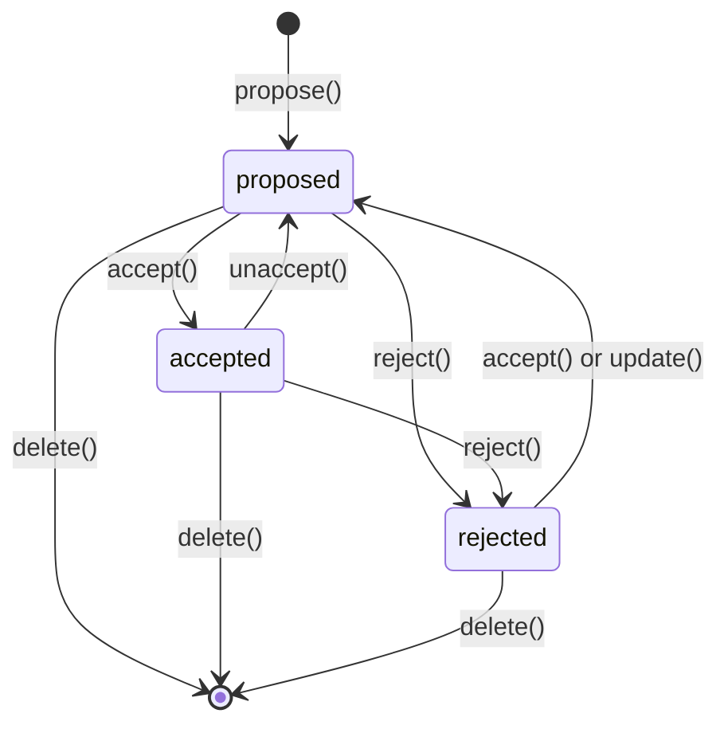

# Findings Capability — Design

## Summary

Findings is a **regular capability** (`3-capabilities/findings/`) that owns
curated, source-grounded claims extracted from project sources. A Finding is a
persistent resource that records what was observed, where it came from, and
what conclusion or implication was drawn. It bridges the gap between raw
retrieval (Knowledge lattice windows) and synthesized outputs (Derived Outputs)
by giving the user — or an agent — a durable place to capture an extracted
fact, observation, or inference that deserves to stand alone.

Findings are **project-scoped** — the store is constructed with the project ID
and table names derive from it. There is no user-scoped findings store.

### What it is

- A **claim** expressed as free text — the user's or model's statement of what
  was found.
- **Source grounding**: one or more `SourceReference` values that identify
  exactly where in a source the claim is supported, with optional byte/line
  spans and commentary.
- A **lifecycle**: `proposed` → `accepted` (or `rejected`). Findings can move
  back from `accepted` to `proposed` if the claim needs reworking.
- **Knowledge lattice admission on acceptance**: when `accepted`, the claim
  text is added to the Knowledge lattice as a source with `label: "finding"`,
  making it retrievable alongside original sources. If edited while accepted,
  the lattice source is removed and re-added with the updated claim.
- **Tags** for classification, and optional links to **questions** and
  **hypotheses** that this finding bears on.

### What it is not

- It is **not** raw evidence from a Derived Output run. Evidence attached to a
  Derived Output revision is ephemeral provenance for that specific generation.
  Findings are persistent, curated, and independently managed.
- It is **not** a replacement for sources. The original source remains the
  authority; a Finding is an extracted interpretation.
- It is **not** a chat or conversational artifact. Findings are durable project
  objects.
- It does **not** have its own attachment mechanism. If a finding needs an
  attached file (e.g., a screenshot), upload it as a General File and
  reference the file ID in the finding's `sources`.

### Relationship to Evidence

The Derived Outputs design distinguishes "evidence" (generation-time provenance)
from "findings" (persistent extracted claims). A Finding can be promoted from
evidence — a user can select a piece of evidence from a Derived Output revision,
write a claim that captures what it means, and create a Finding that stands on
its own. The Finding may reference the same source spans as the original
evidence, but it carries the user's own language and judgment.

### Prerequisites

| Prerequisite | Finding dependency |
|---|---|
| Platform — Knowledge | `knowledge.add()` for lattice admission on acceptance; `knowledge.remove()` on status change or deletion. |
| Platform — Intelligence | Not a direct dependency; findings are human-authored (or agent-authored via Reasoning). |
| Capability — Context | `ContextEntry` is the grouping mechanism. Findings are referenced as `{ id, kind: "finding" }`. |
| Runtime config, Logger | Standard factory injection. |

### Build position

Research group, alongside Evidence and Research. Findings is a prerequisite for
Research (which consumes findings as inputs to question-answering and hypothesis
testing). It depends on Knowledge (Foundations group) and Context (Foundations
group).

---

## Where it lives

```
apps/backend/src/
  3-capabilities/
    findings/
      types.ts           # All domain types, errors
      store.ts           # FindingStore interface
      sqlite-store.ts    # SQLite implementation
      findings.ts        # FindingService factory + impl
      index.ts           # Barrel export

  4-job-wiring/
    findings/
      registerFindingsEndpoints.ts
```

Follows the **simple flat structure** pattern (same as Context, Structured Data).

---

## Core types

### Finding

```ts
type FindingStatus = "proposed" | "accepted" | "rejected";

interface Finding {
  /** Random 16-byte hex UUID. Stable identity — never changes. */
  readonly id: string;

  /** The claim text — the extracted fact, observation, or implication. */
  readonly claim: string;

  /**
   * One or more source references grounding this finding.
   * At least one is required. Multiple sources can support the same claim
   * (e.g., corroborating evidence from different documents).
   */
  readonly sources: readonly SourceReference[];

  /** Optional free-text commentary. Why this finding matters, caveats, etc. */
  readonly commentary?: string;

  /** Lifecycle status. */
  readonly status: FindingStatus;

  /**
   * Free-form tags for classification. No predefined vocabulary — callers
   * supply whatever strings are meaningful (e.g. "revenue", "risk", "Q3").
   */
  readonly tags: readonly string[];

  /**
   * IDs of Questions this finding bears on.
   * Typically one (the question that drove the research that produced this
   * finding), but callers may attach multiple.
   */
  readonly questionIds: readonly string[];

  /**
   * IDs of Hypotheses this finding bears on.
   * Typically one, but callers may attach multiple.
   */
  readonly hypothesisIds: readonly string[];

  /**
   * The knowledge sourceId assigned when this finding was accepted into the
   * lattice. Present only when status === "accepted" and the claim has been
   * successfully added to Knowledge.
   */
  readonly knowledgeSourceId?: string;

  /** ID of the user or agent who created this finding. */
  readonly createdBy: string;

  /** ID of the user or agent who last updated this finding. */
  readonly updatedBy: string;

  readonly createdAt: string;
  readonly updatedAt: string;

  /** Soft delete. */
  readonly deletedAt?: string;
}
```

No `kind` field — the type itself is the kind. In `ContextEntry` usage it is
referenced as `{ id, kind: "finding" }`; the `"finding"` string is a Context
kind constant, not a field on the Finding model.

No `revision` field — findings are simple mutable records. There is no
optimistic concurrency. The last write wins.

### SourceReference

```ts
/**
 * Identifies a specific location within a source that grounds the claim.
 * This is the same shape as evidence spans in Derived Outputs, but persisted
 * independently as part of a Finding.
 */
interface SourceReference {
  /** The Knowledge sourceId. Matches SourceRecord.sourceId in the lattice. */
  readonly sourceId: string;

  /** The source kind/label (e.g. "document", "webpage", "general::file::text"). */
  readonly sourceKind: string;

  /**
   * Optional byte-range span within the source. Present when the claim is
   * grounded in a specific passage (most common case).
   */
  readonly span?: SourceSpan;

  /**
   * Optional free-text note about this specific source reference.
   * E.g. "Fig. 3 shows the revenue trend; Table 2 confirms the absolute values."
   */
  readonly note?: string;
}

type SourceSpan =
  | { kind: "byte-range"; start: number; end: number }
  | { kind: "line-range"; startLine: number; endLine: number };
```

### Design notes on SourceReference

- `sourceId` is the stable Knowledge lattice source ID. This is what
  `knowledge.add()` receives and what `SourceRecord.sourceId` stores.
- `sourceKind` is denormalized from the source's label at creation time so the
  frontend can display source type without a secondary lookup.
- `span` is optional: a finding may be grounded in an entire source rather
  than a specific passage (e.g., "This entire paper argues that...").
- `note` is per-reference commentary — distinct from the Finding-level
  `commentary`, which applies to the claim as a whole.

---

## Store interface

```ts
interface FindingStore {
  /** Look up a single finding by ID. Returns undefined if not found or soft-deleted. */
  get(id: string): Finding | undefined;

  /**
   * List all non-deleted findings, ordered by updatedAt desc.
   * Optional status filter.
   */
  list(filter?: { status?: FindingStatus }): Finding[];

  /**
   * Atomically insert a new finding. Fails if ID already exists.
   */
  insert(finding: Finding): void;

  /**
   * Atomically update an existing finding. Last write wins — no optimistic
   * concurrency.
   */
  update(finding: Finding): void;

  /** Soft-delete a finding. Sets deletedAt. */
  softDelete(id: string, deletedAt: string): void;
}
```

Synchronous interface (SQLite via `better-sqlite3`), matching the Context and
Structured Data patterns.

---

## Service layer

```ts
interface FindingService {
  /**
   * Propose a new finding. The finding is created with status "proposed".
   * Returns the created Finding.
   */
  propose(request: ProposeFindingRequest): Promise<Finding>;

  /**
   * Accept a finding. Transitions status to "accepted" and admits the claim
   * text into the Knowledge lattice as a source with label "finding".
   * Returns the updated Finding with knowledgeSourceId populated.
   *
   * Works from any status. If already accepted, this is idempotent (no
   * duplicate lattice admission).
   */
  accept(id: string): Promise<Finding>;

  /**
   * Move an accepted finding back to proposed. Removes the claim from the
   * Knowledge lattice. The finding can then be edited and re-accepted.
   */
  unaccept(id: string): Promise<Finding>;

  /** Reject a finding. Transitions status to "rejected". Works from any status. */
  reject(id: string): Promise<Finding>;

  /**
   * Update a finding's claim, sources, commentary, tags, questionIds, or
   * hypothesisIds. Works regardless of status.
   *
   * If the finding is "accepted" and the claim text changes, the old lattice
   * source is removed and the new claim is re-admitted.
   */
  update(id: string, request: UpdateFindingRequest): Promise<Finding>;

  /** List findings, optionally filtered by status. */
  list(filter?: { status?: FindingStatus }): Promise<Finding[]>;

  /** Get a single finding by ID. */
  get(id: string): Promise<Finding | null>;

  /** Soft-delete a finding. Removes from knowledge lattice if accepted. */
  delete(id: string): Promise<void>;
}

interface ProposeFindingRequest {
  readonly claim: string;
  readonly sources: readonly SourceReference[];
  readonly commentary?: string;
  readonly tags?: readonly string[];
  readonly questionIds?: readonly string[];
  readonly hypothesisIds?: readonly string[];
}

interface UpdateFindingRequest {
  readonly claim?: string;
  readonly sources?: readonly SourceReference[];
  readonly commentary?: string;
  readonly tags?: readonly string[];
  readonly questionIds?: readonly string[];
  readonly hypothesisIds?: readonly string[];
}
```

### Factory

```ts
function createFindingService(
  store: FindingStore,
  knowledge: Knowledge,
  logger: Logger
): FindingService;
```

---

## Lattice integration

When a Finding is **accepted**:

1. The service constructs a Knowledge source ID:
   `finding:{findingId}` — stable and scoped by finding identity.
2. The claim text is admitted to the Knowledge lattice:
   ```
   knowledge.add({
     sourceId: "finding:{findingId}",
     label: "finding",
     text: finding.claim
   })
   ```
3. The Finding record is updated with `knowledgeSourceId = "finding:{findingId}"`.

When a Finding is **unaccepted** or **deleted**:

1. If `knowledgeSourceId` is present, `knowledge.remove(knowledgeSourceId)` is
   called to delete the source, its windows, and its lattice nodes.
2. The Finding record is updated accordingly.

When an accepted Finding is **updated** and the claim text changes:

1. The old lattice source is removed (`knowledge.remove(oldSourceId)`).
2. The new claim text is admitted (`knowledge.add({ sourceId: sameFindingId, label: "finding", text: newClaim })`).
3. The `knowledgeSourceId` remains the same — it is keyed to the finding ID,
   not the claim content.

### Why add accepted findings to the lattice

Accepted findings represent extracted facts — they are project knowledge. By
admitting them to the lattice, they become:

- Retrievable in future Knowledge queries alongside original sources.
- Scopable via Context entries (a Context containing a finding will scope
  retrieval to that finding's text).
- Available as inputs to Derived Output generation and Research runs.

This is what the product definition means by "Admitted evidence enters
knowledge lattice." The finding's claim text becomes a Knowledge source with
`label: "finding"`, distinguishing it from original sources in retrieval
regions.

---

## Grouping via Context

Findings do not carry their own grouping mechanism. Instead, they are grouped
using the existing **Context** capability:

```ts
// A context entry pointing to a finding:
const entry: ContextEntry = { id: "abc123", kind: "finding" };

// Group findings together:
const group = await context.declare("Key findings on revenue", [
  { id: "finding-1", kind: "finding" },
  { id: "finding-2", kind: "finding" },
  { id: "finding-3", kind: "finding" },
]);
```

Benefits of this approach:
- No new grouping abstraction. Context already supports naming, revision,
  soft-delete, and hierarchical resolution.
- Contexts containing findings can themselves scope Knowledge retrieval.
- User and project scoping are inherited from Context.

### Context kind registration

The `kind: "finding"` string must be registered in the Context resolver so it
can resolve to a Knowledge source ID. The resolution path:

```
ContextEntry { id: "abc123", kind: "finding" }
  → FindingStore.get("abc123")
  → Finding.knowledgeSourceId ("finding:abc123")
  → Knowledge sourceId (admissible for scope filtering)
```

This requires the Context `KnowledgeResourceResolver` (injected into Knowledge)
to understand how to map `kind: "finding"` to its lattice source ID. This is a
trivial addition to the resolver: it queries the Finding store for the
`knowledgeSourceId`.

---

## Endpoints

Following the standard job-wiring pattern:

### `POST /findings/propose`

```
Method:  POST
Path:    /findings/propose
Body:    ProposeFindingRequest
Queue:   concurrent
Mode:    inline
```

Creates a finding with status `"proposed"`.

### `POST /findings/accept`

```
Method:  POST
Path:    /findings/accept
Body:    { id: string }
Queue:   serial
Mode:    inline
```

Transitions to `"accepted"` and admits to Knowledge lattice. Serial because it
mutates the lattice. Works from any status (idempotent if already accepted).

### `POST /findings/unaccept`

```
Method:  POST
Path:    /findings/unaccept
Body:    { id: string }
Queue:   serial
Mode:    inline
```

Moves from `"accepted"` back to `"proposed"`. Removes claim from Knowledge
lattice. Serial (lattice mutation).

### `POST /findings/reject`

```
Method:  POST
Path:    /findings/reject
Body:    { id: string }
Queue:   concurrent
Mode:    inline
```

Transitions to `"rejected"`. Works from any status.

### `POST /findings/update`

```
Method:  POST
Path:    /findings/update
Body:    { id: string } & UpdateFindingRequest
Queue:   concurrent (or serial if claim changes while accepted)
Mode:    inline
```

Updates claim, sources, commentary, tags, questionIds, or hypothesisIds.
Works regardless of status. If the finding is `"accepted"` and the claim text
changes, the service removes the old lattice source and re-admits the new
claim (this case requires a serial queue).

### `GET /findings/list`

```
Method:  GET
Path:    /findings/list?status=proposed
Queue:   concurrent
Mode:    inline
```

Lists findings, optionally filtered by status.

### `GET /findings/:id`

```
Method:  GET
Path:    /findings/:id
Queue:   concurrent
Mode:    inline
```

Returns a single finding.

### `DELETE /findings/:id`

```
Method:  DELETE
Path:    /findings/:id
Queue:   serial
Mode:    inline
```

Soft-deletes. Removes from lattice if accepted. Serial (lattice mutation).

---

## Error model

```ts
class FindingNotFoundError extends Error {
  constructor(id: string) { super(`Finding not found: ${id}`); }
}

class InvalidFindingOperationError extends Error {
  constructor(message: string) { super(message); }
}
```

HTTP mapping:

| Error | Status |
|---|---|
| `FindingNotFoundError` | 404 |
| `InvalidFindingOperationError` | 400 |

---

## SQL tables

Following the table-prefix pattern (SHA-256 of project ID, first 16 hex chars):

```sql
CREATE TABLE IF NOT EXISTS fnd_${prefix}_findings (
  id                   TEXT PRIMARY KEY,
  claim                TEXT NOT NULL,
  sources_json         TEXT NOT NULL,   -- JSON array of SourceReference
  commentary           TEXT,
  status               TEXT NOT NULL CHECK (status IN ('proposed','accepted','rejected')),
  tags_json            TEXT NOT NULL DEFAULT '[]',   -- JSON array of strings
  question_ids_json    TEXT NOT NULL DEFAULT '[]',   -- JSON array of strings
  hypothesis_ids_json  TEXT NOT NULL DEFAULT '[]',   -- JSON array of strings
  knowledge_source_id  TEXT,
  created_by           TEXT NOT NULL,
  updated_by           TEXT NOT NULL,
  created_at           TEXT NOT NULL,
  updated_at           TEXT NOT NULL,
  deleted_at           TEXT
);

-- For resolving ContextEntries to knowledge source IDs
CREATE INDEX IF NOT EXISTS fnd_${prefix}_findings_knowledge_source
  ON fnd_${prefix}_findings(knowledge_source_id)
  WHERE deleted_at IS NULL AND status = 'accepted';
```

Single project-scoped table — no dual user/project tables. The store is
constructed with the project ID.

---

## Lifecycle state machine



- Findings can be edited in any status via `update()`.
- `accept()` moves a finding to accepted (adds to lattice). Works from any
  status — you can accept a rejected finding.
- `unaccept()` moves an accepted finding back to proposed (removes from
  lattice).
- `reject()` works from any status.
- Deletion is soft (sets `deletedAt`). If accepted, the lattice source is
  removed.
- When an accepted finding is updated and the claim text changes, the lattice
  source is atomically removed and re-added with the new text.

---

## Integration with Research

The Research capability (future) consumes Findings as inputs:

- **Question mode**: When answering a question, Research queries the Knowledge
  lattice. Accepted findings appear alongside original sources in retrieval
  results (because they are lattice sources with `label: "finding"`).
- **Evidence extraction**: A Research run may propose new Findings as part of
  its output — extracting specific claims from gathered sources and
  attaching precise source spans.
- **Review gate**: Proposed findings from a Research run are presented to the
  user for acceptance, rejection, or editing before entering the lattice.

This is why Findings is a prerequisite for Research — Research produces
findings, and findings enrich the lattice that Research queries.

---

## Invariants

1. Every Finding has at least one `SourceReference`.
2. `claim` is never empty.
3. `sources[].sourceId` must reference an existing Knowledge source at proposal
   time (validated synchronously against the source registry).
4. An `accepted` Finding always has a non-null `knowledgeSourceId`.
5. Editing an accepted finding's claim text atomically replaces its lattice
   source (remove old source, add new source with same `knowledgeSourceId`).
6. `propose()` and `update()` are concurrent; `accept()`, `unaccept()`,
   and `delete()` that mutate the lattice are serial.

## Open questions

1. **Should tags be validated against a project taxonomy?** The current
   position is no: tags remain free-form strings. A project-level vocabulary
   would add complexity without a clear use case. Callers supply whatever
   strings are meaningful.

2. **Does a Finding need to express how it bears on a Hypothesis?**
   `hypothesisIds` currently means only “related to.” It cannot distinguish
   supports, refutes, qualifies, or provides context. Keep the simple ID list
   unless the product needs that distinction; if it does, introduce a small
   relationship value rather than trying to infer polarity from claim text.

3. **What should happen when a referenced source is later unavailable or
   replaced?** `SourceReference` currently records a stable Knowledge source
   ID, a display kind, and an optional span. It does not pin an immutable source
   revision. The initial implementation can display an unavailable reference,
   but immutable source-version references should be considered before Findings
   is used for audit-grade conclusions.

4. **How is an accepted update serialized?** The endpoint description says an
   ordinary update is concurrent but an accepted claim update mutates Knowledge
   and must serialize. Job queue selection is normally fixed when the endpoint
   is registered, so implementation should either make all updates serial or
   use one small internal critical section for the store-plus-Knowledge update.
   This is a coordination choice, not a reason to add a larger workflow.

5. **Should timestamps and actor IDs receive named primitive aliases?** The
   persisted boundary should remain JSON/SQLite-friendly strings, but aliases
   such as `IsoTimestamp` and `ActorId` could prevent a display date or an
   arbitrary string from being passed where an event time or actor identity is
   required. This is a type-safety refinement only; it does not require storing
   JavaScript `Date` objects.

6. **Is last-write-wins sufficient for interactive editing?** It is the
   simplest model and fits a small curated record. If two people are expected
   to edit the same claim regularly, add an optional update token or revision at
   that time; do not introduce ChangeSets or history merely in anticipation.
