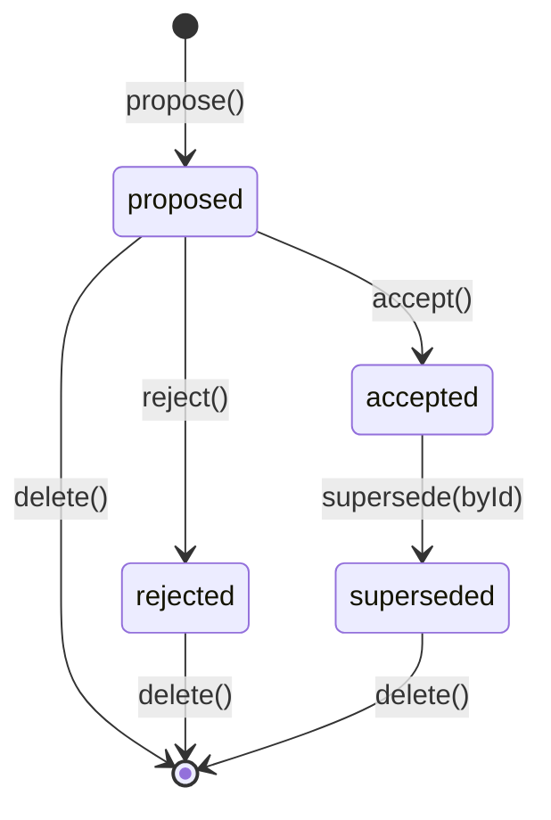

# Findings Capability — Design

## Summary

Findings is a **regular capability** (`3-capabilities/findings/`) that owns
curated, source-grounded claims extracted from project sources. A Finding is a
persistent resource that records what was observed, where it came from, and
what conclusion or implication was drawn. It bridges the gap between raw
retrieval (Knowledge lattice windows) and synthesized outputs (Derived Outputs)
by giving the user — or an agent — a durable place to capture an extracted
fact, observation, or inference that deserves to stand alone.

### What it is

- A **claim** expressed as free text — the user's or model's statement of what
  was found.
- **Source grounding**: one or more `SourceReference` values that identify
  exactly where in a source the claim is supported, with optional byte/line
  spans and commentary.
- A **lifecycle**: `proposed` → `accepted` (or `rejected`/`superseded`).
- **Knowledge lattice admission on acceptance**: when `accepted`, the claim
  text is added to the Knowledge lattice as a source with `label: "finding"`,
  making it retrievable alongside original sources.

### What it is not

- It is **not** raw evidence from a Derived Output run. Evidence attached to a
  Derived Output revision is ephemeral provenance for that specific generation.
  Findings are persistent, curated, and independently managed.
- It is **not** a replacement for sources. The original source remains the
  authority; a Finding is an extracted interpretation.
- It is **not** a chat or conversational artifact. Findings are durable project
  objects.

### Relationship to Evidence

The Derived Outputs design distinguishes "evidence" (generation-time provenance)
from "findings" (persistent extracted claims). A Finding can be promoted from
evidence — a user can select a piece of evidence from a Derived Output revision,
write a claim that captures what it means, and create a Finding that stands on
its own. The Finding may reference the same source spans as the original
evidence, but it carries the user's own language and judgment.

### Prerequisites

| Prerequisite | Finding dependency |
|---|---|
| Platform — Knowledge | `knowledge.add()` for lattice admission on acceptance; `knowledge.remove()` on rejection/deletion. |
| Platform — Intelligence | Not a direct dependency; findings are human-authored (or agent-authored via Reasoning). |
| Capability — Context | `ContextEntry` is the grouping mechanism. Findings have `{ id, kind: "finding" }`. |
| Runtime config, Logger | Standard factory injection. |

### Build position

Research group, alongside Evidence and Research. Findings is a prerequisite for
Research (which consumes findings as inputs to question-answering and hypothesis
testing). It depends on Knowledge (Foundations group) and Context (Foundations
group).

---

## Where it lives

```
apps/backend/src/
  3-capabilities/
    findings/
      types.ts           # All domain types, errors
      store.ts           # FindingStore interface
      sqlite-store.ts    # SQLite implementation
      findings.ts        # FindingService factory + impl
      index.ts           # Barrel export

  4-job-wiring/
    findings/
      registerFindingsEndpoints.ts
```

Follows the **simple flat structure** pattern (same as Context, Structured Data).

---

## Core types

### Finding

```ts
type FindingStatus = "proposed" | "accepted" | "rejected" | "superseded";

interface Finding {
  /** Random 16-byte hex UUID. Stable identity — never changes. */
  readonly id: string;

  /** Resource kind for ContextEntry usage. Always "finding". */
  readonly kind: "finding";

  /** The claim text — the extracted fact, observation, or implication. */
  readonly claim: string;

  /**
   * One or more source references grounding this finding.
   * At least one is required. Multiple sources can support the same claim
   * (e.g., corroborating evidence from different documents).
   */
  readonly sources: readonly SourceReference[];

  /** Optional free-text commentary. Why this finding matters, caveats, etc. */
  readonly commentary?: string;

  /** Lifecycle status. */
  readonly status: FindingStatus;

  /**
   * When status is "superseded", the ID of the Finding that replaced this one.
   * A Finding may be superseded by a more precise or corrected claim.
   */
  readonly supersededById?: string;

  /**
   * The knowledge sourceId assigned when this finding was accepted into the
   * lattice. Present only when status === "accepted" and the claim has been
   * successfully added to Knowledge.
   */
  readonly knowledgeSourceId?: string;

  /** Monotone revision counter starting at 1. */
  readonly revision: number;

  readonly createdAt: string;
  readonly updatedAt: string;

  /** Soft delete. */
  readonly deletedAt?: string;
}
```

### SourceReference

```ts
/**
 * Identifies a specific location within a source that grounds the claim.
 * This is the same shape as evidence spans in Derived Outputs, but persisted
 * independently as part of a Finding.
 */
interface SourceReference {
  /** The Knowledge sourceId. Matches SourceRecord.sourceId in the lattice. */
  readonly sourceId: string;

  /** The source kind/label (e.g. "document", "webpage", "general::file::text"). */
  readonly sourceKind: string;

  /**
   * Optional byte-range span within the source. Present when the claim is
   * grounded in a specific passage (most common case).
   */
  readonly span?: SourceSpan;

  /**
   * Optional free-text note about this specific source reference.
   * E.g. "Fig. 3 shows the revenue trend; Table 2 confirms the absolute values."
   */
  readonly note?: string;
}

type SourceSpan =
  | { kind: "byte-range"; start: number; end: number }
  | { kind: "line-range"; startLine: number; endLine: number };
```

### Design notes on SourceReference

- `sourceId` is the stable Knowledge lattice source ID. This is what
  `knowledge.add()` receives and what `SourceRecord.sourceId` stores.
- `sourceKind` is denormalized from the source's label at creation time so the
  frontend can display source type without a secondary lookup.
- `span` is optional: a finding may be grounded in an entire source rather
  than a specific passage (e.g., "This entire paper argues that...").
- `note` is per-reference commentary — distinct from the Finding-level
  `commentary`, which applies to the claim as a whole.

---

## Store interface

```ts
interface FindingStore {
  /** Look up a single finding by ID. Returns undefined if not found or soft-deleted. */
  get(id: string): Finding | undefined;

  /**
   * List all non-deleted findings, ordered by updatedAt desc.
   * Optional status filter.
   */
  list(filter?: { status?: FindingStatus }): Finding[];

  /**
   * Atomically insert a new finding. Fails if ID already exists.
   * The finding must have revision === 1.
   */
  insert(finding: Finding): void;

  /**
   * Atomically update an existing finding. The stored revision must match
   * the incoming revision (optimistic concurrency); the store increments it.
   * Returns the new revision number.
   * Throws StaleFindingError if revisions do not match.
   */
  update(finding: Finding): number;

  /** Soft-delete a finding. Sets deletedAt. */
  softDelete(id: string, deletedAt: string): void;
}
```

Synchronous interface (SQLite via `better-sqlite3`), matching the Context and
Structured Data patterns.

---

## Service layer

```ts
interface FindingService {
  /**
   * Propose a new finding. The finding is created with status "proposed".
   * Returns the created Finding.
   */
  propose(request: ProposeFindingRequest): Promise<Finding>;

  /**
   * Accept a proposed finding. Transitions status to "accepted" and admits
   * the claim text into the Knowledge lattice as a source with label "finding".
   * Returns the updated Finding with knowledgeSourceId populated.
   *
   * Idempotent: if already accepted, returns the existing record.
   */
  accept(id: string): Promise<Finding>;

  /** Reject a proposed finding. Transitions status to "rejected". */
  reject(id: string): Promise<Finding>;

  /**
   * Mark a finding as superseded by another finding.
   * The superseding finding must already be accepted.
   * If the superseded finding was in the knowledge lattice, removes it.
   */
  supersede(id: string, supersededById: string): Promise<Finding>;

  /** Update the claim text and/or sources of a proposed finding. */
  update(id: string, request: UpdateFindingRequest): Promise<Finding>;

  /** List findings, optionally filtered by status. */
  list(filter?: { status?: FindingStatus }): Promise<Finding[]>;

  /** Get a single finding by ID. */
  get(id: string): Promise<Finding | null>;

  /** Soft-delete a finding. Removes from knowledge lattice if accepted. */
  delete(id: string): Promise<void>;
}

interface ProposeFindingRequest {
  readonly claim: string;
  readonly sources: readonly SourceReference[];
  readonly commentary?: string;
}

interface UpdateFindingRequest {
  readonly claim?: string;
  readonly sources?: readonly SourceReference[];
  readonly commentary?: string;
  /** Optional: null to keep current, string to replace. */
  readonly expectedRevision: number;
}
```

### Factory

```ts
function createFindingService(
  store: FindingStore,
  knowledge: Knowledge,
  logger: Logger
): FindingService;
```

---

## Lattice integration

When a Finding is **accepted**:

1. The service constructs a Knowledge source ID:
   `finding:{findingId}` — stable and scoped by finding identity.
2. The claim text is admitted to the Knowledge lattice:
   ```
   knowledge.add({
     sourceId: "finding:{findingId}",
     label: "finding",
     text: finding.claim
   })
   ```
3. The Finding record is updated with `knowledgeSourceId = "finding:{findingId}"`.

When a Finding is **superseded** or **deleted**:

1. If `knowledgeSourceId` is present, `knowledge.remove(knowledgeSourceId)` is
   called to delete the source, its windows, and its lattice nodes.
2. The Finding record is updated accordingly.

### Why add accepted findings to the lattice

Accepted findings represent extracted facts — they are project knowledge. By
admitting them to the lattice, they become:

- Retrievable in future Knowledge queries alongside original sources.
- Scopable via Context entries (a Context containing a finding will scope
  retrieval to that finding's text).
- Available as inputs to Derived Output generation and Research runs.

This is what the product definition means by "Admitted evidence enters
knowledge lattice." The finding's claim text becomes a Knowledge source with
`label: "finding"`, distinguishing it from original sources in retrieval
regions.

---

## Grouping via Context

Findings do not carry their own grouping mechanism. Instead, they are grouped
using the existing **Context** capability:

```ts
// A context entry pointing to a finding:
const entry: ContextEntry = { id: "abc123", kind: "finding" };

// Group findings together:
const group = await context.declare("Key findings on revenue", [
  { id: "finding-1", kind: "finding" },
  { id: "finding-2", kind: "finding" },
  { id: "finding-3", kind: "finding" },
]);
```

Benefits of this approach:
- No new grouping abstraction. Context already supports naming, revision,
  soft-delete, and hierarchical resolution.
- Contexts containing findings can themselves scope Knowledge retrieval.
- User and project scoping are inherited from Context.

### Context kind registration

The `kind: "finding"` string must be registered in the Context resolver so it
can resolve to a Knowledge source ID. The resolution path:

```
ContextEntry { id: "abc123", kind: "finding" }
  → FindingStore.get("abc123")
  → Finding.knowledgeSourceId ("finding:abc123")
  → Knowledge sourceId (admissible for scope filtering)
```

This requires the Context `KnowledgeResourceResolver` (injected into Knowledge)
to understand how to map `kind: "finding"` to its lattice source ID. This is a
trivial addition to the resolver: it queries the Finding store for the
`knowledgeSourceId`.

---

## Endpoints

Following the standard job-wiring pattern:

### `POST /findings/propose`

```
Method:  POST
Path:    /findings/propose
Body:    ProposeFindingRequest
Queue:   concurrent
Mode:    inline
```

Creates a finding with status `"proposed"`.

### `POST /findings/accept`

```
Method:  POST
Path:    /findings/accept
Body:    { id: string }
Queue:   serial
Mode:    inline
```

Transitions to `"accepted"` and admits to Knowledge lattice. Serial because it
mutates the lattice.

### `POST /findings/reject`

```
Method:  POST
Path:    /findings/reject
Body:    { id: string }
Queue:   concurrent
Mode:    inline
```

Transitions to `"rejected"`.

### `POST /findings/supersede`

```
Method:  POST
Path:    /findings/supersede
Body:    { id: string; supersededById: string }
Queue:   serial
Mode:    inline
```

Marks superseded; removes old claim from lattice. Serial (lattice mutation).

### `POST /findings/update`

```
Method:  POST
Path:    /findings/update
Body:    { id: string } & UpdateFindingRequest
Queue:   concurrent
Mode:    inline
```

Updates claim/sources/commentary of a `"proposed"` finding. Cannot update an
accepted finding (must supersede + create new).

### `GET /findings/list`

```
Method:  GET
Path:    /findings/list?status=proposed
Queue:   concurrent
Mode:    inline
```

Lists findings, optionally filtered by status.

### `GET /findings/:id`

```
Method:  GET
Path:    /findings/:id
Queue:   concurrent
Mode:    inline
```

Returns a single finding.

### `DELETE /findings/:id`

```
Method:  DELETE
Path:    /findings/:id
Queue:   serial
Mode:    inline
```

Soft-deletes. Removes from lattice if accepted. Serial (lattice mutation).

---

## Error model

```ts
class FindingNotFoundError extends Error {
  constructor(id: string) { super(`Finding not found: ${id}`); }
}

class StaleFindingError extends Error {
  constructor(id: string, expected: number, actual: number) {
    super(`Stale revision for finding ${id}: expected ${expected}, got ${actual}`);
  }
}

class FindingNotProposedError extends Error {
  constructor(id: string, status: FindingStatus) {
    super(`Finding ${id} cannot be modified in status "${status}"`);
  }
}

class SupersedingFindingNotAcceptedError extends Error {
  constructor(supersededById: string) {
    super(`Superseding finding ${supersededById} must be accepted`);
  }
}

class InvalidFindingOperationError extends Error {
  constructor(message: string) { super(message); }
}
```

HTTP mapping:

| Error | Status |
|---|---|
| `FindingNotFoundError` | 404 |
| `StaleFindingError` | 409 |
| `FindingNotProposedError` | 409 |
| `SupersedingFindingNotAcceptedError` | 400 |
| `InvalidFindingOperationError` | 400 |

---

## SQL tables

Following the table-prefix pattern (SHA-256 of owner ID, first 16 hex chars):

```sql
CREATE TABLE IF NOT EXISTS fnd_${prefix}_findings (
  id                   TEXT PRIMARY KEY,
  claim                TEXT NOT NULL,
  sources_json         TEXT NOT NULL,   -- JSON array of SourceReference
  commentary           TEXT,
  status               TEXT NOT NULL CHECK (status IN ('proposed','accepted','rejected','superseded')),
  superseded_by_id     TEXT,
  knowledge_source_id  TEXT,
  revision             INTEGER NOT NULL DEFAULT 1,
  created_at           TEXT NOT NULL,
  updated_at           TEXT NOT NULL,
  deleted_at           TEXT
);

-- For resolving ContextEntries to knowledge source IDs
CREATE INDEX IF NOT EXISTS fnd_${prefix}_findings_knowledge_source
  ON fnd_${prefix}_findings(knowledge_source_id)
  WHERE deleted_at IS NULL AND status = 'accepted';
```

One table (not dual user/project). Findings are project-scoped — the store is
constructed with the project ID and the table prefix derives from it.
User-level findings are not a use case (unlike Context, where personal
contexts can be promoted to project scope).

---

## Lifecycle state machine



- Only `proposed` findings can be updated.
- An `accepted` finding can only be superseded, not edited directly.
- Superseding creates a chain: Finding A (superseded) → Finding B (accepted).
  This preserves provenance even when a claim is corrected.
- Deletion is soft (sets `deletedAt`). If accepted, the lattice source is
  removed.

---

## Integration with Research

The Research capability (future) consumes Findings as inputs:

- **Question mode**: When answering a question, Research queries the Knowledge
  lattice. Accepted findings appear alongside original sources in retrieval
  results (because they are lattice sources with `label: "finding"`).
- **Evidence extraction**: A Research run may propose new Findings as part of
  its output — extracting specific claims from gathered sources and
  attaching precise source spans.
- **Review gate**: Proposed findings from a Research run are presented to the
  user for acceptance, rejection, or editing before entering the lattice.

This is why Findings is a prerequisite for Research — Research produces
findings, and findings enrich the lattice that Research queries.

---

## Invariants

1. Every Finding has at least one `SourceReference`.
2. `claim` is never empty.
3. `sources[].sourceId` must reference an existing Knowledge source at proposal
   time (validated synchronously against the source registry).
4. An `accepted` Finding always has a non-null `knowledgeSourceId`.
5. A `superseded` Finding always has a non-null `supersededById`.
6. A Finding cannot supersede itself.
7. Only `proposed` findings can be updated.
8. `propose()` and `update()` are concurrent; `accept()`, `reject()`,
   `supersede()`, and `delete()` that mutate the lattice are serial.

---

## Open questions

1. **Should findings support attachments?** E.g., a screenshot or image that
   the claim is based on. If yes, this would require a Media reference field
   or a generalized attachment mechanism. Defer to v2.

2. **Should accepted findings be editable?** Current design says no — you must
   supersede. This preserves provenance but may be cumbersome for typo fixes.
   Consider a lightweight `correct()` operation for non-semantic edits.

3. **Tagging/taxonomy.** Should findings have tags or a user-defined
   classification? Context groups handle grouping; tags would be orthogonal.
   Defer until the need is clear from Research usage.

4. **Confidence/strength.** Should a finding carry a confidence level (e.g.,
   "tentative", "confirmed", "disputed")? The product definition mentions
   confidence on answers, not findings. Defer.