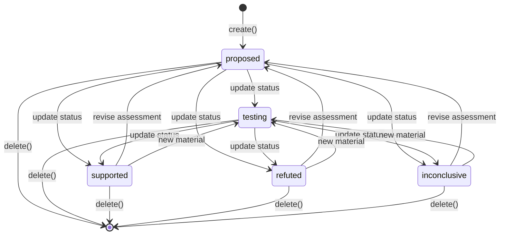

# Hypotheses Capability — Design

## Summary

Hypotheses is a small regular capability that owns explicit, testable proposed
explanations. A Hypothesis belongs to exactly one Question and records the
current state of that proposition. It does not collect evidence, run tests, or
derive support automatically; Findings remains the source-grounded claim
capability and Research remains the investigation capability.

This is intentionally a separate, flat resource rather than a nested
Question-history aggregate. It has one job: manage a statement that can be
tested against a specific Question.

## What it owns

- A stable identity and one required parent `questionId`.
- A concise testable statement and optional rationale.
- A current assessment status and optional bounded confidence.
- Creation/update attribution, timestamps, and soft deletion.

It does not own Findings, Evidence, Assumptions, Research runs, Answer
revisions, or a reverse list of related Finding IDs. Those would either
duplicate another capability’s authority or introduce a larger workflow.

## Core types

```ts
type IsoTimestamp = string;
type ActorId = string;

type HypothesisStatus =
  | "proposed"
  | "testing"
  | "supported"
  | "refuted"
  | "inconclusive";

interface Hypothesis {
  /** Stable random identity. */
  readonly id: string;

  /** The one Question this proposition is intended to answer. */
  readonly questionId: string;

  /** A specific proposition that could be supported, refuted, or qualified. */
  readonly statement: string;

  /** Optional explanation of why the proposition is plausible or useful. */
  readonly rationale?: string;

  readonly status: HypothesisStatus;

  /** Current assessment on a 0..1 scale; absent when not estimated. */
  readonly confidence?: number;

  readonly createdBy: ActorId;
  readonly updatedBy: ActorId;
  readonly createdAt: IsoTimestamp;
  readonly updatedAt: IsoTimestamp;
  readonly deletedAt?: IsoTimestamp;
}
```

`confidence` is a current assessment, not a probability calculation, evidence
weight, or prediction-market value. It is optional so callers do not invent a
number when the available material does not justify one.

Findings carries `hypothesisIds` for all claims that bear on a Hypothesis. The
Hypothesis record does not store `findingIds`; a reader asks Findings for those
links when it needs a detail projection. The initial relationship is neutral:
it says a Finding bears on the Hypothesis but does not assert support or
refutation semantics.

## Dependencies

```ts
interface QuestionReader {
  get(id: string): Promise<{ id: string; status: string } | null>;
}
```

Hypotheses uses this narrow reader only when creating a Hypothesis to confirm
that its Question exists and is not deleted. It does not mutate
Questions. No direct Knowledge dependency is needed: a Hypothesis is a proposed
explanation, not a source-grounded statement admitted to retrieval.

## Store interface

```ts
interface HypothesisStore {
  get(id: string): Hypothesis | undefined;
  list(filter?: {
    questionId?: string;
    status?: HypothesisStatus;
  }): Hypothesis[];
  insert(hypothesis: Hypothesis): void;
  update(hypothesis: Hypothesis): void;
  softDelete(id: string, deletedAt: IsoTimestamp): void;
}
```

The store is project-bound and returns non-deleted rows ordered by `updatedAt`
descending. It has no database foreign key to Questions: the read-port check
preserves capability construction and migration independence.

## Service layer

```ts
interface HypothesisService {
  create(request: CreateHypothesisRequest): Promise<Hypothesis>;
  update(id: string, request: UpdateHypothesisRequest): Promise<Hypothesis>;
  get(id: string): Promise<Hypothesis | null>;
  list(filter?: {
    questionId?: string;
    status?: HypothesisStatus;
  }): Promise<Hypothesis[]>;
  delete(id: string): Promise<void>;
}

interface CreateHypothesisRequest {
  readonly questionId: string;
  readonly statement: string;
  readonly rationale?: string;
  readonly confidence?: number;
}

interface UpdateHypothesisRequest {
  readonly statement?: string;
  readonly rationale?: string | null;
  readonly status?: HypothesisStatus;
  readonly confidence?: number | null;
}
```

Creation starts in `proposed`. `update` is intentionally last-write-wins and
can change the current assessment directly. The service does not calculate a
status or confidence from linked Findings; that judgment belongs to the user
or to an explicit Research/Analysis result that proposes an update.

## Endpoints

| Method | Path | Queue | Purpose |
|---|---|---|---|
| `POST` | `/hypotheses/create` | concurrent | Create a proposed Hypothesis for one Question. |
| `POST` | `/hypotheses/update` | concurrent | Patch its statement, rationale, assessment, or confidence. |
| `GET` | `/hypotheses/get?id=...` | concurrent | Read one Hypothesis. |
| `GET` | `/hypotheses/list?questionId=...&status=...` | concurrent | List Hypotheses. |
| `DELETE` | `/hypotheses/delete?id=...` | concurrent | Soft-delete a Hypothesis. |

Mutations log IDs, operation names, status transitions, whether confidence is
present, actor IDs, and duration. They do not log the statement or rationale.

## Persistence

```sql
CREATE TABLE IF NOT EXISTS hyp_${prefix}_hypotheses (
  id           TEXT PRIMARY KEY,
  question_id  TEXT NOT NULL,
  statement    TEXT NOT NULL,
  rationale    TEXT,
  status       TEXT NOT NULL CHECK (
    status IN ('proposed', 'testing', 'supported', 'refuted', 'inconclusive')
  ),
  confidence   REAL CHECK (confidence IS NULL OR (confidence >= 0 AND confidence <= 1)),
  created_by   TEXT NOT NULL,
  updated_by   TEXT NOT NULL,
  created_at   TEXT NOT NULL,
  updated_at   TEXT NOT NULL,
  deleted_at   TEXT
);

CREATE INDEX IF NOT EXISTS hyp_${prefix}_hypotheses_by_question
  ON hyp_${prefix}_hypotheses(question_id, status, updated_at DESC)
  WHERE deleted_at IS NULL;
```

## Lifecycle and invariants



1. `questionId` identifies one live, project-local Question when created.
2. `statement` is trimmed and non-empty.
3. `confidence`, when present, is finite and in the inclusive range `0..1`.
4. Status is an assessment label, not an automatically inferred result.
5. Soft deletion never deletes the parent Question or related Findings.
6. The capability never adds a Hypothesis to Knowledge; only accepted,
   source-grounded Findings are Knowledge-admissible in this design.

## Integration boundaries

Research may start from a Hypothesis ID by reading its Question and statement
snapshot. A Research completion can propose an explicit Hypothesis update, but
does not silently mutate the record. Findings links its claims to the relevant
Hypothesis and Questions through their IDs. A future detail projection may join
these read-only views without creating a new owner for the relationship.

## Open questions

1. Should a Hypothesis retain an optional ordered list of plain-text
   assumptions? Keep it out initially. If assumptions require their own status,
   evidence links, or lifecycle, they deserve a separate small capability
   rather than a nested collection here.
2. Should the Finding-to-Hypothesis relationship have explicit polarity
   (`supports`, `refutes`, `qualifies`, `context`)? The Findings document keeps
   a neutral link for now and records this as a shared open question.
3. Should a supported/refuted Hypothesis require at least one related accepted
   Finding? That rule would improve discipline but introduces a Findings read
   dependency on every status change; defer it until the review workflow needs
   enforcement.
