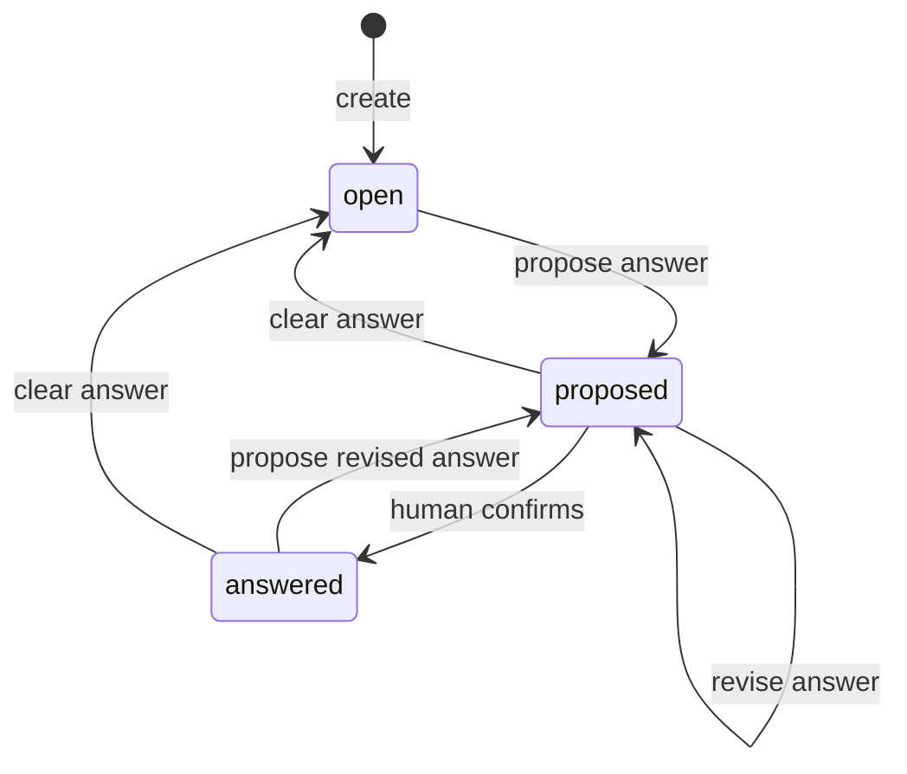

# Questions Capability — Design

## Summary

Questions is a small, project-scoped capability for recording what the project
is trying to learn, decide, or verify. A persisted Question holds the wording,
the context needed to understand it, optional assumptions, and one current
answer. A separate runtime projection assembles that record with the Findings
and Hypotheses relevant to research.

The capability deliberately does not own research runs, evidence, answer
history, or either side of a duplicated relationship graph.

## Outcomes

Given valid project and actor context, Questions can:

- create and edit a durable Question;
- distinguish unanswered work, a proposed answer, and a human-confirmed answer;
- expose the current answer without creating an answer-revision model;
- assemble a research-ready runtime Question with related Findings and
  Hypotheses; and
- soft-delete a Question so it is absent from ordinary reads.

It does not guarantee that an answer is factually correct. `answered` means
that a human confirmed the current answer, not that the system proved it.

## Persisted model

```ts
type IsoTimestamp = string;
type ActorId = string;

type QuestionStatus = "open" | "proposed" | "answered";

interface Question {
  /** Stable project-local identity. */
  readonly id: string;

  /** The question being asked. */
  readonly text: string;

  /** Optional framing, constraints, background, and research details. */
  readonly context?: string;

  /** The presently proposed or accepted answer. */
  readonly currentAnswer?: string;

  /** Plain-text assumptions. An empty list means none were recorded. */
  readonly assumptions: readonly string[];

  readonly status: QuestionStatus;
  readonly tags: readonly string[];

  readonly createdBy: ActorId;
  readonly updatedBy: ActorId;
  readonly createdAt: IsoTimestamp;
  readonly updatedAt: IsoTimestamp;
  readonly deletedAt?: IsoTimestamp;
}
```

`context` replaces the earlier `description` field. It intentionally combines
framing, constraints, background, and any other detail needed to understand or
research the Question. Those concepts are not separate domain fields.

`currentAnswer` replaces `answer`. It is mutable and may change as research
progresses. Questions does not add immutable answer revisions, an Answer
entity, `answeredAt`, `answeredBy`, or a separate approval flag. General
change-history infrastructure can provide audit history if that becomes a
platform requirement.

Assumptions are plain strings. They have no IDs, statuses, confidence values,
approval workflow, or independent lifecycle.

## Status semantics

| Status | Meaning |
|---|---|
| `open` | No candidate conclusion is ready for approval. `currentAnswer` is absent. |
| `proposed` | `currentAnswer` contains a candidate answer that a human has not confirmed. |
| `answered` | `currentAnswer` is the conclusion currently confirmed by a human. |

The status is the approval signal; there is no parallel approval field.
Changing an answer through `proposeAnswer` moves the Question to `proposed`.
Confirming it moves the Question to `answered`. Clearing it moves the Question
to `open`.



Deletion is not part of this lifecycle. It sets `deletedAt`; deleted Questions
are treated as absent by ordinary getters, lists, and runtime assemblers.

## Relationship ownership

Questions persists no Finding IDs and no Hypothesis IDs.

- Findings owns `FindingQuestionLink[]`, including the optional relationship
  meaning.
- Hypotheses owns `questionIds[]`.
- A Question's reverse Finding and Hypothesis lists are queried from those
  owners and assembled at runtime.

This avoids two independently mutable copies of the same relationship. A
reverse Finding reference uses the same optional vocabulary exported by
Findings:

```ts
type FindingRelationship =
  | "supports"
  | "refutes"
  | "qualifies"
  | "contextualizes";

interface RelatedFindingRef {
  readonly findingId: string;
  readonly relationship?: FindingRelationship;
}
```

The value always reads from the Finding toward the Question. For example,
`supports` means “the Finding supports the Question”; the meaning is not
inverted when exposed from the Question side. An omitted value means the
Finding is relevant but unclassified.

## Runtime representation

The persisted `Question` is the editable source of truth. Research receives a
non-persisted `RuntimeQuestion` assembled from current, non-deleted records:

```ts
interface RuntimeQuestion {
  /** Includes text, context, currentAnswer, assumptions, and status. */
  readonly question: Question;

  /** Findings queried by FindingQuestionLink.questionId. */
  readonly findings: readonly {
    readonly finding: Finding;
    readonly relationship?: FindingRelationship;
  }[];

  /** Hypotheses queried by Hypothesis.questionIds. */
  readonly hypotheses: readonly Hypothesis[];
}
```

The projection is assembled on demand and is never persisted back into the
Question row. A Research run may freeze the projection or its canonical digest
at run start, but that snapshot belongs to Research, not Questions.

The assembler depends only on narrow readers:

```ts
interface QuestionFindingReader {
  listForQuestion(questionId: string): Promise<readonly {
    finding: Finding;
    relationship?: FindingRelationship;
  }[]>;
}

interface QuestionHypothesisReader {
  listForQuestion(questionId: string): Promise<readonly Hypothesis[]>;
}
```

Links to deleted or unavailable records remain in their owning records but are
omitted from ordinary runtime projections. Questions does not cascade deletion
into Findings or Hypotheses.

## Store interface

```ts
interface QuestionStore {
  get(id: string): Question | undefined;
  list(filter?: { status?: QuestionStatus; tag?: string }): Question[];
  insert(question: Question): void;
  update(question: Question): void;
  softDelete(id: string, deletedAt: IsoTimestamp): void;
}
```

The SQLite store is project-bound and synchronous. `get` and `list` return only
non-deleted rows, ordered by `updatedAt` descending. No Question table or JSON
column stores Finding or Hypothesis IDs.

## Service layer

```ts
interface QuestionService {
  create(request: CreateQuestionRequest): Promise<Question>;
  update(id: string, request: UpdateQuestionRequest): Promise<Question>;
  proposeAnswer(id: string, currentAnswer: string): Promise<Question>;
  confirmAnswer(id: string): Promise<Question>;
  clearAnswer(id: string): Promise<Question>;
  get(id: string): Promise<Question | null>;
  list(filter?: { status?: QuestionStatus; tag?: string }): Promise<Question[]>;
  delete(id: string): Promise<void>;
}

interface QuestionRuntimeAssembler {
  get(id: string): Promise<RuntimeQuestion>;
}

interface CreateQuestionRequest {
  readonly text: string;
  readonly context?: string;
  readonly assumptions?: readonly string[];
  readonly tags?: readonly string[];
}

interface UpdateQuestionRequest {
  readonly text?: string;
  readonly context?: string | null;
  readonly assumptions?: readonly string[];
  readonly tags?: readonly string[];
}
```

Creation always starts in `open`. `proposeAnswer` sets or replaces
`currentAnswer` and sets `proposed`. `confirmAnswer` represents the explicit
human confirmation step and requires a current answer. Repeating confirmation
of the same answer simply leaves the Question `answered`. `clearAnswer` removes
the value and sets `open`.

Authored mutations use the project's serial queue and deterministic
last-write-wins order. Reads and runtime assembly are concurrent. No
Question-specific optimistic concurrency or conflict model is introduced.

The core service is constructed first. After Questions, Hypotheses, and
Findings exist, composition creates `QuestionRuntimeAssembler` with their
narrow readers. Keeping assembly outside the core service avoids cyclic
service construction without adding persisted state.

## Endpoints

| Method | Path | Queue | Purpose |
|---|---|---|---|
| `POST` | `/questions/create` | serial | Create an open Question. |
| `POST` | `/questions/update` | serial | Edit text, context, assumptions, or tags. |
| `POST` | `/questions/propose-answer` | serial | Set a candidate current answer. |
| `POST` | `/questions/confirm-answer` | serial | Record human confirmation of the current answer. |
| `POST` | `/questions/clear-answer` | serial | Remove the current answer and return to open. |
| `GET` | `/questions/get?id=...` | concurrent | Read one persisted Question. |
| `GET` | `/questions/list?status=...&tag=...` | concurrent | List persisted Questions. |
| `GET` | `/questions/runtime?id=...` | concurrent | Assemble the research runtime projection. |
| `DELETE` | `/questions/delete?id=...` | serial | Soft-delete a Question. |

The exact paths follow the backend's static endpoint registry; IDs remain in
request bodies or query strings rather than path parameters.

## Persistence

```sql
CREATE TABLE IF NOT EXISTS qst_${prefix}_questions (
  id                   TEXT PRIMARY KEY,
  text                 TEXT NOT NULL,
  context              TEXT,
  current_answer       TEXT,
  assumptions_json     TEXT NOT NULL DEFAULT '[]',
  status               TEXT NOT NULL
                         CHECK (status IN ('open', 'proposed', 'answered')),
  tags_json            TEXT NOT NULL DEFAULT '[]',
  created_by           TEXT NOT NULL,
  updated_by           TEXT NOT NULL,
  created_at           TEXT NOT NULL,
  updated_at           TEXT NOT NULL,
  deleted_at           TEXT
);

CREATE INDEX IF NOT EXISTS qst_${prefix}_questions_recent
  ON qst_${prefix}_questions(status, updated_at DESC)
  WHERE deleted_at IS NULL;
```

## Logging

Every operation uses the injected Logger. Mutation logs include operation,
Question ID, actor ID, prior and next status, assumption/tag counts, outcome,
and duration. Runtime logs include related Finding/Hypothesis counts. Logs do
not include question text, context, assumptions, or answer content, and the
capability never calls `console`.

## Invariants

1. `text` is non-empty.
2. `open` has no `currentAnswer`.
3. `proposed` and `answered` have a non-empty `currentAnswer`.
4. `answered` means the current answer was explicitly confirmed by a human;
   there is no separate approval field.
5. Assumptions are plain text and have no nested lifecycle.
6. Finding and Hypothesis reverse lists are derived, not persisted by
   Questions.
7. Soft-deleted Questions are absent from normal reads and runtime assembly.
8. The runtime projection is assembled, not persisted.
