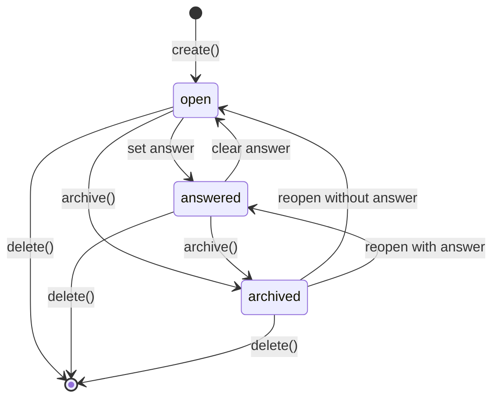

# Questions Capability — Design

## Summary

Questions is a small regular capability that owns the project’s explicit
questions: what the project is trying to learn, decide, or verify. A Question
is not a Research run, a Finding, or an Answer history. It is one durable
framing record with an optional current answer.

This document intentionally keeps the capability narrow:

- Questions owns question wording, optional framing, status, tags, and one
  current answer.
- Findings owns grounded claims and links itself to the Questions it bears on.
- Hypotheses owns a proposed explanation and its required `questionId`.
- Research, Evidence, Analysis, and Derived Outputs may consume a Question but
  do not mutate it implicitly.

Questions is project-scoped. The constructed runtime supplies the project
boundary; project or user identity is not repeated in every request.

## What it is not

- Not a nested aggregate for Hypotheses, Assumptions, Research runs, or Answer
  revisions.
- Not an evidence store or a Knowledge source. A Question asks for knowledge;
  it is not itself a grounded claim to retrieve.
- Not a task-management system. Priority, scheduling, reminders, and ownership
  queues belong elsewhere if they become necessary.

## Core types

```ts
type IsoTimestamp = string;
type ActorId = string;

type QuestionStatus = "open" | "answered" | "archived";

interface Question {
  /** Stable random identity. */
  readonly id: string;

  /** The exact question being asked. */
  readonly text: string;

  /** Optional framing, constraints, or decision context. */
  readonly description?: string;

  /** One current concise answer, if the question has been answered. */
  readonly answer?: string;

  readonly status: QuestionStatus;
  readonly tags: readonly string[];

  readonly createdBy: ActorId;
  readonly updatedBy: ActorId;
  readonly createdAt: IsoTimestamp;
  readonly updatedAt: IsoTimestamp;
  readonly answeredAt?: IsoTimestamp;
  readonly answeredBy?: ActorId;
  readonly deletedAt?: IsoTimestamp;
}
```

`answer` is one current piece of text, not an immutable answer-revision
history. Setting an answer moves the Question to `answered`; clearing it moves
the Question to `open`. Archiving preserves every field and simply removes the
Question from the default active list.

Questions deliberately stores no `findingIds` or `hypothesisIds`. Those are
reverse links that would duplicate authority:

- Findings stores `questionIds` when a claim bears on a Question.
- Hypotheses stores its one required `questionId`.

Readers obtain those related objects through their owning capability’s query,
not by maintaining a second mutable array in Questions.

## Store interface

```ts
interface QuestionStore {
  get(id: string): Question | undefined;
  list(filter?: { status?: QuestionStatus; tag?: string }): Question[];
  insert(question: Question): void;
  update(question: Question): void;
  softDelete(id: string, deletedAt: IsoTimestamp): void;
}
```

The SQLite adapter is project-bound and synchronous, following the simple
capability pattern. `list` returns non-deleted records ordered by `updatedAt`
descending. Tag filtering may initially be performed after reading the modest
project result set; an index is only needed once that stops being adequate.

## Service layer

```ts
interface QuestionService {
  create(request: CreateQuestionRequest): Promise<Question>;
  update(id: string, request: UpdateQuestionRequest): Promise<Question>;
  get(id: string): Promise<Question | null>;
  list(filter?: { status?: QuestionStatus; tag?: string }): Promise<Question[]>;
  archive(id: string): Promise<Question>;
  reopen(id: string): Promise<Question>;
  delete(id: string): Promise<void>;
}

interface CreateQuestionRequest {
  readonly text: string;
  readonly description?: string;
  readonly tags?: readonly string[];
}

interface UpdateQuestionRequest {
  readonly text?: string;
  readonly description?: string | null;
  readonly answer?: string | null;
  readonly tags?: readonly string[];
}
```

`update` is last-write-wins. It applies supplied fields only. When `answer` is
set to a non-empty string, the service records `answeredAt` and `answeredBy`.
When `answer: null` is supplied, it clears answer fields and returns the
Question to `open`. `archive` and `reopen` are explicit status helpers so the
common lifecycle is visible in the API without a generic arbitrary-status
endpoint. Archiving preserves the current answer; reopening returns a Question
with an answer to `answered` and one without an answer to `open`.

## Endpoints

| Method | Path | Queue | Purpose |
|---|---|---|---|
| `POST` | `/questions/create` | concurrent | Create an open Question. |
| `POST` | `/questions/update` | concurrent | Patch text, framing, answer, or tags. |
| `GET` | `/questions/get?id=...` | concurrent | Read one Question. |
| `GET` | `/questions/list?status=...&tag=...` | concurrent | List active or filtered Questions. |
| `POST` | `/questions/archive` | concurrent | Archive a Question. |
| `POST` | `/questions/reopen` | concurrent | Restore an archived Question to its active status. |
| `DELETE` | `/questions/delete?id=...` | concurrent | Soft-delete a Question. |

All mutations log the Question ID, operation, actor ID, prior and next status,
tag count, and duration. They do not log question text or answer text.

## Persistence

```sql
CREATE TABLE IF NOT EXISTS qst_${prefix}_questions (
  id           TEXT PRIMARY KEY,
  text         TEXT NOT NULL,
  description  TEXT,
  answer       TEXT,
  status       TEXT NOT NULL CHECK (status IN ('open', 'answered', 'archived')),
  tags_json    TEXT NOT NULL DEFAULT '[]',
  created_by   TEXT NOT NULL,
  updated_by   TEXT NOT NULL,
  created_at   TEXT NOT NULL,
  updated_at   TEXT NOT NULL,
  answered_at  TEXT,
  answered_by  TEXT,
  deleted_at   TEXT
);

CREATE INDEX IF NOT EXISTS qst_${prefix}_questions_recent
  ON qst_${prefix}_questions(status, updated_at DESC)
  WHERE deleted_at IS NULL;
```

## Lifecycle and invariants



1. `text` is trimmed and non-empty.
2. Tags are trimmed, non-empty, de-duplicated strings.
3. `answered` requires a non-empty `answer`, `answeredAt`, and `answeredBy`.
4. `open` has no answer fields; `archived` may preserve either active state’s
   answer fields.
5. Soft-deleted Questions are absent from ordinary reads and lists.
6. A Question never owns or deletes its Hypotheses or Findings; their links
   remain intact for audit and may simply resolve to a deleted Question.

## Integration boundaries

Research can receive a Question ID and snapshot its current text/description
at run start. It writes an answer candidate back only through an explicit
Questions update approved by a user or an owning workflow. Findings links to a
Question by ID; Questions does not need a Findings dependency to be useful.

Hypotheses validates its `questionId` through a narrow `QuestionReader`. That
is its only direct dependency on this capability.

## Open questions

1. Should an answer later become immutable revisions? Start with one current
   answer. Add history only if users need to compare or restore prior answers.
2. Should `answered` mean a human-approved conclusion rather than merely an
   answer field? If so, add a separate approval field rather than another
   workflow state machine.
3. Should archived Questions remain eligible for new Hypotheses? The simple
   default is no for new creation, while existing references remain readable.
