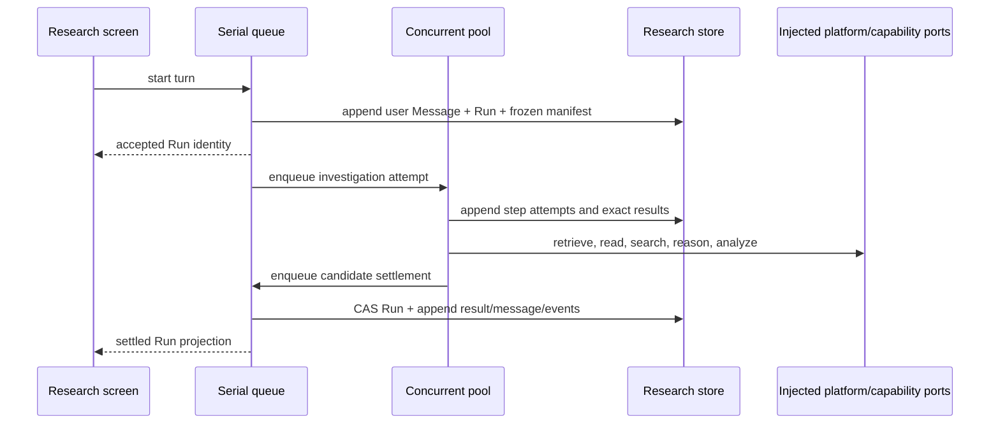

# Research Capability — Modes and Workflows

## Purpose

This document defines how one Research Run turns a user message into a grounded,
mode-specific result. It covers the adaptive investigation loop, channel use,
structured Intelligence contracts, mode behavior, grounding validation, and
Finding proposal boundary.

The canonical Run, Thread, Message, persistence, and endpoint types live in the
other documents in this packet. Types shown here are workflow contracts. The
canonical model should preserve their semantics even if implementation names
are refined.

Research is not a single synthesis prompt wrapped around a search result. It is
a bounded, inspectable loop:

```text
freeze inputs
  → frame the actual inquiry
  → plan distinct information needs and challenges
  → retrieve/read/compute in rounds
  → inspect conflicts and gaps
  → synthesize a typed candidate
  → validate every grounding reference
  → record reviewable Finding candidates
  → settle the result and assistant message
```

Discovery, Question, and Hypothesis share this runtime but use different
framing rules, completion criteria, challenge policies, and result schemas.

## Run inputs

A normal user turn appends one Message and starts one Run; an explicit retry
creates a new Run that reuses the prior initiating Message. The freeze stage
constructs the canonical
`ResearchRunInput` and `FrozenResearchScope` defined in
[Canonical model](canonical-model.md). The input contains one `ResearchSubject`,
one `ResearchScopePolicy`, the project-frame snapshot, and the initiating
Message identity/text.

`scopePolicy.knowledge.contextEntries` governs Knowledge and exact resource
reads. It does not create a second Structured Data scope. Structured Data is
available project-wide when enabled, although only returned entries and values
are pinned as used Run inputs. Existing Analytic Output materializations are
explicit derived inputs under `scopePolicy.analyticOutputs`; they are not a
fourth discovery channel.

The project frame is context for relevance, not evidentiary material. It may
contain the configured project summary and bounded lists or snapshots of the
project's Questions and Hypotheses. A statement appearing only in the project
frame cannot ground an answer or Finding unless it is also supported through a
research channel.

When a canonical Question or Hypothesis ID is supplied, its exact snapshot is
frozen separately as the Run subject. The project frame never substitutes for
a missing requested object.

## Queue and durability shape

The logical Run is staged across the existing dual queues:



The serial queue protects small canonical transitions; it is never occupied by
web fetches, embedding, model inference, resource reads, Formula evaluation,
Computation Sandbox work, or Analytic Output reads. The concurrent pool bounds
those operations, and overflow waits in the concurrent FIFO queue.

Every external call receives the Run cancellation signal and configured
deadline. Cancellation is checked between tool rounds and before settlement.
An operation that cannot be interrupted may finish, but its result is retained
as an attempt record and is not published as the assistant answer after the Run
has reached a terminal cancellation state.

## Stage 1 — freeze

Freeze is deterministic application work. It performs no model or web call.

1. Validate the Thread, user Message, selected mode, channel configuration, and
   submission identity.
2. Resolve a supplied `questionId` or `hypothesisId` through the owning
   capability. A Hypothesis snapshot includes its owning Question.
3. Snapshot the bounded conversation window and project frame.
4. Resolve the selected Context entries once into the exact Knowledge/resource
   scope manifest.
5. Record the Structured Data catalog/view revision available at start without
   reading every value.
6. Record channel availability. An enabled but unconfigured Web channel is a
   validation error, not an empty result.
7. Resolve and freeze the Intelligence purpose routes used by framing,
   planning, and synthesis.
8. Persist the Run, initial event, and first attempt in one transaction.
9. Enqueue the investigation attempt on the concurrent queue.

The canonical `FrozenResearchScope` contains identities and digests, not copied
capability aggregates. It pins Thread history, subject, Knowledge manifest and
generation, Structured Data resolver identity and contributing revisions,
explicit Analytic Output materializations, project frame, Intelligence routes,
and policy version. No later tool call may replace it or quietly enable a
channel that was disabled at freeze.

## Stage 2 — frame the inquiry

Users commonly mix instructions, background, desired output, and the inquiry
itself in one message. Framing separates those components without discarding
the original Message.

```ts
interface FramedResearchIntent {
  readonly objective: string;
  readonly subject: FramedResearchSubject;
  readonly suppliedContext: readonly string[];
  readonly outputPreferences: readonly string[];
  readonly constraints: readonly string[];
  readonly ambiguities: readonly ResearchAmbiguity[];
}

type FramedResearchSubject =
  | {
      readonly mode: "discovery";
      readonly topic: string;
      readonly desiredDepth: "overview" | "focused" | "deep";
    }
  | {
      readonly mode: "question";
      readonly question: string;
    }
  | {
      readonly mode: "hypothesis";
      readonly statement: string;
      readonly owningQuestion?: string;
    };
```

The framer may normalize whitespace and resolve pronouns from frozen Thread
context. It does not silently add restrictions, rewrite a Hypothesis into a
different proposition, or treat an output-format instruction as evidence.

Discovery and Question normally proceed despite minor ambiguity and record the
assumption made. A materially ambiguous request settles the Run in
`awaiting_input` with an `AwaitingInputResearchResult` containing concise
alternatives. Hypothesis
mode has the stronger testability gate described below.

The service validates the framed result against the selected mode and original
subject. Model output cannot change the Run mode or canonical Question/
Hypothesis identity.

## Stage 3 — build the investigation plan

The planner converts the framed intent into distinct information needs rather
than near-duplicate search strings.

```ts
interface ResearchInvestigationPlan {
  readonly objective: string;
  readonly needs: readonly ResearchNeed[];
  readonly challenges: readonly ResearchChallenge[];
  readonly completionCriteria: readonly string[];
}

interface ResearchNeed {
  readonly needId: string;
  readonly statement: string;
  readonly preferredChannels: readonly ResearchChannel[];
  readonly required: boolean;
}

type ResearchChannel = "knowledge" | "structured_data" | "web";

interface ResearchChallenge {
  readonly challengeId: string;
  readonly kind:
    | "contradiction"
    | "alternative-explanation"
    | "missing-definition"
    | "recency"
    | "selection-bias"
    | "measurement"
    | "disconfirmation";
  readonly statement: string;
  readonly appliesToNeedIds: readonly string[];
}
```

The application compiles this adaptive planning output into the canonical
`ResearchPlan` and stable `ResearchPlanStep[]`. That plan is immutable for the
Run and is reused after interrupted compute recovery.

Every planned action must serve a `needId` or `challengeId`. This makes the
method trace useful and prevents unconstrained tool use.

Adaptive choices discovered during inspection are persisted as step attempts,
queries, exact-use records, and method-trace entries under the existing plan;
they do not rewrite it. Conflicting dates, undefined terms, missing
denominators, incomplete data, or alternative explanations can therefore steer
the bounded loop while recovery retains one plan authority. A fundamentally
different objective requires a new user turn or explicit retry Run.

## Stage 4 — retrieve, read, and compute

### Knowledge channel

Knowledge retrieval begins with several concise queries that cover different
needs. Queries are embedded in a batch when possible. Every query receives the
same frozen scope manifest.

```text
planned need
  → one or more distinct retrieval queries
  → scoped Knowledge regions with trusted identities and positions
  → optional bounded exact reads through the resource registry
  → Run material records
```

Follow-up retrieval is allowed when an inspected result creates a named gap.
It uses the same scope manifest. If scoped retrieval produces no matches,
Research reports the scoped absence; it never retries without scope.

Direct reads accept only resource handles emitted by the trusted registry or a
prior retrieval record. The model cannot supply an arbitrary filesystem path,
provider locator, or fabricated resource kind.

### Structured Data channel

Structured Data is an all-project discovery surface for Research. Tools are
separated so the model can inspect metadata before requesting values:

```ts
interface ResearchDataTools {
  list(request: {
    kind?: "variable" | "function" | "table" | "record" | "list";
    text?: string;
    limit: number;
  }): Promise<readonly DataCatalogItem[]>;

  read(request: {
    entryId: string;
    selector?: DataSelector;
    maxCells: number;
  }): Promise<ResearchDataResult>;
}
```

The tool resolves a stable entry ID, not a display name supplied directly to
Formula. A returned result records entry ID, revision, selected fields/rows,
exact wire values, and a digest. Functions may be inspected as catalog entries
but are not themselves grounding values until invoked through a defined Formula
evaluation or bounded computation.

Research does not embed entire large tables in prompts. It requests bounded
selectors, summaries derived by the owning capability, or supplies exact
bounded inputs to the Computation Sandbox.

### Web channel

Web Retrieval exposes bounded provider-neutral operations. The initial Research
tool family is conceptually:

```ts
interface ResearchWebTools {
  search(request: {
    query: string;
    limit: number;
    recency?: { after?: string; before?: string };
  }): Promise<readonly WebSearchResult[]>;

  fetch(request: {
    resultHandle: string;
    maxBytes: number;
  }): Promise<WebFetchResult>;
}
```

`fetch` accepts a handle returned by the same Run's trusted search result or an
explicit user-provided URL admitted during freeze. Search redirects and final
URLs are normalized and recorded. Provider credentials, robots/policy checks,
network safety, response limits, cancellation, and transient cache behavior
remain inside Web Retrieval.

Research stores exact result metadata and the selected content needed by the
Run. It does not automatically upload fetched content or admit it to Knowledge.

### Quantitative computation seam

When bounded Data reads cannot answer a quantitative need, Research executes an
explicit `ResearchComputationSpec`. Formula expressions run through Platform
Formula; statistical, simulation, or specialized work runs through the injected
network-disabled Python sandbox.

```ts
interface ResearchComputationExecutor {
  execute(request: {
    runId: ResearchRunId;
    attemptId: ResearchStepAttemptId;
    specification: ResearchComputationSpec;
    inputs: readonly ResearchComputationInputRef[];
    limits: ResearchComputationLimits;
  }): Promise<ResearchComputationRecord>;
}
```

The referenced types and exact persisted record are defined in
[Canonical model](canonical-model.md). The record retains engine/version,
Formula source or Python code, input-use references, limits, digests, bounded
wire output, diagnostics, and timestamps.

The sandbox receives no credentials, project database connection, resource
reader, or network access. It sees only exact `FormulaWireValue` inputs already
persisted as Structured Data or Analytic Output uses. Standard output is not
treated as the result unless the adapter's exact protocol decodes and validates
it as the bounded wire value.

### Existing Analytic Output reader

Analytic Output is chart/table output definition and materialization for
frontend rendering. It is not the Research computation engine. Research has an
optional read-only port:

```ts
interface ResearchAnalyticOutputReader {
  read(request: {
    analyticOutputId: string;
    materializationId: string;
    materializationDigest: string;
    /** Extra provenance only; never the materialization identity. */
    definitionRevision?: number;
    selector?: StructuredDataSelector;
  }): Promise<AnalyticOutputUse | null>;
}
```

An exact existing materialization may be used only when its
`materializationId` and `materializationDigest` appear in
`FrozenResearchScope.analyticOutputs`. `definitionRevision`, when present, is
extra provenance and never replaces that identity pair. Research records the
resulting `AnalyticOutputUse` and value digest. It cannot create, mutate,
refresh, execute, or render an Analytic Output. If no exact materialization
exists, Research reads the underlying Structured Data or runs its own bounded
computation instead of asking Analytic Output to perform statistics.

## Trusted material and grounding handles

Every result that may support synthesis receives a service-generated opaque
handle. Intelligence selects handles; the service resolves them back to
canonical records.

```ts
type ResearchMaterialRecord =
  | KnowledgeMaterialRecord
  | ResourceReadMaterialRecord
  | StructuredDataMaterialRecord
  | WebMaterialRecord
  | ComputationMaterialRecord
  | AnalyticOutputMaterialRecord;

interface ResearchGroundingSelection {
  readonly materialHandle: string;
  readonly contribution: string;
  readonly usedFor: readonly string[];
}
```

The model cannot establish provenance by returning arbitrary IDs, offsets, URLs,
or excerpts. At validation:

1. every handle must belong to the current Run and completed attempt;
2. the selected span must be contained in the trusted result;
3. the selected content digest must still match the stored material record;
4. the cited channel must have been enabled at freeze; and
5. the contribution must name a result component it actually informed.

Material inspected but not used remains in the method trace and is omitted from
the result's grounding selection. This distinguishes investigation history from
the basis of the conclusion.

Grounding handles also avoid asking models to reproduce fragile offset units.
Knowledge, Findings, and resource readers must still agree on the canonical
coordinate when a handle is converted into a persistent cross-capability
reference.

## Stage 5 — iterative challenge loop

After the first retrieval round, the orchestrator builds a coverage ledger:

```ts
interface ResearchCoverageLedger {
  readonly needs: readonly {
    needId: string;
    state: "unaddressed" | "partial" | "addressed" | "contradicted";
    materialHandles: readonly string[];
    gap?: string;
  }[];
  readonly challenges: readonly {
    challengeId: string;
    state: "untested" | "tested" | "material";
    materialHandles: readonly string[];
    result?: string;
  }[];
}
```

The next round may:

- formulate a narrower retrieval query for an unaddressed need;
- read the surrounding section of a promising resource;
- seek an independent source for corroboration;
- search specifically for conflicting or disconfirming material;
- inspect Structured Data that can confirm or challenge a textual claim;
- execute a bounded computation; or
- stop and state the remaining gap.

The loop is bounded by configured maximums for rounds, queries, fetched pages,
resource bytes, Data cells, sandbox computations, model calls, elapsed time, and
tokens. Limits are stored with the attempt. Reaching a limit yields a normal
bounded result with an explicit limitation unless no useful synthesis is
possible.

The loop stops when:

1. every required need is addressed or explicitly recorded as unresolved;
2. the mode-specific challenge requirement is satisfied;
3. contradictions have been investigated enough to describe, not hidden;
4. an additional action has no named expected contribution; or
5. cancellation, deadline, or budget requires termination.

## Discovery mode

### Purpose

Discovery turns an open topic or objective into a compact, project-relevant
explanation. It is optimized for high information per word rather than for an
exhaustive catalog of everything retrieved.

Discovery is appropriate for prompts such as:

- “Educate me on hospital-at-home reimbursement.”
- “Show me what matters about this company in the context of our project.”
- “Explore the main risks around this market.”

It does not require one answerable interrogative or a falsifiable proposition.

### Workflow

1. **Frame the topic.** Separate the topic, desired depth, project relevance,
   and any excluded areas.
2. **Map the information space.** Identify distinct themes, definitions,
   actors, mechanisms, developments, tensions, and project-specific relevance.
3. **Prioritize.** Rank areas by likely value to the project frame and user
   objective.
4. **Retrieve broadly, then focus.** Use several non-duplicative queries for
   the high-value areas. Inspect only the most informative material deeply.
5. **Challenge obvious narratives.** Look for important disagreement,
   exceptions, or limits that would materially change the explanation.
6. **Synthesize.** Produce a compact overview followed by organized themes.
7. **Extract.** Record reviewable Finding candidates only for claims that can
   stand alone and have exact grounding.
8. **Extend.** Offer a bounded set of useful next areas and candidate Questions.

### Structured result

The settled shape is the canonical `DiscoveryResearchResult` in
[Canonical model](canonical-model.md): a briefing, grounded sections, areas to
explore, and the shared result base containing summary, method, limitations,
Finding-candidate IDs, usage, and digest.

`areasToExplore` is not an unlimited “related topics” list. Each item
states why another Research turn could change or deepen the current picture.
Question suggestions may appear in the briefing or Finding-candidate review
projection but remain Run-local until explicitly created through Questions.

### Completion criteria

Discovery may settle when it provides:

- a coherent overview rather than a list of snippets;
- coverage of the highest-value distinct areas;
- at least one challenge or limitation when the material supports one;
- exact grounding for substantive claims; and
- useful next directions without pretending the topic is exhausted.

## Question mode

### Purpose

Question mode develops the best current answer to an explicit Question. It may
start from free text or a canonical Question snapshot. It treats decomposition,
assumptions, contradictions, and gaps as first-class parts of the answer.

### Decomposition rule

A Question is decomposed only when answering its components materially improves
the final answer. The decomposition must remain traceable to the parent
Question; it cannot drift into an adjacent research agenda.

Typical decomposition axes include:

- definitions or population boundaries;
- time period and geography;
- causal mechanism versus observed correlation;
- baseline, comparison group, and magnitude;
- qualitative and quantitative components; and
- facts required before a recommendation can be justified.

Subquestions are Run-local planning objects, not canonical Questions. The
result may separately suggest that a high-value subquestion be saved.

### Workflow

1. **Frame the Question.** Resolve the exact interrogative, decision context,
   units, time/geography, and output constraints.
2. **Declare assumptions.** Record assumptions required to proceed. Assumptions
   are never smuggled into the answer as facts.
3. **Decompose when useful.** Create the minimum distinct subquestions needed
   for a defensible answer.
4. **Plan queries and Data needs.** Map each subquestion to Knowledge,
   Structured Data, Web, bounded computation, or an exact existing Analytic
   Output read.
5. **Retrieve and inspect.** Gather direct answers and the surrounding material
   needed to interpret them.
6. **Challenge.** Seek conflicting values, alternative explanations, missing
   denominators, recency problems, and evidence that would reverse the answer.
7. **Integrate.** Reconcile subanswers into one concise response. Preserve
   contradictions that cannot be resolved.
8. **Extract candidates.** Record standalone grounded claims worth reviewing.
9. **Suggest Hypotheses.** Offer testable explanations only when they would help
   explain uncertainty or move the inquiry forward.
10. **Settle an answer candidate.** Do not publish it to Questions implicitly.

### Structured result

The settled shape is the canonical `QuestionResearchResult` in
[Canonical model](canonical-model.md): answer, decomposed Questions,
assumptions, proposed Hypotheses, unresolved gaps, exact grounding, and the
shared result base.

The `answer` remains concise even when the method and basis are extensive. The
frontend may reveal decomposition, assumptions, grounding, and method in a
drawer without forcing them into the main prose.

### Candidate publication

For a canonical Question, the Run result may expose an explicit action to set
`Question.answer`. That action reads the current Question again and applies a
Questions update under its own concurrency semantics. A stale or changed
Question is shown for review; Research does not overwrite it from the Run's old
snapshot.

Suggested Hypotheses contain a statement, rationale, and recommended owning
Question. They are not created automatically.

### Completion criteria

Question mode may settle when:

- the direct answer is distinguishable from assumptions and caveats;
- required subquestions are answered or explicitly unresolved;
- material contradictions are exposed;
- substantive claims have trusted grounding; and
- the summary and limitations accurately reflect coverage.

## Hypothesis mode

### Purpose

Hypothesis mode tests a proposition. It is deliberately asymmetric: the plan
must first identify what could falsify or materially qualify the Hypothesis,
then seek that material rather than gathering only supportive examples.

The mode can use textual material, project Data, bounded computation records,
and an existing Analytic Output as optional derived input. It does not claim
statistical certainty merely because a reasoning model found several supporting
passages or because a chart presents a relationship visually.

### Testability gate

Before retrieval, the framer assesses:

- **specificity** — does the statement identify a clear proposition?
- **falsifiability** — could an observable result count against it?
- **operational meaning** — are key terms measurable or inspectable?
- **boundary** — does it state or imply a population, period, and comparison
  where those matter?
- **compound structure** — does it combine propositions that can fail
  independently?

```ts
interface HypothesisTestabilityAssessment {
  readonly state: "testable" | "needs_refinement" | "not_testable";
  readonly reasons: readonly string[];
  readonly observableImplications: readonly string[];
  readonly potentialFalsifiers: readonly string[];
  readonly alternatives: readonly {
    statement: string;
    change: string;
    tradeoff: string;
  }[];
}
```

A `needs_refinement` or `not_testable` result never replaces the user's
statement. If one alternative is an obvious narrowing that preserves meaning,
the Run may present it and await selection. If the user explicitly asks to
continue as written, Research can perform an exploratory challenge but must
retain the testability limitation in the result.

### Assumptions and tests

For a testable Hypothesis, Research identifies assumptions and observable
tests before gathering conclusions:

```ts
interface ResearchHypothesisTest {
  readonly testId: string;
  readonly statement: string;
  readonly kind:
    | "source_check"
    | "independent_corroboration"
    | "counterexample"
    | "comparison"
    | "structured_data"
    | "computation"
    | "analytic_output_input";
  readonly expectedSupport: string;
  readonly expectedFalsifier: string;
  readonly result:
    | "supports"
    | "refutes"
    | "qualifies"
    | "uninformative"
    | "not_run";
  readonly explanation?: string;
  readonly grounding: readonly ResearchGroundingSelection[];
  readonly computationId?: string;
  readonly analyticOutputRef?: {
    analyticOutputId: string;
    materializationId: string;
    materializationDigest: string;
    definitionRevision?: number;
  };
}
```

An assumption is not counted as support merely because it is plausible. The
result distinguishes an assumption that was checked, contradicted, or left
untested.

### Workflow

1. **Freeze the exact proposition and owning Question.**
2. **Apply the testability gate.** Pause for selection when alternatives would
   materially change what is tested.
3. **List assumptions and observable implications.**
4. **Design disconfirming tests first.** State what result would refute or
   qualify the Hypothesis before retrieving it.
5. **Run textual and quantitative tests.** Use Knowledge/Web for claims,
   Structured Data for exact inputs, and the bounded Computation Sandbox for
   calculations. Existing Analytic Outputs may be read as derived inputs only.
6. **Search for counterexamples and alternative explanations.**
7. **Evaluate each test separately.** Do not collapse mixed results too early.
8. **Synthesize the current assessment.** Use `supported`, `refuted`,
   `qualified`, or `inconclusive` as an assessment label, not proof.
9. **Extract candidates.** Record grounded claims from the tests, including
   disconfirming or qualifying claims, for explicit review.
10. **Propose, but do not apply, a Hypothesis update.**

### Structured result

The settled shape is the canonical `HypothesisResearchResult` in
[Canonical model](canonical-model.md): tested statement, assessment,
assumptions, falsification criteria, disconfirming and qualifying material,
unresolved gaps, and the shared result base. A non-testable statement instead
settles as `AwaitingInputResearchResult`.

At least one completed test must be explicitly disconfirming, refuting,
counterexample-seeking, or alternative-explanation-seeking. Merely adding the
word “challenge” to the synthesis prompt does not satisfy the invariant.

### Quantitative discipline

When the Hypothesis is quantitative:

- the test states the dependent and independent values or comparison;
- input Data IDs/revisions and selectors are exact;
- code/specification, transformations, and assumptions are persisted in the
  Research computation record;
- the bounded computation output, not standard output or a rendered chart,
  grounds the assessment;
- an existing Analytic Output may provide derived material only through an
  exact materialization ID and digest;
- missing values, sample limitations, and sensitivity are explicit; and
- a model does not invent a p-value, probability, or confidence interval.

If the necessary Data or sandbox/runtime operation is unavailable, the test remains
`not_run` and becomes a gap rather than being approximated through prose.

### Candidate update

A canonical Hypothesis result may suggest:

```ts
interface HypothesisUpdateSuggestion {
  readonly status?: "testing" | "supported" | "refuted" | "inconclusive";
  readonly rationale?: string;
  readonly confidence?: number;
  readonly basisFindingIds: readonly string[];
}
```

Research normally omits numeric `confidence`. If a value is ever suggested, it
must originate from an explicit quantitative method that defines what the number
means; it cannot be an Intelligence self-rating. Applying the suggestion is a
separate Hypotheses operation after user review.

### Completion criteria

Hypothesis mode may settle when:

- testability is resolved or clearly reported;
- assumptions and potential falsifiers are visible;
- at least one explicit disconfirmation attempt is recorded for a testable
  proposition;
- supporting, refuting, and qualifying results are kept distinct;
- quantitative claims point to exact `ResearchComputationRecord` identities
  where applicable; and
- the assessment strength matches the completed tests and remaining gaps.

## Shared result components

Mode-specific results reuse a small set of structured components:

```ts
interface ResearchAssumption {
  readonly statement: string;
  readonly importance: "material" | "supporting";
  readonly state: "untested" | "supported" | "challenged" | "contradicted";
  readonly grounding: readonly ResearchGroundingSelection[];
}

interface ResearchTension {
  readonly description: string;
  readonly sides: readonly {
    statement: string;
    grounding: readonly ResearchGroundingSelection[];
  }[];
  readonly resolution?: string;
}

interface ResearchGap {
  readonly description: string;
  readonly consequence: string;
  readonly possibleNextAction?: string;
}

interface ResearchReliabilityAssessment {
  readonly coverage: "narrow" | "partial" | "broad";
  readonly directness: "indirect" | "mixed" | "direct";
  readonly agreement: "unknown" | "consistent" | "mixed" | "conflicting";
  readonly recency: "not_applicable" | "unknown" | "current" | "mixed" | "stale";
  readonly limitations: readonly string[];
}

interface ResearchMethodSummary {
  readonly needsInvestigated: number;
  readonly queriesRun: number;
  readonly resourcesRead: number;
  readonly webPagesFetched: number;
  readonly dataEntriesRead: number;
  readonly computationsRun: number;
  readonly analyticOutputsRead: number;
  readonly challengesTested: number;
  readonly boundedBy?: readonly string[];
}
```

Reliability values are derived from inspectable Run records where possible.
They are not a replacement for grounding, and they do not claim calibrated
probability.

## Finding candidate extraction and explicit proposal

Intelligence may suggest claims by selecting trusted material handles. The
application layer resolves those handles and constructs the canonical
`FindingCandidate` defined in [Canonical model](canonical-model.md):

The application constructs the canonical `FindingCandidate` from
[Canonical model](canonical-model.md). Its only review states are
`unreviewed`, `approved_for_proposal`, `rejected`, `deferred`, and
`blocked_grounding`. A canonical Finding created later is represented by a
separate `FindingLink`; it is not another local candidate state.

The settlement service, not the model:

1. resolves every grounding handle;
2. constructs cross-capability source references from trusted identities;
3. verifies the claim is non-empty and the source set is sufficient;
4. de-duplicates materially identical candidates within the Run;
5. stores a Research-owned candidate with `reviewState: "unreviewed"`; and
6. records `reviewState: "blocked_grounding"` with a diagnostic when the
   candidate cannot yet cross the Findings reference contract.

Run settlement never calls `FindingService.propose()`. After the user reviews a
candidate and marks it `approved_for_proposal`, an explicit `finding.propose`
command:

1. durably claims the candidate and proposal submission identity;
2. reloads and revalidates its trusted grounding records;
3. calls the injected Findings proposal port;
4. records the resulting canonical Finding ID in a `FindingLink`; and
5. leaves the local candidate and Run result intact.

The command is idempotent: an exact retry returns the same canonical Finding.
This requires Findings to accept either a caller-supplied stable Finding ID or
an idempotency key; the current Findings design does not yet expose that seam.
Rejecting or deferring a candidate is an explicit local review command and
creates no Finding.

A blocked or failed candidate does not discard an otherwise valid Research
result. It remains reviewable with its diagnostic and can be retried after its
reference or idempotency contract is resolved.

The current Findings design cannot represent a Web result, Structured Data use,
Computation record, or Analytic Output use without first creating a Knowledge
source, and its byte-span contract does not match the current Knowledge
runtime's UTF-16 coordinates. The Research service must not fabricate a
Knowledge ID, relabel an offset, serialize a calculation as prose, or
automatically save a page to bypass that gap.

## Stage 6 — synthesis and validation

Synthesis receives:

- the immutable framed intent and plan;
- the coverage ledger;
- only trusted bounded material records selected for synthesis;
- structured test results;
- prior conversational context from the frozen window; and
- the exact schema for the chosen mode.

The Intelligence call returns a draft. Application validation then enforces:

- exact mode and subject identity;
- allowed enum values and configured collection bounds;
- non-empty narrative when the result claims an answer;
- grounding handles that resolve to the Run;
- no unsupported substantive claim represented as established fact;
- mode-specific completion and challenge requirements;
- no invented canonical Question, Hypothesis, Finding, Data, Computation, or
  Analytic Output identity; and
- no numeric confidence without a defined Computation origin.

Validation failure may invoke one bounded repair call containing only schema
diagnostics and the invalid draft. A second failure marks the attempt failed;
Research does not persist malformed structured output as a successful result.

The assistant Message is rendered deterministically from the validated result
or uses a separately validated `responseText` field. The structured result
remains canonical; presentation changes do not require rewriting the Run's
retrieval history.

## Stage 7 — conditional settlement

Settlement runs on the serial queue and performs one Run-scoped transaction:

1. reload the Run and expected revision;
2. reject settlement if cancellation or another terminal transition won;
3. verify the candidate belongs to the active Run compute attempt;
4. persist the validated mode result;
5. store reviewable or blocked Finding candidates;
6. append the assistant Message;
7. append the settlement event and update the Run status/revision; and
8. complete the settle-stage receipt and Run compute attempt.

Because Run settlement performs no cross-capability Finding mutation, the Run
result, candidate records, assistant Message, event, and receipt commit in one
Research-store transaction. The later explicit proposal command uses its own
durable receipt and the keyed Findings contract described above.

The Knowledge generation may have advanced since freeze. That does not make
the historical material false or rewrite the Run. The frozen generation stays
on `FrozenResearchScope`; a read projection may compare it with the current
generation and offer a retry against newer material.

## Follow-up turns and mode changes

Every follow-up appends a new user Message and creates a new Run linked to the
immediately preceding Run through `continuationOfRunId`. The Run may:

- continue the same mode and narrow a prior result;
- switch modes while retaining Thread context;
- reference a prior Run, Finding, Question, Hypothesis, Computation record, or
  exact Analytic Output materialization identity;
- add/remove Context entries or change channel availability; or
- ask for clarification without external retrieval.

Earlier Runs remain immutable. A follow-up such as “test the second hypothesis”
resolves the referenced suggestion from the frozen Thread projection, then
creates a Hypothesis-mode subject. It does not mutate the prior Question result
or silently create a canonical Hypothesis.

Conversation history is contextual input, not grounding. A claim from an older
assistant Message must be re-grounded through its referenced Run material or
canonical Finding before it supports a new conclusion.

## Clarification, insufficient material, and contradiction

These are normal result conditions:

- `awaiting_input` means the inquiry cannot be framed without a choice that
  would materially change the investigation. The settled result uses
  `AwaitingInputResearchResult` with reason `clarification`,
  `hypothesis_not_testable`, or `missing_required_choice`.
- `insufficient` means the selected channels and bounded work did not provide
  enough grounding.
- `contradictory` means relevant material conflicts on a point central to the
  Question or Discovery explanation.
- `not_testable` means the Hypothesis lacks an observable falsifier or usable
  operational definition as currently written.

The Run preserves what was attempted and the precise gap. It does not fill the
gap with model memory, silently enable Web, expand Context, or turn an
assumption into a fact.

## Failure, interruption, cancellation, and retry

Transport/provider errors, invalid structured output, store failure, and
unexpected tool failure are operational outcomes distinct from insufficient
research material.

- A retryable step may retry within configured per-step limits and records each
  attempt.
- Exhausted step retries fail the Run with a typed diagnostic unless the mode
  can settle a useful partial result.
- Cancellation retains completed results and reaches `cancelled`.
- Process restart marks running attempts `interrupted`; it does not guess
  whether an external request completed.
- Explicit retry creates a new Run whose `retryOfRunId` points to the prior Run.
- The retry freezes current subjects, scopes, Knowledge generation, Data view,
  policies, and Intelligence routes; it does not falsely claim to replay the old
  environment.

## Acceptance scenarios

1. A Discovery Run over project Knowledge returns an organized explanation,
   reviewable Finding candidates, and next areas without creating a canonical
   Question or Finding during settlement.
2. A Question Run with three Context entries uses one resolved manifest for the
   initial retrieval and every follow-up tool call; no out-of-scope material is
   admitted when one entry becomes unavailable.
3. A Web-disabled Run never calls Web Retrieval. A Web-enabled Run with no
   configured adapter fails channel validation rather than returning zero
   results.
4. Structured Data catalog access can discover any project entry, but the Run
   stores only the exact entries/revisions/selectors it reads.
5. Question mode decomposes a compound Question, returns one concise answer,
   keeps assumptions and gaps separate, and leaves `Question.answer` unchanged.
6. Hypothesis mode refuses to silently rewrite a non-testable statement and
   returns explicit alternatives.
7. A testable Hypothesis Run records at least one real disconfirmation or
   counterexample-seeking test before settlement.
8. A quantitative test persists exact Structured Data inputs, code/spec,
   sandbox/runtime identity, output, limits, and digests; it never treats an
   Analytic Output or chart image as the calculation engine or result.
9. A model-returned fabricated resource ID or out-of-range span fails grounding
   validation.
10. Run settlement stores a Knowledge-grounded Finding candidate locally; an
    explicit `finding.propose` command creates one idempotently proposed
    canonical Finding, which remains unaccepted.
11. A Finding candidate grounded only in Web, Structured Data, Computation, or
    Analytic Output remains `blocked_grounding` until Findings can represent the
    exact reference; Research does not manufacture a Knowledge source to admit
    it.
12. Cancelling during web fetch retains prior completed query records but
    publishes no assistant answer after cancellation.
13. Retrying an interrupted Run creates a new Run with new frozen inputs and
    preserves the original timeline.
14. A follow-up can switch from Question to Hypothesis mode in the same Thread
    without changing either Run's mode or result.
