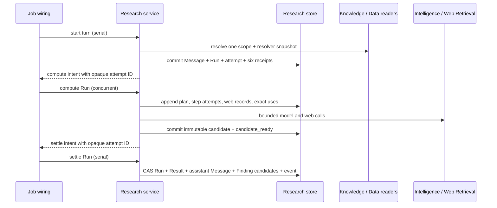

# Research Capability — Store, History, and Settlement

## Persistence model

Research owns one project-bound SQLite store, opened from
`1-init/create/research.ts`. The configured project ID is hashed once into the
table prefix; no endpoint or domain operation accepts a project ID.

```ts
interface ResearchStoreConfig {
  readonly projectId: string;
  readonly dbPath: string; // default ./data/research.db
}
```

Research is a durable process aggregate, not an authored Base-plus-ChangeSet
resource:

- Thread Messages and Run events are append-only.
- Run state uses monotone revision compare-and-swap.
- plans, step attempts, exact retrieval/use records, compute candidates, Results,
  and Finding candidates are immutable after insertion;
- Run compute attempts and per-stage receipts use guarded state transitions and
  are the durable recovery authority for internal Jobs;
- review decisions and canonical Finding links are guarded state transitions;
- retry creates a new Run linked to the prior Run.

## Store port

```ts
interface ThreadPage {
  readonly items: readonly ResearchThread[];
  readonly nextCursor?: string;
}

interface RunPage {
  readonly items: readonly ResearchRun[];
  readonly nextCursor?: string;
}

interface StartRunCommit {
  readonly thread: ResearchThread;
  /** Omitted only by run.retry, which reuses the prior initiating Message. */
  readonly userMessage?: ResearchMessage;
  readonly run: ResearchRun;
  readonly runComputeAttempt: ResearchRunComputeAttempt;
  readonly stageReceipts: ResearchRunStageReceipts;
  readonly initialEvent: ResearchRunEvent;
  readonly receipt: ResearchSubmissionReceipt;
}

interface ResearchRunEvent {
  readonly runId: ResearchRunId;
  readonly revision: number;
  readonly type:
    | "run.started"
    | "run.cancel-requested"
    | "run.cancelled"
    | "run.interrupted"
    | "run.awaiting-input"
    | "run.completed"
    | "run.failed";
  readonly payload?: unknown;
  readonly createdAt: IsoTimestamp;
}

interface RunTransitionCommit {
  readonly run: ResearchRun;
  readonly expectedRevision: number;
  readonly event: ResearchRunEvent;
}

interface ResearchComputeCandidateCommit {
  readonly candidate: ResearchRunComputeCandidate;
  readonly runComputeAttempt: ResearchRunComputeAttempt;
  readonly expectedAttemptState: "running";
  readonly synthesisReceipt: ResearchRunStageReceipt;
  readonly settleReceipt: ResearchRunStageReceipt;
}

interface ResearchComputeTerminationCommit {
  readonly runComputeAttempt: ResearchRunComputeAttempt;
  readonly expectedAttemptState: "queued" | "running";
  /** Non-settle receipts become terminal; settle remains pending. */
  readonly stageReceipts: ResearchRunStageReceipts;
}

interface ResearchSettlementCommit {
  readonly candidateId: ResearchRunComputeCandidateId;
  readonly runComputeAttempt: ResearchRunComputeAttempt;
  readonly expectedAttemptState: "settling";
  readonly settleReceipt: ResearchRunStageReceipt;
  readonly run: ResearchRun;
  readonly expectedRevision: number;
  readonly result: ResearchRunResult;
  readonly assistantMessage: ResearchMessage;
  readonly findingCandidates: readonly FindingCandidate[];
  readonly event: ResearchRunEvent;
}

interface ResearchAttemptTerminalSettlementCommit {
  readonly runComputeAttemptId: ResearchRunComputeAttemptId;
  readonly expectedAttemptState: "failed" | "cancelled";
  readonly settleReceipt: ResearchRunStageReceipt;
  readonly expectedSettleReceiptState: "pending" | "running";
  readonly run: ResearchRun;
  readonly expectedRevision: number;
  readonly event: ResearchRunEvent;
}

interface ResearchSubmissionReceipt {
  readonly scopeKind: "thread" | "run" | "finding-candidate";
  readonly scopeId: string;
  readonly requestId: string;
  readonly requestDigest: Digest;
  readonly result: unknown;
  readonly createdAt: IsoTimestamp;
}

interface ResearchStore {
  getThread(id: ResearchThreadId): Promise<ResearchThread | undefined>;
  listThreads(cursor?: string, limit?: number): Promise<ThreadPage>;
  listMessages(
    threadId: ResearchThreadId,
    afterOrdinal?: number,
    limit?: number,
  ): Promise<readonly ResearchMessage[]>;

  getRun(id: ResearchRunId): Promise<ResearchRun | undefined>;
  listRuns(
    filter?: { threadId?: string; mode?: ResearchMode; state?: ResearchRunState },
    cursor?: string,
    limit?: number,
  ): Promise<RunPage>;
  listRunEvents(runId: ResearchRunId): Promise<readonly ResearchRunEvent[]>;
  getRunComputeAttempt(
    id: ResearchRunComputeAttemptId,
  ): Promise<ResearchRunComputeAttempt | undefined>;
  getRunComputeCandidate(
    runComputeAttemptId: ResearchRunComputeAttemptId,
  ): Promise<ResearchRunComputeCandidate | undefined>;
  getRunStageReceipt(
    runComputeAttemptId: ResearchRunComputeAttemptId,
    stage: ResearchRunStage,
  ): Promise<ResearchRunStageReceipt | undefined>;

  getReceipt(
    scopeKind: ResearchSubmissionReceipt["scopeKind"],
    scopeId: string,
    requestId: string,
  ): Promise<ResearchSubmissionReceipt | undefined>;

  commitStart(commit: StartRunCommit): Promise<void>;
  commitTransition(commit: RunTransitionCommit): Promise<boolean>;

  claimRunComputeAttempt(
    id: ResearchRunComputeAttemptId,
    planReceipt: ResearchRunStageReceipt,
    expectedState: "queued",
  ): Promise<boolean>;
  transitionRunComputeAttempt(
    attempt: ResearchRunComputeAttempt,
    expectedState: ResearchRunComputeAttemptState,
  ): Promise<boolean>;
  transitionRunStageReceipt(
    receipt: ResearchRunStageReceipt,
    expectedState: ResearchRunStageReceiptState,
  ): Promise<boolean>;
  commitComputeCandidate(
    commit: ResearchComputeCandidateCommit,
  ): Promise<boolean>;
  commitComputeTermination(
    commit: ResearchComputeTerminationCommit,
  ): Promise<boolean>;
  claimRunSettlement(
    id: ResearchRunComputeAttemptId,
    settleReceipt: ResearchRunStageReceipt,
    expectedState: "candidate_ready",
  ): Promise<boolean>;

  insertPlan(plan: ResearchPlan): Promise<void>;
  insertStepAttempt(attempt: ResearchStepAttempt): Promise<void>;
  updateStepAttempt(
    attempt: ResearchStepAttempt,
    expectedState: ResearchStepAttemptState,
  ): Promise<boolean>;
  insertWebQuery(query: WebSearchQuery): Promise<void>;
  insertWebResults(
    records: readonly WebResultRecord[],
    text: readonly WebResultText[],
  ): Promise<void>;
  insertKnowledgeUses(uses: readonly KnowledgeUse[]): Promise<void>;
  insertStructuredDataUses(uses: readonly StructuredDataUse[]): Promise<void>;
  insertAnalyticOutputUses(uses: readonly AnalyticOutputUse[]): Promise<void>;
  insertComputations(uses: readonly ResearchComputationRecord[]): Promise<void>;

  commitSettlement(commit: ResearchSettlementCommit): Promise<boolean>;
  commitAttemptTerminalSettlement(
    commit: ResearchAttemptTerminalSettlementCommit,
  ): Promise<boolean>;
  reviewFindingCandidate(
    candidate: FindingCandidate,
    expectedReviewState: FindingCandidate["reviewState"],
    receipt: ResearchSubmissionReceipt,
  ): Promise<boolean>;
  linkFinding(
    link: FindingLink,
    receipt: ResearchSubmissionReceipt,
  ): Promise<void>;

  listRecoverableRunComputeAttempts(): Promise<readonly ResearchRunComputeAttempt[]>;
  replaceInterruptedRunComputeAttempt(
    interruptedId: ResearchRunComputeAttemptId,
    replacement: ResearchRunComputeAttempt,
    stageReceipts: ResearchRunStageReceipts,
  ): Promise<boolean>;
}
```

The store returns `false` for an ordinary compare-and-swap miss. It throws for
schema corruption, identity/digest mismatch, or a violated immutable insert.

## Durable freeze, compute, and settlement



### Freeze

The serial start Job:

1. validates and canonicalizes the request;
2. checks the Thread revision and idempotency receipt;
3. appends the initiating user Message for a normal submission or continuation;
   a retry reuses the prior Run's initiating Message;
4. snapshots a selected Question/Hypothesis by exact fields and digest;
5. resolves the final Knowledge scope once;
6. builds one Structured Data resolver snapshot when enabled;
7. validates explicit Analytic Output materialization references;
8. constructs `FrozenResearchScope` and its digest;
9. atomically commits the Thread head, optional user Message, queued Run,
   queued Run compute attempt, all six stage receipts, first Run event, and
   request receipt; the freeze receipt is `completed` and the other five are
   `pending`;
10. leaves the Thread message count unchanged for a retry;
11. emits a fresh `research.run.compute` intent carrying the opaque Run compute
    attempt ID.

The Run is recoverable before dispatch. If queue admission fails, its durable
queued Run compute attempt remains the dispatch-recovery authority.

### Compute

The concurrent compute Job loads the frozen Run and performs planning,
retrieval, challenge, and synthesis. It may append operational step-attempt,
query/result, and exact-use records. Every Knowledge call receives the same
scope manifest. Every Structured Data value is produced from the frozen
resolver identity and serialized as `FormulaWireValue`.

The compute Job claims the durable Run compute attempt, advances guarded stage
receipts, and appends `ResearchStepAttempt` rows only for steps in the persisted
plan. It never writes `result_digest`, appends an assistant Message, or calls
`finding.propose`. It finishes by atomically inserting one immutable compute
candidate, completing the synthesis receipt, verifying the existing settle
receipt is still `pending`, moving the attempt to `candidate_ready`, and emitting
`research.run.settle` with the same opaque attempt ID.

If compute fails or observes cancellation before producing a candidate,
`commitComputeTermination` atomically moves the attempt to `failed` or
`cancelled`, leaves completed receipts unchanged, terminalizes every remaining
non-settle receipt to the matching state, leaves the settle receipt `pending`,
and emits that same serial settle intent. The concurrent Job never publishes
the Run's terminal state.

### Settlement

The serial settlement transaction succeeds only when:

- the addressed Run compute attempt owns the immutable candidate and is in
  `candidate_ready` or has been idempotently claimed as `settling`;
- the Run still has the expected revision and is not terminal;
- its frozen-scope digest equals the candidate's frozen-scope digest;
- its persisted plan digest equals the candidate plan digest;
- no Result already exists for the Run;
- the assistant Message ordinal is exactly the Thread's next ordinal;
- every referenced web/use record belongs to the same Run;
- every Finding candidate references material owned by that Run.

One transaction inserts the Result and local Finding candidates, appends the
assistant Message, advances Thread and Run heads, completes the settle receipt,
moves the Run compute attempt to `settled`, and appends the terminal Run event.
A CAS loser records no competing terminal state and moves the attempt to
`stale` without deleting its candidate. An exact replay reads the persisted
settlement; a divergent replay is rejected.

For a `failed` or `cancelled` attempt with no candidate,
`commitAttemptTerminalSettlement` instead verifies that all six receipts are
in their expected states, verifies that no candidate exists, completes the
pending or already-claimed settle receipt, and CAS-transitions the owning Run to
`failed` or `cancelled` with its terminal event. It inserts no Result, assistant
Message, or Finding candidate.

## SQLite schema

The examples use `${p}` for `sha256(projectId).slice(0, 16)`. Every connection
enables `PRAGMA foreign_keys = ON` and WAL mode.

```sql
CREATE TABLE rsch_${p}_threads (
  id             TEXT PRIMARY KEY CHECK (length(id) > 0),
  title          TEXT CHECK (title IS NULL OR length(trim(title)) > 0),
  default_mode   TEXT NOT NULL CHECK (default_mode IN ('discovery','question','hypothesis')),
  scope_json     TEXT NOT NULL,
  lifecycle      TEXT NOT NULL CHECK (lifecycle IN ('active', 'archived')),
  revision       INTEGER NOT NULL CHECK (revision >= 1),
  message_count  INTEGER NOT NULL CHECK (message_count >= 0),
  latest_run_id  TEXT,
  created_by     TEXT NOT NULL CHECK (length(created_by) > 0),
  created_at     TEXT NOT NULL,
  updated_at     TEXT NOT NULL,
  FOREIGN KEY (latest_run_id) REFERENCES rsch_${p}_runs(id)
    DEFERRABLE INITIALLY DEFERRED
);

CREATE TABLE rsch_${p}_messages (
  id          TEXT PRIMARY KEY CHECK (length(id) > 0),
  thread_id   TEXT NOT NULL,
  ordinal     INTEGER NOT NULL CHECK (ordinal >= 1),
  role        TEXT NOT NULL CHECK (role IN ('user', 'assistant')),
  text        TEXT NOT NULL CHECK (length(trim(text)) > 0),
  run_id      TEXT,
  created_by  TEXT NOT NULL CHECK (length(created_by) > 0),
  created_at  TEXT NOT NULL,
  UNIQUE (thread_id, ordinal),
  UNIQUE (run_id),
  FOREIGN KEY (thread_id) REFERENCES rsch_${p}_threads(id),
  FOREIGN KEY (run_id) REFERENCES rsch_${p}_runs(id)
    DEFERRABLE INITIALLY DEFERRED,
  CHECK (
    (role = 'user' AND run_id IS NULL) OR
    (role = 'assistant' AND run_id IS NOT NULL)
  )
);

CREATE TABLE rsch_${p}_runs (
  id                       TEXT PRIMARY KEY CHECK (length(id) > 0),
  thread_id                TEXT NOT NULL,
  initiating_message_id    TEXT NOT NULL,
  mode                     TEXT NOT NULL CHECK (mode IN ('discovery', 'question', 'hypothesis')),
  state                    TEXT NOT NULL CHECK (state IN (
    'queued', 'running', 'awaiting_input', 'completed', 'failed',
    'interrupted', 'cancel_requested', 'cancelled'
  )),
  stage                    TEXT NOT NULL CHECK (stage IN (
    'freeze', 'plan', 'gather', 'evaluate', 'synthesize', 'settle'
  )),
  revision                 INTEGER NOT NULL CHECK (revision >= 1),
  input_json               TEXT NOT NULL,
  input_digest             TEXT NOT NULL CHECK (length(input_digest) = 64),
  frozen_scope_json        TEXT NOT NULL,
  frozen_scope_digest      TEXT NOT NULL CHECK (length(frozen_scope_digest) = 64),
  plan_digest              TEXT CHECK (plan_digest IS NULL OR length(plan_digest) = 64),
  result_digest            TEXT CHECK (result_digest IS NULL OR length(result_digest) = 64),
  retry_of_run_id          TEXT,
  continuation_of_run_id   TEXT,
  failure_json             TEXT,
  created_by               TEXT NOT NULL CHECK (length(created_by) > 0),
  created_at               TEXT NOT NULL,
  started_at               TEXT,
  settled_at               TEXT,
  updated_at               TEXT NOT NULL,
  FOREIGN KEY (thread_id) REFERENCES rsch_${p}_threads(id),
  FOREIGN KEY (initiating_message_id) REFERENCES rsch_${p}_messages(id),
  FOREIGN KEY (retry_of_run_id) REFERENCES rsch_${p}_runs(id),
  FOREIGN KEY (continuation_of_run_id) REFERENCES rsch_${p}_runs(id),
  CHECK (retry_of_run_id IS NULL OR continuation_of_run_id IS NULL),
  CHECK (
    (state IN ('completed', 'awaiting_input')
      AND result_digest IS NOT NULL AND settled_at IS NOT NULL) OR
    (state IN ('failed', 'interrupted', 'cancelled') AND settled_at IS NOT NULL) OR
    (state IN ('queued', 'running', 'cancel_requested'))
  )
);

CREATE TABLE rsch_${p}_run_compute_attempts (
  id                    TEXT PRIMARY KEY CHECK (length(id) > 0),
  run_id                TEXT NOT NULL,
  sequence              INTEGER NOT NULL CHECK (sequence >= 1),
  state                 TEXT NOT NULL CHECK (state IN (
    'queued', 'running', 'candidate_ready', 'settling', 'settled',
    'stale', 'failed', 'interrupted', 'cancelled'
  )),
  frozen_run_revision   INTEGER NOT NULL CHECK (frozen_run_revision >= 1),
  frozen_scope_digest   TEXT NOT NULL CHECK (length(frozen_scope_digest) = 64),
  input_digest          TEXT NOT NULL CHECK (length(input_digest) = 64),
  failure_json          TEXT,
  queued_at             TEXT NOT NULL,
  started_at            TEXT,
  compute_finished_at   TEXT,
  settled_at            TEXT,
  updated_at            TEXT NOT NULL,
  UNIQUE (run_id, sequence),
  UNIQUE (run_id, id),
  FOREIGN KEY (run_id) REFERENCES rsch_${p}_runs(id),
  CHECK (
    (state = 'queued'
      AND started_at IS NULL AND compute_finished_at IS NULL AND settled_at IS NULL) OR
    (state = 'running'
      AND started_at IS NOT NULL AND compute_finished_at IS NULL AND settled_at IS NULL) OR
    (state IN ('candidate_ready', 'settling')
      AND started_at IS NOT NULL AND compute_finished_at IS NOT NULL AND settled_at IS NULL) OR
    (state IN ('settled', 'stale')
      AND started_at IS NOT NULL AND compute_finished_at IS NOT NULL AND settled_at IS NOT NULL) OR
    (state IN ('failed', 'interrupted', 'cancelled') AND settled_at IS NOT NULL)
  )
);

CREATE TABLE rsch_${p}_run_stage_receipts (
  id                      TEXT PRIMARY KEY CHECK (length(id) > 0),
  run_compute_attempt_id  TEXT NOT NULL,
  run_id                  TEXT NOT NULL,
  stage                   TEXT NOT NULL CHECK (stage IN (
    'freeze', 'plan', 'gather', 'evaluate', 'synthesize', 'settle'
  )),
  state                   TEXT NOT NULL CHECK (state IN (
    'pending', 'running', 'completed', 'failed', 'interrupted', 'cancelled'
  )),
  input_digest            TEXT NOT NULL CHECK (length(input_digest) = 64),
  output_digest           TEXT CHECK (output_digest IS NULL OR length(output_digest) = 64),
  failure_json            TEXT,
  created_at              TEXT NOT NULL,
  started_at              TEXT,
  finished_at             TEXT,
  updated_at              TEXT NOT NULL,
  UNIQUE (run_compute_attempt_id, stage),
  FOREIGN KEY (run_id, run_compute_attempt_id)
    REFERENCES rsch_${p}_run_compute_attempts(run_id, id),
  CHECK (
    (state = 'pending' AND started_at IS NULL AND finished_at IS NULL) OR
    (state = 'running' AND started_at IS NOT NULL AND finished_at IS NULL) OR
    (state IN ('completed', 'failed', 'interrupted', 'cancelled')
      AND finished_at IS NOT NULL)
  )
);

CREATE TABLE rsch_${p}_run_compute_candidates (
  id                      TEXT PRIMARY KEY CHECK (length(id) > 0),
  run_compute_attempt_id  TEXT NOT NULL UNIQUE,
  run_id                  TEXT NOT NULL,
  expected_run_revision   INTEGER NOT NULL CHECK (expected_run_revision >= 1),
  frozen_scope_digest     TEXT NOT NULL CHECK (length(frozen_scope_digest) = 64),
  input_digest            TEXT NOT NULL CHECK (length(input_digest) = 64),
  plan_digest             TEXT NOT NULL CHECK (length(plan_digest) = 64),
  result_json             TEXT NOT NULL,
  assistant_text          TEXT NOT NULL CHECK (length(trim(assistant_text)) > 0),
  finding_candidates_json TEXT NOT NULL,
  candidate_digest        TEXT NOT NULL CHECK (length(candidate_digest) = 64),
  created_at              TEXT NOT NULL,
  UNIQUE (run_id, id),
  FOREIGN KEY (run_id, run_compute_attempt_id)
    REFERENCES rsch_${p}_run_compute_attempts(run_id, id)
);

CREATE TABLE rsch_${p}_run_events (
  run_id       TEXT NOT NULL,
  revision     INTEGER NOT NULL CHECK (revision >= 1),
  event_type   TEXT NOT NULL CHECK (event_type IN (
    'run.started', 'run.cancel-requested',
    'run.cancelled', 'run.interrupted', 'run.awaiting-input',
    'run.completed', 'run.failed'
  )),
  payload_json TEXT,
  created_at   TEXT NOT NULL,
  PRIMARY KEY (run_id, revision),
  FOREIGN KEY (run_id) REFERENCES rsch_${p}_runs(id)
);

CREATE TABLE rsch_${p}_plans (
  run_id       TEXT PRIMARY KEY,
  plan_json    TEXT NOT NULL,
  plan_digest  TEXT NOT NULL CHECK (length(plan_digest) = 64),
  created_at   TEXT NOT NULL,
  FOREIGN KEY (run_id) REFERENCES rsch_${p}_runs(id)
);

CREATE TABLE rsch_${p}_steps (
  id             TEXT PRIMARY KEY CHECK (length(id) > 0),
  run_id         TEXT NOT NULL,
  sequence       INTEGER NOT NULL CHECK (sequence >= 1),
  kind           TEXT NOT NULL CHECK (kind IN (
    'frame', 'decompose', 'web-search', 'web-fetch',
    'knowledge-retrieve', 'structured-data-read',
    'analytic-output-read', 'compute', 'compare', 'challenge', 'synthesize'
  )),
  objective      TEXT NOT NULL CHECK (length(trim(objective)) > 0),
  depends_on_json TEXT NOT NULL,
  UNIQUE (run_id, sequence),
  UNIQUE (run_id, id),
  FOREIGN KEY (run_id) REFERENCES rsch_${p}_runs(id)
);

CREATE TABLE rsch_${p}_step_attempts (
  id              TEXT PRIMARY KEY CHECK (length(id) > 0),
  run_id          TEXT NOT NULL,
  step_id         TEXT NOT NULL,
  attempt         INTEGER NOT NULL CHECK (attempt >= 1),
  state           TEXT NOT NULL CHECK (state IN (
    'queued','running','succeeded','failed','interrupted','cancelled'
  )),
  input_digest    TEXT NOT NULL CHECK (length(input_digest) = 64),
  output_digest   TEXT CHECK (output_digest IS NULL OR length(output_digest) = 64),
  usage_json      TEXT,
  failure_json    TEXT,
  started_at      TEXT,
  finished_at     TEXT,
  created_at      TEXT NOT NULL,
  UNIQUE (run_id, step_id, attempt),
  FOREIGN KEY (run_id, step_id) REFERENCES rsch_${p}_steps(run_id, id),
  CHECK (
    (state IN ('succeeded','failed','interrupted','cancelled') AND finished_at IS NOT NULL) OR
    (state IN ('queued','running') AND finished_at IS NULL)
  )
);

CREATE TABLE rsch_${p}_web_queries (
  id             TEXT PRIMARY KEY CHECK (length(id) > 0),
  run_id         TEXT NOT NULL,
  attempt_id     TEXT NOT NULL,
  query_text     TEXT NOT NULL CHECK (length(trim(query_text)) > 0),
  query_digest   TEXT NOT NULL CHECK (length(query_digest) = 64),
  requested_at   TEXT NOT NULL,
  UNIQUE (run_id, id),
  FOREIGN KEY (run_id) REFERENCES rsch_${p}_runs(id),
  FOREIGN KEY (attempt_id) REFERENCES rsch_${p}_step_attempts(id)
);

CREATE TABLE rsch_${p}_web_results (
  id                       TEXT PRIMARY KEY CHECK (length(id) > 0),
  run_id                   TEXT NOT NULL,
  attempt_id               TEXT NOT NULL,
  query_id                 TEXT NOT NULL,
  ordinal                  INTEGER NOT NULL CHECK (ordinal >= 1),
  requested_url            TEXT NOT NULL,
  final_url                TEXT,
  title                    TEXT,
  search_snippet           TEXT,
  retrieved_at             TEXT NOT NULL,
  status_code              INTEGER,
  content_type             TEXT,
  normalized_text_digest   TEXT CHECK (
    normalized_text_digest IS NULL OR length(normalized_text_digest) = 64
  ),
  normalized_text_length   INTEGER CHECK (
    normalized_text_length IS NULL OR normalized_text_length >= 0
  ),
  truncated                INTEGER NOT NULL CHECK (truncated IN (0, 1)),
  redirect_chain_json      TEXT NOT NULL,
  UNIQUE (query_id, ordinal),
  UNIQUE (run_id, id),
  FOREIGN KEY (run_id) REFERENCES rsch_${p}_runs(id),
  FOREIGN KEY (attempt_id) REFERENCES rsch_${p}_step_attempts(id),
  FOREIGN KEY (run_id, query_id) REFERENCES rsch_${p}_web_queries(run_id, id)
);

CREATE TABLE rsch_${p}_web_result_text (
  web_result_id  TEXT PRIMARY KEY,
  text_blob      BLOB NOT NULL,
  text_digest    TEXT NOT NULL CHECK (length(text_digest) = 64),
  byte_size      INTEGER NOT NULL CHECK (byte_size >= 0),
  FOREIGN KEY (web_result_id) REFERENCES rsch_${p}_web_results(id)
);

CREATE TABLE rsch_${p}_knowledge_uses (
  id                TEXT PRIMARY KEY CHECK (length(id) > 0),
  run_id            TEXT NOT NULL,
  attempt_id        TEXT NOT NULL,
  query_text        TEXT NOT NULL,
  scope_digest      TEXT NOT NULL CHECK (length(scope_digest) = 64),
  source_id         TEXT NOT NULL,
  resource_json     TEXT,
  label             TEXT NOT NULL,
  start_offset      INTEGER NOT NULL CHECK (start_offset >= 0),
  end_offset        INTEGER NOT NULL CHECK (end_offset >= start_offset),
  exact_text        TEXT NOT NULL,
  exact_text_digest TEXT NOT NULL CHECK (length(exact_text_digest) = 64),
  relevance         REAL NOT NULL,
  density           REAL NOT NULL,
  UNIQUE (run_id, id),
  FOREIGN KEY (run_id) REFERENCES rsch_${p}_runs(id),
  FOREIGN KEY (attempt_id) REFERENCES rsch_${p}_step_attempts(id)
);

CREATE TABLE rsch_${p}_structured_data_uses (
  id                TEXT PRIMARY KEY CHECK (length(id) > 0),
  run_id            TEXT NOT NULL,
  attempt_id        TEXT NOT NULL,
  entry_id          TEXT NOT NULL,
  entry_revision    INTEGER NOT NULL CHECK (entry_revision >= 1),
  resolver_digest   TEXT NOT NULL CHECK (length(resolver_digest) > 0),
  selector_json     TEXT NOT NULL,
  value_json        TEXT NOT NULL,
  value_digest      TEXT NOT NULL CHECK (length(value_digest) = 64),
  UNIQUE (run_id, id),
  FOREIGN KEY (run_id) REFERENCES rsch_${p}_runs(id),
  FOREIGN KEY (attempt_id) REFERENCES rsch_${p}_step_attempts(id)
);

CREATE TABLE rsch_${p}_analytic_output_uses (
  id                         TEXT PRIMARY KEY CHECK (length(id) > 0),
  run_id                     TEXT NOT NULL,
  attempt_id                 TEXT NOT NULL,
  analytic_output_id         TEXT NOT NULL,
  analytic_definition_revision INTEGER NOT NULL CHECK (analytic_definition_revision >= 1),
  materialization_id         TEXT NOT NULL,
  materialization_digest     TEXT NOT NULL CHECK (length(materialization_digest) = 64),
  selector_json              TEXT,
  value_json                 TEXT NOT NULL,
  value_digest               TEXT NOT NULL CHECK (length(value_digest) = 64),
  UNIQUE (run_id, id),
  FOREIGN KEY (run_id) REFERENCES rsch_${p}_runs(id),
  FOREIGN KEY (attempt_id) REFERENCES rsch_${p}_step_attempts(id)
);

CREATE TABLE rsch_${p}_computations (
  id                TEXT PRIMARY KEY CHECK (length(id) > 0),
  run_id            TEXT NOT NULL,
  attempt_id        TEXT NOT NULL,
  engine            TEXT NOT NULL CHECK (engine IN ('formula','sandbox-python')),
  engine_version    TEXT NOT NULL CHECK (length(engine_version) > 0),
  specification_json TEXT NOT NULL,
  specification_digest TEXT NOT NULL CHECK (length(specification_digest) = 64),
  input_manifest_json TEXT NOT NULL,
  input_digest      TEXT NOT NULL CHECK (length(input_digest) = 64),
  limits_json       TEXT NOT NULL,
  state             TEXT NOT NULL CHECK (state IN ('succeeded','failed')),
  output_json       TEXT,
  output_digest     TEXT CHECK (output_digest IS NULL OR length(output_digest) = 64),
  diagnostics_json  TEXT NOT NULL,
  started_at        TEXT NOT NULL,
  finished_at       TEXT NOT NULL,
  UNIQUE (run_id, id),
  FOREIGN KEY (run_id) REFERENCES rsch_${p}_runs(id),
  FOREIGN KEY (attempt_id) REFERENCES rsch_${p}_step_attempts(id),
  CHECK (
    (state = 'succeeded' AND output_json IS NOT NULL AND output_digest IS NOT NULL) OR
    (state = 'failed' AND output_json IS NULL AND output_digest IS NULL)
  )
);

CREATE TABLE rsch_${p}_results (
  run_id          TEXT PRIMARY KEY,
  mode            TEXT NOT NULL CHECK (mode IN ('discovery','question','hypothesis')),
  result_json     TEXT NOT NULL,
  result_digest   TEXT NOT NULL CHECK (length(result_digest) = 64),
  usage_json      TEXT NOT NULL,
  created_at      TEXT NOT NULL,
  FOREIGN KEY (run_id) REFERENCES rsch_${p}_runs(id)
);

CREATE TABLE rsch_${p}_finding_candidates (
  id                 TEXT PRIMARY KEY CHECK (length(id) > 0),
  run_id             TEXT NOT NULL,
  claim              TEXT NOT NULL CHECK (length(trim(claim)) > 0),
  grounding_json     TEXT NOT NULL,
  commentary         TEXT,
  tags_json          TEXT NOT NULL,
  question_ids_json  TEXT NOT NULL,
  hypothesis_ids_json TEXT NOT NULL,
  review_state       TEXT NOT NULL CHECK (review_state IN (
    'unreviewed','approved_for_proposal','rejected','deferred','blocked_grounding'
  )),
  recommendation     TEXT NOT NULL CHECK (recommendation IN ('recommended','needs_review')),
  diagnostic         TEXT,
  created_at         TEXT NOT NULL,
  UNIQUE (run_id, id),
  FOREIGN KEY (run_id) REFERENCES rsch_${p}_runs(id)
);

CREATE TABLE rsch_${p}_finding_links (
  candidate_id TEXT PRIMARY KEY,
  finding_id  TEXT NOT NULL,
  linked_at   TEXT NOT NULL,
  linked_by   TEXT NOT NULL CHECK (length(linked_by) > 0),
  FOREIGN KEY (candidate_id) REFERENCES rsch_${p}_finding_candidates(id)
);

CREATE TABLE rsch_${p}_receipts (
  scope_kind     TEXT NOT NULL CHECK (scope_kind IN ('thread','run','finding-candidate')),
  scope_id       TEXT NOT NULL,
  request_id     TEXT NOT NULL,
  request_digest TEXT NOT NULL CHECK (length(request_digest) = 64),
  result_json    TEXT NOT NULL,
  created_at     TEXT NOT NULL,
  PRIMARY KEY (scope_kind, scope_id, request_id)
);
```

## Indexes

```sql
CREATE INDEX rsch_${p}_threads_recent
  ON rsch_${p}_threads(lifecycle, updated_at DESC, id);

CREATE INDEX rsch_${p}_messages_thread_tail
  ON rsch_${p}_messages(thread_id, ordinal DESC);

CREATE INDEX rsch_${p}_runs_thread_recent
  ON rsch_${p}_runs(thread_id, created_at DESC, id);

CREATE INDEX rsch_${p}_runs_initiating_message
  ON rsch_${p}_runs(initiating_message_id, created_at, id);

CREATE INDEX rsch_${p}_runs_state_recovery
  ON rsch_${p}_runs(state, updated_at, id)
  WHERE state IN ('queued','running','cancel_requested');

CREATE INDEX rsch_${p}_run_compute_attempts_recovery
  ON rsch_${p}_run_compute_attempts(state, updated_at, id)
  WHERE state IN (
    'queued','running','candidate_ready','settling','failed','cancelled'
  );

CREATE INDEX rsch_${p}_run_stage_receipts_active
  ON rsch_${p}_run_stage_receipts(state, updated_at, id)
  WHERE state IN ('pending','running');

CREATE INDEX rsch_${p}_run_events_tail
  ON rsch_${p}_run_events(run_id, revision DESC);

CREATE INDEX rsch_${p}_step_attempts_active
  ON rsch_${p}_step_attempts(state, created_at, id)
  WHERE state IN ('queued','running');

CREATE INDEX rsch_${p}_web_results_run
  ON rsch_${p}_web_results(run_id, query_id, ordinal);

CREATE INDEX rsch_${p}_knowledge_uses_source
  ON rsch_${p}_knowledge_uses(run_id, source_id);

CREATE INDEX rsch_${p}_structured_uses_entry
  ON rsch_${p}_structured_data_uses(run_id, entry_id, entry_revision);

CREATE INDEX rsch_${p}_analytic_uses_materialization
  ON rsch_${p}_analytic_output_uses(run_id, materialization_id);

CREATE INDEX rsch_${p}_computations_run
  ON rsch_${p}_computations(run_id, engine, finished_at, id);

CREATE INDEX rsch_${p}_finding_candidates_review
  ON rsch_${p}_finding_candidates(review_state, created_at DESC, id);
```

## Atomic write protocols

### Start a Run

`commitStart` begins `BEGIN IMMEDIATE`, checks the request receipt, verifies the
expected Thread revision, inserts or updates the Thread, inserts the Run and its
queued Run compute attempt, records exactly six stage receipts (freeze
`completed`; plan, gather, evaluate, synthesize, and settle `pending`), appends
revision-one `run.started`, and stores the command receipt. A normal submission
or continuation also inserts one user Message; a retry verifies and reuses the
prior Run's initiating Message without inserting a Message or incrementing the
Thread count. Every Run creation replaces `Thread.latestRunId`; a non-initial
user turn links through `continuationOfRunId` to the prior value. Every
identity, digest, and result is compared on replay. Divergent reuse of a request
ID is an idempotency error.

### Transition a Run

`commitTransition` updates `research_runs` with
`WHERE id = ? AND revision = ?`, requires `next.revision = expected + 1`, and
inserts the event at that same next revision. Either both writes commit or
neither does.

### Append compute records

Plans and exact uses use immutable inserts. A duplicate primary key is accepted
only when its canonical encoding matches the existing row. Step-attempt and
stage-receipt updates use guarded prior states. `claimRunComputeAttempt` is the
only `queued` to `running` transition. It does not use the human-readable
sequence number as identity. The claim either transitions a `pending` plan
receipt to `running`, or validates a `completed` plan receipt against the Run's
already-persisted immutable plan. Every later stage also transitions a receipt
that was persisted with the attempt; no stage exists only in memory.

`commitComputeCandidate` atomically verifies the Run, input, scope, and plan
digests; inserts the immutable candidate; completes the synthesis receipt;
verifies the settle receipt remains pending; and moves the Run compute attempt
from `running` to `candidate_ready`. No candidate can exist while its attempt
still appears runnable. Operational writes do not advance the Run revision and
therefore cannot masquerade as a published stage transition.

`commitComputeTermination` is the mutually exclusive no-candidate path. It
guards the prior attempt state, stores the failure or cancellation fact, and
terminalizes all non-settle receipts while preserving the pending settle receipt
in one transaction. A compute attempt can therefore be either candidate-bearing
or terminal-without-candidate, never both.

### Settle a Run

`claimRunSettlement` guards `candidate_ready` to `settling` by opaque attempt
ID. `commitSettlement` begins `BEGIN IMMEDIATE`, loads the attempt, candidate,
Run, and Thread heads, verifies all frozen/candidate identities, updates the Run
and Thread with CAS, inserts the Result, assistant Message, Finding candidates,
and terminal event, completes the settle receipt, and marks the attempt
`settled`. A stale Run revision, cancellation, competing settlement, mismatched
digest, or noncontiguous Message ordinal leaves the candidate immutable and
marks the attempt `stale` or `cancelled` as appropriate.

`commitAttemptTerminalSettlement` handles a `failed` or `cancelled` compute
attempt that has no candidate. It CAS-transitions only the owning Run and event
revision while completing the settle receipt. This method is serial and
idempotent; it cannot insert a Result or assistant Message.

### Review and propose a Finding candidate

Review updates only the candidate's `review_state` from the supplied prior
state and stores a digest-backed receipt. A canonical Finding is created
through a narrow Findings port only when an explicit `finding.propose` command
is accepted,
outside the Research settlement transaction. The caller then stores one
immutable `FindingLink` using an idempotency key derived from the candidate ID.
If the external call succeeds and link persistence fails, retry reads or
recreates the same canonical Finding through the Findings idempotency contract.

The present Findings contract cannot admit every Research grounding kind. Such
candidates remain unlinked until Findings supports exact web, Structured Data,
Computation, and Analytic Output references.

## Recovery

At startup:

1. settle `cancel_requested` Runs as cancelled before scheduling more work;
2. list durable Run compute attempts whose owning Run is still nonterminal and
   whose state is `queued`, `running`, `candidate_ready`, `settling`, `failed`,
   or `cancelled`;
3. re-dispatch `queued` attempts to `research.run.compute` using their opaque
   IDs;
4. through `replaceInterruptedRunComputeAttempt`, transactionally mark an
   abandoned `running` attempt `interrupted`, transition every old `pending` or
   `running` stage receipt to `interrupted`, append a fresh queued Run compute
   attempt with a new opaque ID and the same frozen digests plus all six
   receipts, mark its plan receipt `completed` when the Run already has an
   immutable plan with `output_digest = plan_digest` (otherwise `pending`), and
   dispatch only the replacement;
5. re-dispatch `candidate_ready` and `settling` attempts to
   `research.run.settle` using the same opaque IDs; their candidate bytes are
   already durable;
6. dispatch `failed` and `cancelled` attempts to that same serial settle intent
   when their owning Run is still nonterminal; settlement publishes the Run
   terminal event without requiring a candidate;
7. treat an active attempt without its required receipt or a
   `candidate_ready` attempt without a candidate as corruption, not as a reason
   to guess or recompute;
8. leave attempts whose owning Run is already terminal untouched—`run.retry`
   creates a new Run with its own first Run compute attempt.

Queue admission receipts are operational convenience. Durable Run compute
attempts, candidates, and stage receipts are the recovery authority. A
`ResearchStepAttempt` is evidence about a plan step and is never used to decide
which scheduler Job to replay.

## Compaction and retention

Thread Messages, Run Results, exact grounding, and Finding links are canonical
and are not compacted independently. Provider-native payloads are never stored.
Bounded normalized web text may be compressed in `text_blob`, but compression
must not change its digest identity.

A project-level retention policy may delete an entire soft-deleted Thread only
when no Finding, Question answer, Hypothesis assessment, Analytic Output, or
Activity fact retains a Run reference. Partial pruning that leaves a Result
without its exact web/use records is invalid.

## Persistence invariants

1. One Run has at most one Result and one assistant Message.
2. Run revision and event revision advance together.
3. A terminal successful state requires the same Result digest on the Run and
   Result row.
4. Every exact-use and web record belongs to the same Run as its Step Attempt.
5. Web text digest and byte size are validated on write and read.
6. A computation uses only exact Run-owned Data/Analytic Output values, records
   a network-disabled bounded policy for Python, and stores output only as a
   validated `FormulaWireValue`.
7. A Finding candidate can reference only material owned by its Run.
8. A Finding candidate links to at most one canonical Finding.
9. CAS losers never insert a terminal Result or assistant Message.
10. Idempotent replay compares canonical request and result digests.
11. Recovery never widens or recomputes the frozen scope.
12. A Run compute attempt has at most one immutable candidate and one receipt
    for each stage.
13. Internal Job replay and settlement use the opaque Run compute attempt ID;
    attempt sequence numbers are informational only.
14. A retry Run reuses the prior initiating user Message; two Runs may share an
    initiating Message only when one descends from the other through
    `retry_of_run_id`.
15. Retry and continuation links stay within one Thread. A normal new turn or
    continuation appends exactly one new user Message and creates one new Run;
    every non-initial turn points to the Thread's prior `latest_run_id`.
16. A `failed` or `cancelled` Run compute attempt has no candidate; only its
    settle receipt may remain nonterminal until serial settlement reflects the
    attempt onto the owning Run. Recovery performs that reflection if the
    original dispatch was lost.
17. One Run owns at most one immutable plan. A replacement compute attempt
    reuses it whenever it exists.
