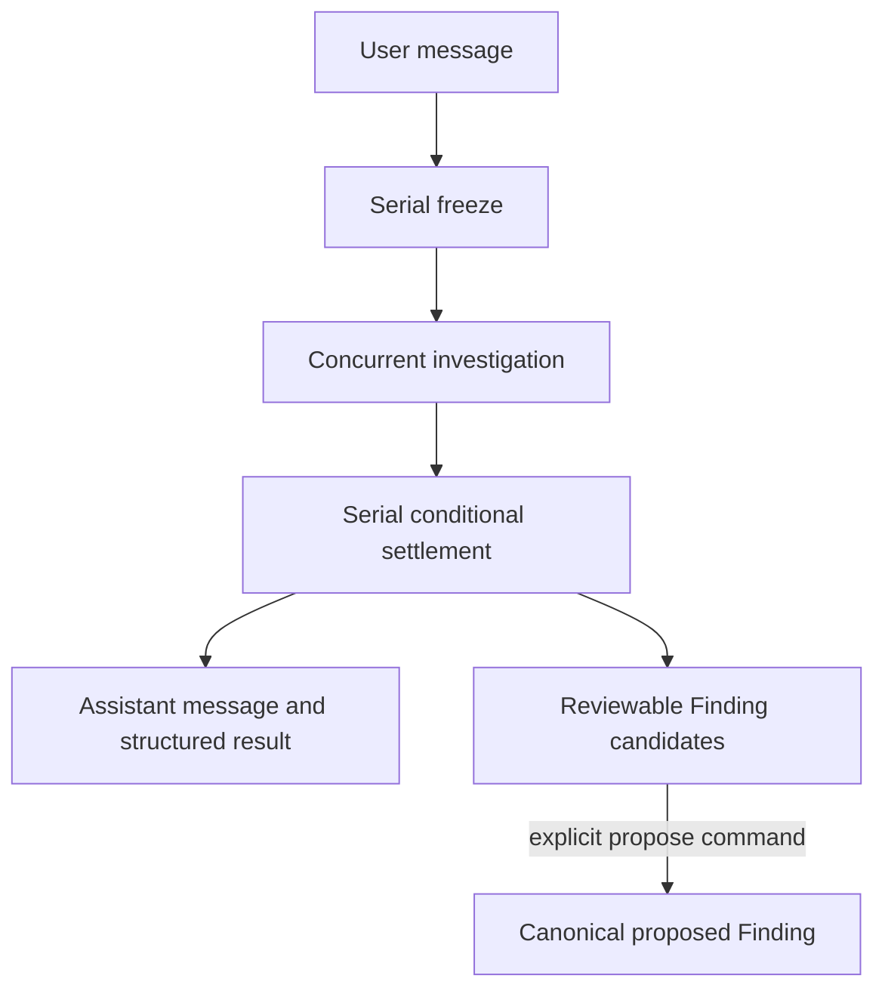
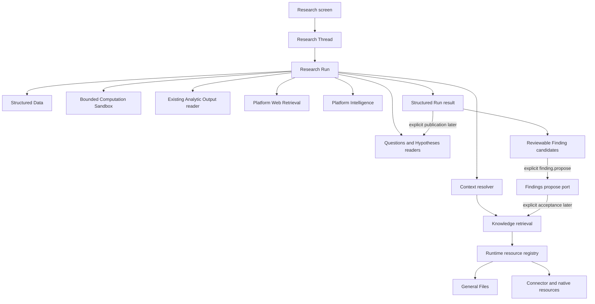

# Research Capability — Design

## Summary

Research is a project-scoped regular capability
(`3-capabilities/research/`) that owns durable, conversational investigations.
It is the backend runtime behind the Research screen: a user can continue a
thread, choose a mode, provide an inquiry, select the available research
channels, and receive both a readable response and a structured result that
can be inspected, retried, or used to propose durable Findings.

Research supports exactly three modes:

- **Discovery** gathers and organizes useful information about an open topic.
- **Question** develops a grounded answer to an explicit question.
- **Hypothesis** attempts to invalidate, qualify, or support a testable
  proposition.

The wire value is `"discovery"`; the frontend may label the mode **Discover**.
A mode belongs to one Run, not to the Thread. A follow-up may therefore switch
from Discovery to Question or from Question to Hypothesis without copying or
rewriting the preceding conversation.

Research owns the investigation process and its durable record. It does not
become a second authority for the material it uses:

- Context and Knowledge own scoped retrieval.
- Structured Data owns named project data and exact values.
- Web Retrieval owns bounded provider transport for search and page fetch.
- General Files and Connector own uploaded and externally connected content.
- Findings owns durable curated claims and their acceptance lifecycle.
- Questions owns canonical Questions and one current answer.
- Hypotheses owns canonical Hypotheses and their current assessment.
- Analytic Output owns saved chart/table output definitions, materialized view
  data, and the contract the frontend renders.
- An injected Computation Sandbox executes bounded quantitative code; Research
  owns the exact Run-scoped specifications, inputs, outputs, and digests.
- Platform Intelligence owns model routing and provider calls.

```text
ResearchThread
  ├─ append-only ResearchMessage[]
  └─ ordered ResearchRun[]
       ├─ one immutable mode and framed subject
       ├─ one frozen channel/input manifest
       ├─ a durable plan, steps, attempts, queries, and exact results
       ├─ one mode-specific structured result
       ├─ one assistant message derived from that result
       └─ local FindingCandidate[] and optional FindingLink[]
```

Research is a durable process aggregate, not a Base-plus-ChangeSet authored
resource. A Run advances through compare-and-swap state transitions and an
append-only event stream. Completed messages, attempts, retrieved results, and
structured results remain historical facts. Retrying creates a new Run linked
to the prior Run; it never overwrites the failed or superseded investigation.
The Thread records its latest Run. Every non-initial user turn links to that
exact predecessor before advancing the pointer; a retry advances the pointer
through `retryOfRunId` without appending another user Message.

## Central design decisions

### Thread, Message, and Run are separate objects

A `ResearchThread` is the conversational container. A `ResearchMessage` is one
immutable user or assistant contribution. A `ResearchRun` is the durable work
created for one user message that requires framing, retrieval, reasoning, or
analysis.

This separation keeps the visible conversation simple while preserving the
runtime detail needed to answer:

- what the user asked at that point in the thread;
- which exact Question or Hypothesis snapshot and digest was examined;
- which Context and Knowledge generation were frozen;
- which web, Knowledge, and Structured Data material was used;
- which model route and policy version performed each step;
- which local candidates were later proposed as canonical Findings; and
- whether a later attempt retried or superseded the Run.

Every assistant research response is backed by one settled Run result. A Run
may complete with insufficient material, contradictions, or a request for
clarification; those are structured outcomes rather than transport failures.
Every follow-up appends a new user Message and creates a new Run linked through
`continuationOfRunId`; the preceding Run is never reopened to continue the chat.

### Every mode returns narrative and structure

Research is conversational, but its canonical result is not only a chat
string. Each mode produces:

1. a concise narrative suitable for the conversation;
2. a typed mode-specific result;
3. exact references to the material used;
4. limitations, contradictions, and unresolved gaps;
5. reviewable Finding candidates and other canonical-object suggestions; and
6. a method trace that explains the material steps without exposing hidden
   model reasoning.

The method trace records actions such as queries issued, resources inspected,
tests executed, and why a conclusion is limited. It does not store private
chain-of-thought or provider-internal reasoning tokens.

Research does not publish a single model-generated numeric confidence score.
Reliability is described through inspectable dimensions: coverage, directness,
agreement or contradiction, recency where relevant, and explicit limitations.
The optional `Hypothesis.confidence` field belongs to the Hypotheses capability
and is never silently populated by a Research Run.

### Three independently governed channels

Each Run freezes the channels that were available when it began:

| Channel | Availability and scope | Canonical authority |
|---|---|---|
| Knowledge | Enabled or disabled. When enabled, an empty Context selection means the full project lattice; otherwise one recursively resolved, frozen scope manifest governs every retrieval and direct resource read. | Knowledge, Context, and the runtime resource registry. |
| Structured Data | Enabled or disabled as one project-wide channel. There is no Research-owned row/table scope. The planner may inspect the catalog and read only relevant entries; the Run pins every entry revision or resolver digest actually used. | Structured Data and Formula. |
| Web | Enabled or disabled and constrained by the configured retrieval policy. Search and fetch results belong to the Run unless explicitly saved as a General File. | Platform Web Retrieval for transport; Research for Run records. |

The default channel selection enables Knowledge and Structured Data. Web is an
explicit per-Run selection because it performs outbound retrieval.

Selected Contexts, attached General Files, Connector entries, native resources,
and accepted Findings all enter the Knowledge channel through `ContextEntry`
resolution and the runtime resource registry. Research does not copy their
content into a second resource table.

Structured Data being project-wide does not mean serializing the entire data
store into every model prompt. It means the Run's Data tools may discover any
project entry. Only returned entries and values become pinned Run inputs.

### One frozen scope for the entire Run

At Run freeze, Research resolves the selected Context entries into one
immutable scope manifest. That same manifest is closed over every initial
query, follow-up retrieval tool call, resource listing, and direct read.

If scope resolution fails, Research does not broaden to the full project. If a
referenced resource disappears after freeze, the exact read fails and becomes a
diagnostic or gap. The Run may still settle an incomplete result; it cannot
silently replace the missing resource with an out-of-scope one.

The frozen input manifest also records the project Knowledge generation. A
Run may retain and settle the exact historical material it already retrieved,
but it is marked as having run against an older generation if Knowledge changes
before settlement. The result remains inspectable and a later retry can use the
new generation.

### Web results are Run records, not a new resource capability

Web Retrieval is a Platform seam. Research decides what to search and what to
inspect; Web Retrieval performs bounded search/fetch through configured
providers and returns normalized results. It owns no public endpoint, Research
plan, durable project record, or canonical content resource.

Research persists the exact web material needed to explain a Run: provider and
query identity, requested and final URLs, title, retrieval time, content digest,
selected excerpt or span, and response diagnostics. Ordinary web results do
not automatically become General Files or Knowledge sources.

An explicit **Save as General File** action may persist selected web content
through General Files. That creates an ordinary General File and follows the
General Files ingestion rules. Research stores only the resulting file
reference; it does not implement a second capture or resource store.

### Findings are canonical outside Research

Research extracts potentially durable claims, but Findings owns the canonical
claim and lifecycle. Run settlement validates and stores **Research-owned
Finding candidates** for review; it does not call Findings. Research may
classify each candidate as:

- **recommended** — sufficiently clear and directly grounded that the UI should
  make acceptance prominent; or
- **needs review** — potentially useful but qualified, inferential, or dependent
  on unresolved context.

Both remain local Research candidates. Settlement creates them with review
state `unreviewed` or `blocked_grounding`; explicit review may move them to
`approved_for_proposal`, `rejected`, or `deferred`. An explicit
`finding.propose` command later converts an approved candidate into a canonical
Finding with status `proposed` and records a separate `FindingLink`. Research
never accepts a Finding, and the recommendation has no authority outside the Run.
Only a later explicit Findings operation moves the canonical Finding to
`accepted`; accepted Findings then enter Knowledge and can ground future
research.

Transient Run material is not itself a Finding. Search snippets, retrieval
windows, calculated intermediate values, model observations, and reviewable
Finding candidates remain Research records until an explicit proposal command
crosses the Findings boundary.

### Questions and Hypotheses are read, then explicitly updated

Question mode may begin from free text or a canonical `questionId`. When an ID
is supplied, Research freezes the Question text, description, capture time, and
canonical digest at Run start. It produces an answer candidate but
does not silently update `Question.answer`. Publishing the candidate uses an
explicit Questions operation approved by the user or an owning workflow.

Hypothesis mode may begin from free text or a canonical `hypothesisId`. A
canonical Hypothesis is read with its owning Question. Research may propose a
status, rationale, statement, or confidence update, but the Hypothesis remains
unchanged until an explicit Hypotheses operation applies that proposal.

A free-form Hypothesis can be tested without becoming canonical. Because every
canonical Hypothesis requires one `questionId`, saving it requires the caller to
select an existing Question or accept a Question recommendation first.

Assumptions are structured parts of a Research result. Research does not create
an Assumptions capability or bury mutable assumption objects inside Questions
or Hypotheses.

### Quantitative work uses a bounded Computation Sandbox

Research reads Structured Data directly for inspection and simple comparison.
When a Question or Hypothesis requires a transformation, statistical test,
simulation, or sensitivity calculation, Research submits an explicit
Run-scoped specification to an injected bounded Computation Sandbox.

The sandbox is an execution port, not a canonical capability or public
endpoint. Research persists the exact code/specification, Structured Data
entry IDs and revisions, selectors, normalized input payload, runtime and
package identity, limits, output, diagnostics, and input/code/output digests.
The sandbox has no project-store access and no network access; it receives only
the frozen bounded inputs Research supplies.

Analytic Output is a different boundary. It describes and materializes the
chart or table output that the frontend should render. Research may read an
existing immutable Analytic Output materialization pinned by
`materializationId` and `materializationDigest` as optional derived input, but
it does not create, mutate, execute, or use Analytic Output as its statistical/Python
engine. A Research computation can later inform a separately authored Analytic
Output, but that publication is outside Research.

### Durable staged execution

Research uses the existing dual-queue runtime rather than implementing an
internal scheduler:



The freeze stage durably creates the user Message, Run, frozen subject/channel
manifest, initial Run compute attempt, six stage receipts, and idempotency
receipt. The concurrent stage frames
the inquiry, retrieves material, invokes Intelligence, performs optional
bounded computation, reads any explicitly referenced Analytic Output, and
persists append-only step attempts and result records. The
settlement stage validates the result, stores grounded Finding candidates,
appends the assistant Message, and advances the Run atomically. A later explicit
command proposes a selected candidate through Findings.

Cancellation is cooperative. Completed searches, reads, tests, and step
attempts remain visible after cancellation. Startup recovery marks an active
attempt `interrupted`; an explicit retry creates a new Run linked to it.

## Where it fits



The common investigation loop is:

```text
freeze → frame → plan → retrieve/read → inspect → challenge → synthesize
       → validate grounding → record candidates → settle → review/follow up
       → explicitly propose selected Findings
```

The loop is adaptive within configured limits. It may issue multiple retrieval
queries, inspect full resource ranges, search the web, execute a bounded
computation over exact Structured Data inputs, or read an explicitly referenced
Analytic Output. Every additional action must address a named gap or
challenge. The loop stops when the mode's completion criteria are met, further
work has low expected information value, cancellation is requested, or a
configured budget is exhausted.

## Prerequisites

| Prerequisite | Research dependency |
|---|---|
| Platform — Intelligence | Structured framing, planning, tool-guided investigation, and mode-specific synthesis through configured purpose routes. |
| Platform — Web Retrieval | Provider-neutral, bounded search and fetch with cancellation. The current repository directory is a scaffold and must be implemented and composed before the Web channel can run. |
| Platform — Knowledge | Batched retrieval, exact regions, a project generation, and immutable scope-manifest reuse. |
| Capability — Context | Resolves nested project Context entries into the Knowledge/resource scope frozen by a Run. |
| Capability — Structured Data and Platform Formula | Project-wide data catalog, exact entry values/revisions, and stable Formula resolution. |
| Runtime resource registry | Maps Context/resource identities to Knowledge source IDs and bounded exact readers for General Files, Connector entries, native resources, and accepted Findings. |
| Capability — Findings | Creates a canonical `proposed` Finding only after an explicit Research proposal command; accepted Findings are already available through Knowledge. |
| Capabilities — Questions and Hypotheses | Resolve canonical inquiry snapshots and apply only explicit approved updates. |
| Bounded Computation Sandbox | Executes isolated, resource-limited quantitative code over exact supplied inputs; owns no Research policy or project data. |
| Capability — Analytic Output | Supplies an optional read-only immutable chart/table materialization pinned by `materializationId` plus `materializationDigest`. Research does not create or execute it. |
| Runtime config, Jobs, dual queues, Logger | Supplies project boundary, limits, idempotent staged execution, cancellation, recovery, and structured diagnostics. |

Web-disabled Runs remain valid before a Web Retrieval adapter is configured.
The full Research product includes the Web channel, so the absence of an
adapter must be exposed as channel unavailability rather than silently treated
as an empty search result.

## Where it lives

```text
apps/backend/src/
  3-capabilities/
    research/
      domain/
        model.ts
        errors.ts
        canonical.ts
        validation.ts
        transitions.ts
        modes/
          discovery.ts
          question.ts
          hypothesis.ts
      application/
        researchService.ts
        runCoordinator.ts
        groundingValidator.ts
        findingAdoption.ts
        webResultSave.ts
      ports/
        researchStore.ts
        reasoning.ts
        researchKnowledge.ts
        projectData.ts
        computation.ts
        analyticOutputs.ts
        findings.ts
        webRetrieval.ts
        resourceReader.ts
        projectFrame.ts
        questions.ts
        hypotheses.ts
        generalFiles.ts
      persistence/
        sqliteSchema.ts
        sqliteResearchStore.ts
        sqliteMappers.ts
      projections/
        threadProjection.ts
        runTimeline.ts
        findingReview.ts
      wire/
        commandSchemas.ts
        querySchemas.ts
        valueSchemas.ts
      docs/
        README.md
        concepts.md
        types.md
        runtime.md
        flows.md
        invariants.md
      index.ts

  1-init/create/
    research.ts

  4-job-wiring/research/
    registerResearchEndpoints.ts
    createResearchJobs.ts
    registerResearchInternalJobs.ts
    researchJobPayloads.ts
```

Research uses its own project-bound SQLite database and repository port. It
does not create database foreign keys into other capability stores. External
identities are frozen and validated through narrow ports.

## Primary mode outcomes

| Mode | Main outcome | Additional structured outcomes |
|---|---|---|
| Discovery | A compact, project-relevant explanation of the topic. | Organized themes, notable grounded claims, reviewable Finding candidates, unknowns, and suggested areas or Questions to explore next. |
| Question | A concise answer to the framed Question. | Decomposition, assumptions, basis references, contradictions, unresolved gaps, reviewable Finding candidates, and candidate Hypotheses. |
| Hypothesis | A test result that attempts disconfirmation before support. | Testability assessment, alternatives when needed, assumptions, explicit tests, supporting/refuting/qualifying material, reviewable Finding candidates, limitations, and next tests. |

The detailed control flow and structured output contracts are defined in
[Modes and workflows](modes-and-workflows.md).

## Documents in this design set

- [Canonical model](canonical-model.md) defines Threads, Messages, Runs,
  manifests, steps, channel records, mode results, and canonical invariants.
- [Modes and workflows](modes-and-workflows.md) defines the shared adaptive
  loop and the distinct Discovery, Question, and Hypothesis algorithms.
- [Operations](operations.md) defines commands, queries, endpoints, Jobs,
  cancellation, retry, idempotency, and settlement.
- [Store](store.md) defines project-scoped SQLite persistence, atomic state
  transitions, immutable attempts/results, recovery, retention, and indexes.
- [File architecture](file-architecture.md) defines module ownership,
  dependency direction, construction, startup, and job wiring.

## Governing invariants

1. Every assistant Research Message is backed by exactly one settled Run.
2. Every Run has exactly one immutable mode and one frozen input/channel
   manifest.
3. A Thread may contain Runs of different modes; switching mode never rewrites
   earlier Messages or Runs.
4. Every Knowledge retrieval, follow-up retrieval, resource listing, and direct
   read uses the Run's one frozen scope manifest.
5. Scope resolution failure never broadens access.
6. Structured Data is read from its canonical project authority; Research
   stores only exact used-entry references and results.
7. Web search/fetch results remain Run records unless an explicit General Files
   operation saves them.
8. Run settlement creates only local reviewable Finding candidates. Research
   creates a canonical proposed Finding only through an explicit proposal
   command, never accepts one, and never silently mutates a Question or
   Hypothesis.
9. Model-produced grounding references must resolve to trusted retrieval,
   resource-read, web-result, Data, Computation, or exact read-only Analytic
   Output records before settlement. Invented references are rejected.
10. Hypothesis mode records at least one explicit attempt to refute, falsify,
    or materially qualify a testable Hypothesis.
11. A non-testable Hypothesis is never silently rewritten. Alternatives are
    shown to the user or preserved as explicit candidates.
12. Retries create new Runs. Completed attempts, results, and events are not
    overwritten.
13. Research stores method actions and diagnostics, not hidden model
    chain-of-thought.
14. Provider credentials, raw provider request envelopes, and provider-specific
    caches remain inside Platform adapters.
15. Every non-initial user turn links to the Thread's immediately preceding Run.
16. A Run owns one immutable ResearchPlan; interrupted compute recovery reuses
    it whenever it was already persisted.

## Open questions

1. **How should a Finding cite Research material outside Knowledge?** The
   current Findings design requires every `SourceReference.sourceId` to identify
   an existing Knowledge source, while Research can ground a claim in an exact
   web-result record, Structured Data revision, Computation record, or existing
   Analytic Output materialization. Automatically turning those into General
   Files or Knowledge text would violate their authority boundaries. The recommended
   resolution is to widen Finding grounding into a tagged union that can cite
   these exact records as well as a Knowledge source. Until then, such a Finding
   candidate can be reviewed in Research but cannot be proposed canonically.

2. **What is the canonical text-span coordinate for Findings?** Current
   Knowledge regions use UTF-16 code-unit positions in the TypeScript runtime,
   while `findings-design.md` describes byte ranges. Research should pass
   trusted opaque grounding handles wherever possible. Before Findings accepts
   Research proposals, the two designs must choose and validate one coordinate
   contract rather than relabeling offsets.

3. **How much Thread history enters a follow-up Run?** Every prior Message stays
   durable, but indefinitely replaying full conversation text is unbounded. A
   configured recent-message window plus a persisted, revisioned thread summary
   is the likely shape; the exact compaction threshold and summary ownership
   remain to be chosen.

4. **What is the first Computation Sandbox runtime?** Research requires the
   port and durable computation record even if the first adapter is narrow. A
   network-disabled Python runtime is the likely initial implementation, but
   its allowed package set, CPU/memory/time limits, deterministic environment
   identity, and deployment boundary must be selected before quantitative Runs
   are enabled.

5. **How long should fetched web payloads remain available?** Exact result
   metadata, selected excerpts, hashes, and Findings references must remain
   durable with the Run. Retaining complete fetched bodies indefinitely would
   duplicate General Files and may create licensing or storage concerns. The
   Web Retrieval policy needs an explicit bounded cache/retention decision.

6. **What keyed proposal contract should Findings expose?** The current
   Findings design generates an ID inside `propose()` and has no idempotency
   key. An explicit Research proposal crosses two SQLite stores, so a crash
   after Findings commits but before Research records the ID could duplicate a
   retry. The recommended resolution is a caller-supplied stable Finding ID or
   a keyed idempotent `propose` contract.
