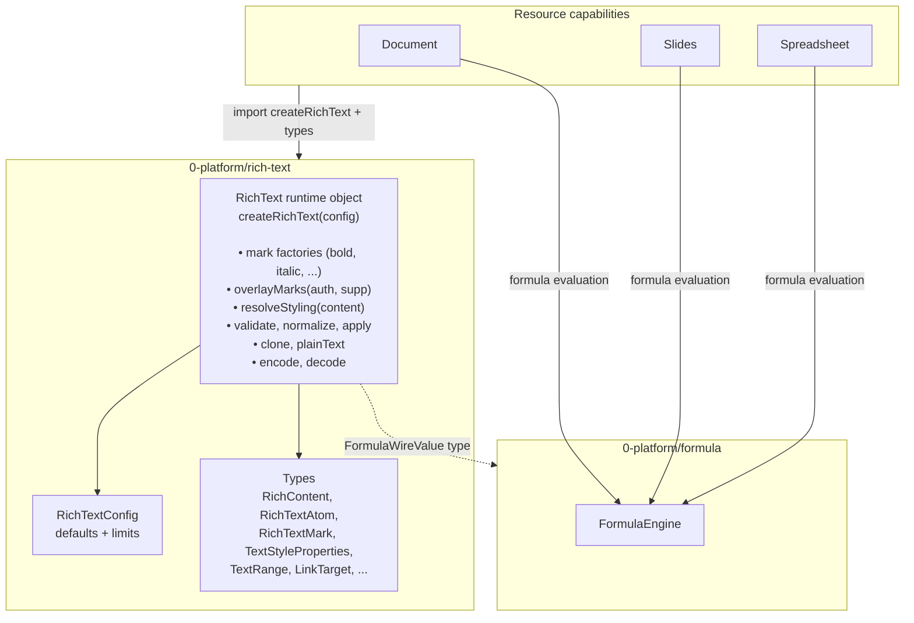

# Rich Text Capability — Design

## Summary

Rich Text is a **platform capability** (`0-platform/rich-text/`) that owns the
canonical vocabulary for inline text content and styling in Icarus. It exposes
a single **runtime object** — `RichText` — that centralises all operations:
validation, normalization, mutation, cloning, plain-text extraction, codec,
mark factories, mark overlay, and style resolution.

Rich Text has no concept of blocks, containers, layouts, or resources. It
operates on `RichContent` (atoms + marks) in isolation. The resource
(Document, Slides, Spreadsheet) owns the block and its structure.

### The runtime object

```ts
const rt = createRichText(config);
```

All functionality flows through this object. Style factories are methods on
it — `rt.bold(range)`, `rt.italic(range)`. Validation is `rt.validate(content)`.
Mark overlay is `rt.overlayMarks(auth, supp)`.

If we change how bold works, we change it in one place: the `RichText`
implementation. Every caller that uses `rt.bold(...)` gets the new behaviour
automatically. The method signatures stay the same.

### The flow

```
Resource has RichContent { atoms, marks }
  → resource translates its block-level intent into marks covering all atoms:
    e.g. heading → rt.fullRangeMark("bold", atoms) + rt.fullRangeStyle({ fontSize: 1.75 }, atoms)
  → rt.overlayMarks(blockMarks, content.marks) → combined marks
  → resource combines atoms + combined marks → final RichContent
  → frontend renders via rt.resolveStyling(finalContent)
```

The resource translates block-level intent into marks. Rich Text doesn't
know about blocks — it just sees two mark lists and overlays them.

### What Rich Text does NOT own

- **Blocks** — None. Resources own all of that.
- **Persistence** — Atoms and marks are embedded in the resource's storage.
- **HTTP endpoints, jobs, logging** — None.

### Prerequisites

- **Platform Formula** supplies `FormulaWireValue` for formula atoms.

---

## Where it lives

```
apps/backend/src/
  0-platform/
    rich-text/
      types.ts            # All types: atoms, marks, positions, ranges, links, config
      engine.ts           # RichText class + createRichText factory
      styles.ts           # Overlay helper, mark-to-properties mapping
      validate.ts         # Validation logic
      normalize.ts        # Normalization logic
      operations.ts       # RichTextOperation + applyOperations
      clone.ts            # Deep clone with RichTextIdFactory
      plain-text.ts       # Plain text extraction
      id-factory.ts       # RichTextIdFactory
      codec.ts            # Encode/decode
      index.ts            # Barrel export
```

`createRichText(config)` constructs the engine. No DI, no startup wiring.

---

## Configuration

```ts
interface RichTextConfig {
  /** Fallback style properties used when no mark provides a value. */
  readonly defaults: TextStyleProperties;

  /** Limits for validation. */
  readonly limits: RichTextLimits;
}

interface RichTextLimits {
  readonly maxAtomsPerContent: number;     // default: 10000
  readonly maxMarksPerContent: number;     // default: 5000
  readonly maxMarkRangeSpan: number;       // max atoms a single mark can cover; default: 1000
}
```

Typical defaults:

```ts
const defaults: TextStyleProperties = {
  fontFamily: "system-ui, sans-serif",
  fontSize: 1.0,
  fontWeight: 400,
  italic: false,
  underline: false,
  strike: false,
  code: false,
  color: "inherit",
  backgroundColor: "transparent",
  letterSpacing: 0,
  lineHeight: 1.5,
};
```

---

## Types & Interfaces

### RichContent

```ts
type FormulaWireValue = import("#formula").FormulaWireValue;

interface RichContent {
  readonly atoms: RichTextAtom[];
  readonly marks: RichTextMark[];
}
```

### Atoms

```ts
type RichTextAtom =
  | TextAtom
  | FormulaAtom
  | ReferenceAtom
  | HardBreakAtom;

interface TextAtom {
  readonly id: string;
  readonly kind: "text";
  readonly text: string;
}

interface FormulaAtom {
  readonly id: string;
  readonly kind: "formula";
  readonly expression: string;
  readonly acceptedValue?: FormulaWireValue;
  readonly displayText: string;
  readonly diagnostic?: RichTextFormulaDiagnostic;
}

interface ReferenceAtom {
  readonly id: string;
  readonly kind: "reference";
  readonly target: LinkTarget;
  readonly displayText: string;
}

interface HardBreakAtom {
  readonly id: string;
  readonly kind: "hard-break";
}
```

Atoms are ordered. Non-text atoms are atomic during editing — the cursor
skips over them.

### Position & Range

```ts
interface TextPosition {
  readonly atomId: string;
  readonly offset: number;   // UTF-16 code units, half-open
}

interface TextRange {
  readonly start: TextPosition;
  readonly end: TextPosition;
}
```

No `blockId`. The block context is implicit.

### Marks

```ts
type RichTextMark =
  | SimpleRangeMark<"bold">
  | SimpleRangeMark<"italic">
  | SimpleRangeMark<"underline">
  | SimpleRangeMark<"strike">
  | SimpleRangeMark<"code">
  | StyleMark
  | LinkMark;

interface SimpleRangeMark<TKind extends string> {
  readonly id: string;
  readonly kind: TKind;
  readonly range: TextRange;
}

interface StyleMark {
  readonly id: string;
  readonly kind: "style";
  readonly range: TextRange;
  readonly properties: TextStyleProperties;
}

interface LinkMark {
  readonly id: string;
  readonly kind: "link";
  readonly range: TextRange;
  readonly targets: LinkTarget[];
}
```

### TextStyleProperties

```ts
interface TextStyleProperties {
  readonly fontFamily?: string;
  readonly fontSize?: number;        // em-relative
  readonly fontWeight?: number;      // 400, 700, etc.
  readonly italic?: boolean;
  readonly underline?: boolean;
  readonly strike?: boolean;
  readonly code?: boolean;
  readonly color?: string;
  readonly backgroundColor?: string;
  readonly letterSpacing?: number;
  readonly lineHeight?: number;
}
```

All optional. Used everywhere — config defaults, mark properties, overlay input/output.

### Link targets

```ts
type LinkTarget =
  | { readonly kind: "url";       readonly href: string }
  | { readonly kind: "resource";  readonly resourceKind: string; readonly resourceId: string; readonly locator?: string }
  | { readonly kind: "evidence";  readonly evidenceId: string }
  | { readonly kind: "question";  readonly questionId: string }
  | { readonly kind: "data";      readonly entryId: string;  readonly locator?: string };
```

### Formula diagnostic

```ts
interface RichTextFormulaDiagnostic {
  readonly code: string;
  readonly message: string;
  readonly sourceRange?: { readonly start: number; readonly end: number };
}
```

---

## The RichText runtime object

```ts
interface RichText {
  // ── Configuration ────────────────────────────────────────────────────
  readonly config: RichTextConfig;

  // ── Mark factories — the authoritative style definitions ─────────────
  bold(range: TextRange, id?: string): SimpleRangeMark<"bold">;
  italic(range: TextRange, id?: string): SimpleRangeMark<"italic">;
  underline(range: TextRange, id?: string): SimpleRangeMark<"underline">;
  strike(range: TextRange, id?: string): SimpleRangeMark<"strike">;
  code(range: TextRange, id?: string): SimpleRangeMark<"code">;
  link(targets: LinkTarget[], range: TextRange, id?: string): LinkMark;
  style(props: TextStyleProperties, range: TextRange, id?: string): StyleMark;

  /** Convenience: produce a mark covering the entire atom list. */
  fullRangeMark(kind: "bold" | "italic" | "underline" | "strike" | "code", atoms: RichTextAtom[], id?: string): SimpleRangeMark<string>;
  fullRangeStyle(props: TextStyleProperties, atoms: RichTextAtom[], id?: string): StyleMark;

  // ── Mark overlay — the core styling operation ────────────────────────
  /**
   * Combine two mark lists into one. The `authoritative` list wins when
   * both have a mark covering the same range and setting the same property.
   * The `supplementary` list fills in where authoritative has nothing.
   *
   * Returns a merged, non-overlapping mark list ready to be combined
   * with atoms into final RichContent.
   */
  overlayMarks(authoritative: RichTextMark[], supplementary: RichTextMark[]): RichTextMark[];

  // ── Style resolution ─────────────────────────────────────────────────
  /**
   * Given RichContent, produce resolved per-range styling by overlaying
   * all marks (in ID order) on top of config.defaults.
   */
  resolveStyling(content: RichContent): ResolvedStyling;

  // ── Pure operations ───────────────────────────────────────────────────
  validate(content: RichContent): ValidationResult;
  normalize(content: RichContent): RichContent;
  apply(content: RichContent, operations: RichTextOperation[]): ApplyResult;
  clone(content: RichContent, ids: RichTextIdFactory): RichContent;
  plainText(atoms: RichTextAtom[]): string;

  // ── Codec ─────────────────────────────────────────────────────────────
  encode(content: RichContent): Uint8Array;
  decode(bytes: Uint8Array): RichContent;
}
```

### Factory

```ts
function createRichText(config?: Partial<RichTextConfig>): RichText;
```

If no config, sensible defaults are used. The instance is stateless beyond
its config — safe to share across requests.

---

## Mark factories

Every mark factory is a method on `RichText`. Single source of truth:

```ts
// Inside RichText implementation:
bold(range: TextRange, id?: string): SimpleRangeMark<"bold"> {
  return { id: id ?? randomUUID(), kind: "bold", range };
}
```

If bold later needs extra metadata, change it here — callers don't change.

`fullRangeMark` and `fullRangeStyle` compute start as `(firstAtom.id, 0)` and
end as `(lastAtom.id, lastAtom.text.length)` (or whole-atom for non-text).

---

## Mark overlay — the core styling operation

```ts
rt.overlayMarks(authoritative: RichTextMark[], supplementary: RichTextMark[]): RichTextMark[]
```

### The model

Two mark lists. **Authoritative wins** where they overlap. **Supplementary
fills in** where authoritative has nothing. Property-level granularity:
if authoritative has `fontWeight: 700` on range A and supplementary has
`fontWeight: 400, color: "red"` on the same range, the result is
`fontWeight: 700` (auth) and `color: "red"` (supp).

```
Authoritative:   [ bold(0..50),              style({ color: "red" }, 20..80) ]
Supplementary:   [ italic(0..100),            style({ color: "blue", fontSize: 1.5 }, 0..100) ]

Find all range boundaries: 0, 20, 50, 80, 100

Segment 0..20:
  auth marks covering: bold
  supp marks covering: italic, style({ color:"blue", fontSize:1.5 })
  per-property: bold(auth), italic(supp), color:"blue"(supp — auth has no color here), fontSize:1.5(supp)

Segment 20..50:
  auth: bold, style({ color:"red" })
  supp: italic, style({ color:"blue", fontSize:1.5 })
  per-property: bold(auth), italic(supp), color:"red"(auth wins), fontSize:1.5(supp)

Segment 50..80:
  auth: style({ color:"red" })
  supp: italic, style({ color:"blue", fontSize:1.5 })
  per-property: italic(supp), color:"red"(auth wins), fontSize:1.5(supp)

Segment 80..100:
  auth: nothing
  supp: italic, style({ color:"blue", fontSize:1.5 })
  per-property: italic(supp), color:"blue"(supp), fontSize:1.5(supp)

Result: bold(0..50), italic(0..100), style({ color:"red" }, 20..80),
        style({ color:"blue" }, 0..20), style({ color:"blue", fontSize:1.5 }, 80..100)
```

### Algorithm sketch

```
function overlayMarks(auth, supp):
  // 1. Collect all range boundaries from both lists
  // 2. For each segment between boundaries:
  //    a. Gather all auth marks covering this segment
  //    b. Gather all supp marks covering this segment
  //    c. Per property: if auth sets it, use auth; else if supp sets it, use supp; else blank
  //    d. Build merged marks from the resolved properties
  //       - Non-style marks (bold, italic, etc.) carry forward from whichever list set them
  //       - Style marks are merged into one style({ ...resolved... }) per segment
  // 3. Merge adjacent identical marks, deduplicate, sort
```

### Why mark-on-mark

Splitting mark overlay from text keeps the model clean:
- Atoms are what the text **is**.
- Marks are what the styling **says**.
- `overlayMarks` operates purely on marks — two lists in, one merged list out.
- The caller combines the result with atoms: `{ atoms, marks: mergedMarks }`.

No mixing of `TextStyleProperties` base with `RichContent`.

---

## Style resolution

```ts
rt.resolveStyling(content: RichContent): ResolvedStyling
```

Overlay all marks in ID order on top of `config.defaults`. Produces final
per-range styling for the frontend.

```ts
interface ResolvedStyleRange {
  readonly range: TextRange;
  readonly properties: TextStyleProperties;
  readonly activeMarks: string[];
  readonly links?: LinkTarget[];
}

interface ResolvedStyling {
  readonly ranges: ResolvedStyleRange[];  // non-overlapping, covering all atoms
  readonly plainText: string;
  readonly links: LinkTarget[];
}
```

Mark ranges are snapped to whole non-text atoms before resolution.

---

## Change Operations

```ts
type RichTextOperation =
  // Text editing
  | { readonly type: "insert-text";    readonly at: TextPosition;  readonly text: string }
  | { readonly type: "delete-range";   readonly range: TextRange }
  | { readonly type: "replace-range";  readonly range: TextRange;  readonly text: string }

  // Atoms
  | { readonly type: "insert-atom";    readonly at: TextPosition;  readonly atom: RichTextAtom }
  | { readonly type: "delete-atom";    readonly atomId: string }

  // Marks
  | { readonly type: "add-mark";       readonly mark: RichTextMark }
  | { readonly type: "remove-mark";    readonly markId: string }
  | { readonly type: "set-link-targets"; readonly markId: string;  readonly targets: LinkTarget[] }

  // Formula
  | { readonly type: "set-formula-expression"; readonly atomId: string; readonly expression: string }
  | { readonly type: "apply-formula-result";   readonly atomId: string; readonly value: FormulaWireValue; readonly displayText: string };
```

No block operations. Resources manage block structure.

---

## Validation rules

| Rule | Category | Description |
|------|----------|-------------|
| Atoms non-empty | structural | `atoms` must have at least one entry |
| Atom IDs unique | structural | No duplicate `atom.id` |
| Mark IDs unique | structural | No duplicate `mark.id` |
| Atom count within limit | structural | `atoms.length ≤ limits.maxAtomsPerContent` |
| Mark count within limit | structural | `marks.length ≤ limits.maxMarksPerContent` |
| Mark range in bounds | referential | Start/end atom IDs must exist in `atoms` |
| Mark offset in bounds | referential | Offsets must be ≤ the atom's text length |
| Ranges ordered | semantic | Start before or equal to end in atom+offset order |
| No surrogate splits | semantic | Offsets must not split a UTF-16 surrogate pair |
| Link has targets | semantic | Link marks must have at least one target |
| No empty marks | semantic | Marks with `start === end` are rejected |

---

## Normalization rules

1. Snap mark ranges to whole atoms for non-text atoms.
2. Remove marks with empty ranges.
3. Merge adjacent `TextAtom`s into one.
4. Remove marks referencing non-existent or out-of-bounds atoms.
5. Remove duplicate adjacent equivalent marks.
6. Sort marks by range start position.

Idempotent: `normalize(normalize(C)) === normalize(C)`.

---

## Pure operation result types

```ts
interface ValidationResult {
  readonly ok: boolean;
  readonly diagnostics: RichTextDiagnostic[];
}

interface RichTextDiagnostic {
  readonly code: string;
  readonly message: string;
  readonly position?: TextPosition;
  readonly range?: TextRange;
}

interface ApplyResult {
  readonly content: RichContent;
  readonly inverse: RichTextOperation[];
  readonly footprint: Footprint;
}

interface Footprint {
  readonly affectedAtomIds: string[];
  readonly dirtyRange?: TextRange;
}
```

---

## Governing Invariants

1. **Atom IDs are stable**: Never change once assigned.
2. **Marks own no content**: Marks carry `TextRange` references and styling
   properties. They are always resolvable against their atom list.
3. **Non-text atoms are atomic for styling**: Formula, reference, and
   hard-break atoms cannot be partially styled. Mark ranges are snapped to
   whole-atom during normalization and during `overlayMarks` / `resolveStyling`.
4. **`overlayMarks` is pure and deterministic**: Same two lists → same merged
   list. Authoritative wins at the property level.
5. **`resolveStyling` is pure and deterministic**: Same content + same config →
   same resolved output.
6. **Config is the single source of defaults**: `config.defaults` provides all
   fallback style values.
7. **Normalization is deterministic and idempotent**.
8. **Encoding is deterministic**: `encode(C1) === encode(C2)` iff semantically identical.
9. **Host ChangeSets remain the authority**: Persistence, conflict detection,
   undo, and redo are owned by the resource capability.

---

## Relationship diagram



---

## Usage pattern

```ts
import { createRichText, type RichContent, type RichTextMark } from "#rich-text";

const rt = createRichText({
  defaults: {
    fontFamily: "system-ui, sans-serif",
    fontSize: 1.0,
    fontWeight: 400,
    italic: false,
    underline: false,
    strike: false,
    code: false,
    color: "inherit",
    backgroundColor: "transparent",
  }
});

// A resource block's content:
const content: RichContent = {
  atoms: [{ id: "a1", kind: "text", text: "Hello world" }],
  marks: [rt.italic({ start: { atomId: "a1", offset: 0 }, end: { atomId: "a1", offset: 5 } })]
};

// The resource translates block-level styling into marks:
const blockMarks: RichTextMark[] = [
  rt.fullRangeMark("bold", content.atoms),
  rt.fullRangeStyle({ fontSize: 1.75 }, content.atoms),  // heading level 2
];

// Overlay: block marks (authoritative) over content marks (supplementary):
const mergedMarks = rt.overlayMarks(blockMarks, content.marks);
const finalContent: RichContent = { atoms: content.atoms, marks: mergedMarks };

// Validate:
const v = rt.validate(finalContent);

// Resolve for frontend:
const styling = rt.resolveStyling(finalContent);

// Apply an edit:
const result = rt.apply(finalContent, [
  { type: "insert-text", at: { atomId: "a1", offset: 5 }, text: ", universe" }
]);

// Plain text:
const text = rt.plainText(finalContent.atoms);  // "Hello world"
```

---

## Package.json imports

```jsonc
{
  "imports": {
    "#rich-text": {
      "types": "./src/0-platform/rich-text/index.ts",
      "default": "./dist/0-platform/rich-text/index.js"
    },
    "#rich-text/*": {
      "types": "./src/0-platform/rich-text/*",
      "default": "./dist/0-platform/rich-text/*"
    }
  }
}
```

---

## File layout

```
apps/backend/src/0-platform/rich-text/
  types.ts            # All types: atoms, marks, positions, ranges, links, config
  engine.ts           # RichText class + createRichText factory
  styles.ts           # Overlay helper, mark-to-properties mapping
  validate.ts         # Validation logic
  normalize.ts        # Normalization logic
  operations.ts       # RichTextOperation + applyOperations
  clone.ts            # Deep clone
  plain-text.ts       # Plain text extraction
  id-factory.ts       # RichTextIdFactory
  codec.ts            # Encode/decode
  index.ts            # Barrel export
```

No `1-init/create/`. No `4-job-wiring/`. No startup wiring.

---

## Implementation order

1. **types.ts** — All type definitions
2. **styles.ts** — Overlay helper, mark-to-properties mapping
3. **id-factory.ts** — Default UUID-based `RichTextIdFactory`
4. **validate.ts** — Validation logic
5. **normalize.ts** — Normalization (including atom snapping)
6. **operations.ts** — `applyOperations` with inverse generation
7. **plain-text.ts** — `plainText`
8. **clone.ts** — `clone`
9. **codec.ts** — `encode` / `decode`
10. **engine.ts** — `RichText` class + `createRichText`
11. **index.ts** — Barrel export
12. **package.json** — Add `#rich-text` and `#rich-text/*` aliases

---

## Related Pages

- Capability — Icarus Document Runtime Model
- Capability — Icarus Slides Runtime Model
- Capability — Icarus Spreadsheet Runtime Model
- Platform — Icarus Formula Capability
