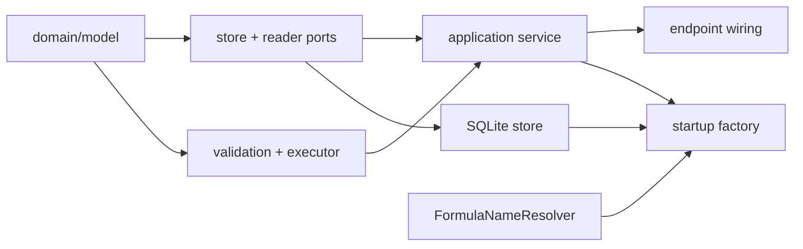

# Structured Analysis — file architecture

## Layout

```text
apps/backend/
  src/
    3-capabilities/structured-analysis/
      domain/
        model.ts
        errors.ts
        validation.ts
        executor.ts
      application/
        structuredAnalysisService.ts
      ports/
        structuredDataReader.ts
        structuredAnalysisStore.ts
      persistence/
        sqliteSchema.ts
        sqliteStructuredAnalysisStore.ts
      wire/
        commandSchemas.ts
        querySchemas.ts
        valueSchemas.ts
      docs/
        README.md concepts.md types.md runtime.md flows.md invariants.md
      index.ts

    1-init/create/structured-analysis.ts
    4-job-wiring/structured-analysis/registerStructuredAnalysisEndpoints.ts

  test/capabilities/
    structured-analysis.test.ts
    structured-analysis-wiring.test.ts
```

This is the current layered shape, including the `wire/` package. Comments,
Persona, and Templates all decode with `exactKeys` inside the capability and
call the decoder from wiring; a definition with nested inputs, joins, filters,
and placements is exactly the recursive-payload case that pattern exists for.

## Responsibilities

| File | Responsibility |
| --- | --- |
| `domain/model.ts` | `StructuredAnalysis`, definition parts, graph, commands, queries, transient result types |
| `domain/errors.ts` | validation, not-found, stale-revision, not-deleted, catalog-limit, and data errors |
| `domain/validation.ts` | structural definition validation, limits, and the structural graph contract |
| `domain/executor.ts` | pure normalize → join → filter → project → aggregate → sort → limit → result |
| `ports/structuredDataReader.ts` | resolve requested names from one project snapshot |
| `ports/structuredAnalysisStore.ts` | current-state reads and writes, history, purge, retention |
| `persistence/sqliteSchema.ts` | table names, DDL, pragmas, shared history schema |
| `persistence/sqliteStructuredAnalysisStore.ts` | the adapter, CAS + history transactions |
| `application/structuredAnalysisService.ts` | command/query dispatch, reader and executor coordination, IDs, clock, logs |
| `wire/` | strict decoders with exact-key rejection and byte limits |
| `registerStructuredAnalysisEndpoints.ts` | two routes, queue choice, error mapping |

The executor imports no store, reader, logger, clock, or job type. It is a
function from values to values, which is what makes the whole pipeline testable
without SQLite or a resolver.

## Dependency direction



The capability imports Formula's wire and rational types and helpers. It does
**not** import `#structured-data`; project data arrives only through
`StructuredDataReader`.

### A required Formula barrel change

The executor needs exact arithmetic and comparison — `add`, `sub`, `mul`, `div`,
`compare`, `eq`, and the rational `toWire`/`fromWire`. All exist in
`0-platform/formula/rational.ts`, but `#formula`'s barrel currently exports only
`makeRational`, `fromDecimalString`, `toDecimalString`, `fromInt`, `ZERO`, and
`ONE`.

Either add those helpers to the barrel, or deep-import `#formula/rational.js`.
There is precedent for the deep form (`#formula/resolver.js` and
`#formula/value-identity.js` are both imported that way), but extending the
barrel is the better change: exact arithmetic is a first-class part of what
Formula offers consumers.

## The reader adapter

`1-init/create/structured-analysis.ts` adapts the existing `FormulaNameResolver`:

```ts
const reader: StructuredDataReader = {
  async readAll(names) {
    const snapshot = await formulaResolver.buildSnapshot();
    const out = new Map<string, AnalysisInputResolution>();

    for (const name of new Set(names.map(normalizeKey))) {
      const binding = snapshot.bindings.get(name);
      if (binding) {
        out.set(
          name,
          isWireSerializable(binding.value)
            ? { kind: "value", value: toWire(binding.value) }
            : { kind: "unresolved", code: "not_serializable" }
        );
        continue;
      }
      // The snapshot omits entries that failed to resolve. getIssue is keyed by
      // entry id, so a name miss is looked up through the entry, distinguishing
      // "broken formula" from "no such name".
      const issue = resolverIssueForName(formulaResolver, name);
      out.set(
        name,
        issue
          ? { kind: "unresolved", code: issue.code, detail: issue.displayName }
          : { kind: "missing" }
      );
    }
    return out;
  }
};
```

One `buildSnapshot()` call serves every input in a run — that is the mechanism
behind invariant 2. The resolver already caches by entries signature, so
repeated runs against unchanged project data are cheap.

Because `snapshot.bindings` is keyed by normalized display name, the lookup is a
direct `Map.get`. No secondary index is built.

## Construction and startup

`1-init/create/structured-analysis.ts` opens the normal fixed capability
database:

```text
./data/structured-analysis.db
```

It constructs the store, the reader adapter, and the service with
`config.userId` for attribution and `config.structuredAnalysis` for limits.

`startBackend.ts`:

1. constructs the service **after** `formulaResolver` exists;
2. adds `structuredAnalysisReady` to the startup log;
3. registers the two endpoints; and
4. adds `bindResourceRetentionPort("structured-analysis", structuredAnalysis)`
   to the retention scheduler list.

It does not register with Knowledge or the resource registry, and it has no
startup recovery or internal jobs.

## Configuration

Add a `structuredAnalysis` section to `etc/configuration.yaml`, a
`StructuredAnalysisConfig` interface plus `DEFAULT_CONFIG` entry and
`parseStructuredAnalysisConfig` in `loadBackendConfig.ts`, and a row in
`etc/README.md`. Values are listed in [operations.md](operations.md#limits).

## Imports

Add the ordinary aliases to both `apps/backend/package.json#imports` and
`apps/backend/tsconfig.json`, using the same `development` / `types` /
`default` conditions as every other capability:

```text
#structured-analysis
#structured-analysis/*
```

## Tests

`structured-analysis.test.ts` — `node:test`, a temporary SQLite path,
deterministic IDs and clock, a fake `StructuredDataReader`, and
`CapturingLogger`:

- create, get, list, wholesale update, stale revision, delete, and purge;
- delete archives a final snapshot and a tombstone; purge before delete fails;
- `pruneHistory` keeps current resources and `expiredDeleted` finds tombstones;
- structural validation: aliases, ordered joins, field references, filter
  shapes, sort targets, limits, and the structural graph contract;
- executor: one input, inner join, left join with nulls, chained join;
- filters before aggregation; sorts and limit after aggregation; stable sort;
- exact `sum`/`average` as rationals, `min`/`max` kind rules, empty-group nulls;
- null never matching null in a join key;
- exactly one reader call per run, no matter how many inputs;
- `analysisRevision` reflects the captured revision when an update races a run;
- missing name vs unresolved name produce distinguishable 422 details;
- each run limit rejects rather than truncating.

`structured-analysis-wiring.test.ts` drives a real registry and scheduler:
command is serial, query is concurrent, and each error maps to its documented
status.

The HTTP smoke script adds one flow: declare two small Structured Data tables,
save an analysis that joins them, run `analysis.data`, assert the fields, rows,
and graph, then delete and purge it.

## Capability docs

Implementation creates the standard in-tree set — `README.md` (status,
boundary, source map), `concepts.md` (pills, aliases, ordered joins, the graph
as recipe), `types.md`, `runtime.md`, `flows.md`, `invariants.md`.

They describe implemented code. They must not reintroduce result history,
rendering, or publication concepts, and `invariants.md` should state the
rename-breaks-a-saved-analysis consequence plainly rather than leaving it to be
rediscovered.
