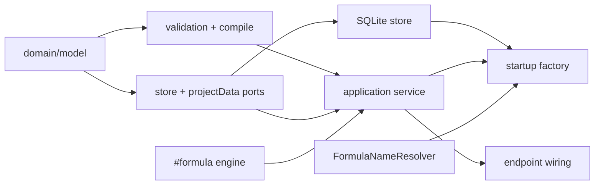

# Structured Analytic — file architecture

## Layout

```text
apps/backend/
  src/
    0-platform/formula/                       ← changes, not a new module
      builtins.ts        ASTABLE JOIN WHERE GROUP AGGREGATE SORT LIMIT DISPLAY
      lexer.ts           backtick-quoted name token
      parser.ts          quoted name → NameNode
      value.ts           display annotation on table values
      wire.ts            annotation on the table arm of FormulaWireValue

    3-capabilities/structured-analytic/
      domain/
        model.ts
        errors.ts
        validation.ts
        compile.ts
      application/
        structuredAnalyticService.ts
      ports/
        projectData.ts
        structuredDataWriter.ts
        structuredAnalyticStore.ts
      persistence/
        sqliteSchema.ts
        sqliteStructuredAnalyticStore.ts
      wire/
        commandSchemas.ts
        querySchemas.ts
        valueSchemas.ts
      docs/
        README.md concepts.md types.md runtime.md flows.md invariants.md
      index.ts

    1-init/create/structured-analytic.ts
    4-job-wiring/structured-analytic/registerStructuredAnalyticEndpoints.ts

  test/capabilities/
    formula-relational.test.ts        ← the builtins, in Formula's own suite
    structured-analytic.test.ts
    structured-analytic-wiring.test.ts
```

The capability is the layered shape with a `wire/` package, matching Comments,
Persona, and Templates.

**Note where the weight sits.** The relational semantics live in
`0-platform/formula`, not in the capability. That is the point of compiling: the
join, group, sort, and limit rules become language features every consumer can
use, tested in Formula's own suite, rather than capability-private behaviour.

## Responsibilities

| File | Responsibility |
| --- | --- |
| `domain/model.ts` | `StructuredAnalytic`, definition parts, display, commands, queries, pull types |
| `domain/errors.ts` | validation, not-found, stale-revision, not-deleted, catalog-limit, and pull errors |
| `domain/validation.ts` | structural definition validation, shape limits, the structural display contract |
| `domain/compile.ts` | definition → `FormulaExpression`, with readable qualified column names |
| `ports/projectData.ts` | one resolver snapshot per pull; cheap entry metadata |
| `ports/structuredDataWriter.ts` | declare a formula-backed or literal-table entry, for save and copy |
| `ports/structuredAnalyticStore.ts` | current-state reads and writes, history, purge, retention |
| `persistence/sqliteSchema.ts` | table names, DDL, pragmas, shared history schema |
| `persistence/sqliteStructuredAnalyticStore.ts` | the adapter, CAS + history transactions, name repair |
| `application/structuredAnalyticService.ts` | command/query dispatch, compile + evaluate coordination, receipt assembly, IDs, clock, logs |
| `wire/` | strict decoders with exact-key rejection and byte limits |
| `registerStructuredAnalyticEndpoints.ts` | two routes, queue choice, error mapping |

`domain/compile.ts` is pure: definition in, expression plus a column map out. No
store, no reader, no logger, no clock. That makes every compilation rule
testable against a literal, and it is where the bulk of this capability's own
tests live.

## Dependency direction



The capability imports `#formula` directly — it is a platform service, and
Document already takes both the engine and a resolver port the same way. It does
**not** import `#structured-data`; project data arrives only through
`ProjectDataPort`.

No rational helpers are needed. Formula does the arithmetic, so the `#formula`
barrel needs no new exports — a dependency an earlier draft had and this one
does not.

## Ports

```ts
interface ProjectDataPort {
  /** One resolver snapshot. Callers memoize it for the duration of a pull. */
  snapshot(): Promise<FormulaResolverSnapshot>;
  /** Cheap: id, name, revision. No formula evaluation. */
  metadata(): Promise<readonly {
    id: string;
    name: string;
    revision: number | string;
  }[]>;
}
```

Smaller than the earlier reader port, because value fetching and normalization
are now the evaluator's job. The capability needs the snapshot to *hand to*
Formula, and metadata to capture `entryId` at save and serve `analytic.check`.

Name and entry-id lookups both read `snapshot.bindings`, which is keyed by
normalized display name; the rename-repair path scans that map by
`reference.bindingId` and only for inputs whose name already missed.

## The composition adapter

```ts
// 1-init/create/structured-analytic.ts
const projectData: ProjectDataPort = {
  snapshot: () => formulaResolver.buildSnapshot(),
  metadata: async () =>
    (await structuredData.list()).map((entry) => ({
      id: entry.id,
      name: entry.displayName,
      revision: entry.revision
    }))
};
```

That is the whole adapter. `buildSnapshot()` already caches by entries
signature, so repeated pulls against unchanged project data are cheap, and
`list()` reads rows without evaluating anything, so a `check` costs a table scan
rather than a resolve.

`resolverIssueForName` remains available for turning a missing binding into a
precise 422 — `getIssue` is keyed by entry id, which distinguishes "broken
formula upstream" from "no such name".

## Construction and startup

`1-init/create/structured-analytic.ts` opens `./data/structured-analytic.db` and
constructs the store, the project-data adapter, and the service with the Formula
engine, `config.userId` for attribution, `config.structuredAnalytic` for shape
limits, and `config.formula` for evaluation limits.

`startBackend.ts`:

1. constructs the service **after** `formula` and `formulaResolver` exist;
2. adds `structuredAnalyticReady` to the startup log;
3. registers the two endpoints; and
4. adds `bindResourceRetentionPort("structured-analytic", structuredAnalytic)`.

No Knowledge registration, no resource registry, no startup recovery, no
internal jobs.

## Configuration

Add a `structuredAnalytic` section to `etc/configuration.yaml`, a
`StructuredAnalyticConfig` interface plus `DEFAULT_CONFIG` entry and
`parseStructuredAnalyticConfig` in `loadBackendConfig.ts`, and a row in
`etc/README.md`. Values are in [operations.md](operations.md#limits).

## Imports

```text
#structured-analytic
#structured-analytic/*
```

in both `apps/backend/package.json#imports` and `apps/backend/tsconfig.json`,
with the same `development` / `types` / `default` conditions as every other
capability.

## Tests

### `formula-relational.test.ts` — the builtins

This is where the semantics are pinned, and it should be the largest of the
three files:

- `ASTABLE` over table, record, list (field renamed from `value`), scalar, and a
  function value rejection;
- `JOIN` inner and left; **null never matching null**; left-with-no-match
  supplying nulls; many-to-many preserving left order then right source order;
  multi-key ANDing;
- `GROUP` keys and aggregates; `AGGREGATE` as the no-keys rollup; `count`
  ignoring nulls; exact rational `sum`/`average`; kind-strict `min`/`max`; null
  over an empty group;
- `SORT` stability, multi-key, `asc`/`desc`, null last, kind-strict comparison;
- `LIMIT` boundaries and a non-positive rejection;
- `DISPLAY` round-tripping through `toWire`/`fromWire` and remaining consumable
  as an ordinary table;
- every relevant `limit_exceeded` diagnostic, including an intermediate join
  blow-up.

### `structured-analytic.test.ts` — the capability

- create, get, list, wholesale update, stale revision, delete, purge;
- delete archives a final snapshot and a tombstone; purge before delete fails;
- `pruneHistory` keeps current resources; `expiredDeleted` finds tombstones;
- structural validation: input keys, ordered joins, field references, filter
  shapes, sort targets, shape limits, the structural display contract;
- a self-join through `as`; rejection of two inputs colliding on one key;
- **compilation**: golden expression text for a one-input analytic, an inner
  join, a left join, a chained join, a filtered-and-grouped pipeline, and a
  sorted-and-limited one — asserted as source text so a change to the emitted
  shape is visible in review;
- a definition that cannot compile is rejected at save;
- rename handling: a renamed entry resolves through `entryId` and reports
  `renamed`; a name now pointing elsewhere reports `retargeted`; the repair is
  written without advancing `revision`, and loses cleanly to a concurrent edit;
- `analytic.check` reads metadata only and never resolves;
- the receipt: one `sources` entry per observed dependency, carrying the entry,
  its current name, and its revision;
- `analyticRevision` reflects the captured revision when an update races a pull;
- missing name versus unresolved name produce distinguishable 422 details.

### `structured-analytic-wiring.test.ts`

Real registry and scheduler: command is serial, query is concurrent, and each
error maps to its documented status.

### Smoke

Declare two small Structured Data tables → save an analytic joining them →
`analytic.pull` and assert fields, rows, display, and receipt → rename one
source → pull again and assert `renamed` with a successful result → delete →
purge.

## Capability docs

The standard six-file in-tree set — `README.md` (status, boundary, source map),
`concepts.md` (pills, named inputs, ordered joins, display as recipe, **the
definition as sugar over a formula**), `types.md`, `runtime.md`, `flows.md`,
`invariants.md`.

`invariants.md` must state plainly: compilation is one-way and the definition
stays canonical; a pull self-heals a renamed name without advancing `revision`;
and the revision-propagation gap and its consequence for `check`.
