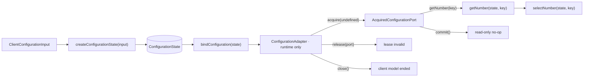
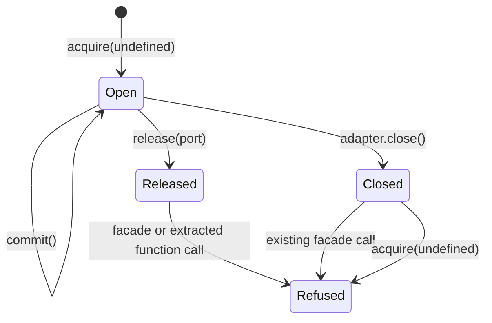
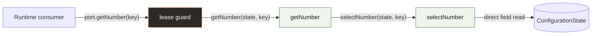
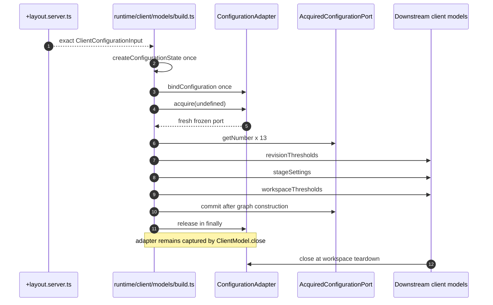

# Configuration model

| Property | Value |
| --- | --- |
| Environment | Client, with server-side input admission |
| Model directory | `app/src/lib/model/client/configuration/` |
| Runtime binding | `app/src/lib/runtime/client/models/build.ts` |
| Lifetime | `client-workspace` |
| Commit mode | `read-only` |


## Purpose and ownership

The configuration model owns the 13 numeric settings admitted for one client
workspace. It turns the nested server transport into owned, flat, primitive-only
state and exposes one operation, `getNumber`, through a short-lived acquired port.

It does not own YAML loading, server configuration lookup, authorization,
downstream threshold meanings, or any consumer's state. Those responsibilities
remain at the server and runtime boundaries.

The central rule is visible in its API:

```ts
// A stored field is read directly.
state.revisionFlushAfterOps;

// Derived behavior is a free function with explicit state.
getNumber(state, "revisions.changeSets.flushAfterOps");
```

There is no model class, `this`, attached method, getter, setter, proxy, or module
singleton. Runtime owns state creation and binding; consumers receive only the
frozen acquired facade.

## Complete architecture



## Source map

| File | Responsibility |
| --- | --- |
| [`types.ts`](../../app/src/lib/model/client/configuration/types.ts) | Exact server transport and closed key vocabulary |
| [`state.ts`](../../app/src/lib/model/client/configuration/state.ts) | Field-only owned state and runtime-only constructor |
| [`port.ts`](../../app/src/lib/model/client/configuration/port.ts) | Outer adapter, acquired port, provenance, and lease lifecycle |
| [`get-number.ts`](../../app/src/lib/model/client/configuration/methods/get-number/get-number.ts) | Public authority-pure free operation |
| [`select-number.ts`](../../app/src/lib/model/client/configuration/methods/get-number/select-number.ts) | Exhaustive supporting selector |
| [`index.ts`](../../app/src/lib/model/client/configuration/index.ts) | Type-only public model entry |
| [`runtime/client/models/types.ts`](../../app/src/lib/runtime/client/models/types.ts) | Runtime-owned adapter collection |
| [`runtime/client/types.ts`](../../app/src/lib/runtime/client/types.ts) | Client graph input and lifetime surface |
| [`runtime/client/models/build.ts`](../../app/src/lib/runtime/client/models/build.ts) | Construction, binding, acquisition, translation, and teardown |
| [`runtime/client/start.ts`](../../app/src/lib/runtime/client/start.ts) | One client graph holder and sole builder importer |
| [`+layout.server.ts`](../../app/src/routes/app/%5Bproject%5D/+layout.server.ts) | Exact finite-number publication boundary |

## Adapter and acquired port

The outer `ConfigurationAdapter` belongs exclusively to runtime. It controls the
model lifetime and may create or revoke leases. The acquired
`AcquiredConfigurationPort` is deliberately smaller: it contains the model's
operations and `commit`, but no state, `acquire`, `release`, `close`, adapter
reference, or infrastructure handle.

```ts
export type ConfigurationOperations = {
  readonly getNumber: (key: ConfigurationNumberKey) => number;
};

export type AcquiredConfigurationPort = Readonly<ConfigurationOperations> & {
  readonly commit: () => void;
};

export type ConfigurationAdapter = {
  readonly lifetime: "client-workspace";
  readonly commitMode: "read-only";
  readonly acquire: (context: undefined) => AcquiredConfigurationPort;
  readonly release: (port: AcquiredConfigurationPort) => void;
  readonly close: () => void;
};
```

Each acquisition allocates a distinct frozen facade and a distinct mutable lease
record. A local `WeakMap` proves that a facade came from this adapter without
putting provenance on the public object. A local `Set` allows `close()` to revoke
all still-open leases.



| Transition | Guarantee |
| --- | --- |
| `acquire(undefined)` | Refuses after close; otherwise returns a fresh exact frozen facade |
| `getNumber(key)` | Checks its own lease, then delegates exactly once to the free operation |
| `commit()` | Checks its own lease; publication is a no-op because the model is read-only |
| `release(port)` | Rejects foreign or forged facades, invalidates this lease, and is idempotent for a valid facade |
| `close()` | Invalidates all open leases, refuses future acquisition, and is idempotent |

The lease check lives inside each facade closure. Extracting an operation cannot
bypass invalidation:

```ts
const port = adapter.acquire(undefined);
const read = port.getNumber;

adapter.release(port);
read("revisions.sync.everyMs"); // throws: lease has been released
```

## Input and state

The route admits one exact nested `ClientConfigurationInput`. The model constructor
then copies each leaf into one flat field. Mutating the caller's nested object
after construction cannot change model state.

| Closed key | Stored field | Runtime translation target |
| --- | --- | --- |
| `presentation.gutter.maximumRem` | `gutterMaximumRem` | Presentation stage settings |
| `presentation.gutter.minimumRem` | `gutterMinimumRem` | Presentation stage settings |
| `presentation.stage.averageGlyphWidthEm` | `stageAverageGlyphWidthEm` | Presentation stage settings |
| `presentation.stage.unitsHigh` | `stageUnitsHigh` | Presentation stage settings |
| `presentation.stage.widthRem` | `stageWidthRem` | Presentation stage settings |
| `presentation.zoom.maximum` | `zoomMaximum` | Presentation stage settings |
| `presentation.zoom.minimum` | `zoomMinimum` | Presentation stage settings |
| `presentation.zoom.step` | `zoomStep` | Presentation stage settings |
| `revisions.changeSets.flushAfterMs` | `revisionFlushAfterMs` | Document, presentation, and spreadsheet revisions |
| `revisions.changeSets.flushAfterOps` | `revisionFlushAfterOps` | Document, presentation, and spreadsheet revisions |
| `revisions.sync.everyMs` | `revisionSyncEveryMs` | Document, presentation, and spreadsheet revisions |
| `workspace.changeSets.flushAfterMs` | `workspaceFlushAfterMs` | Workspace change sets |
| `workspace.changeSets.flushAfterOps` | `workspaceFlushAfterOps` | Workspace change sets |

There is no open `Record<string, unknown>`, generic path getter, optional key,
fallback, coercion, or default. Adding or removing a setting requires an explicit
change at every relevant boundary.

## Pure operation tree

There are exactly two production functions below `methods/`.



| Function | Signature | Responsibility | Effects |
| --- | --- | --- | --- |
| `getNumber` | `(ConfigurationState, ConfigurationNumberKey) → number` | Public method entry and named call-tree root | None |
| `selectNumber` | `(ConfigurationState, ConfigurationNumberKey) → number` | Exhaustively map the closed key to a stored field | None |

Both functions receive state first and import only state, local types, or another
function in the same method tree. They cannot import the port, runtime, another
model, a framework surface, or an external package.

## Runtime construction and transformation

`buildClientModel` is the only production site that constructs configuration
state and binds its adapter. The adapter is collected under
`ClientModelAdapters`, then one construction lease is acquired inside a
`try/finally`.



Downstream models receive their own exact setting records. They do not receive
configuration state, the adapter, the acquired port, or a broad model collection.

## Server admission

The project layout authenticates and resolves project scope before returning the
configuration transport. `requiredPublishedNumber` rejects missing, non-number,
`NaN`, and infinite values on the server. The literal `publish` result is the
browser allowlist, so a sibling credential or newly added YAML field cannot be
serialized accidentally.

```ts
const requiredPublishedNumber = (
  configuration: Configuration,
  key: string
): number => {
  const value = configuration.get(key);
  if (typeof value !== "number" || !Number.isFinite(value)) {
    throw new Error(
      `Published configuration key '${key}' must be a finite number — check configuration/`
    );
  }
  return value;
};
```

## Concurrency and failure semantics

- **Concurrent acquisitions:** all leases read one immutable singleton state, but
  each facade has independent identity and invalidation.
- **Commit:** checks that the lease is open and performs no publication.
- **Release without commit:** valid because the model has no staged writes;
  release only invalidates the lease.
- **Foreign or forged release:** rejected through `WeakMap` provenance.
- **Construction failure:** runtime releases the lease in `finally`; `commit()` is
  reached only after the downstream graph has been constructed successfully.
- **Close:** invalidates every unexpectedly open lease and prevents later
  acquisition.
- **Durability and conflicts:** not applicable to this read-only model. This model
  does not prove staged-write isolation, rollback, durable recovery, or conflict
  handling.

## Enforced invariants

| Guarantee | Checker | Executable evidence |
| --- | --- | --- |
| Island imports remain model-local | `pure-island-import-closure` | Checker mutation suite |
| No ambient authority or module state | `pure-island-has-no-ambient-authority` | Checker mutation suite |
| Exported data is closed | `pure-island-exports-are-closed` | Checker mutation suite |
| State contains fields only | `model-state-is-fields` | `get-number.test.ts` |
| Operations are free and state-first | `model-operations-are-free` | `get-number.test.ts` |
| Acquired facade and lifecycle are exact | `model-port-has-one-lifecycle` | `port.test.ts` |
| Runtime alone constructs and binds | `runtime-alone-builds-models` | Static symbol analysis |

The model tests cover all 13 key mappings, owned state copying, exact adapter and
facade shapes, fresh frozen facades, read-only commit, extracted calls after
release, sibling lease isolation, idempotent valid release, forged and foreign
facades, close invalidation, and acquisition after close.

## Complete production source

The following blocks are the complete production files that define this model
and its runtime lifecycle at the time of this migration.

### `app/src/lib/model/client/configuration/types.ts`

```ts
/**
 * The complete, allowlisted configuration payload that may cross into the
 * browser. Every field is required and numeric: the server route admits this
 * shape before it is serialized, so the client model never handles raw YAML or
 * an open-ended configuration bag.
 */
export type ClientConfigurationInput = {
  readonly revisions: {
    readonly changeSets: {
      readonly flushAfterOps: number;
      readonly flushAfterMs: number;
    };
    readonly sync: {
      readonly everyMs: number;
    };
  };
  readonly workspace: {
    readonly changeSets: {
      readonly flushAfterOps: number;
      readonly flushAfterMs: number;
    };
  };
  readonly presentation: {
    readonly stage: {
      readonly unitsHigh: number;
      readonly widthRem: number;
      readonly averageGlyphWidthEm: number;
    };
    readonly zoom: {
      readonly minimum: number;
      readonly maximum: number;
      readonly step: number;
    };
    readonly gutter: {
      readonly minimumRem: number;
      readonly maximumRem: number;
    };
  };
};

/** The finite set of reads the client configuration model supports. */
export type ConfigurationNumberKey =
  | "presentation.gutter.maximumRem"
  | "presentation.gutter.minimumRem"
  | "presentation.stage.averageGlyphWidthEm"
  | "presentation.stage.unitsHigh"
  | "presentation.stage.widthRem"
  | "presentation.zoom.maximum"
  | "presentation.zoom.minimum"
  | "presentation.zoom.step"
  | "revisions.changeSets.flushAfterMs"
  | "revisions.changeSets.flushAfterOps"
  | "revisions.sync.everyMs"
  | "workspace.changeSets.flushAfterMs"
  | "workspace.changeSets.flushAfterOps";
```

### `app/src/lib/model/client/configuration/state.ts`

```ts
import type { ClientConfigurationInput } from "$model/client/configuration/types";

/**
 * One client-workspace configuration singleton.
 *
 * The state is deliberately flat and primitive-only. Runtime copies the
 * admitted transport value into these fields, so no mutable object received
 * from the route remains aliased to model state.
 */
export type ConfigurationState = {
  readonly gutterMaximumRem: number;
  readonly gutterMinimumRem: number;
  readonly revisionFlushAfterMs: number;
  readonly revisionFlushAfterOps: number;
  readonly revisionSyncEveryMs: number;
  readonly stageAverageGlyphWidthEm: number;
  readonly stageUnitsHigh: number;
  readonly stageWidthRem: number;
  readonly workspaceFlushAfterMs: number;
  readonly workspaceFlushAfterOps: number;
  readonly zoomMaximum: number;
  readonly zoomMinimum: number;
  readonly zoomStep: number;
};

/** Called once by the client runtime model builder. */
export const createConfigurationState = (
  input: ClientConfigurationInput
): ConfigurationState => ({
  gutterMaximumRem: input.presentation.gutter.maximumRem,
  gutterMinimumRem: input.presentation.gutter.minimumRem,
  revisionFlushAfterMs: input.revisions.changeSets.flushAfterMs,
  revisionFlushAfterOps: input.revisions.changeSets.flushAfterOps,
  revisionSyncEveryMs: input.revisions.sync.everyMs,
  stageAverageGlyphWidthEm: input.presentation.stage.averageGlyphWidthEm,
  stageUnitsHigh: input.presentation.stage.unitsHigh,
  stageWidthRem: input.presentation.stage.widthRem,
  workspaceFlushAfterMs: input.workspace.changeSets.flushAfterMs,
  workspaceFlushAfterOps: input.workspace.changeSets.flushAfterOps,
  zoomMaximum: input.presentation.zoom.maximum,
  zoomMinimum: input.presentation.zoom.minimum,
  zoomStep: input.presentation.zoom.step
});
```

### `app/src/lib/model/client/configuration/port.ts`

```ts
import { getNumber } from "$model/client/configuration/methods/get-number/get-number";
import type { ConfigurationState } from "$model/client/configuration/state";
import type { ConfigurationNumberKey } from "$model/client/configuration/types";

export type ConfigurationOperations = {
  readonly getNumber: (key: ConfigurationNumberKey) => number;
};

export type AcquiredConfigurationPort = Readonly<ConfigurationOperations> & {
  readonly commit: () => void;
};

export type ConfigurationAdapter = {
  readonly lifetime: "client-workspace";
  readonly commitMode: "read-only";
  readonly acquire: (context: undefined) => AcquiredConfigurationPort;
  readonly release: (port: AcquiredConfigurationPort) => void;
  readonly close: () => void;
};

type ConfigurationLease = {
  released: boolean;
};

/**
 * Binds the one runtime-created state object to fresh, independently releasable
 * read leases. The adapter itself remains inside runtime.
 */
export const bindConfiguration = (
  state: ConfigurationState
): ConfigurationAdapter => {
  const leases = new WeakMap<AcquiredConfigurationPort, ConfigurationLease>();
  const active = new Set<ConfigurationLease>();
  let closed = false;

  return {
    lifetime: "client-workspace",
    commitMode: "read-only",
    acquire: (_context: undefined): AcquiredConfigurationPort => {
      if (closed) throw new Error("Configuration adapter has been closed");
      const lease: ConfigurationLease = { released: false };
      const port: AcquiredConfigurationPort = Object.freeze({
        getNumber: (key: ConfigurationNumberKey): number => {
          if (lease.released) throw new Error("Configuration lease has been released");
          return getNumber(state, key);
        },
        commit: (): void => {
          if (lease.released) throw new Error("Configuration lease has been released");
        }
      });
      leases.set(port, lease);
      active.add(lease);
      return port;
    },
    release: (port: AcquiredConfigurationPort): void => {
      const lease = leases.get(port);
      if (!lease) throw new Error("Configuration port was not acquired from this adapter");
      lease.released = true;
      active.delete(lease);
    },
    close: (): void => {
      closed = true;
      for (const lease of active) lease.released = true;
      active.clear();
    }
  };
};
```

### `app/src/lib/model/client/configuration/methods/get-number/get-number.ts`

```ts
import { selectNumber } from "$model/client/configuration/methods/get-number/select-number";
import type { ConfigurationState } from "$model/client/configuration/state";
import type { ConfigurationNumberKey } from "$model/client/configuration/types";

/** The public free operation backing the acquired port's `getNumber` member. */
export const getNumber = (
  state: ConfigurationState,
  key: ConfigurationNumberKey
): number => selectNumber(state, key);
```

### `app/src/lib/model/client/configuration/methods/get-number/select-number.ts`

```ts
import type { ConfigurationState } from "$model/client/configuration/state";
import type { ConfigurationNumberKey } from "$model/client/configuration/types";

/** Maps the closed public vocabulary to the model's stored fields. */
export const selectNumber = (
  state: ConfigurationState,
  key: ConfigurationNumberKey
): number => {
  switch (key) {
    case "presentation.gutter.maximumRem":
      return state.gutterMaximumRem;
    case "presentation.gutter.minimumRem":
      return state.gutterMinimumRem;
    case "presentation.stage.averageGlyphWidthEm":
      return state.stageAverageGlyphWidthEm;
    case "presentation.stage.unitsHigh":
      return state.stageUnitsHigh;
    case "presentation.stage.widthRem":
      return state.stageWidthRem;
    case "presentation.zoom.maximum":
      return state.zoomMaximum;
    case "presentation.zoom.minimum":
      return state.zoomMinimum;
    case "presentation.zoom.step":
      return state.zoomStep;
    case "revisions.changeSets.flushAfterMs":
      return state.revisionFlushAfterMs;
    case "revisions.changeSets.flushAfterOps":
      return state.revisionFlushAfterOps;
    case "revisions.sync.everyMs":
      return state.revisionSyncEveryMs;
    case "workspace.changeSets.flushAfterMs":
      return state.workspaceFlushAfterMs;
    case "workspace.changeSets.flushAfterOps":
      return state.workspaceFlushAfterOps;
    default:
      throw new Error(`Unsupported client configuration key: ${key}`);
  }
};
```

### `app/src/lib/model/client/configuration/index.ts`

```ts
/** Public data and acquired-port contracts; construction and binding belong to runtime. */
export type {
  AcquiredConfigurationPort,
  ConfigurationOperations
} from "$model/client/configuration/port";
export type {
  ClientConfigurationInput,
  ConfigurationNumberKey
} from "$model/client/configuration/types";
```

### `app/src/lib/runtime/client/models/types.ts`

```ts
import type { ConfigurationAdapter } from "$model/client/configuration/port";

/** The client adapters migrated to the runtime-owned port lifecycle. */
export type ClientModelAdapters = {
  readonly configuration: ConfigurationAdapter;
};
```

### `app/src/lib/runtime/client/types.ts`

```ts
import type { CommandsModel } from "$model/client/commands";
import type { ClientConfigurationInput } from "$model/client/configuration";
import type { DocumentRuntimesModel } from "$model/client/document-runtimes";
import type { PresentationRuntimesModel } from "$model/client/presentation-runtimes";
import type { SpreadsheetRuntimesModel } from "$model/client/spreadsheet-runtimes";
import type { WorkspaceStateModel } from "$model/client/workspace-state";

export type ClientModelInput = {
  readonly project: string;
  readonly configuration: ClientConfigurationInput;
};

export interface ClientModel {
  readonly project: string;
  readonly documentRuntimes: DocumentRuntimesModel;
  readonly presentationRuntimes: PresentationRuntimesModel;
  readonly spreadsheetRuntimes: SpreadsheetRuntimesModel;

  readonly workspaceState: WorkspaceStateModel;
  readonly commands: CommandsModel;

  close(): void;
}
```

### `app/src/lib/runtime/client/models/build.ts`

```ts
import { createCommands } from "$model/client/commands";
import { bindConfiguration } from "$model/client/configuration/port";
import { createConfigurationState } from "$model/client/configuration/state";
import { createDocumentRuntimes } from "$model/client/document-runtimes";
import { createPresentationRuntimes } from "$model/client/presentation-runtimes";
import { createSpreadsheetRuntimes } from "$model/client/spreadsheet-runtimes";
import { createTabList } from "$model/client/tab-list";
import { createTabViews } from "$model/client/tab-views";
import { createWorkspaceState } from "$model/client/workspace-state";
import type { ClientModelAdapters } from "$runtime/client/models/types";
import type { ClientModel, ClientModelInput } from "$runtime/client/types";

/**
 * The client composition root. It creates the configuration singleton and its
 * adapter exactly once, acquires one construction lease, and translates that
 * local port into each downstream model's own settings vocabulary.
 */
export const buildClientModel = ({
  project,
  configuration
}: ClientModelInput): ClientModel => {
  const configurationState = createConfigurationState(configuration);
  const models: ClientModelAdapters = {
    configuration: bindConfiguration(configurationState)
  };
  const settings = models.configuration.acquire(undefined);

  try {
    const revisionThresholds = {
      afterOps: settings.getNumber("revisions.changeSets.flushAfterOps"),
      afterMs: settings.getNumber("revisions.changeSets.flushAfterMs"),
      syncEveryMs: settings.getNumber("revisions.sync.everyMs")
    };
    const stageSettings = {
      unitsHigh: settings.getNumber("presentation.stage.unitsHigh"),
      widthRem: settings.getNumber("presentation.stage.widthRem"),
      averageGlyphWidthEm: settings.getNumber("presentation.stage.averageGlyphWidthEm"),
      minimumZoom: settings.getNumber("presentation.zoom.minimum"),
      maximumZoom: settings.getNumber("presentation.zoom.maximum"),
      zoomStep: settings.getNumber("presentation.zoom.step"),
      minimumGutterRem: settings.getNumber("presentation.gutter.minimumRem"),
      maximumGutterRem: settings.getNumber("presentation.gutter.maximumRem")
    };
    const workspaceThresholds = {
      afterOps: settings.getNumber("workspace.changeSets.flushAfterOps"),
      afterMs: settings.getNumber("workspace.changeSets.flushAfterMs")
    };

    const documentRuntimes = createDocumentRuntimes(revisionThresholds);
    const presentationRuntimes = createPresentationRuntimes(
      revisionThresholds,
      stageSettings
    );
    const spreadsheetRuntimes = createSpreadsheetRuntimes(revisionThresholds);

    const tabList = createTabList();
    const tabViews = createTabViews();
    const workspaceState = createWorkspaceState(
      project,
      tabList,
      tabViews,
      workspaceThresholds,
      documentRuntimes,
      presentationRuntimes,
      spreadsheetRuntimes
    );

    settings.commit();
    return {
      project,
      workspaceState,
      documentRuntimes,
      presentationRuntimes,
      spreadsheetRuntimes,
      commands: createCommands(workspaceState),

      close: () => {
        void workspaceState.flush().catch(() => undefined);
        documentRuntimes.releaseAll();
        presentationRuntimes.releaseAll();
        spreadsheetRuntimes.releaseAll();
        workspaceState.release();
        models.configuration.close();
      }
    };
  } finally {
    models.configuration.release(settings);
  }
};
```

### `app/src/lib/runtime/client/start.ts`

```ts
import { browser } from "$app/environment";
import { buildClientModel } from "$runtime/client/models/build";
import type { ClientModel, ClientModelInput } from "$runtime/client/types";

export type { ClientModel, ClientModelInput } from "$runtime/client/types";
export type {
  Chord,
  ChordParts,
  Command,
  CommandId,
  CommandsModel
} from "$model/client/commands";
export { COMMAND_IDS, DEFAULT_BINDINGS, chordOf, isCommandId } from "$model/client/commands";

let instance: ClientModel | undefined;

export const initClientModel = (input: ClientModelInput): ClientModel =>
  (instance = buildClientModel(input));

export const clientModel = (): ClientModel => {
  if (!browser) {
    throw new Error(
      "The client model is browser-only — it belongs to one browser tab. " +
        "See src/lib/runtime/client/client.md."
    );
  }
  if (!instance) {
    throw new Error(
      "The client model has not been built — the /app layout that owns this client " +
        "instance calls initClientModel(). See src/lib/runtime/client/client.md."
    );
  }
  return instance;
};
```

### `app/src/routes/app/[project]/+layout.server.ts`

```ts
import { resolveScope } from "$runtime/server/scope.server";
import type { Configuration } from "$runtime/server/start.server";
import type { LayoutServerLoad } from "./$types";

/**
 * Admits one published numeric value. Configuration faults fail on the server,
 * before an incomplete or mistyped transport object reaches the client model.
 */
const requiredPublishedNumber = (
  configuration: Configuration,
  key: string
): number => {
  const value = configuration.get(key);
  if (typeof value !== "number" || !Number.isFinite(value)) {
    throw new Error(
      `Published configuration key '${key}' must be a finite number — check configuration/`
    );
  }
  return value;
};

/**
 * The literal is the browser allowlist. It cannot accidentally serialize a
 * sibling secret, and its exact nested shape is inferred into LayoutServerData.
 */
const publish = (configuration: Configuration) => ({
  revisions: {
    changeSets: {
      flushAfterOps: requiredPublishedNumber(
        configuration,
        "revisions.changeSets.flushAfterOps"
      ),
      flushAfterMs: requiredPublishedNumber(
        configuration,
        "revisions.changeSets.flushAfterMs"
      )
    },
    sync: {
      everyMs: requiredPublishedNumber(configuration, "revisions.sync.everyMs")
    }
  },
  workspace: {
    changeSets: {
      flushAfterOps: requiredPublishedNumber(
        configuration,
        "workspace.changeSets.flushAfterOps"
      ),
      flushAfterMs: requiredPublishedNumber(
        configuration,
        "workspace.changeSets.flushAfterMs"
      )
    }
  },
  presentation: {
    stage: {
      unitsHigh: requiredPublishedNumber(configuration, "presentation.stage.unitsHigh"),
      widthRem: requiredPublishedNumber(configuration, "presentation.stage.widthRem"),
      averageGlyphWidthEm: requiredPublishedNumber(
        configuration,
        "presentation.stage.averageGlyphWidthEm"
      )
    },
    zoom: {
      minimum: requiredPublishedNumber(configuration, "presentation.zoom.minimum"),
      maximum: requiredPublishedNumber(configuration, "presentation.zoom.maximum"),
      step: requiredPublishedNumber(configuration, "presentation.zoom.step")
    },
    gutter: {
      minimumRem: requiredPublishedNumber(configuration, "presentation.gutter.minimumRem"),
      maximumRem: requiredPublishedNumber(configuration, "presentation.gutter.maximumRem")
    }
  }
});

/**
 * Hands the client instance its settings.
 *
 * A server load rather than a remote function, because these values must be in
 * hand *before* `buildClientModel` runs: the objects below read their thresholds
 * during their own construction, and a value that arrived after mount would make
 * every one of them cope with not having one yet.
 *
 * `+layout.ts` sets `ssr = false`, which turns off server *rendering* and not
 * server *loads* — the client router fetches this, so the data is present when
 * the layout script runs.
 */
export const load: LayoutServerLoad = async ({ locals, params }) => {
  await resolveScope(locals.session, params.project);

  return { configuration: publish(locals.model.configuration) };
};
```

## Known limit and next proof

Configuration deliberately proves only the read-only lifecycle. The next staged
mutable model must demonstrate lease-owned staging, atomic commit, release-time
discard, concurrent acquisition isolation, conflict behavior, and durable fault
recovery before those semantics are treated as established across the system.
