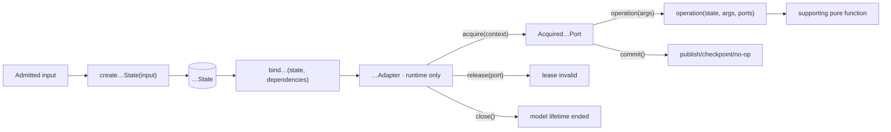
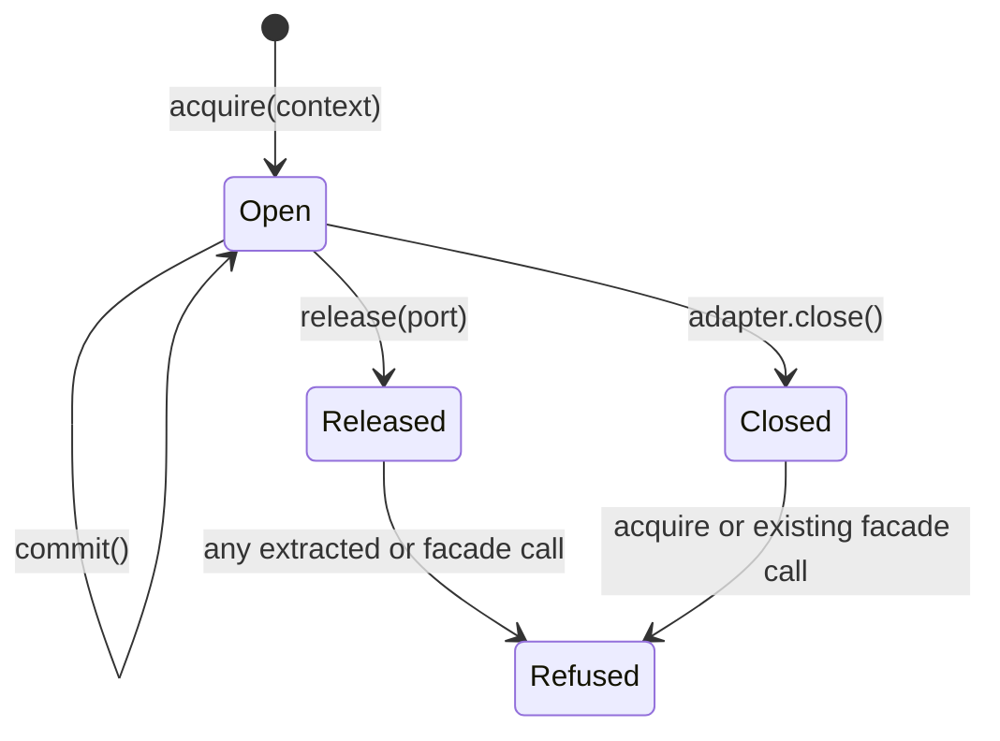
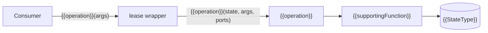
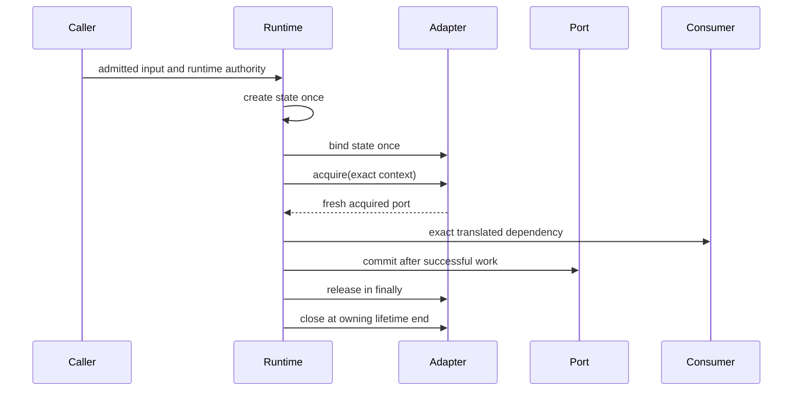

# {{Model name}} model

<!--
Copy this file to wiki/models/<model-name>.md and replace every {{placeholder}}.
Keep the document synchronized with production source. Show exact signatures and
meaningful implementation code; do not use pseudocode where the real code is
short enough to review directly.
-->

| Property | Value |
| --- | --- |
| Environment | `{{client or server}}` |
| Model directory | `{{src/lib/model/...}}` |
| Runtime binding | `{{src/lib/runtime/...}}` |
| Lifetime | `{{lifetime literal}}` |
| Commit mode | `{{staged, immediate, or read-only}}` |
| Migration status | `{{status}}` |

## Purpose and ownership

`{{Model name}}` owns {{state and behavior this model owns}}.

It does not own {{important neighboring responsibilities}}.

Its public consumers receive {{the acquired port or translated values}}, never
{{raw state, the outer adapter, infrastructure, or another forbidden surface}}.

## Complete architecture



## Source map

| File | Role | May contain authority? |
| --- | --- | --- |
| `state.ts` | Stored fields and the runtime-only state constructor | No |
| `types.ts` | Exact input, value, context, and command contracts | No |
| `port.ts` | Runtime adapter and acquired facade binding | Boundary only |
| `methods/<operation>/<operation>.ts` | Public free model operation | No |
| `methods/<operation>/<helper>.ts` | Supporting pure operation | No |
| `runtime/.../models/build.ts` | State construction, binding, acquisition, translation, teardown | Yes |
| `test/...` | Pure-operation and lifecycle evidence | Test only |

## Input and state

Describe where the input is admitted, what is copied, and why every stored field
belongs to this model. State must contain data fields only.

```ts
export type {{InputType}} = {
  readonly {{inputField}}: {{inputValueType}};
};

export type {{StateType}} = {
  readonly {{stateField}}: {{stateValueType}};
};

export const {{createState}} = (input: {{InputType}}): {{StateType}} => ({
  {{stateField}}: input.{{inputField}}
});
```

### Stored fields

| Field | Type | Source | Meaning |
| --- | --- | --- | --- |
| `{{stateField}}` | `{{stateValueType}}` | `input.{{inputField}}` | {{meaning}} |

## Adapter and acquired port

Explain the distinction between the runtime-only adapter and the narrower facade
received by a consumer. Document facade identity, provenance checks, invalidation,
commit behavior, and whether `close()` exists.

```ts
export type {{OperationsType}} = {
  readonly {{operation}}: ({{arguments}}) => {{resultType}};
};

export type {{AcquiredPortType}} = Readonly<{{OperationsType}}> & {
  readonly commit: () => {{commitResultType}};
};

export type {{AdapterType}} = {
  readonly lifetime: "{{lifetime literal}}";
  readonly commitMode: "{{commit mode}}";
  readonly acquire: (context: {{ContextType}}) => {{AcquiredPortType}};
  readonly release: (port: {{AcquiredPortType}}) => void;
  readonly close: () => void;
};
```

### Lifecycle



| Transition | Guarantee |
| --- | --- |
| `acquire(context)` | {{fresh facade, scoped stage, snapshot, or transaction rule}} |
| `commit()` | {{atomic publication, checkpoint, or documented no-op}} |
| `release(port)` | {{discard/release behavior and idempotency rule}} |
| `close()` | {{lifetime teardown and later-call behavior}} |

## Operations

| Port member | Free entry | Signature | Reads | Mutates/calls | Result |
| --- | --- | --- | --- | --- | --- |
| `{{operation}}` | `{{operation}}` | `({{StateType}}, …) → {{resultType}}` | {{fields}} | {{explicit ports or state fields}} | {{meaning}} |

### `{{operation}}`

Explain the public decision, its refused inputs, and every function beneath it.



```ts
export const {{operation}} = (
  state: {{StateType}},
  {{arguments}}
): {{resultType}} => {{supportingFunction}}(state, {{argumentNames}});
```

```ts
export const {{supportingFunction}} = (
  state: {{StateType}},
  {{arguments}}
): {{resultType}} => {
  // Exact supporting decision.
};
```

Repeat this subsection for every public operation and list all supporting pure
functions. A field read may use `state.field`; derived behavior must be a free
call such as `getBody(state)`.

## Runtime construction and transformation

Name the only production constructor and binder call sites. Explain how runtime
turns broad runtime context into the exact context/data/ports this model or its
consumers need.



```ts
const state = {{createState}}(input);
const adapter = {{bindState}}(state, explicitDependencies);
const port = adapter.acquire(exactContext);

try {
  const result = runConsumer(translate(port));
  port.commit();
  return result;
} finally {
  adapter.release(port);
}
```

## Concurrency and failure semantics

- **Concurrent acquisitions:** {{isolation and shared-resource behavior}}.
- **Commit:** {{atomicity, durability, retry, and epoch behavior}}.
- **Release without commit:** {{discard or immediate-effect behavior}}.
- **Conflicts:** {{detection and resolution owner}}.
- **Faults:** {{fault precedence, rollback, and recovery behavior}}.
- **Close:** {{open-lease and resource cleanup behavior}}.

## Boundaries and invariants

- {{Invariant that state is owned and data-only.}}
- {{Invariant that operations receive state and ports explicitly.}}
- {{Invariant that the adapter never crosses into pure code.}}
- {{Invariant about exact context/data and authorization.}}
- {{Invariant about commit/release/close.}}

## Enforcement and evidence

| Guarantee | Static checker | Runtime/unit evidence |
| --- | --- | --- |
| Field-only state | `model-state-is-fields` | `{{test path}}` |
| Free explicit-state operations | `model-operations-are-free` | `{{test path}}` |
| Exact lifecycle facade | `model-port-has-one-lifecycle` | `{{test path}}` |
| Runtime-only construction | `runtime-alone-builds-models` | `{{test path}}` |
| Closed imports/authority/exports | `pure-island-*` | `{{test path}}` |

## Complete source

Include exact production source for the state, types, port, every operation and
supporting function, runtime binding, and any admission boundary that materially
defines the model. Use one labeled TypeScript block per file.

### `{{path/to/file.ts}}`

```ts
// Exact current source.
```

## Known limits and next proof

{{State what this model does not prove and identify the next model or test needed
to exercise those semantics.}}
